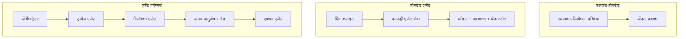
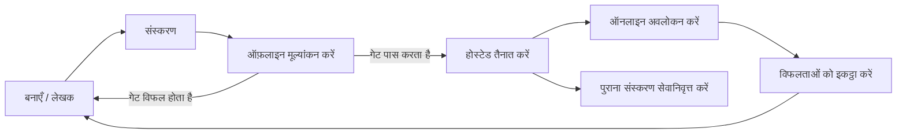
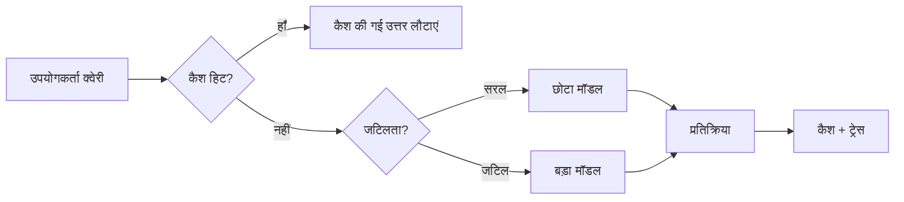
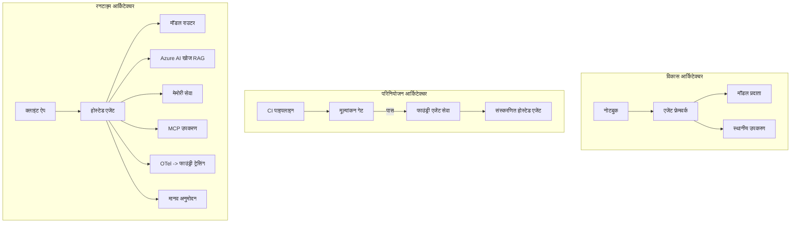

# माइक्रोसॉफ्ट फाउंड्री के साथ स्केलेबल एजेंट्स को तैनात करना


इस कोर्स के अब तक के भाग में आपने ऐसे एजेंट बनाए हैं जो आपके लैपटॉप पर चलते हैं, नोटबुक के अंदर, `az login` और कुछ पर्यावरण चर के द्वारा संचालित होते हैं। यही सीखने का सही तरीका है। लेकिन यह हजारों ग्राहकों के निर्भर होने वाले एजेंट को 3 बजे रात को चलाने का सही तरीका नहीं है।

यह पाठ "यह मेरे मशीन पर काम करता है" और "यह उत्पादन में विश्वसनीय और किफायती तरीके से काम करता है" के बीच के अंतर के बारे में है। हम उस अंतर को **Microsoft Foundry** और **Microsoft Foundry Agent Service** का उपयोग करके बंद करते हैं, और ऐसा हम एक वास्तविक ग्राहक सहायता एजेंट बनाकर करते हैं जिसमें टूल्स, पुनर्प्राप्ति, स्मृति, मूल्यांकन, और निगरानी होती है।

## परिचय

यह पाठ निम्नलिखित को कवर करेगा:

- एक **प्रोटोटाइप एजेंट** और एक **तैनात एजेंट** के बीच का अंतर, और क्यों संक्रमण मुख्यतः मॉडल *के चारों ओर* सब कुछ होता है।
- एजेंट्स के लिए **तैनाती पैटर्न**: क्लाइंट-होस्टेड, सर्विस-होस्टेड (होस्टेड एजेंट्स), और वर्कफ़्लो-ऑर्केस्ट्रेटेड।
- Microsoft Foundry पर **एजेंट जीवनचक्र** — बनाएं, संस्करणित करें, तैनात करें, मूल्यांकन करें, अवलोकन करें, सेवानिवृत्त करें।
- **स्केलिंग रणनीतियाँ**: मॉडल राउटिंग, कैशिंग, समवर्तीता, और स्टेटलेस डिजाइन।
- OpenTelemetry और Foundry ट्रेसिंग के साथ **पर्यवेक्षणीयता**।
- मॉडल चयन, राउटिंग, और मूल्यांकन गेट्स के माध्यम से **लागत अनुकूलन**।
- **एंटरप्राइज़ विचार**: शासन, मानवीय अनुमोदन, और उत्पादन में MCP सर्वर को सुरक्षित रूप से चलाना।

## सीखने के लक्ष्य

इस पाठ को पूरा करने के बाद, आप जानेंगे कि कैसे:

- किसी दिए गए एजेंट वर्कलोड के लिए सही तैनाती पैटर्न चुनें।
- एजेंट को Microsoft Foundry Agent Service पर तैनात करें ताकि वह संस्करणित, शासित, और पर्यवेक्षित हो सके।
- ट्रेसिंग के लिए एजेंट को उपकरण करें और एक मूल्यांकन पाइपलाइन सेट करें जो प्रत्येक रिलीज़ से पहले चलती हो।
- मॉडल राउटिंग और कैशिंग लागू करें ताकि स्केल पर विलंबता और लागत नियंत्रण में रहे।
- उच्च जोखिम वाले कार्यों के लिए मानवीय अनुमोदन गेट जोड़ें और MCP सर्वर को उत्पादन-सुरक्षित तरीके से एकीकृत करें।

## पूर्वापेक्षाएँ

यह पाठ यह मानता है कि आपने पहले के पाठ पूरे कर लिए हैं और इस पर सहज हैं:

- [Microsoft Agent Framework](../14-microsoft-agent-framework/README.md) (पाठ 14) के साथ एजेंट बनाना।
- [टूल उपयोग](../04-tool-use/README.md) (पाठ 4) और [Agentic RAG](../05-agentic-rag/README.md) (पाठ 5)।
- [एजेंट मेमोरी](../13-agent-memory/README.md) (पाठ 13) और [Agentic प्रोटोकॉल / MCP](../11-agentic-protocols/README.md) (पाठ 11)।
- [पर्यवेक्षणीयता और मूल्यांकन](../10-ai-agents-production/README.md) (पाठ 10) — यह पाठ सीधे इस पर आधारित है।

आपको इसके अलावा चाहिए होगा:

- कम से कम एक तैनात चैट मॉडल के साथ एक **Azure सदस्यता** और **Microsoft Foundry प्रोजेक्ट**।
- **Azure CLI** प्रमाणीकृत (`az login`)।
- Python 3.12+ और रिपॉज़िटरी में पैकेज [`requirements.txt`](../../../requirements.txt)।

## प्रोटोटाइप से उत्पादन तक: वास्तव में क्या बदलता है

एक प्रोटोटाइप एजेंट और एक उत्पादन एजेंट का मूल लूप समान होता है — सोचें, टूल कॉल करें, प्रतिक्रिया दें। जो बदलता है वह उस लूप के चारों ओर सब कुछ होता है। मॉडल शायद उत्पादन एजेंट का 20% होता है; बाकी 80% संचालन का ढांचा होता है।

| चिंता | प्रोटोटाइप | उत्पादन |
| --- | --- | --- |
| **होस्टिंग** | आपका नोटबुक में चलता है | संस्करणित और रोल आउट होने वाली होस्टेड सेवा के रूप में चलता है |
| **पहचान** | आपका `az login` टोकन | स्कोप्ड RBAC के साथ प्रबंधित पहचान |
| **स्थिति** | इन-मेमोरी, पुनः आरंभ पर खो जाता है | बाहरी (थ्रेड स्टोर, मेमोरी सेवा) |
| **विफलता** | आप ट्रेसबैक देखते हैं | पुनः प्रयास, फॉलबैक, डेड-लेटर, अलर्ट |
| **लागत** | "यह कुछ सेंट्स है" | प्रति अनुरोध ट्रैक्ड, राउटेड, कैश्ड, बजटेड |
| **गुणवत्ता** | आप आउटपुट को देखते हैं | प्रत्येक रिलीज़ से पहले स्वचालित रूप से मूल्यांकित |
| **विश्वास** | आप हर क्रिया को अनुमोदित करते हैं | नीति + जोखिम वाले कार्यों के लिए मानव-इन-द-लूप |

इस तालिका को ध्यान में रखें। नीचे प्रत्येक अनुभाग इनमें से किसी एक पंक्ति से संबंधित है।

## एजेंट तैनाती पैटर्न

तीन पैटर्न हैं जिन्हें आप अक्सर संयोजन में उपयोग करेंगे।

### 1. क्लाइंट-होस्टेड एजेंट्स

एजेंट ऑब्जेक्ट *आपके* एप्लिकेशन प्रोसेस के अंदर रहता है। आपका कोड सीधे मॉडल प्रदायक को कॉल करता है; तर्क लूप आपके सेवा में चलता है। यह हर पिछले पाठ ने किया है।

- **इसे तब उपयोग करें जब** आपको लूप पर पूर्ण नियंत्रण, कस्टम मिडलवेयर की जरूरत हो, या आप एजेंट को किसी मौजूदा बैकएंड में एम्बेड कर रहे हों।
- **व्यापार-बंद**: आपको खुद स्केलिंग, स्थिति, और लचीलापन संभालना होगा।

### 2. होस्टेड एजेंट्स (Foundry एजेंट सेवा)

एजेंट को Microsoft Foundry में *एक संसाधन के रूप में पंजीकृत* किया जाता है। Foundry तर्क लूप होस्ट करता है, थ्रेड्स को संग्रहीत करता है, सामग्री सुरक्षा और RBAC लागू करता है, और एजेंट को Foundry पोर्टल में दिखाता है। आपका ऐप एक पतला क्लाइंट बन जाता है जो थ्रेड बनाता है और प्रतिक्रियाएं पढ़ता है।

- **इसे तब उपयोग करें जब** आप टिकाऊपन, अंतर्निर्मित पर्यवेक्षणीयता, शासन, और कम परिचालन सतह क्षेत्र चाहते हैं।
- **व्यापार-बंद**: प्रबंधित रनटाइम के बदले कम स्तर का नियंत्रण।

### 3. एजेंट वर्कफ़्लोज़

कई एजेंट (और टूल) एक ग्राफ में संयोजित होते हैं जिसमें स्पष्ट नियंत्रण प्रवाह होता है — क्रमिक चरण, शाखा, मानवीय अनुमोदन नोड्स, और टिकाऊ चेकपॉइंट जो विराम और फिर से शुरू कर सकते हैं। यह माइक्रोसॉफ्ट एजेंट फ्रेमवर्क **वर्कफ़्लोज़** क्षमता है जो तैनाती पैमाने पर लागू की गई है।

- **इसे तब उपयोग करें जब** एक ही कार्य कई विशिष्ट एजेंटों को फैलाता है या बीच में एक अनुमोदन चरण की आवश्यकता होती है।
- **व्यापार-बंद**: अधिक गतिशील भाग; ऑर्केस्ट्रेशन-स्तर की पर्यवेक्षणीयता की जरूरत।



## Microsoft Foundry पर एजेंट जीवनचक्र

एजेंट तैनात करना एक बार की `पुश` नहीं है। यह एक लूप है, और यह काफी हद तक सॉफ़्टवेयर रिलीज़ चक्र जैसा दिखता है क्योंकि यह वास्तव में वही है।



मुख्य विचार, जो [पाठ 10](../10-ai-agents-production/README.md) से आया है: **ऑफलाइन मूल्यांकन एक गेट है, कोई बाद की सोच नहीं।** जब तक नया एजेंट संस्करण आपके मूल्यांकन स्तरों को पार नहीं कर लेता, तब तक वह निर्मित नहीं होता। ऑनलाइन पर्यवेक्षण फिर वास्तविक विश्व की विफलताओं को आपके ऑफलाइन परीक्षण सेट में वापस फीड करता है। यह पूरा लूप है।

## स्केलिंग रणनीतियां

एजेंट को स्केल करना स्टेटलेस वेब API को स्केल करने से अलग होता है, क्योंकि प्रत्येक अनुरोध कई महंगे मॉडल और टूल कॉल को ट्रिगर कर सकता है। चार तकनीकें अधिकांश लोड संभालती हैं।

**स्टेटलेस अनुरोध हैंडलिंग।** अपनी प्रोसेस मेमोरी में प्रति-उपयोगकर्ता स्थिति न रखें। बातचीत के थ्रेड्स को Foundry थ्रेड स्टोर या मेमोरी सेवा में स्थायी बनाएं ताकि किसी भी इंस्टेंस द्वारा कोई भी अनुरोध संभाला जा सके। यही आपको क्षैतिज स्केलिंग की अनुमति देता है — इंस्टेंस जोड़ें, कोई स्टिकी सत्र नहीं।

**मॉडल राउटिंग।** हर अनुरोध को आपके सबसे सक्षम (और सबसे महंगे) मॉडल की आवश्यकता नहीं होती। सरल अनुरोध — जैसे इरादा वर्गीकरण, संक्षिप्त तथ्यात्मक उत्तर — को एक छोटे, तेज मॉडल पर रूट करें, और बड़े मॉडल को वास्तविक तर्क के लिए आरक्षित रखें। Foundry का **Model Router** आपके लिए यह कर सकता है, या आप स्वयं एक हल्का वर्गीकर्ता लागू कर सकते हैं। आप प्रयोगशाला में DIY संस्करण बनाएंगे।

**प्रतिक्रिया कैशिंग।** कई समर्थन प्रश्न लगभग-डुप्लिकेट (जैसे "मैं अपना पासवर्ड कैसे रीसेट करूं?") होते हैं। सामान्य प्रश्नों के उत्तर कैश करें और बिना मॉडल को हिट किए उन्हें सर्व करें। एक मामूली कैश हिट दर भी लागत और विलंबता को महत्वपूर्ण रूप से कम करती है।

**समवर्तीता और बैकप्रेशर।** मॉडल प्रदायक के पास दर सीमाएं होती हैं। अपनी समवर्तीता को सीमित करें, एक्सपोनेंशियल बैकॉफ के साथ पुन: प्रयास करें, और विनम्रता से विफल हों (एक कतारबद्ध "हम इस पर काम कर रहे हैं" प्रतिक्रिया 500 (त्रुटि) से बेहतर है)।



## उत्पादन में पर्यवेक्षणीयता

आप उस चीज़ को संचालित नहीं कर सकते जिसे आप देख नहीं सकते। जैसा कि पाठ 10 में कवर किया गया, Microsoft Agent Framework स्वाभाविक रूप से **OpenTelemetry** ट्रेस जारी करता है — हर मॉडल कॉल, टूल इनवोकेशन, और ऑर्केस्ट्रेशन चरण एक स्पैन बन जाता है। उत्पादन में आप उन स्पैनों को Microsoft Foundry (या किसी भी OTel-अनुकूलन बैकएंड) को निर्यात करते हैं ताकि आप:

- एक ग्राहक शिकायत को प्रत्येक मॉडल और टूल कॉल के पार अंत-से-अंत ट्रेस कर सकें।
- समय के साथ प्रति अनुरोध p50/p95 विलंबता और लागत को देखें।
- त्रुटि-दर में अचानक वृद्धि और लागत विसंगतियों पर उपयोगकर्ताओं (या आपके वित्त टीम) के पहले अलर्ट करें।

```python
from agent_framework.observability import get_tracer

tracer = get_tracer()

with tracer.start_as_current_span("support_request") as span:
    span.set_attribute("customer.tier", "enterprise")
    span.set_attribute("routed.model", "gpt-4.1-mini")
    # एजेंट निष्पादन इस स्पैन के अंदर स्वचालित रूप से ट्रेस किया जाता है
```

`customer.tier` और `routed.model` जैसे गुण एक ट्रेस की दीवार को उत्तर योग्य प्रश्नों ("क्या एंटरप्राइज़ ग्राहक बहुत बार छोटे मॉडल को रूट किए जा रहे हैं?") में बदल देते हैं।

## लागत अनुकूलन

उत्पादन एजेंट्स में लागत मुख्य रूप से टोकन द्वारा नियंत्रित होती है। तीन लीवर, प्रभाव के क्रम में:

1. **मॉडल का सही आकार।** एक छोटा मॉडल जो आपका मूल्यांकन गेट पार करता है, आमतौर पर बड़ा मॉडल जो भी पार करता है उससे सस्ते होता हैं। मूल्यांकन का उपयोग करके यह साबित करें कि छोटा मॉडल पर्याप्त अच्छा है बजाय सावधानी के लिए सबसे बड़े मॉडल का डिफ़ॉल्ट चुनाव करने के।
2. **जटिलता के अनुसार राउट करें।** जैसा ऊपर कहा गया — केवल उन अनुरोधों के लिए बड़े मॉडल की कीमतें दें जिन्हें बड़े मॉडल के तर्क की जरूरत हो।
3. **ज़ोरदार कैशिंग।** सबसे सस्ता मॉडल कॉल वह होता है जिसे आप कभी नहीं करते।

मूल्यांकन गेट्स और लागत नियंत्रण एक ही अनुशासन हैं जो दो कोणों से देखे जाते हैं: मूल्यांकन आपको *गुणवत्ता की आधारशिला* बताता है, राउटिंग और कैशिंग आपको उस आधारशिला की *लागत* के जितना संभव हो सके पास रखती हैं।

## एंटरप्राइज़ तैनाती विचार

**शासन।** होस्टेड एजेंट्स Foundry के RBAC, सामग्री सुरक्षा, और ऑडिट लॉगिंग को विरासत में लेते हैं। प्रत्येक एजेंट को कम से कम विशेषाधिकार वाली प्रबंधित पहचान दें जो उसे चाहिए — ज्ञान आधार तक केवल पढ़ने का एक्सेस, टिकटिंग API तक स्कोप्ड एक्सेस, और कुछ नहीं।

**मानव-इन-द-लूप।** कुछ क्रियाएं पूरी तरह से स्वचालित करने के लिए बहुत महत्वपूर्ण होती हैं — धनवापसी जारी करना, खाता हटाना, कानूनी टीम को बढ़ाना। Microsoft Agent Framework **अनुमोदन-आवश्यक** टूल्स का समर्थन करता है: एजेंट क्रिया प्रस्तावित करता है, निष्पादन रोक दिया जाता है, एक मानव उसे मंजूरी या अस्वीकृति देता है, और वर्कफ़्लो फिर से शुरू होता है। आपने इस प्रिमिटिव को [पाठ 6](../06-building-trustworthy-agents/README.md) में देखा था; यहाँ आप इसे तैनात करते हैं।

**उत्पादन में MCP।** [MCP](../11-agentic-protocols/README.md) आपके एजेंट को बाहरी टूल्स को एक मानकीकृत इंटरफ़ेस के माध्यम से उपयोग करने देता है। उत्पादन में, हर MCP सर्वर को अविश्वसनीय सीमा के रूप में मानें: सर्वर संस्करण पिन करें, इसे स्कोप्ड पहचान के साथ चलाएं, इसके आउटपुट को मान्य करें, और कभी भी इसे गोपनीय जानकारी न दें। एक MCP सर्वर निर्भरता है, और निर्भरताएं पैच, ऑडिट, और दर-सीमित होती हैं।



ये तीन आरेख — विकास, तैनाती, रनटाइम — एक ही एजेंट के उसके जीवन के तीन चरण हैं। निम्नलिखित लैब आपको इसे बनाने के लिए मार्गदर्शन करेगी।

## व्यावहारिक लैब: एक उत्पादन-तैयार ग्राहक सहायता एजेंट

[`code_samples/16-python-agent-framework.ipynb`](./code_samples/16-python-agent-framework.ipynb) खोलें और अंत तक काम करें। आप एक **Contoso ग्राहक सहायता एजेंट** बनाएंगे जिसमें हर उत्पादन से संबंधित चिंता जुड़ी होगी:

1. **टूल कॉलिंग** — ऑर्डर स्थिति देखें और समर्थन टिकट खोलें।
2. **RAG** — ज्ञान आधार से नीति प्रश्नों का उत्तर दें (Azure AI Search, जिसमें एक इन-मेमोरी फॉलबैक है जिससे नोटबुक बिना Search संसाधन के चलता है)।
3. **मेमोरी** — बातचीत के मोड़ों में ग्राहक को याद रखें।
4. **मॉडल राउटिंग** — एक जटिलता वर्गीकर्ता प्रत्येक अनुरोध को छोटे या बड़े मॉडल पर रूट करता है।
5. **प्रतिक्रिया कैशिंग** — दोहराए गए प्रश्न कैश से सर्व किए जाते हैं।
6. **मानवीय अनुमोदन** — एक सीमा से ऊपर धनवापसी मानवीय मंजूरी के लिए विरामित होती है।
7. **मूल्यांकन पाइपलाइन** — एक छोटा ऑफलाइन परीक्षण सेट एजेंट का स्कोर करता है और रिलीज़ गेट के रूप में कार्य करता है।
8. **पर्यवेक्षणीयता** — प्रत्येक अनुरोध के चारों ओर OpenTelemetry ट्रेसिंग।

### मार्गदर्शन

नोटबुक को ऐसे व्यवस्थित किया गया है कि प्रत्येक उत्पादन चिंता एक स्व-निहित, चलाने योग्य अनुभाग हो। इसका दिल है राउटिंग-प्लस-कैशिंग अनुरोध हैंडलर:

```python
async def handle_support_request(query: str, customer_id: str) -> str:
    # 1. जब संभव हो तो कैश से सर्व करें।
    cached = response_cache.get(normalize(query))
    if cached:
        return cached

    # 2. लागत नियंत्रण के लिए जटिलता के अनुसार रूटिंग करें।
    model = "gpt-4.1-mini" if is_simple(query) else "gpt-4.1"

    # 3. अवलोकनीयता के लिए एजेंट को ट्रेस स्पैन के अंदर चलाएं।
    with tracer.start_as_current_span("support_request") as span:
        span.set_attribute("routed.model", model)
        span.set_attribute("customer.id", customer_id)
        response = await support_agent.run(query, model=model)

    # 4. कैश करें और लौटाएं।
    response_cache.set(normalize(query), response.text)
    return response.text
```

रिलीज़ की सुरक्षा करने वाला मूल्यांकन गेट इस प्रकार दिखता है:

```python
async def evaluation_gate(agent, test_cases, threshold: float = 0.8) -> bool:
    passed = 0
    for case in test_cases:
        result = await agent.run(case["input"])
        if score_response(result.text, case["expected"]) >= 0.8:
            passed += 1
    pass_rate = passed / len(test_cases)
    print(f"Evaluation pass rate: {pass_rate:.0%} (gate: {threshold:.0%})")
    return pass_rate >= threshold  # केवल तभी तैनात करें जब गेट पास हो जाए
```

प्रत्येक पंक्ति पढ़ें — नोटबुक प्रिमिटिव्स को जानबूझकर छोटा रखता है ताकि फ्रेमवर्क कॉल के पीछे कुछ न छिपे।

## तैनात एजेंट का स्मोक टेस्ट द्वारा सत्यापन

ऊपर दिया गया मूल्यांकन गेट आपके एजेंट ऑब्जेक्ट के खिलाफ *ऑफलाइन* चलता है। एक बार जब एजेंट को होस्टेड एजेंट के रूप में तैनात कर दिया जाता है, तो आपको एक और भी आसान जांच की जरूरत होती है: **क्या तैनात एंडपॉइंट वास्तव में जवाब दे रहा है?**

"सफलतापूर्वक" तैनात करना केवल यह साबित करता है कि नियंत्रण विमान ने परिभाषा स्वीकार कर ली है — यह साबित नहीं करता कि एजेंट जवाब देता है। एक गायब निर्भरता, खराब मॉडल राउटिंग, या एक समाप्त कनेक्शन एक हरी तैनाती छोड़ सकता है जो कुछ भी वापस नहीं देती। एक **स्मोक टेस्ट** इसे सेकंडों में पकड़ लेता है, प्रत्येक तैनाती पर, पूर्ण मूल्यांकन की लागत के बिना।

यह रिपोज़िटरी एक तैयार-से-उपयोग स्मोक-टेस्ट पाइपलाइन के साथ आती है जो [AI स्मोक टेस्ट](https://github.com/marketplace/actions/ai-smoke-test) GitHub एक्शन पर आधारित है:

- **कैटलॉग** — [`tests/lesson-16-smoke-tests.json`](../../../tests/lesson-16-smoke-tests.json) में Contoso समर्थन एजेंट के लिए प्रॉम्प्ट और अनुमानों (स्थापित नीति उत्तर, ऑर्डर लुकअप, विषय पर बने रहना, और बहु-टर्न थ्रेड निरंतरता) शामिल हैं। अन्य पाठों के एजेंट्स के कैटलॉग इसके साथ रहते हैं — देखें [`tests/README.md`](../tests/README.md)।
- **वर्कफ़्लो** — [`.github/workflows/smoke-test.yml`](../../../.github/workflows/smoke-test.yml) Azure OIDC के साथ लॉगिन करता है और प्रत्येक प्रॉम्प्ट को एजेंट के Responses एंडपॉइंट पर POST करता है, किसी भी अनुमोदन चूक पर जॉब असफल हो जाता है।

```yaml
- name: Smoke-test hosted agent
  uses: JFolberth/ai-smoketest@v1
  with:
    project_endpoint: ${{ inputs.project_endpoint }}
    agent_name: ContosoSupportAgent
    tests_file: tests/lesson-16-smoke-tests.json
```


अपने एजेंट को तैनात करने के बाद **Actions** टैब से इसे चलाएं, अपने Foundry प्रोजेक्ट एंडपॉइंट और एजेंट नाम प्रदान करें। संघीकृत पहचान को Foundry प्रोजेक्ट स्कोप पर **Azure AI User** भूमिका की आवश्यकता होती है। लेयर्स (परतों) को पिरामिड के रूप में सोचें: स्मोक टेस्ट (पहुंच योग्य और उत्तर दे रहा है?) हर तैनाती पर चलते हैं, ऑफ़लाइन मूल्यांकन (पर्याप्त अच्छा है क्या वितरण के लिए?) पदोन्नति से पहले चलता है, और ऑनलाइन मूल्यांकन (यह वास्तविक में कैसा प्रदर्शन कर रहा है?) लगातार चलता रहता है।

## ज्ञान जांच

असाइनमेंट पर जाने से पहले अपने समझ का परीक्षण करें।

**1. उत्पादन एजेंट का लगभग कितना हिस्सा "मॉडल" होता है, और बाकी क्या होता है?**

<details>
<summary>उत्तर</summary>

मॉडल सिस्टम का एक अल्पसंख्यक होता है — अक्सर इसे लगभग 20% के रूप में माना जाता है। बाकी हिस्सा परिचालन कंकाल है: होस्टिंग और संस्करण प्रबंधन, पहचान और RBAC, बाहरीकृत स्थिति, विफलता प्रबंधन, लागत ट्रैकिंग, मूल्यांकन, और मानव-इन-लूप नियंत्रण। उत्पादन में जाने का मुख्य उद्देश्य तर्क के लूप के *आसपास* सब कुछ बनाना है।
</details>

**2. आप कभी एक Hosted Agent को क्लाइंट-होस्टेड एजेंट की जगह कब चुनेंगे?**

<details>
<summary>उत्तर</summary>

जब आप एक प्रबंधित रनटाइम चाहते हैं जिसमें अंतर्निहित टिकाऊपन (ऐसे थ्रेड जो स्थायी रहते हैं और पुनः आरंभ कर सकते हैं), अवलोकनीयता, सामग्री सुरक्षा, और RBAC शामिल हों, और आप तर्क लूप के कम-स्तरीय नियंत्रण के कुछ भाग को कम परिचालन सतह क्षेत्र के लिए त्यागने को तैयार हों। जब आपको पूरी लूप नियंत्रण की आवश्यकता हो या एजेंट को किसी मौजूदा बैकएंड में एम्बेड कर रहे हों तब क्लाइंट-होस्टेड पसंदीदा होता है।
</details>

**3. एक स्केलेबल एजेंट को अपनी स्वयं की प्रोसेस मेमोरी में स्टेटलेस क्यों होना चाहिए?**

<details>
<summary>उत्तर</summary>

ताकि कोई भी इंस्टेंस किसी भी अनुरोध को संभाल सके, जो कि स्टिकी सत्रों के बिना क्षैतिज स्केलिंग की अनुमति देता है। प्रति-उपयोगकर्ता वार्तालाप स्थिति को थ्रेड स्टोर या मेमोरी सेवा में बाहरीकृत कर दिया जाता है। यदि स्थिति प्रोसेस मेमोरी में रहती, तो पुनः प्रारंभ पर यह खो जाएगी और आप लोड को स्वतंत्र रूप से वितरित नहीं कर सकते।
</details>

**4. मॉडल राउटिंग किस समस्या को हल करता है, और इसका मूल्यांकन से क्या संबंध है?**

<details>
<summary>उत्तर</summary>

राउटिंग सरल अनुरोधों को एक छोटे, सस्ते, तेज मॉडल पर भेजता है और बड़े मॉडल को वास्तविक तर्क-वितर्क के लिए आरक्षित करता है, जिससे लेटेंसी और लागत दोनों नियंत्रित होती हैं। यह मूल्यांकन से संबंधित है क्योंकि मूल्यांकन यह सिद्ध करता है कि छोटा मॉडल एक अनुरोध वर्ग के लिए पर्याप्त अच्छा है — बिना मूल्यांकन के राउटिंग केवल अनुमान लगाना है।
</details>

**5. "मूल्यांकन गेट" क्या होता है और यह जीवन चक्र में कहाँ स्थित होता है?**

<details>
<summary>उत्तर</summary>

एक मूल्यांकन गेट एक नया एजेंट संस्करण के विरूद्ध ऑफ़लाइन परीक्षण सेट चलाता है और तैनाती को तब तक ब्लॉक करता है जब तक पास प्रतिशत किसी सीमा से ऊपर न हो। यह जीवन चक्र में "संस्करण" और "तैनाती" के बीच होता है, गुणवत्ता को रिलीज़ की पूर्वशर्त बनाता है न कि इसे शिपिंग के बाद जांचने के लिए।
</details>

**6. उत्पादन में MCP सर्वर को अनविश्वसनीय सीमा क्यों माना जाना चाहिए?**

<details>
<summary>उत्तर</summary>

क्योंकि यह एक बाहरी निर्भरता है जिस पर आपका एजेंट कॉल करता है। आपको इसका संस्करण पिन करना चाहिए, इसे एक स्कोप्ड पहचान के साथ चलाना चाहिए, इसके आउटपुट को मान्य करना चाहिए, इसे रेट-लिमिट करना चाहिए, और कभी भी इसे गोपनीय जानकारी नहीं देनी चाहिए — यह वही अनुशासन है जो आप किसी भी तृतीय-पक्ष निर्भरता के लिए लागू करते हैं। इसके आउटपुट आपके एजेंट के तर्क में चले जाते हैं, इसलिए बिना सत्यापन के विश्वास सुरक्षा जोखिम है।
</details>

**7. कौन सा एकल परिवर्तन सामान्यतः उत्पादन एजेंट लागत पर सबसे बड़ा प्रभाव डालता है, और क्यों?**

<details>
<summary>उत्तर</summary>

मॉडल का सही आकार चुनना — सबसे छोटा मॉडल जो अभी भी आपका मूल्यांकन गेट पास करता हो। लागत टोकनों द्वारा प्रभुत्वशाली होती है, और गुणवत्ता मानक को पूरा करने वाला छोटा मॉडल लगभग हमेशा बड़े मॉडल से सस्ता होता है। कैशिंग और राउटिंग फिर लागत को और कम करते हैं, लेकिन सही मूल मॉडल चुनना सबसे बड़ा प्राथमिक प्रभाव डालता है।
</details>

**8. `customer.tier` और `routed.model` जैसे स्पैन विशेषताएँ अवलोकनीयता में क्या भूमिका निभाती हैं?**

<details>
<summary>उत्तर</summary>

ये रॉ ट्रेसेस को उत्तर योग्य व्यापार सवालों में बदल देती हैं। बिना विशेषताओं के आपके पास केवल स्पैन की एक दीवार होती है; इनके साथ आप पूछ सकते हैं "क्या एंटरप्राइज ग्राहक बहुत बार छोटे मॉडल पर राउट हो रहे हैं?" या "कौन सा मॉडल हमारे सबसे धीमे अनुरोधों को संभालता है?" विशेषताएँ वे आयाम हैं जिनसे आप अपनी संचालन के अनुसार टेलीमेट्री को स्लाइस करते हैं।
</details>

## असाइनमेंट

लैब से ग्राहक सहायता एजेंट लें और इसे एक विशिष्ट परिदृश्य के लिए मजबूत करें: **एक SaaS कंपनी के लिए सब्सक्रिप्शन बिलिंग सपोर्ट एजेंट।**

आपकी सबमिशन में निम्न शामिल होना चाहिए:

1. बिलिंग-संबंधित टूल्स के साथ **टूल्स बदलें**: `get_subscription_status`, `get_invoice`, और `issue_credit` (50 डॉलर से ऊपर के क्रेडिट के लिए मानव मंजूरी आवश्यक)।
2. कंपनी की रिफंड नीति, बिलिंग चक्र, और रद्द करने की नीति को कवर करने वाले तीन RAG दस्तावेज **जोड़ें**।
3. मूल्यांकन सेट को कम से कम आठ मामलों तक **विस्तारित करें**, जिनमें कम से कम दो वे शामिल हों जो *मानव मंजूरी मार्ग* को ट्रिगर करें, और पुष्टि करें कि आपका मूल्यांकन गेट ठीक से पास या असफल हो रहा है।
4. एक लागत रिपोर्ट **जोड़ें**: एजेंट के माध्यम से दस मिश्रित क्वेरी चलाने के बाद, बताएं कि कितनी क्वेरियों ने छोटे मॉडल का उपयोग किया, कितनी ने बड़े मॉडल का, और कितनी कैश से सेवा की गईं।

एक छोटा पैराग्राफ (मर्कडाउन सेल में) लिखें जिसमें आप बताएं कि आपने कौन सा मॉडल-राउटिंग नियम चुना और वास्तविक ट्रैफिक के साथ इसे कैसे मान्य करेंगे। कोई एक सही उत्तर नहीं है — आपको यह जांचा जाएगा कि क्या उत्पादन संबंधी चिंताएँ सुसंगत रूप से जोड़ी गई हैं।

## सारांश

इस पाठ में आपने Microsoft Foundry के साथ एक एजेंट को प्रोटोटाइप से उत्पादन में स्थानांतरित किया:

- मॉडल के चारों ओर का **परिचालन कंकाल** — होस्टिंग, पहचान, स्थिति, विफलता प्रबंधन, लागत, गुणवत्ता, और विश्वास — उत्पादन में कूदने का मुख्य हिस्सा है।
- तीन **तैनाती पैटर्न** आप सीख चुके हैं — क्लाइंट-होस्टेड, Hosted Agents, और Agent Workflows — और प्रत्येक कब उपयुक्त है।
- आपने **एजेंट जीवन चक्र** को समझा, जहां ऑफ़लाइन **मूल्यांकन एक रिलीज गेट के रूप में कार्य करता है** और ऑनलाइन अवलोकनीयता विफलताओं को परीक्षण सेट में वापस भेजती है।
- आपने **स्केलिंग रणनीतियाँ लागू कीं** — स्टेटलेस डिज़ाइन, मॉडल राउटिंग, कैशिंग, और बाउंडेड समवर्तीता — और उन्हें **लागत अनुकूलन** से जोड़ा।
- आपने **एंटरप्राइज नियंत्रण शामिल किए**: RBAC, मानव-इन-लूप अनुमोदन, और उत्पादन-सुरक्षित MCP इंटीग्रेशन।
- आपने एक **उत्पादन-तैयार ग्राहक सहायता एजेंट** बनाया जिसने इन सभी चिंताओं को चलने वाले कोड में जोड़ा।

अगला पाठ विपरीत यात्रा करता है: एजेंट्स को क्लाउड में स्केल करने के बजाय, आप उन्हें *एकल डेवलपर मशीन* पर उतारेंगे और पूरी तरह स्थानीय रूप से चलाएंगे।

## अतिरिक्त संसाधन

- <a href="https://learn.microsoft.com/azure/ai-foundry/what-is-azure-ai-foundry" target="_blank">Microsoft Foundry प्रलेखन</a>
- <a href="https://learn.microsoft.com/azure/ai-foundry/agents/overview" target="_blank">Microsoft Foundry एजेंट सेवा अवलोकन</a>
- <a href="https://aka.ms/ai-agents-beginners/agent-framework" target="_blank">Microsoft एजेंट फ्रेमवर्क</a>
- <a href="https://learn.microsoft.com/azure/ai-foundry/concepts/model-router" target="_blank">Microsoft Foundry में मॉडल राउटर</a>
- <a href="https://learn.microsoft.com/azure/search/search-what-is-azure-search" target="_blank">Azure AI सर्च</a>
- <a href="https://opentelemetry.io/" target="_blank">OpenTelemetry</a>
- <a href="https://github.com/marketplace/actions/ai-smoke-test" target="_blank">AI स्मोक टेस्ट GitHub एक्शन</a>
- <a href="https://modelcontextprotocol.io/" target="_blank">मॉडल कॉन्टेक्स्ट प्रोटोकॉल (MCP)</a>

## पिछला पाठ

[कंप्यूटर उपयोग एजेंट्स बनाना (CUA)](../15-browser-use/README.md)

## अगला पाठ

[स्थानीय AI एजेंट बनाना](../17-creating-local-ai-agents/README.md)

---

<!-- CO-OP TRANSLATOR DISCLAIMER START -->
**अस्वीकरण**:
इस दस्तावेज़ का अनुवाद AI अनुवाद सेवा [Co-op Translator](https://github.com/Azure/co-op-translator) का उपयोग करके किया गया है। जबकि हम सटीकता के लिए प्रयास करते हैं, कृपया ध्यान दें कि स्वचालित अनुवादों में त्रुटियाँ या अशुद्धियाँ हो सकती हैं। मूल दस्तावेज़ अपनी मूल भाषा में ही प्रामाणिक स्रोत माना जाना चाहिए। महत्वपूर्ण जानकारी के लिए, पेशेवर मानव अनुवाद की सिफारिश की जाती है। इस अनुवाद के उपयोग से उत्पन्न किसी भी गलतफहमी या गलत व्याख्या के लिए हम उत्तरदायी नहीं हैं।
<!-- CO-OP TRANSLATOR DISCLAIMER END -->