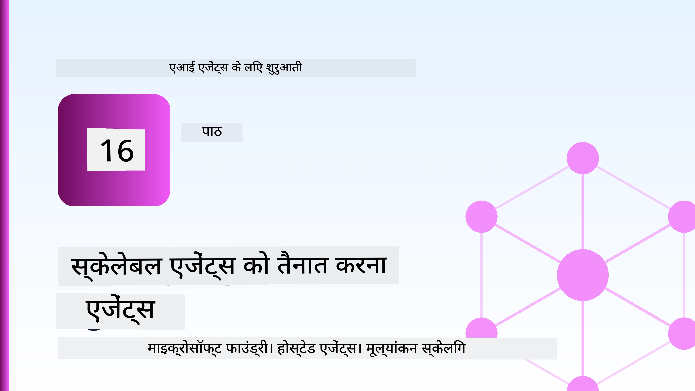
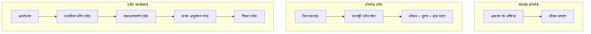
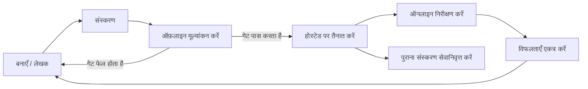
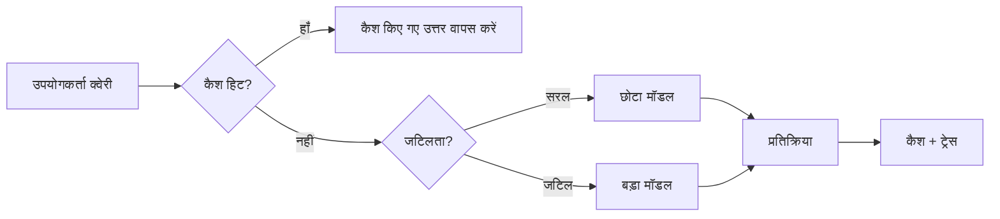
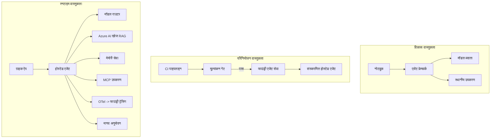

# माइक्रोसॉफ्ट फाउंड्री के साथ स्केलेबल एजेंट्स तैनात करना



इस कोर्स में अब तक आपने ऐसे एजेंट बनाए हैं जो आपके लैपटॉप पर, एक नोटबुक के अंदर चलते हैं, जिन्हें `az login` और कुछ पर्यावरण चर द्वारा नियंत्रित किया जाता है। यह सीखने का बिल्कुल सही तरीका है। यह सही तरीका नहीं है कि एक एजेंट को चलाया जाए जिस पर हजारों ग्राहक 3 बजे सुबह निर्भर करते हों।

यह पाठ "यह मेरी मशीन पर काम करता है" और "यह उत्पादन में विश्वसनीय और किफायती तरीके से काम करता है" के बीच के अंतर के बारे में है। हम इस अंतर को **माइक्रोसॉफ्ट फाउंड्री** और **माइक्रोसॉफ्ट फाउंड्री एजेंट सेवा** का उपयोग करके बंद करते हैं, और इसे एक वास्तविक ग्राहक सहायता एजेंट बनाकर करते हैं जिसमें उपकरण, पुनः प्राप्ति, मेमोरी, मूल्यांकन, और निगरानी शामिल है।

## परिचय

इस पाठ में निम्न विषय शामिल होंगे:

- **प्रोटोटाइप एजेंट** और **तैनात एजेंट** के बीच का अंतर, और क्यों यह संक्रमण मुख्य रूप से मॉडल के चारों ओर की सभी चीज़ों के बारे में है।
- एजेंट्स के लिए **तैनाती पैटर्न**: क्लाइंट-होस्टेड, सेवा-होस्टेड (होस्टेड एजेंट्स), और वर्कफ्लो-ऑर्केस्ट्रेटेड।
- माइक्रोसॉफ्ट फाउंड्री पर **एजेंट जीवनचक्र** — बनाना, संस्करण करना, तैनात करना, मूल्यांकन करना, निरीक्षण करना, सेवानिवृत्त करना।
- **स्केलिंग रणनीतियां**: मॉडल रूटिंग, कैशिंग, समवर्तीता, और स्टेटलेस डिजाइन।
- OpenTelemetry और Foundry ट्रेसिंग के साथ **प्रेक्षणीयता**।
- मॉडल चयन, रूटिंग, और मूल्यांकन गेट्स के माध्यम से **लागत अनुकूलन**।
- **एंटरप्राइज विचार**: शासन, मानव अनुमोदन, और उत्पादन में MCP सर्वरों को सुरक्षित रूप से चलाना।

## सीखने के लक्ष्य

इस पाठ को पूरा करने के बाद, आप जानेंगे कि कैसे:

- किसी दिए गए एजेंट वर्कलोड के लिए सही तैनाती पैटर्न चुनें।
- एजेंट को माइक्रोसॉफ्ट फाउंड्री एजेंट सेवा पर तैनात करें ताकि वह संस्करणित, शासित, और प्रेक्षणीय हो।
- एजेंट को ट्रेसिंग के लिए सुसज्जित करें और एक मूल्यांकन पाइपलाइन सेट करें जो हर रिलीज़ से पहले चले।
- मॉडल रूटिंग और कैशिंग लागू करें ताकि लेटेंसी और लागत पैमाने पर नियंत्रण में रहे।
- उच्च-जोखिम कार्यों के लिए मानव अनुमोदन गेट जोड़ें और उत्पादन-सुरक्षित तरीके से MCP सर्वर को एकीकृत करें।

## आवश्यकताएँ

इस पाठ में यह माना गया है कि आपने पूर्व के पाठ पूरे कर लिए हैं और आप निम्न के साथ परिचित हैं:

- [माइक्रोसॉफ्ट एजेंट फ्रेमवर्क](../14-microsoft-agent-framework/README.md) (पाठ 14) के साथ एजेंट बनाना।
- [टूल उपयोग](../04-tool-use/README.md) (पाठ 4) और [एजेंटिक RAG](../05-agentic-rag/README.md) (पाठ 5)।
- [एजेंट मेमोरी](../13-agent-memory/README.md) (पाठ 13) और [एजेंटिक प्रोटोकॉल / MCP](../11-agentic-protocols/README.md) (पाठ 11)।
- [प्रेक्षणीयता और मूल्यांकन](../10-ai-agents-production/README.md) (पाठ 10) — यह पाठ सीधे उसी पर आधारित है।

आपको इसके अलावा आवश्यकता होगी:

- एक **Azure सदस्यता** और एक **माइक्रोसॉफ्ट फाउंड्री प्रोजेक्ट** जिसमें कम से कम एक तैनात चैट मॉडल हो।
- प्रमाणित **Azure CLI** (`az login`)।
- पायथन 3.12+ और रिपॉजिटरी में मौजूद पैकेज [`requirements.txt`](../../../requirements.txt)।

## प्रोटोटाइप से उत्पादन तक: वास्तव में क्या बदलता है

एक प्रोटोटाइप एजेंट और एक उत्पादन एजेंट में एक ही मूल लूप साझा होता है — तर्क, उपकरण कॉल करें, प्रतिक्रिया दें। जो बदलता है वह उस लूप के चारों ओर सब कुछ है। उत्पादन एजेंट में मॉडल लगभग 20% होता है; बाकी 80% संचालन कंकाल है।

| चिंता | प्रोटोटाइप | उत्पादन |
| --- | --- | --- |
| **होस्टिंग** | आपके नोटबुक में चलता है | होस्ट की गई सेवा के रूप में चलता है, संस्करणित और रोल आउट किया गया |
| **पहचान** | आपका `az login` टोकन | स्कोप्ड RBAC के साथ प्रबंधित पहचान |
| **स्थिति** | मेमोरी में, पुनः प्रारंभ पर खो जाता है | बाहरीकृत (थ्रेड स्टोर, मेमोरी सेवा) |
| **विफलता** | आप ट्रेसबैक देखते हैं | रिट्राई, फालबैक, डेड-लेटर, अलर्ट्स |
| **लागत** | "यह कुछ सेंट्स है" | अनुरोध के अनुसार ट्रैक, रूटेड, कैश, बजटेड |
| **गुणवत्ता** | आप आउटपुट जांचते हैं | हर रिलीज़ से पहले स्वचालित रूप से मूल्यांकित |
| **विश्वास** | आप हर कार्रवाई को अनुमोदित करते हैं | जोखिम भरे कार्यों के लिए नीति + मानव-इन-द-लूप |

इस तालिका को ध्यान में रखें। नीचे हर अनुभाग इनमें से किसी न किसी पंक्ति से मेल खाता है।

## एजेंट तैनाती पैटर्न

तीन पैटर्न हैं जिन्हें आप अक्सर संयोजित रूप में उपयोग करेंगे।

### 1. क्लाइंट-होस्टेड एजेंट्स

एजेंट ऑब्जेक्ट *आपके* एप्लिकेशन प्रोसेस के अंदर रहता है। आपका कोड सीधे मॉडल प्रदाता को कॉल करता है; तर्क लूप आपके सेवा में चलता है। यही हर पूर्व पाठ ने किया है।

- **जब उपयोग करें** जब आपको लूप पर पूर्ण नियंत्रण चाहिए, कस्टम मिडलवेयर चाहिए, या आप एजेंट को किसी मौजूदा बैकएंड में एम्बेड कर रहे हैं।
- **संधान**: आप खुद स्केलिंग, स्थिति और पुनरुत्थान का स्वामित्व रखते हैं।

### 2. होस्टेड एजेंट्स (फाउंड्री एजेंट सेवा)

एजेंट को माइक्रोसॉफ्ट फाउंड्री में *एक संसाधन के रूप में पंजीकृत* किया जाता है। फाउंड्री तर्क लूप की मेजबानी करता है, थ्रेड्स संग्रहीत करता है, सामग्री सुरक्षा और RBAC लागू करता है, और एजेंट को फाउंड्री पोर्टल में दिखाता है। आपकी ऐप पतली क्लाइंट बन जाती है जो थ्रेड बनाती है और प्रतिक्रियाएँ पढ़ती है।

- **जब उपयोग करें** जब आप स्थायित्व, अंतर्निर्मित प्रेक्षणीयता, शासन, और कम परिचालन क्षेत्र चाहते हैं।
- **संधान**: प्रबंधित रनटाइम के बदले कम लो-लेवल नियंत्रण।

### 3. एजेंट वर्कफ्लोज़

कई एजेंट (और टूल) स्पष्ट नियंत्रण प्रवाह के साथ एक ग्राफ में संयोजित होते हैं — क्रमिक चरण, शाखाएँ, मानव अनुमोदन नोड्स, और टिकाऊ चेकपॉइंट जिन्हें विराम दिया जा सकता है और फिर से शुरू किया जा सकता है। यह माइक्रोसॉफ्ट एजेंट फ्रेमवर्क की **वर्कफ्लोज़** क्षमता है, जो तैनाती पैमाने पर लागू होती है।

- **जब उपयोग करें** जब एक अकेले कार्य में कई विशेषज्ञ एजेंट शामिल हों या बीच में अनुमोदन चरण की आवश्यकता हो।
- **संधान**: अधिक गतिशील भाग; ऑर्केस्ट्रेशन-स्तर की प्रेक्षणीयता आवश्यक।



## माइक्रोसॉफ्ट फाउंड्री पर एजेंट जीवनचक्र

एजेंट तैनात करना एक बार का `push` नहीं है। यह एक लूप है, और यह सॉफ़्टवेयर रिलीज़ चक्र की तरह दिखता है क्योंकि वास्तव में यही होता है।



मुख्य विचार, [पाठ 10](../10-ai-agents-production/README.md) से लिया गया है: **ऑफ़लाइन मूल्यांकन एक गेट है, अति विचार नहीं।** नया एजेंट संस्करण केवल तभी तैनात होता है जब वह आपके मूल्यांकन मानदंडों को पूरा करता है। ऑनलाइन प्रेक्षण वास्तविक विश्व की विफलताओं को आपके ऑफ़लाइन परीक्षण सेट में वापस डालता है। यही पूरा लूप है।

## स्केलिंग रणनीतियाँ

एजेंट को स्केल करना एक स्टेटलेस वेब API को स्केल करने से अलग है, क्योंकि हर अनुरोध कई महंगे मॉडल और टूल कॉल्स को प्रेरित कर सकता है। चार तकनीकें मुख्य लोड संभालती हैं।

**स्टेटलेस अनुरोध हैंडलिंग।** अपनी प्रक्रिया मेमोरी में प्रति-उपयोगकर्ता कोई स्थिति न रखें। बातचीत थ्रेड्स को फाउंड्री थ्रेड स्टोर या मेमोरी सेवा में सहेजें ताकि कोई भी इंस्टेंस किसी भी अनुरोध को संभाल सके। इससे आप क्षैतिज रूप से स्केल कर सकते हैं—इंस्टेंस जोड़ें, कोई चिपचिपे सत्र नहीं।

**मॉडल रूटिंग।** हर अनुरोध को आपके सबसे सक्षम (और सबसे महंगे) मॉडल की जरूरत नहीं होती। सरल अनुरोधों — इंटेंट वर्गीकरण, संक्षिप्त तथ्यात्मक उत्तर — को एक छोटे, तेज़ मॉडल पर भेजें, और वास्तविक तर्क के लिए बड़े मॉडल को आरक्षित रखें। फाउंड्री का **मॉडल राउटर** आपके लिए यह कर सकता है, या आप खुद हल्का वर्गीकार कर सकते हैं। आप इस DIY संस्करण को लैब में बनाएंगे।

**प्रतिक्रिया कैशिंग।** कई समर्थन प्रश्न लगभग डुप्लिकेट होते हैं ("मैं अपना पासवर्ड कैसे रीसेट करूं?")। सामान्य प्रश्नों के उत्तर कैश करें और उन्हें मॉडल को हटाए बिना सर्व करें। यहां तक कि एक मामूली कैश हिट रेट भी लागत और विलंबता को काफी कम कर देता है।

**समवर्तीता और बेकप्रेशर।** मॉडल प्रदाताओं के रेट लिमिट्स होते हैं। अपनी समवर्तीता सीमान्त करें, घातीय बैकऑफ के साथ पुनः प्रयास करें, और धीरे-धीरे विफल हों (सीधी 500 के बजाय कतारबद्ध "हम संभाल रहे हैं" प्रतिक्रिया बेहतर है)।



## उत्पादन में प्रेक्षणीयता

आप उस चीज़ को संचालित नहीं कर सकते जिसे आप देख नहीं सकते। जैसा कि पाठ 10 में बताया गया है, माइक्रोसॉफ्ट एजेंट फ्रेमवर्क नटिवली **OpenTelemetry** ट्रेस जारी करता है—हर मॉडल कॉल, उपकरण आह्वान, और ऑर्केस्ट्रेशन चरण एक स्पैन बनता है। उत्पादन में आप उन स्पैन्स को माइक्रोसॉफ्ट फाउंड्री (या कोई भी OTel-संगत बैकएंड) को निर्यात करते हैं ताकि आप:

- एक एकल ग्राहक शिकायत को अंत से अंत तक हर मॉडल और टूल कॉल में ट्रेस कर सकें।
- समय के साथ p50/p95 विलंबता और प्रति अनुरोध लागत देखें।
- त्रुटि दर में वृद्धि और लागत असामान्यताओं पर अलर्ट सेट करें इससे पहले कि आपके उपयोगकर्ता (या आपकी वित्त टीम) इसे नोटिस करें।

```python
from agent_framework.observability import get_tracer

tracer = get_tracer()

with tracer.start_as_current_span("support_request") as span:
    span.set_attribute("customer.tier", "enterprise")
    span.set_attribute("routed.model", "gpt-5-nano")
    # एजेंट निष्पादन इस स्पैन के भीतर स्वचालित रूप से ट्रेस किया जाता है
```

`customer.tier` और `routed.model` जैसे गुण उस ट्रेसेस की दीवार को प्रश्नोत्तर योग्य प्रश्नों में बदलते हैं ("क्या एंटरप्राइज ग्राहक बहुत बार छोटे मॉडल की तरफ रूट हो रहे हैं?")।

## लागत अनुकूलन

उत्पादन एजेंटों में लागत का प्रभुत्व टोकन्स द्वारा होता है। तीन लीवर, प्रभाव के क्रम में:

1. **मॉडल का उचित आकार चुनें।** एक छोटा मॉडल जो आपके मूल्यांकन गेट को पार करता है, अक्सर एक बड़े मॉडल से सस्ता होता है जो भी पास करता है। मूल्यांकन का उपयोग यह साबित करने के लिए करें कि छोटा मॉडल पर्याप्त अच्छा है, सावधानीपूर्वक सबसे बड़े मॉडल को डिफ़ॉल्ट न करें।
2. **जटिलता के आधार पर रूट करें।** जैसा ऊपर बताया गया—केवल उन अनुरोधों के लिए बड़े मॉडल की कीमत चुकाएं जिन्हें बड़े मॉडल तर्क की आवश्यकता होती है।
3. **आक्रामक रूप से कैश करें।** सबसे सस्ता मॉडल कॉल वह है जिसे आप कभी करते ही नहीं।

मूल्यांकन गेट्स और लागत नियंत्रण एक ही अनुशासन के दो पहलू हैं: मूल्यांकन आपको *गुणवत्ता का तल* बताता है, रूटिंग और कैशिंग आपको उस तल की *लागत* के जितना संभव हो सके नजदीक रखते हैं।

## एंटरप्राइज तैनाती विचार

**शासन।** होस्टेड एजेंट्स फाउंड्री के RBAC, सामग्री सुरक्षा, और ऑडिट लॉगिंग को अपनाते हैं। प्रत्येक एजेंट को न्यूनतम आवश्यक विशेषाधिकार के साथ एक प्रबंधित पहचान दें — ज्ञान आधार के लिए केवल-पढ़ने की पहुँच, टिकटिंग API के लिए सीमित पहुँच, और कुछ नहीं।

**मानव-इन-द-लूप।** कुछ कार्य इतने महत्वपूर्ण होते हैं कि उन्हें स्वचालित रूप से पूरा नहीं किया जा सकता — रिफंड जारी करना, खाता हटाना, कानूनी टीम को हस्तांतरित करना। माइक्रोसॉफ्ट एजेंट फ्रेमवर्क **अनुमोदन-आवश्यक** टूल्स का समर्थन करता है: एजेंट कार्य का प्रस्ताव करता है, निष्पादन रुकता है, मानव अनुमोदित या अस्वीकृत करता है, और वर्कफ्लो फिर जारी रहता है। आपने इसका प्रारंभिक संस्करण [पाठ 6](../06-building-trustworthy-agents/README.md) में देखा; यहाँ आप इसे तैनात करेंगे।

**उत्पादन में MCP।** [MCP](../11-agentic-protocols/README.md) आपके एजेंट को बाहरी टूल्स को एक मानक इंटरफेस के माध्यम से उपभोग करने देता है। उत्पादन में, प्रत्येक MCP सर्वर को एक अविश्वसनीय सीमा मानें: सर्वर संस्करण पिन करें, इसे एक स्कोप्ड पहचान के साथ चलाएं, इसके आउटपुट की वैधता जांचें, और उसके साथ कभी रहस्य साझा न करें। MCP सर्वर एक निर्भरता है, और निर्भरताएं पैच, ऑडिट, और रेट-लिमिट होती हैं।



ये तीन आरेख — विकास, तैनाती, रनटाइम — एजेंट के जीवन के तीन चरणों में समान एजेंट हैं। इसके बाद का लैब आपको इसे बनाने में मार्गदर्शन करता है।

## हैंड्स-ऑन लैब: एक उत्पादन-तैयार ग्राहक सहायता एजेंट

खोलें [`code_samples/16-python-agent-framework.ipynb`](./code_samples/16-python-agent-framework.ipynb) और इसे अंत तक पूरा करें। आप एक **Contoso ग्राहक सहायता एजेंट** बनाएंगे जिसमें हर उत्पादन चिंता जड़ी होगी:

1. **टूल कॉलिंग** — ऑर्डर स्थिति देखें और सपोर्ट टिकट खोलें।
2. **RAG** — ज्ञान आधार से नीति प्रश्नों के उत्तर दें (Azure AI Search, जिसमें मेमोरी फॉलबैक है ताकि नोटबुक बिना सर्च संसाधन के चले)।
3. **मेमोरी** — बातचीत के दौरों में ग्राहक को याद रखें।
4. **मॉडल रूटिंग** — जटिलता वर्गीकार प्रत्येक अनुरोध को छोटे या बड़े मॉडल पर भेजता है।
5. **प्रतिक्रिया कैशिंग** — दोहराए गए प्रश्न कैश से सेवा किए जाते हैं।
6. **मानव अनुमोदन** — एक सीमा से अधिक रिफंड पर मानव अनुमोदन सुरक्षित करता है।
7. **मूल्यांकन पाइपलाइन** — एक छोटा ऑफ़लाइन परीक्षण सेट एजेंट को स्कोर करता है और रिलीज गेट के रूप में कार्य करता है।
8. **प्रेक्षणीयता** — हर अनुरोध के आस-पास OpenTelemetry ट्रेसिंग।

### वॉकथ्रू

नोटबुक इस तरह व्यवस्थित है कि हर उत्पादन चिंता एक स्वतंत्र, चलने योग्य अनुभाग होती है। इसका दिल है रूटिंग-प्लस-कैशिंग अनुरोध हैंडलर:

```python
async def handle_support_request(query: str, customer_id: str) -> str:
    # 1. जब संभव हो कैश से सेवा दें।
    cached = response_cache.get(normalize(query))
    if cached:
        return cached

    # 2. लागत को नियंत्रित करने के लिए जटिलता से मार्ग निर्धारित करें।
    model = "gpt-5-nano" if is_simple(query) else "gpt-5-mini"

    # 3. निरीक्षण के लिए एजेंट को ट्रेस स्पैन के अंदर चलाएं।
    with tracer.start_as_current_span("support_request") as span:
        span.set_attribute("routed.model", model)
        span.set_attribute("customer.id", customer_id)
        response = await support_agent.run(query, model=model)

    # 4. कैश करें और वापस करें।
    response_cache.set(normalize(query), response.text)
    return response.text
```

रिलीज़ को सुरक्षित करने वाला मूल्यांकन गेट इस प्रकार दिखता है:

```python
async def evaluation_gate(agent, test_cases, threshold: float = 0.8) -> bool:
    passed = 0
    for case in test_cases:
        result = await agent.run(case["input"])
        if score_response(result.text, case["expected"]) >= 0.8:
            passed += 1
    pass_rate = passed / len(test_cases)
    print(f"Evaluation pass rate: {pass_rate:.0%} (gate: {threshold:.0%})")
    return pass_rate >= threshold  # केवल तभी तैनात करें जब गेट पास हो जाए
```

प्रत्येक पंक्ति पढ़ें — नोटबुक जानबूझकर प्राइमिटिव्स को छोटा रखता है ताकि कोई भी फ्रेमवर्क कॉल के पीछे न छिपे।

## तैनात एजेंट के साथ स्मोक टेस्ट के जरिये सत्यापन

ऊपर दिया गया मूल्यांकन गेट आपके एजेंट ऑब्जेक्ट के खिलाफ *ऑफ़लाइन* चलता है। जब एजेंट एक होस्टेड एजेंट के रूप में तैनात हो जाता है, तो आपको एक और, और भी सस्ता परीक्षण चाहिए: **क्या तैनात एंडपॉइंट वास्तव में जवाब दे रहा है?**

"सफलता से" तैनाती केवल यह प्रमाणित करती है कि नियंत्रण विमान ने परिभाषा स्वीकार कर ली है — यह साबित नहीं करती कि एजेंट जवाब देता है। एक गायब निर्भरता, एक खराब मॉडल रूटिंग, या समाप्त कनेक्शन से हरा तैनाती वापस कुछ नहीं कर सकता। एक **स्मोक टेस्ट** इसे सेकंडों में पकड़ लेता है, हर तैनाती पर, बिना पूर्ण मूल्यांकन की लागत के।

यह रिपॉजिटरी तैयार-से-उपयोग स्मोक-टेस्ट पाइपलाइन प्रदान करता है जो [AI स्मोक टेस्ट](https://github.com/marketplace/actions/ai-smoke-test) GitHub कार्रवाई पर आधारित है:

- **कैटलॉग** — [`tests/lesson-16-smoke-tests.json`](../../../tests/lesson-16-smoke-tests.json) में Contoso सपोर्ट एजेंट के लिए प्रॉम्प्ट और सुनिश्चित करने वाले कथन हैं (ग्राउंडेड नीति उत्तर, ऑर्डर लुकअप, विषय पर बने रहना, और बहु-चरण थ्रेड निरंतरता)। अन्य पाठों के एजेंट के कैटलॉग इसके साथ रहते हैं — देखें [`tests/README.md`](../tests/README.md)।
- **वर्कफ़्लो** — [`.github/workflows/smoke-test.yml`](../../../.github/workflows/smoke-test.yml) Azure OIDC के साथ लॉग इन करता है और प्रत्येक प्रॉम्प्ट को एजेंट के Responses एंडपॉइंट पर पोस्ट करता है, किसी भी सत्यापन चूक पर नौकरी विफल होती है।

```yaml
- name: Smoke-test hosted agent
  uses: JFolberth/ai-smoketest@v1
  with:
    project_endpoint: ${{ inputs.project_endpoint }}
    agent_name: ContosoSupportAgent
    tests_file: tests/lesson-16-smoke-tests.json
```


अपने एजेंट को तैनात करने के बाद इसे **Actions** टैब से चलाएं, अपने Foundry प्रोजेक्ट एंडपॉइंट और एजेंट नाम प्रदान करते हुए। फेडरेटेड आइडेंटिटी को Foundry प्रोजेक्ट स्कोप पर **Azure AI User** भूमिका की आवश्यकता होती है। लेयर्स को एक पिरामिड के रूप में सोचें: स्मोक टेस्ट (पहुंच योग्य और प्रतिक्रिया दे रहा है?) हर तैनाती पर चलते हैं, ऑफलाइन मूल्यांकन (क्या भेजने के लिए पर्याप्त अच्छा है?) प्रमोशन से पहले चलता है, और ऑनलाइन मूल्यांकन (यह असली स्थिति में कैसा प्रदर्शन कर रहा है?) निरंतर चलता रहता है।

## नॉलेज चेक

असाइनमेंट पर जाने से पहले अपनी समझ का परीक्षण करें।

**1. एक प्रोडक्शन एजेंट में लगभग कितना हिस्सा "मॉडल" होता है, और बाकी क्या होता है?**

<details>
<summary>उत्तर</summary>

मॉडल सिस्टम का एक अल्पांश होता है — अक्सर लगभग 20% माना जाता है। बाकी ऑपरेशनल कंकाल होता है: होस्टिंग और वर्शनिंग, आइडेंटिटी और RBAC, बाहरी स्थिति, विफलता प्रबंधन, लागत ट्रैकिंग, मूल्यांकन, और मानव-इन-द-लूप नियंत्रण। प्रोडक्शन में जाने का मतलब ज्यादातर सब कुछ तर्क लूप के *आस-पास* बनाना होता है।
</details>

**2. आप क्लाइंट-होस्टेड एजेंट के बजाय Hosted Agent कब चुनेंगे?**

<details>
<summary>उत्तर</summary>

जब आप एक प्रबंधित रनटाइम चाहते हैं जिसमें अंतर्निहित स्थिरता (थ्रेड्स जो लगातार रहते हैं और पुनः शुरू हो सकते हैं), अवलोकनीयता, सामग्री सुरक्षा, और RBAC हो, और आप उस तर्क लूप के कुछ निचले स्तर के नियंत्रण का त्याग करने को तैयार हों ताकि परिचालन सतह कम हो। क्लाइंट-होस्टेड तब उपयुक्त होता है जब आपको लूप पर पूर्ण नियंत्रण चाहिए या आप एजेंट को किसी मौजूदा बैकएंड में एंबेड कर रहे हों।
</details>

**3. एक स्केलेबल एजेंट को अपने प्रोसेस मेमोरी में स्टेटलेस क्यों होना चाहिए?**

<details>
<summary>उत्तर</summary>

ताकि कोई भी इंस्टेंस किसी भी अनुरोध को संभाल सके, जो क्षैतिज स्केलिंग को स्टिकी सेशंस के बिना संभव बनाता है। प्रत्येक उपयोगकर्ता की बातचीत की स्थिति थ्रेड स्टोर या मेमोरी सेवा में बाहरी रूप से संग्रहीत होती है। अगर स्थिति प्रोसेस मेमोरी में रहती, तो पुनः आरंभ पर यह खो जाती और आप लोड को स्वतंत्र रूप से वितरित नहीं कर पाते।
</details>

**4. मॉडल राउटिंग किस समस्या को हल करती है, और इसका मूल्यांकन से क्या संबंध है?**

<details>
<summary>उत्तर</summary>

राउटिंग सरल अनुरोधों को छोटे, सस्ते, तेज़ मॉडल के लिए भेजती है और असली तर्क के लिए बड़े मॉडल को आरक्षित रखती है, जिससे विलंबता और लागत दोनों नियंत्रित होती है। इसका मूल्यांकन से संबंध इसलिए है क्योंकि मूल्यांकन ही यह साबित करता है कि छोटा मॉडल एक अनुरोध वर्ग के लिए पर्याप्त अच्छा है — मूल्यांकन के बिना राउटिंग आकलन के बिना अनुमान लगाना है।
</details>

**5. "एवैल्यूएशन गेट" क्या होता है और यह जीवनचक्र में कहाँ होता है?**

<details>
<summary>उत्तर</summary>

एक evaluation gate नए एजेंट संस्करण के खिलाफ ऑफलाइन परीक्षण सेट चलाता है और तैनाती को तब तक ब्लॉक कर देता है जब तक पास दर एक थ्रेशोल्ड से नीचे न हो। यह "वर्शन" और "डिप्लॉय" के बीच जीवनचक्र में स्थित होता है, गुणवत्ता को रिलीज़ के लिए पूर्वापेक्षा बनाते हुए बजाय इसे प्रोडक्शन बाद जांचने के।
</details>

**6. प्रोडक्शन में MCP सर्वर को एक अविश्वसनीय सीमा के रूप में क्यों माना जाना चाहिए?**

<details>
<summary>उत्तर</summary>

क्योंकि यह एक बाहरी निर्भरता है जिसे आपका एजेंट कॉल करता है। आपको इसका संस्करण पिन करना चाहिए, इसे स्कोप्ड आइडेंटिटी के साथ चलाना चाहिए, इसके आउटपुट की जाँच करनी चाहिए, इसे रेट-लिमिट करना चाहिए, और कभी भी इसे गुप्त जानकारी नहीं देनी चाहिए — उसी अनुशासन के साथ जो आप किसी भी तृतीय-पक्ष निर्भरता पर लागू करते हैं। इसके आउटपुट आपके एजेंट के तर्क में जाते हैं, इसलिए बिना सत्यापित भरोसा सुरक्षा जोखिम है।
</details>

**7. कौन सा एकल बदलाव आम तौर पर प्रोडक्शन एजेंट की लागत पर सबसे बड़ा प्रभाव डालता है, और क्यों?**

<details>
<summary>उत्तर</summary>

मॉडल का सही आकार निर्धारित करना — सबसे छोटा मॉडल इस्तेमाल करना जो आपका evaluation gate पास करता हो। लागत टोकन्स द्वारा प्रभुत्व रखी जाती है, और एक छोटा मॉडल जो गुणवत्ता मानक पूरा करता है, आमतौर पर बड़े मॉडल से सस्ता होता है। कैशिंग और राउटिंग लागत को और कम कर देते हैं, लेकिन सही बेस मॉडल चुनने का सबसे बड़ा प्रारंभिक प्रभाव होता है।
</details>

**8. स्पैन एट्रीब्यूट जैसे `customer.tier` और `routed.model` अवलोकनीयता में क्या भूमिका निभाते हैं?**

<details>
<summary>उत्तर</summary>

ये कच्चे ट्रेसेस को उत्तर देने योग्य व्यावसायिक प्रश्नों में बदल देते हैं। बिना एट्रीब्यूट्स के आपके पास स्पैन्स की एक दीवार होती है; इनके साथ आप पूछ सकते हैं "क्या एंटरप्राइज ग्राहक बहुत बार छोटे मॉडल पर राउट हो रहे हैं?" या "हमारे सबसे धीमे अनुरोध किस मॉडल द्वारा संभाले जा रहे हैं?" एट्रीब्यूट्स उस तरीके से टेलीमेट्री को काटने का तरीका होते हैं जो आपकी ऑपरेशन के आयामों के लिए महत्वपूर्ण है।
</details>

## असाइनमेंट

लैब से कस्टमर सपोर्ट एजेंट लेकर उसे एक विशिष्ट परिदृश्य के लिए मजबूत करें: **एक SaaS कंपनी के लिए सब्सक्रिप्शन बिलिंग सपोर्ट एजेंट।**

आपकी सबमिशन में शामिल होना चाहिए:

1. **टूल्स को** बिलिंग-संबंधित टूल्स से बदलें: `get_subscription_status`, `get_invoice`, और `issue_credit` (50 डॉलर से ऊपर के क्रेडिट के लिए मानव अनुमोदन आवश्यक)।
2. कंपनी की रिफंड नीति, बिलिंग चक्र, और कैंसलेशन नीति को कवर करने वाले तीन RAG दस्तावेज़ जोड़ें।
3. मूल्यांकन सेट को कम से कम आठ मामलों तक बढ़ाएं, जिसमें कम से कम दो ऐसे शामिल हों जो *मानव अनुमोदन मार्ग* को ट्रिगर करें, और पुष्टि करें कि आपका evaluation gate सही ढंग से पास या फेल हो।
4. एक लागत रिपोर्ट जोड़ें: एजेंट के माध्यम से दस मिश्रित क्वेरी चलाने के बाद, प्रिंट करें कि कितनी क्वेरी छोटे मॉडल को गईं, कितनी बड़े मॉडल को गईं, और कितनी कैश से परोसी गईं।

एक संक्षिप्त पैराग्राफ (मार्कडाउन सेल में) लिखें जिसमें आप बताते हैं कि आपने कौन सा मॉडल-राउटिंग नियम चुना और आप इसे वास्तविक ट्रैफिक के साथ कैसे मान्य करेंगे। कोई एकमात्र सही जवाब नहीं है — आपकी जांच इस बात पर होगी कि क्या प्रोडक्शन मुद्दे तार्किक रूप से जुड़े हुए हैं।

## सारांश

इस पाठ में आपने Microsoft Foundry के साथ एक एजेंट को प्रोटोटाइप से प्रोडक्शन तक ले जाया:

- प्रोडक्शन तक कूदना ज्यादातर मॉडल के आस-पास की **ऑपरेशनल कंकाल** के बारे में होता है — होस्टिंग, आइडेंटिटी, स्थिति, विफलता प्रबंधन, लागत, गुणवत्ता और भरोसा।
- आपने तीन **तैनाती पैटर्न** सीखे — क्लाइंट-होस्टेड, Hosted Agents, और Agent Workflows — और कब कौन उपयुक्त होता है।
- आपने **एजेंट जीवनचक्र** पर कदम रखा, जहां ऑफलाइन **मूल्यांकन रिलीज गेट के तौर पर कार्य करता है** और ऑनलाइन अवलोकनीयता विफलताओं को वापस परीक्षण सेट में भेजती है।
- आपने **स्केलिंग रणनीतियाँ** लागू कीं — स्टेटलेस डिज़ाइन, मॉडल राउटिंग, कैशिंग, और सीमित समवर्तीता — और इन्हें **लागत अनुकूलन** से जोड़ा।
- आपने **एंटरप्राइज नियंत्रण** स्थापित किए: RBAC, मानव-इन-द-लूप अनुमोदन, और प्रोडक्शन-सुरक्षित MCP एकीकरण।
- आपने एक **प्रोडक्शन-तैयार कस्टमर सपोर्ट एजेंट** बनाया जो इन सभी मुद्दों को चलने योग्य कोड में जोड़ता है।

अगला पाठ विपरीत यात्रा करता है: एजेंट्स को क्लाउड में ऊपर स्केल करने के बजाय, आप उन्हें *नीचे* एकल डेवलपर मशीन पर लाएंगे और पूरी तरह स्थानीय रूप से चलाएंगे।

## अतिरिक्त संसाधन

- <a href="https://learn.microsoft.com/azure/ai-foundry/what-is-azure-ai-foundry" target="_blank">Microsoft Foundry दस्तावेज़ीकरण</a>
- <a href="https://learn.microsoft.com/azure/ai-foundry/agents/overview" target="_blank">Microsoft Foundry एजेंट सेवा अवलोकन</a>
- <a href="https://aka.ms/ai-agents-beginners/agent-framework" target="_blank">Microsoft एजेंट फ्रेमवर्क</a>
- <a href="https://learn.microsoft.com/azure/ai-foundry/concepts/model-router" target="_blank">Microsoft Foundry में मॉडल राउटर</a>
- <a href="https://learn.microsoft.com/azure/search/search-what-is-azure-search" target="_blank">Azure AI Search</a>
- <a href="https://opentelemetry.io/" target="_blank">OpenTelemetry</a>
- <a href="https://github.com/marketplace/actions/ai-smoke-test" target="_blank">AI स्मोक टेस्ट GitHub एक्शन</a>
- <a href="https://modelcontextprotocol.io/" target="_blank">मॉडल कॉन्टेक्स्ट प्रोटोकॉल (MCP)</a>

## पिछला पाठ

[कंप्यूटर उपयोग एजेंट बनाना (CUA)](../15-browser-use/README.md)

## अगला पाठ

[स्थानीय AI एजेंट बनाना](../17-creating-local-ai-agents/README.md)

---

<!-- CO-OP TRANSLATOR DISCLAIMER START -->
**अस्वीकरण**:
इस दस्तावेज़ का अनुवाद AI अनुवाद सेवा [Co-op Translator](https://github.com/Azure/co-op-translator) का उपयोग करके किया गया है। जबकि हम सटीकता के लिए प्रयास करते हैं, कृपया ध्यान दें कि स्वचालित अनुवादों में त्रुटियाँ या अशुद्धियाँ हो सकती हैं। मूल दस्तावेज़ अपनी मूल भाषा में ही प्रामाणिक स्रोत माना जाना चाहिए। महत्वपूर्ण जानकारी के लिए, पेशेवर मानव अनुवाद की सिफारिश की जाती है। इस अनुवाद के उपयोग से उत्पन्न किसी भी गलतफहमी या गलत व्याख्या के लिए हम उत्तरदायी नहीं हैं।
<!-- CO-OP TRANSLATOR DISCLAIMER END -->