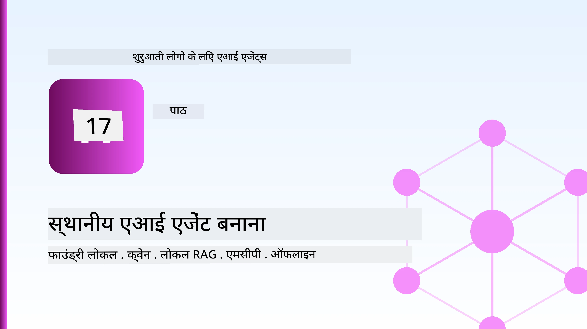
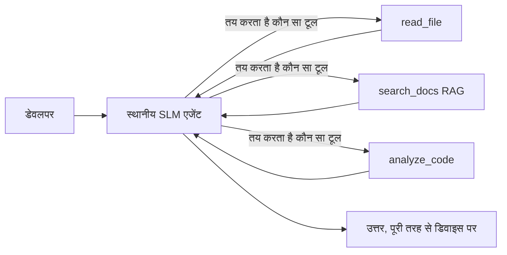
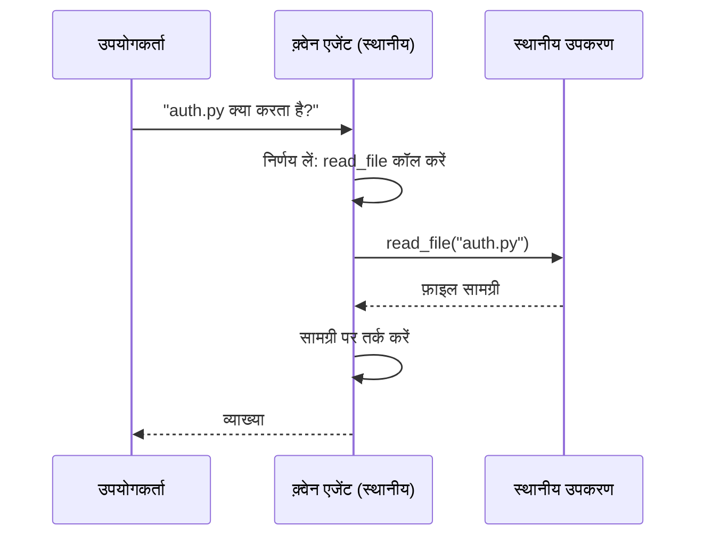
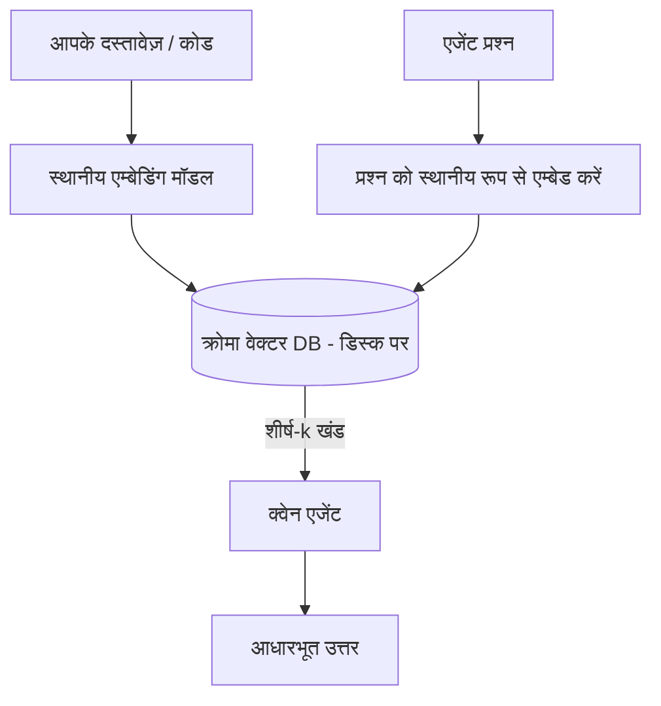
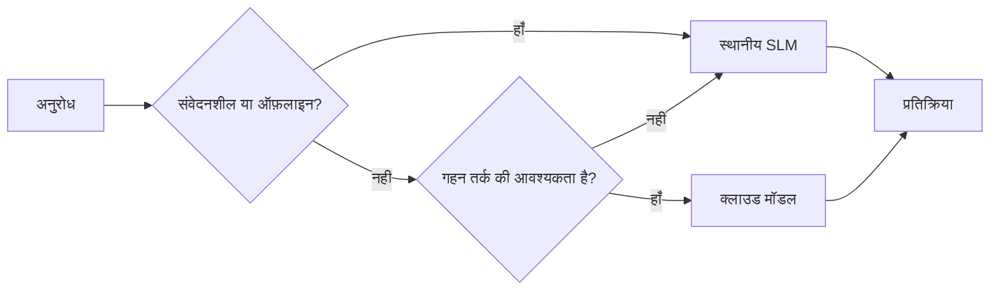

# माइक्रोसॉफ्ट फाउंड्री लोकल और Qwen का उपयोग करके लोकल AI एजेंट बनाना



पिछला पाठ एजेंट्स को *क्लाउड* में स्केल करता था। यह उन्हें एकल मशीन पर *लाता* है। अंत तक आपके पास एक कार्यशील इंजीनियरिंग सहायक होगा जो तर्क करता है, टूल कॉल करता है, आपकी फाइलें पढ़ता है, और आपकी प्रलेखन खोजता है — **एक भी क्लाउड इन्फेरेंस कॉल के बिना।**

आप ऐसा क्यों चाहेंगे? तीन कारण जो वास्तविक इंजीनियरिंग कार्य में लगातार सामने आते हैं:

- **गोपनीयता।** कोड और दस्तावेज़ कभी भी मशीन को छोड़ते नहीं हैं। कोई प्रॉम्प्ट, कोई स्निपेट, कोई ग्राहक डेटा नेटवर्क सीमा को पार नहीं करता।
- **लागत।** स्थानीय इन्फेरेंस का कोई प्रति-टोकन बिल नहीं है। आप बिजली की कीमत पर पूरे दिन पुनरावृत्ति कर सकते हैं।
- **ऑफ़लाइन।** विमान पर, सुरक्षित सुविधा में, या आउटेज के दौरान, एजेंट अभी भी काम करता है।

पकड़ यह है कि आप एक फ्रंटियर क्लाउड मॉडल को एक **स्मॉल लैंग्वेज मॉडल (SLM)** के साथ बदल रहे हैं जो आपके CPU, GPU, या NPU पर चलता है। यह पाठ ऐसे एजेंट बनाने के बारे में है जो उस प्रतिबंध के भीतर *अच्छे* हों बजाय यह दिखाने के कि प्रतिबंध मौजूद नहीं है।

## परिचय

इस पाठ में निम्नलिखित शामिल होंगे:

- **स्मॉल लैंग्वेज मॉडल (SLMs)** — वे क्या हैं, वे कहाँ चमकते हैं, और वे कहाँ कमजोर हैं।
- **माइक्रोसॉफ्ट फाउंड्री लोकल** — एक रनटाइम जो मॉडल को डिवाइस पर डाउनलोड और सेवा करता है, एक **OpenAI-संगत API** के माध्यम से।
- **Qwen फंक्शन-कॉलिंग मॉडल** — ऐसे SLM जो विश्वसनीय रूप से टूल कॉल उत्पन्न करते हैं, जो स्थानीय *एजेंट्स* (सिर्फ स्थानीय चैट नहीं) को संभव बनाते हैं।
- **स्थानीय टूल्स, स्थानीय RAG, और स्थानीय MCP** — एजेंट को क्लाउड के बिना क्षमता प्रदान करना।
- **हाइब्रिड पैटर्न्स** — कब चीजें स्थानीय रखें और कब क्लाउड तक पहुँचें।

## सीखने के लक्ष्य

इस पाठ को पूरा करने के बाद, आप जानेंगे कि कैसे:

- SLMs के ट्रेड-ऑफ समझाएं और उपयुक्त लोकल-एजेंट उपयोग मामलों का चयन करें।
- Foundry Local के साथ स्थानीय रूप से एक Qwen मॉडल सर्व करें और OpenAI-संगत एंडपॉइंट के माध्यम से कनेक्ट करें।
- पूरी तरह से अपने कार्यस्थल पर चलने वाला एक टूल-कॉलिंग एजेंट बनाएं।
- स्थानीय वॉइटर डेटाबेस (Chroma) का उपयोग करके अपनी खुद की दस्तावेज़ों पर स्थानीय RAG जोड़ें।
- एजेंट को स्थानीय MCP सर्वर से कनेक्ट करें और हाइब्रिड स्थानीय/क्लाउड डिज़ाइनों के बारे में तर्क करें।

## पूर्व आवश्यकताएं

यह पाठ मान लेता है कि आपने पिछले पाठ पूरे कर लिए हैं और आप सहज हैं:

- [टूल उपयोग](../04-tool-use/README.md) (पाठ 4) और [Agentic RAG](../05-agentic-rag/README.md) (पाठ 5)।
- [Agentic प्रोटोकॉल / MCP](../11-agentic-protocols/README.md) (पाठ 11)।
- [माइक्रोसॉफ्ट एजेंट फ्रेमवर्क](../14-microsoft-agent-framework/README.md) (पाठ 14)।

आपको निम्नलिखित की भी आवश्यकता होगी:

- एक डेवलपर कार्यस्थल। **8 GB RAM एक यथार्थवादी न्यूनतम है**; 16 GB+ आरामदायक है। एक GPU या NPU मदद करता है लेकिन आवश्यक नहीं है।
- **माइक्रोसॉफ्ट फाउंड्री लोकल** स्थापित (नीचे सेटअप अनुभाग देखें)।
- Python 3.12+ और रिपॉजिटरी [`requirements.txt`](../../../requirements.txt) में पैकेज, साथ ही `foundry-local-sdk`, `openai`, और `chromadb` इस पाठ के लिए।

## स्मॉल लैंग्वेज मॉडल: स्थानीय काम के लिए सही उपकरण

एक फ्रंटियर क्लाउड मॉडल के सैकड़ों अरब पैरामीटर होते हैं और उसके पीछे एक डेटा सेंटर होता है। एक SLM के कुछ अरब पैरामीटर होते हैं और उसे आपके लैपटॉप की RAM में फिट होना होता है। यह अंतर स्पष्ट अपेक्षाएँ सेट करता है।

**SLMs में ये अच्छे हैं:**

- संरचित, सीमित कार्य — वर्गीकरण, निष्कर्षण, ज्ञात दस्तावेज़ का सारांश।
- **टूल कॉलिंग** — यह निर्णय लेना कि किस फंक्शन को कॉल करना है और किन तर्कों के साथ।
- आपके अपने डेटा पर तेज़, सस्ता, निजी पुनरावृत्ति।

**SLMs इनमे कमजोर हैं:**

- खुले-ended, मल्टी-हॉप तर्क जो बड़े संदर्भ के पार जाता है।
- व्यापक विश्व ज्ञान (उन्होंने कम देखा है, और अधिक भूल जाते हैं)।

लोकल एजेंट्स के लिए विजयी रणनीति इसलिए है: **SLM को ऑर्केस्ट्रेट करने दें, और टूल्स को भारी काम करने दें।** मॉडल को आपके कोडबेस का *ज्ञान* होना जरूरी नहीं है — इसे केवल यह जानना चाहिए कि `read_file` और `search_docs` कब कॉल करना है। यह सीधे एक SLM की ताकतों को बढ़ाता है।



## माइक्रोसॉफ्ट फाउंड्री लोकल

**माइक्रोसॉफ्ट फाउंड्री लोकल** एक हल्का रनटाइम है जो मॉडल को आपके मशीन पर पूरी तरह डाउनलोड, प्रबंधित, और सेवा करता है। हमारे लिए इसका सबसे महत्वपूर्ण फीचर यह है कि यह एक **OpenAI-संगत HTTP एंडपॉइंट** प्रदान करता है — जिसका मतलब है कि OpenAI SDK और माइक्रोसॉफ्ट एजेंट फ्रेमवर्क के OpenAI क्लाइंट केवल `base_url` बदलकर इसके साथ काम कर सकते हैं। जो कुछ भी आपने एजेंट बनाने के लिए सीखा है, वह सीधे ट्रांसफर हो जाता है; केवल एंडपॉइंट क्लाउड से `localhost` में स्थानांतरित होता है।

फाउंड्री लोकल आपके हार्डवेयर के लिए मॉडल के सबसे अच्छे बिल्ड का ऑटोमैटिक चयन भी करता है — CPU बिल्ड, CUDA/GPU बिल्ड, या NPU बिल्ड — इसलिए आपको हर मशीन के लिए मैन्युअल रूप से ऑप्टिमाइज़ नहीं करना पड़ता।

### सेटअप

फाउंड्री लोकल इंस्टॉल करें (आपके OS के लिए [डॉक्यूमेंटेशन](https://learn.microsoft.com/azure/ai-foundry/foundry-local/) देखें), फिर पुष्टि करें कि यह काम करता है:

```bash
# स्थापित करें (उदाहरण; अपने प्लेटफ़ॉर्म के लिए डॉक्यूमेंट्स का पालन करें)
winget install Microsoft.FoundryLocal      # विंडोज़
# brew install microsoft/foundrylocal/foundrylocal   # मैकओएस

# एक Qwen मॉडल डाउनलोड करें और चलाएं, फिर स्थानीय सेवा शुरू करें
foundry model run qwen2.5-7b-instruct
foundry service status
```

सेवा चलने के बाद आपके पास एक स्थानीय, OpenAI-संगत एंडपॉइंट होगा (आमतौर पर `http://localhost:PORT/v1`)। नोटबुक `foundry-local-sdk` का उपयोग करके एंडपॉइंट को स्वचालित रूप से खोजता है, इसलिए आपको पोर्ट को हार्ड-कोड करने की जरूरत नहीं है।

## Qwen फंक्शन कॉलिंग: यह क्यों महत्वपूर्ण है

एक एजेंट तभी एजेंट होता है जब वह टूल्स को कॉल कर सकता है। कई SLMs चैट कर सकते हैं लेकिन अविश्वसनीय, गलत टूल कॉल उत्पन्न करते हैं। **Qwen** मॉडल फंक्शन कॉलिंग के लिए प्रशिक्षित हैं और अच्छी तरह से निर्मित टूल-कॉल स्ट्रक्चर नियमित रूप से देते हैं — यही स्थानीय चैट मॉडल को स्थानीय *एजेंट* में बदल देता है।

फ्लो वही मानक टूल-कॉलिंग लूप है जिसे आप पहले से जानते हैं, बस यह डिवाइस पर चलता है:



## स्थानीय RAG

दस्तावेज़ खोज वहीं है जहाँ स्थानीय एजेंट काम करते हैं। इस उम्मीद पर निर्भर रहने की बजाय कि SLM ने आपके फ्रेमवर्क की डॉक्स को याद किया है, आप उन दस्तावेज़ों को एक **स्थानीय वेक्टर डेटाबेस** में एम्बेड करते हैं और एजेंट को आवश्यक भागों को मांग पर पुनः प्राप्त करने देते हैं।

हम **Chroma** का उपयोग करते हैं, एक एम्बेडेड वेक्टर स्टोर जो प्रोसेस के साथ चलता है और जिसे मैनेज करने के लिए कोई सर्वर नहीं होता। पाइपलाइन पूरी तरह से स्थानीय है: स्थानीय एम्बेडिंग मॉडल → स्थानीय वेक्टर → स्थानीय पुनः प्राप्ति → स्थानीय SLM।



यह वही Agentic RAG पैटर्न है जैसे पाठ 5 में — केवल अंतर यह है कि हर घटक आपके मशीन पर चलता है।

## स्थानीय MCP सर्वर्स

[MCP](../11-agentic-protocols/README.md) एक ट्रांसपोर्ट है, कोई क्लाउड सेवा नहीं। एक MCP सर्वर स्थानीय प्रक्रिया के रूप में `stdio` पर चल सकता है, एजेंट को मानक प्रोटोकॉल के ऊपर टूल प्रदान करता है। इससे आप बढ़ती हुई MCP सर्वर पारिस्थितिकी तंत्र का उपयोग ऑफ़लाइन कर सकते हैं — जैसे फाइल सिस्टम एक्सेस, git ऑपरेशंस, डेटाबेस क्वेरीज़।

सुरक्षा स्थिति क्लाउड से अलग होती है, लेकिन गायब नहीं होती: एक स्थानीय MCP सर्वर अभी भी आपके उपयोगकर्ता के अनुमतियों के साथ चलता है, इसलिए इसे जो छू सकता है उसका दायरा सीमित करें (एक प्रोजेक्ट डायरेक्टरी, आपके संपूर्ण होम फ़ोल्डर नहीं) और इसके आउटपुट को इनपुट के रूप में समझकर मान्य करें।

## हाइब्रिड क्लाउड-और-लोकल पैटर्न

“लोकल-फर्स्ट” का मतलब केवल लोकल नहीं होता। परिपक्व प्रणाली संवेदनशीलता और कठिनाई के आधार पर मार्ग तय करती हैं:

| स्थिति | यह कहाँ चलता है |
| --- | --- |
| संवेदनशील कोड / डेटा, या ऑफ़लाइन | **स्थानीय SLM** |
| सरल, सीमित कार्य | **स्थानीय SLM** (सस्ता, तेज़) |
| गैर-संवेदनशील डेटा पर कठिन मल्टी-हॉप तर्क | **क्लाउड मॉडल** |
| आउटेज के दौरान सब कुछ | **स्थानीय SLM** (सुगम अपक्षय) |

यह पाठ 16 के **मॉडल राउटिंग** विचार को दोहराता है — बस एक "मॉडल" अब आपकी खुद की मशीन है। एक मजबूत डिज़ाइन क्लाउड अनुपलब्ध होने पर स्थानीय रूप से वापस चला जाता है, जिससे एजेंट की गुणवत्ता गिरती है बजाय पूरी तरह से विफल होने के।



## व्यावहारिक प्रयोगशाला: एक स्थानीय इंजीनियरिंग सहायक

खोलें [`code_samples/17-local-agent-foundry-local.ipynb`](./code_samples/17-local-agent-foundry-local.ipynb) और इसे पूरा करें। आप एक **स्थानीय इंजीनियरिंग सहायक** बनाएंगे जो पूरी तरह से आपके कार्यस्थल पर चलता है और कर सकता है:

1. **टूल कॉल करें** — Foundry Local के माध्यम से Qwen फंक्शन कॉलिंग द्वारा।
2. **स्थानीय फ़ाइल संचालन करें** — प्रोजेक्ट डायरेक्टरी की फाइल सूची बनाना और पढ़ना।
3. **कोड विश्लेषण करें** — एक स्रोत फाइल पर मूल मीट्रिक रिपोर्ट करें।
4. **डॉक्यूमेंटेशन खोजें** — Chroma के साथ डॉक्स फ़ोल्डर पर स्थानीय RAG।
5. **MCP का उपयोग करें** — एक स्थानीय MCP सर्वर से कनेक्ट करें (यदि कॉन्फ़िगर न हो तो धीरे-धीरे छोड़ें)।

किसी भी बिंदु पर कोई क्लाउड इन्फेरेंस उपयोग नहीं किया जाता।

### वॉकथ्रू

सहायक OpenAI संगत एंडपॉइंट के माध्यम से Foundry Local से जुड़ता है, इसलिए एजेंट कोड क्लाउड पाठों के समान दिखता है — केवल क्लाइंट बदलता है:

```python
from foundry_local import FoundryLocalManager
from openai import OpenAI

# फाउंड्री लोकल मॉडल को खोजता/डाउनलोड करता है और हमें एक लोकल एंडपॉइंट देता है।
manager = FoundryLocalManager(\"qwen2.5-7b-instruct\")
client = OpenAI(base_url=manager.endpoint, api_key=manager.api_key)  # api_key एक स्थानीय प्लेसहोल्डर है।
```

टूल्स सामान्य Python फ़ंक्शन हैं जो एक प्रोजेक्ट डायरेक्टरी तक सीमित हैं:

```python
def read_file(path: str) -> str:
    \"\"\"Read a file, but only inside the sandboxed project directory.\"\"\"
    full = (PROJECT_ROOT / path).resolve()
    if PROJECT_ROOT not in full.parents and full != PROJECT_ROOT:
        return \"Access denied: path is outside the project directory.\"
    return full.read_text(encoding=\"utf-8\")
```

सैंडबॉक्स जांच पर ध्यान दें — यहां तक कि स्थानीय रूप से भी, जो टूल मनमाने पथ पढ़ता है वह एक जोखिम है। नोटबुक हर टूल को एक एकल प्रोजेक्ट रूट तक सीमित रखता है।

## ज्ञान जांच

असाइनमेंट पर जाने से पहले अपनी समझ का परीक्षण करें।

**1. क्लाउड के बजाय एजेंट को स्थानीय रूप से चलाने के दो ठोस कारण बताएं।**

<details>
<summary>उत्तर</summary>

इनमें से कोई भी दो: **गोपनीयता** (कोड और डेटा कभी मशीन से बाहर नहीं जाता), **लागत** (कोई प्रति-टोकन बिल नहीं), और **ऑफ़लाइन क्षमता** (नेटवर्क के बिना काम करता है — विमान पर, सुरक्षित सुविधा में, या आउटेज के दौरान)। नियामकीय/अनुपालन प्रतिबंध जो डिवाइस से बाहर डेटा भेजने से मना करते हैं, वे गोपनीयता कारण का सामान्य चालक हैं।
</details>

**2. एक स्थानीय एजेंट में SLM और उसके टूल्स के बीच सिफारिश की गई श्रम विभाजन क्या है, और क्यों?**

<details>
<summary>उत्तर</summary>

SLM को **ऑर्केस्ट्रेट** करने दें (निर्णय लें कि किस टूल को कॉल करना है और किन तर्कों के साथ) और टूल्स को **भारी काम करने दें** (फाइलें पढ़ना, डॉक्स पुनः प्राप्त करना, परिणाम निकालना)। SLM सीमित निर्णयों जैसे टूल चयन में मजबूत हैं लेकिन व्यापक ज्ञान और लंबी मल्टी-हॉप तर्क में कमजोर हैं, इसलिए टूल्स पर निर्भर होना उनकी ताकत को बढ़ाता है।
</details>

**3. Foundry Local के साथ क्लाउड एजेंट कोड को पुन: उपयोग करने में क्या संभव बनाता है?**

<details>
<summary>उत्तर</summary>

Foundry Local एक **OpenAI-संगत HTTP एंडपॉइंट** प्रदान करता है। OpenAI SDK और एजेंट फ्रेमवर्क के OpenAI क्लाइंट इसे केवल `base_url` बदलकर (और स्थानीय प्लेसहोल्डर API कुंजी का उपयोग करके) काम करते हैं। एजेंट कोड के बाकी सभी पहलू समान रहते हैं।
</details>

**4. हम किसी भी SLM के बजाय विशेष रूप से Qwen फ़ंक्शन-कॉलिंग मॉडल क्यों उपयोग करते हैं?**

<details>
<summary>उत्तर</summary>

क्योंकि एक एजेंट को विश्वसनीय, अच्छी तरह से निर्मित **टूल कॉल** उत्पन्न करने चाहिए। कई SLM चैट कर सकते हैं लेकिन गलत या असंगत टूल-कॉल संरचनाएं देते हैं। Qwen मॉडल फंक्शन कॉलिंग के लिए प्रशिक्षित होते हैं और लगातार टूल कॉल उत्पन्न करते हैं, जो एक स्थानीय चैट मॉडल को एक कार्यशील स्थानीय एजेंट बनाता है।
</details>

**5. स्थानीय RAG पाइपलाइन में कौन से घटक मशीन पर चलते हैं?**

<details>
<summary>उत्तर</summary>

सभी: एम्बेडिंग मॉडल, वेक्टर डेटाबेस (Chroma, डिस्क पर), पुनः प्राप्ति चरण, और SLM। दस्तावेज़ स्थानीय रूप से एम्बेड किए जाते हैं, स्थानीय रूप से संग्रहीत होते हैं, स्थानीय रूप से पुनः प्राप्त होते हैं, और स्थानीय मॉडल द्वारा तर्कित होते हैं — कोई घटक क्लाउड को नहीं छूता।
</details>

**6. एक स्थानीय MCP सर्वर आपके मशीन पर चलता है। क्या यह इसे स्वचालित रूप से सुरक्षित बनाता है? आपको अभी भी कौन-सी सावधानी बरतनी चाहिए?**

<details>
<summary>उत्तर</summary>

नहीं। एक स्थानीय MCP सर्वर आपके उपयोगकर्ता की अनुमतियों के साथ चलता है, इसलिए यह आपकी पहुंच की किसी भी चीज़ को छू सकता है। इसे आवश्यक चीज़ तक सीमित करें (उदाहरण के लिए, पूरे होम फ़ोल्डर की बजाय एक प्रोजेक्ट डायरेक्टरी) और इसके आउटपुट को इनपुट के रूप में मानकर मान्य करें।
</details>

**7. एक उपयुक्त हाइब्रिड राउटिंग नियम का वर्णन करें जिसमें एक स्थानीय मॉडल शामिल हो।**

<details>
<summary>उत्तर</summary>

संवेदनशील या ऑफ़लाइन अनुरोधों को स्थानीय SLM पर भेजें; सरल सीमित कार्यों को गति और लागत के लिए स्थानीय SLM पर भेजें; गैर-संवेदनशील डेटा पर कठिन मल्टी-हॉप तर्क के लिए क्लाउड मॉडल का उपयोग करें; और क्लाउड अनुपलब्ध होने पर स्थानीय SLM पर वापस आएं ताकि एजेंट धीरे-धीरे खराब हो बजाय पूरी तरह विफल होने के। यह मॉडल राउटिंग (पाठ 16) है जिसमें स्थानीय मशीन एक मॉडल है।
</details>

**8. इस पाठ में स्थानीय एजेंट चलाने के लिए यथार्थवादी न्यूनतम RAM आंकड़ा क्या है, और अधिक RAM आपको क्या देता है?**

<details>
<summary>उत्तर</summary>

लगभग **8 GB** यथार्थवादी न्यूनतम है; 16 GB+ आरामदायक है। अधिक RAM आपको बड़े, अधिक सक्षम मॉडल चलाने और अधिक संदर्भ स्मृति में रखने देता है। GPU या NPU इन्फेरेंस को तेज़ करता है लेकिन आवश्यक नहीं है — जब कोई एक्सेलेरेटर उपलब्ध नहीं होता तो Foundry Local CPU बिल्ड चुनता है।
</details>

## असाइनमेंट

स्थानीय इंजीनियरिंग सहायक को आपके द्वारा चुने गए छोटे प्रोजेक्ट के लिए एक **स्थानीय दस्तावेज़ समीक्षक** में बढ़ाएं (यदि चाहें तो इस रिपॉजिटरी के किसी पाठ फ़ोल्डर का उपयोग करें)।

आपकी सबमिशन में शामिल होना चाहिए:

1. एक वास्तविक डॉक्स/कोड फ़ोल्डर को Chroma में इंडेक्स करें (कम से कम पाँच फाइलें)।
2. एक `find_todos` टूल जोड़ें जो प्रोजेक्ट में `TODO`/`FIXME` टिप्पणियों को स्कैन करता है और उन्हें फ़ाइल और पंक्ति संख्या के साथ लौटाता है — `read_file` जैसा ही सैंडबॉक्स जांच बनाए रखते हुए।

3. **एजेंट से तीन प्रश्न पूछें** जो इसे टूल्स को संयोजित करने के लिए मजबूर करें: एक शुद्ध RAG प्रश्न, एक जो किसी विशिष्ट फ़ाइल को पढ़ने की आवश्यकता हो, और एक जो TODOs खोजने की आवश्यकता हो।
4. **इसे मापें**: तीनों प्रतिक्रियाओं का समय मापें और उन्हें एक मार्कडाउन सेल में नोट करें। टिप्पणी करें कि क्या विलंबता आपके इच्छित वर्कफ़्लो के लिए स्वीकार्य है।

फिर एक छोटा पैराग्राफ लिखें कि **इस समीक्षक के लिए आप क्या क्लाउड में ले जाएँगे और क्या लोकल पर रखेंगे**, और क्यों। आपको यह आंका जाएगा कि क्या लोकल घटक सही तरीके से जुड़े हुए हैं और आपका हाइब्रिड तर्कSound है — मॉडल की गुणवत्ता पर नहीं।

## सारांश

इस पाठ में आपने एक ऐसा एजेंट बनाया जो पूरी तरह से आपकी अपनी मशीन पर चलता है:

- **SLMs** गोपनीयता, लागत, और ऑफ़लाइन संचालन के लिए व्यापकता का न्योछावर करते हैं — और तब चमकते हैं जब वे खुद सभी ज्ञान रखने के बजाय **टूल्स को ऑर्केस्ट्रेट** करते हैं।
- **Foundry Local** एक **OpenAI-कॉम्पैटिबल एंडपॉइंट** के पीछे डिवाइस पर मॉडल सेवा करता है, इसलिए आपका क्लाउड एजेंट कोड एक लाइन परिवर्तन के साथ ट्रांसफर हो जाता है।
- **Qwen फंक्शन-कॉलिंग मॉडल्स** विश्वसनीय लोकल टूल कॉलिंग — और इसलिए लोकल *एजेंट्स* — को संभव बनाते हैं।
- **लोकल RAG** (Chroma) और **लोकल MCP** एजेंट को मशीन छोड़ने बिना क्षमता देते हैं।
- **हाइब्रिड पैटर्न्स** आपको संवेदनशीलता और कठिनाई के अनुसार मार्गदर्शन करने देते हैं, लोकल को एक स्निग्ध फॉलबैक के रूप में।

यह तैनाती चाप को पूरा करता है: पाठ 16 एजेंट्स को Microsoft Foundry में स्केल करता है, और यह पाठ उन्हें एक एकल वर्कस्टेशन पर स्केल करता है। अगला पाठ तैनात एजेंट्स को सुरक्षित रखने की ओर मुड़ता है।

## अतिरिक्त संसाधन

- <a href="https://learn.microsoft.com/azure/ai-foundry/foundry-local/" target="_blank">Microsoft Foundry Local दस्तावेज़</a>
- <a href="https://learn.microsoft.com/azure/ai-foundry/what-is-azure-ai-foundry" target="_blank">Microsoft Foundry दस्तावेज़</a>
- <a href="https://aka.ms/ai-agents-beginners/agent-framework" target="_blank">Microsoft एजेंट फ्रेमवर्क</a>
- <a href="https://qwen.readthedocs.io/en/latest/framework/function_call.html" target="_blank">Qwen फंक्शन कॉलिंग दस्तावेज़</a>
- <a href="https://modelcontextprotocol.io/" target="_blank">मॉडल संदर्भ प्रोटोकॉल (MCP)</a>
- <a href="https://docs.trychroma.com/" target="_blank">Chroma वेक्टर डेटाबेस</a>

## पिछला पाठ

[स्केलेबल एजेंट्स का परिनियोजन](../16-deploying-scalable-agents/README.md)

## अगला पाठ

[AI एजेंट्स की सुरक्षा](../18-securing-ai-agents/README.md)

---

<!-- CO-OP TRANSLATOR DISCLAIMER START -->
**अस्वीकरण**:
इस दस्तावेज़ का अनुवाद AI अनुवाद सेवा [Co-op Translator](https://github.com/Azure/co-op-translator) का उपयोग करके किया गया है। जबकि हम सटीकता के लिए प्रयास करते हैं, कृपया ध्यान दें कि स्वचालित अनुवादों में त्रुटियाँ या अशुद्धियाँ हो सकती हैं। मूल दस्तावेज़ अपनी मूल भाषा में ही प्रामाणिक स्रोत माना जाना चाहिए। महत्वपूर्ण जानकारी के लिए, पेशेवर मानव अनुवाद की सिफारिश की जाती है। इस अनुवाद के उपयोग से उत्पन्न किसी भी गलतफहमी या गलत व्याख्या के लिए हम उत्तरदायी नहीं हैं।
<!-- CO-OP TRANSLATOR DISCLAIMER END -->