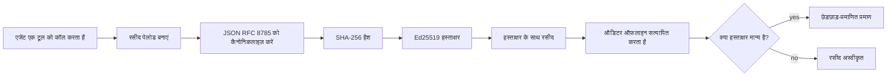
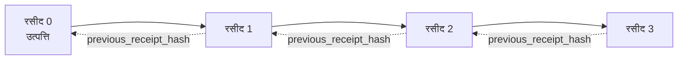

[पाठ वीडियो देखें: क्रिप्टोग्राफ़िक रसीदों के साथ AI एजेंट्स को सुरक्षित करना](https://youtu.be/PLACEHOLDER_VIDEO_ID)

> _(पाठ वीडियो और थंबनेल मर्ज के बाद Microsoft कंटेंट टीम द्वारा जोड़े जाएंगे, जो पाठ 14 / 15 पैटर्न से मेल खाता है।)_

# क्रिप्टोग्राफ़िक रसीदों के साथ AI एजेंट्स को सुरक्षित करना

## परिचय

इस पाठ में निम्न विषयों को कवर किया जाएगा:

- AI एजेंट्स के लिए ऑडिट ट्रेल्स क्यों अनुपालन, डिबगिंग और भरोसे के लिए महत्वपूर्ण हैं।
- क्रिप्टोग्राफ़िक रसीद क्या है और यह बिना साइन किए गए लॉग लाइन से कैसे अलग है।
- एक एजेंट के टूल कॉल के लिए साइन की हुई रसीद को साधारण Python में कैसे बनाएं।
- ऑफ़लाइन रसीद कैसे सत्यापित करें और छेड़छाड़ का पता कैसे लगाएं।
- रसीदों को कैसे चेन करें ताकि एक रसीद हटाने या पुनः क्रमित करने से चेन टूट जाए।
- रसीदें क्या प्रमाणित करती हैं और वे स्पष्ट रूप से क्या प्रमाणित नहीं करती हैं।

## अध्ययन लक्ष्य

इस पाठ को पूरा करने के बाद, आप जानेंगे कि:

- एजेंट क्रियाओं के लिए क्रिप्टोग्राफ़िक प्रॉवेनेंस को प्रेरित करने वाले फेलियर मोड्स की पहचान करें।
- एक canonical JSON पे-लोड पर Ed25519-सिग्नेचर वाली रसीद कैसे बनाएं।
- केवल सिग्नेचर करने वाले की सार्वजनिक कुंजी का उपयोग करके रसीद को स्वतंत्र रूप से सत्यापित करें।
- संशोधित रसीद पर सत्यापन पुनः चलाकर छेड़छाड़ का पता लगाएं।
- रसीदों की एक हैश-चेन की श्रृंखला बनाएं और बताएं कि यह श्रृंखला क्यों महत्वपूर्ण है।
- यह समझें कि रसीदें क्या प्रमाणित करती हैं (अट्रीब्यूशन, अखंडता, क्रम) और क्या प्रमाणित नहीं करती हैं (कार्रवाई की शुद्धता, नीति की विश्वसनीयता)।

## समस्या: आपके एजेंट का ऑडिट ट्रेल

कल्पना करें कि आपने Contoso Travel के लिए एक AI एजेंट तैनात किया है। एजेंट ग्राहक अनुरोध पढ़ता है, उड़ानों के लिए API को कॉल करता है, और ग्राहक की ओर से सीटें बुक करता है। पिछले तिमाही में, एजेंट ने 50,000 बुकिंग प्रोसेस कीं।

आज एक ऑडीटर आता है। वह एक सरल सवाल पूछता है: "मुझे दिखाएं कि आपका एजेंट क्या किया।"

आप लॉग फ़ाइलें सौंपते हैं। ऑडीटर उन्हें देखता है और एक कठिन सवाल पूछता है: "मुझे कैसे पता चले कि ये लॉग संपादित नहीं किए गए थे?"

यही ऑडिट ट्रेल समस्या है। आज अधिकांश एजेंट तैनाती इस पर निर्भर हैं:

- **एप्लिकेशन लॉग्स**: एजेंट द्वारा खुद लिखे जाते हैं, फ़ाइल सिस्टम पहुँच वाले किसी भी व्यक्ति द्वारा संपादित किए जा सकते हैं।
- **क्लाउड लॉगिंग सेवाएं**: प्लेटफ़ॉर्म स्तर पर छेड़छाड़ का पता लगाती हैं, लेकिन केवल यदि ऑडीटर प्लेटफ़ॉर्म ऑपरेटर पर भरोसा करता है।
- **डेटाबेस ट्रांज़ेक्शन लॉग्स**: डेटाबेस परिवर्तनों के लिए उपयुक्त लेकिन मनमाने टूल कॉल के लिए नहीं।

इनमें से कोई भी ऑडीटर के सवाल का जवाब बिना भरोसा किए नहीं दे सकता (आप पर, आपके क्लाउड प्रदाता पर, आपके डेटाबेस विक्रेता पर)। आंतरिक उपयोग के लिए ये भरोसे स्वीकार्य होते हैं। विनियमित वर्कलोड (वित्त, स्वास्थ्य सेवा, EU AI अधिनियम के अंतर्गत कुछ भी) के लिए ये स्वीकार्य नहीं हैं।

क्रिप्टोग्राफ़िक रसीदें इसे इस प्रकार हल करती हैं कि प्रत्येक एजेंट क्रिया स्वतंत्र रूप से सत्यापित की जा सकती है। ऑडीटर को आप पर भरोसा करने की ज़रूरत नहीं है। उन्हें केवल आपकी सार्वजनिक कुंजी और रसीद की आवश्यकता है।

## क्रिप्टोग्राफ़िक रसीद क्या है?

एक रसीद एक JSON ऑब्जेक्ट है जो रिकॉर्ड करता है कि एजेंट ने क्या किया, जिसे डिजिटल सिग्नेचर के साथ साइन किया गया है।



एक न्यूनतम रसीद इस प्रकार दिखती है:

```json
{
  "type": "agent.tool_call.v1",
  "agent_id": "contoso-travel-bot",
  "tool_name": "lookup_flights",
  "tool_args_hash": "sha256:a3f9c1...",
  "result_hash": "sha256:7b2e1d...",
  "policy_id": "contoso-travel-policy-v3",
  "timestamp": "2026-04-25T14:30:00Z",
  "sequence": 47,
  "previous_receipt_hash": "sha256:9d4e6a...",
  "signature": {
    "alg": "EdDSA",
    "sig": "c5af83...",
    "public_key": "8f3b2c..."
  }
}
```

तीन गुण काम कर रहे हैं:

1. **सिग्नेचर**। रसीद एजेंट के गेटवे द्वारा Ed25519 प्राइवेट की का उपयोग करके साइन की जाती है। इसके संबंधित पब्लिक की वाले कोई भी व्यक्ति सिग्नेचर को ऑफ़लाइन सत्यापित कर सकता है। किसी भी फ़ील्ड में छेड़छाड़ से सिग्नेचर अमान्य हो जाता है।

2. **कैनोनिकल एन्कोडिंग**। साइन करने से पहले, रसीद JSON कैनोनिकलाइजेशन स्कीम (JCS, RFC 8785) का उपयोग करके सीरियलाइज़ की जाती है। यह सुनिश्चित करता है कि दो अलग-अलग कार्यान्वयन जो एक ही तार्किक रसीद बनाते हैं, बाइट-एकसमान आउटपुट देते हैं। बिना कैनोनिकलाइजेशन के, विभिन्न JSON सीरियलाइज़र एक ही सामग्री के लिए विभिन्न सिग्नेचर उत्पन्न करेंगे।

3. **हैश चेनिंग**। `previous_receipt_hash` फ़ील्ड प्रत्येक रसीद को उससे पहले की रसीद से जोड़ता है। एक रसीद को हटाने या पुनः क्रमित करने से उसके बाद की सभी रसीदें टूट जाती हैं। यहां तक कि व्यक्तिगत सिग्नेचर बाइपास होने पर भी चेन स्तर पर छेड़छाड़ दिखाई देती है।

ये गुण तीन गारंटियाँ प्रदान करते हैं:

- **अट्रीब्यूशन**: इस कुंजी ने इस सामग्री पर हस्ताक्षर किया।
- **इंटीग्रिटी**: सामग्री साइनिंग के बाद से नहीं बदली है।
- **ऑर्डरिंग**: यह रसीद उस रसीद के बाद चेन में आई है।

## Python में रसीद बनाना

रसीद बनाने के लिए आपको किसी विशेष पुस्तकालय की आवश्यकता नहीं है। क्रिप्टोग्राफ़िक प्रिमिटिव्स व्यापक रूप से उपलब्ध हैं और लॉजिक कुछ दर्जन लाइनों के Python कोड में है।

`code_samples/18-signed-receipts.ipynb` में व्यावहारिक अभ्यास पूरे फ्लो को समझाते हैं। सारांश संस्करण:

```python
import json
import hashlib
import base64
from nacl import signing
from jcs import canonicalize  # RFC 8785 कैनोनिकल JSON

def b64url_nopad(data: bytes) -> str:
    return base64.urlsafe_b64encode(data).decode("ascii").rstrip("=")

def sha256_canonical(obj) -> str:
    """SHA-256 of a Python object's JCS-canonical JSON form."""
    return f"sha256:{hashlib.sha256(canonicalize(obj)).hexdigest()}"

# एक साइनिंग कुंजी बनाएं या लोड करें (उत्पादन में, इसे एक की वॉल्ट में संग्रहीत करें)
signing_key = signing.SigningKey.generate()
verify_key = signing_key.verify_key

# रसीद पेलोड बनाएं (अभी तक कोई हस्ताक्षर नहीं)
tool_args = {"origin": "SYD", "destination": "LAX"}
tool_result = [{"flight": "QF11", "price": 1850, "stops": 0}]

payload = {
    "type": "agent.tool_call.v1",
    "agent_id": "contoso-travel-bot",
    "tool_name": "lookup_flights",
    "tool_args_hash": sha256_canonical(tool_args),
    "result_hash": sha256_canonical(tool_result),
    "policy_id": "contoso-travel-policy-v3",
    "timestamp": "2026-04-25T14:30:00Z",
    "sequence": 0,
    "previous_receipt_hash": None,
}

# कैनोनिकलाइज़ करें, हैश करें, साइन करें।
canonical_bytes = canonicalize(payload)
message_hash = hashlib.sha256(canonical_bytes).digest()
signature_bytes = signing_key.sign(message_hash).signature

# एक संरचित हस्ताक्षर ऑब्जेक्ट संलग्न करें।
receipt = {
    **payload,
    "signature": {
        "alg": "EdDSA",
        "sig": b64url_nopad(signature_bytes),
        "public_key": b64url_nopad(bytes(verify_key)),
    },
}
```

यही पूरा साइनिंग पाइपलाइन है। नोटबुक में हर चरण विस्तार से समझाया गया है।

## रसीद सत्यापित करना और छेड़छाड़ का पता लगाना

सत्यापन इसके विपरीत ऑपरेशन है:

```python
import base64
import hashlib
from nacl import signing
from nacl.exceptions import BadSignatureError
from jcs import canonicalize

def b64url_decode(s: str) -> bytes:
    padding = "=" * ((4 - len(s) % 4) % 4)
    return base64.urlsafe_b64decode(s + padding)

def verify_receipt(receipt: dict) -> bool:
    # सिग्नेचर एक संरचित वस्तु है: {"alg", "sig", "public_key"}.
    sig_obj = receipt.get("signature")
    if not sig_obj or sig_obj.get("alg") != "EdDSA":
        return False

    # वह पेलोड पुनर्निर्माण करें जिसे वास्तव में हस्ताक्षरित किया गया था (सिग्नेचर को छोड़कर सब कुछ).
    payload = {k: v for k, v in receipt.items() if k != "signature"}

    canonical_bytes = canonicalize(payload)
    message_hash = hashlib.sha256(canonical_bytes).digest()

    try:
        verify_key = signing.VerifyKey(b64url_decode(sig_obj["public_key"]))
        verify_key.verify(message_hash, b64url_decode(sig_obj["sig"]))
        return True
    except BadSignatureError:
        return False
```

यह फ़ंक्शन रसीद लेता है और अगर सिग्नेचर वैध है तो `True` लौटाता है, अन्यथा `False`। कोई नेटवर्क कॉल नहीं, कोई सेवा निर्भरता नहीं, किसी तीसरे पक्ष पर भरोसा करने की जरूरत नहीं।

छेड़छाड़ का पता लगाने का प्रदर्शन देखने के लिए नोटबुक में ये कदम दिखाए गए हैं:

1. एक वैध रसीद बनाना और पुष्टि करना कि वह सत्यापित हो जाती है।
2. `tool_args_hash` फ़ील्ड के एक बाइट को संशोधित करना।
3. सत्यापन पुनः चलाना और विफल होना देखना।

यह व्यावहारिक प्रदर्शन है कि रसीदें छेड़छाड़-प्रतिरोधी हैं: कोई भी संशोधन, चाहे वह कितना भी छोटा हो, सिग्नेचर को तोड़ देता है।

## मल्टी-स्टेप एजेंट्स के लिए रसीदों की चेनिंग

एक सिंगल साइन की हुई रसीद एक क्रिया की रक्षा करती है। रसीदों की श्रृंखला एक क्रम की रक्षा करती है।



प्रत्येक रसीद उससे पहले की रसीद के हैश को रिकॉर्ड करती है। चुपके से रसीद 2 को हटाने के लिए, एक हमलावर को या तो:

- रसीद 3 के `previous_receipt_hash` फ़ील्ड को संशोधित करना होगा (जिससे रसीद 3 का सिग्नेचर टूट जाएगा), या
- संशोधित रसीद 3 पर नया सिग्नेचर बनाना होगा (जिसके लिए एजेंट की प्राइवेट की चाहिए)।

यदि प्राइवेट की हार्डवेयर की वॉल्ट में है और आप प्रत्येक रसीद के साथ सार्वजनिक कुंजी प्रकाशित करते हैं, तो दोनों हमले बिना पकड़ में आए संभव नहीं हैं।

नोटबुक में यह प्रदर्शित किया गया है:

1. तीन रसीदों की श्रृंखला बनाना।
2. सत्यापित करना कि प्रत्येक रसीद का `previous_receipt_hash` वास्तव में पिछली रसीद के हैश से मेल खाता है।
3. मध्य में एक रसीद के साथ छेड़छाड़ करना और देखना कि श्रृंखला ठीक उसी बिंदु पर टूट जाती है।

इसी तरह आप एक ऑडिट ट्रेल बनाते हैं जिसे बाहरी ऑडीटर बिना आप पर भरोसा किए सत्यापित कर सकता है।

## रसीदें क्या प्रमाणित करती हैं (और क्या नहीं)

यह पाठ का सबसे महत्वपूर्ण भाग है। रसीदें शक्तिशाली हैं लेकिन उनकी शक्ति सीमित है।

**रसीदें तीन चीजें प्रमाणित करती हैं:**

1. **अट्रीब्यूशन**: एक विशिष्ट कुंजी ने एक विशिष्ट पे-लोड पर हस्ताक्षर किया।
2. **इंटीग्रिटी**: पे-लोड साइनिंग के बाद से नहीं बदला है।
3. **ऑर्डरिंग**: यह रसीद हैश चेन में उस रसीद के बाद आई है।

**रसीदें प्रमाणित नहीं करती:**

1. **सहीपन**: कि एजेंट की क्रिया सही थी। रसीद गलत उत्तर के लिए भी उसी तरह साइन हो सकती है जैसे सही उत्तर के लिए।
2. **नीति अनुपालन**: `policy_id` में संदर्भित नीति का वास्तविक मूल्यांकन या जांच कि क्या वह इस क्रिया की अनुमति देती। रसीद में रिकॉर्ड किया गया है जो दावा किया गया, वह लागू किया गया नहीं।
3. **कुंजी से आगे पहचान**: रसीद कहती है "इस कुंजी ने इस सामग्री पर हस्ताक्षर किया।" यह नहीं कहती "इस मानव ने यह अधिकृत किया।" कुंजी को व्यक्ति या संगठन से जोड़ने के लिए अलग पहचान प्रणाली चाहिए (डायरेक्टरी, सार्वजनिक कुंजी रजिस्ट्री, आदि)।
4. **इनपुट की सत्यता**: अगर एजेंट को मनमाना प्रॉम्प्ट मिलता है और वह उस पर कार्य करता है, तो रसीद कार्रवाई को सही ढंग से रिकॉर्ड करेगी। रसीदें इनपुट वैलिडेशन के बाद होती हैं, वैकल्पिक नहीं।

यह सीमा दो कारणों से महत्वपूर्ण है:

- यह बताती है कि रसीदें किसलिए उपयोगी हैं: एजेंट व्यवहार को ऑडिटेबल और छेड़छाड़-प्रतिरोधी बनाना, यहां तक कि संगठनात्मक सीमाओं के पार भी।
- यह बताती है कि आपको किन अतिरिक्त स्तरों की जरूरत है: इनपुट वैलिडेशन (पाठ 6), नीति प्रवर्तन (संक्षेप में नीचे), और पहचान प्रणाली (इस पाठ के दायरे से बाहर)।

एक सामान्य गलती यह मान लेना है कि "हमारे पास रसीदें हैं" का अर्थ है "हम नियंत्रित हैं।" ऐसा नहीं है। रसीदें आधार हैं। शासन वह सिस्टम है जो आप इसके ऊपर बनाते हैं।

## यह प्रमाणित करना कि एक मानव ने सटीक क्रिया को अनुमोदित किया

ऊपर आइटम 3 के लिए एक अलग खंड जरूरी है: एक क्रिया रसीद कहती है "इस कुंजी ने इस सामग्री पर सिग्नेचर किया," कभी नहीं "एक मानव ने यह अधिकृत किया।" उच्च जोखिम वाली क्रियाओं (रिफंड, deletions, वायर ट्रांसफर) के लिए, शासन फ्रेमवर्क इस गुम हुआ कथन की आवश्यकता बढ़ते जा रहे हैं, और यह उसी प्रिमिटिव्स से बनाया जा सकता है जो आपने इस पाठ में बनाया है।

अगला नोटबुक `code_samples/human-authorization-receipts.ipynb` दूसरे प्रकार की रसीद जोड़ता है, `human.approval.v1`, उसी रूप में जैसे इस पाठ की रसीदें हैं (एक टाइप्ड पे-लोड जो Ed25519 से साइन होता है इसके कैनोनिकल SHA-256 के ऊपर, `signature` ऑब्जेक्ट साइन की गई बाइट्स के बाहर)। एक नामित अनुमोदक पूर्ण कैनोनिकल क्रिया और उसका डाइजेस्ट साइन करता है निष्पादन से पहले; एजेंट की क्रिया रसीद उसी क्रिया डाइजेस्ट और एक `parent_approval_ref` रखती है, जो अनुमोदन की `receipt_hash` है, उसी कन्वेंशन में जैसे आपने ऊपर चेन में `previous_receipt_hash` बनाया। एक `verify_chain` दोनों अभिलेखों को अलग-अलग पिन की रजिस्ट्रीज़ के तहत सत्यापित करता है (अनुमोदक कीज़ बनाम एजेंट कीज़), इसलिए कोड पथ साझा है पर अधिकार कभी नहीं।

इसका गुण, सावधानीपूर्वक कहा गया: *मानव ने इस सटीक क्रिया को अनुमोदित किया, और एजेंट ने बिल्कुल उस अनुमोदित क्रिया को निष्पादित किया।* नोटबुक के अस्वीकृति फिक्स्चर इसे सिद्ध करते हैं, न कि केवल दावा:

- क्लासिक सेट: छेड़छाड़, भ्रमित डिप्टी, रिप्ले, फर्जी कीज़ दोनों तरफ, गलत इनपुट;
- **पुराना अधिकार**: एक सिग्नेचर जो अभी भी सत्यापित होती है, फिर भी अस्वीकार कर दी जाती है क्योंकि नीति संस्करण बदल गया, अनुमोदक कुंजी पिन्ड रजिस्ट्री से हटाई गई, या अनुमोदन निष्पादन से पहले समाप्त हो गया;
- **डाइजेस्ट प्रतिस्थापन**: वैध रूप से साइन की हुई क्रिया रसीद जो एक *वास्तविक* अनुमोदन की ओर इशारा करती है जो एक *भिन्न* कैनोनिकल क्रिया से जुड़ा है।

प्रत्येक असफलता अलग कारण से अस्वीकार होती है, ताकि एक ऑडीटर पढ़कर बता सके कि अधिकार पुराना हुआ या निष्पादित क्रिया बदली। नोटबुक का नियम है: एक साइन की हुई अनुमोदन स्वयं में अधिकार नहीं है। अधिकार तभी मौजूद होता है जब दोनों रसीदें निष्पादन समय पर एक ही कैनोनिकल क्रिया से जुड़ी हों। इसी पैटर्न का Internet-Draft (`draft-farley-acta-signed-receipts`) में सह-हस्ताक्षर मार्ग स्टैण्डर्ड ट्रैक आकार है।

## उत्पादन संदर्भ

इस पाठ का Python कोड स्वेच्छा से न्यूनतम है ताकि आप हर लाइन पढ़कर पूरी तरह समझ सकें कि क्या हो रहा है। उत्पादन में, आपके पास दो विकल्प हैं:

1. **क्रिप्टोग्राफ़िक प्रिमिटिव्स पर सीधे निर्माण करें।** ऊपर देखे गए 50 लाइन कई उपयोग मामलों के लिए पर्याप्त हैं। PyNaCl (Ed25519) और `jcs` पैकेज (कैनोनिकल JSON) अच्छे से अनुरक्षित और ऑडिटेड पुस्तकालय हैं।

2. **एक उत्पादन रसीद पुस्तकालय का उपयोग करें।** कई खुले स्रोत परियोजनाएं समान पैटर्न को अतिरिक्त सुविधाओं (की रोटेशन, बैच सत्यापन, JWK सेट वितरण, नीति इंजन एकीकरण) के साथ लागू करती हैं:
   - इस पाठ में उपयोग किया गया रसीद प्रारूप एक IETF Internet-Draft का अनुसरण करता है ([`draft-farley-acta-signed-receipts`](https://datatracker.ietf.org/doc/draft-farley-acta-signed-receipts/), संशोधन 02) जो वर्तमान में मानकों की प्रक्रिया में है, एक साझा परिपालन सूट के साथ ([agent-governance-testvectors](https://github.com/ScopeBlind/agent-governance-testvectors)) जिसके विरुद्ध स्वतंत्र कार्यान्वयन बाइट-तुल्य कैनोनिकल आउटपुट के लिए पार-परीक्षण करते हैं।
   - Microsoft Agent Governance Toolkit रसीदों को Cedar-आधारित नीति निर्णयों के साथ संयोजित करता है; इस रिपॉजिटरी में ट्यूटोरियल 33 में एक शुरुआत से अंत तक का उदाहरण देखें।
   - `protect-mcp` (npm) और `@veritasacta/verify` (npm) पैकेज एक Node-आधारित रसीद साइनिंग और ऑफ़लाइन सत्यापन कार्यान्वयन प्रदान करते हैं, जो किसी भी MCP सर्वर को छेड़छाड़-प्रतिरोधी ऑडिट ट्रेल के साथ लपेटने के लिए है, जिसमें एक होल्ड-फॉर-को-साइन फ्लो शामिल है जिसमें एक रुकी हुई क्रिया कार्रवाई डाइजेस्ट से बंधा अनुमोदन रसीद जारी करती है (डेस्कटॉप फ्लो में WebAuthn समर्थित), मानव-अधिकृति नोटबुक के समान अनुमोदन-रसीद पैटर्न।
   - **[nobulex](https://github.com/arian-gogani/nobulex)** Python SDK (`pip install nobulex`) उसी Ed25519 + JCS साइनिंग पैटर्न को Python में LangChain और CrewAI इंटीग्रेशन के साथ प्रदान करता है, जिसमें प्रकाशित क्रॉस-वैलिडेशन टेस्ट वेक्टर्स और OWASP PR #2210 द्वारा योगदान किया गया अनुपालन मानचित्र भी शामिल है।

अपने आप बनाना या पुस्तकालय का उपयोग करना JWT पुस्तकालय बनाने या परीक्षण किए गए का उपयोग करने के निर्णय जैसा है: दोनों उचित हैं; पुस्तकालय समय बचाता है और ऑडिट सतह कम करता है; स्क्रैच से बनाने से आप हर प्रिमिटिव को समझते हैं। यह पाठ स्क्रैच पथ सिखाता है ताकि आपके पास दोनों विकल्पों के लिए आधार हो।

## ज्ञान जांच

प्रैक्टिस अभ्यास शुरू करने से पहले अपनी समझ का परीक्षण करें।

**1. रसीद एजेंट की प्राइवेट Ed25519 कुंजी से साइन होती है। ऑडीटर के पास केवल सार्वजनिक कुंजी है। क्या ऑडीटर रसीद को ऑफ़लाइन सत्यापित कर सकता है?**

<details>
<summary>उत्तर</summary>

हां। Ed25519 सत्यापन को केवल सार्वजनिक कुंजी और साइन की हुई बाइट्स की आवश्यकता होती है। कोई नेटवर्क कॉल नहीं, कोई सेवा निर्भरता नहीं। यही गुण रसीदों को एयर-गैप्ड, मल्टी-ऑर्गनाइजेशन, या कम भरोसे वाले ऑडिट सेटिंग्स में उपयोगी बनाता है।
</details>

**2. एक हमलावर रसीद के `policy_id` फ़ील्ड में संशोधन करता है यह दावा करने के लिए कि इसे अधिक अनुमति वाली नीति द्वारा नियंत्रित किया गया था। सिग्नेचर मूल पे-लोड पर था। सत्यापन के दौरान क्या होता है?**

<details>
<summary>उत्तर</summary>


सत्यापन विफल हो गया। हस्ताक्षर मूल पेलोड के सामान्यीकृत बाइट्स पर गणना किया गया था; किसी भी फ़ील्ड को संशोधित करने से सामान्यीकृत बाइट्स बदल जाते हैं, जिससे SHA-256 हैश बदलता है, जो हस्ताक्षर को अमान्य कर देता है। एक हमलावर को एक नया वैध हस्ताक्षर उत्पन्न करने के लिए निजी कुंजी की आवश्यकता होगी, जो उसके पास नहीं है।
</details>

**3. रसीद में सीधे तर्क और परिणाम के बजाय `tool_args_hash` और `result_hash` क्यों शामिल होते हैं?**

<details>
<summary>उत्तर</summary>

दो कारण हैं। पहला, रसीद को ऐसे वातावरण में संग्रहीत या प्रेषित करना पड़ सकता है जहाँ कच्चा कंटेंट (PII, व्यावसायिक डेटा) का लीक होना समस्या हो सकता है। हैशिंग रसीद को छोटा और कंटेंट को निजी रखती है; ऑडिटर यह सत्यापित करता है कि हैश एक अलग स्टोर की गई असली सामग्री से मेल खाता है। दूसरा, हैश का आकार निश्चित होता है; हैश के साथ रसीद का आकार सीमित रहता है चाहे इनपुट और आउटपुट कितने भी बड़े क्यों न हों।
</details>

**4. `previous_receipt_hash` फ़ील्ड प्रत्येक रसीद को उसके पूर्ववर्ती से लिंक करता है। यदि कोई हमलावर चेन के बीच से एक रसीद चुपके से हटा देता है, तो क्या अमान्य हो जाता है?**

<details>
<summary>उत्तर</summary>

हटाई गई रसीद के बाद की हर रसीद। उनकी `previous_receipt_hash` फील्ड अब वास्तविक चेन से मेल नहीं खाती (क्योंकि जिस रसीद का वे संदर्भ दे रहे थे वह अब मौजूद नहीं है, या चेन अब किसी अलग पूर्ववर्ती की ओर इशारा कर रही है)। हटाने को छुपाने के लिए हमलावर को बाद की हर रसीद को फिर से साइन करना होगा, जिसके लिए निजी कुंजी की जरूरत होती है।
</details>

**5. एक रसीद साफ-सुथरी तरह सत्यापित होती है। क्या यह प्रमाणित करता है कि एजेंट की कार्रवाई सही, तर्कसंगत, या नीति का पालन करने वाली थी?**

<details>
<summary>उत्तर</summary>

नहीं। एक वैध रसीद तीन बातें साबित करती है: अभिव्यक्ति (इस कुंजी ने इस सामग्री पर हस्ताक्षर किया), अखंडता (सामग्री में कोई बदलाव नहीं हुआ), और क्रम (यह रसीद उस रसीद के बाद आई)। यह यह साबित नहीं करती कि कार्रवाई सही थी, `policy_id` में नामित नीति का वास्तव में मूल्यांकन हुआ, या एजेंट ने हर नियम का पालन किया। रसीदें एजेंट के व्यवहार को ऑडिटेबल बनाती हैं, जरूरी नहीं कि सही। यह इस पाठ का सबसे महत्वपूर्ण अंतर है।
</details>

## अभ्यास अभ्यास

`code_samples/18-signed-receipts.ipynb` खोलें और सभी चार अनुभाग पूर्ण करें:

1. **अनुभाग 1**: अपनी पहली रसीद पर हस्ताक्षर करें और इसे सत्यापित करें।
2. **अनुभाग 2**: रसीद में छेड़छाड़ करें और सत्यापन विफल होता हुआ देखें।
3. **अनुभाग 3**: तीन रसीदों की चेन बनाएं और चेन की अखंडता सत्यापित करें।
4. **अनुभाग 4**: Microsoft Agent Framework से बनाए गए एजेंट पर यह पैटर्न लागू करें: एक टूल कॉल को रसीद-हस्ताक्षर से लपेटें, फिर रसीद को स्वतंत्र रूप से सत्यापित करें।

**विस्तार चुनौती 1:** अपनी पसंद के एक अतिरिक्त फ़ील्ड के साथ रसीद स्कीमा का विस्तार करें (उदाहरण के लिए, ट्रेसिंग के लिए एक अनुरोध आईडी), साइनिंग लॉजिक में इसे शामिल करने के लिए सामान्यीकृत हस्ताक्षर लॉजिक अपडेट करें, और पुष्टि करें कि रसीद अभी भी सत्यापन के माध्यम से वापस आती है। फिर साइनिंग के बाद फ़ील्ड में परिवर्तन करें और पुष्टि करें कि सत्यापन विफल हो जाता है। इससे आपको यह समझना होगा कि सामान्यीकृत एन्कोडिंग का हर बाइट हस्ताक्षर में कैसे योगदान देता है।

**विस्तार चुनौती 2:** अपनी दो रसीदों के SHA-256 हैश को एक साथ करें (उनके सामान्यीकृत बाइट्स को निर्धारित क्रम में जोड़ें) और परिणामस्वरूप डाइजेस्ट को तीसरी रसीद पर एक नए फ़ील्ड के रूप में एम्बेड करें, फिर उसे हस्ताक्षरित करें। सुनिश्चित करें कि तीनों रसीदें अभी भी सत्यापित होती हैं। आपने अभी एक-चरण समावेशन प्रमाण बनाया है: तीसरी रसीद रखने वाला कोई भी व्यक्ति प्रमाणित कर सकता है कि पहली दो रसीदें उस समय मौजूद थीं जब इसे साइन किया गया था, बिना उनकी सामग्री का खुलासा किए। यही पैटर्न चयनात्मक-प्रकटीकरण रसीदें बड़े पैमाने पर उपयोग करती हैं (Merkle commitments, RFC 6962)।

## निष्कर्ष

क्रिप्टोग्राफिक रसीदें AI एजेंटों को एक ऑडिट ट्रेल देती हैं जो:

- **स्वतंत्र रूप से सत्यापन योग्य**: कोई भी पक्ष सार्वजनिक कुंजी के साथ सत्यापित कर सकता है, कोई सेवा निर्भरता नहीं।
- **छेड़छाड़-स्पष्ट**: कोई भी परिवर्तन हस्ताक्षर को अमान्य बना देता है।
- **पोर्टेबल**: रसीद एक छोटा JSON फ़ाइल है; इसे कहीं भी संग्रहीत, भेजा, और सत्यापित किया जा सकता है।
- **मानक अनुरूप**: Ed25519 (RFC 8032), JCS (RFC 8785), और SHA-256 पर आधारित, जो सभी व्यापक रूप से तैनात प्रिमिटिव्स हैं।

वे इनपुट सत्यापन, नीति प्रवर्तन, या पहचान इन्फ्रास्ट्रक्चर के विकल्प नहीं हैं। वे उन परतों के लिए बुनियाद हैं। जब आप एजेंटों को विनियमित वर्कलोड, बहु-संगठन कार्यप्रवाह, या ऐसे सेटिंग में तैनात कर रहे हों जहाँ भविष्य के ऑडिटर पर आपका भरोसा नहीं किया जा सकता, तो रसीदें वह तरीका हैं जिससे आप ऑडिट ट्रेल को ईमानदार बनाते हैं।

सबसे महत्वपूर्ण निष्कर्ष: रसीदें साबित करती हैं कि किसने कब क्या कहा। वे यह साबित नहीं करतीं कि जो कहा गया वह सही या ठीक था। इस अंतर को दृढ़ता से पकड़ें। यह एक ईमानदार उत्पत्ति प्रणाली और भ्रामक प्रणाली के बीच का फर्क है।

## उत्पादन चेकलिस्ट

जब आप इस पाठ से स्नातक होकर वास्तविक पर्यावरण में रसीद-साइन किए गए एजेंट तैनात करने के लिए तैयार हों:

- [ ] **साइनिंग कुंजी को डेवलपर लैपटॉप से हटा दें।** Azure Key Vault, AWS KMS, या हार्डवेयर सुरक्षा मॉड्यूल का उपयोग करें। आपकी रसीदों पर हस्ताक्षर करने वाली निजी कुंजी कभी भी स्रोत नियंत्रण में या एप्लिकेशन मशीनों पर साफ़ पाठ में नहीं होनी चाहिए।
- [ ] **सत्यापन सार्वजनिक कुंजी प्रकाशित करें।** ऑडिटर को ऑफ़लाइन सत्यापन के लिए इसकी आवश्यकता होती है। मानक पैटर्न एक JWK सेट है जो एक ज्ञात URL पर होता है (RFC 7517), उदाहरण के लिए `https://your-org.example.com/.well-known/agent-keys.json`।
- [ ] **चेन को बाहरी रूप से एंकर करें।** समय-समय पर नवीनतम चेन हेड हैश को एक ट्रांसपेरेंसी लॉग (Sigstore Rekor, RFC 3161 टाइमस्टैम्प प्राधिकरण, या एक दूसरा आंतरिक सिस्टम) में लिखें ताकि बाहरी पक्ष पुष्टि कर सके "यह चेन उस समय मौजूद था।"
- [ ] **रसीदों को अपरिवर्तनीय रूप से संग्रहीत करें।** केवल-संपादन ब्‍लॉब स्टोरेज (Azure Storage इम्म्यूटेबलिटी नीतियों के साथ, AWS S3 ऑब्जेक्ट लॉक) से अंदरूनी व्यक्ति द्वारा इतिहास को पुनः लिखने से रोकता है।
- [ ] **रखरखाव का निर्णय लें।** कई अनुपालन नियम कई वर्षों के रखरखाव की मांग करते हैं। रसीदों की वृद्धि के लिए योजना बनाएं (प्रत्येक रसीद लगभग ~500 बाइट्स की होती है; एक एजेंट जो दिन में 10K कॉल करता है, प्रति वर्ष लगभग 1.8 GB उत्पन्न करता है)।
- [ ] **डॉक्यूमेंट करें कि रसीदें क्या नहीं कवर करती हैं।** रसीदें अभिव्यक्ति, अखंडता, और क्रम साबित करती हैं। आपका रनबुक स्पष्ट रूप से सूचीबद्ध होना चाहिए कि अतिरिक्त नियंत्रण (इनपुट सत्यापन, नीति प्रवर्तन, दर सीमित करना, पहचान इन्फ्रास्ट्रक्चर) आपकी गवर्नेंस स्थिति में रसीदों के साथ किन चीजों के लिए हैं।

### क्या आपको AI एजेंटों की सुरक्षा के बारे में और सवाल हैं?

[Microsoft Foundry Discord](https://aka.ms/ai-agents/discord) में शामिल हों, अन्य शिक्षार्थियों से मिलें, ऑफिस आवर्स में भाग लें, और अपने AI एजेंट सवालों के जवाब पाएं।

## इस पाठ से आगे

यह पाठ एकल रसीद साइनिंग और हैश-चेन अनुक्रमों को कवर करता है। वही मूलभूत बातें कई अधिक उन्नत पैटर्न में बनती हैं जिन्हें आप अपनी गवर्नेंस स्थिति के परिपक्व होने पर देख सकते हैं:

- **चयनात्मक प्रकटीकरण।** जब रसीद के फ़ील्ड स्वतंत्र रूप से प्रतिबद्ध होते हैं (RFC 6962-शैली Merkle पेड़), तो आप विशिष्ट फ़ील्ड को विशिष्ट ऑडिटरों को दिखा सकते हैं और बाकी अपरिवर्तित रहने का प्रमाण दे सकते हैं बिना उन्हें उजागर किए। उपयोगी जब एक समान रसीद को व्यापक ऑडिट (जो पूर्णता चाहता है) और डेटा-कम से कम नियम जैसे GDPR (जो ऑडिटर को न्यूनतम जानकारी दिखाने चाहते हैं) दोनों को संतुष्ट करना हो।
- **रसीद रद्दीकरण।** यदि हस्ताक्षर कुंजी समझौता हो गई, तो आपको उस कुंजी द्वारा हस्ताक्षरित सभी रसीदों को एक निश्चित समय से अविश्वसनीय घोषित करने का तरीका चाहिए। मानक पैटर्न: अल्पकालिक साइनिंग कुंजी और प्रकाशित रद्दीकरण सूची, या रद्दीकरण प्रविष्टियों के साथ एक ट्रांसपेरेंसी लॉग।
- **दो-पक्षीय / विभाजित-हस्ताक्षर रसीदें।** कुछ कार्यान्वयन पर हस्ताक्षरित पेलोड को पूर्व-कार्यान्वयन (`authorization_*`) और पश्च-कार्यान्वयन (`result_*`) भागों में विभाजित करते हैं, स्वतंत्र हस्ताक्षरों के साथ, जब प्राधिकरण निर्णय और अवलोकित परिणाम अलग-अलग कारकों द्वारा या अलग-अलग समय में उत्पन्न होते हैं। यह पाठ में सिखाए गए रसीद प्रारूप पर जोड़तोड़ के समकक्ष है।
- **पेलोड निर्माण।** रसीद `result_hash` में जो भी बाइट्स आप डालते हैं उसे सील करती है। वास्तविक दुनिया के पेलोड अक्सर एकल टूल कॉल परिणाम से अधिक समृद्ध होते हैं: पूर्व-निर्णय तर्क (मॉडल भविष्यवाणी, विचार किए गए विकल्प, साक्ष्य और उसकी पूर्णता, जोखिम स्थिति, जवाबदेही श्रृंखला, गेट परिणाम) सभी पेलोड के भीतर हो सकते हैं, एक ही रसीद द्वारा सील किए गए। यह रसीद प्रारूप को न्यूनतम रखता है जबकि डोमेन-के-अनुसार पेलोड स्कीमों को विकसित करने देता है।
- **प्लेटफॉर्म-औद्योगिक संगतता।** एक ही रसीद प्रारूप के कई स्वतंत्र कार्यान्वयन (Python, TypeScript, Rust, Go) साझा परीक्षण वेक्टर के खिलाफ पारस्परिक सत्यापन करते हैं। यदि आप अपना खुद का कार्यान्वयन बनाते हैं, तो प्रकाशित वेक्टर के विरुद्ध सत्यापन तार संगतता की पुष्टि करता है।
- **पोस्ट-क्वांटम माइग्रेशन।** Ed25519 आज व्यापक उपयोग में है लेकिन क्वांटम-प्रतिरोधी नहीं है। रसीद प्रारूप एल्गोरिदम-कुशल है: `signature.alg` फ़ील्ड `ML-DSA-65` (NIST पोस्ट-क्वांटम हस्ताक्षर मानक) ले सकता है जब माइग्रेशन आवश्यक हो। एक संक्रमण अवधि की योजना बनाएं जहाँ रसीदें दोहरी-साइन हों।

## अतिरिक्त संसाधन

- <a href="https://datatracker.ietf.org/doc/draft-farley-acta-signed-receipts/" target="_blank">IETF इंटरनेट-ड्राफ्ट: मशीन-टू-मशीन एक्सेस कंट्रोल के लिए हस्ताक्षरित निर्णय रसीदें</a>
- <a href="https://learn.microsoft.com/azure/ai-studio/responsible-use-of-ai-overview" target="_blank">जिम्मेदार AI अवलोकन (Azure AI)</a>
- <a href="https://datatracker.ietf.org/doc/html/rfc8032" target="_blank">RFC 8032: एडवर्ड्स-वक्र डिजिटल हस्ताक्षर एल्गोरिदम (EdDSA)</a>
- <a href="https://datatracker.ietf.org/doc/html/rfc8785" target="_blank">RFC 8785: JSON कैनोनिकलाइजेशन स्कीम (JCS)</a>
- <a href="https://datatracker.ietf.org/doc/html/rfc6962" target="_blank">RFC 6962: प्रमाणपत्र पारदर्शिता</a> (Merkle पेड़ निर्माण जो चयनात्मक प्रकटीकरण रसीदों द्वारा उपयोग किया जाता है)
- <a href="https://github.com/microsoft/agent-governance-toolkit/blob/main/docs/tutorials/33-offline-verifiable-receipts.md" target="_blank">Microsoft Agent Governance Toolkit, ट्यूटोरियल 33: ऑफ़लाइन-सत्यापन योग्य निर्णय रसीदें</a>
- <a href="https://github.com/ScopeBlind/agent-governance-testvectors" target="_blank">इस पाठ में उपयोग किए जाने वाले रसीद प्रारूप के लिए क्रॉस-इम्प्लीमेंटेशन अनुरूपता परीक्षण वेक्टर</a> (Apache-2.0)
- <a href="https://pynacl.readthedocs.io/" target="_blank">PyNaCl दस्तावेज़ (Python में Ed25519)</a>

## पिछला पाठ

[स्थानीय AI एजेंट बनाना](../17-creating-local-ai-agents/README.md)

---

<!-- CO-OP TRANSLATOR DISCLAIMER START -->
**अस्वीकरण**:
इस दस्तावेज़ का अनुवाद AI अनुवाद सेवा [Co-op Translator](https://github.com/Azure/co-op-translator) का उपयोग करके किया गया है। जबकि हम सटीकता के लिए प्रयास करते हैं, कृपया ध्यान दें कि स्वचालित अनुवादों में त्रुटियाँ या अशुद्धियाँ हो सकती हैं। मूल दस्तावेज़ अपनी मूल भाषा में ही प्रामाणिक स्रोत माना जाना चाहिए। महत्वपूर्ण जानकारी के लिए, पेशेवर मानव अनुवाद की सिफारिश की जाती है। इस अनुवाद के उपयोग से उत्पन्न किसी भी गलतफहमी या गलत व्याख्या के लिए हम उत्तरदायी नहीं हैं।
<!-- CO-OP TRANSLATOR DISCLAIMER END -->