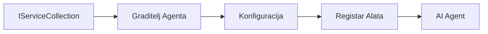

# 🎨 Agentic obrasci dizajna s Azure OpenAI (Responses API) (.NET)

## 📋 Ciljevi učenja

Ovaj primjer pokazuje poslovne obrasce dizajna za izgradnju inteligentnih agenata koristeći Microsoft Agent Framework u .NET-u s integracijom Azure OpenAI (Responses API). Naučit ćete profesionalne obrasce i arhitektonske pristupe koji čine agente spremnima za proizvodnju, održivima i skalabilnima.

### Poslovni obrasci dizajna

- 🏭 **Factory Pattern (obrazac tvornice)**: Standardizirano kreiranje agenata uz uvoz ovisnosti
- 🔧 **Builder Pattern (obrazac graditelja)**: Fluent konfiguracija i postavljanje agenata
- 🧵 **Thread-Safe Patterns (sigurni obrasci za više niti)**: Upravljanje istovremenim razgovorima
- 📋 **Repository Pattern (obrazac spremišta)**: Organizirano upravljanje alatima i mogućnostima

## 🎯 Arhitektonske prednosti specifične za .NET

### Poslovne značajke

- **Strong Typing (jaka tipizacija)**: Validacija u vremenu kompajliranja i podrška IntelliSenseu
- **Dependency Injection (uvoz ovisnosti)**: Integracija ugrađenog DI kontejnera
- **Configuration Management (upravljenje konfiguracijom)**: IConfiguration i obrasci Options
- **Async/Await**: Podrška prvoklasnog asinkronog programiranja

### Obrasci spremni za proizvodnju

- **Logging Integration (integracija zapisivanja)**: ILogger i podrška strukturiranom zapisivanju
- **Health Checks (provjere zdravlja)**: Ugrađeni nadzor i dijagnostika
- **Configuration Validation (validacija konfiguracije)**: Jaka tipizacija s podacima za anotaciju
- **Error Handling (rukovanje pogreškama)**: Strukturirano upravljanje iznimkama

## 🔧 Tehnička arhitektura

### Temeljne .NET komponente

- **Microsoft.Extensions.AI**: Jedinstvene apstrakcije AI usluga
- **Microsoft.Agents.AI**: Okvir za orkestraciju poslovnih agenata
- **Azure OpenAI (Responses API)**: Visokoučinkoviti obrasci API klijenta
- **Configuration System (sustav konfiguracije)**: appsettings.json i integracija s okruženjem

### Implementacija obrasca dizajna



## 🏗️ Demonstrirani poslovni obrasci

### 1. **Kreacijski obrasci**

- **Agent Factory (tvornica agenata)**: Centralizirano kreiranje agenata s ujednačenom konfiguracijom
- **Builder Pattern (obrazac graditelja)**: Fluent API za složenu konfiguraciju agenata
- **Singleton Pattern (obrazac singltona)**: Dijeljeni resursi i upravljanje konfiguracijom
- **Dependency Injection (uvoz ovisnosti)**: Slaba povezanost i testabilnost

### 2. **Ponašajni obrasci**

- **Strategy Pattern (obrazac strategije)**: Mjenjive strategije izvršavanja alata
- **Command Pattern (obrazac naredbe)**: Inkapsulirane operacije agenata s poništavanjem/ponavljanjem
- **Observer Pattern (obrazac promatrača)**: Upravljanje životnim ciklusom agenata vođeno događajima
- **Template Method (obrazac predloška metode)**: Standardizirani tijekovi rada izvršenja agenata

### 3. **Strukturni obrasci**

- **Adapter Pattern (obrazac adaptera)**: Sloj integracije Azure OpenAI (Responses API)
- **Decorator Pattern (obrazac dekoratora)**: Proširenje mogućnosti agenata
- **Facade Pattern (obrazac fasade)**: Pojednostavljeni sučelja za interakciju agenata
- **Proxy Pattern (obrazac proksija)**: Lijeno učitavanje i keširanje za performanse

## 📚 Principi dizajna .NET-a

### SOLID principi

- **Single Responsibility (princip jedne odgovornosti)**: Svaka komponenta ima jednu jasnu svrhu
- **Open/Closed (princip otvorenosti/zatvorenosti)**: Proširiv bez izmjena
- **Liskov Substitution (Liskovljeva supstitucija)**: Implementacije alata temeljene na sučeljima
- **Interface Segregation (segregacija sučelja)**: Fokusirana, kohezivna sučelja
- **Dependency Inversion (inverzija ovisnosti)**: Ovisnost o apstrakcijama, ne o konkretnim tipovima

### Čista arhitektura

- **Domain Layer (domen sloj)**: Jezgra apstrakcija agenata i alata
- **Application Layer (aplikacijski sloj)**: Orkestracija agenata i tijekovi rada
- **Infrastructure Layer (infrastrukturni sloj)**: Integracija Azure OpenAI (Responses API) i vanjskih usluga
- **Presentation Layer (prezentacijski sloj)**: Interakcija s korisnikom i formatiranje odgovora

## 🔒 Poslovni aspekti

### Sigurnost

- **Credential Management (upravljanje vjerodajnicama)**: Sigurno rukovanje API ključevima uz IConfiguration
- **Input Validation (validacija ulaza)**: Jaka tipizacija i validacija putem anotacija podataka
- **Output Sanitization (sanitacija izlaza)**: Sigurno procesiranje i filtriranje odgovora
- **Audit Logging (zapisivanje revizije)**: Sveobuhvatno praćenje operacija

### Performanse

- **Async Patterns (asinkroni obrasci)**: Neblokirajuće I/O operacije
- **Connection Pooling (povezivanje veza)**: Efikasno upravljanje HTTP klijentom
- **Caching (keširanje)**: Keširanje odgovora za poboljšane performanse
- **Resource Management (upravljanje resursima)**: Ispravno odlaganje i obrasci čišćenja

### Skalabilnost

- **Thread Safety (sigurnost niti)**: Podrška istovremenom izvođenju agenata
- **Resource Pooling (povezivanje resursa)**: Efikasno korištenje resursa
- **Load Management (upravljanje opterećenjem)**: Ograničavanje brzine i upravljanje pritiskom
- **Monitoring (nadgledanje)**: Mjerne vrijednosti performansi i provjere zdravlja

## 🚀 Proizvodno postavljanje

- **Configuration Management (upravljanje konfiguracijom)**: Postavke specifične za okruženje
- **Logging Strategy (strategija zapisivanja)**: Strukturirano zapisivanje s ID-ovima korelacije
- **Error Handling (rukovanje pogreškama)**: Globalno rukovanje iznimkama s ispravnim oporavkom
- **Monitoring (nadgledanje)**: Application Insights i mjerači performansi
- **Testing (testiranje)**: Jedinični testovi, integracijski testovi i obrasci testiranja opterećenja

Spremni za izgradnju inteligentnih agenata razine poduzeća s .NET-om? Dizajnirajmo nešto čvrsto! 🏢✨

## 🚀 Početak rada

### Preduvjeti

- [.NET 10 SDK](https://dotnet.microsoft.com/download/dotnet/10.0) ili noviji
- Pretplata na [Azure](https://azure.microsoft.com/free/) s Azure OpenAI resursom i distribucijom modela
- [Azure CLI](https://learn.microsoft.com/cli/azure/install-azure-cli) — prijavite se s `az login`

### Potrebne varijable okruženja

```bash
# zsh/bash
export AZURE_OPENAI_ENDPOINT=https://<your-resource>.openai.azure.com
export AZURE_OPENAI_DEPLOYMENT=gpt-4.1-mini
# Zatim se prijavite kako bi AzureCliCredential mogao dobiti token
az login
```

```powershell
# PowerShell
$env:AZURE_OPENAI_ENDPOINT = "https://<your-resource>.openai.azure.com"
$env:AZURE_OPENAI_DEPLOYMENT = "gpt-4.1-mini"
# Zatim se prijavite kako bi AzureCliCredential mogao dobiti token
az login
```

### Primjer koda

Za pokretanje primjera koda,

```bash
# zsh/bash
chmod +x ./03-dotnet-agent-framework.cs
./03-dotnet-agent-framework.cs
```

Ili koristeći dotnet CLI:

```bash
dotnet run ./03-dotnet-agent-framework.cs
```

Pogledajte [`03-dotnet-agent-framework.cs`](../../../../03-agentic-design-patterns/code_samples/03-dotnet-agent-framework.cs) za kompletan kod.

```csharp
#!/usr/bin/dotnet run

#:package Microsoft.Extensions.AI@10.*
#:package Microsoft.Agents.AI.OpenAI@1.*-*
#:package Azure.AI.OpenAI@2.1.0
#:package Azure.Identity@1.13.1

using System.ComponentModel;

using Microsoft.Agents.AI;
using Microsoft.Extensions.AI;

using Azure.AI.OpenAI;
using Azure.Identity;

// Tool Function: Random Destination Generator
// This static method will be available to the agent as a callable tool
// The [Description] attribute helps the AI understand when to use this function
// This demonstrates how to create custom tools for AI agents
[Description("Provides a random vacation destination.")]
static string GetRandomDestination()
{
    // List of popular vacation destinations around the world
    // The agent will randomly select from these options
    var destinations = new List<string>
    {
        "Paris, France",
        "Tokyo, Japan",
        "New York City, USA",
        "Sydney, Australia",
        "Rome, Italy",
        "Barcelona, Spain",
        "Cape Town, South Africa",
        "Rio de Janeiro, Brazil",
        "Bangkok, Thailand",
        "Vancouver, Canada"
    };

    // Generate random index and return selected destination
    // Uses System.Random for simple random selection
    var random = new Random();
    int index = random.Next(destinations.Count);
    return destinations[index];
}

// Azure OpenAI with the Responses API (stable v1 endpoint). Sign in with `az login`.
var azureEndpoint = Environment.GetEnvironmentVariable("AZURE_OPENAI_ENDPOINT")
    ?? throw new InvalidOperationException("AZURE_OPENAI_ENDPOINT is not set.");
var deployment = Environment.GetEnvironmentVariable("AZURE_OPENAI_DEPLOYMENT") ?? "gpt-4.1-mini";

var azureClient = new AzureOpenAIClient(new Uri(azureEndpoint), new AzureCliCredential());

// Define Agent Identity and Comprehensive Instructions
// Agent name for identification and logging purposes
var AGENT_NAME = "TravelAgent";

// Detailed instructions that define the agent's personality, capabilities, and behavior
// This system prompt shapes how the agent responds and interacts with users
var AGENT_INSTRUCTIONS = """
You are a helpful AI Agent that can help plan vacations for customers.

Important: When users specify a destination, always plan for that location. Only suggest random destinations when the user hasn't specified a preference.

When the conversation begins, introduce yourself with this message:
"Hello! I'm your TravelAgent assistant. I can help plan vacations and suggest interesting destinations for you. Here are some things you can ask me:
1. Plan a day trip to a specific location
2. Suggest a random vacation destination
3. Find destinations with specific features (beaches, mountains, historical sites, etc.)
4. Plan an alternative trip if you don't like my first suggestion

What kind of trip would you like me to help you plan today?"

Always prioritize user preferences. If they mention a specific destination like "Bali" or "Paris," focus your planning on that location rather than suggesting alternatives.
""";

// Create AI Agent with Advanced Travel Planning Capabilities
// Get the Responses client for the deployment and create the AI agent
// Configure agent with name, detailed instructions, and available tools
// This demonstrates the .NET agent creation pattern with full configuration
AIAgent agent = azureClient
    .GetChatClient(deployment)
    .AsAIAgent(
        name: AGENT_NAME,
        instructions: AGENT_INSTRUCTIONS,
        tools: [AIFunctionFactory.Create(GetRandomDestination)]
    );

// Create New Conversation Session for Context Management
// Initialize a new conversation session to maintain context across multiple interactions
// Sessions enable the agent to remember previous exchanges and maintain conversational state
// This is essential for multi-turn conversations and contextual understanding
var session = await agent.CreateSessionAsync();

// Execute Agent: First Travel Planning Request
// Run the agent with an initial request that will likely trigger the random destination tool
// The agent will analyze the request, use the GetRandomDestination tool, and create an itinerary
// Using the session parameter maintains conversation context for subsequent interactions
await foreach (var update in agent.RunStreamingAsync("Plan me a day trip", session))
{
    await Task.Delay(10);
    Console.Write(update);
}

Console.WriteLine();

// Execute Agent: Follow-up Request with Context Awareness
// Demonstrate contextual conversation by referencing the previous response
// The agent remembers the previous destination suggestion and will provide an alternative
// This showcases the power of conversation sessions and contextual understanding in .NET agents
await foreach (var update in agent.RunStreamingAsync("I don't like that destination. Plan me another vacation.", session))
{
    await Task.Delay(10);
    Console.Write(update);
}
```

---

<!-- CO-OP TRANSLATOR DISCLAIMER START -->
**Napomena**:
Ovaj dokument je preveden korištenjem AI prevoditeljskog servisa [Co-op Translator](https://github.com/Azure/co-op-translator). Iako težimo točnosti, imajte na umu da automatski prijevodi mogu sadržavati greške ili netočnosti. Izvorni dokument na izvornom jeziku treba smatrati autoritativnim izvorom. Za važne informacije preporuča se profesionalni ljudski prijevod. Nismo odgovorni za bilo kakva nesporazumevanja ili pogrešne interpretacije koje proizlaze iz korištenja ovog prijevoda.
<!-- CO-OP TRANSLATOR DISCLAIMER END -->