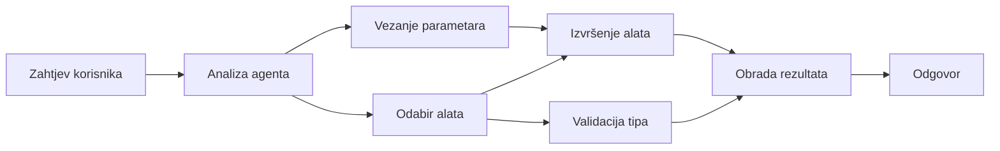

# 🛠️ Napredno korištenje alata s Azure OpenAI (Responses API) (.NET)

## 📋 Ciljevi učenja

Ovaj bilježnik prikazuje obrasce integracije alata za razinu poduzeća koristeći Microsoft Agent Framework u .NET-u s Azure OpenAI (Responses API). Naučit ćete kako izgraditi sofisticirane agente s više specijaliziranih alata, iskorištavajući jaku tipizaciju C# i značajke .NET-a za poduzeća.

### Napredne mogućnosti alata koje ćete savladati

- 🔧 **Arhitektura s više alata**: Izgradnja agenata s više specijaliziranih sposobnosti
- 🎯 **Sigurno izvršavanje alata s tipovima**: Iskorištavanje provjere u fazi kompilacije u C#
- 📊 **Obrasci alata za poduzeća**: Dizajn alata spremnih za proizvodnju i upravljanje pogreškama
- 🔗 **Sastavljanje alata**: Kombiniranje alata za složene poslovne tokove rada

## 🎯 Prednosti arhitekture alata u .NET-u

### Značajke alata za poduzeća

- **Provjera u fazi kompilacije**: Jaka tipizacija osigurava ispravnost parametara alata
- **Umetanje ovisnosti**: Integracija IoC spremnika za upravljanje alatima
- **Async/Await obrasci**: Neblokirajuće izvršavanje alata s pravilnim upravljanjem resursima
- **Strukturirano bilježenje**: Ugrađena integracija zapisivanja za praćenje izvršavanja alata

### Obrasci spremni za proizvodnju

- **Upravljanje iznimkama**: Sveobuhvatno upravljanje pogreškama s tipiziranim iznimkama
- **Upravljanje resursima**: Pravilan uzorak odlaganja i upravljanja memorijom
- **Praćenje izvedbe**: Ugrađene metrike i brojila izvedbe
- **Upravljanje konfiguracijom**: Sigurna konfiguracija s provjerama

## 🔧 Tehnička arhitektura

### Osnovne komponente .NET alata

- **Microsoft.Extensions.AI**: Jedinstvena apstrakcija sloja alata
- **Microsoft.Agents.AI**: Orkestracija alata na nivou poduzeća
- **Azure OpenAI (Responses API)**: Visokoučinkoviti API klijent s upravljanjem konekcijama (connection pooling)

### Cjevovod izvršavanja alata



## 🛠️ Kategorije i obrasci alata

### 1. **Alati za obradu podataka**

- **Provjera unosa**: Jaka tipizacija s atributima podataka
- **Transformacijske operacije**: Sigurna konverzija i oblikovanje podataka
- **Poslovna logika**: Alati za izračune i analize specifične za domenu
- **Oblikovanje izlaza**: Generiranje strukturiranih odgovora

### 2. **Alati za integraciju**

- **API konektori**: Integracija RESTful servisa s HttpClient
- **Alati za bazu podataka**: Integracija Entity Frameworka za pristup podacima
- **Operacije datoteka**: Sigurne operacije datotečnog sustava s validacijom
- **Vanjske usluge**: Obrasci integracije servisa trećih strana

### 3. **Korisni alati**

- **Obrada teksta**: Pomoćni alati za manipulaciju i oblikovanje niza znakova
- **Operacije datuma/vremena**: Izračuni datuma/vremena s poznavanjem kulture
- **Matematički alati**: Precizni izračuni i statističke operacije
- **Alati za validaciju**: Provjera poslovnih pravila i verifikacija podataka

Spremni za izgradnju agenata razine poduzeća s moćnim, sigurnim alatima u .NET-u? Krenimo s izgradnjom profesionalnih rješenja! 🏢⚡

## 🚀 Početak rada

### Preduvjeti

- [.NET 10 SDK](https://dotnet.microsoft.com/download/dotnet/10.0) ili noviji
- [Pretplata na Azure](https://azure.microsoft.com/free/) s Azure OpenAI resursom i implementacijom modela
- [Azure CLI](https://learn.microsoft.com/cli/azure/install-azure-cli) — prijavite se s `az login`

### Potrebne varijable okoline

```bash
# zsh/bash
export AZURE_OPENAI_ENDPOINT=https://<your-resource>.openai.azure.com
export AZURE_OPENAI_DEPLOYMENT=gpt-5-mini
# Zatim se prijavite kako bi AzureCliCredential mogao dobiti token
az login
```

```powershell
# PowerShell
$env:AZURE_OPENAI_ENDPOINT = "https://<your-resource>.openai.azure.com"
$env:AZURE_OPENAI_DEPLOYMENT = "gpt-5-mini"
# Zatim se prijavite kako bi AzureCliCredential mogao dobiti token
az login
```

### Primjer koda

Za pokretanje primjera koda,

```bash
# zsh/bash
chmod +x ./04-dotnet-agent-framework.cs
./04-dotnet-agent-framework.cs
```

Ili korištenjem dotnet CLI:

```bash
dotnet run ./04-dotnet-agent-framework.cs
```

Pogledajte [`04-dotnet-agent-framework.cs`](../../../../04-tool-use/code_samples/04-dotnet-agent-framework.cs) za kompletan kod.

```csharp
#!/usr/bin/dotnet run

#:package Microsoft.Extensions.AI@10.*
#:package Microsoft.Agents.AI.OpenAI@1.*-*
#:package Azure.AI.OpenAI@2.1.0
#:package Azure.Identity@1.13.1

using System.ComponentModel;

using Microsoft.Agents.AI;
using Microsoft.Extensions.AI;

using Azure.AI.OpenAI;
using Azure.Identity;

// Tool Function: Random Destination Generator
// This static method will be available to the agent as a callable tool
// The [Description] attribute helps the AI understand when to use this function
// This demonstrates how to create custom tools for AI agents
[Description("Provides a random vacation destination.")]
static string GetRandomDestination()
{
    // List of popular vacation destinations around the world
    // The agent will randomly select from these options
    var destinations = new List<string>
    {
        "Paris, France",
        "Tokyo, Japan",
        "New York City, USA",
        "Sydney, Australia",
        "Rome, Italy",
        "Barcelona, Spain",
        "Cape Town, South Africa",
        "Rio de Janeiro, Brazil",
        "Bangkok, Thailand",
        "Vancouver, Canada"
    };

    // Generate random index and return selected destination
    // Uses System.Random for simple random selection
    var random = new Random();
    int index = random.Next(destinations.Count);
    return destinations[index];
}

// Azure OpenAI with the Responses API (stable v1 endpoint). Sign in with `az login`.
var azureEndpoint = Environment.GetEnvironmentVariable("AZURE_OPENAI_ENDPOINT")
    ?? throw new InvalidOperationException("AZURE_OPENAI_ENDPOINT is not set.");
var deployment = Environment.GetEnvironmentVariable("AZURE_OPENAI_DEPLOYMENT") ?? "gpt-5-mini";

var azureClient = new AzureOpenAIClient(new Uri(azureEndpoint), new AzureCliCredential());

// Define Agent Identity and Comprehensive Instructions
// Agent name for identification and logging purposes
var AGENT_NAME = "TravelAgent";

// Detailed instructions that define the agent's personality, capabilities, and behavior
// This system prompt shapes how the agent responds and interacts with users
var AGENT_INSTRUCTIONS = """
You are a helpful AI Agent that can help plan vacations for customers.

Important: When users specify a destination, always plan for that location. Only suggest random destinations when the user hasn't specified a preference.

When the conversation begins, introduce yourself with this message:
"Hello! I'm your TravelAgent assistant. I can help plan vacations and suggest interesting destinations for you. Here are some things you can ask me:
1. Plan a day trip to a specific location
2. Suggest a random vacation destination
3. Find destinations with specific features (beaches, mountains, historical sites, etc.)
4. Plan an alternative trip if you don't like my first suggestion

What kind of trip would you like me to help you plan today?"

Always prioritize user preferences. If they mention a specific destination like "Bali" or "Paris," focus your planning on that location rather than suggesting alternatives.
""";

// Create AI Agent with Advanced Travel Planning Capabilities
// Get the Responses client for the deployment and create the AI agent
// Configure agent with name, detailed instructions, and available tools
// This demonstrates the .NET agent creation pattern with full configuration
AIAgent agent = azureClient
    .GetChatClient(deployment)
    .AsAIAgent(
        name: AGENT_NAME,
        instructions: AGENT_INSTRUCTIONS,
        tools: [AIFunctionFactory.Create(GetRandomDestination)]
    );

// Create New Conversation Session for Context Management
// Initialize a new conversation session to maintain context across multiple interactions
// Sessions enable the agent to remember previous exchanges and maintain conversational state
// This is essential for multi-turn conversations and contextual understanding
await using var session = await agent.CreateSessionAsync();

// Execute Agent: First Travel Planning Request
// Run the agent with an initial request that will likely trigger the random destination tool
// The agent will analyze the request, use the GetRandomDestination tool, and create an itinerary
// Using the session parameter maintains conversation context for subsequent interactions
await foreach (var update in agent.RunStreamingAsync("Plan me a day trip", session))
{
    await Task.Delay(10);
    Console.Write(update);
}

Console.WriteLine();

// Execute Agent: Follow-up Request with Context Awareness
// Demonstrate contextual conversation by referencing the previous response
// The agent remembers the previous destination suggestion and will provide an alternative
// This showcases the power of conversation sessions and contextual understanding in .NET agents
await foreach (var update in agent.RunStreamingAsync("I don't like that destination. Plan me another vacation.", session))
{
    await Task.Delay(10);
    Console.Write(update);
}
```

---

<!-- CO-OP TRANSLATOR DISCLAIMER START -->
**Napomena**:
Ovaj dokument je preveden korištenjem AI prevoditeljskog servisa [Co-op Translator](https://github.com/Azure/co-op-translator). Iako težimo točnosti, imajte na umu da automatski prijevodi mogu sadržavati greške ili netočnosti. Izvorni dokument na izvornom jeziku treba smatrati autoritativnim izvorom. Za važne informacije preporuča se profesionalni ljudski prijevod. Nismo odgovorni za bilo kakva nesporazumevanja ili pogrešne interpretacije koje proizlaze iz korištenja ovog prijevoda.
<!-- CO-OP TRANSLATOR DISCLAIMER END -->