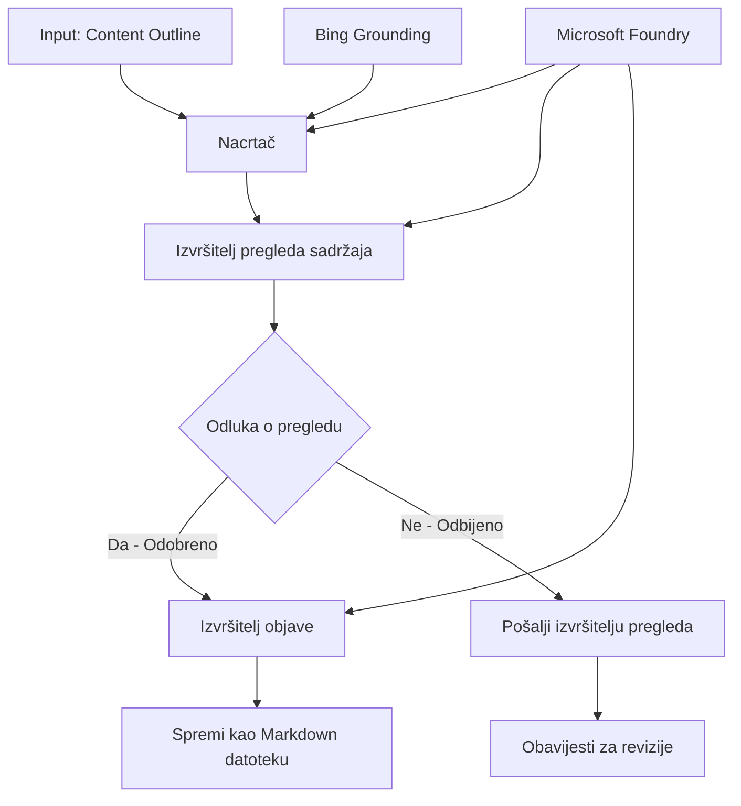

# 🔀 Uvjetni tijekovi rada agenata s Microsoft Foundry (.NET)

## 📋 Vodič kroz inteligentne tijekove rada zasnovane na odlukama

Ovaj bilježnik demonstrira **uzorke uvjetnih tijekova rada** koristeći Microsoft Foundry i Microsoft Agent Framework za .NET. Naučit ćete kako izgraditi sofisticirane, odlukama vođene tijekove rada koji inteligentno usmjeravaju procesiranje na osnovi AI analize, poslovnih pravila i dinamičnih uvjeta za automatizaciju razine poduzeća.

## 🎯 Ciljevi učenja

### 🧠 **Arhitektura inteligentnih odluka**
- **Implementacija uvjetne logike**: Izgradite složena stabla odluka s više točaka grananja
- **Usmjeravanje potpomognuto AI-jem**: Koristite Microsoft Foundry modele za pametno donošenje odluka o usmjeravanju
- **Dinamična prilagodba tijeka rada**: Mijenjajte ponašanje tijeka rada temeljem analize u stvarnom vremenu i uvjeta
- **Integracija poslovnih pravila**: Uključite poslovnu logiku i zahtjeve usklađenosti u tijekove rada

### 🔀 **Napredni uvjetni obrasci**
- **Višekriterijsko donošenje odluka**: Procijenite više faktora za odluke o usmjeravanju
- **Obrada svjesna konteksta**: Donosite odluke na temelju nakupljenog konteksta i povijesti tijeka rada
- **Prilagodljiva modifikacija tijeka rada**: Dinamički prilagodite putove procesiranja prema uvjetima u stvarnom vremenu
- **Integracija s motorom pravila**: Implementirajte sofisticirane motore poslovnih pravila unutar tijekova rada

### 🏢 **Uvjetne aplikacije za poduzeća**
- **Klasifikacija i usmjeravanje dokumenata**: Automatski klasificirajte i usmjeravajte dokumente u odgovarajuće tijekove rada
- **Triage korisničke službe**: Inteligentno usmjeravanje upita korisnika specijaliziranim timovima za obradu
- **Usklađenost i obrada rizika**: Primjena različitih procesa provjere i pregleda na osnovu procjene rizika
- **Tijekovi osiguranja kvalitete**: Usmjeravanje sadržaja kroz odgovarajuće procese pregleda temeljem mjera kvalitete

## ⚙️ Preduvjeti i postavljanje

### 📦 **Potrebni NuGet paketi**

Napredni paketi za uvjetno procesiranje tijeka rada:

```xml
<!-- Core AI Framework -->
<PackageReference Include="Microsoft.Extensions.AI" Version="9.9.0" />

<!-- Azure AI Agents with Persistent State -->
<PackageReference Include="Azure.AI.Agents.Persistent" Version="1.2.0-beta.5" />

<!-- Azure Identity and Utilities -->
<PackageReference Include="Azure.Identity" Version="1.15.0" />
<PackageReference Include="System.Linq.Async" Version="6.0.3" />
<PackageReference Include="DotNetEnv" Version="3.1.1" />

<!-- Local Workflow Framework References -->
<!-- Microsoft.Agents.Workflows.dll - Advanced workflow orchestration -->
<!-- Microsoft.Agents.AI.AzureAI.dll - Microsoft Foundry integration -->
<!-- Microsoft.Agents.AI.dll - Core agent abstractions -->
```

### 🔑 **Konfiguracija Microsoft Foundryja**

**Potrebni Azure resursi:**
- Radni prostor Microsoft Foundry s modelima za uvjetno procesiranje
- Pretplata na Azure s odgovarajućim kvotama i dopuštenjima računanja
- Implementirani AI modeli za donošenje odluka i analizu sadržaja
- (Neobavezno) Veza Bing Search API za mogućnosti utemeljenja

**Konfiguracija okoline (.env datoteka):**
```env
# Microsoft Foundry Configuration
AZURE_AI_PROJECT_ENDPOINT=https://your-project.cognitiveservices.azure.com/
BING_CONNECTION_ID=your-bing-connection-id
```

**Postavljanje autentikacije:**
```csharp
// Azure CLI or Managed Identity authentication
using Azure.Identity;
var credential = new AzureCliCredential();

// Load environment configuration
DotNetEnv.Env.Load("../../../.env");
```

### 🏗️ **Arhitektura uvjetnog tijeka rada**



**Ključne komponente:**
- **Draft Executor**: AI agent koji stvara početne nacrte sadržaja iz nacrta strukture
- **Content Review Executor**: AI agent koji procjenjuje kvalitetu i usklađenost nacrta
- **Uvjetno usmjeravanje**: Logika odluka koja usmjerava temeljem rezultata pregleda
- **Putanja objave/pregleda**: Odvojeni putovi procesiranja za odobreni i odbijeni sadržaj
- **Upravljanje stanjem**: Održava kontekst sadržaja i pregleda kroz tijek rada

## 🎨 **Dizajnerski obrasci uvjetnog tijeka rada**

### 📋 **Proizvodnja sadržaja s kvalitetnim vratima**
```
Outline → Draft Creation → Quality Review → {Approve: Publish | Reject: Revise}
```

### 🎯 **Obrada dokumenata na temelju rizika**
```
Document → Risk Assessment → {Low: Standard | High: Enhanced Review}
```

### 🔍 **Inteligentno usmjeravanje korisničke službe**
```
Customer Query → Analysis → {Simple: FAQ Bot | Complex: Human Agent}
```

### 💼 **Tijekovi usklađenosti**
```
Content → Compliance Check → {Pass: Publish | Fail: Legal Review}
```

## 🏢 **Prednosti uvjetnih tijekova za poduzeća**

### 🎯 **Inteligentna automatizacija**
- **Pametno donošenje odluka**: Odluke o usmjeravanju potpomognute AI-jem temeljem analize sadržaja i konteksta
- **Prilagodljivo procesiranje**: Tijekovi rada koji se automatski prilagođavaju promjenama uvjeta
- **Provedba poslovnih pravila**: Automatska primjena složene poslovne logike i politika
- **Usmjeravanje obzirno prema kontekstu**: Odluke na osnovi pune povijesti tijeka rada i nagomilanog konteksta

### 📈 **Operativna izvrsnost**
- **Optimirana dodjela resursa**: Usmjerava rad najprikladnijim stručnjacima i procesima
- **Smanjena manuelna intervencija**: Automatizirano donošenje odluka minimizira potrebu za ljudskim usmjeravanjem
- **Brže vrijeme rješavanja**: Izravno usmjeravanje prema odgovarajućim stručnjacima i kapacitetima obrade
- **Konzistentna primjena**: Jednolika primjena poslovnih pravila i kriterija odluka

### 🛡️ **Upravljanje rizikom i usklađenost**
- **Automatska procjena rizika**: Evaluacija razine rizika sadržaja i situacije potpomognuta AI-jem
- **Provedba usklađenosti**: Automatsko usmjeravanje kroz potrebne regulatorne procese
- **Primjena sigurnosnih protokola**: Poboljšane sigurnosne mjere primijenjene na osnovu procjene rizika
- **Održavanje zapisnika**: Potpuna dokumentacija odluka o usmjeravanju i njihovih obrazloženja

### 📊 **Analitika i kontinuirano poboljšanje**
- **Analitika odluka**: Praćenje učinkovitosti i točnosti odluka o usmjeravanju
- **Prepoznavanje uzoraka**: Identificiranje trendova i obrazaca u odlukama o usmjeravanju tijekom vremena
- **Optimizacija performansi**: Kontinuirano poboljšanje kriterija odluka i efikasnosti usmjeravanja
- **Poslovna inteligencija**: Uvidi u karakteristike sadržaja i zahtjeve procesiranja

### 🔧 **Tehnička izvrsnost**
- **Trajno upravljanje stanjem**: Održava složeno stanje kroz izvršenje tijeka rada
- **Skalabilna arhitektura**: Podržava zahtjeve za obradu uvjetnih tijekova rada velikih razmjera
- **Mogućnosti integracije**: Besprijekorna integracija s postojećim poslovnim sustavima i procesima
- **Nadzor i promatranje**: Sveobuhvatno praćenje performansi tijeka rada i odluka

Izgradimo inteligentne, odlukama vođene tijekove rada za poduzeća s .NET-om! 🚀

## 💻 Pokretanje koda

Cjelovita implementacija dostupna je u `04.dotnet-agent-framework-workflow-aifoundry-condition.cs`. Ovo demonstrira **tijek proizvodnje sadržaja s kvalitetnim vratima**:

### 🏗️ **Arhitektura tijeka rada**

```
Content Outline → Draft Creation → Quality Review → Conditional Routing:
                                                      ├─ Approved (>200 words) → Publish
                                                      └─ Rejected (<200 words) → Review Notification
```

**Agenti u tijeku rada:**
1. **Evangelist Agent**: Stvara nacrte vodiča iz nacrta strukture s Bing utemeljenjem
2. **Content Reviewer Agent**: Procjenjuje kvalitetu nacrta (broj riječi, potpunost)
3. **Publisher Agent**: Spremi odobreni sadržaj kao označene Markdown datoteke s vremenskim pečatom

**Prilagođeni izvršitelji:**
1. **DraftExecutor**: Koordinira izradu nacrta
2. **ContentReviewExecutor**: Obavlja procjenu kvalitete
3. **PublishExecutor**: Upravlja objavom odobrenog sadržaja
4. **SendReviewExecutor**: Upravljanje obavijestima o odbijenom sadržaju

### 🚀 Pokretanje primjera

**Preduvjeti:**
- Konfiguriran radni prostor Microsoft Foundry
- Azure CLI autentikacija (`az login`)
- (Neobavezno) Veza Bing Search za utemeljenje

```bash
# Napravite skriptu izvršnom (Unix/Linux/macOS)
chmod +x 04.dotnet-agent-framework-workflow-aifoundry-condition.cs

# Pokrenite uvjetni tijek rada
./04.dotnet-agent-framework-workflow-aifoundry-condition.cs
```

Ili na Windowsima:
```powershell
dotnet run 04.dotnet-agent-framework-workflow-aifoundry-condition.cs
```

### 📝 Očekivani ishod

Tijek rada će:
1. **Kreirati agente**: Inicijalizirati tri specijalizirana Microsoft Foundry agenta
2. **Generirati nacrt**: Evangelist agent kreira nacrt vodiča iz strukture
3. **Pregledati sadržaj**: Content Reviewer procjenjuje kvalitetu nacrta
4. **Uvjetno usmjeravanje**:
   - **Ako je odobreno (>200 riječi)**: Publish executor sprema sadržaj kao Markdown datoteku
   - **Ako je odbijeno (<200 riječi)**: Pošalji obavijest o pregledu
5. **Prikazati rezultate**: Prikaži konačni ishod tijeka rada

### 🔧 Opcije prilagodbe

**Izmjena kriterija pregleda:**
```csharp
const string ContentReviewerInstructions = @"
You are a content reviewer...
1. Check if content is more than 500 words (instead of 200)
2. Verify technical accuracy
3. Ensure proper formatting
...";
```

**Dodavanje više uvjetnih putanja:**
```csharp
var workflow = new WorkflowBuilder(draftExecutor)
    .AddEdge(draftExecutor, contentReviewerExecutor)
    .AddEdge(contentReviewerExecutor, publishExecutor, condition: GetCondition("Excellent"))
    .AddEdge(contentReviewerExecutor, editExecutor, condition: GetCondition("Good"))
    .AddEdge(contentReviewerExecutor, sendReviewerExecutor, condition: GetCondition("Poor"))
    .Build();
```

**Promjena zahtjeva za sadržajem:**
```csharp
string OUTLINE_Content = @"
# Your Custom Topic
## Section 1
https://your-reference-url
## Section 2
...
";
```

### 🎯 Primjene u stvarnom svijetu

Ovaj uzorak uvjetnog tijeka rada idealan je za:
- **Sustave za upravljanje sadržajem**: Automatizirani urednički tijekovi rada s kvalitetnim vratima
- **Obradu dokumenata**: Usmjeravanje dokumenata prema klasifikaciji i usklađenosti
- **Korisničku podršku**: Inteligentno usmjeravanje zahtjeva ovisno o složenosti i hitnosti
- **Pravni pregled**: Usmjeravanje ugovora prema procjeni rizika i vrijednosti
- **HR procese**: Usmjeravanje prijava kroz odgovarajuće procese filtriranja

### 🔍 Razumijevanje uvjetne logike

**Funkcija uvjeta:**
```csharp
public Func<object?, bool> GetCondition(string expectedResult) =>
    reviewResult => reviewResult is ReviewResult review && review.Result == expectedResult;
```

Ova funkcija kreira predikat koji:
1. Provjerava je li rezultat tipa `ReviewResult`
2. Uspoređuje svojstvo `Result` s očekivanom vrijednosti
3. Vraća true/false za određivanje usmjeravanja

**Rubovi tijeka rada s uvjetima:**
```csharp
.AddEdge(contentReviewerExecutor, publishExecutor, condition: GetCondition("Yes"))
.AddEdge(contentReviewerExecutor, sendReviewerExecutor, condition: GetCondition("No"))
```

### 📊 Napredne značajke

**Validacija JSON šema:**
Tijek rada koristi JSON šeme kako bi osigurao strukturirane odgovore:

```csharp
// Define response structure
public class ReviewResult
{
    [JsonPropertyName("review_result")]
    public string Result { get; set; } = string.Empty;
    
    [JsonPropertyName("reason")]
    public string Reason { get; set; } = string.Empty;
    
    [JsonPropertyName("draft_content")]
    public string DraftContent { get; set; } = string.Empty;
}

// Apply to agent
ResponseFormat = ChatResponseFormat.ForJsonSchema(
    AIJsonUtilities.CreateJsonSchema(typeof(ReviewResult)), 
    "ReviewResult", 
    "Review Result From DraftContent"
)
```

**Integracija Bing utemeljenja:**
Evangelist agent koristi Bing utemeljenje za pristup informacijama u stvarnom vremenu:

```csharp
var bingGroundingConfig = new BingGroundingSearchConfiguration(bing_conn_id);
BingGroundingToolDefinition bingGroundingTool = new(
    new BingGroundingSearchToolParameters([bingGroundingConfig])
);
```

Ovo omogućuje agentu praćenje URL-ova u nacrtu i izvlačenje aktualnih informacija.

### 🛡️ Rukovanje pogreškama

Tijek rada uključuje robusno rukovanje pogreškama za odbijeni sadržaj:
- Neuspjesi u pregledu aktiviraju alternativni put
- Obavijesti pružaju jasne razloge odbijanja
- Sadržaj se čuva za reviziju

### 🔄 Proširenje tijeka rada

**Dodajte petlju revizije:**
Kreirajte povratnu petlju koja automatski redrafta sadržaj:

```csharp
.AddEdge(contentReviewerExecutor, publishExecutor, condition: GetCondition("Yes"))
.AddEdge(contentReviewerExecutor, draftExecutor, condition: GetCondition("No")) // Loop back
```

**Implementirajte višerazinski pregled:**
Dodajte više faza pregleda s različitim kriterijima:

```csharp
.AddEdge(draftExecutor, technicalReviewer)
.AddEdge(technicalReviewer, editorialReviewer, condition: GetCondition("TechPass"))
.AddEdge(editorialReviewer, publishExecutor, condition: GetCondition("EditPass"))
```

Ovaj uzorak uvjetnog tijeka rada pruža temelj za izgradnju složenih, inteligentnih sustava automatizacije za poduzeća! 🚀

---

<!-- CO-OP TRANSLATOR DISCLAIMER START -->
**Napomena**:
Ovaj dokument je preveden korištenjem AI prevoditeljskog servisa [Co-op Translator](https://github.com/Azure/co-op-translator). Iako težimo točnosti, imajte na umu da automatski prijevodi mogu sadržavati greške ili netočnosti. Izvorni dokument na izvornom jeziku treba smatrati autoritativnim izvorom. Za važne informacije preporuča se profesionalni ljudski prijevod. Nismo odgovorni za bilo kakva nesporazumevanja ili pogrešne interpretacije koje proizlaze iz korištenja ovog prijevoda.
<!-- CO-OP TRANSLATOR DISCLAIMER END -->