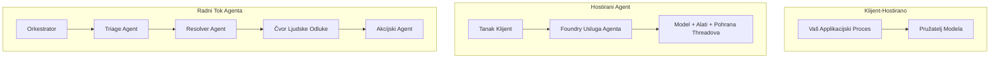
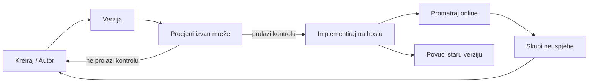
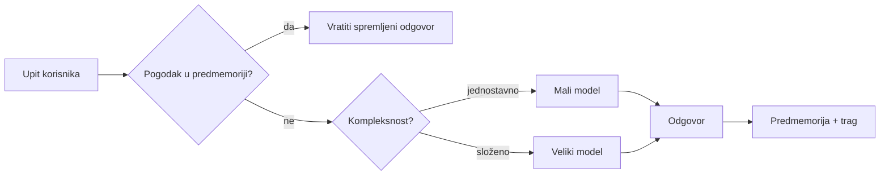
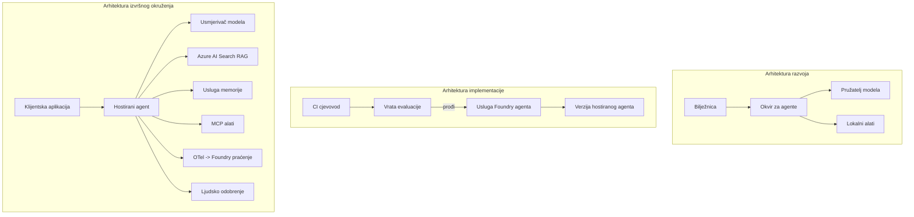

# Implementacija skalabilnih agenata s Microsoft Foundryjem


Do sada u tečaju gradili ste agente koji rade na vašem prijenosniku, unutar bilježnice, pokretani `az login` i nekoliko varijabli okoline. To je upravo pravi način za učenje. Međutim, to nije pravi način za pokretanje agenta na kojeg tisuće korisnika ovise u 3 ujutro.

Ova lekcija govori o jazu između "radi na mom stroju" i "radi pouzdano i pristupačno u produkciji." Taj jaz zatvaramo pomoću **Microsoft Foundryja** i **Microsoft Foundry Agent Service**, gradeći stvarnog agenta za korisničku podršku koji ima alate, dohvat, memoriju, evaluaciju i praćenje.

## Uvod

Ova lekcija će obuhvatiti:

- Razliku između **prototipnog agenta** i **implementiranog agenta**, i zašto prijelaz najviše ovisi o svemu *oko* modela.
- **Obrasce implementacije** za agente: klijent-hostirani, servis-hostirani (Hosted Agents) i orkestrirani tokovi rada.
- **Životni ciklus agenta** na Microsoft Foundryju — kreiranje, verzioniranje, implementacija, evaluacija, promatranje, povlačenje.
- **Strategije skaliranja**: usmjeravanje modela, keširanje, konkurentnost i bezdržavni dizajn.
- **Promatranje** s OpenTelemetry i Foundry praćenjem.
- **Optimizacija troškova** kroz izbor modela, usmjeravanje i evaluacijske kapije.
- **Razmatranja za poduzeća**: upravljanje, odobrenje od strane ljudi i sigurno pokretanje MCP servera u produkciji.

## Ciljevi učenja

Nakon završetka ove lekcije znat ćete kako:

- Odabrati pravilan obrazac implementacije za zadani radni opterećenje agenta.
- Implementirati agenta u Microsoft Foundry Agent Service tako da bude verzioniran, upravljan i promatran.
- Instrumentirati agenta za praćenje i povezati evaluacijski tok koji se izvodi prije svakog izdanja.
- Primijeniti usmjeravanje modela i keširanje radi kontrole latencije i troškova u mjeri.
- Dodati kapiju za ljudsko odobrenje za visokorizične radnje i integrirati MCP server na siguran način za produkciju.

## Preduvjeti

Ova lekcija pretpostavlja da ste završili ranije lekcije i da ste upoznati s:

- Izgradnjom agenata s [Microsoft Agent Framework](../14-microsoft-agent-framework/README.md) (Lekcija 14).
- [Korištenjem alata](../04-tool-use/README.md) (Lekcija 4) i [Agentic RAG](../05-agentic-rag/README.md) (Lekcija 5).
- [Memorijom agenta](../13-agent-memory/README.md) (Lekcija 13) i [Agentic protokolima / MCP](../11-agentic-protocols/README.md) (Lekcija 11).
- [Promatranjem i evaluacijom](../10-ai-agents-production/README.md) (Lekcija 10) — ova lekcija se na nju izravno nadovezuje.

Također će vam trebati:

- **Azure pretplata** i **Microsoft Foundry projekt** s barem jednim implementiranim chat modelom.
- Autentificirani **Azure CLI** (`az login`).
- Python 3.12+ i paketi iz repozitorija [`requirements.txt`](../../../requirements.txt).

## Od prototipa do produkcije: što se zapravo mijenja

Prototipni agent i produkcijski agent dijele isti osnovni ciklus — zaključuju, pozivaju alate, odgovaraju. Ono što se mijenja je sve što je oko tog ciklusa. Model je možda 20% produkcijskog agenta; ostalih 80% je operativni kostur.

| Briga | Prototip | Produkcija |
| --- | --- | --- |
| **Hosting** | Radi u vašoj bilježnici | Radi kao hostirani servis, verzioniran i postepeno uveden |
| **Identitet** | Vaš `az login` token | Upravljani identitet s ograničenim RBAC-om |
| **Stanje** | U memoriji, izgubljeno pri ponovnom pokretanju | Eksternalizirano (spremište dretvi, memorijska usluga) |
| **Pogreška** | Vidite traceback | Pokušaji ponovo, zamjene, mrtvi ulaz, upozorenja |
| **Trošak** | "To je nekoliko centi" | Praćen po zahtjevu, usmjeren, keširan, budžetiran |
| **Kvaliteta** | Vizualno provjeravate izlaz | Automatski evaluirano prije svakog izdanja |
| **Povjerenje** | Odobravate svaku radnju | Pravila + čovjek u petlji za rizične radnje |

Zapamtite ovu tablicu. Svaki odjeljak u nastavku odnosi se na jedan od ovih redaka.

## Obrasci implementacije agenata

Postoje tri obrasca koje ćete koristiti, često u kombinaciji.

### 1. Klijent-hostirani agenti

Objekt agenta živi unutar *vašeg* procesa aplikacije. Vaš kod poziva model pružatelja direktno; petlja rezonovanja radi u vašem servisu. To je ono što je svaka prethodna lekcija radila.

- **Koristite ga kad** trebate potpunu kontrolu nad petljom, prilagođeni middleware ili ugrađujete agenta unutar postojećeg backend-a.
- **Kompromis**: sami se brinete o skaliranju, stanju i otpornosti.

### 2. Hostirani agenti (Foundry Agent Service)

Agent je *registrovan kao resurs* u Microsoft Foundryju. Foundry hostira petlju rezonovanja, pohranjuje dretve, primjenjuje sigurnost sadržaja i RBAC te čini agenta vidljivim u Foundry portalu. Vaša aplikacija postaje lagani klijent koji stvara dretve i čita odgovore.

- **Koristite ga kad** želite postojanost, ugrađenu vidljivost, upravljanje i manji operativni opseg.
- **Kompromis**: manje niskorazinske kontrole u zamjenu za upravljano runtime okruženje.

### 3. Tokovi rada agenata

Više agenata (i alata) se sastavlja u graf s eksplicitnim kontrolnim tokom — uzastopni koraci, grananje, čvorovi za ljudsko odobrenje i trajne kontrolne točke koje mogu pauzirati i nastaviti. To je mogućnost Microsoft Agent Framework **Workflows** primijenjena na skalu implementacije.

- **Koristite ga kad** jedan zadatak obuhvaća nekoliko specijaliziranih agenata ili zahtijeva korak odobrenja u sredini.
- **Kompromis**: više pokretnih dijelova; potrebno je praćenje na razini orkestracije.



## Životni ciklus agenta na Microsoft Foundryju

Implementacija agenta nije jednokratno `push` izvršenje. To je petlja i vrlo sliči ciklusu izdanja softvera jer to i jest.



Ključna ideja, preuzeta iz [Lekcije 10](../10-ai-agents-production/README.md): **offline evaluacija je kapija, a ne naknadna misao.** Nova verzija agenta ne izlazi dok ne prijeđe vašu evaluacijsku granicu. Online vidljivost zatim vraća stvarne greške u vaš offline testni skup. To je cijela petlja.

## Strategije skaliranja

Skaliranje agenta razlikuje se od skaliranja bezdržavnog web API-ja, jer svaki zahtjev može pokrenuti višestruke skupe pozive modela i alata. Četiri tehnike nose veći dio opterećenja.

**Bezdržavno rukovanje zahtjevima.** Nemojte držati stanje po korisniku u memoriji vašeg procesa. Spremite niti razgovora u Foundry spremište niti ili memorijsku uslugu tako da bilo koja instanca može obraditi bilo koji zahtjev. Ovo omogućava horizontalno skaliranje — dodajte instance, bez ljepljivih sesija.

**Usmjeravanje modela.** Nije svaki zahtjev potreban vaš najmoćniji (i najskuplji) model. Usmjerite jednostavne zahtjeve — klasifikaciju namjere, kratke faktografske odgovore — na mali, brzi model i rezervirajte veliki model za stvarno rezoniranje. Foundryjev **Model Router** može to učiniti za vas ili sami implementirajte lagani klasifikator. U labu ćete izraditi samostalnu verziju.

**Keširanje odgovora.** Mnogi upiti podrške su vrlo slični ("kako resetirati lozinku?"). Keširajte odgovore na česta pitanja i poslužite ih bez pozivanja modela. Čak i umjerena stopa pogodaka u kešu značajno smanjuje troškove i latenciju.

**Konkurentnost i backpressure.** Pružatelji modela imaju limite brzine. Ograničite konkurentnost, koristite ponovne pokušaje s eksponencijalnim odmakom i neuspjehe tretirajte elegantno (odgovor u redu čekanja "radimo na tome" bolji je od 500).



## Promatranje u produkciji

Ne možete upravljati onim što ne možete vidjeti. Kao što je objašnjeno u Lekciji 10, Microsoft Agent Framework emitira **OpenTelemetry** praćenja izvorno — svaki poziv modela, poziv alata i korak orkestracije postaje jedan span. U produkciji izvozi se ti spanovi u Microsoft Foundry (ili bilo koji OTel kompatibilan backend) da možete:

- Pratiti jednu korisničku žalbu od početka do kraja kroz svaki poziv modela i alata.
- Promatrati p50/p95 latenciju i trošak po zahtjevu kroz vrijeme.
- Upozoriti na skokove u stopi grešaka i anomalijama troškova prije nego korisnici (ili vaš financijski tim) primijete.

```python
from agent_framework.observability import get_tracer

tracer = get_tracer()

with tracer.start_as_current_span("support_request") as span:
    span.set_attribute("customer.tier", "enterprise")
    span.set_attribute("routed.model", "gpt-5-nano")
    # izvođenje agenta automatski se prati unutar ovog raspona
```

Atributi poput `customer.tier` i `routed.model` pretvaraju zid praćenja u odgovarajuća pitanja ("Jesu li enterprise korisnici prečesto usmjereni na mali model?").

## Optimizacija troškova

Troškovi u produkcijskim agentima dominantno dolaze od tokena. Tri poluge, po utjecaju:

1. **Pravilna veličina modela.** Mali model koji prođe vašu evaluacijsku kapiju gotovo je uvijek jeftiniji od velikog koji također prolazi. Koristite evaluaciju da *dokažete* da je mali model dovoljan, umjesto da iz opreza biraš najveći model.
2. **Usmjeravanje prema složenosti.** Kao gore — plaćajte cijenu velikog modela samo za zahtjeve koji trebaju rezoniranje velikim modelom.
3. **Agresivno keširanje.** Najjeftiniji poziv modela je onaj koji nikad ne napravite.

Evaluacijske kapije i kontrola troškova su ista disciplina gledana s dva kuta: evaluacija vam pokazuje *kvalitetni donju granicu*, usmjeravanje i keširanje vas drže što bliže toj *cijeni* donje granice.

## Razmatranja implementacije za poduzeća

**Upravljanje.** Hosted Agents nasljeđuju Foundryev RBAC, sigurnost sadržaja i zapisnik audita. Dajte svakom agentu upravljani identitet s najmanjim ovlastima koje su potrebne — pristup samo za čitanje baze znanja, ograničen pristup API-ju za ticketing, ništa više.

**Čovjek u petlji.** Neke radnje su previše važne da bi se automatizirale izravno — izdavanje povrata novca, brisanje računa, eskalacija pravnom timu. Microsoft Agent Framework podržava alate koji zahtijevaju **odobrenje**: agent predlaže radnju, izvršenje se pauzira, čovjek odobrava ili odbija, a tok rada nastavlja. Ovaj primitivni oblik ste vidjeli u [Lekciji 6](../06-building-trustworthy-agents/README.md); ovdje ga implementirate.

**MCP u produkciji.** [MCP](../11-agentic-protocols/README.md) omogućuje vašem agentu korištenje vanjskih alata kroz standardni sučelje. U produkciji tretirajte svaki MCP server kao neovisnu granicu: fiksirajte verziju servera, pokrećite ga s ograničenim identitetom, provjeravajte njegove izlaze i nikad ne otkrivajte tajne njemu. MCP server je ovisnost, a ovisnosti se nadograđuju, auditiraju i ograničavaju.



Ta tri dijagrama — razvoj, implementacija, runtime — su isti agent u tri faze života. Lab koji slijedi vodi vas kroz njegovu izradu.

## Praktični lab: Produkcijski spreman agent za korisničku podršku

Otvorite [`code_samples/16-python-agent-framework.ipynb`](./code_samples/16-python-agent-framework.ipynb) i radite ga od početka do kraja. Sastaviti ćete **Contoso agenta za korisničku podršku** sa svim produkcijskim detaljima:

1. **Pozivanje alata** — dohvat statusa narudžbe i otvaranje podataka o podršci.
2. **RAG** — odgovori na pitanja o politici iz baze znanja (Azure AI Search, s memorijskim fallbackom da bilježnica radi bez Search resursa).
3. **Memorija** — pamćenje korisnika kroz okrete razgovora.
4. **Usmjeravanje modela** — klasifikator složenosti usmjerava svaki zahtjev prema malom ili velikom modelu.
5. **Keširanje odgovora** — ponovljena pitanja poslužuju se iz keša.
6. **Ljudsko odobrenje** — povrati iznad praga pauziraju za ljudski potpis.
7. **Evaluacijski tok** — mali offline testni skup boduje agenta i služi kao kapija izdanja.
8. **Promatranje** — OpenTelemetry praćenje oko svakog zahtjeva.

### Korak po korak

Bilježnica je organizirana tako da je svaki produkcijski aspekt samostalna, izvršna sekcija. Srž je rukovatelj zahtjevima s usmjeravanjem plus keširanjem:

```python
async def handle_support_request(query: str, customer_id: str) -> str:
    # 1. Poslužite iz predmemorije kad god je moguće.
    cached = response_cache.get(normalize(query))
    if cached:
        return cached

    # 2. Usmjeravajte prema složenosti radi kontrole troškova.
    model = "gpt-5-nano" if is_simple(query) else "gpt-5-mini"

    # 3. Pokrenite agenta unutar traganja za nadgledanje.
    with tracer.start_as_current_span("support_request") as span:
        span.set_attribute("routed.model", model)
        span.set_attribute("customer.id", customer_id)
        response = await support_agent.run(query, model=model)

    # 4. Predmemorirajte i vratite.
    response_cache.set(normalize(query), response.text)
    return response.text
```

Kapija evaluacije koja štiti izdanje izgleda ovako:

```python
async def evaluation_gate(agent, test_cases, threshold: float = 0.8) -> bool:
    passed = 0
    for case in test_cases:
        result = await agent.run(case["input"])
        if score_response(result.text, case["expected"]) >= 0.8:
            passed += 1
    pass_rate = passed / len(test_cases)
    print(f"Evaluation pass rate: {pass_rate:.0%} (gate: {threshold:.0%})")
    return pass_rate >= threshold  # implementiraj samo ako prolaz vrata uspije
```

Pročitajte svaki red — bilježnica drži primitive namjerno male da ništa nije skriveno iza poziva frameworka.

## Validacija implementiranog agenta s testovima dima

Gornja kapija evaluacije se izvršava *offline* nad vašim objektom agenta. Kad agent bude implementiran kao Hosted Agent, treba vam još jedna, još jeftinija provjera: **odgovara li implementirani endpoint zapravo?**

Implementacija "uspješno" samo dokazuje da je kontrolna ravnina prihvatila definiciju — ne dokazuje da agent odgovara. Nedostajuća ovisnost, loše usmjeravanje modela ili istekla veza mogu ostaviti zelenu implementaciju koja ne vraća ništa. **Test dima** to otkriva u nekoliko sekundi, pri svakoj implementaciji, bez troška pune evaluacije.

Ovaj repozitorij donosi spreman za korištenje pipeline za test dima baziran na GitHub akciji [AI Smoke Test](https://github.com/marketplace/actions/ai-smoke-test):

- **Katalog** — [`tests/lesson-16-smoke-tests.json`](../../../tests/lesson-16-smoke-tests.json) sadrži promptove i tvrdnje za Contoso support agenta (odgovori utemeljeni na politici, dohvat narudžbi, ostajanje na temi i kontinuitet višeokretne niti). Kataloge za agente drugih lekcija možete pronaći uz ovaj — vidi [`tests/README.md`](../tests/README.md).
- **Tok rada** — [`.github/workflows/smoke-test.yml`](../../../.github/workflows/smoke-test.yml) prijavljuje se s Azure OIDC i šalje POST svaki prompt na agentov Responses endpoint, ispuštajući posao pri bilo kojem propustu tvrdnje.

```yaml
- name: Smoke-test hosted agent
  uses: JFolberth/ai-smoketest@v1
  with:
    project_endpoint: ${{ inputs.project_endpoint }}
    agent_name: ContosoSupportAgent
    tests_file: tests/lesson-16-smoke-tests.json
```


Pokrenite ga s kartice **Actions** kada je vaš agent implementiran, pružajući krajnju točku Foundry projekta i ime agenta. Federirana identifikacija treba ulogu **Azure AI User** u opsegu Foundry projekta. Zamislite slojeve kao piramidu: testovi dima (dostupan i reagira li?) pokreću se pri svakoj implementaciji, offline evaluacija (dovoljno dobra za isporuku?) prije promocije, a online evaluacija (kako se ponaša u stvarnom okruženju?) se kontinuirano izvodi.

## Provjera znanja

Testirajte svoje razumijevanje prije nego što prijeđete na zadatak.

**1. Otprilike koliko je „model“ udio proizvodnog agenta, a što je ostatak?**

<details>
<summary>Odgovor</summary>

Model je manjina sustava — često se navodi oko 20%. Ostatak je operativni kostur: hosting i verzioniranje, identitet i RBAC, eksternalizirano stanje, upravljanje greškama, praćenje troškova, evaluacija i kontrole s uključenim čovjekom. Prijelaz u produkciju uglavnom je o gradnji svega *oko* petljanja rezoniranja.
</details>

**2. Kada biste odabrali Hosted Agenta umjesto agenta hostanog na klijentskoj strani?**

<details>
<summary>Odgovor</summary>

Kada želite upravljano okruženje s ugrađenom trajnošću (niti koje traju i mogu se nastaviti), promatranjem, sigurnošću sadržaja i RBAC-om, te ste spremni žrtvovati nešto niskorazinske kontrole petlje rezoniranja za manju operativnu površinu. Klijentski hostan je poželjniji kad trebate potpunu kontrolu nad petljom ili ugrađujete agenta u postojeći backend.
</details>

**3. Zašto skalabilni agent mora biti bez držanja stanja u memoriji svog procesa?**

<details>
<summary>Odgovor</summary>

Tako da bilo koja instanca može obraditi bilo koji zahtjev, što omogućuje horizontalno skaliranje bez vezanih sesija. Stanje razgovora po korisniku eksternalizira se u pohranu niti ili memorijsku uslugu. Da je stanje u memoriji procesa, izgubili biste ga pri ponovnom pokretanju i ne biste mogli slobodno raspodijeliti opterećenje.
</details>

**4. Koji problem rješava usmjeravanje modela i kakav je njegov odnos prema evaluaciji?**

<details>
<summary>Odgovor</summary>

Usmjeravanje šalje jednostavne zahtjeve malom, jeftinom i brzom modelu i rezervira veliki model za pravo rezoniranje, kontrolirajući kašnjenje i trošak. Odnosi se na evaluaciju jer evaluacija *dokazuje* da je mali model dovoljno dobar za klasu zahtjeva — usmjeravanje bez evaluacije je pogađanje.
</details>

**5. Što je „evaluacijska vrata“ i gdje se nalazi u životnom ciklusu?**

<details>
<summary>Odgovor</summary>

Evaluacijska vrata izvode offline test na novoj verziji agenta i blokiraju implementaciju ako stopa prolaza ne prijeđe prag. Nalazi se između „verzije“ i „implementacije“ u životnom ciklusu, čineći kvalitetu preduvjetom za izdavanje, a ne nečim što se provjerava nakon slanja.
</details>

**6. Zašto se MCP poslužitelj treba tretirati kao nepouzdan rub u produkciji?**

<details>
<summary>Odgovor</summary>

Zato što je vanjska ovisnost u koju vaš agent upućuje pozive. Trebali biste fiksirati njegovu verziju, pokretati ga s ograničenim identitetom, provjeravati njegove rezultate, ograničavati broj poziva i nikada ne izlagati tajne tom servisu — ista disciplina koju primjenjujete na bilo koju vanjsku ovisnost. Njegovi rezultati ulaze u rezoniranje vašeg agenta, pa neprovjerena povjerenja predstavljaju sigurnosni rizik.
</details>

**7. Koja pojedinačna promjena obično ima najveći utjecaj na trošak proizvodnog agenta i zašto?**

<details>
<summary>Odgovor</summary>

Prilagođavanje veličine modela — korištenje najmanjeg modela koji još prolazi vaša evaluacijska vrata. Trošak uglavnom proizlazi iz tokena, a manji model koji zadovoljava kvalitetne kriterije gotovo je uvijek jeftiniji od većeg. Keširanje i usmjeravanje dodatno smanjuju troškove, ali odabir pravog osnovnog modela ima najveći utjecaj prvog reda.
</details>

**8. Koju ulogu u promatranju imaju atribute raspona poput `customer.tier` i `routed.model`?**

<details>
<summary>Odgovor</summary>

Oni pretvaraju sirove tragove u poslovna pitanja koja se mogu odgovoriti. Bez atributa imate zid raspona; s njima možete pitati „zašto se poduzećima korisnicima prečesto usmjerava mali model?“ ili „koji model obrađuje naše najsporije zahtjeve?“ Atributi su način kako rezati telemetriju prema dimenzijama važnim za vašu operaciju.
</details>

## Zadatak

Uzmite agenta za korisničku podršku iz laboratorija i ojačajte ga za specifični scenarij: **agent za podršku pretplate za tvrtku SaaS-a.**

Vaša predaja treba:

1. **Zamijeniti alate** alatima relevantnima za naplatu: `get_subscription_status`, `get_invoice`, i `issue_credit` (krediti preko 50$ zahtijevaju odobrenje čovjeka).
2. **Dodati tri RAG dokumenta** koji pokrivaju pravila povrata novca, ciklus naplate i pravila otkazivanja tvrtke.
3. **Proširiti evaluacijski skup** na barem osam slučajeva, uključujući barem dva koja *trebaju* pokrenuti put odobrenja čovjeka, i potvrditi da vaša evaluacijska vrata ispravno prolaze ili ne prolaze.
4. **Dodati jedan izvještaj o troškovima**: nakon što pokrenete deset mješovitih upita kroz agenta, ispišite koliko je otišlo na mali model, koliko na veliki model i koliko je posluženo iz predmemorije.

Napišite kratak odlomak (u markdown ćeliji) koji objašnjava koju ste pravilo usmjeravanja modela odabrali i kako biste ga provjerili s pravim prometom. Ne postoji jedini ispravan odgovor — procjenjuje se usklađenost produkcijskih pitanja.

## Sažetak

U ovom ste lekciji premjestili agenta iz prototipa u produkciju s Microsoft Foundry:

- Prijelaz u produkciju uglavnom je o **operativnom kosturu** oko modela — hostingu, identitetu, stanju, upravljanju greškama, troškovima, kvaliteti i povjerenju.
- Naučili ste tri **obračunska obrasca** — klijentski hostan, Hosted Agente i Agent Workflows — i kada koji pristaju.
- Prošli ste kroz **životni ciklus agenta**, gdje offline **evaluacija služi kao vrata za izdavanje** i online promatranje vraća greške u testni skup.
- Primijenili ste **strategije skaliranja** — dizajn bez stanja, usmjeravanje modela, keširanje i ograničenu konkurentnost — i povezali ih s **optimizacijom troškova**.
- Uključili ste **kontrole za poduzeća**: RBAC, odobrenje s uključenim čovjekom i produkcijski siguran MCP.
- Izgradili ste **producijski spremnog agenta za korisničku podršku** koji povezuje sve ove aspekte u kod koji se može pokrenuti.

Sljedeća lekcija vodi suprotnim putem: umjesto skaliranja agenata u oblak, spustit ćete ih *dolje* na jedan razvojni stroj i pokrenuti lokalno.

## Dodatni izvori

- <a href="https://learn.microsoft.com/azure/ai-foundry/what-is-azure-ai-foundry" target="_blank">Microsoft Foundry dokumentacija</a>
- <a href="https://learn.microsoft.com/azure/ai-foundry/agents/overview" target="_blank">Pregled Microsoft Foundry Agent servisa</a>
- <a href="https://aka.ms/ai-agents-beginners/agent-framework" target="_blank">Microsoft Agent Framework</a>
- <a href="https://learn.microsoft.com/azure/ai-foundry/concepts/model-router" target="_blank">Model Router u Microsoft Foundry</a>
- <a href="https://learn.microsoft.com/azure/search/search-what-is-azure-search" target="_blank">Azure AI Search</a>
- <a href="https://opentelemetry.io/" target="_blank">OpenTelemetry</a>
- <a href="https://github.com/marketplace/actions/ai-smoke-test" target="_blank">AI Smoke Test GitHub Action</a>
- <a href="https://modelcontextprotocol.io/" target="_blank">Model Context Protocol (MCP)</a>

## Prethodna lekcija

[Izgradnja agenata za upotrebu računala (CUA)](../15-browser-use/README.md)

## Sljedeća lekcija

[Izrada lokalnih AI agenata](../17-creating-local-ai-agents/README.md)

---

<!-- CO-OP TRANSLATOR DISCLAIMER START -->
**Napomena**:
Ovaj dokument je preveden korištenjem AI prevoditeljskog servisa [Co-op Translator](https://github.com/Azure/co-op-translator). Iako težimo točnosti, imajte na umu da automatski prijevodi mogu sadržavati greške ili netočnosti. Izvorni dokument na izvornom jeziku treba smatrati autoritativnim izvorom. Za važne informacije preporuča se profesionalni ljudski prijevod. Nismo odgovorni za bilo kakva nesporazumevanja ili pogrešne interpretacije koje proizlaze iz korištenja ovog prijevoda.
<!-- CO-OP TRANSLATOR DISCLAIMER END -->