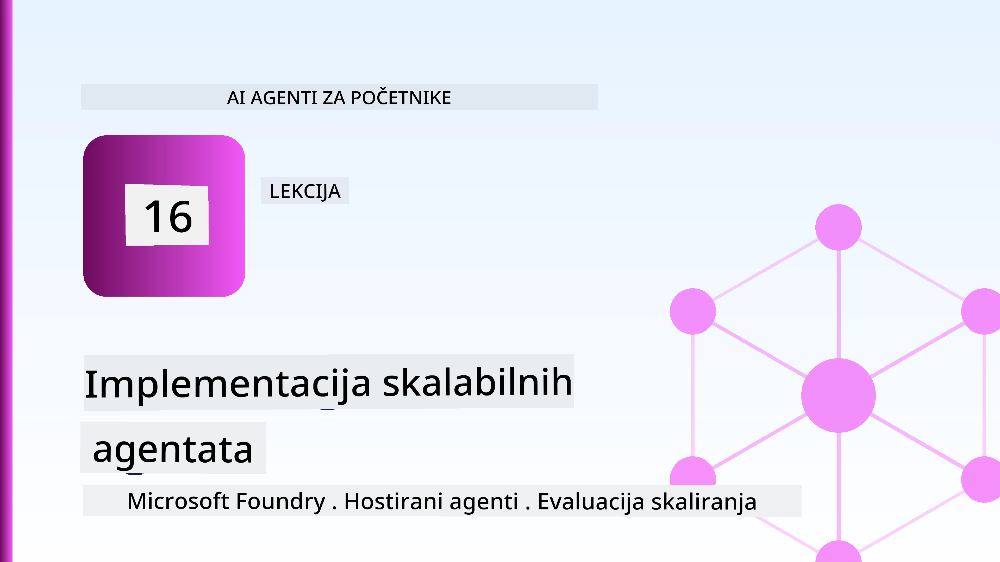
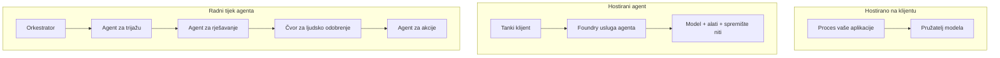
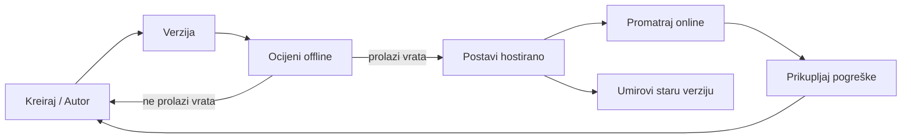
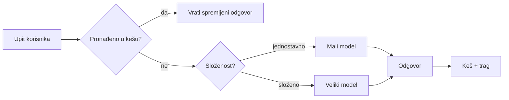
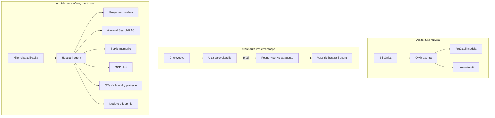

# Implementacija skalabilnih agenata s Microsoft Foundryjem



Do ovog trenutka u tečaju napravili ste agente koji rade na vašem laptopu, unutar bilježnice, pokretani `az login` i nekoliko varijabli okoline. To je upravo pravi način za učenje. Nije pravi način za pokretanje agenta o kojem tisuće korisnika ovise u 3 ujutro.

Ova lekcija je o jazu između "radi na mom računalu" i "radi pouzdano i pristupačno u produkciji." Taj jaz zatvaramo korištenjem **Microsoft Foundryja** i **Microsoft Foundry Agent Service**, i to tako da gradimo pravog korisničkog agenta za podršku koji ima alate, dohvat, memoriju, evaluaciju i nadzor.

## Uvod

Ova lekcija će obuhvatiti:

- Razliku između **prototipnog agenta** i **implementiranog agenta**, i zašto je prijelaz uglavnom o svemu *oko* modela.
- **Obrasce implementacije** za agente: klijent-hostirani, servis-hostirani (Hosted Agents) i orkestrirani radni tokovi.
- **Životni ciklus agenta** na Microsoft Foundry — kreiranje, verzioniranje, implementacija, evaluacija, nadzor, povlačenje.
- **Strategije skaliranja**: usmjeravanje modela, keširanje, konkurentnost i dizajn bez stanja.
- **Promatranje** s OpenTelemetry i Foundry praćenjem.
- **Optimizacija troškova** kroz odabir modela, usmjeravanje i evaluacijske kapije.
- **Razmatranja za poduzeća**: upravljanje, odobrenje od strane čovjeka i sigurno pokretanje MCP servera u produkciji.

## Ciljevi učenja

Nakon završetka ove lekcije, znat ćete kako:

- Izabrati pravi obrazac implementacije za određeni radni opterećenje agenta.
- Implementirati agenta u Microsoft Foundry Agent Service kako bi bio verzioniran, upravljan i vidljiv.
- Instrumentirati agenta za praćenje te povezati evaluacijsku liniju koja se pokreće prije svakog izdanja.
- Primijeniti usmjeravanje i keširanje modela kako biste održali kašnjenje i troškove pod kontrolom u velikom opsegu.
- Dodati kapiju ljudskog odobrenja za rizične radnje i integrirati MCP server na siguran način za produkciju.

## Preduvjeti

Ova lekcija pretpostavlja da ste završili prethodne lekcije i da ste sigurni u:

- Izradu agenata pomoću [Microsoft Agent Framework](../14-microsoft-agent-framework/README.md) (Lekcija 14).
- [Korištenje alata](../04-tool-use/README.md) (Lekcija 4) i [Agentic RAG](../05-agentic-rag/README.md) (Lekcija 5).
- [Agent Memory](../13-agent-memory/README.md) (Lekcija 13) i [Agentic Protocols / MCP](../11-agentic-protocols/README.md) (Lekcija 11).
- [Observability i Evaluaciju](../10-ai-agents-production/README.md) (Lekcija 10) — ova lekcija se direktno nadovezuje.

Također će vam trebati:

- **Azure pretplata** i **Microsoft Foundry projekt** s barem jednim implementiranim chat modelom.
- **Azure CLI** prijavljen (`az login`).
- Python 3.12+ i paketi iz spremišta [`requirements.txt`](../../../requirements.txt).

## Od prototipa do produkcije: što se zapravo mijenja

Prototipni agent i produkcijski agent dijele isti osnovni ciklus — razmišljanje, pozivanje alata, odgovor. Ono što se mijenja je sve oko tog ciklusa. Model je možda 20% produkcijskog agenta; preostalih 80% je operativni kostur.

| Pitanje | Prototip | Produkcija |
| --- | --- | --- |
| **Hosting** | Radi u vašoj bilježnici | Radi kao hostirani servis, verzioniran i uvodi se postepeno |
| **Identitet** | Vaš `az login` token | Upravljani identitet sa ograničenim RBAC pristupom |
| **Stanje** | U memoriji, gubi se pri ponovnom pokretanju | Eksternalizirano (thread store, memory service) |
| **Pogreške** | Vidite traceback | Pokušaji ponovo, rezervne opcije, dead-letter, upozorenja |
| **Trošak** | "To su par centi" | Praćeno po zahtjevu, usmjereno, keširano, budžetirano |
| **Kvaliteta** | Provjeravate vizualno | Automatski evaluirano prije svakog izdanja |
| **Povjerenje** | Odobravate svaku radnju | Politika + čovjek u petlji za rizične radnje |

Imajte ovu tablicu na umu. Svaki odjeljak dolje odgovara jednom od ovih redaka.

## Obrasci implementacije agenata

Postoje tri obrasca koja ćete koristiti, često u kombinaciji.

### 1. Klijent-hostirani agenti

Objekt agenta živi unutar *vašeg* procesa aplikacije. Vaš kod direktno poziva davatelja modela; krug razmišljanja radi u vašem servisu. Ovo je ono što su radile sve prethodne lekcije.

- **Koristite kada** trebate punu kontrolu nad ciklusom, prilagođene srednje programe ili ugrađujete agenta unutar postojećeg backend-a.
- **Nedostatak**: sami upravljate skaliranjem, stanjem i otpornosti.

### 2. Hostirani agenti (Foundry Agent Service)

Agent je *registriran kao resurs* unutar Microsoft Foundryja. Foundry hosta krug razmišljanja, pohranjuje threadove, provodi sigurnost sadržaja i RBAC, i čini agenta vidljivim u Foundry portalu. Vaša aplikacija postaje tanka klijentica koja stvara threadove i čita odgovore.

- **Koristite kada** želite trajnost, ugrađenu vidljivost, upravljanje i manju operativnu složenost.
- **Nedostatak**: manje niskorazinske kontrole u zamjenu za upravljano vrijeme izvođenja.

### 3. Radni tokovi agenata

Više agenata (i alata) komponirano je u graf s eksplicitnim upravljanjem tijekom — sekvencijalni koraci, grananje, čvorovi ljudskog odobrenja i trajne kontrolne točke koje mogu pauzirati i nastaviti. Ovo je Microsoft Agent Framework **Workflows** mogućnost primijenjena na razini implementacije.

- **Koristite kada** zadatak obuhvaća nekoliko specijaliziranih agenata ili zahtijeva korak odobrenja usred procesa.
- **Nedostatak**: više pokretnih dijelova; treba vidljivost na razini orkestracije.



## Životni ciklus agenta na Microsoft Foundryju

Implementacija agenta nije jednokratni `push`. To je ciklus, i vrlo sliči ciklusu izdanja softvera jer upravo to i jest.



Ključna ideja, prenesena iz [Lekcije 10](../10-ai-agents-production/README.md): **offline evaluacija je kapija, ne naknadna misao.** Nova verzija agenta ne izlazi dok ne prođe vaše evaluacijske pragove. Online vidljivost potom vraća stvarne pogreške u vašu offline testnu skupinu. To je cijeli ciklus.

## Strategije skaliranja

Skaliranje agenta razlikuje se od skaliranja stateless web API-ja, jer svaki zahtjev može pokrenuti više skupih poziva modelima i alatima. Četiri tehnike nose većinu opterećenja.

**Rukovanje zahtjevima bez stanja.** Nemojte držati stanje po korisniku u memoriji procesa. Pohranjujte threadove razgovora u Foundry thread store ili memorijski servis tako da svaka instanca može obraditi bilo koji zahtjev. To vam omogućuje horizontalno skaliranje — dodajte instance, bez prianjajućih sesija.

**Usmjeravanje modela.** Nije svaki zahtjev potreban najmoćniji (i najskuplji) model. Usmjerite jednostavne zahtjeve — klasifikaciju namjere, kratke faktografske odgovore — na mali, brzi model, a veliki model za stvarno rezoniranje rezervirajte. Foundryjev **Model Router** to može učiniti za vas, ili možete sami implementirati lagani klasifikator. Verziju radit ćete u laboratoriju.

**Keširanje odgovora.** Mnogi upiti za podršku su gotovo duplikati ("kako resetirati lozinku?"). Keširajte odgovore na često postavljana pitanja i poslužite ih bez poziva modelu. Čak i umjerena stopa zadovoljenja keša značajno smanjuje troškove i kašnjenje.

**Konkurentnost i povratni pritisak (backpressure).** Davatelji modela imaju ograničenja brzine. Ograničite konkurentnost, koristite ponovna pokušavanja s eksponencijalnim odgodama, i neuspjehe rješavajte graciozno (red čekanja s odgovorom "radimo na tome" bolji je od 500 greške).



## Vidljivost u produkciji

Ne možete upravljati onim što ne vidite. Kao što je pokriveno u Lekciji 10, Microsoft Agent Framework emitira **OpenTelemetry** praćenja nativno — svaki poziv modelu, invokacija alata i korak orkestracije postaje djelokrug. U produkciji te djelokrugove izvozite u Microsoft Foundry (ili bilo koji OTel-kompatibilan sustav) da biste mogli:

- Pratiti pojedinačnu korisničku žalbu od početka do kraja kroz svaki poziv modelu i alatu.
- Pratiti p50/p95 latenciju i troškove po zahtjevu tijekom vremena.
- Upozoravati na skokove u stopi pogrešaka i anomalije troškova prije nego što ih primijete vaši korisnici (ili financijski tim).

```python
from agent_framework.observability import get_tracer

tracer = get_tracer()

with tracer.start_as_current_span("support_request") as span:
    span.set_attribute("customer.tier", "enterprise")
    span.set_attribute("routed.model", "gpt-4.1-mini")
    # izvršenje agenta automatski se prati unutar ovog raspona
```

Atributi kao `customer.tier` i `routed.model` pretvaraju zid praćenja u pitanja na koja se može odgovoriti ("Jesu li enterprise korisnici prečesto usmjereni na mali model?").

## Optimizacija troškova

Troškovi u produkcijskim agentima uglavnom dolaze od tokena. Tri poluge, po utjecaju:

1. **Pravilna veličina modela.** Mali model koji prolazi vašu evaluacijsku kapiju gotovo je uvijek jeftiniji od velikog koji također prolazi. Koristite evaluaciju da *dokažete* da je mali model dovoljan umjesto da iz opreza koristite najveći.
2. **Usmjeravanje po složenosti.** Kao gore — platite za veliki model samo za zahtjeve koji trebaju rezoniranje velikog modela.
3. **Agresivno keširanje.** Najjeftiniji poziv modelu je onaj koji uopće ne napravite.

Evaluacijske kapije i kontrola troškova su ista disciplina promatrana iz dva kuta: evaluacija vam daje *donju granicu kvalitete*, a usmjeravanje i keširanje drže troškove što je moguće bliže toj donjoj granici.

## Razmatranja implementacije u poduzeću

**Upravljanje.** Hosted Agents nasljeđuju Foundryjev RBAC, sigurnost sadržaja i zapisivanje revizije. Dajte svakom agentu upravljani identitet s najmanjom potrebnom privilegijom — pristup samo za čitanje baze znanja, ograničen pristup API-ju za ticketiranje, i ništa više.

**Čovjek u petlji.** Neke radnje su prevažna da bi se automatizirale — izdavanje povrata novca, brisanje računa, eskalacija pravnom timu. Microsoft Agent Framework podržava alate koji zahtijevaju **odobrenje**: agent predlaže akciju, izvršavanje se pauzira, čovjek odobrava ili odbija, a radni tok se nastavlja. Primitivno ste vidjeli u [Lekciji 6](../06-building-trustworthy-agents/README.md); ovdje ga implementirate.

**MCP u produkciji.** [MCP](../11-agentic-protocols/README.md) omogućava agentu korištenje eksternih alata preko standardnog sučelja. U produkciji tretirajte svaki MCP server kao nepouzdanu granicu: fiksirajte verziju servera, pokrećite ga s ograničenim identitetom, validirajte njegove izlaze i nikada mu ne izlažite tajne podatke. MCP server je ovisnost, a ovisnosti se popravljaju, revidiraju i ograničavaju pristup.



Ta tri dijagrama — razvoj, implementacija, vrijeme izvođenja — prikazuju istog agenta u tri faze njegova života. Laboratorijski zadatak koji slijedi vodi vas kroz izradu.

## Praktični laboratorijski zadatak: Agent korisničke podrške spreman za produkciju

Otvorite [`code_samples/16-python-agent-framework.ipynb`](./code_samples/16-python-agent-framework.ipynb) i prođite ga od početka do kraja. Sastavit ćete **Contoso agenta korisničke podrške** sa svim produkcijskim funkcijama:

1. **Pozivanje alata** — dohvat statusa narudžbe i otvaranje zahtjeva za podršku.
2. **RAG** — odgovaranje na pitanja o politici iz baze znanja (Azure AI Search, s memorijskom rezervom da bilježnica radi i bez Search resursa).
3. **Memorija** — pamćenje korisnika kroz okrete razgovora.
4. **Usmjeravanje modela** — klasifikator složenosti usmjerava svaki zahtjev na mali ili veliki model.
5. **Keširanje odgovora** — ponovljena pitanja poslužuju se iz keša.
6. **Ljudsko odobrenje** — povrati iznad praga čekaju ljudsko odobrenje.
7. **Evaluacijska linija** — mali offline testni skup ocjenjuje agenta i služi kao kapija za izdanje.
8. **Vidljivost** — OpenTelemetry praćenje za svaki zahtjev.

### Korak po korak

Bilježnica je organizirana tako da je svaki produkcijski aspekt zaseban, pokretni odjeljak. Srž je rukovatelj zahtjevima koji kombinira usmjeravanje i keširanje:

```python
async def handle_support_request(query: str, customer_id: str) -> str:
    # 1. Poslužiti iz predmemorije kad god možemo.
    cached = response_cache.get(normalize(query))
    if cached:
        return cached

    # 2. Usmjeriti prema složenosti za kontrolu troškova.
    model = "gpt-4.1-mini" if is_simple(query) else "gpt-4.1"

    # 3. Pokrenuti agenta unutar traga za promatranje.
    with tracer.start_as_current_span("support_request") as span:
        span.set_attribute("routed.model", model)
        span.set_attribute("customer.id", customer_id)
        response = await support_agent.run(query, model=model)

    # 4. Predmemorirati i vratiti.
    response_cache.set(normalize(query), response.text)
    return response.text
```

Evaluacijska kapija koja čuva izdanje izgleda ovako:

```python
async def evaluation_gate(agent, test_cases, threshold: float = 0.8) -> bool:
    passed = 0
    for case in test_cases:
        result = await agent.run(case["input"])
        if score_response(result.text, case["expected"]) >= 0.8:
            passed += 1
    pass_rate = passed / len(test_cases)
    print(f"Evaluation pass rate: {pass_rate:.0%} (gate: {threshold:.0%})")
    return pass_rate >= threshold  # implementiraj samo ako prolaz na vratima uspije
```

Pročitajte svaku liniju — bilježnica drži primitivce namjerno male kako ništa ne bi bilo skriveno iza poziva frameworka.

## Validacija implementiranog agenta s Smoke testovima

Evaluacijska kapija gore radi *offline* na vašem objektu agenta. Kad je agent implementiran kao Hosted Agent, treba vam još jedna, još jeftinija provjera: **odgovara li implementirana krajnja točka?**

Implementacija "uspješno" samo dokazuje da je kontrolni sloj prihvatio definiciju — ne dokazuje da agent odgovara. Nedostajuća ovisnost, loše usmjeravanje modela ili istekla veza mogu ostaviti zelenu implementaciju koja ne vraća ništa. **Smoke test** to uhvati u nekoliko sekundi, pri svakoj implementaciji, bez troška pune evaluacije.

Ovo spremište donosi spremnu pipeline za smoke-testove izgrađenu na [AI Smoke Test](https://github.com/marketplace/actions/ai-smoke-test) GitHub akciji:

- **Katalog** — [`tests/lesson-16-smoke-tests.json`](../../../tests/lesson-16-smoke-tests.json) sadrži upite i asercije za Contoso agenta podrške (odgovori temeljeni na politici, dohvat narudžbe, ostajanje na temi i kontinuitet višekratnih okreta). Katalozi za agente iz drugih lekcija nalaze se uz njega — pogledajte [`tests/README.md`](../tests/README.md).
- **Radni tok** — [`.github/workflows/smoke-test.yml`](../../../.github/workflows/smoke-test.yml) prijavljuje se pomoću Azure OIDC i šalje POST sa svakim upitom na Responses endpoint agenta, neuspjeh na bilo kojoj aserciji prekida posao.

```yaml
- name: Smoke-test hosted agent
  uses: JFolberth/ai-smoketest@v1
  with:
    project_endpoint: ${{ inputs.project_endpoint }}
    agent_name: ContosoSupportAgent
    tests_file: tests/lesson-16-smoke-tests.json
```


Pokrenite ga s kartice **Actions** kad je vaš agent implementiran, pružajući krajnju točku vašeg Foundry projekta i naziv agenta. Federirana identifikacija treba imati ulogu **Azure AI User** u okviru Foundry projekta. Zamislite slojeve kao piramidu: osnovni testovi (dostupan i odgovara li?) se izvode pri svakoj implementaciji, offline evaluacija (dovoljno dobra za slanje u produkciju?) prije promocije, a online evaluacija (kako se ponaša u stvarnom okruženju?) se izvodi kontinuirano.

## Provjera znanja

Testirajte svoje razumijevanje prije nego što prijeđete na zadatak.

**1. Otprilike koliki je udio proizvodnog agenta "model," a što je ostatak?**

<details>
<summary>Odgovor</summary>

Model je manjina sustava — često se navodi oko 20%. Ostatak je operativni kostur: hosting i verzioniranje, identitet i RBAC, eksternalizirano stanje, upravljanje greškama, praćenje troškova, evaluacija i kontrole s human-in-the-loop pristupom. Premještanje u produkciju uglavnom je izgradnja svega *oko* petlje rezoniranja.
</details>

**2. Kada biste odabrali Hosted Agenta umjesto klijentski hostiranog agenta?**

<details>
<summary>Odgovor</summary>

Kada želite upravljano izvršno okruženje s ugrađenom trajnošću (procesi koji traju i mogu nastaviti), promatranjem, sigurnošću sadržaja i RBAC-om, te ste spremni žrtvovati malo niskorazinske kontrole petlje rezoniranja za manju operativnu složenost. Klijentski hostirani agent je poželjniji kada vam je potrebna potpuna kontrola nad petljom ili kada ugrađujete agenta u postojeći backend.
</details>

**3. Zašto skalabilni agent mora biti bezstanja (stateless) u vlastitoj memoriji procesa?**

<details>
<summary>Odgovor</summary>

Kako bi bilo koja instanca mogla obraditi bilo koji zahtjev, što omogućava horizontalno skaliranje bez "lijepih sesija". Stanje razgovora po korisniku je eksternalizirano u pohranu niti ili memorijsku uslugu. Ako bi stanje živjelo u memoriji procesa, izgubili biste ga pri ponovnom pokretanju i ne biste mogli slobodno raspoređivati opterećenje.
</details>

**4. Koji problem rješava usmjeravanje modela (model routing) i kako se odnosi na evaluaciju?**

<details>
<summary>Odgovor</summary>

Usmjeravanje šalje jednostavne zahtjeve na mali, jeftini i brzi model, a velikom modelu ostavlja pravo rezoniranje, kontrolirajući tako i latenciju i troškove. Odnosi se na evaluaciju jer evaluacija *dokazuje* da je mali model dovoljno dobar za određenu vrstu zahtjeva — usmjeravanje bez evaluacije je pogađanje.
</details>

**5. Što je "evaluation gate" i gdje se nalazi u životnom ciklusu?**

<details>
<summary>Odgovor</summary>

Evaluation gate izvodi skup offline testova na novoj verziji agenta i blokira implementaciju ako stopa prolaznosti ne premaši prag. Nalazi se između "verzije" i "implementacije" u životnom ciklusu, čineći kvalitetu preduvjetom za izdavanje umjesto nečim što se provjerava nakon puštanja u produkciju.
</details>

**6. Zašto se MCP poslužitelj mora tretirati kao nepouzdana granica u produkciji?**

<details>
<summary>Odgovor</summary>

Zato što je vanjska ovisnost u koju vaš agent upućuje pozive. Trebali biste fiksirati njegovu verziju, pokretati ga s ograničenim identitetom, provjeravati njegove izlaze, ograničiti brzinu poziva i nikada mu ne izlagati tajne — ista disciplina primjenjuje se na sve ovisnosti trećih strana. Njegovi izlazi ulaze u rezoniranje vašeg agenta, pa neprovjerena povjerenja predstavljaju sigurnosni rizik.
</details>

**7. Koja pojedinačna promjena obično ima najveći utjecaj na trošak proizvodnog agenta i zašto?**

<details>
<summary>Odgovor</summary>

Prilagođavanje veličine modela — korištenje najmanjeg modela koji i dalje prolazi vaš evaluation gate. Trošak dominiraju tokeni, a manji model koji dostiže zadani standard kvalitete gotovo je uvijek jeftiniji od većeg. Keširanje i usmjeravanje dodatno smanjuju troškove, ali odabir pravog osnovnog modela ima najveći primarni učinak.
</details>

**8. Koju ulogu u promatranju (observability) imaju atributi spanova poput `customer.tier` i `routed.model`?**

<details>
<summary>Odgovor</summary>

Oni pretvaraju sirove tragove u mjerljive poslovne upite. Bez atributa imate zid spanova; s njima možete pitati "usmjeravaju li se enterprise korisnici prečesto na mali model?" ili "koji model obrađuje naše najsporije zahtjeve?" Atributi su način na koji režete telemetriju prema dimenzijama koje su važne za vaš rad.
</details>

## Zadatak

Uzmite agenta za korisničku podršku iz laboratorija i učvrstite ga za određeni scenarij: **agent za podršku naplati pretplate za SaaS tvrtku.**

Vaša predaja treba:

1. **Zamijeniti alate** onima relevantnima za naplatu: `get_subscription_status`, `get_invoice` i `issue_credit` (krediti iznad 50$ zahtijevaju potvrdu čovjeka).
2. **Dodati tri RAG dokumenta** koja pokrivaju politiku povrata novca, ciklus naplate i politiku otkazivanja kompanije.
3. **Proširiti evaluacijski skup** na najmanje osam slučajeva, uključujući barem dva koja *mora* pokrenuti put s odobrenjem čovjeka, i potvrditi da vaš evaluation gate ispravno prolazi ili odbija.
4. **Dodati jedan izvještaj o troškovima**: nakon izvršavanja deset miješanih upita kroz agenta, ispišite koliko je njih otišlo na mali model, koliko na veliki model i koliko je posluženo iz keša.

Napišite kratki odlomak (u markdown ćeliji) u kojem objašnjavate pravilo usmjeravanja modela koje ste odabrali i kako biste ga validirali na stvarnom prometu. Ne postoji jedan točan odgovor — ocjenjujete se prema tome jesu li produkcijski aspekti koherentno povezani.

## Sažetak

U ovoj ste lekciji premjestili agenta iz prototipa u produkciju pomoću Microsoft Foundry:

- Skok u produkciju uglavnom je o **operativnom kosturu** oko modela — hosting, identitet, stanje, upravljanje greškama, troškovi, kvaliteta i povjerenje.
- Naučili ste tri **uzorka distribucije** — klijentski hostirani, Hosted Agenti i Agent Workflows — i kada se koji koristi.
- Prošli ste **životni ciklus agenta**, gdje offline **evaluacija djeluje kao gateway za izdavanje** a online promatranje vraća greške u testni skup.
- Primijenili ste **strategije skaliranja** — dizajn bez stanja, usmjeravanje modela, keširanje i ograničenu konkurentnost — i povezali ih s **optimizacijom troškova**.
- Povezali ste **kontrole za poduzeća**: RBAC, odobrenje human-in-the-loop i produkcijski siguran MCP.
- Izgradili ste **proizvodno spremnog agenta za korisničku podršku** koji objedinjuje sve te aspekte u izvršivom kodu.

Sljedeća lekcija ide suprotnim putem: umjesto skaliranja agenata u oblak, spustit ćete ih *dolje* na jedan razvojni stroj i pokretati ih u potpunosti lokalno.

## Dodatni izvori

- <a href="https://learn.microsoft.com/azure/ai-foundry/what-is-azure-ai-foundry" target="_blank">Dokumentacija za Microsoft Foundry</a>
- <a href="https://learn.microsoft.com/azure/ai-foundry/agents/overview" target="_blank">Pregled Microsoft Foundry Agent Service</a>
- <a href="https://aka.ms/ai-agents-beginners/agent-framework" target="_blank">Microsoft Agent Framework</a>
- <a href="https://learn.microsoft.com/azure/ai-foundry/concepts/model-router" target="_blank">Model Router u Microsoft Foundry</a>
- <a href="https://learn.microsoft.com/azure/search/search-what-is-azure-search" target="_blank">Azure AI Search</a>
- <a href="https://opentelemetry.io/" target="_blank">OpenTelemetry</a>
- <a href="https://github.com/marketplace/actions/ai-smoke-test" target="_blank">AI Smoke Test GitHub Action</a>
- <a href="https://modelcontextprotocol.io/" target="_blank">Model Context Protocol (MCP)</a>

## Prethodna lekcija

[Izrada agenata za upotrebu računala (CUA)](../15-browser-use/README.md)

## Sljedeća lekcija

[Izrada lokalnih AI agenata](../17-creating-local-ai-agents/README.md)

---

<!-- CO-OP TRANSLATOR DISCLAIMER START -->
**Napomena**:
Ovaj dokument je preveden korištenjem AI prevoditeljskog servisa [Co-op Translator](https://github.com/Azure/co-op-translator). Iako težimo točnosti, imajte na umu da automatski prijevodi mogu sadržavati greške ili netočnosti. Izvorni dokument na izvornom jeziku treba smatrati autoritativnim izvorom. Za važne informacije preporuča se profesionalni ljudski prijevod. Nismo odgovorni za bilo kakva nesporazumevanja ili pogrešne interpretacije koje proizlaze iz korištenja ovog prijevoda.
<!-- CO-OP TRANSLATOR DISCLAIMER END -->