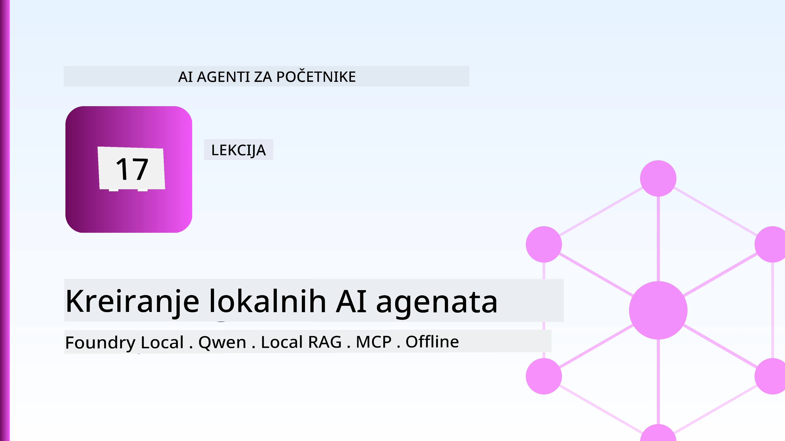
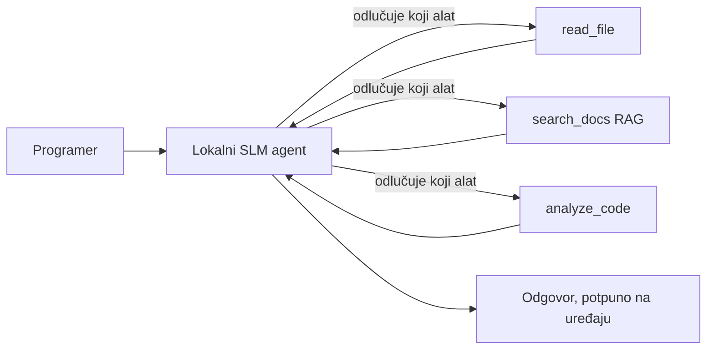
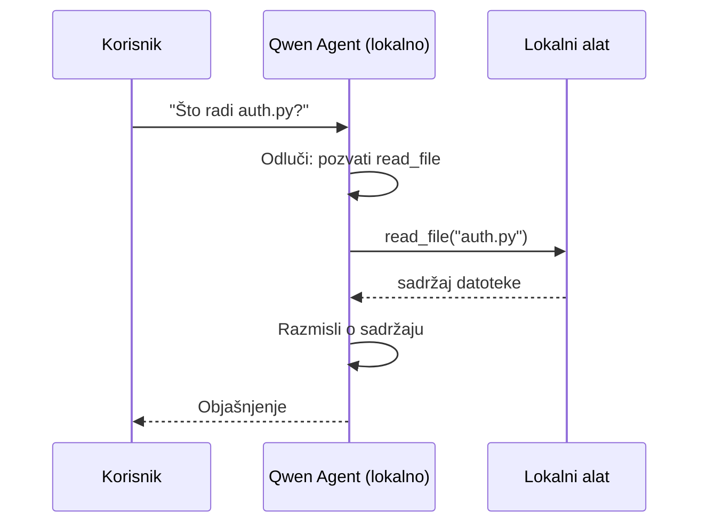
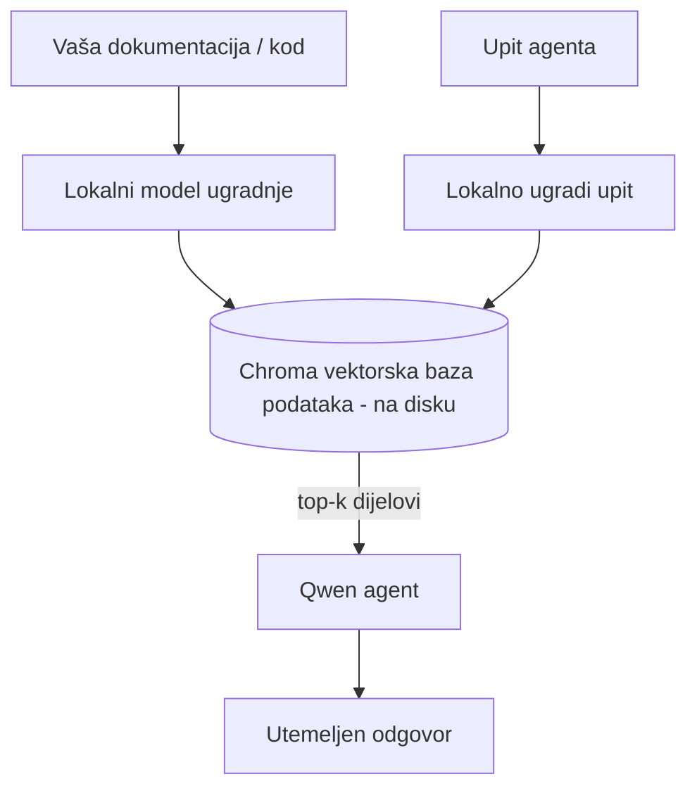
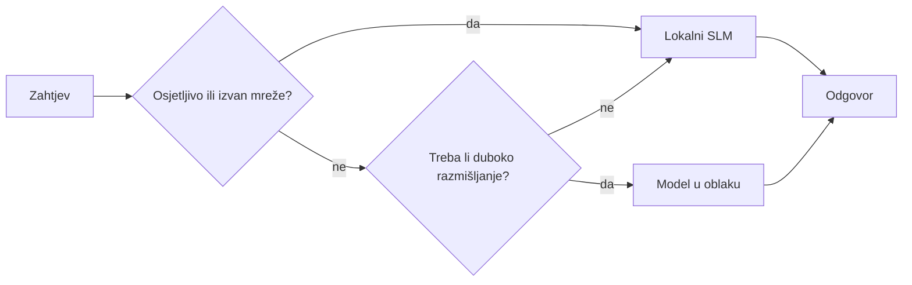

# Kreiranje lokalnih AI agenata korištenjem Microsoft Foundry Local i Qwen



Prethodna lekcija je proširila agente *u* oblak. Ova ih spušta *na* jedan stroj. Do kraja ćete imati radnog inženjerskog asistenta koji razmišlja, poziva alate, čita vaše datoteke i pretražuje vašu dokumentaciju — **bez ijednog poziva na inference u oblaku.**

Zašto biste to željeli? Tri razloga koja se stalno pojavljuju u pravom inženjerskom radu:

- **Privatnost.** Kod i dokumenti nikada ne napuštaju stroj. Nijedan upit, nijedan isječak, nijedni podaci o klijentu ne prelaze mrežnu granicu.
- **Trošak.** Lokalna inference nema naplatu po tokenu. Možete iterirati cijeli dan za cijenu električne energije.
- **Offline.** U avionu, u sigurnom objektu ili tijekom prekida, agent i dalje radi.

Kvaka je u tome što mijenjate vrhunski oblačni model za **Mali jezični model (SLM)** koji radi na vašem CPU-u, GPU-u ili NPU-u. Ova lekcija govori o izgradnji agenata koji su *dobri* unutar tog ograničenja, a ne o pretvaranju da to ograničenje ne postoji.

## Uvod

Ova lekcija će obuhvatiti:

- **Mali jezični modeli (SLMs)** — što su, gdje briljiraju, a gdje ne.
- **Microsoft Foundry Local** — runtime koji preuzima i servisira modele lokalno putem **OpenAI-kompatibilnog API-ja**.
- **Qwen modeli za pozivanje funkcija** — SLM-ovi koji pouzdano generiraju pozive alata, što omogućuje lokalne *agente* (ne samo lokalni chat).
- **Lokalni alati, lokalni RAG i lokalni MCP** — koji daju mogućnosti agentu bez oblaka.
- **Hibridni obrasci** — kada zadržati stvari lokalnima, a kada se osloniti na oblak.

## Ciljevi učenja

Nakon dovršetka ove lekcije, znat ćete kako:

- Objasniti kompromise SLM-ova i izabrati prikladne slučajeve korištenja lokalnih agenata.
- Poslužiti Qwen model lokalno koristeći Foundry Local i povezati se na njega putem OpenAI-kompatibilne točke.
- Izgraditi agenta koji poziva alate i radi u cijelosti na vašem radnom stroju.
- Dodati lokalni RAG preko vlastitih dokumenata koristeći lokalnu vektorsku bazu podataka (Chroma).
- Povezati agenta s lokalnim MCP serverom i razmatrati hibridne lokalne/oblačne dizajne.

## Preduvjeti

Ova lekcija pretpostavlja da ste završili ranije lekcije i da ste upoznati s:

- [Korištenje alata](../04-tool-use/README.md) (Lekcija 4) i [Agentic RAG](../05-agentic-rag/README.md) (Lekcija 5).
- [Agentični protokoli / MCP](../11-agentic-protocols/README.md) (Lekcija 11).
- [Microsoft Agent Framework](../14-microsoft-agent-framework/README.md) (Lekcija 14).

Također će vam trebati:

- Radna stanica za programera. **8 GB RAM-a je realan minimum**; 16 GB+ je ugodno. GPU ili NPU pomažu, ali nisu potrebni.
- **Microsoft Foundry Local** instaliran (vidi dolje sekciju za postavljanje).
- Python 3.12+ i paketi iz repozitorija [`requirements.txt`](../../../requirements.txt), plus `foundry-local-sdk`, `openai` i `chromadb` za ovu lekciju.

## Mali jezični modeli: Pravi alat za lokalni rad

Vrhunski oblačni model ima stotine milijardi parametara i podatkovni centar iza sebe. SLM ima nekoliko milijardi parametara i mora stati u RAM vašeg laptopa. Ta razlika postavlja jasna očekivanja.

**SLM-ovi su dobri u:**

- Strukturiranim, ograničenim zadacima — klasifikacija, ekstrakcija, sažimanje poznatog dokumenta.
- **Pozivanje alata** — odlučivanje koju funkciju pozvati i s kojim argumentima.
- Brzom, jeftinom, privatnom iteracijom nad vlastitim podacima.

**SLM-ovi su slabiji u:**

- Otvorenom, višeskokovskom rezoniranju kroz veliki kontekst.
- Općem znanju o svijetu (vidjeli su manje i više zaboravljaju).

Pobjednička strategija za lokalne agente je dakle: **neka SLM orkestrira, a alati neka obave težak posao.** Model ne treba *znati* vašu bazu koda — treba znati kada pozvati `read_file` i `search_docs`. To direktno odgovara snagama SLM-a.



## Microsoft Foundry Local

**Microsoft Foundry Local** je lagani runtime koji preuzima, upravlja i servisira modele u potpunosti na vašem stroju. Njegova najvažnija značajka za nas je da izlaže **OpenAI-kompatibilnu HTTP točku** — što znači da OpenAI SDK i Microsoft Agent Frameworkov OpenAI klijent rade s njim samo promjenom `base_url`. Sve što ste naučili o izgradnji agenata prenosi se direktno; samo se točka pomiče iz oblaka na `localhost`.

Foundry Local također automatski bira najbolju verziju modela za vaš hardver — CPU build, CUDA/GPU build ili NPU build — pa ne morate ručno optimizirati za svaku mašinu.

### Postavljanje

Instalirajte Foundry Local (vidi [dokumentaciju](https://learn.microsoft.com/azure/ai-foundry/foundry-local/) za vaš OS), zatim provjerite da radi:

```bash
# Instalirajte (primjer; slijedite dokumentaciju za vašu platformu)
winget install Microsoft.FoundryLocal      # Windows
# brew install microsoft/foundrylocal/foundrylocal   # macOS

# Preuzmite i pokrenite Qwen model, zatim pokrenite lokalnu uslugu
foundry model run qwen2.5-7b-instruct
foundry service status
```

Nakon što je servis pokrenut, imate lokalnu, OpenAI-kompatibilnu točku (obično `http://localhost:PORT/v1`). Bilježnica koristi `foundry-local-sdk` da automatski pronađe točku, tako da ne morate ručno zadavati port.

## Qwen pozivanje funkcija: zašto je važno

Agent je agent samo ako može pozivati alate. Mnogi SLM-ovi mogu chatati, ali proizvode nepouzdane, nepravilne pozive alata. **Qwen** modeli su trenirani za pozivanje funkcija i dosljedno generiraju dobro oblikovane strukture poziva alata — što je upravo ono što lokalni chat model pretvara u lokalnog *agenta*.

Proces je standardni alat-pozivni krug koji već poznajete, samo sada radi lokalno:



## Lokalni RAG

Pretraživanje dokumentacije je ono gdje lokalni agenti zaista donose vrijednost. Umjesto da se nadate da je SLM zapamtio dokumentaciju vašeg okvira, ugrađujete te dokumente u **lokalnu vektorsku bazu podataka** i dopuštate agentu da na zahtjev dohvaća relevantne dijelove.

Koristimo **Chromu**, ugrađenu vektorsku pohranu koja radi unutar procesa bez potrebe za serverom. Cijeli lanac je lokalni: lokalni model za ugradnju → lokalni vektori → lokalno dohvaćanje → lokalni SLM.



Ovo je isti obrazac Agentic RAG iz Lekcije 5 — jedina promjena je da svaki dio sada radi na vašem stroju.

## Lokalni MCP serveri

[MCP](../11-agentic-protocols/README.md) je transportni protokol, a ne oblačna usluga. MCP server može raditi kao lokalni proces na `stdio`, izlažući alate vašem agentu preko standardnog protokola. To vam omogućuje ponovno korištenje rastućeg ekosustava MCP servera — pristup datotečnom sustavu, git operacije, upite baza podataka — potpuno offline.

Sigurnosna pozicija je drugačija nego u oblaku, ali nije nepostojeća: lokalni MCP server i dalje radi s dopuštenjima vašeg korisnika, stoga ograničite što može pristupati (npr. direktorij projekta, a ne cijelu početnu mapu) i tretirajte njegove izlaze kao ulaze koje treba provjeriti.

## Hibridni obrasci rada u oblaku i lokalno

Lokalno-prvo ne znači samo lokalno. Zreli sustavi usmjeravaju prema osjetljivosti i težini zadatka:

| Situacija | Gdje radi |
| --- | --- |
| Osjetljiv kod / podaci, ili offline | **Lokalni SLM** |
| Jednostavan, ograničen zadatak | **Lokalni SLM** (jeftino, brzo) |
| Teško višeskokovsko rezoniranje nad neosjetljivim podacima | **Oblačni model** |
| Sve, tijekom prekida rada | **Lokalni SLM** (nježno degradiranje) |

Ovo odražava ideju **usmjeravanja modela** iz Lekcije 16 — osim što je jedan od "modela" sada vaš vlastiti stroj. Robustan dizajn se oslanja na lokalno kada oblak nije dostupan, tako da agent gubi na kvaliteti, ali ne i potpuno propada.



## Praktična vježba: Lokalni inženjerski asistent

Otvorite [`code_samples/17-local-agent-foundry-local.ipynb`](./code_samples/17-local-agent-foundry-local.ipynb) i prolazite kroz njega. Izgradit ćete **lokalnog inženjerskog asistenta** koji radi potpuno na vašem radnom stroju i može:

1. **Pozivati alate** — preko Qwen poziva funkcija kroz Foundry Local.
2. **Izvoditi lokalne operacije s datotekama** — listati i čitati datoteke u direktoriju projekta.
3. **Analizirati kod** — izvještavati osnovne metrike o izvornoj datoteci.
4. **Pretraživati dokumentaciju** — lokalni RAG preko mape dokumenata koristeći Chromu.
5. **Koristiti MCP** — povezati se na lokalni MCP server (s ugodnim zaobilaženjem ako nije konfiguriran).

Niti jednom točkom ne koristite cloud inference.

### Vodič kroz

Asistent se povezuje na Foundry Local putem OpenAI-kompatibilne točke, tako da kod agenta izgleda gotovo identično kao u oblačnim lekcijama — samo se klijent mijenja:

```python
from foundry_local import FoundryLocalManager
from openai import OpenAI

# Foundry Local pronalazi/preuzima model i daje nam lokalnu krajnju točku.
manager = FoundryLocalManager(\"qwen2.5-7b-instruct\")
client = OpenAI(base_url=manager.endpoint, api_key=manager.api_key)  # api_key je lokalni rezervni znak
```

Alati su obične Python funkcije ograničene na direktorij projekta:

```python
def read_file(path: str) -> str:
    \"\"\"Read a file, but only inside the sandboxed project directory.\"\"\"
    full = (PROJECT_ROOT / path).resolve()
    if PROJECT_ROOT not in full.parents and full != PROJECT_ROOT:
        return \"Access denied: path is outside the project directory.\"
    return full.read_text(encoding=\"utf-8\")
```

Obratite pozornost na sandbox provjeru — čak i lokalno, alat koji čita proizvoljne putanje predstavlja rizik. Bilježnica drži svaki alat ograničenim na jedan korijen projekta.

## Provjera znanja

Testirajte svoje razumijevanje prije prelaska na zadatak.

**1. Dajte dva konkretna razloga za pokretanje agenta lokalno umjesto u oblaku.**

<details>
<summary>Odgovor</summary>

Bilo koja dva od: **privatnost** (kod i podaci nikada ne napuštaju stroj), **trošak** (nema računa po tokenu za inference) i **offline sposobnost** (radi bez mreže — u avionu, u sigurnom objektu ili tijekom prekida). Regulativna/pravna ograničenja koja zabranjuju slanje podataka sa uređaja su česti razlog privatnosti.
</details>

**2. Koja je preporučena podjela rada između SLM-a i njegovih alata u lokalnom agentu, i zašto?**

<details>
<summary>Odgovor</summary>

Neka SLM **orkestrira** (odlučuje koji alat pozvati i s kojim argumentima), a neka **alati obave težak posao** (čitanje datoteka, dohvaćanje dokumenata, računanje rezultata). SLM-ovi su jaki u ograničenim odlukama poput izbora alata, ali slabiji u širokom znanju i dugom višeskokovskom rezoniranju, stoga oslanjanje na alate koristi njihovim snagama.
</details>

**3. Što omogućuje ponovno korištenje koda oblačnog agenta s Foundry Local?**

<details>
<summary>Odgovor</summary>

Foundry Local izlaže **OpenAI-kompatibilnu HTTP točku**. OpenAI SDK i Agent Frameworkov OpenAI klijent rade s njom samo promjenom `base_url` (i korištenjem lokalnog privremenog API ključa). Sve ostalo u kodu agenta ostaje isto.
</details>

**4. Zašto koristimo specifično Qwen model za pozivanje funkcija, a ne bilo koji SLM?**

<details>
<summary>Odgovor</summary>

Zato što agent mora proizvesti pouzdane, dobro oblikovane **pozive alata**. Mnogi SLM-ovi mogu chatati, ali generiraju nepravilne ili nekonzistentne strukture poziva alata. Qwen modeli su trenirani za pozivanje funkcija i proizvode dosljedne pozive alata, što lokalni chat model pretvara u funkcionalnog lokalnog agenta.
</details>

**5. Koje komponente u lokalnom RAG lancu rade na stroju?**

<details>
<summary>Odgovor</summary>

Sve: model za ugradnju (embedding), vektorska baza podataka (Chroma, na disk), korak dohvaćanja i SLM. Dokumenti se ugrađuju lokalno, pohranjuju lokalno, dohvaćaju lokalno i nad njima rezonira lokalni model — nijedna komponenta ne pristupa oblaku.
</details>

**6. Lokalni MCP server radi na vašem stroju. Čini li to automatski sigurnim? Koju mjeru opreza biste i dalje trebali poduzeti?**

<details>
<summary>Odgovor</summary>

Ne. Lokalni MCP server radi s dopuštenjima vašeg korisnika, pa može pristupiti bilo čemu što i vi možete. Ograničite ga na ono što treba (npr. jedan direktorij projekta umjesto cijele vaše početne mape) i tretirajte njegove izlaze kao ulaze koje trebate provjeriti prije daljnjeg korištenja.
</details>

**7. Opišite smisleno pravilo hibridnog usmjeravanja koje uključuje lokalni model.**

<details>
<summary>Odgovor</summary>

Usmjeravajte osjetljive ili offline zahtjeve lokalnom SLM-u; jednostavne ograničene zadatke također lokalnom SLM-u radi brzine i troška; teško višeskokovsko rezoniranje nad neosjetljivim podacima prema oblačnom modelu; a ako oblak nije dostupan, vraćajte se lokalnom SLM-u da agent njegovo degradiranje kvalitete bude postupno umjesto da potpuno zakaže. To je usmjeravanje modela (Lekcija 16) s lokalnim strojem kao jednim od modela.
</details>

**8. Koji je realan minimum RAM-a za pokretanje lokalnog agenta u ovoj lekciji i što vam donosi više RAM-a?**

<details>
<summary>Odgovor</summary>

Oko **8 GB** je realan minimum; 16 GB+ je ugodno. Više RAM-a omogućuje vam pokretanje većih, sposobnijih modela i držanje većeg konteksta u memoriji. GPU ili NPU ubrzavaju inference ali nisu potrebni — Foundry Local bira CPU build ako nema dostupnog akceleratora.
</details>

## Zadatak

Proširite lokalnog inženjerskog asistenta u **lokalnog recenzenta dokumentacije** za mali projekt po vašem izboru (ako želite, koristite jednu od lekcijskih mapa ovog repozitorija).

Vaša predaja treba:

1. **Indeksirati stvarni folder sa dokumentima/kodom** u Chromu (barem pet datoteka).
2. **Dodati alat `find_todos`** koji pretražuje projekt za `TODO`/`FIXME` komentare i vraća ih s informacijama o datoteci i broju retka — uz održavanje iste sandbox provjere kao kod `read_file`.

3. **Postavite agentu tri pitanja** koja ga prisiljavaju da kombinira alate: jedno čisto RAG pitanje, jedno koje zahtijeva čitanje određenog datoteke i jedno koje zahtijeva pronalaženje TODO-ova.
4. **Izmjerite to**: izmjerite vrijeme svakog od tri odgovora i zabilježite ih u markdown ćeliji. Komentirajte je li latencija prihvatljiva za vaš zamišljeni tijek rada.

Zatim napišite kratak odlomak o **čemu biste premjestili u oblak, a što biste zadržali lokalno** za ovog recenzenta i zašto. Procjenjujete se prema tome jesu li lokalne komponente pravilno povezane i je li vaše hibridno zaključivanje ispravno — ne prema kvaliteti modela.

## Sažetak

U ovoj lekciji izgradili ste agenta koji radi potpuno na vašem vlastitom računalu:

- **SLM-ovi** zamjenjuju širinu privatnošću, cijenom i radom izvan mreže — i briljiraju kad **orchestriraju alate** umjesto da sami nose sve znanje.
- **Foundry Local** pokreće modele na uređaju iza **OpenAI-kompatibilne krajnje točke**, pa se kod vašeg cloud agenta prenosi jednom linijskom promjenom.
- **Qwen modeli s pozivom funkcija** omogućuju pouzdano lokalno pozivanje alata — a time i lokalnih *agenata*.
- **Lokalni RAG** (Chroma) i **lokalni MCP** daju agentu sposobnost bez napuštanja računala.
- **Hibridni obrasci** omogućuju usmjeravanje po osjetljivosti i težini, s lokalnim kao gracioznom rezervom.

Ovo zaokružuje put implementacije: Lekcija 16 je skalirala agente u Microsoft Foundry, a ova lekcija ih je skalirala na jedno radno mjesto. Sljedeća lekcija bavi se održavanjem sigurnosti implementiranih agenata.

## Dodatni resursi

- <a href="https://learn.microsoft.com/azure/ai-foundry/foundry-local/" target="_blank">Microsoft Foundry Local dokumentacija</a>
- <a href="https://learn.microsoft.com/azure/ai-foundry/what-is-azure-ai-foundry" target="_blank">Microsoft Foundry dokumentacija</a>
- <a href="https://aka.ms/ai-agents-beginners/agent-framework" target="_blank">Microsoft Agent Framework</a>
- <a href="https://qwen.readthedocs.io/en/latest/framework/function_call.html" target="_blank">Qwen dokumentacija za poziv funkcija</a>
- <a href="https://modelcontextprotocol.io/" target="_blank">Model Context Protocol (MCP)</a>
- <a href="https://docs.trychroma.com/" target="_blank">Chroma vektorska baza podataka</a>

## Prethodna lekcija

[Implementacija skalabilnih agenata](../16-deploying-scalable-agents/README.md)

## Sljedeća lekcija

[Sigurnost AI agenata](../18-securing-ai-agents/README.md)

---

<!-- CO-OP TRANSLATOR DISCLAIMER START -->
**Napomena**:
Ovaj dokument je preveden korištenjem AI prevoditeljskog servisa [Co-op Translator](https://github.com/Azure/co-op-translator). Iako težimo točnosti, imajte na umu da automatski prijevodi mogu sadržavati greške ili netočnosti. Izvorni dokument na izvornom jeziku treba smatrati autoritativnim izvorom. Za važne informacije preporuča se profesionalni ljudski prijevod. Nismo odgovorni za bilo kakva nesporazumevanja ili pogrešne interpretacije koje proizlaze iz korištenja ovog prijevoda.
<!-- CO-OP TRANSLATOR DISCLAIMER END -->