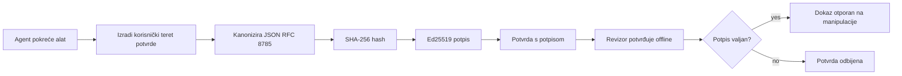
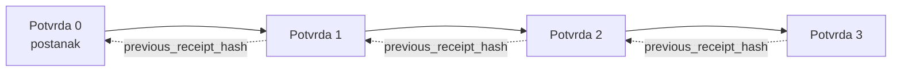

[Pogledajte video lekcije: Osiguravanje AI agenata kriptografskim potvrdom](https://youtu.be/PLACEHOLDER_VIDEO_ID)

> _(Video lekcije i sličica bit će dodani od strane Microsoft sadržajnog tima nakon spajanja, u skladu s obrascem lekcija 14 / 15.)_

# Osiguravanje AI agenata kriptografskim potvrdom

## Uvod

Ova lekcija će pokriti:

- Zašto su tragovi revizije za AI agente važni za usklađenost, ispravljanje pogrešaka i povjerenje.
- Što je kriptografska potvrda i kako se razlikuje od neovjerenog zapisa dnevnika.
- Kako proizvesti potpisanu potvrdu za poziv alata agenta u čistom Pythonu.
- Kako offline verificirati potvrdu i otkriti izmjene.
- Kako povezati potvrde tako da uklanjanje ili preuređivanje jedne prekine lanac.
- Što potvrde dokazuju, a što eksplicitno ne dokazuju.

## Ciljevi učenja

Nakon završetka ove lekcije, znat ćete kako:

- Identificirati načine neuspjeha koji motiviraju kriptografsku provenijenciju radnji agenata.
- Proizvesti Ed25519-potpisanu potvrdu nad kanonski JSON-om.
- Neovisno verificirati potvrdu koristeći samo javni ključ potpisnika.
- Otkrivati izmjene ponovnim pokretanjem verifikacije na modificiranoj potvrdi.
- Izgraditi lanac potpisanih potvrda i objasniti zašto je lanac važan.
- Prepoznati granicu između onoga što potvrde dokazuju (pripadnost, integritet, redoslijed) i što ne dokazuju (ispravnost radnje, valjanost politike).

## Problem: Trag revizije vašeg agenta

Zamislite da ste postavili AI agenta za Contoso Travel. Agent čita zahtjeve korisnika, poziva API za letove kako bi pronašao opcije i rezervira sjedala u ime korisnika. Prošli kvartal, agent je obradio 50.000 rezervacija.

Danas dolazi revizor. Postavlja jednostavno pitanje: "Pokažite mi što je vaš agent radio."

Predajete mu svoje datoteke zapisa. Revizor ih gleda i postavlja teže pitanje: "Kako znam da ti zapisi nisu uređivani?"

Ovo je problem traga revizije. Većina današnjih postavki agenata oslanja se na:

- **Dnevnike aplikacije**: pišu ih sami agenti, moguće ih je mijenjati svakome tko ima pristup datotečnom sustavu.
- **Usluge zapisivanja u oblaku**: otporne na manipulaciju na razini platforme, ali samo ako revizor vjeruje operatoru platforme.
- **Dnevnike transakcija baze podataka**: prikladni za promjene u bazi, ali ne i za proizvoljne pozive alata.

Nitko od njih ne može odgovoriti na revizorsko pitanje bez zahtjeva da revizor nekome vjeruje (vama, vašem cloud provideru, dobavljaču baze podataka). Za internu upotrebu, ta povjerenja su često prihvatljiva. Za regulirane poslove (financije, zdravstvo, bilo što pod EU AI zakonom), nisu.

Kriptografske potvrde to rješavaju tako da svaku radnju agenta čine neovisno provjerljivom. Revizor ne mora vjerovati vama. Treba mu samo vaš javni ključ i sama potvrda.

## Što je kriptografska potvrda?

Potvrda je JSON objekt koji bilježi što je agent učinio, potpisan digitalnim potpisom.



Minimalna potvrda izgleda ovako:

```json
{
  "type": "agent.tool_call.v1",
  "agent_id": "contoso-travel-bot",
  "tool_name": "lookup_flights",
  "tool_args_hash": "sha256:a3f9c1...",
  "result_hash": "sha256:7b2e1d...",
  "policy_id": "contoso-travel-policy-v3",
  "timestamp": "2026-04-25T14:30:00Z",
  "sequence": 47,
  "previous_receipt_hash": "sha256:9d4e6a...",
  "signature": {
    "alg": "EdDSA",
    "sig": "c5af83...",
    "public_key": "8f3b2c..."
  }
}
```

Tri svojstva rade posao:

1. **Potpis**. Potvrdu potpisuje agentov gateway koristeći Ed25519 privatni ključ. Svako tko ima odgovarajući javni ključ može offline verifikovati potpis. Izmjena bilo kojeg polja poništava potpis.

2. **Kanonsko kodiranje**. Prije potpisivanja potvrda je serijalizirana korištenjem JSON Kanonskog Šema (JCS, RFC 8785). To osigurava da dvije implementacije koje proizvode isti logički zapis daju bitno identičan izlaz. Bez kanonskog kodiranja, različiti JSON serijalizatori dali bi različite potpise za isti sadržaj.

3. **Hashed lančanje**. Polje `previous_receipt_hash` povezuje svaku potvrdu s prethodnom. Uklanjanje ili preuređivanje potvrde prekida sve potvrde koje slijede. Manipulacija postaje vidljiva na razini lanca čak i ako se pojedinačni potpisi zaobiđu.

Zajedno ova svojstva daju tri jamstva:

- **Pripadnost**: ovaj ključ je potpisao ovaj sadržaj.
- **Integritet**: sadržaj se nije promijenio od potpisivanja.
- **Redoslijed**: ova potvrda je došla nakon one u lancu.

## Proizvodnja potvrde u Pythonu

Nije vam potrebna posebna biblioteka za proizvodnju potvrde. Kriptografski primitivci su široko dostupni, a logika je samo nekoliko desetaka linija Python koda.

Praktične vježbe u `code_samples/18-signed-receipts.ipynb` prolaze kroz cijeli tok. Sažetak verzije:

```python
import json
import hashlib
import base64
from nacl import signing
from jcs import canonicalize  # RFC 8785 kanonski JSON

def b64url_nopad(data: bytes) -> str:
    return base64.urlsafe_b64encode(data).decode("ascii").rstrip("=")

def sha256_canonical(obj) -> str:
    """SHA-256 of a Python object's JCS-canonical JSON form."""
    return f"sha256:{hashlib.sha256(canonicalize(obj)).hexdigest()}"

# Generiraj ili učitaj ključ za potpisivanje (u proizvodnji pohrani u sef za ključeve)
signing_key = signing.SigningKey.generate()
verify_key = signing_key.verify_key

# Izradi korisnički zapis (još bez potpisa)
tool_args = {"origin": "SYD", "destination": "LAX"}
tool_result = [{"flight": "QF11", "price": 1850, "stops": 0}]

payload = {
    "type": "agent.tool_call.v1",
    "agent_id": "contoso-travel-bot",
    "tool_name": "lookup_flights",
    "tool_args_hash": sha256_canonical(tool_args),
    "result_hash": sha256_canonical(tool_result),
    "policy_id": "contoso-travel-policy-v3",
    "timestamp": "2026-04-25T14:30:00Z",
    "sequence": 0,
    "previous_receipt_hash": None,
}

# Kanoniziraj, heširaj, potpiši.
canonical_bytes = canonicalize(payload)
message_hash = hashlib.sha256(canonical_bytes).digest()
signature_bytes = signing_key.sign(message_hash).signature

# Priloži strukturirani objekt potpisa.
receipt = {
    **payload,
    "signature": {
        "alg": "EdDSA",
        "sig": b64url_nopad(signature_bytes),
        "public_key": b64url_nopad(bytes(verify_key)),
    },
}
```

To je cijeli proces potpisivanja. Vježbe u bilježnici vode kroz svaki korak.

## Verifikacija potvrde i otkrivanje manipulacije

Verifikacija je obrnuta operacija:

```python
import base64
import hashlib
from nacl import signing
from nacl.exceptions import BadSignatureError
from jcs import canonicalize

def b64url_decode(s: str) -> bytes:
    padding = "=" * ((4 - len(s) % 4) % 4)
    return base64.urlsafe_b64decode(s + padding)

def verify_receipt(receipt: dict) -> bool:
    # Potpis je strukturirani objekt: {"alg", "sig", "public_key"}.
    sig_obj = receipt.get("signature")
    if not sig_obj or sig_obj.get("alg") != "EdDSA":
        return False

    # Rekonstruirajte korisni podatak koji je zapravo potpisan (sve osim potpisa).
    payload = {k: v for k, v in receipt.items() if k != "signature"}

    canonical_bytes = canonicalize(payload)
    message_hash = hashlib.sha256(canonical_bytes).digest()

    try:
        verify_key = signing.VerifyKey(b64url_decode(sig_obj["public_key"]))
        verify_key.verify(message_hash, b64url_decode(sig_obj["sig"]))
        return True
    except BadSignatureError:
        return False
```

Ova funkcija prima potvrdu i vraća `True` ako je potpis valjan, `False` inače. Nema mrežnog poziva, nema ovisnosti o usluzi, ne treba se vjerovati nikome trećem.

Da biste vidjeli detekciju manipulacije u akciji, bilježnica prolazi kroz:

1. Proizvodnju valjane potvrde i potvrdu da se verificira.
2. Promjenu jednog bajta u polju `tool_args_hash`.
3. Ponovno pokretanje verifikacije i njeno neuspješno prošlo.

Ovo je praktični dokaz da su potvrde otporne na manipulaciju: svaka izmjena, koliko god mala bila, prekida potpis.

## Lančano povezivanje potvrda za agente s više koraka

Jedna potpisana potvrda štiti jednu radnju. Lanac potvrda štiti niz radnji.



Svaka potvrda zapisuje hash prethodne potvrde. Da bi se tiho uklonila potvrda 2, napadač bi morao ili:

- Izmijeniti polje `previous_receipt_hash` u potvrdi 3 (time bi potpis potvrde 3 bio nevažeći), ILI
- Krivotvoriti novi potpis na modificiranoj potvrdi 3 (što zahtijeva privatni ključ agenta).

Ako je privatni ključ u hardverskom sejfu i javni ključ objavljujete sa svakom potvrdom, niti jedan od tih napada nije izvediv bez detekcije.

Bilježnica prolazi kroz:

1. Izgradnju lanca od tri potvrde.
2. Verifikaciju da polje `previous_receipt_hash` svake potvrde odgovara stvarnom hešu prethodne potvrde.
3. Manipulaciju jednom potvrdom u sredini i promatranje prekida lanca točno na tom mjestu.

Ovo je način na koji stvarate trag revizije koji vanjski revizor može provjeriti bez da vam mora vjerovati.

## Što potvrde dokazuju (a što ne)

Ovo je najvažniji dio ove lekcije. Potvrde su moćne, ali njihova snaga ima granice.

**Potvrde dokazuju tri stvari:**

1. **Pripadnost**: određeni ključ je potpisao određenu podatkovnu cjelinu.
2. **Integritet**: podatkovna cjelina nije promijenjena od potpisivanja.
3. **Redoslijed**: ova potvrda je došla nakon one u lančanom hešu.

**Potvrde ne dokazuju:**

1. **Ispravnost**: da je radnja agenta bila ispravna. Potvrda može biti potpisana za pogrešan odgovor jednako lako kao i za ispravan.
2. **Usklađenost s politikom**: da je politika referencirana u `policy_id` stvarno evaluirana, ili da bi dozvolila radnju ako bi se provjeravala. Potvrda bilježi što je tvrdnja, ne što je provedeno.
3. **Identitet izvan ključa**: potvrda govori "ovaj ključ je potpisao ovaj sadržaj." Ne kaže "ovaj čovjek je ovlastio ovo." Povezivanje ključa s osobom ili organizacijom zahtijeva zasebnu infrastrukturu identiteta (adresar, registar javnih ključeva itd.).
4. **Istinitost unosa**: ako agent primi manipulirani upit i djeluje na njemu, potvrda vjerno bilježi akciju. Potvrde su nizvodno od provjere unosa, ne zamjena za nju.

Ova granica je važna iz dva razloga:

- Kaže vam za što su potvrde korisne: za auditabilnost i očitost manipulacije ponašanja agenata, čak i preko organizacijskih granica.
- Kaže vam koje dodatne slojeve još trebate: provjeru unosa (Lekcija 6), provođenje politike (kratko objašnjeno dalje), i infrastrukturu identiteta (van opsega ove lekcije).

Česta je pogreška pretpostaviti da "imamo potvrde" znači "upravljamo." Ne znači. Potvrde su temelj. Upravljanje je sustav koji gradite na njemu.

## Dokazivanje da je čovjek odobrio točnu radnju

Točka 3 gore zaslužuje poseban odjeljak: potvrda radnje kaže "ovaj ključ je potpisao ovaj sadržaj," nikada "čovjek je odobrio ovo." Za radnje visokog rizika (refundacije, brisanja, transferi novca), okviri upravljanja sve više zahtijevaju upravo tu nedostajuću izjavu, a može se proizvesti istim primitivcima koje ste već napravili u ovoj lekciji.

Sljedeća bilježnica `code_samples/human-authorization-receipts.ipynb` dodaje drugu vrstu potvrde, `human.approval.v1`, u istom obliku omotnice kao potvrde u lekciji (tipizirani teret potpisan Ed25519 nad kanonskim SHA-256, s objektom `signature` izvan potpisanih bajtova). Imenovani odobravatelj potpisuje **potpunu kanonsku radnju i njen sažetak** prije izvršenja; potvrda radnje agenta nosi **isti sažetak radnje** i referencu `parent_approval_ref`, `receipt_hash` odobrenja, istu konvenciju kao `previous_receipt_hash` u lancu koji ste izgradili gore. Jedan `verify_chain` izvršava provjeru oba artefakta pod **odvojenim registrima piniranih ključeva** (ključevi odobravatelja vs ključevi agenata), tako da je put koda zajednički ali ovlasti nikada nisu.

Svojstvo koje ovo donosi, pažljivo izraženo: *čovjek je odobrio upravo ovu radnju, a agent ju je točno i izvršio.* Odbijanja u bilježnici su ono što ovo svojstvo čini stvarnim, a ne samo tvrdnjom:

- klasični skup: manipulacija, zbunjujući posrednik, ponavljanje, krivotvoreni ključevi sa svih strana, neispravan unos;
- **zastarjela ovlast**: potpis koji se i dalje verificira, ali je odbijen jer se verzija politike promijenila, ključ odobravatelja je uklonjen iz registra ili je odobrenje isteklo prije izvršenja;
- **zamjena sažetka**: valjano potpisana potvrda radnje koja pokazuje na *stvarno* odobrenje koje veže *drugu* kanonsku radnju.

Svaki neuspjeh odbija s različitim razlogom, tako da revizor koji čita odbijanje može razlikovati je li ovlast zastarjela ili je radnja promijenjena. Pravilo koje uči bilježnica: potpisano odobrenje samo po sebi nije ovlast. Ovlast postoji samo ako obje potvrde još uvijek vežu na istu kanonsku radnju u vrijeme izvršenja. Put su-potpisivanja u istom Internet-Nacrtu na kojem se zasniva ova lekcija (`draft-farley-acta-signed-receipts`) je standardni oblik ovog obrasca.

## Reference za proizvodnju

Python kod u ovoj lekciji je namjerno minimalan kako biste mogli pročitati svaki redak i točno razumjeti što se događa. U produkciji imate dvije opcije:

1. **Gradite direktno na kriptografskim primitivima.** 50 redaka koje ste vidjeli gore su dovoljni za mnoge slučajeve upotrebe. PyNaCl (Ed25519) i paket `jcs` (kanonski JSON) su dobro održavane i revidirane biblioteke.

2. **Koristite produkcijsku biblioteku za potvrde.** Nekoliko open-source projekata implementira isti obrazac s dodatnim značajkama (rotacija ključeva, grupna verifikacija, distribucija JWK seta, integracija s policy engine-ima):
   - Format potvrde korišten u ovoj lekciji slijedi IETF Internet-Nacrt ([`draft-farley-acta-signed-receipts`](https://datatracker.ietf.org/doc/draft-farley-acta-signed-receipts/), revizija 02) koji je trenutno u procesu standardizacije, s dijeljenim konformacijskim paketom ([agent-governance-testvectors](https://github.com/ScopeBlind/agent-governance-testvectors)) kojim se neovisne implementacije međusobno provjeravaju radi identične kanonske izlaznosti.
   - Microsoft Agent Governance Toolkit kombinira potvrde s politikama baziranim na Cedar-u; vidi Tutorial 33 u tom repozitoriju za primjer od početka do kraja.
   - Paketi `protect-mcp` (npm) i `@veritasacta/verify` (npm) pružaju implementaciju potpisivanja i offline verifikacije potvrda u Node.js, namijenjenu omatanju svakog MCP servera s tragom revizije otpornim na manipulaciju, uključujući tok za ko-potpisivanje u kojem zaustavljena radnja emitira potvrdu odobrenja povezanu s sažetkom radnje (WebAuthn podržano u desktop toku), isti obrazac potvrde odobrenja kao i bilježnica za autorizaciju čovjeka gore.
   - **[nobulex](https://github.com/arian-gogani/nobulex)** Python SDK (`pip install nobulex`) pruža isti obrazac potpisivanja Ed25519 + JCS u Pythonu s LangChain i CrewAI integracijama, uključujući objavljene testne vektore za unakrsnu validaciju i mapiranje usklađenosti pridonijeto putem [OWASP PR #2210](https://github.com/OWASP/CheatSheetSeries/pull/2210).

Odluka između izgradnje vlastitog rješenja i korištenja biblioteke je slična odluci između pisanja vlastite JWT biblioteke i korištenja testirane: oba su razumna; biblioteka štedi vrijeme i smanjuje površinu revizije; pristup od početka prisiljava vas da razumijete svaki primitiv. Ova lekcija uči taj put od početka tako da imate temelj za oba izbora.

## Provjera znanja

Testirajte svoje razumijevanje prije prelaska na praktičnu vježbu.

**1. Potvrda se potpisuje privatnim Ed25519 ključem agenta. Revizor ima samo javni ključ. Može li revizor verificirati potvrdu offline?**

<details>
<summary>Odgovor</summary>

Da. Ed25519 verifikacija zahtijeva samo javni ključ i potpisane bajtove. Nema mrežnog poziva, nema ovisnosti o usluzi. Ovo je svojstvo koje čini potvrde korisnima u izoliranim, multi-organizacijskim ili niskopouzdanim audit okruženjima.
</details>

**2. Napadač mijenja polje `policy_id` u potvrdi kako bi tvrdio da je bila podložna permisivnijoj politici. Potpis je bio nad izvornim teretom. Što se događa tijekom verifikacije?**

<details>
<summary>Odgovor</summary>


Verifikacija ne uspijeva. Potpis je izračunat preko kanonskih bajtova izvornog sadržaja; bilo kakva izmjena bilo kojeg polja mijenja kanonske bajtove, što mijenja SHA-256 hash, što čini potpis nevažećim. Napadač bi morao imati privatni ključ da proizvede nov valjani potpis, kojeg nema.
</details>

**3. Zašto račun sadrži `tool_args_hash` i `result_hash` umjesto sirovih argumenata i rezultata?**

<details>
<summary>Odgovor</summary>

Dva su razloga. Prvo, račun možda treba biti arhiviran ili prenesen u okruženjima gdje curenje sirovog sadržaja (PII, poslovni podaci) predstavlja problem. Hashiranje drži račun malim i sadržaj privatnim; revizor provjerava podudara li se hash s odvojeno pohranjenom kopijom stvarnog sadržaja. Drugo, hashovi imaju fiksnu veličinu; račun s hashovima ima ograničenu veličinu bez obzira na to koliko su veliki ulazi i izlazi.
</details>

**4. Polje `previous_receipt_hash` povezuje svaki račun sa svojim prethodnikom. Ako napadač tiho obriše jedan račun iz sredine lanca, što postaje nevažeće?**

<details>
<summary>Odgovor</summary>

Svaki račun koji je došao nakon izbrisanog. Njihova polja `previous_receipt_hash` više se ne podudaraju sa stvarnim lancem (jer račun na koji su se pozivali više ne postoji, ili lanac sada pokazuje na drugog prethodnika). Da bi prikrio brisanje, napadač bi morao ponovno potpisati svaki kasniji račun, što zahtijeva privatni ključ.
</details>

**5. Račun se uspješno verificira. Dokazuje li to da je postupak agenta bio ispravan, valjan ili u skladu s politikom?**

<details>
<summary>Odgovor</summary>

Ne. Valjani račun dokazuje tri stvari: atribuciju (ovaj ključ je potpisao ovaj sadržaj), integritet (sadržaj nije promijenjen) i redoslijed (ovaj račun je došao nakon onog računa). NE dokazuje da je postupak bio ispravan, da je politika navedena u `policy_id` zaista evaluirana, ili da se agent pridržavao svih pravila. Računi omogućuju reviziju ponašanja agenta, ali ne jamče njegovu ispravnost. Ovo je najvažnija granica u lekciji.
</details>

## Vježba

Otvorite `code_samples/18-signed-receipts.ipynb` i završite sva četiri dijela:

1. **Dio 1**: Potpišite svoj prvi račun i verificirajte ga.
2. **Dio 2**: Manipulirajte računom i promatrajte neuspjeh verifikacije.
3. **Dio 3**: Izgradite lanac od tri računa i verificirajte integritet lanca.
4. **Dio 4**: Primijenite obrazac na agenta izrađenog s Microsoft Agent Framework-om: uokvirite poziv alata potpisivanjem računa, a zatim neovisno verificirajte račun.

**Izazov 1:** proširite shemu računa dodatnim poljem po vlastitom izboru (na primjer, ID zahtjeva za praćenje), ažurirajte logiku kanonskog potpisivanja da ga uključi, te potvrdite da račun i dalje uspješno prolazi provjeru. Zatim izmijenite polje nakon potpisivanja i potvrdite da verifikacija ne uspijeva. Ovo vas prisiljava da razumijete kako svaki bajt kanonskog kodiranja doprinosi potpisu.

**Izazov 2:** Spojite SHA-256 hashom dva svoja računa zajedno (spojite njihove kanonske bajtove u determinističkom redoslijedu) i ugradite dobiveni digest kao novo polje na treći račun prije potpisivanja. Provjerite da sva tri računa i dalje prolaze. Upravo ste napravili dokaz uključivanja u jednom koraku: bilo tko tko ima treći račun može dokazati da su prvi dva postojala u vrijeme potpisivanja, bez potrebe da otkriva njihov sadržaj. Ovaj obrazac koriste računi s selektivnim otkrivanjem u velikim sustavima (Merklejeva stabla, RFC 6962).

## Zaključak

Kriptografski računi daju AI agentima revizijski trag koji je:

- **Neovisno provjerljiv**: bilo koja strana s javnim ključem može verificirati, bez ovisnosti o servisu.
- **Otporan na manipulacije**: svaka izmjena poništava potpis.
- **Prijenosan**: račun je mala JSON datoteka; može se arhivirati, prenositi i verificirati bilo gdje.
- **U skladu sa standardima**: temeljen na Ed25519 (RFC 8032), JCS (RFC 8785) i SHA-256, svim široko korištenim primitivima.

Oni nisu zamjena za validaciju unosa, provođenje politika ili infrastrukturu identiteta. Oni su temelj za te slojeve. Kada implementirate agente u reguliranim okruženjima, višestrukim organizacijama ili u bilo kojem okruženju gdje se ne može pretpostaviti da vam budući revizor vjeruje, računi su način da se revizijski trag učini iskrenim.

Najvažnija poruka: računi dokazuju tko je što rekao i kada. Ne dokazuju da je ono što je rečeno istina ili ispravno. Čuvajte tu razliku čvrsto. To je razlika između iskrenog sustava podrijetla i obmanjujućeg.

## Proizvodni kontrolni popis

Kad budete spremni prijeći s ove lekcije na implementaciju agenata s potpisanim računima u stvarnom okruženju:

- [ ] **Premjestite ključ za potpisivanje s developerskog prijenosnog računala.** Koristite Azure Key Vault, AWS KMS ili hardverski sigurnosni modul. Privatni ključ za potpisivanje računa nikada ne smije biti pohranjen u kontrolu izvornog koda ili u čistom tekstu na aplikacijskim strojevima.
- [ ] **Objavite javni ključ za verifikaciju.** Revizori ga trebaju za offline verifikaciju. Standardni obrazac je JWK skup na dobro poznatoj URL adresi (RFC 7517), npr. `https://your-org.example.com/.well-known/agent-keys.json`.
- [ ] **Vanjski sidrite lanac.** Povremeno zapišite hash posljednjeg čvora lanca u transparentni zapis (Sigstore Rekor, RFC 3161 tijelo s vremenskim žigom ili drugi interni sustav) tako da vanjska strana može potvrditi "ovaj lanac je postojao u ovo vrijeme".
- [ ] **Pohranite račune nepromjenjivo.** Blob spremišta koja podržavaju samo dodavanje (Azure Storage s politikama nepromjenjivosti, AWS S3 Object Lock) sprječavaju insajderke manipulacije poviješću na razini spremišta.
- [ ] **Odredite period čuvanja.** Mnogi režimi usklađenosti zahtijevaju višegodišnje čuvanje. Planirajte rast broja računa (svaki račun je oko 500 bajtova; agent koji izvrši 10K poziva dnevno generira oko 1,8 GB godišnje).
- [ ] **Dokumentirajte što računi ne pokrivaju.** Računi dokazuju atribuciju, integritet i redoslijed. Vaš vodič treba jasno navesti koje dodatne kontrole (validacija unosa, provođenje politika, ograničenje stope, infrastruktura identiteta) su obuhvaćene u vašem uredskom okviru uz račune.

### Imate li dodatnih pitanja o sigurnosti AI agenata?

Pridružite se [Microsoft Foundry Discordu](https://aka.ms/ai-agents/discord) da se povežete s drugim učenicima, sudjelujete u uredu za pitanja i dobijete odgovore na pitanja o AI agentima.

## Iza ove lekcije

Ova lekcija pokriva potpisivanje pojedinačnih računa i nizove s hash-lancom. Isti primitivci se slažu u nekoliko naprednijih obrazaca koje možete susresti kako vaš upravljački sustav sazrijeva:

- **Selektivno otkrivanje.** Kada su polja računa neovisno obavezana (Merklejevo stablo u RFC 6962 stilu), možete otkriti određena polja određenim revizorima i dokazati da ostala nisu promijenjena bez da ih otkrivate. Korisno kada isti račun mora zadovoljiti i sveobuhvatnu reviziju (koja traži potpunost) i propise o minimizaciji podataka poput GDPR-a (koji žele da revizor vidi što je moguće manje).
- **Poništenje računa.** Ako je ključ za potpisivanje kompromitiran, morate moći označiti sve račune potpisane tim ključem kao nepouzdane od određenog trenutka nadalje. Standardni obrasci: ključ za potpisivanje s kratkim vijekom trajanja plus objavljeni popis poništenja, ili transparentni zapis s unosima poništenja.
- **Dvosmjerni / podijeljeni potpisni računi.** Neki sustavi dijele potpisanu korisnu informaciju na predizvršni (`authorization_*`) i postizvršni (`result_*`) dio s neovisnim potpisima, korisno kada su odluka o autorizaciji i promatrani rezultat generirani od različitih aktera ili u različito vrijeme. Ovo nadograđuje obrazac računa prikazan u ovoj lekciji.
- **Sastav korisne informacije.** Račun zatvara sve bajtove koje stavite u `result_hash`. Pravi korisni podaci su često bogatiji nego rezultat jednog poziva alatu: predodluka (predviđanje modela, razmotrene opcije, dokazi i njihova potpunost, rizik, lanac odgovornosti, ishod prolaza) mogu svi biti unutar korisne informacije, zatvoreni jednim računom. Ovo održava format računa minimalnim dok dopušta evoluciju shema po domeni.
- **Kompatibilnost među implementacijama.** Više neovisnih implementacija istog formata računa (Python, TypeScript, Rust, Go) mogu se unakrsno provjeravati prema zajedničkim testnim vektorima. Ako napravite vlastitu implementaciju, provjera prema objavljenim vektorima potvrđuje kompatibilnost formata.
- **Migracija u post-kvantno doba.** Ed25519 je danas široko korišten ali nije kvantno-otporan. Format računa je algoritamski prilagodljiv: polje `signature.alg` može nositi `ML-DSA-65` (NIST post-kvantni standard potpisa) kad vam treba migracija. Planirajte prijelazno razdoblje kad su računi dvostruko potpisani.

## Dodatni resursi

- <a href="https://datatracker.ietf.org/doc/draft-farley-acta-signed-receipts/" target="_blank">IETF Internet-Draft: Signed Decision Receipts for Machine-to-Machine Access Control</a>
- <a href="https://learn.microsoft.com/azure/ai-studio/responsible-use-of-ai-overview" target="_blank">Pregled odgovorne uporabe umjetne inteligencije (Azure AI)</a>
- <a href="https://datatracker.ietf.org/doc/html/rfc8032" target="_blank">RFC 8032: Edwards-Curve Digital Signature Algorithm (EdDSA)</a>
- <a href="https://datatracker.ietf.org/doc/html/rfc8785" target="_blank">RFC 8785: JSON Canonicalization Scheme (JCS)</a>
- <a href="https://datatracker.ietf.org/doc/html/rfc6962" target="_blank">RFC 6962: Certificate Transparency</a> (Merklejeva stabla korištena za račune sa selektivnim otkrivanjem)
- <a href="https://github.com/microsoft/agent-governance-toolkit/blob/main/docs/tutorials/33-offline-verifiable-receipts.md" target="_blank">Microsoft Agent Governance Toolkit, Tutorial 33: Offline-Verifiable Decision Receipts</a>
- <a href="https://github.com/ScopeBlind/agent-governance-testvectors" target="_blank">Testni vektori za sukladnost među implementacijama</a> formata računa korištenog u ovoj lekciji (Apache-2.0)
- <a href="https://pynacl.readthedocs.io/" target="_blank">PyNaCl dokumentacija</a> (Ed25519 na Pythonu)

## Prethodna lekcija

[Kreiranje lokalnih AI agenata](../17-creating-local-ai-agents/README.md)

---

<!-- CO-OP TRANSLATOR DISCLAIMER START -->
**Napomena**:
Ovaj dokument je preveden korištenjem AI prevoditeljskog servisa [Co-op Translator](https://github.com/Azure/co-op-translator). Iako težimo točnosti, imajte na umu da automatski prijevodi mogu sadržavati greške ili netočnosti. Izvorni dokument na izvornom jeziku treba smatrati autoritativnim izvorom. Za važne informacije preporuča se profesionalni ljudski prijevod. Nismo odgovorni za bilo kakva nesporazumevanja ili pogrešne interpretacije koje proizlaze iz korištenja ovog prijevoda.
<!-- CO-OP TRANSLATOR DISCLAIMER END -->