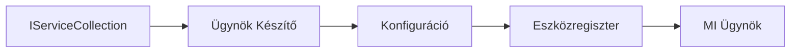

# 🎨 Ügynöki Tervezési Minták Azure OpenAI-val (Responses API) (.NET)

## 📋 Tanulási Célok

Ez a példa vállalati szintű tervezési mintákat mutat be intelligens ügynökök építéséhez a Microsoft Agent Framework .NET-ben Azure OpenAI (Responses API) integrációval. Megtanulod a professzionális mintákat és architekturális megközelítéseket, amelyek az ügynököket gyártásra készen, karbantarthatóvá és skálázhatóvá teszik.

### Vállalati Tervezési Minták

- 🏭 **Gyári Minta**: Szabványosított ügynök létrehozás függőségbefecskendezéssel
- 🔧 **Készítő Minta**: Folyékony ügynök konfiguráció és beállítás
- 🧵 **Szálbiztos Minták**: Egyidejű beszélgetéskezelés
- 📋 **Tárház Minta**: Szervezett eszköz- és képességkezelés

## 🎯 .NET-Különleges Architektúrális Előnyök

### Vállalati Jellemzők

- **Erős Típusosság**: Fordítási időben történő ellenőrzés és IntelliSense támogatás
- **Függőség Befecskendezés**: Beépített DI konténer integráció
- **Konfiguráció Kezelés**: IConfiguration és Opció minták
- **Async/Await**: Első osztályú aszinkron programozási támogatás

### Gyártásra Kész Minták

- **Naplózó Integráció**: ILogger és strukturált naplózás támogatás
- **Egészségellenőrzések**: Beépített monitorozás és diagnosztika
- **Konfiguráció Érvényesítés**: Erős típusosság adat annotációkkal
- **Hiba Kezelés**: Strukturált kivételkezelés

## 🔧 Műszaki Architektúra

### Alapvető .NET Összetevők

- **Microsoft.Extensions.AI**: Egységes AI szolgáltatás absztrakciók
- **Microsoft.Agents.AI**: Vállalati ügynök-orchestrációs keretrendszer
- **Azure OpenAI (Responses API)**: Nagy teljesítményű API kliens minták
- **Konfigurációs Rendszer**: appsettings.json és környezeti integráció

### Tervezési Minta Megvalósítás



## 🏗️ Bemutatott Vállalati Minták

### 1. **Létrehozó Minták**

- **Ügynök Gyár**: Központosított ügynök létrehozás következetes konfigurációval
- **Készítő Minta**: Folyékony API összetett ügynök konfigurációhoz
- **Singleton Minta**: Megosztott erőforrások és konfigurációkezelés
- **Függőség Befecskendezés**: Laza csatolás és tesztelhetőség

### 2. **Viselkedési Minták**

- **Stratégia Minta**: Cserélhető eszköz végrehajtási stratégiák
- **Parancs Minta**: Kapszulázott ügynökműveletek visszavonással/újra
- **Megfigyelő Minta**: Eseményvezérelt ügynök életciklus kezelés
- **Sablon Módszer**: Szabványosított ügynök végrehajtási munkafolyamatok

### 3. **Strukturális Minták**

- **Adapter Minta**: Azure OpenAI (Responses API) integrációs réteg
- **Dekorátor Minta**: Ügynök képességbővítés
- **Homlokzat Minta**: Egyszerűsített ügynök interakciós interfészek
- **Proxy Minta**: Késleltetett betöltés és gyorsítótárazás a teljesítményért

## 📚 .NET Tervezési Elvek

### SOLID Elvek

- **Egyetlen Felelősség**: Minden komponensnek egyértelmű célja van
- **Nyitott/Zárt**: Bővíthető módosítás nélkül
- **Liskov Helyettesítés**: Interfész-alapú eszköz megvalósítások
- **Interfész Szigetelés**: Fókuszált, összetartó interfészek
- **Függőség Inverzió**: Absztrakciókra támaszkodj, ne konkrétumokra

### Tiszta Architektúra

- **Domain Réteg**: Alapvető ügynök és eszköz absztrakciók
- **Alkalmazás Réteg**: Ügynök orchestráció és munkafolyamatok
- **Infrastruktúra Réteg**: Azure OpenAI (Responses API) integráció és külső szolgáltatások
- **Prezentációs Réteg**: Felhasználói interakció és válaszformázás

## 🔒 Vállalati Szempontok

### Biztonság

- **Hitelesítő Adatkezelés**: Biztonságos API kulcs kezelés IConfiguration-nel
- **Bemenet Érvényesítés**: Erős típusosság és adat annotáció érvényesítés
- **Kimenet Szűrés**: Biztonságos válasz feldolgozás és szűrés
- **Audit Naplózás**: Átfogó műveletkövetés

### Teljesítmény

- **Aszinkron Minták**: Nem blokkoló I/O műveletek
- **Kapcsolat Medence**: Hatékony HTTP kliens kezelés
- **Gyorsítótárazás**: Válasz gyorsítótárazás a jobb teljesítményért
- **Erőforrás Kezelés**: Megfelelő eldobási és tisztítási minták

### Skálázhatóság

- **Szálbiztonság**: Egyidejű ügynök végrehajtás támogatás
- **Erőforrás Medencezés**: Hatékony erőforrás felhasználás
- **Terhelés Kezelés**: Sebességkorlátozás és vissznyomás kezelés
- **Monitorozás**: Teljesítmény mutatók és egészségellenőrzések

## 🚀 Gyártásba Telepítés

- **Konfiguráció Kezelés**: Környezet specifikus beállítások
- **Naplózási Stratégia**: Strukturált naplózás korrelációs azonosítókkal
- **Hiba Kezelés**: Globális kivételkezelés megfelelő helyreállítással
- **Monitorozás**: Alkalmazás betekintés és teljesítmény számlálók
- **Tesztelés**: Egységtesztek, integrációs tesztek és terheléses tesztelési minták

Készen állsz vállalati szintű intelligens ügynökök építésére .NET-tel? Építsünk valami robosztust! 🏢✨

## 🚀 Első Lépések

### Előfeltételek

- [.NET 10 SDK](https://dotnet.microsoft.com/download/dotnet/10.0) vagy újabb
- Egy [Azure előfizetés](https://azure.microsoft.com/free/) Azure OpenAI erőforrással és modell telepítéssel
- Az [Azure CLI](https://learn.microsoft.com/cli/azure/install-azure-cli) — bejelentkezés `az login` parancs használatával

### Szükséges Környezeti Változók

```bash
# zsh/bash
export AZURE_OPENAI_ENDPOINT=https://<your-resource>.openai.azure.com
export AZURE_OPENAI_DEPLOYMENT=gpt-4.1-mini
# Jelentkezzen be, hogy az AzureCliCredential kaphasson egy tokent
az login
```

```powershell
# PowerShell
$env:AZURE_OPENAI_ENDPOINT = "https://<your-resource>.openai.azure.com"
$env:AZURE_OPENAI_DEPLOYMENT = "gpt-4.1-mini"
# Ezután jelentkezzen be, hogy az AzureCliCredential kaphasson egy tokent
az login
```

### Példa Kód

A kód példa futtatásához,

```bash
# zsh/bash
chmod +x ./03-dotnet-agent-framework.cs
./03-dotnet-agent-framework.cs
```

Vagy a dotnet CLI használatával:

```bash
dotnet run ./03-dotnet-agent-framework.cs
```

Nézd meg a [`03-dotnet-agent-framework.cs`](../../../../03-agentic-design-patterns/code_samples/03-dotnet-agent-framework.cs) fájlban a teljes kódot.

```csharp
#!/usr/bin/dotnet run

#:package Microsoft.Extensions.AI@10.*
#:package Microsoft.Agents.AI.OpenAI@1.*-*
#:package Azure.AI.OpenAI@2.1.0
#:package Azure.Identity@1.13.1

using System.ComponentModel;

using Microsoft.Agents.AI;
using Microsoft.Extensions.AI;

using Azure.AI.OpenAI;
using Azure.Identity;

// Tool Function: Random Destination Generator
// This static method will be available to the agent as a callable tool
// The [Description] attribute helps the AI understand when to use this function
// This demonstrates how to create custom tools for AI agents
[Description("Provides a random vacation destination.")]
static string GetRandomDestination()
{
    // List of popular vacation destinations around the world
    // The agent will randomly select from these options
    var destinations = new List<string>
    {
        "Paris, France",
        "Tokyo, Japan",
        "New York City, USA",
        "Sydney, Australia",
        "Rome, Italy",
        "Barcelona, Spain",
        "Cape Town, South Africa",
        "Rio de Janeiro, Brazil",
        "Bangkok, Thailand",
        "Vancouver, Canada"
    };

    // Generate random index and return selected destination
    // Uses System.Random for simple random selection
    var random = new Random();
    int index = random.Next(destinations.Count);
    return destinations[index];
}

// Azure OpenAI with the Responses API (stable v1 endpoint). Sign in with `az login`.
var azureEndpoint = Environment.GetEnvironmentVariable("AZURE_OPENAI_ENDPOINT")
    ?? throw new InvalidOperationException("AZURE_OPENAI_ENDPOINT is not set.");
var deployment = Environment.GetEnvironmentVariable("AZURE_OPENAI_DEPLOYMENT") ?? "gpt-4.1-mini";

var azureClient = new AzureOpenAIClient(new Uri(azureEndpoint), new AzureCliCredential());

// Define Agent Identity and Comprehensive Instructions
// Agent name for identification and logging purposes
var AGENT_NAME = "TravelAgent";

// Detailed instructions that define the agent's personality, capabilities, and behavior
// This system prompt shapes how the agent responds and interacts with users
var AGENT_INSTRUCTIONS = """
You are a helpful AI Agent that can help plan vacations for customers.

Important: When users specify a destination, always plan for that location. Only suggest random destinations when the user hasn't specified a preference.

When the conversation begins, introduce yourself with this message:
"Hello! I'm your TravelAgent assistant. I can help plan vacations and suggest interesting destinations for you. Here are some things you can ask me:
1. Plan a day trip to a specific location
2. Suggest a random vacation destination
3. Find destinations with specific features (beaches, mountains, historical sites, etc.)
4. Plan an alternative trip if you don't like my first suggestion

What kind of trip would you like me to help you plan today?"

Always prioritize user preferences. If they mention a specific destination like "Bali" or "Paris," focus your planning on that location rather than suggesting alternatives.
""";

// Create AI Agent with Advanced Travel Planning Capabilities
// Get the Responses client for the deployment and create the AI agent
// Configure agent with name, detailed instructions, and available tools
// This demonstrates the .NET agent creation pattern with full configuration
AIAgent agent = azureClient
    .GetChatClient(deployment)
    .AsAIAgent(
        name: AGENT_NAME,
        instructions: AGENT_INSTRUCTIONS,
        tools: [AIFunctionFactory.Create(GetRandomDestination)]
    );

// Create New Conversation Session for Context Management
// Initialize a new conversation session to maintain context across multiple interactions
// Sessions enable the agent to remember previous exchanges and maintain conversational state
// This is essential for multi-turn conversations and contextual understanding
var session = await agent.CreateSessionAsync();

// Execute Agent: First Travel Planning Request
// Run the agent with an initial request that will likely trigger the random destination tool
// The agent will analyze the request, use the GetRandomDestination tool, and create an itinerary
// Using the session parameter maintains conversation context for subsequent interactions
await foreach (var update in agent.RunStreamingAsync("Plan me a day trip", session))
{
    await Task.Delay(10);
    Console.Write(update);
}

Console.WriteLine();

// Execute Agent: Follow-up Request with Context Awareness
// Demonstrate contextual conversation by referencing the previous response
// The agent remembers the previous destination suggestion and will provide an alternative
// This showcases the power of conversation sessions and contextual understanding in .NET agents
await foreach (var update in agent.RunStreamingAsync("I don't like that destination. Plan me another vacation.", session))
{
    await Task.Delay(10);
    Console.Write(update);
}
```

---

<!-- CO-OP TRANSLATOR DISCLAIMER START -->
**Jogi nyilatkozat**:
Ez a dokumentum az AI fordítási szolgáltatás, a [Co-op Translator](https://github.com/Azure/co-op-translator) segítségével készült. Bár az pontosságra törekszünk, kérjük, vegye figyelembe, hogy az automatikus fordítások hibákat vagy pontatlanságokat tartalmazhatnak. Az eredeti dokumentum az anyanyelvén tekintendő hiteles forrásnak. Fontos információk esetén professzionális emberi fordítást javasolunk. Nem vállalunk felelősséget semmilyen félreértésért vagy téves értelmezésért, amely ebből a fordításból ered.
<!-- CO-OP TRANSLATOR DISCLAIMER END -->