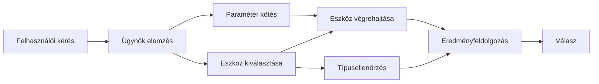

# 🛠️ Fejlett eszközhasználat Azure OpenAI-vel (Responses API) (.NET)

## 📋 Tanulási célok

Ez a jegyzetfüzet bemutatja a vállalati szintű eszközintegrációs mintákat a Microsoft Agent Framework .NET-ben az Azure OpenAI (Responses API) használatával. Megtanulod, hogyan építs fejlett ügynököket több specializált eszközzel, kihasználva a C# erős típusosságát és a .NET vállalati funkcióit.

### Fejlett eszközfunkciók, amiket elsajátítasz

- 🔧 **Többeszköz-architektúra**: Több specializált képességgel rendelkező ügynökök építése
- 🎯 **Típusbiztos eszközvégrehajtás**: A C# fordítási idejű ellenőrzésének kihasználása
- 📊 **Vállalati eszközminták**: Gyártásra kész eszköztervezés és hibakezelés
- 🔗 **Eszközkompozíció**: Eszközök kombinálása összetett üzleti munkafolyamatokhoz

## 🎯 .NET eszközarchitektúra előnyei

### Vállalati eszközfunkciók

- **Fordítási idejű ellenőrzés**: Az erős típusosság biztosítja az eszközparaméterek helyességét
- **Függőséginjekció**: IoC konténer integráció az eszközkezeléshez
- **Async/Await minták**: Nem blokkoló eszközvégrehajtás megfelelő erőforrás-kezeléssel
- **Strukturált naplózás**: Beépített naplózási integráció az eszközvégrehajtás figyeléséhez

### Gyártásra kész minták

- **Hibakezelés**: Átfogó hiba kezelés típusos kivételekkel
- **Erőforráskezelés**: Megfelelő felszabadítási minták és memória kezelés
- **Teljesítményfigyelés**: Beépített metrikák és teljesítményszámlálók
- **Konfigurációkezelés**: Típusbiztos konfiguráció ellenőrzéssel

## 🔧 Technikai architektúra

### Alapvető .NET eszközösszetevők

- **Microsoft.Extensions.AI**: Egységes eszközabsztrakciós réteg
- **Microsoft.Agents.AI**: Vállalati szintű eszközszervezés
- **Azure OpenAI (Responses API)**: Magas teljesítményű API kliens kapcsolati tárolással

### Eszközvégrehajtási folyamat



## 🛠️ Eszközkategóriák és minták

### 1. **Adatfeldolgozó eszközök**

- **Bemeneti ellenőrzés**: Erős típusosság adatannotációkkal
- **Átalakító műveletek**: Típusbiztos adatkonverzió és formázás
- **Üzleti logika**: Domain-specifikus számítási és elemző eszközök
- **Kimeneti formázás**: Strukturált válasz generálás

### 2. **Integrációs eszközök** 

- **API csatlakozók**: RESTful szolgáltatásintegráció HttpClienttel
- **Adatbáziseszközök**: Entity Framework integráció adat-hozzáféréshez
- **Fájlműveletek**: Biztonságos fájlrendszer műveletek ellenőrzéssel
- **Külső szolgáltatások**: Harmadik fél szolgáltatásintegrációs minták

### 3. **Hasznos eszközök**

- **Szövegfeldolgozás**: Karakterlánc-manipuláció és formázó segédeszközök
- **Dátum/Idő műveletek**: Kultúrafüggő dátum/idő számítások
- **Matematikai eszközök**: Pontosságos számítások és statisztikai műveletek
- **Ellenőrző eszközök**: Üzleti szabályok érvényesítése és adatellenőrzés

Készen állsz vállalati szintű ügynökök építésére erős, típusbiztos eszközfunkciókkal .NET-ben? Akkor tervezzünk professzionális megoldásokat! 🏢⚡

## 🚀 Első lépések

### Előfeltételek

- [.NET 10 SDK](https://dotnet.microsoft.com/download/dotnet/10.0) vagy újabb
- Egy [Azure előfizetés](https://azure.microsoft.com/free/), amiben Azure OpenAI erőforrás és modell telepítés található
- Az [Azure CLI](https://learn.microsoft.com/cli/azure/install-azure-cli) — bejelentkezés `az login` használatával

### Szükséges környezeti változók

```bash
# zsh/bash
export AZURE_OPENAI_ENDPOINT=https://<your-resource>.openai.azure.com
export AZURE_OPENAI_DEPLOYMENT=gpt-5-mini
# Jelentkezzen be, hogy az AzureCliCredential kaphasson egy tokent
az login
```

```powershell
# PowerShell
$env:AZURE_OPENAI_ENDPOINT = "https://<your-resource>.openai.azure.com"
$env:AZURE_OPENAI_DEPLOYMENT = "gpt-5-mini"
# Ezután jelentkezzen be, hogy az AzureCliCredential tokenhez juthasson
az login
```

### Minta kód

A kódpéldát futtatáshoz,

```bash
# zsh/bash
chmod +x ./04-dotnet-agent-framework.cs
./04-dotnet-agent-framework.cs
```

Vagy dotnet CLI használatával:

```bash
dotnet run ./04-dotnet-agent-framework.cs
```

Lásd a teljes kódot a [`04-dotnet-agent-framework.cs`](../../../../04-tool-use/code_samples/04-dotnet-agent-framework.cs) fájlban.

```csharp
#!/usr/bin/dotnet run

#:package Microsoft.Extensions.AI@10.*
#:package Microsoft.Agents.AI.OpenAI@1.*-*
#:package Azure.AI.OpenAI@2.1.0
#:package Azure.Identity@1.13.1

using System.ComponentModel;

using Microsoft.Agents.AI;
using Microsoft.Extensions.AI;

using Azure.AI.OpenAI;
using Azure.Identity;

// Tool Function: Random Destination Generator
// This static method will be available to the agent as a callable tool
// The [Description] attribute helps the AI understand when to use this function
// This demonstrates how to create custom tools for AI agents
[Description("Provides a random vacation destination.")]
static string GetRandomDestination()
{
    // List of popular vacation destinations around the world
    // The agent will randomly select from these options
    var destinations = new List<string>
    {
        "Paris, France",
        "Tokyo, Japan",
        "New York City, USA",
        "Sydney, Australia",
        "Rome, Italy",
        "Barcelona, Spain",
        "Cape Town, South Africa",
        "Rio de Janeiro, Brazil",
        "Bangkok, Thailand",
        "Vancouver, Canada"
    };

    // Generate random index and return selected destination
    // Uses System.Random for simple random selection
    var random = new Random();
    int index = random.Next(destinations.Count);
    return destinations[index];
}

// Azure OpenAI with the Responses API (stable v1 endpoint). Sign in with `az login`.
var azureEndpoint = Environment.GetEnvironmentVariable("AZURE_OPENAI_ENDPOINT")
    ?? throw new InvalidOperationException("AZURE_OPENAI_ENDPOINT is not set.");
var deployment = Environment.GetEnvironmentVariable("AZURE_OPENAI_DEPLOYMENT") ?? "gpt-5-mini";

var azureClient = new AzureOpenAIClient(new Uri(azureEndpoint), new AzureCliCredential());

// Define Agent Identity and Comprehensive Instructions
// Agent name for identification and logging purposes
var AGENT_NAME = "TravelAgent";

// Detailed instructions that define the agent's personality, capabilities, and behavior
// This system prompt shapes how the agent responds and interacts with users
var AGENT_INSTRUCTIONS = """
You are a helpful AI Agent that can help plan vacations for customers.

Important: When users specify a destination, always plan for that location. Only suggest random destinations when the user hasn't specified a preference.

When the conversation begins, introduce yourself with this message:
"Hello! I'm your TravelAgent assistant. I can help plan vacations and suggest interesting destinations for you. Here are some things you can ask me:
1. Plan a day trip to a specific location
2. Suggest a random vacation destination
3. Find destinations with specific features (beaches, mountains, historical sites, etc.)
4. Plan an alternative trip if you don't like my first suggestion

What kind of trip would you like me to help you plan today?"

Always prioritize user preferences. If they mention a specific destination like "Bali" or "Paris," focus your planning on that location rather than suggesting alternatives.
""";

// Create AI Agent with Advanced Travel Planning Capabilities
// Get the Responses client for the deployment and create the AI agent
// Configure agent with name, detailed instructions, and available tools
// This demonstrates the .NET agent creation pattern with full configuration
AIAgent agent = azureClient
    .GetChatClient(deployment)
    .AsAIAgent(
        name: AGENT_NAME,
        instructions: AGENT_INSTRUCTIONS,
        tools: [AIFunctionFactory.Create(GetRandomDestination)]
    );

// Create New Conversation Session for Context Management
// Initialize a new conversation session to maintain context across multiple interactions
// Sessions enable the agent to remember previous exchanges and maintain conversational state
// This is essential for multi-turn conversations and contextual understanding
await using var session = await agent.CreateSessionAsync();

// Execute Agent: First Travel Planning Request
// Run the agent with an initial request that will likely trigger the random destination tool
// The agent will analyze the request, use the GetRandomDestination tool, and create an itinerary
// Using the session parameter maintains conversation context for subsequent interactions
await foreach (var update in agent.RunStreamingAsync("Plan me a day trip", session))
{
    await Task.Delay(10);
    Console.Write(update);
}

Console.WriteLine();

// Execute Agent: Follow-up Request with Context Awareness
// Demonstrate contextual conversation by referencing the previous response
// The agent remembers the previous destination suggestion and will provide an alternative
// This showcases the power of conversation sessions and contextual understanding in .NET agents
await foreach (var update in agent.RunStreamingAsync("I don't like that destination. Plan me another vacation.", session))
{
    await Task.Delay(10);
    Console.Write(update);
}
```

---

<!-- CO-OP TRANSLATOR DISCLAIMER START -->
**Jogi nyilatkozat**:
Ez a dokumentum az AI fordítási szolgáltatás, a [Co-op Translator](https://github.com/Azure/co-op-translator) segítségével készült. Bár az pontosságra törekszünk, kérjük, vegye figyelembe, hogy az automatikus fordítások hibákat vagy pontatlanságokat tartalmazhatnak. Az eredeti dokumentum az anyanyelvén tekintendő hiteles forrásnak. Fontos információk esetén professzionális emberi fordítást javasolunk. Nem vállalunk felelősséget semmilyen félreértésért vagy téves értelmezésért, amely ebből a fordításból ered.
<!-- CO-OP TRANSLATOR DISCLAIMER END -->