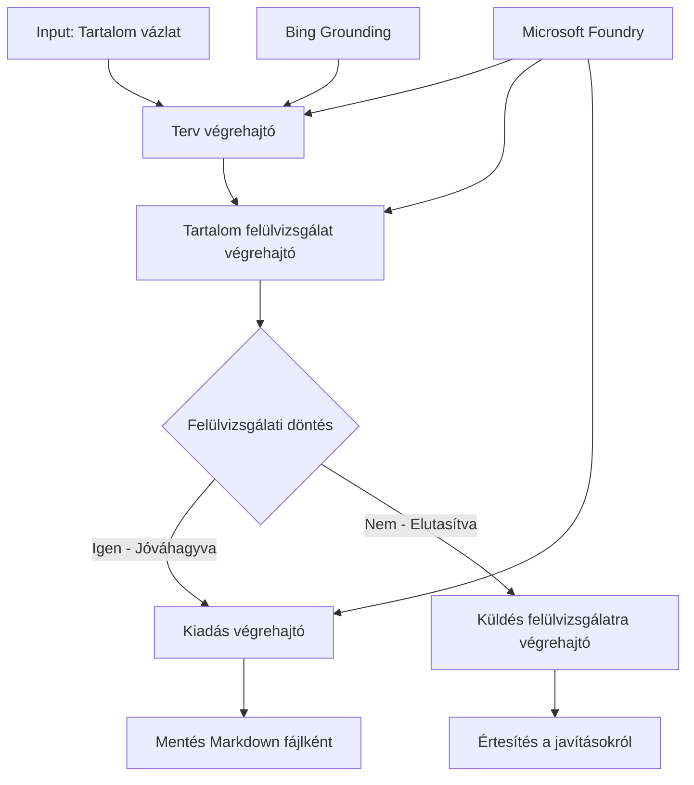

# 🔀 Feltételes ügynök munkafolyamatok a Microsoft Foundry-val (.NET)

## 📋 Intelligens döntésalapú munkafolyamat bemutató

Ez a munkafüzet bemutatja a **feltételes munkafolyamat mintákat** a Microsoft Foundry és a Microsoft Agent Framework for .NET használatával. Megtanulhatja, hogyan építhet ki kifinomult, döntésalapú munkafolyamatokat, amelyek intelligensen irányítják a feldolgozást AI elemzések, üzleti szabályok és dinamikus feltételek alapján vállalati szintű automatizálás érdekében.

## 🎯 Tanulási célok

### 🧠 **Intelligens döntési architektúra**
- **Feltételes logika megvalósítása**: Több elágazási ponttal rendelkező összetett döntési fákat építeni
- **AI-vezérelt irányítás**: Microsoft Foundry modellek használata intelligens útvonalválasztási döntésekhez
- **Dinamikus munkafolyamat adaptáció**: Munkafolyamat viselkedésének módosítása futásidejű elemzés és feltételek alapján
- **Vállalati szabályintegráció**: Üzleti logika és megfelelőségi követelmények beépítése a munkafolyamatokba

### 🔀 **Fejlett feltételes minták**
- **Többkritériumos döntéshozatal**: Több tényező értékelése az útválasztási döntésekhez
- **Környezetérzékeny feldolgozás**: Döntéshozatal az összegyűjtött munkafolyamat kontextus és előzmények alapján
- **Adaptív munkafolyamat módosítás**: Feldolgozási utak dinamikus igazítása valós idejű feltételek alapján
- **Szabálymotor integráció**: Összetett üzleti szabálymotorok végrehajtása a munkafolyamatokban

### 🏢 **Vállalati feltételes alkalmazások**
- **Dokumentumosztályozás és irányítás**: Dokumentumok automatikus osztályozása és megfelelő munkafolyamatokba irányítása
- **Ügyfélszolgálati triázs**: Ügyfélmegkeresések intelligens irányítása szakosított kezelőcsapatokhoz
- **Megfelelőség és kockázatkezelés**: Különböző érvényesítési és ellenőrzési folyamatok alkalmazása kockázatértékelés alapján
- **Minőségbiztosítási munkafolyamatok**: Tartalom irányítása megfelelő ellenőrzési folyamatokon keresztül minőségi mutatók szerint

## ⚙️ Előfeltételek és beállítás

### 📦 **Szükséges NuGet csomagok**

Fejlett csomagok feltételes munkafolyamat-feldolgozáshoz:

```xml
<!-- Core AI Framework -->
<PackageReference Include="Microsoft.Extensions.AI" Version="9.9.0" />

<!-- Azure AI Agents with Persistent State -->
<PackageReference Include="Azure.AI.Agents.Persistent" Version="1.2.0-beta.5" />

<!-- Azure Identity and Utilities -->
<PackageReference Include="Azure.Identity" Version="1.15.0" />
<PackageReference Include="System.Linq.Async" Version="6.0.3" />
<PackageReference Include="DotNetEnv" Version="3.1.1" />

<!-- Local Workflow Framework References -->
<!-- Microsoft.Agents.Workflows.dll - Advanced workflow orchestration -->
<!-- Microsoft.Agents.AI.AzureAI.dll - Microsoft Foundry integration -->
<!-- Microsoft.Agents.AI.dll - Core agent abstractions -->
```

### 🔑 **Microsoft Foundry konfiguráció**

**Szükséges Azure erőforrások:**
- Microsoft Foundry munkaterület feltételes feldolgozási modellekkel
- Azure előfizetés megfelelő számítási kvótákkal és engedélyekkel
- Telepített AI modellek döntéshozatalhoz és tartalomelemzéshez
- (Opcionális) Bing Search API kapcsolat alapozási képességekhez

**Környezet konfiguráció (.env fájl):**
```env
# Microsoft Foundry Configuration
AZURE_AI_PROJECT_ENDPOINT=https://your-project.cognitiveservices.azure.com/
BING_CONNECTION_ID=your-bing-connection-id
```

**Hitelesítés beállítása:**
```csharp
// Azure CLI or Managed Identity authentication
using Azure.Identity;
var credential = new AzureCliCredential();

// Load environment configuration
DotNetEnv.Env.Load("../../../.env");
```

### 🏗️ **Feltételes munkafolyamat architektúra**



**Főbb komponensek:**
- **Draft Executor**: AI ügynök, amely vázlatokat készít vázlatpontokból
- **Content Review Executor**: AI ügynök, amely értékeli a vázlat minőségét és megfelelőségét
- **Feltételes irányítás**: Döntési logika, amely az értékelés eredményei alapján irányít
- **Publikálási/ellenőrzési utak**: Külön feldolgozási útvonalak jóváhagyott és elutasított tartalomra
- **Állapotkezelés**: Tartalom és ellenőrzési kontextus fenntartása a munkafolyamat során

## 🎨 **Feltételes munkafolyamat tervezési minták**

### 📋 **Tartalom előállítás minőségi kapukkal**
```
Outline → Draft Creation → Quality Review → {Approve: Publish | Reject: Revise}
```

### 🎯 **Kockázatalapú dokumentumfeldolgozás**
```
Document → Risk Assessment → {Low: Standard | High: Enhanced Review}
```

### 🔍 **Intelligens ügyfélszolgálati irányítás**
```
Customer Query → Analysis → {Simple: FAQ Bot | Complex: Human Agent}
```

### 💼 **Megfelelőség-vezérelt munkafolyamatok**
```
Content → Compliance Check → {Pass: Publish | Fail: Legal Review}
```

## 🏢 **Vállalati feltételes előnyök**

### 🎯 **Intelligens automatizálás**
- **Okos döntéshozatal**: AI által támogatott útvonalválasztás tartalomelemzés és kontextus alapján
- **Adaptív feldolgozás**: Olyan munkafolyamatok, amelyek automatikusan alkalmazkodnak a változó körülményekhez
- **Üzleti szabályok érvényesítése**: Összetett üzleti logika és szabályzatok automatikus alkalmazása
- **Környezetérzékeny irányítás**: Döntések a teljes munkafolyamat előzmények és összegyűjtött kontextus alapján

### 📈 **Működési kiválóság**
- **Optimalizált erőforrás-elosztás**: Munka irányítása a legmegfelelőbb szakértőkhöz és folyamatokhoz
- **Csökkentett kézi beavatkozás**: Automatizált döntéshozatal minimalizálja az emberi irányítást
- **Gyorsabb megoldási idők**: Közvetlen útvonalválasztás a megfelelő szakértelemhez és feldolgozási képességekhez
- **Konzisztens alkalmazás**: Üzleti szabályok és döntési kritériumok egységes alkalmazása

### 🛡️ **Kockázatkezelés és megfelelőség**
- **Automatizált kockázatértékelés**: AI által támogatott tartalom- és helyzetkockázat szint felmérése
- **Megfelelőség érvényesítése**: Kötelező szabályozási folyamatokon keresztüli automatikus irányítás
- **Biztonsági protokoll alkalmazása**: Fokozott biztonsági intézkedések kockázatértékelés alapján
- **Audit nyomvonal fenntartása**: Az útvonalválasztási döntések és indoklás teljes körű dokumentálása

### 📊 **Elemzés és folyamatos fejlesztés**
- **Döntési elemzés**: Az útvonalválasztási döntések hatékonyságának és pontosságának nyomon követése
- **Minta felismerés**: Trendek és minták az útvonalválasztási döntésekben idővel
- **Teljesítmény optimalizálás**: Folyamatos fejlesztés a döntési kritériumok és útvonal-hatékonyság terén
- **Üzleti intelligencia**: Információk a tartalom jellemzőiről és feldolgozási követelményekről

### 🔧 **Műszaki kiválóság**
- **Állandó állapotkezelés**: Összetett állapot fenntartása a munkafolyamat végrehajtása során
- **Skálázható architektúra**: Nagy volumenű feltételes feldolgozási igények kezelése
- **Integrációs képességek**: Zökkenőmentes integráció meglévő üzleti rendszerekkel és folyamatokkal
- **Monitoring és megfigyelhetőség**: Átfogó teljesítmény- és döntéskövetés a munkafolyamatban

Alkotjunk intelligens, döntésvezérelt vállalati munkafolyamatokat .NET-tel! 🚀

## 💻 A kód futtatása

A teljes megvalósítás megtalálható a `04.dotnet-agent-framework-workflow-aifoundry-condition.cs` fájlban. Ez bemutat egy **tartalom előállítási munkafolyamatot minőségi kapukkal**:

### 🏗️ **Munkafolyamat architektúra**

```
Content Outline → Draft Creation → Quality Review → Conditional Routing:
                                                      ├─ Approved (>200 words) → Publish
                                                      └─ Rejected (<200 words) → Review Notification
```

**Ügynökök a munkafolyamatban:**
1. **Evangelista Ügynök**: Bing alapozás mellett készít oktató jellegű vázlatokat a vázlatpontokból
2. **Tartalomértékelő Ügynök**: Értékeli a vázlat minőségét (szószám, teljesség)
3. **Kiadó Ügynök**: Mentett jóváhagyott tartalom időbélyegzett Markdown fájlokként

**Egyedi végrehajtók:**
1. **DraftExecutor**: A vázlatkészítést koordinálja
2. **ContentReviewExecutor**: Minőség ellenőrzést végez
3. **PublishExecutor**: Kezeli a jóváhagyott tartalom közzétételét
4. **SendReviewExecutor**: Kezeli az elutasított tartalom értesítéseit

### 🚀 Példa futtatása

**Előfeltételek:**
- Microsoft Foundry munkaterület konfigurálva
- Azure CLI hitelesítés (`az login`)
- (Opcionális) Bing Search kapcsolat alapozáshoz

```bash
# Tegye futtathatóvá a szkriptet (Unix/Linux/macOS)
chmod +x 04.dotnet-agent-framework-workflow-aifoundry-condition.cs

# Futtassa a feltételes munkafolyamatot
./04.dotnet-agent-framework-workflow-aifoundry-condition.cs
```

Vagy Windows rendszeren:
```powershell
dotnet run 04.dotnet-agent-framework-workflow-aifoundry-condition.cs
```

### 📝 Várt kimenet

A munkafolyamat a következőket hajtja végre:
1. **Ügynökök létrehozása**: Három specializált Microsoft Foundry ügynök inicializálása
2. **Vázlat generálása**: Az Evangelista ügynök oktató vázlatot készít a vázlatpontból
3. **Tartalom értékelése**: A Tartalomértékelő értékeli a vázlat minőségét
4. **Feltételes irányítás**:
   - **Ha jóváhagyott (>200 szó)**: A kiadó végrehajtó menti Markdown fájlként
   - **Ha elutasított (<200 szó)**: Értesítés küldése az értékelés eredményéről
5. **Eredmények megjelenítése**: A munkafolyamat végső eredményének megjelenítése

### 🔧 Testreszabási lehetőségek

**Értékelési kritériumok módosítása:**
```csharp
const string ContentReviewerInstructions = @"
You are a content reviewer...
1. Check if content is more than 500 words (instead of 200)
2. Verify technical accuracy
3. Ensure proper formatting
...";
```

**További feltételes utak hozzáadása:**
```csharp
var workflow = new WorkflowBuilder(draftExecutor)
    .AddEdge(draftExecutor, contentReviewerExecutor)
    .AddEdge(contentReviewerExecutor, publishExecutor, condition: GetCondition("Excellent"))
    .AddEdge(contentReviewerExecutor, editExecutor, condition: GetCondition("Good"))
    .AddEdge(contentReviewerExecutor, sendReviewerExecutor, condition: GetCondition("Poor"))
    .Build();
```

**Tartalmi elvárások módosítása:**
```csharp
string OUTLINE_Content = @"
# Your Custom Topic
## Section 1
https://your-reference-url
## Section 2
...
";
```

### 🎯 Valós alkalmazások

Ez a feltételes munkafolyamat minta ideális:
- **Tartalomkezelő rendszerek**: Automatikus szerkesztő munkafolyamatok minőségi kapukkal
- **Dokumentumfeldolgozás**: Dokumentumok irányítása osztályozás és megfelelés alapján
- **Ügyfélszolgálat**: Intelligens jegyirányítás komplexitás és sürgősség alapján
- **Jogi ellenőrzés**: Szerződések irányítása kockázatértékelés és érték alapján
- **HR folyamatok**: Jelentkezések irányítása megfelelő szűrő munkafolyamatokon keresztül

### 🔍 Feltételes logika megértése

**Feltétel függvény:**
```csharp
public Func<object?, bool> GetCondition(string expectedResult) =>
    reviewResult => reviewResult is ReviewResult review && review.Result == expectedResult;
```

Ez a függvény egy predikátumot hoz létre, amely:
1. Ellenőrzi, hogy az eredmény `ReviewResult` típusú-e
2. Összehasonlítja a `Result` tulajdonságot a várt értékkel
3. Igaz/hamis értékkel visszatér az útvonalválasztás meghatározására

**Munkafolyamat élek feltételekkel:**
```csharp
.AddEdge(contentReviewerExecutor, publishExecutor, condition: GetCondition("Yes"))
.AddEdge(contentReviewerExecutor, sendReviewerExecutor, condition: GetCondition("No"))
```

### 📊 Fejlett funkciók

**JSON séma érvényesítés:**
A munkafolyamat JSON sémákat használ a strukturált válaszok biztosítására:

```csharp
// Define response structure
public class ReviewResult
{
    [JsonPropertyName("review_result")]
    public string Result { get; set; } = string.Empty;
    
    [JsonPropertyName("reason")]
    public string Reason { get; set; } = string.Empty;
    
    [JsonPropertyName("draft_content")]
    public string DraftContent { get; set; } = string.Empty;
}

// Apply to agent
ResponseFormat = ChatResponseFormat.ForJsonSchema(
    AIJsonUtilities.CreateJsonSchema(typeof(ReviewResult)), 
    "ReviewResult", 
    "Review Result From DraftContent"
)
```

**Bing alapozás integráció:**
Az Evangelista ügynök Bing alapozást használ valós idejű információkövetéshez:

```csharp
var bingGroundingConfig = new BingGroundingSearchConfiguration(bing_conn_id);
BingGroundingToolDefinition bingGroundingTool = new(
    new BingGroundingSearchToolParameters([bingGroundingConfig])
);
```

Ez lehetővé teszi, hogy az ügynök kövesse az URL-eket a vázlatban, és kinyerje a naprakész információkat.

### 🛡️ Hibakezelés

A munkafolyamat robusztus hibakezelést tartalmaz az elutasított tartalomra:
- Az értékelési hibák alternatív útvonalat váltanak ki
- Értesítések világos elutasítási indokokat adnak
- A tartalom megőrzése felülvizsgálathoz

### 🔄 Munkafolyamat bővítése

**Felülvizsgálati ciklus hozzáadása:**
Hozzon létre olyan visszacsatolási hurkot, amely automatikusan újravázlatolja a tartalmat:

```csharp
.AddEdge(contentReviewerExecutor, publishExecutor, condition: GetCondition("Yes"))
.AddEdge(contentReviewerExecutor, draftExecutor, condition: GetCondition("No")) // Loop back
```

**Többszintű felülvizsgálat implementálása:**
Több felülvizsgálati lépés hozzáadása eltérő kritériumokkal:

```csharp
.AddEdge(draftExecutor, technicalReviewer)
.AddEdge(technicalReviewer, editorialReviewer, condition: GetCondition("TechPass"))
.AddEdge(editorialReviewer, publishExecutor, condition: GetCondition("EditPass"))
```

Ez a feltételes munkafolyamat minta az alapot adja kifinomult, intelligens vállalati automatizálási rendszerek építéséhez! 🚀

---

<!-- CO-OP TRANSLATOR DISCLAIMER START -->
**Jogi nyilatkozat**:
Ez a dokumentum az AI fordítási szolgáltatás, a [Co-op Translator](https://github.com/Azure/co-op-translator) segítségével készült. Bár az pontosságra törekszünk, kérjük, vegye figyelembe, hogy az automatikus fordítások hibákat vagy pontatlanságokat tartalmazhatnak. Az eredeti dokumentum az anyanyelvén tekintendő hiteles forrásnak. Fontos információk esetén professzionális emberi fordítást javasolunk. Nem vállalunk felelősséget semmilyen félreértésért vagy téves értelmezésért, amely ebből a fordításból ered.
<!-- CO-OP TRANSLATOR DISCLAIMER END -->