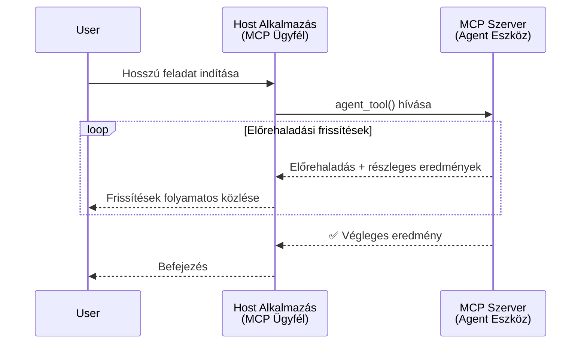
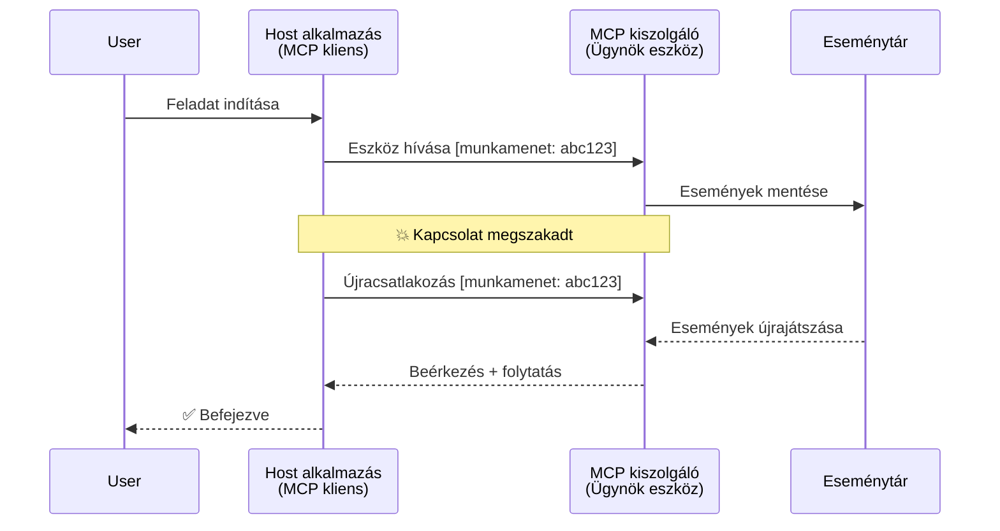
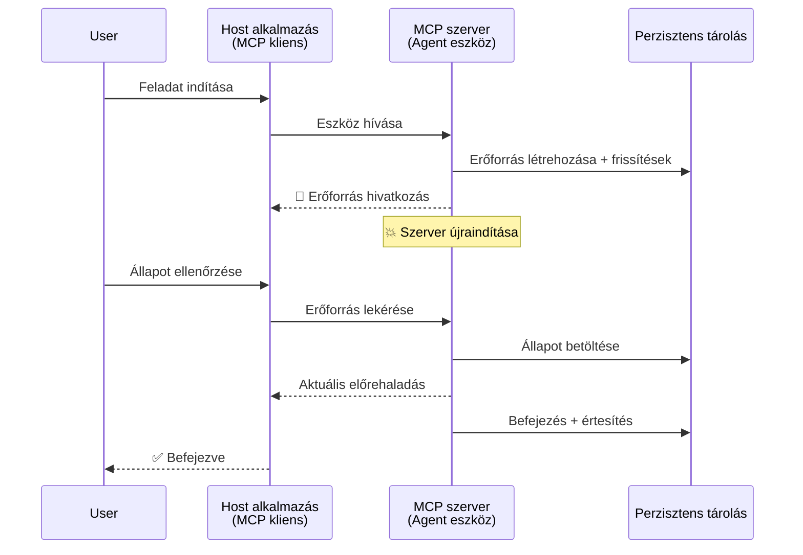
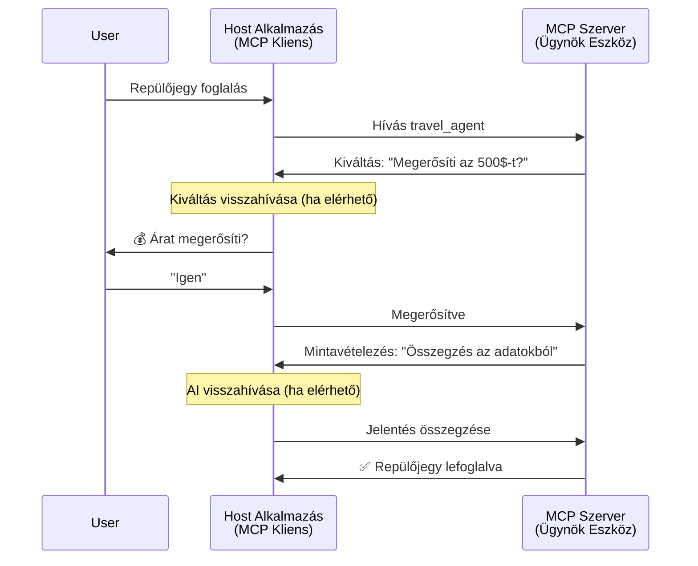
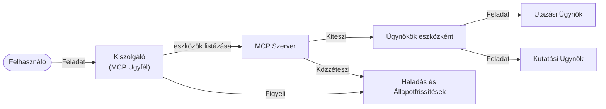

# Ügynök-ügynök közötti kommunikációs rendszerek építése MCP-vel

> TL;DR - Felépíthetsz ügynök2ügynök kommunikációt MCP-vel? Igen!

Az MCP jelentősen fejlődött eredeti "LLM-ek kontextusának biztosítása" célján túl. A legújabb fejlesztések között szerepelnek az [újraindítható streamelés](https://modelcontextprotocol.io/docs/concepts/transports#resumability-and-redelivery), [kiváltás](https://modelcontextprotocol.io/specification/2025-06-18/client/elicitation), [mintavétel](https://modelcontextprotocol.io/specification/2025-06-18/client/sampling) és értesítések ([folyamatban](https://modelcontextprotocol.io/specification/2025-06-18/basic/utilities/progress) és [erőforrások](https://modelcontextprotocol.io/specification/2025-06-18/schema#resourceupdatednotification)) támogatása, így az MCP most erős alapot nyújt összetett ügynök-ügynök kommunikációs rendszerek építéséhez.

## Az Ügynök/Eszköz félreértése

Ahogy egyre több fejlesztő fedez fel ügynöki viselkedésű eszközöket (hosszan futó feladatok, futás közbeni további input igénye stb.), egy gyakori tévhit, hogy az MCP nem alkalmas, mivel korai példái az eszközeinek primitív egyszerű kérés-válasz mintákra fókuszáltak.

Ez a nézet elavult. Az MCP specifikációja az elmúlt hónapokban jelentősen bővült olyan képességekkel, amelyek áthidalják a különbséget a hosszú ideig futó ügynöki viselkedés építéséhez:

- **Streamelés és Részleges eredmények**: Valós idejű előrehaladási frissítések a végrehajtás alatt
- **Újraindíthatóság**: A kliensek képesek újracsatlakozni és folytatni a megszakítás után
- **Tartósság**: Az eredmények túlélnek szerver újraindításokat (pl. erőforrás linkeken keresztül)
- **Többszörös kör**: Interaktív input a végrehajtás közben kiváltás és mintavétel segítségével

Ezek a funkciók kombinálhatók, hogy összetett ügynöki és multi-ügynöki alkalmazásokat tegyenek lehetővé, mind az MCP protokollon futtatva.

Hivatkozásként egy ügynököt „eszköznek” nevezünk, amely elérhető egy MCP szerveren. Ez feltételezi egy hoszt alkalmazás létezését, amely MCP kliens implementációval rendelkezik, amely munkamenetet létesít az MCP szerverrel és hívni tudja az ügynököt.

## Mi tesz egy MCP eszközt „ügynökké”?

Az implementációba való belemélyedés előtt tisztázzuk, milyen infrastruktúra képességekre van szükség a hosszú távon futó ügynökök támogatásához.

> Az ügynököt olyan entitásnak definiáljuk, amely autonóm módon képes működni hosszabb ideig, komplex feladatok kezelésére, amelyek több interakciót vagy valós idejű visszacsatoláson alapuló módosítást igényelhetnek.

### 1. Streamelés és Részleges eredmények

A hagyományos kérés-válasz minták nem alkalmasak hosszú futású feladatokra. Az ügynököknek biztosítaniuk kell:

- Valós idejű előrehaladási frissítéseket
- Köztes eredményeket

**MCP támogatás**: Az erőforrás frissítési értesítések lehetővé teszik a részleges eredmények streamelését, bár ez gondos tervezést igényel, hogy elkerüljük az ütközést a JSON-RPC 1:1 kérés/válasz modelljével.

| Funkció                   | Használati eset                                                                                                                                                           | MCP támogatás                                                                             |
| ------------------------- | ------------------------------------------------------------------------------------------------------------------------------------------------------------------------ | ----------------------------------------------------------------------------------------- |
| Valós idejű előrehaladás  | A felhasználó kódalap migrációs feladatot kér. Az ügynök streameli az előrehaladást: "10% - Függőségek elemzése... 25% - TypeScript fájlok konvertálása... 50% - Importok frissítése..." | ✅ Előrehaladási értesítések                                                              |
| Részleges eredmények      | „Könyv generálás” feladat részleges eredményeket streamel, pl. 1) Történeti ív vázlat, 2) Fejezetlista, 3) Minden fejezet kész állapotban. A hoszt bármikor ellenőrizheti, megszakíthatja vagy átirányíthatja. | ✅ Az értesítések „kiterjeszthetők” részleges eredményekre, lásd a PR 383, 776 javaslatokat   |

<div align="center" style="font-style: italic; font-size: 0.95em; margin-bottom: 0.5em;">
<strong>1. ábra:</strong> Ez az ábra azt szemlélteti, hogyan streameli egy MCP ügynök a valós idejű előrehaladási értesítéseket és részleges eredményeket a hoszt alkalmazásnak egy hosszú futású feladat során, lehetővé téve a felhasználónak a végrehajtás valós idejű nyomon követését.
</div>



### 2. Újraindíthatóság

Az ügynököknek elegánsan kell kezelniük a hálózati megszakításokat:

- Újracsatlakozás a (kliens) kapcsolatszakadás után
- Folytatás onnan, ahol abbahagyták (üzenet újraküldés)

**MCP támogatás**: Az MCP StreamableHTTP szállítás jelenleg támogatja a munkamenet újraindítást és az üzenet újraküldést munkamenet-azonosítókkal és utolsó esemény azonosítókkal. Fontos megjegyezni, hogy a szervernek implementálnia kell egy eseménytárolót (EventStore), amely lehetővé teszi az események lejátszását kliens újracsatlakozáskor.  
Megjegyzendő, hogy van egy közösségi javaslat (PR #975), amely a szállításfüggetlen újraindítható streameket vizsgálja.

| Funkció       | Használati eset                                                                                                                                                | MCP támogatás                                                               |
| ------------- | ------------------------------------------------------------------------------------------------------------------------------------------------------------- | --------------------------------------------------------------------------- |
| Újraindíthatóság | A kliens megszakítja a kapcsolatot hosszú futású feladat közben. Újracsatlakozáskor a munkamenet folytatódik, a kihagyott eseményeket lejátssza, zökkenőmentesen folytatva az abbahagyott helytől. | ✅ StreamableHTTP szállítás munkamenet-azonosítókkal, eseménylejátszással és eseménytárolóval |

<div align="center" style="font-style: italic; font-size: 0.95em; margin-bottom: 0.5em;">
<strong>2. ábra:</strong> Ez az ábra bemutatja, hogyan teszi lehetővé az MCP StreamableHTTP szállítása és az eseménytároló a zökkenőmentes munkamenet folytatást: ha a kliens megszakad, újracsatlakozhat és lejátssza a kihagyott eseményeket, folytatva a feladatot az előrehaladás elvesztése nélkül.
</div>



### 3. Tartósság

A hosszú futású ügynököknek tartós állapotra van szükségük:

- Az eredmények túlélnek szerver újraindításokat
- Az állapot kívülről lekérdezhető
- Az előrehaladás követése munkamenetek között

**MCP támogatás**: Az MCP már támogatja az erőforrás link visszatérési típust az eszköz hívások esetén. Jelenleg a gyakori minta olyan eszköz tervezése, amely létrehoz egy erőforrást és azonnal visszaad egy erőforrás linket. Az eszköz a háttérben folytathatja a feladat kezelését és frissítheti az erőforrást, míg a kliens választhat, hogy lekérdezi az erőforrás állapotát részleges vagy teljes eredményekért (attól függően, milyen erőforrás frissítéseket küld a szerver), vagy feliratkozik az erőforrásra az értesítésekhez.

Egy korlát, hogy az erőforrások lekérdezése vagy frissítésekre való feliratkozás erőforrásokat használhat, ami nagy léptékben problémás lehet. Van egy nyílt közösségi javaslat (beleértve a #992-t), amely vizsgálja annak lehetőségét, hogy webhookokat vagy triggerek tegyenek lehetővé, amelyeket a szerver hívhat a kliens/házigazda alkalmazás frissítésekkel való értesítésére.

| Funkció    | Használati eset                                                                                                                                 | MCP támogatás                                                         |
| ---------- | ------------------------------------------------------------------------------------------------------------------------------------------------ | --------------------------------------------------------------------- |
| Tartósság  | A szerver összeomlik adat migrációs feladat közben. Az eredmények és előrehaladás túlélnek újraindítást, a kliens ellenőrizheti az állapotot és folytathatja a tartós erőforrásból. | ✅ Erőforrás linkek tartós tárolással és állapot értesítésekkel       |

Napjainkban elterjedt minta, hogy olyan eszközt terveznek, amely létrehoz egy erőforrást és azonnal visszaad egy erőforrás linket. Az eszköz a háttérben foglalkozhat a feladattal, erőforrás értesítéseket adhat ki, amelyek előrehaladási frissítésként vagy részleges eredményként szolgálnak, és szükség szerint frissítheti az erőforrás tartalmát.

<div align="center" style="font-style: italic; font-size: 0.95em; margin-bottom: 0.5em;">
<strong>3. ábra:</strong> Ez az ábra bemutatja, hogyan használják az MCP ügynökök a tartós erőforrásokat és állapot értesítéseket, hogy biztosítsák, a hosszú futású feladatok túléljék a szerver újraindításokat, lehetővé téve a kliensek számára az előrehaladás ellenőrzését és az eredmények lekérését hibák után is.
</div>



### 4. Többszörös Körű Interakciók

Az ügynökök gyakran igényelnek további inputot a végrehajtás közben:

- Emberi tisztázás vagy jóváhagyás
- AI segítség összetett döntésekhez
- Dinamikus paraméter módosítás

**MCP támogatás**: Teljes körűen támogatott mintavétel (AI inputhoz) és kiváltás (emberi inputhoz) révén.

| Funkció                  | Használati eset                                                                                                                                    | MCP támogatás                                             |
| ------------------------ | ------------------------------------------------------------------------------------------------------------------------------------------------- | --------------------------------------------------------- |
| Többszörös körű interakció | Egy utazásszervező ügynök ár megerősítést kér a felhasználótól, majd AI-t kér az utazási adatok összefoglalására, mielőtt befejezné a foglalást.    | ✅ Kiváltás emberi inputhoz, mintavétel AI inputhoz        |

<div align="center" style="font-style: italic; font-size: 0.95em; margin-bottom: 0.5em;">
<strong>4. ábra:</strong> Ez az ábra azt mutatja be, hogyan képesek az MCP ügynökök interaktívan emberi inputot kiváltani vagy AI segítséget kérni a végrehajtás közben, támogatva összetett, többszörös körös munkafolyamatokat, mint a megerősítések és dinamikus döntések.
</div>



## Hosszú futású ügynökök MCP-n való implementálása - Kód áttekintés

E cikk részeként egy [kód tárat](https://github.com/victordibia/ai-tutorials/tree/main/MCP%20Agents) biztosítunk, amely a MCP Python SDK használatával valósít meg hosszú futású ügynököket StreamableHTTP szállítással, munkamenet folytatással és üzenet újraküldéssel. Az implementáció bemutatja, hogyan komponálhatók össze az MCP képességek kifinomult ügynökszerű viselkedések engedélyezésére.

Konkrétan két fő ügynök eszközt valósítunk meg a szerveren:

- **Utazási ügynök** - Utazásfoglalási szolgáltatás szimulációja ár megerősítéssel kiváltáson keresztül
- **Kutatási ügynök** - Kutatási feladatokat végez AI-vezérelt összefoglalókkal mintavételen keresztül

Mindkét ügynök valós idejű előrehaladási értesítéseket, interaktív megerősítéseket és teljes munkamenet folytatási képességeket demonstrál.

### Kulcsimplementációs koncepciók

A következő szakaszok bemutatják a szerver oldali ügynök implementációt és a kliens oldali hoszt feldolgozást minden képesség esetén:

#### Streamelés és előrehaladási frissítések - Valós idejű feladatállapot

A streamelés lehetővé teszi az ügynökök számára, hogy valós idejű előrehaladási értesítéseket szolgáltassanak hosszú futású feladatok során, tájékoztatva a felhasználót a feladat állapotáról és köztes eredményekről.

**Szerverimplementáció (ügynök előrehaladási értesítéseket küld):**

```python
# A server/server.py-ból - Utazási ügynök, amely előrehaladási frissítéseket küld
for i, step in enumerate(steps):
    await ctx.session.send_progress_notification(
        progress_token=ctx.request_id,
        progress=i * 25,
        total=100,
        message=step,
        related_request_id=str(ctx.request_id)
    )
    await anyio.sleep(2)  # Munka szimulálása

# Alternatíva: Naplóüzenetek részletes lépésről lépésre történő frissítésekhez
await ctx.session.send_log_message(
    level="info",
    data=f"Processing step {current_step}/{steps} ({progress_percent}%)",
    logger="long_running_agent",
    related_request_id=ctx.request_id,
)
```

**Kliens implementáció (hoszt fogadja az előrehaladási frissítéseket):**

```python
# A client/client.py fájlból - Valós idejű értesítések kezelésére szolgáló kliens
async def message_handler(message) -> None:
    if isinstance(message, types.ServerNotification):
        if isinstance(message.root, types.LoggingMessageNotification):
            console.print(f"📡 [dim]{message.root.params.data}[/dim]")
        elif isinstance(message.root, types.ProgressNotification):
            progress = message.root.params
            console.print(f"🔄 [yellow]{progress.message} ({progress.progress}/{progress.total})[/yellow]")

# Üzenetkezelő regisztrálása munkamenet létrehozásakor
async with ClientSession(
    read_stream, write_stream,
    message_handler=message_handler
) as session:
```

#### Kiváltás - Felhasználói input kérése

A kiváltás lehetővé teszi, hogy az ügynökök futás közben kérjenek felhasználói inputot. Ez elengedhetetlen a megerősítésekhez, tisztázásokhoz vagy jóváhagyásokhoz hosszú futású feladatok során.

**Szerver implementáció (ügynök megerősítést kér):**

```python
# A server/server.py-ból - Utazási ügynök árajánlat megerősítés kérése
elicit_result = await ctx.session.elicit(
    message=f"Please confirm the estimated price of $1200 for your trip to {destination}",
    requestedSchema=PriceConfirmationSchema.model_json_schema(),
    related_request_id=ctx.request_id,
)

if elicit_result and elicit_result.action == "accept":
    # Folytassa a foglalást
    logger.info(f"User confirmed price: {elicit_result.content}")
elif elicit_result and elicit_result.action == "decline":
    # Törölje a foglalást
    booking_cancelled = True
```

**Kliens implementáció (hoszt biztosítja a kiváltási visszahívást):**

```python
# A client/client.py - kliens kezeli az elhangzott kéréseket
async def elicitation_callback(context, params):
    console.print(f"💬 Server is asking for confirmation:")
    console.print(f"   {params.message}")

    response = console.input("Do you accept? (y/n): ").strip().lower()

    if response in ['y', 'yes']:
        return types.ElicitResult(
            action="accept",
            content={"confirm": True, "notes": "Confirmed by user"}
        )
    else:
        return types.ElicitResult(
            action="decline",
            content={"confirm": False, "notes": "Declined by user"}
        )

# Regisztrálja a visszahívást a munkamenet létrehozásakor
async with ClientSession(
    read_stream, write_stream,
    elicitation_callback=elicitation_callback
) as session:
```

#### Mintavétel - AI segítség kérése

A mintavétel lehetővé teszi az ügynökök számára, hogy AI támogatást kérjenek összetett döntésekhez vagy tartalom generáláshoz a végrehajtás alatt. Ez hibrid ember-AI munkafolyamatokat tesz lehetővé.

**Szerver implementáció (ügynök AI segítséget kér):**

```python
# A szerver/server.py fájlból - Kutatóügynök AI összefoglalót kér
sampling_result = await ctx.session.create_message(
    messages=[
        SamplingMessage(
            role="user",
            content=TextContent(type="text", text=f"Please summarize the key findings for research on: {topic}")
        )
    ],
    max_tokens=100,
    related_request_id=ctx.request_id,
)

if sampling_result and sampling_result.content:
    if sampling_result.content.type == "text":
        sampling_summary = sampling_result.content.text
        logger.info(f"Received sampling summary: {sampling_summary}")
```

**Kliens implementáció (hoszt biztosítja a mintavételi visszahívást):**

```python
# A client/client.py fájlból - Ügyfél által kezelt mintavételezési kérések
async def sampling_callback(context, params):
    message_text = params.messages[0].content.text if params.messages else 'No message'
    console.print(f"🧠 Server requested sampling: {message_text}")

    # Egy valódi alkalmazásban ez egy LLM API hívását jelentené
    # Bemutató célokra egy hamis választ biztosítunk
    mock_response = "Based on current research, MCP has evolved significantly..."

    return types.CreateMessageResult(
        role="assistant",
        content=types.TextContent(type="text", text=mock_response),
        model="interactive-client",
        stopReason="endTurn"
    )

# Regisztrálja a visszahívást a munkamenet létrehozásakor
async with ClientSession(
    read_stream, write_stream,
    sampling_callback=sampling_callback,
    elicitation_callback=elicitation_callback
) as session:
```

#### Újraindíthatóság - Munkamenet folytonosság megszakítások után

Az újraindíthatóság biztosítja, hogy a hosszú futású ügynök feladatok túléljék a kliens megszakadását és zökkenőmentesen folytatódjanak az újracsatlakozás után. Ez eseménytárolókkal és folytató tokenekkel valósul meg.

**Eseménytároló implementáció (szerver tartja a munkamenet állapotát):**

```python
# A server/event_store.py-ból - Egyszerű memóriában tárolt eseménytár
class SimpleEventStore(EventStore):
    def __init__(self):
        self._events: list[tuple[StreamId, EventId, JSONRPCMessage]] = []
        self._event_id_counter = 0

    async def store_event(self, stream_id: StreamId, message: JSONRPCMessage) -> EventId:
        """Store an event and return its ID."""
        self._event_id_counter += 1
        event_id = str(self._event_id_counter)
        self._events.append((stream_id, event_id, message))
        return event_id

    async def replay_events_after(self, last_event_id: EventId, send_callback: EventCallback) -> StreamId | None:
        """Replay events after the specified ID for resumption."""
        # Keresd meg az eseményeket az utolsó ismert esemény után, és játsszad vissza őket
        for _, event_id, message in self._events[start_index:]:
            await send_callback(EventMessage(message, event_id))

# A server/server.py-ból - Eseménytár továbbítása a munkamenet-kezelőnek
def create_server_app(event_store: Optional[EventStore] = None) -> Starlette:
    server = ResumableServer()

    # Munkamenet-kezelő létrehozása eseménytárral a folytatáshoz
    session_manager = StreamableHTTPSessionManager(
        app=server,
        event_store=event_store,  # Az eseménytár lehetővé teszi a munkamenet folytatását
        json_response=False,
        security_settings=security_settings,
    )

    return Starlette(routes=[Mount("/mcp", app=session_manager.handle_request)])

# Használat: Inicializálás eseménytárral
event_store = SimpleEventStore()
app = create_server_app(event_store)
```

**Kliens metaadat folytató tokennel (a kliens az eltárolt állapotot használva újracsatlakozik):**

```python
# A client/client.py fájlból - Ügyfél folytatása metaadatokkal
if existing_tokens and existing_tokens.get("resumption_token"):
    # Használja a meglévő folytatási tokent a megszakítás helyéről való folytatáshoz
    metadata = ClientMessageMetadata(
        resumption_token=existing_tokens["resumption_token"],
    )
else:
    # Hozzon létre visszahívást a folytatási token fogadásakor történő mentéshez
    def enhanced_callback(token: str):
        protocol_version = getattr(session, 'protocol_version', None)
        token_manager.save_tokens(session_id, token, protocol_version, command, args)

    metadata = ClientMessageMetadata(
        on_resumption_token_update=enhanced_callback,
    )

# Küldjön kérést folytatási metaadatokkal
result = await session.send_request(
    types.ClientRequest(
        types.CallToolRequest(
            method="tools/call",
            params=types.CallToolRequestParams(name=command, arguments=args)
        )
    ),
    types.CallToolResult,
    metadata=metadata,
)
```

A hoszt alkalmazás helyileg tartja a munkamenet azonosítókat és folytató tokeneket, lehetővé téve a meglévő munkamenetekhez való újracsatlakozást az előrehaladás vagy állapotvesztés nélkül.

### Kód szervezése

<div align="center" style="font-style: italic; font-size: 0.95em; margin-bottom: 0.5em;">
<strong>5. ábra:</strong> MCP-alapú ügynök rendszerarchitektúra
</div>



**Kulcsfájlok:**

- **`server/server.py`** - Újraindítható MCP szerver utazási és kutatási ügynökökkel, amelyek bemutatják a kiváltást, mintavételt és előrehaladási frissítéseket
- **`client/client.py`** - Interaktív hoszt alkalmazás folytatási támogatással, visszahívás kezelőkkel és token kezelésével
- **`server/event_store.py`** - Eseménytároló implementáció, amely lehetővé teszi a munkamenet folytatást és az üzenet újraküldést

## Kiterjesztés multi-ügynök kommunikációra MCP-n

A fenti implementáció kiterjeszthető multi-ügynök rendszerekre a hoszt alkalmazás intelligenciájának és hatókörének bővítésével:

- **Intelligens feladat dekompozíció**: A hoszt elemzi a komplex felhasználói kéréseket és részekre bontja azokat különböző specializált ügynökök számára
- **Több szerver koordináció**: A hoszt kapcsolatot tart több MCP szerverrel, amelyek eltérő ügynök képességeket kínálnak
- **Feladat állapotkezelés**: A hoszt követi a haladást több párhuzamos ügynök feladaton át, kezeli a függőségeket és sorrendiséget
- **Rugalmasság és újrapróbálkozások**: A hoszt kezeli a hibákat, végrehajt újrapróbálkozási logikát és átirányítja a feladatokat, ha az ügynökök nem elérhetőek
- **Eredmény szintézis**: A hoszt több ügynök outputját koherens végső eredménnyé egyesíti

A hoszt egy egyszerű kliensből intelligens koordinátorrá fejlődik, amely elosztott ügynök képességeket koordinál miközben megőrzi ugyanazt az MCP protokoll alapot.

## Összegzés

Az MCP bővített képességei - erőforrás értesítések, kiváltás/mintavétel, újraindítható streamek és tartós erőforrások - lehetővé teszik az összetett ügynök-ügynök interakciókat miközben megőrzik a protokoll egyszerűségét.

## Első lépések

Készen állsz a saját ügynök2ügynök rendszered fejlesztésére? Kövesd ezeket a lépéseket:

### 1. Futtasd a demót

```bash
# Indítsa el a szervert eseménytárral a folytatáshoz
python -m server.server --port 8006

# Egy másik terminálban futtassa az interaktív klienst
python -m client.client --url http://127.0.0.1:8006/mcp
```

**Elérhető parancsok interaktív módban:**

- `travel_agent` - Utazás foglalása ár megerősítéssel kiváltáson keresztül
- `research_agent` - Kutatási témák AI által támogatott összefoglalókkal mintavételen keresztül
- `list` - Minden elérhető eszköz megjelenítése
- `clean-tokens` - Folytató tokenek törlése
- `help` - Részletes parancssegítség megjelenítése
- `quit` - Kilépés a kliensből

### 2. Teszteld a folytatási képességeket

- Indíts el egy hosszú futású ügynököt (pl. `travel_agent`)
- Megszakítsd a klienst a végrehajtás közben (Ctrl+C)
- Indítsd újra a klienst - automatikusan folytatja onnan, ahol abbahagyta

### 3. Fedezd fel és bővítsd

- **Fedezd fel a példákat**: Nézd meg ezt a [mcp-agents](https://github.com/victordibia/ai-tutorials/tree/main/MCP%20Agents)
- **Csatlakozz a közösséghez**: Vegyél részt MCP beszélgetésekben GitHub-on
- **Kísérletezz**: Kezdj egyszerű hosszú futású feladattal, és fokozatosan adj hozzá streamelést, újraindíthatóságot és multi-ügynök koordinációt

Ez bemutatja, hogyan teszi lehetővé az MCP az intelligens ügynök viselkedéseket miközben megőrzi az eszköz-alapú egyszerűséget.

Összefoglalva, az MCP protokoll specifikáció gyorsan fejlődik; az olvasót bátorítjuk, hogy tekintse át a hivatalos dokumentációs weboldalt a legfrissebb frissítésekért - https://modelcontextprotocol.io/introduction

---

<!-- CO-OP TRANSLATOR DISCLAIMER START -->
**Jogi nyilatkozat**:
Ez a dokumentum az AI fordítási szolgáltatás, a [Co-op Translator](https://github.com/Azure/co-op-translator) segítségével készült. Bár az pontosságra törekszünk, kérjük, vegye figyelembe, hogy az automatikus fordítások hibákat vagy pontatlanságokat tartalmazhatnak. Az eredeti dokumentum az anyanyelvén tekintendő hiteles forrásnak. Fontos információk esetén professzionális emberi fordítást javasolunk. Nem vállalunk felelősséget semmilyen félreértésért vagy téves értelmezésért, amely ebből a fordításból ered.
<!-- CO-OP TRANSLATOR DISCLAIMER END -->