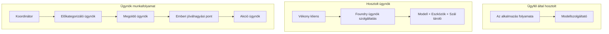
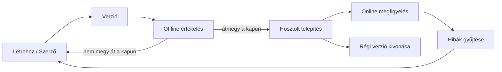
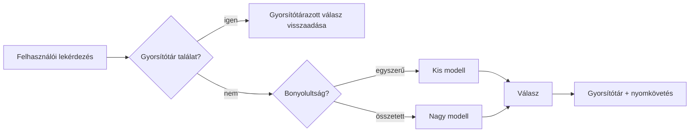
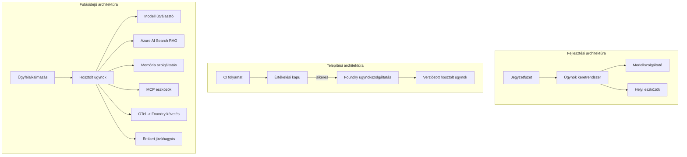

# Skálázható ügynökök telepítése a Microsoft Foundryval


Eddig a kurzus során olyan ügynököket építettél, amelyek a laptopodon futnak, egy jegyzetfüzeten belül, `az login` és néhány környezeti változó vezérlésével. Ez pontosan a megfelelő módja a tanulásnak. Nem ez a megfelelő módja annak, hogy olyan ügynököt fuss, amelyre több ezer ügyfél támaszkodik hajnali 3-kor.

Ez a lecke arról szól, hogy mi a különbség az „az én gépemen megy” és az „megy, megbízhatóan és megfizethetően, élesben” között. Ezt a rést a **Microsoft Foundry** és a **Microsoft Foundry Agent Service** segítségével zárjuk le, és ezt egy valódi ügyfélszolgálati ügynök felépítésével tesszük, amely eszközökkel, lekérdezéssel, memóriával, értékeléssel és megfigyeléssel rendelkezik.

## Bevezetés

Ez a lecke az alábbiakat fedi le:

- A **prototípus ügynök** és a **telepített ügynök** közötti különbség, és hogy a váltás főként a modell *körül* lévő mindenről szól.
- Ügynökök **telepítési mintái**: kliens-gazdálkodás, szolgáltatás-gazdálkodás (Hosted Agents) és munkafolyamat-vezérelt.
- Az **ügynök életciklusa** a Microsoft Foundry-n — létrehozás, verziózás, telepítés, értékelés, megfigyelés, nyugdíjazás.
- **Skálázási stratégiák**: modell irányítás, gyorsítótárazás, párhuzamosság és állapotmentes tervezés.
- **Megfigyelhetőség** OpenTelemetry és Foundry nyomkövetéssel.
- **Költségoptimalizálás** modellválasztáson, irányításon és értékelési kapukon keresztül.
- **Vállalati megfontolások**: irányítás, emberi jóváhagyás, és az MCP szerverek biztonságos futtatása éles környezetben.

## Tanulási célok

A lecke elvégzése után tudni fogod, hogyan:

- Válassz a megfelelő telepítési mintát adott ügynöki munkaterheléshez.
- Telepíts egy ügynököt a Microsoft Foundry Agent Service-be, hogy verziózott, felügyelt és megfigyelhető legyen.
- Műszerezz egy ügynököt nyomkövetésre, és kösd össze egy értékelési lánccal, amely minden kiadás előtt lefut.
- Alkalmazz modell irányítást és gyorsítótárazást, hogy méretezéskor is kontroll alatt tartsd a késleltetést és a költséget.
- Adj emberi jóváhagyási kaput magas kockázatú műveletekhez, és integrálj MCP szervert éles, biztonságos módon.

## Előfeltételek

Ez a lecke feltételezi, hogy elvégezted a korábbi leckéket, és magabiztos vagy:

- Ügynökök építése a [Microsoft Agent Framework](../14-microsoft-agent-framework/README.md) (14. lecke) segítségével.
- [Eszközhasználat](../04-tool-use/README.md) (4. lecke) és [Agentic RAG](../05-agentic-rag/README.md) (5. lecke).
- [Ügynök memória](../13-agent-memory/README.md) (13. lecke) és [Agentic Protocols / MCP](../11-agentic-protocols/README.md) (11. lecke).
- [Megfigyelhetőség és értékelés](../10-ai-agents-production/README.md) (10. lecke) — erre épít közvetlenül ez a lecke.

Szükséged lesz még:

- Egy **Azure előfizetésre** és egy **Microsoft Foundry projektre** legalább egy telepített csevegőmodelllel.
- Hitelesített **Azure CLI**-re (`az login`).
- Python 3.12+-ra és a tárházban található [`requirements.txt`](../../../requirements.txt) csomagokra.

## A prototípustól az éles környezetig: mi változik valójában

Egy prototípus ügynök és egy éles ügynök ugyanazt az alapvető ciklust futtatja — érvelés, eszközök meghívása, válaszadás. Ami változik, az a ciklus köré csomagolt minden más. A modell talán az éles ügynök 20%-a; a másik 80% az operációs váz.

| Szempont | Prototípus | Éles |
| --- | --- | --- |
| **Futás helye** | A jegyzetfüzetedben fut | Hosztolt szolgáltatásként fut, verziózott és kiterjesztett |
| **Azonosítás** | A te `az login` tokened | Kezelt identitás korlátozott RBAC-kal |
| **Állapot** | Memóriában, újraindításkor elveszik | Kívül tárolt (thread store, memória szolgáltatás) |
| **Hiba** | Te látod a hívási visszakövetést | Újrapróbálkozások, tartalék megoldások, dead-letter, riasztások |
| **Költség** | „Pár cent” | Kérésenként nyomon követett, irányított, gyorsítótárazott, költségvetett |
| **Minőség** | Megnézed a kimenetet | Minden kiadás előtt automatikusan értékelve |
| **Bizalom** | Minden műveletet te hagysz jóvá | Szabályzat + emberi felügyelet kockázatos műveleteknél |

Tartsd észben ezt a táblázatot. Az alábbi szakaszok mindegyike ezek közül az egyik sort oldalazza.

## Ügynök telepítési minták

Három mintát fogsz használni, gyakran kombinációban.

### 1. Kliens-gazdálkodású ügynökök

Az ügynök objektum *a te* alkalmazásod folyamatán belül él. A kódod közvetlenül hívja a modell szolgáltatót; az érvelési ciklus a szolgáltatásodban fut. Ezt használtuk minden korábbi leckében.

- **Használd akkor, ha** teljes irányítást szeretnél a ciklus felett, egyedi köztes szoftvert, vagy az ügynököt egy meglévő backendbe ágyazod.
- **Árnyoldal**: a skálázást, állapotot és ellenálló képességet magadnak kell kezelned.

### 2. Hosztolt ügynökök (Foundry Agent Service)

Az ügynök *erőforrásként regisztrált* a Microsoft Foundryban. A Foundry futtatja az érvelési ciklust, tárolja a szálakat, érvényesíti a tartalom biztonságot és az RBAC-ot, valamint láthatóvá teszi az ügynököt a Foundry portálon. Az alkalmazásod egy vékony klienssé válik, amely szálakat hoz létre és olvassa a válaszokat.

- **Használd akkor, ha** tartósságot, beépített megfigyelhetőséget, irányítást és kisebb üzemeltetési felületet szeretnél.
- **Árnyoldal**: kevesebb alacsony szintű irányítás egy menedzselt futtatókörnyezetért cserébe.

### 3. Ügynök munkafolyamatok

Több ügynök (és eszköz) összeáll egy gráffá explicit vezérlési árammal — szekvenciális lépések, elágazások, emberi jóváhagyási pontok és tartós ellenőrzőpontok, amelyek szüneteltethetők és folytathatók. Ez a Microsoft Agent Framework **Workflows** képességének alkalmazása telepítési méretben.

- **Használd akkor, ha** egyetlen feladat több speciális ügynököt foglal magában vagy jóváhagyási lépést igényel a folyamat közepén.
- **Árnyoldal**: több mozgó alkatrész; felügyeleti szintű megfigyelhetőséget igényel.



## Ügynök életciklusa a Microsoft Foundry-n

Az ügynök telepítése nem egyszeri `push`. Ez egy ciklus, amely nagyban hasonlít egy szoftver kiadási körforgásra, mert pontosan az.



A fő ötlet, amely átvételre került a [10. leckéből](../10-ai-agents-production/README.md): **az offline értékelés kapu, nem utólagos gondolat.** Egy új ügynök verzió nem kerül kiadásra, amíg nem teljesíti az értékelési küszöböket. Az online megfigyelés pedig valódi hibákat táplál vissza az offline tesztkészletedbe. Ez az egész ciklus.

## Skálázási stratégiák

Egy ügynök skálázása eltér az állapotmentes web API skálázásától, mert minden kérés több drága modell- és eszközhívást indíthat el. Négy technika viszi a terhelés nagy részét.

**Állapotmentes kéréskezelés.** Ne tarts minden felhasználói állapotot a folyamat memóriájában. Tárold a beszélgetési szálakat a Foundry szál tárolóban vagy egy memória szolgáltatásban, hogy bármelyik példány kezelhessen bármilyen kérést. Ez teszi lehetővé a vízszintes skálázást — adj példányokat, nem szükséges ragadós munkamenet.

**Modell irányítás.** Nem minden kérés igényli a legképzettebb (és legdrágább) modell használatát. Egyszerű kéréseket — szándék osztályozás, rövid ténybeli válaszok — irányíts egy kis, gyors modellhez, és tartsd fenn a nagy modellt valódi érveléshez. A Foundry **Model Router** ezt megteszi helyetted, vagy te is megvalósíthatsz egy könnyű osztályozót. A laborban elkészítjük a csináld magad verziót.

**Válasz gyorsítótárazás.** Sok ügyféltámogatási kérdés majdnem azonos („hogyan állíthatom vissza a jelszavam?”). Gyorsítótárazd a gyakori kérdésekre adott válaszokat, és szolgáld ki azokat anélkül, hogy a modellt elérnéd. Még egy szerény gyorsítótár találati arány is jelentősen csökkenti a költséget és késleltetést.

**Párhuzamosság és vissznyomás.** A modell szolgáltatóknak sebességkorlátjaik vannak. Korlátozd a párhuzamosságot, használj exponenciális visszalépéssel próbálkozást újra, és hibakezelj szépen (egy sorban álló „dolgozunk rajta” válasz jobb, mint egy 500-as hiba).



## Megfigyelhetőség éles környezetben

Nem tudsz működtetni olyat, amit nem látsz. Ahogy a 10. leckében tárgyaltuk, a Microsoft Agent Framework natív módon küld **OpenTelemetry** nyomkövetéseket — minden modellhívás, eszköz használat és koordinációs lépés egy span lesz. Éles környezetben ezeket a spanokat exportálod a Microsoft Foundryba (vagy bármely OTel-kompatibilis háttérbe), hogy:

- Nyomon kövesd egyetlen ügyfél panaszát végig minden modell- és eszközhíváson keresztül.
- Figyeld az p50/p95 késleltetést és költséget kérelemenként időben.
- Riasztást küldj hibaarány hirtelen növekedésére és költséganomáliákra, mielőtt a felhasználók (vagy a pénzügyi csapat) észrevennék.

```python
from agent_framework.observability import get_tracer

tracer = get_tracer()

with tracer.start_as_current_span("support_request") as span:
    span.set_attribute("customer.tier", "enterprise")
    span.set_attribute("routed.model", "gpt-4.1-mini")
    # az ügynök végrehajtása automatikusan nyomon követve ebben a tartományban
```

Olyan attribútumok mint a `customer.tier` és `routed.model` azok, amelyek egy csomó nyomkövetést válthatnak válaszolható kérdésekké („jut-e az üzleti ügyfelek túl gyakran a kis modellhez?”).

## Költségoptimalizálás

Az éles ügynökök költségeit főként a tokenek határozzák meg. Három kartell, hatásuk sorrendjében:

1. **Megfelelő méretű modell.** Egy kicsi modell, amely átmegy az értékelési kapun, szinte mindig olcsóbb, mint egy nagy, amely szintén átmegy. Használd az értékelést arra, hogy *bizonyítsd*, a kicsi modell elég jó, ahelyett, hogy automatikusan a legnagyobbat választanád elővigyázatosságból.
2. **Irányítás bonyolultság szerint.** Ahogy fent — nagy modelldíjat csak azokért a kérelmekért fizess, amelyek nagy modell érvelést igényelnek.
3. **Aggresszív gyorsítótárazás.** A legolcsóbb modellhívás az, amelyiket soha nem kell meghívni.

Az értékelési kapuk és a költségkontroll ugyanannak a fegyelemnek a két oldala: az értékelés megadja a *minőségi alsó határt*, az irányítás és a gyorsítótárazás pedig segít, hogy a költségek ennek az alsó határnak minél közelebb legyenek.

## Vállalati telepítési megfontolások

**Irányítás.** A hosztolt ügynökök öröklik a Foundry RBAC-ját, tartalombiztonságát és audit naplózását. Adj mindegyiknek kezelt identitást, amely a legkevesebb jogosultsággal bír — csak olvasási hozzáférés a tudásbázishoz, korlátozott hozzáférés a jegykezelő API-hoz, semmi több.

**Emberi jóváhagyás.** Egyes műveletek túl fontosak ahhoz, hogy automatikusan végezd el őket — visszatérítés kiadása, fiók törlése, jogi csapathoz léptetés. A Microsoft Agent Framework támogatja az **jóváhagyást igénylő** eszközöket: az ügynök javasolja a műveletet, a végrehajtás szünetel, egy ember jóváhagyja vagy visszautasítja, és a munkafolyamat folytatódik. Ezt láttad az [6. leckében](../06-building-trustworthy-agents/README.md); itt telepíted.

**MCP élesben.** Az [MCP](../11-agentic-protocols/README.md) lehetővé teszi, hogy az ügynök külső eszközöket fogyasszon szabványos interfészen keresztül. Élesben minden MCP szervert megbízhatatlan határként kezelj: rögzítsd a szerver verzióját, futtasd korlátozott identitással, validáld a kimeneteket, és sose ossz meg vele titkokat. Egy MCP szerver függőség, amit javítanak, auditálnak és sebességkorlátoznak.



Ezek a három diagram — fejlesztés, telepítés, futásidő — ugyanaz az ügynök életének három szakaszában. A következő labor végigvisz a felépítésén.

## Gyakorlati labor: Élesre kész ügyfélszolgálati ügynök

Nyisd meg a [`code_samples/16-python-agent-framework.ipynb`](./code_samples/16-python-agent-framework.ipynb) fájlt és dolgozd végig lépésről lépésre. Összeállítasz egy **Contoso ügyfélszolgálati ügynököt** minden éles környezetben szükséges funkcióval:

1. **Eszköz hívások** — megrendelés állapot lekérdezése és támogatási jegyek nyitása.
2. **RAG** — válaszolj szabályzati kérdésekre egy tudásbázisból (Azure AI Search, memóriából visszaesést biztosítva, hogy a jegyzetfüzet Search erőforrás nélkül is fusson).
3. **Memória** — emlékezz az ügyfélre a beszélgetés fordulói között.
4. **Modell irányítás** — egy bonyolultság osztályozó kis vagy nagy modellhez irányítja a kéréseket.
5. **Válasz gyorsítótárazás** — az ismétlődő kérdések gyorsítótárból szolgálódnak.
6. **Emberi jóváhagyás** — visszatérítés a küszöb fölött emberi jóváhagyásra vár.
7. **Értékelési pipeline** — egy kis offline tesztkészlet pontozza az ügynököt és kiadási kapuként működik.
8. **Megfigyelhetőség** — OpenTelemetry nyomkövetés minden kérés körül.

### Áttekintés

A jegyzetfüzet úgy van szervezve, hogy minden éles környezetbeli szempont egy önállóan futtatható szakasz legyen. A központi elem a routing-plus-caching kéréskezelő:

```python
async def handle_support_request(query: str, customer_id: str) -> str:
    # 1. Szolgáljunk ki gyorsítótárból, amikor csak lehet.
    cached = response_cache.get(normalize(query))
    if cached:
        return cached

    # 2. Útválasztás komplexitás szerint a költségek szabályozására.
    model = "gpt-4.1-mini" if is_simple(query) else "gpt-4.1"

    # 3. Futtassuk az ügynököt egy trace span belsejében az észlelhetőség érdekében.
    with tracer.start_as_current_span("support_request") as span:
        span.set_attribute("routed.model", model)
        span.set_attribute("customer.id", customer_id)
        response = await support_agent.run(query, model=model)

    # 4. Gyorsítótárazás és visszaadás.
    response_cache.set(normalize(query), response.text)
    return response.text
```

A kiadást védő értékelési kapu így néz ki:

```python
async def evaluation_gate(agent, test_cases, threshold: float = 0.8) -> bool:
    passed = 0
    for case in test_cases:
        result = await agent.run(case["input"])
        if score_response(result.text, case["expected"]) >= 0.8:
            passed += 1
    pass_rate = passed / len(test_cases)
    print(f"Evaluation pass rate: {pass_rate:.0%} (gate: {threshold:.0%})")
    return pass_rate >= threshold  # csak akkor telepíts, ha a kapu átmegy
```

Olvasd el sorra — a jegyzetfüzet szándékosan kicsi primitivumokat tartalmaz, hogy semmi ne legyen elrejtve egy keretrendszer hívás mögött.

## Telepített ügynök validálása smoke tesztekkel

A fenti értékelési kapu *offline* fut az ügynök objektumodon. Miután az ügynök Hosted Agentként telepítve van, még egy olcsóbb ellenőrzés szükséges: **válaszol-e ténylegesen a telepített végpont?**

Egy „sikeres” telepítés csak azt bizonyítja, hogy a vezérlési sík elfogadta a definíciót — nem igazolja, hogy az ügynök válaszol. Egy hiányzó függőség, rossz modell irányítás vagy lejárt kapcsolat olyan zöld telepítést eredményezhet, amely nem ad vissza semmit. Egy **smoke teszt** ezt másodpercek alatt felismeri minden telepítéskor, a teljes értékelés költsége nélkül.

Ez a tárház egy kész smoke-teszt pipeline-t szállít, amely az [AI Smoke Test](https://github.com/marketplace/actions/ai-smoke-test) GitHub Action-re épül:

- **Katalógus** — a [`tests/lesson-16-smoke-tests.json`](../../../tests/lesson-16-smoke-tests.json) tartalmazza a Contoso ügyfélszolgálati ügynökhöz tartozó promptokat és állításokat (alapokul szolgáló szabályzati válaszok, rendelés lekérdezés, témán maradás, többszörös beszélgetési szál folytonosság). Más leckék ügynökeinek katalógusai is a közelben élnek — lásd a [`tests/README.md`](../tests/README.md).
- **Munkafolyamat** — a [`.github/workflows/smoke-test.yml`](../../../.github/workflows/smoke-test.yml) bejelentkezik Azure OIDC-vel és POST-olja az összes promptot az ügynök Responses végpontjára, és bármely állítás hibánál sikertelenként jelzi a futást.

```yaml
- name: Smoke-test hosted agent
  uses: JFolberth/ai-smoketest@v1
  with:
    project_endpoint: ${{ inputs.project_endpoint }}
    agent_name: ContosoSupportAgent
    tests_file: tests/lesson-16-smoke-tests.json
```


Futtassa az **Actions** fülről, miután az ügynöke telepítve lett, megadva a Foundry projekt végpontját és az ügynök nevét. A federált identitásnak a **Azure AI User** szerepkörrel kell rendelkeznie a Foundry projekten belül. A rétegeket piramisként képzelje el: a füsttesztek (elérhető és válaszol?) minden telepítésnél lefutnak, az offline értékelés (elég jó a kiadáshoz?) a promóció előtt, és az online értékelés (hogy teljesít a valós környezetben?) folyamatosan fut.

## Tudásfelmérés

Tesztelje megértését, mielőtt továbblép a feladatra.

**1. Körülbelül mekkora része a termelési ügynöknek maga a „modell”, és mi a többi?**

<details>
<summary>Válasz</summary>

A modell a rendszer kisebbsége — általában körülbelül 20%-ra teszik. A többi az üzemeltetési váz: hosztolás és verziókezelés, identitás és RBAC, külső állapotkezelés, hibatűrés, költségkövetés, értékelés és emberi beavatkozásos vezérlés. A termelésbe lépés elsősorban a gondolkodási ciklus *köré* épített összes elem megépítéséről szól.
</details>

**2. Mikor választaná a Hosted Agent-et egy kliensoldalon futó ügynök helyett?**

<details>
<summary>Válasz</summary>

Amikor egy kezelt futtatókörnyezetet szeretne beépített tartóssággal (folyamatok, amelyek fennmaradnak és folytathatók), megfigyelhetőséggel, tartalombiztonsággal és RBAC-kal, és hajlandó egy kis alacsony szintű vezérlésről lemondani a gondolkodási ciklus felett a kevesebb üzemeltetési felület érdekében. A kliensoldali futtatás preferált, ha teljes körű vezérlésre van szükség a ciklus fölött, vagy ha az ügynököt egy meglévő backendbe ágyazza be.
</details>

**3. Miért kell a skálázható ügynöknek állapotmentesnek lennie a saját folyamati memóriájában?**

<details>
<summary>Válasz</summary>

Így bármelyik példány képes kezelni bármelyik kérelmet, ami lehetővé teszi a vízszintes skálázást ragadós munkamenetek nélkül. A felhasználónkénti beszélgetési állapotot egy szálbolt vagy memória szolgáltatás kezeli külsőleg. Ha az állapot a folyamat memóriájában lenne, újraindításkor elveszne, és nem tudná szabadon elosztani a terhelést.
</details>

**4. Milyen problémát old meg a modellirányítás, és hogyan kapcsolódik az értékeléshez?**

<details>
<summary>Válasz</summary>

Az irányítás egyszerű kéréseket küld egy kicsi, olcsó, gyors modellhez, és a nagy modellt a valódi gondolkodásra tartja fenn, ezzel szabályozva a válaszidőt és a költséget. Kapcsolódik az értékeléshez, mert az értékelés igazolja, hogy a kis modell elég jó egy adott típusú kérésre — az irányítás értékelés nélkül csak találgatás.
</details>

**5. Mi az „értékelési kapu”, és hol helyezkedik el az életciklusban?**

<details>
<summary>Válasz</summary>

Egy értékelési kapu lefuttat egy offline tesztkészletet az új ügynökverzión, és megakadályozza a telepítést, hacsak az áteresztési arány nem haladja meg a küszöböt. Az életciklusban a „verzió” és a „telepítés” között helyezkedik el, mintegy feltételként kezelve a minőséget a kiadás előtt, nem pedig utána ellenőrizve.
</details>

**6. Miért kell az MCP szervert megbízhatatlan határnak tekinteni éles környezetben?**

<details>
<summary>Válasz</summary>

Mert külső függőség, amelyet az ügynöke hív meg. Rögzítenie kell a verzióját, egy korlátozott identitással kell futtatnia, validálnia kell a kimeneteit, korlátoznia kell az igénybevételt, és soha nem szabad titkokat megosztania vele — ugyanazon fegyelem alatt, amelyet bármely harmadik féltől származó függőség esetén alkalmaz. A kimenetei befolyásolják az ügynök gondolkozását, így az érvénytelenített bizalom biztonsági kockázat.
</details>

**7. Melyik egyetlen változtatásnak van általában a legnagyobb hatása a termelési ügynök költségére, és miért?**

<details>
<summary>Válasz</summary>

A modell méretének megfelelő beállítása — a lehető legkisebb modell használata, amely még átmegy az értékelési kapun. A költségeket főként a tokenek befolyásolják, és egy kisebb modell, amely megfelel a minőségi követelménynek, szinte mindig olcsóbb, mint egy nagyobb. A gyorsítótárazás és az irányítás további költségcsökkentést eredményez, de a megfelelő alapmodell kiválasztása a legnagyobb közvetlen hatás.
</details>

**8. Milyen szerepet játszanak az olyan span attribútumok, mint a `customer.tier` és `routed.model` a megfigyelhetőségben?**

<details>
<summary>Válasz</summary>

Nyers részletezésekből válaszolható üzleti kérdéseket tesznek lehetővé. Attribútumok nélkül egy falnyi spanja van; attribútumokkal megkérdezheti, „túl gyakran irányítják-e az vállalati ügyfeleket a kis modellhez?” vagy „melyik modell kezeli a leglassabb kéréseinket?” Az attribútumok azok az adatok, amelyek mentén a telemetriát a működéshez fontos dimenziókra bontja.
</details>

## Feladat

Vegye a laborból a ügyféltámogató ügynököt, és erősítse meg egy adott forgatókönyvhez: **egy előfizetéses számlázási támogatási ügynök egy SaaS cég számára.**

A beadásnak tartalmaznia kell:

1. **Cserélje le az eszközöket** számlázáshoz relevánsakra: `get_subscription_status`, `get_invoice` és `issue_credit` (50 dollár feletti jóváírás emberi jóváhagyást igényel).
2. **Adjon hozzá három RAG dokumentumot** a cég visszatérítési, számlázási ciklus és lemondási szabályzatáról.
3. **Bővítse az értékelési készletet** legalább nyolc esetre, beleértve legalább kettőt, amelyek *meg kell, hogy indítsák* az emberi jóváhagyási útvonalat, és igazolja, hogy az értékelési kapu helyesen enged vagy tilt el.
4. **Adjon hozzá egy költségjelentést**: tíz vegyes lekérdezés lefuttatása után az ügynökön keresztül írja ki, hány került a kis modellhez, hány a nagyhoz, és hány volt gyorsítótárazott.

Írjon egy rövid bekezdést (markdown cellában), amely elmagyarázza, melyik modell-irányítási szabályt választotta, és hogyan validálná azt valós forgalommal. Nincs egyetlen helyes válasz — az értékelés azon lesz, hogy koherensen kapcsolja-e össze a termelési szempontokat.

## Összefoglaló

Ebben a leckében egy ügynököt mozgatta prototípusról termelésbe a Microsoft Foundry segítségével:

- A termelésbe lépés főként a modell körüli **üzemeltetési vázról** szól — hosztolás, identitás, állapot, hibatűrés, költség, minőség és bizalom.
- Megtanulta a három **telepítési mintát** — kliensoldali futtatás, Hosted Agentek és Agent Workflows — és mikor melyik a megfelelő.
- Végigjárta az **ügynök életciklust**, ahol az offline **értékelés kiadási kapuként** működik, az online megfigyelhetőség pedig visszacsatolja a hibákat a tesztkészletbe.
- Alkalmazta a **skálázási stratégiákat** — állapotmentesség, modell-irányítás, gyorsítótárazás és korlátozott párhuzamosság — és összekapcsolta őket a **költséghatékonysággal**.
- Beépítette az **vállalati vezérlőket**: RBAC, emberi beavatkozásos jóváhagyás és termelésbiztos MCP integráció.
- Készített egy **termelésre kész ügyféltámogató ügynököt**, amely mindezeket a szempontokat futtatható kóddá fonja össze.

A következő lecke az ellenkező utat járja be: ahelyett, hogy az ügynököket a felhőbe skálázná, *lehozza* azokat egyetlen fejlesztői gépre, és teljesen lokálisan futtatja.

## További források

- <a href="https://learn.microsoft.com/azure/ai-foundry/what-is-azure-ai-foundry" target="_blank">Microsoft Foundry dokumentáció</a>
- <a href="https://learn.microsoft.com/azure/ai-foundry/agents/overview" target="_blank">Microsoft Foundry Agent Service áttekintés</a>
- <a href="https://aka.ms/ai-agents-beginners/agent-framework" target="_blank">Microsoft Agent Framework</a>
- <a href="https://learn.microsoft.com/azure/ai-foundry/concepts/model-router" target="_blank">Modellirányító a Microsoft Foundry-ban</a>
- <a href="https://learn.microsoft.com/azure/search/search-what-is-azure-search" target="_blank">Azure AI Search</a>
- <a href="https://opentelemetry.io/" target="_blank">OpenTelemetry</a>
- <a href="https://github.com/marketplace/actions/ai-smoke-test" target="_blank">AI Smoke Test GitHub Action</a>
- <a href="https://modelcontextprotocol.io/" target="_blank">Model Context Protocol (MCP)</a>

## Előző lecke

[Számítógép-használati ügynökök építése (CUA)](../15-browser-use/README.md)

## Következő lecke

[Lokális MI ügynökök létrehozása](../17-creating-local-ai-agents/README.md)

---

<!-- CO-OP TRANSLATOR DISCLAIMER START -->
**Jogi nyilatkozat**:
Ez a dokumentum az AI fordítási szolgáltatás, a [Co-op Translator](https://github.com/Azure/co-op-translator) segítségével készült. Bár az pontosságra törekszünk, kérjük, vegye figyelembe, hogy az automatikus fordítások hibákat vagy pontatlanságokat tartalmazhatnak. Az eredeti dokumentum az anyanyelvén tekintendő hiteles forrásnak. Fontos információk esetén professzionális emberi fordítást javasolunk. Nem vállalunk felelősséget semmilyen félreértésért vagy téves értelmezésért, amely ebből a fordításból ered.
<!-- CO-OP TRANSLATOR DISCLAIMER END -->