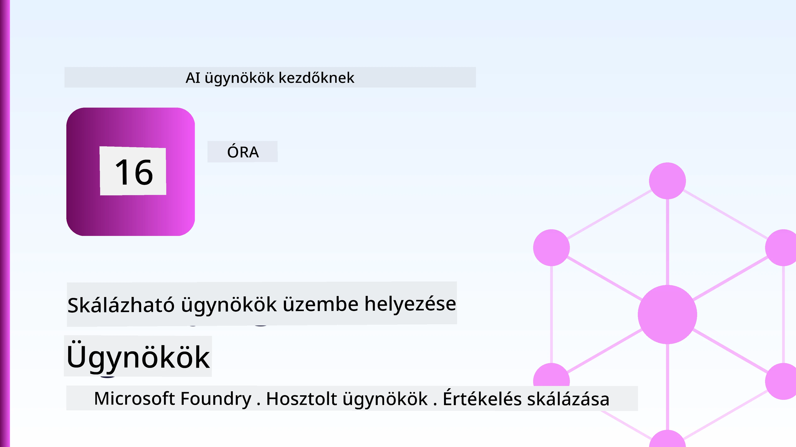
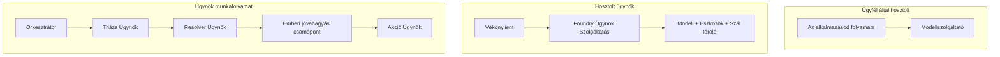
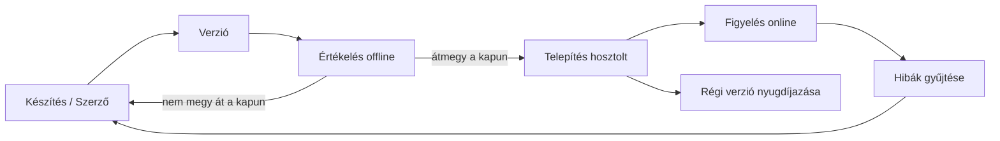
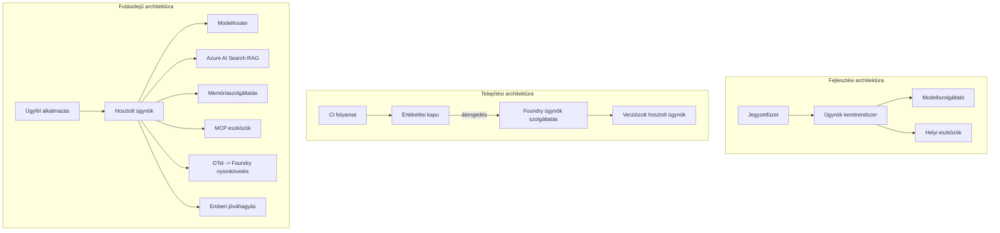

# Skálázható ügynökök telepítése a Microsoft Foundry-val



Eddig a kurzus során olyan ügynököket építettél, amelyek a laptopodon, egy jegyzetfüzetben futnak, `az login` és néhány környezeti változó segítségével irányítva. Ez pontosan a helyes módja a tanulásnak. Nem ez a megfelelő módja annak, hogy egy olyan ügynök fusson, amelyen több ezer ügyfél 3 órakor a hajnalban is múlik.

Ez a lecke az "az én gépemen működik" és az "üzembiztosan és megfizethetően működik a termelésben" közötti szakadékról szól. Ezt a szakadékot a **Microsoft Foundry** és a **Microsoft Foundry Agent Service** használatával hidaljuk át, és egy valódi ügyfélszolgálati ügynököt építünk, amely eszközökkel, adatlekéréssel, memóriával, értékeléssel és felügyelettel rendelkezik.

## Bevezetés

Ez a lecke az alábbiakat fogja lefedni:

- A **prototípus ügynök** és a **telepített ügynök** közötti különbség, és hogy a váltás főként a modell *körüli* tényezőkről szól.
- Ügynökök számára kialakított **telepítési minták**: kliens által hosztolt, szolgáltatás által hosztolt (Hosted Agents) és munkafolyamat-irányított.
- A Microsoft Foundry-n futó **ügynök életciklusa** — létrehozás, verziózás, telepítés, értékelés, megfigyelés, selejtezés.
- **Skálázási stratégiák**: modell útválasztás, gyorsítótárazás, egyidejűség és állapotmentes tervezés.
- **Megfigyelhetőség** az OpenTelemetry és a Foundry követés révén.
- **Költségoptimalizálás** modellválasztással, útválasztással és értékelési kapukkal.
- **Vállalati szempontok**: irányítás, emberi jóváhagyás és MCP szerverek biztonságos üzemeltetése termelésben.

## Tanulási célok

A lecke elvégzése után tudni fogod, hogyan:

- Válaszd ki a megfelelő telepítési mintát az adott ügynök munkaterheléshez.
- Telepíts egy ügynököt a Microsoft Foundry Agent Service-re, hogy verziózott, ellenőrzött és megfigyelhető legyen.
- Mérd föl az ügynököt a követéshez, és állíts be egy értékelő folyamatot, amely minden kiadás előtt lefut.
- Alkalmazz modell útválasztást és gyorsítótárazást, hogy skálázáskor kontroll alatt tartsd a késleltetést és a költséget.
- Adj hozzá emberi jóváhagyási kaput magas kockázatú műveletekhez, és építs be egy MCP szervert termelésbiztos módon.

## Előfeltételek

Ez a lecke feltételezi, hogy elvégezted a korábbi leckéket, és kényelmesen mozogsz a következőkben:

- Ügynökök építése a [Microsoft Agent Framework](../14-microsoft-agent-framework/README.md) segítségével (14. lecke).
- [Eszközhasználat](../04-tool-use/README.md) (4. lecke) és [Agentic RAG](../05-agentic-rag/README.md) (5. lecke).
- [Agent memória](../13-agent-memory/README.md) (13. lecke) és [Agentic Protokollok / MCP](../11-agentic-protocols/README.md) (11. lecke).
- [Megfigyelhetőség és értékelés](../10-ai-agents-production/README.md) (10. lecke) — erre a leckére ez közvetlenül épít.

Emellett szükséged lesz:

- Egy **Azure előfizetésre** és egy **Microsoft Foundry projektre**, amelyen legalább egy telepített chat modell fut.
- Az **Azure CLI** hitelesített (`az login`).
- Python 3.12+ és a tárolóban lévő [`requirements.txt`](../../../requirements.txt) csomagjai.

## A prototípustól a termelésig: mi változik valójában

Egy prototípus ügynök és egy termelési ügynök ugyanazt az alapvető vezérlési ciklust használja — gondolkodik, eszközöket hív, válaszol. Ami változik, az az a környezet, ami ezt a ciklust körbeveszi. A modell talán a termelési ügynök 20%-a; a maradék 80% az üzemeltetési váz.

| Téma | Prototípus | Termelés |
| --- | --- | --- |
| **Hosztolás** | A jegyzetfüzetedben fut | Hosztolt szolgáltatásként, verziózva és kiterjesztve fut |
| **Azonosítás** | A `az login` tokened | Kezelt identitás korlátozott RBAC-kal |
| **Állapot** | Memóriában, újraindításkor elveszik | Külső tárolóban (thread store, memóriaszolgáltatás) |
| **Hiba** | Láthatod a traceback-et | Újrapróbálkozás, tartalék megoldások, dead-letter, riasztások |
| **Költség** | "Néhány cent" | Kérésenként nyomon követve, útválasztott, gyorsítótárazott, költségvetett |
| **Minőség** | Kézzel ellenőrzöd a kimenetet | Automatikusan értékelve minden kiadás előtt |
| **Bizalom** | Minden műveletet te hagysz jóvá | Szabályzat + emberi beavatkozás a kockázatos műveleteknél |

Tartsd szem előtt ezt a táblázatot. Az alábbi szakaszok mindegyike ezek közül az egyik sorra vonatkozik.

## Ügynök telepítési minták

Három mintát használsz, gyakran kombinálva.

### 1. Kliens által hosztolt ügynökök

Az ügynök objektuma a *te* alkalmazásfolyamatodban él. A kódod közvetlenül hívja a modell szolgáltatót; a gondolkodási ciklus a szolgáltatásodban fut. Ezt csinálta minden korábbi lecke.

- **Használd, ha** teljes kontrollt akarsz a ciklus felett, egyedi middleware-t, vagy az ügynököt egy meglévő backendbe ágyazod be.
- **Árnyoldala**: magad kezeled a skálázást, állapotot és az ellenállóságot.

### 2. Hosztolt ügynökök (Foundry Agent Service)

Az ügynök *regisztrált erőforrás* a Microsoft Foundry-ban. A Foundry futtatja a gondolkodási ciklust, tárolja a szálakat, érvényesíti a tartalombiztonságot és az RBAC-ot, és láthatóvá teszi az ügynököt a Foundry portálon. Az alkalmazásod egy vékony klienssé válik, amely szálakat hoz létre és olvassa a válaszokat.

- **Használd, ha** tartósságot, beépített megfigyelhetőséget, irányítást és kisebb üzemeltetési felületet szeretnél.
- **Árnyoldala**: kevesebb alacsony szintű kontroll egy menedzselt futtatási környezetért cserébe.

### 3. Ügynök munkafolyamatok

Több ügynök (és eszköz) egy gráfba szervezve, explicit vezérlési folyamattal — egymást követő lépések, elágazások, emberi jóváhagyási pontok, és tartós ellenőrzőpontok, amelyek szüneteltethetők és folytathatók. Ez a Microsoft Agent Framework **Workflows** képessége, alkalmazva telepítési skálán.

- **Használd, ha** egyetlen feladat több specializált ügynököt érint, vagy közbeiktatott jóváhagyás szükséges.
- **Árnyoldala**: több mozgó alkatrész; szükséges munkafolyamat-szintű megfigyelhetőség.



## Az ügynök életciklusa a Microsoft Foundry-n

Egy ügynök telepítése nem egyszeri `push`. Ez egy ciklus, amely nagyon hasonlít egy szoftverkiadási ciklusra, mert pontosan az.



A kulcsötlet, amit a [10. leckéből](../10-ai-agents-production/README.md) viszünk tovább: **az offline értékelés kapu, nem pedig utólagos gondolat.** Egy új ügynök verzió nem kerül kiadásra, ha nem teljesíti az értékelési küszöbödet. Az online megfigyelhetőség aztán a valós hibákat visszacsatolja az offline teszthalmazba. Ez a teljes ciklus.

## Skálázási stratégiák

Egy ügynök skálázása különbözik egy állapotmentes web API skálázásától, mert minden kérés több drága modell- és eszközhívást is indíthat. Négy technika viszi a terhelés nagy részét.

**Állapotmentes kérések kezelése.** Ne tárolj egyéni állapotot a folyamataid memóriájában. A beszélgetési szálakat a Foundry szál-tárolóban vagy egy memóriaszolgáltatásban tárold, hogy bármely példány kezelni tudja bármelyik kérést. Ez teszi lehetővé a vízszintes skálázást — példányokat hozzáadva, nincs ragadós munkamenet.

**Modell útválasztás.** Nem minden kérés igényli a legképesebb (és legdrágább) modellt. Egyszerű kéréseket — szándékosztályozás, rövid tényszerű válaszok — irányíts egy kis, gyors modellhez, és a nagy modellt tartogasd az igazi gondolkodásra. A Foundry **Model Router** ezt elvégzi helyetted, vagy te magad is készíthetsz egy könnyű osztályozót. A tanműhelyben a saját verziódat építed meg.

**Válasz gyorsítótárazás.** Sok ügyfélszolgálati kérdés közel azonos ("hogyan állíthatom vissza a jelszavam?"). Gyorsítótározd a gyakori kérdések válaszait, és szolgáld ki őket anélkül, hogy a modellt meg kellene hívni. Egy szerény gyorsítótár-teljesítmény is jelentősen csökkenti a költségeket és a késleltetést.

**Egyidejűség és vissznyomás.** A modell szolgáltatóknak korlátozott a hívássebességük. Határozd meg az egyidejűséget, használj exponenciális visszatartással próbálkozó újrapróbálkozásokat, és bukj el méltósággal (egy sorba állított „dolgozunk rajta” válasz jobb, mint egy 500-as).


## Megfigyelhetőség termelésben

Amit nem látsz, azt nem tudod üzemeltetni. Ahogy a 10. leckében lefedtük, a Microsoft Agent Framework natívan bocsát ki **OpenTelemetry** követéseket — minden modellhívás, eszközmeghívás és koordinációs lépés egy terjedelmet (span) képez. Termelésben ezeket a terjedelemeket a Microsoft Foundry-ba (vagy bármely OTel-kompatibilis háttérbe) exportálod, hogy:

- Végigkövesd egyetlen ügyfél panaszát az összes modell- és eszközhíváson keresztül.
- Figyeld az időbeli p50/p95 késleltetést és kérésekre jutó költséget.
- Riasztásokat állíts be hibaarány csúcsokra és költség anomáliákra még azelőtt, hogy a felhasználók (vagy a pénzügyi csapat) észrevennék.

```python
from agent_framework.observability import get_tracer

tracer = get_tracer()

with tracer.start_as_current_span("support_request") as span:
    span.set_attribute("customer.tier", "enterprise")
    span.set_attribute("routed.model", "gpt-5-nano")
    # az ügynök végrehajtása automatikusan nyomon követett ezen a tartományon belül
```

Olyan attribútumok, mint `customer.tier` és `routed.model`, azok, amelyek a rengeteg követést kérdés-válaszokra alkalmas adatokká alakítják („túl gyakran jutnak a vállalati ügyfelek a kis modellhez?”).

## Költségoptimalizálás

A termelési ügynökök költségét elsősorban a tokenek határozzák meg. Három vezérlő, hatásuk sorrendjében:

1. **A modell megfelelő méretezése.** Egy kis modell, amely átmegy az értékelési kapudon, általában olcsóbb, mint egy nagy, amely szintén átmegy. Használd az értékelést arra, hogy *bizonyítsd*, a kis modell elég jó, ahelyett, hogy óvatosan a legnagyobb modellt választanád alapértelmezetten.
2. **Útváltás a komplexitás alapján.** Ahogy fentebb — a nagy modell árát csak azokért a kérésekért fizeted, amelyek ténylegesen nagy modell gondolkodást igényelnek.
3. **Agresszív gyorsítótárazás.** A legolcsóbb modellhívás az, amit soha nem teszel meg.

Az értékelési kapuk és a költségkontroll ugyanannak a fegyelemnek két nézőpontja: az értékelés mutatja a *minőségi padlót*, az útválasztás és gyorsítótárazás pedig segít a költségeket a padlóhoz közeli szinten tartani.

## Vállalati telepítési szempontok

**Irányítás.** A Hosztolt Ügynökök öröklik a Foundry RBAC-ját, tartalombiztonságát és naplózását. Mindegyik ügynök kapjon egy kezelt identitást a lehető legkisebb jogosultsággal — olvasási hozzáférést a tudásbázishoz, korlátozott hozzáférést a jegyrendszer API-jához, semmi többet.

**Emberi jóváhagyás.** Néhány művelet túlságosan következményes ahhoz, hogy teljesen automatizáljuk — visszatérítés kiadása, fiók törlése, jogi csoportnak való továbbítás. A Microsoft Agent Framework támogatja az **jóváhagyás-köteles** eszközöket: az ügynök javasolja a műveletet, a végrehajtás szünetel, emberi jóváhagyás vagy elutasítás történik, majd a munkafolyamat folytatódik. Ezt az alapot láttad a [6. leckében](../06-building-trustworthy-agents/README.md); itt telepíted.

**MCP termelésben.** Az [MCP](../11-agentic-protocols/README.md) lehetővé teszi, hogy az ügynök külső eszközöket szabványos interfészen keresztül használjon. Termelésben minden MCP szervert megbízhatatlan határértéknek kezelj: rögzítsd a szerver verziót, futtasd korlátozott identitással, validáld a kimeneteit, és soha ne adj át titkokat neki. Egy MCP szerver függőség, és a függőségeket javítani, auditálni és korlátozni kell.



Ezek a három diagram — fejlesztés, telepítés, futási idő — ugyanaz az ügynök élete három szakaszban. A következő tanműhelyen végigsétálsz a felépítésén.

## Gyakorlati tanműhely: Termelésre kész ügyfélszolgálati ügynök

Nyisd meg a [`code_samples/16-python-agent-framework.ipynb`](./code_samples/16-python-agent-framework.ipynb) fájlt, és dolgozd végig teljes egészében. Összeállítasz egy **Contoso ügyfélszolgálati ügynököt** minden termelési szempont beépítésével:

1. **Eszköz hívás** — rendelések állapotának lekérdezése és támogatási jegyek nyitása.
2. **RAG** — válaszadás szabályzati kérdésekre egy tudásbázisból (Azure AI Search, aminek van egy memóriabeli tartalék megoldása, hogy a jegyzetfüzet akkor is fusson, ha nincs Search erőforrás).
3. **Memória** — megjegyzi az ügyfelet a beszélgetés során.
4. **Modell útválasztás** — egy összetettség szerinti osztályozó irányítja a kéréseket kis vagy nagy modellhez.
5. **Válasz gyorsítótárazás** — ismétlődő kérdésekre gyorsítótárból válasz.
6. **Emberi jóváhagyás** — a visszatérítések egy küszöbérték felett emberi aláírás vár.
7. **Értékelési csatorna** — egy kis offline tesztkészlet pontozza az ügynököt és kiadási kapuként működik.
8. **Megfigyelhetőség** — OpenTelemetry követés minden kérés körül.

### Áttekintés

A jegyzetfüzet úgy van felépítve, hogy minden termelési szempont önálló, futtatható szakasz legyen. A lényege az útválasztással és gyorsítótárazással összekapcsolt kéréskezelő:

```python
async def handle_support_request(query: str, customer_id: str) -> str:
    # 1. Szolgáljuk ki gyorsítótárból, amikor csak lehet.
    cached = response_cache.get(normalize(query))
    if cached:
        return cached

    # 2. Bonyolultság alapján irányítsuk a költségek szabályozásához.
    model = "gpt-5-nano" if is_simple(query) else "gpt-5-mini"

    # 3. Fussunk az ügynökkel egy trace span-en belül az megfigyelhetőség érdekében.
    with tracer.start_as_current_span("support_request") as span:
        span.set_attribute("routed.model", model)
        span.set_attribute("customer.id", customer_id)
        response = await support_agent.run(query, model=model)

    # 4. Gyorsítótárazás és visszaadás.
    response_cache.set(normalize(query), response.text)
    return response.text
```

Az értékelési kapu, ami egy kiadást felügyel, így néz ki:

```python
async def evaluation_gate(agent, test_cases, threshold: float = 0.8) -> bool:
    passed = 0
    for case in test_cases:
        result = await agent.run(case["input"])
        if score_response(result.text, case["expected"]) >= 0.8:
            passed += 1
    pass_rate = passed / len(test_cases)
    print(f"Evaluation pass rate: {pass_rate:.0%} (gate: {threshold:.0%})")
    return pass_rate >= threshold  # csak akkor telepítsen, ha az kapu átmegy
```

Olvass el minden sort — a jegyzetfüzet a primitíveket szándékosan kicsiben tartja, hogy semmi ne legyen elrejtve egy keretrendszer hívás mögött.

## A telepített ügynök validálása smoke-teszttel

A fenti értékelési kapu *offline* fut az ügynök objektumon. Miután az ügynök Hosted Agent-ként telepítve van, még egy olcsóbb ellenőrzésre van szükség: **válaszol-e egyáltalán a telepített végpont?**

A „sikeres” telepítés csak azt bizonyítja, hogy a vezérlő sík elfogadta a definíciót — nem bizonyítja, hogy az ügynök válaszol. Hiányzó függőség, hibás modell útválasztás vagy lejárt kapcsolat egy zöld telepítést hagyhat hátra anélkül, hogy bármit adna vissza. Egy **smoke teszt** ezt néhány másodperc alatt elkapja, minden telepítéskor, a teljes értékelési költség nélkül.

Ez a tároló tartalmaz egy készen használható smoke-teszt folyamatot, amely az [AI Smoke Test](https://github.com/marketplace/actions/ai-smoke-test) GitHub Action-re épül:

- **Katalógus** — a [`tests/lesson-16-smoke-tests.json`](../../../tests/lesson-16-smoke-tests.json) tartalmaz promptokat és állításokat a Contoso ügyfélszolgálati ügynökhöz (konkrét szabályzati válaszok, rendelés lekérdezés, témához tartás és több lépéses szál folytonosság). Más leckék ügynökeinek katalógusai is itt vannak — lásd a [`tests/README.md`](../tests/README.md)-t.
- **Munkafolyamat** — a [`.github/workflows/smoke-test.yml`](../../../.github/workflows/smoke-test.yml) Azure OIDC-val jelentkezik be, és minden promptot POST-ol az ügynök Reponses végpontjára, bármely állítás elbukása esetén hibára állítja a folyamatot.

```yaml
- name: Smoke-test hosted agent
  uses: JFolberth/ai-smoketest@v1
  with:
    project_endpoint: ${{ inputs.project_endpoint }}
    agent_name: ContosoSupportAgent
    tests_file: tests/lesson-16-smoke-tests.json
```


Futtassa az **Actions** lapon, miután az ügynöke telepítve lett, megadva a Foundry projekt végpontját és az ügynök nevét. A federált identitásnak az **Azure AI User** szerepkörrel kell rendelkeznie a Foundry projekt hatókörében. Gondoljon a rétegekre úgy, mint egy piramisra: füsttesztek (elérhető és válaszol?) futnak minden telepítéskor, offline értékelés (elég jó-e a kiadásra?) fut a promóció előtt, és online értékelés (hogy teljesít a valós környezetben?) folyamatosan fut.

## Tudásellenőrzés

Tesztelje a megértését, mielőtt áttérne a feladatra.

**1. Körülbelül a termelési ügynök mekkora része a "modell", és mi a maradék?**

<details>
<summary>Válasz</summary>

A modell a rendszer kisebbsége — általában körülbelül 20%-ra becsülik. A maradék az üzemeltetési váz: hosztolás és verziókezelés, identitás és RBAC, extern állapot, hibakezelés, költségkövetés, értékelés és emberi beavatkozási pontok. A termelésbe lépés elsősorban arról szól, hogy mindent *a* gondolkodási kör *köré* építsünk.
</details>

**2. Mikor választana hosztolt ügynököt ügyfél hosztolta ügynök helyett?**

<details>
<summary>Válasz</summary>

Amikor egy kezelt futtatókörnyezetet szeretne beépített tartóssággal (szálak, amelyek fennmaradnak és újraindulhatnak), megfigyelhetőséggel, tartalombiztonsággal és RBAC-kal, és hajlandó lemondani valamennyi alacsony szintű kontrollról a gondolkodási kör felett a kisebb működési felületért cserébe. Az ügyfél hosztolta akkor előnyös, ha teljes kontrollra van szüksége a kör felett, vagy ha az ügynököt egy meglévő backendbe ágyazza.
</details>

**3. Miért kell egy skálázható ügynöknek állapotmentesnek lennie a saját folyamat memóriájában?**

<details>
<summary>Válasz</summary>

Így bármelyik példány feldolgozhat bármilyen kérést, ami lehetővé teszi a vízszintes skálázást ragadós munkamenet nélkül. A felhasználónkénti beszélgetési állapot külsőleg tárolódik szál tárhelyen vagy memóriaszolgáltatásban. Ha az állapot a folyamat memóriában lenne, újraindításkor elveszne, és nem lehetne szabadon elosztani a terhelést.
</details>

**4. Milyen problémát old meg a modellútválasztás, és hogyan kapcsolódik az értékeléshez?**

<details>
<summary>Válasz</summary>

Az útválasztás egyszerű kéréseket küld egy kicsi, olcsó, gyors modellnek, és a nagy modellt a valódi következtetésekre tartja fenn, ezzel szabályozva mind a késleltetést, mind a költséget. Az értékeléssel kapcsolatos, mert az értékelés igazolja, hogy a kis modell elég jó egy adott kéréstípushoz — útválasztás értékelés nélkül csak találgatás.
</details>

**5. Mi az az "értékelési kapu", és hol helyezkedik el az életciklusban?**

<details>
<summary>Válasz</summary>

Egy értékelési kapu futtat egy offline tesztkészletet egy új ügynökverzión, és blokkolja a telepítést, hacsak az áteresztési arány nem halad meg egy küszöböt. Az életciklusban a "verzió" és a "telepítés" között helyezkedik el, így a minőség kiadási feltétel, nem pedig utólagos ellenőrzés.
</details>

**6. Miért kell egy MCP szervert megbízhatatlan határként kezelni termelésben?**

<details>
<summary>Válasz</summary>

Mert külső függőség, amelyet az ügynöke hív meg. Fixálni kell a verzióját, kiterjedt identitással futtatni, érvényesíteni a kimeneteit, sebességkorlátozni, és soha nem szabad titkokat felfedni neki — ugyanezt a fegyelmet kell alkalmazni, mint bármely harmadik féltől származó függőség esetében. A kimenetei az ügynök gondolkodásába táplálódnak, így a hitelesítés nélküli bizalom biztonsági kockázat.
</details>

**7. Melyik egyetlen változtatásnak van általában a legnagyobb hatása a termelési ügynök költségeire, és miért?**

<details>
<summary>Válasz</summary>

A modell méretének helyes megválasztása — a legkisebb modell használata, amely még átmegy az értékelési kapun. A költséget a tokenek dominálják, és egy kisebb, minőségi követelménynek megfelelő modell szinte mindig olcsóbb, mint egy nagyobb. A gyorsítótárazás és az útválasztás tovább csökkenti a költséget, de a megfelelő alapmodell kiválasztásának van az elsődleges legnagyobb hatása.
</details>

**8. Milyen szerepet játszanak az olyan span attribútumok, mint a `customer.tier` és a `routed.model` a megfigyelhetőségben?**

<details>
<summary>Válasz</summary>

Nyers nyomokat alakítanak válaszolható üzleti kérdésekké. Attributumok nélkül csak egy falnyi span van; velük fel lehet tenni olyan kérdéseket, hogy „az vállalati ügyfeleket túl gyakran irányítják-e a kis modellhez?” vagy „mely modell kezeli a leglassabb kéréseinket?” Az attribútumok segítségével szeletelhető a telemetria az üzemeltetés szempontjából fontos dimenziók szerint.
</details>

## Feladat

Vegye elő a laborban használt ügyféltámogatási ügynököt és erősítse meg egy specifikus helyzetre: **egy SaaS cég előfizetéses számlázási támogatói ügynöke.**

Az Ön beadása tartalmazza:

1. **Cserélje le az eszközöket** számlázáshoz kapcsolódóakra: `get_subscription_status`, `get_invoice`, és `issue_credit` (50$ feletti jóváírásokhoz emberi jóváhagyás szükséges).
2. **Adjon hozzá három RAG dokumentumot** a cég visszatérítési szabályzatáról, számlázási ciklusáról és lemondási szabályzatáról.
3. **Bővítse az értékelési készletet** legalább nyolc esetre, legalább kettő legyen, ami *kellene* emberi jóváhagyást váltson ki, és igazolja, hogy az értékelési kapu helyesen átenged vagy elutasít.
4. **Adjon hozzá egy költségjelentést**: miután tíz vegyes lekérést futtatott az ügynökön, írja ki, hányszor ment a kis modellhez, hányszor a nagyhoz, és hányszor szolgálták ki gyorsítótárból.

Írjon egy rövid bekezdést (markdown cellában), amely elmagyarázza, mely modellútválasztási szabályt választotta, és hogyan validálná azt valódi forgalommal. Nincs egyetlen helyes válasz — az értékelés arra irányul, hogy a termelési szempontok koherensen vannak-e összekapcsolva.

## Összefoglalás

Ebben a leckében egy ügynököt vitt prototípusról termelésbe a Microsoft Foundry-val:

- A termelésbe ugrás főként a modell körüli **üzemeltetési vázról** szól — hosztolás, identitás, állapot, hibakezelés, költség, minőség és bizalom.
- Megtudta a három **telepítési mintát** — ügyfél hosztolás, Hosztolt Ügynökök, és Ügynök Munkafolyamatok — és hogy mikor melyik illik.
- Bejárta az **ügynök életciklust**, ahol az offline **értékelés kiadási kapuként funkcionál**, és az online megfigyelhetőség visszavezet hibákat a tesztesethez.
- Alkalmazta a **skálázási stratégiákat** — állapotmentes dizájn, modellútválasztás, gyorsítótárazás és korlátolt párhuzamosság — és összekapcsolta azokat **költségoptimalizálással**.
- Beépítette az **vállalati szabályozásokat**: RBAC, emberi jóváhagyás, és termelésbiztos MCP integráció.
- Épített egy **termelésre kész ügyféltámogató ügynököt**, amely mindezeket a tényezőket működő kódban köt össze.

A következő lecke az ellenkező utat járja be: ahelyett, hogy az ügynököket felhőbe skálázná, lehoz egyetlen fejlesztői gépre, és teljesen helyileg futtatja őket.

## További források

- <a href="https://learn.microsoft.com/azure/ai-foundry/what-is-azure-ai-foundry" target="_blank">Microsoft Foundry dokumentáció</a>
- <a href="https://learn.microsoft.com/azure/ai-foundry/agents/overview" target="_blank">Microsoft Foundry Ügynök Szolgáltatás áttekintés</a>
- <a href="https://aka.ms/ai-agents-beginners/agent-framework" target="_blank">Microsoft Ügynök Keretrendszer</a>
- <a href="https://learn.microsoft.com/azure/ai-foundry/concepts/model-router" target="_blank">Modellútválasztó a Microsoft Foundry-ban</a>
- <a href="https://learn.microsoft.com/azure/search/search-what-is-azure-search" target="_blank">Azure AI Keresés</a>
- <a href="https://opentelemetry.io/" target="_blank">OpenTelemetry</a>
- <a href="https://github.com/marketplace/actions/ai-smoke-test" target="_blank">AI Füstteszt GitHub Action</a>
- <a href="https://modelcontextprotocol.io/" target="_blank">Model Context Protocol (MCP)</a>

## Előző lecke

[Számítógép Használati Ügynökök építése (CUA)](../15-browser-use/README.md)

## Következő lecke

[Helyi AI Ügynökök létrehozása](../17-creating-local-ai-agents/README.md)

---

<!-- CO-OP TRANSLATOR DISCLAIMER START -->
**Jogi nyilatkozat**:
Ez a dokumentum az AI fordítási szolgáltatás, a [Co-op Translator](https://github.com/Azure/co-op-translator) segítségével készült. Bár az pontosságra törekszünk, kérjük, vegye figyelembe, hogy az automatikus fordítások hibákat vagy pontatlanságokat tartalmazhatnak. Az eredeti dokumentum az anyanyelvén tekintendő hiteles forrásnak. Fontos információk esetén professzionális emberi fordítást javasolunk. Nem vállalunk felelősséget semmilyen félreértésért vagy téves értelmezésért, amely ebből a fordításból ered.
<!-- CO-OP TRANSLATOR DISCLAIMER END -->