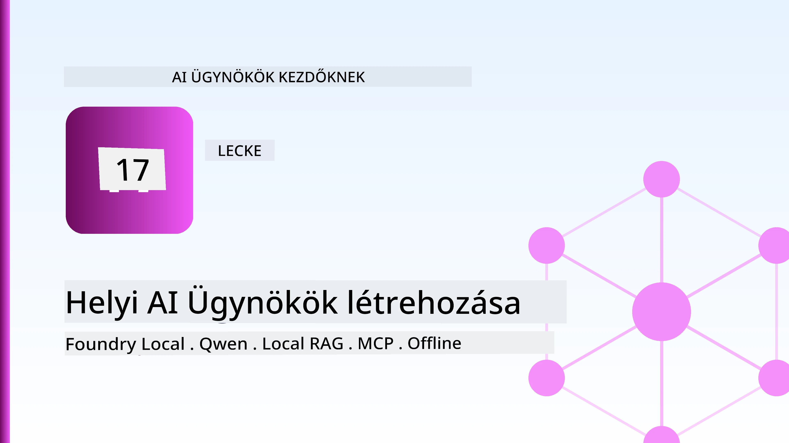
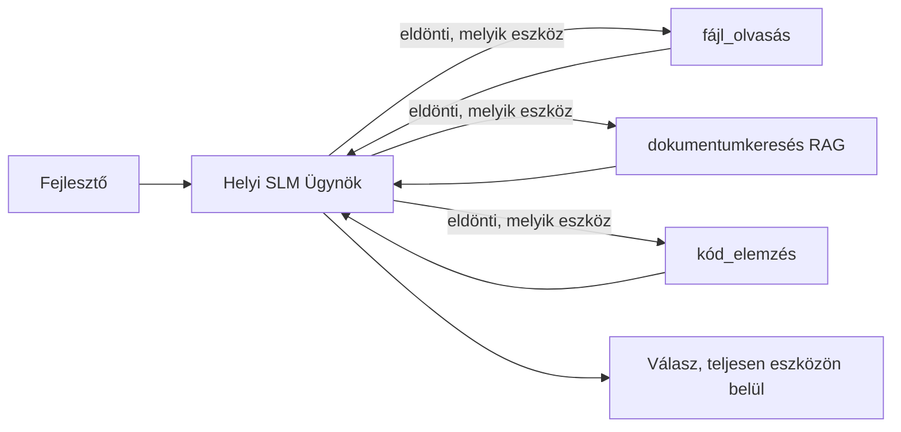
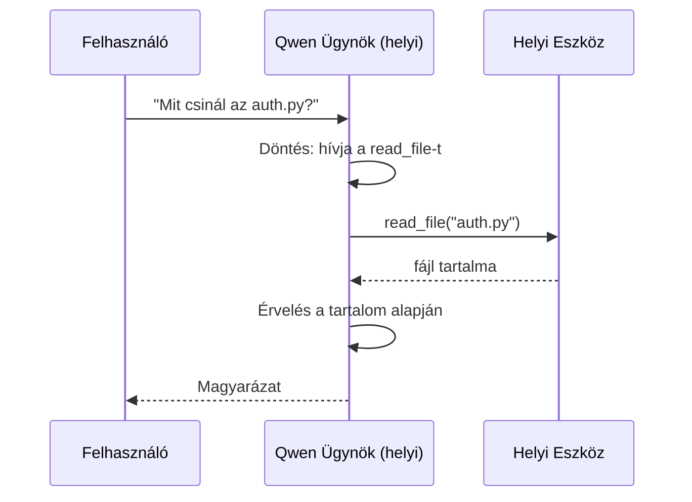
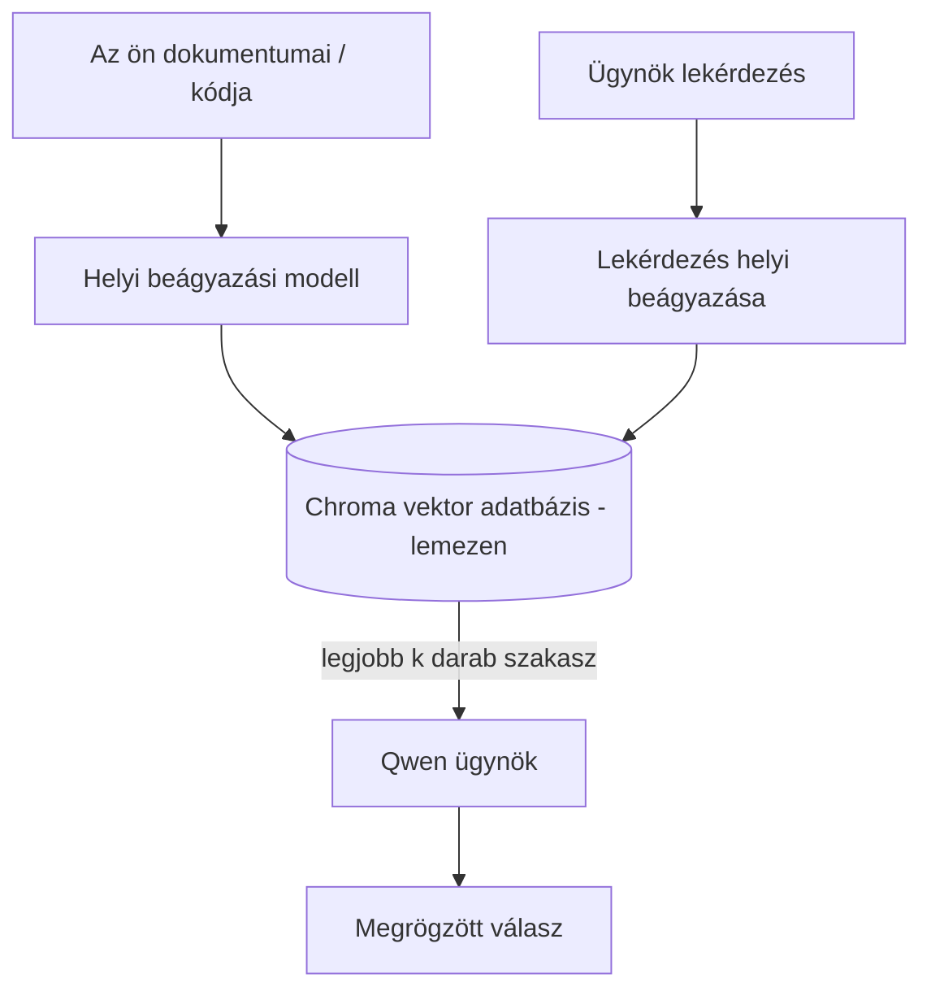
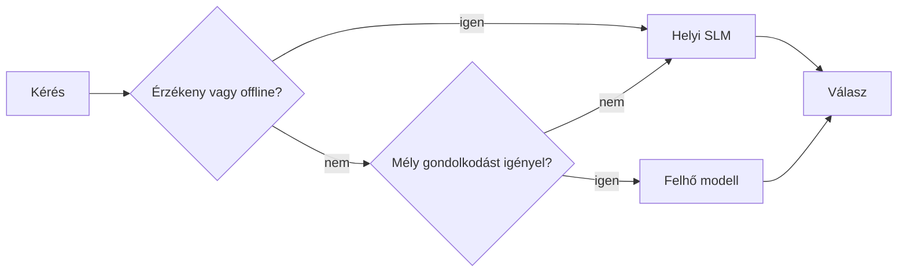

# Helyi Mesterséges Intelligencia Ügynökök Létrehozása a Microsoft Foundry Local és Qwen Használatával



Az előző leckében az ügynököket a felhőbe *skáláztuk fel*. Ez a lecke viszont *lehoz* őket egyetlen gépre. A végére egy működő mérnöki asszisztensed lesz, amely gondolkodik, eszközöket hív meg, olvassa a fájljaidat, és keres a dokumentációdban — **egyetlen felhőalapú lekérdezés nélkül.**

Miért akarnád ezt? Három ok, ami folyamatosan felmerül a valódi mérnöki munkában:

- **Adatvédelem.** A kód és a dokumentumok soha nem hagyják el a gépet. Egyetlen bemenet, szövegrészlet vagy ügyféladat sem lépi át a hálózati határt.
- **Költség.** A helyi lekérdezésnek nincs tokenenkénti díja. Egész nap iterálhatsz az áram áráért cserébe.
- **Offline működés.** Repülőn, egy biztonságos létesítményben vagy áramszünet alatt az ügynök továbbra is működik.

A kompromisszum az, hogy a legmodernebb felhőmodellt egy **Kis Nyelvi Modellre (SLM)** cseréled, amely a CPU-don, GPU-don vagy NPU-don fut. Ez a lecke arról szól, hogyan építsünk ügynököket, amelyek ebben a korlátban *jók*, nem pedig arról, hogy eljátsszuk, mintha ez a korlát nem létezne.

## Bevezetés

Ez a lecke az alábbiakat fedi le:

- **Kis Nyelvi Modellek (SLM-ek)** — mik ők, hol jeleskednek, és hol nem.
- **Microsoft Foundry Local** — egy futtatókörnyezet, amely helyben tölti le és szolgálja ki a modelleket egy **OpenAI-kompatibilis API-n** keresztül.
- **Qwen függvényhívó modellek** — SLM-ek, amelyek megbízhatóan generálnak eszközhívásokat, ami lehetővé teszi a helyi *ügynökök* működését (nem csak helyi chat).
- **Helyi eszközök, helyi RAG és helyi MCP** — azaz képességek biztosítása az ügynöknek a felhő nélkül.
- **Hibrid minták** — mikor érdemes helyben tartani a folyamatokat, és mikor nyúljunk a felhőhöz.

## Tanulási célok

A lecke elvégzése után tudni fogod, hogyan:

- Magyarázd az SLM-ek kompromisszumait, és válassz megfelelő helyi ügynök használati eseteket.
- Szolgálj ki egy Qwen modellt helyben a Foundry Local segítségével, és csatlakozz hozzá az OpenAI-kompatibilis végponton keresztül.
- Építs egy eszköz-hívó ügynököt, amely teljes egészében a számítógépeden fut.
- Adj hozzá helyi RAG-et a saját dokumentumaid fölé helyi vektor adatbázissal (Chroma).
- Kapcsold össze az ügynököt egy helyi MCP szerverrel, és gondolkodj el a hibrid helyi/felhő alapú tervezéseken.

## Előfeltételek

Ez a lecke feltételezi, hogy az előző leckéket elvégezted, és kényelmesen mozogsz:

- [Eszközhasználat](../04-tool-use/README.md) (4. lecke) és [Ügynöki RAG](../05-agentic-rag/README.md) (5. lecke).
- [Ügynöki Protokollok / MCP](../11-agentic-protocols/README.md) (11. lecke).
- A [Microsoft Ügynökkeretrendszer](../14-microsoft-agent-framework/README.md) (14. lecke).

Szükséged lesz még:

- Egy fejlesztői munkaállomás. **8 GB RAM a reális minimum**; a 16 GB+ kényelmes. Egy GPU vagy NPU segít, de nem kötelező.
- **Microsoft Foundry Local** telepítve (lásd az alábbi telepítési részt).
- Python 3.12+ és a `requirements.txt` fájlban szereplő csomagok, plusz a `foundry-local-sdk`, `openai` és a `chromadb` ehhez a leckéhez.

## Kis Nyelvi Modellek: a megfelelő eszköz helyi munkához

Egy legmodernebb felhőmodellnek több száz milliárd paramétere és egy adatközpontja van mögötte. Egy SLM néhány milliárd paraméterrel rendelkezik, és el kell férnie a laptopod RAM-jában. Ez a különbség világos elvárásokat állít.

**Az SLM-ek jól teljesítenek:**

- Strukturált, korlátozott feladatokban — osztályozás, kivonatolás, összefoglalás ismert dokumentumokból.
- **Eszközhívásban** — eldönteni, melyik függvényt hívjuk meg és milyen paraméterekkel.
- Gyors, olcsó, privát iteráció a saját adataidon.

**Az SLM-ek gyengébbek:**

- Nyílt végű, többlépcsős gondolkodásban nagy kontextusban.
- Átfogó világismeretben (kevesebbet láttak, és többet felejtenek).

A helyi ügynökök nyerő stratégiája tehát: **az SLM legyen az irányító, az eszközök végezzék a nehéz munkát.** A modellnek nem kell ismernie a kódodat — elég tudni, mikor kell meghívni a `read_file` és a `search_docs` függvényeket. Ez pontosan az SLM erősségeire játszik rá.



## Microsoft Foundry Local

A **Microsoft Foundry Local** egy könnyű futtatókörnyezet, amely letölti, kezeli és teljes egészében a gépeden szolgálja ki a modelleket. Számunkra a legfontosabb tulajdonsága, hogy egy **OpenAI-kompatibilis HTTP végponttal** rendelkezik — vagyis az OpenAI SDK és a Microsoft Agent Framework OpenAI kliense ugyanúgy használható, csak a `base_url` paramétert kell átállítani. Minden, amit az ügynöképítésről tudsz, közvetlenül átültethető; csak a végpont változik felhőről `localhost`-ra.

A Foundry Local automatikusan kiválasztja az adott hardverhez legjobb modellverziót — CPU, CUDA/GPU vagy NPU build — így nem kell egyes gépekhez manuálisan optimalizálnod.

### Telepítés

Telepítsd a Foundry Local-t (lásd az [operációs rendszeredhez tartozó dokumentációt](https://learn.microsoft.com/azure/ai-foundry/foundry-local/)), majd ellenőrizd, hogy működik:

```bash
# Telepítés (példa; kövesd a platformodhoz tartozó dokumentációt)
winget install Microsoft.FoundryLocal      # Windows
# brew install microsoft/foundrylocal/foundrylocal   # macOS

# Tölts le és futtass egy Qwen modellt, majd indítsd el a helyi szolgáltatást
foundry model run qwen2.5-7b-instruct
foundry service status
```

Ha a szolgáltatás fut, akkor helyi, OpenAI-kompatibilis végponttal rendelkezel (általában `http://localhost:PORT/v1`). A jegyzetfüzet automatikusan felfedezi a végpontot a `foundry-local-sdk` használatával, így nem kell keménykódolni a portot.

## Qwen Függvényhívás: Miért Fontos

Ügynök csak az lehet, amelyik képes eszközöket hívni. Sok SLM tud beszélgetni, de megbízhatatlan, rosszul formált eszköz-hívásokat generál. A **Qwen** modelleket kifejezetten függvényhívásra tanították, így következetesen képesek jól formált eszköz-hívásokat generálni — ez teszi lehetővé, hogy egy helyi chat modellből valódi helyi *ügynök* váljon.

A folyamat a már ismert szokásos eszközhívó ciklus, csak helyben fut:



## Helyi RAG

A dokumentáció keresés az a terület, ahol a helyi ügynökök igazán hasznosak tudnak lenni. Ahelyett, hogy az SLM-re bíznád magad, hogy megjegyezze a keretrendszered dokumentációját, beágyazod azokat egy **helyi vektor adatbázisba** és az ügynök a releváns részeket igény szerint lekéri.

A **Chroma** egy beágyazott vektor-tár, amely az alkalmazásfolyamat részeként fut, kezelő szerver nélkül. A feldolgozási lánc teljes egészében helyi: helyi beágyazó modell → helyi vektorok → helyi lekérés → helyi SLM.



Ez ugyanaz az Ügynöki RAG minta, mint az 5. leckében — az egyetlen különbség, hogy minden komponens a gépeden fut.

## Helyi MCP Szerverek

Az [MCP](../11-agentic-protocols/README.md) egy szállítási protokoll, nem egy felhőszolgáltatás. Egy MCP szerver helyi folyamatként futhat `stdio`-n, így eszközöket tesz elérhetővé az ügynöködnek a szabványos protokoll szerint. Ez lehetővé teszi az MCP szerverek egyre bővülő ökoszisztémájának offline újrahasznosítását — fájlkezelés, git műveletek, adatbázis lekérdezések.

A biztonsági modell különbözik a felhőtől, de nem hiányzik: egy helyi MCP szerver a felhasználói jogosultságaiddal fut, így korlátozd, hogy mire férhet hozzá (pl. egy projekt könyvtár, nem az egész felhasználói könyvtárad), és a kimenetet mindig vedd be bemenetként, amit validálsz.

## Hibrid Felhő és Helyi Minták

A helyi első nem jelenti azt, hogy csak helyi. Az érett rendszerek érzékenység és nehézség alapján választanak útvonalat:

| Helyzet | Hol fut |
| --- | --- |
| Érzékeny kód/adat vagy offline állapot | **Helyi SLM** |
| Egyszerű, korlátozott feladat | **Helyi SLM** (olcsó, gyors) |
| Nehéz, többlépéses következtetés nem érzékeny adatokon | **Felhő modell** |
| Minden, áramszünet alatt | **Helyi SLM** (kegyes degradáció) |

Ez megfelel a 16. leckében bemutatott **modell-útválasztás** ötletnek — csak az egyik "modell" most a saját géped. Egy robosztus tervezés helyiben fut, ha a felhő nem elérhető, így az ügynök minőségileg lassan romlik, ahelyett hogy teljesen leállna.



## Gyakorlati Labor: Egy Helyi Mérnöki Asszisztens

Nyisd meg a [`code_samples/17-local-agent-foundry-local.ipynb`](./code_samples/17-local-agent-foundry-local.ipynb) fájlt, és dolgozd végig. Egy teljes egészében a gépeden futó **helyi mérnöki asszisztenst** építesz, amely képes:

1. **Eszközöket hívni** — Qwen függvényhívás révén a Foundry Local-on keresztül.
2. **Helyi fájlműveleteket végezni** — listázni és olvasni fájlokat egy projekt könyvtárban.
3. **Kódot elemezni** — alapvető metrikákat jelenteni egy forrásfájlon.
4. **Dokumentációban keresni** — helyi RAG egy dokumentum könyvtáron Chroma segítségével.
5. **MCP-t használni** — kapcsolódni egy helyi MCP szerverhez (ha nincs konfigurálva, finoman átugorja).

Egyetlen felhő alapú lekérdezés sem történik.

### Áttekintés

Az asszisztens az OpenAI-kompatibilis végponton keresztül csatlakozik a Foundry Local-hoz, így az ügynök kódja majdnem megegyezik a felhő leckékével — csak az ügyfél változik:

```python
from foundry_local import FoundryLocalManager
from openai import OpenAI

# A Foundry Local felfedezi/letölti a modellt, és biztosít egy helyi végetpontot.
manager = FoundryLocalManager(\"qwen2.5-7b-instruct\")
client = OpenAI(base_url=manager.endpoint, api_key=manager.api_key)  # az api_key egy helyi helyőrző
```

Az eszközök egyszerű Python függvények, amelyek egy adott projekt könyvtárra vannak korlátozva:

```python
def read_file(path: str) -> str:
    \"\"\"Read a file, but only inside the sandboxed project directory.\"\"\"
    full = (PROJECT_ROOT / path).resolve()
    if PROJECT_ROOT not in full.parents and full != PROJECT_ROOT:
        return \"Access denied: path is outside the project directory.\"
    return full.read_text(encoding=\"utf-8\")
```

Figyeld meg a sandbox ellenőrzést — még helyben is egy olyan eszköz, amely tetszőleges útvonalakat olvas, biztonsági kockázat. A jegyzetfüzet minden eszközt egyetlen projekt gyökérkönyvtárra korlátoz.

## Tudásellenőrzés

Teszteld a megértésed, mielőtt továbbmennél a feladathoz.

**1. Adj két konkrét indokot arra, hogy miért érdemes az ügynököt helyben futtatni a felhő helyett.**

<details>
<summary>Válasz</summary>

Bármely kettő a következőkből: **adatvédelem** (a kód és az adatok soha nem hagyják el a gépet), **költség** (nincs tokenenkénti lekérdezési számla), valamint **offline működés** (működik hálózat nélkül — repülőn, biztonságos létesítményben vagy áramszünet idején). A szabályozási vagy megfelelőségi korlátozások, amelyek tiltják az adatküldést az eszközön kívülre, gyakori oka az adatvédelmi oknak.
</details>

**2. Mi az ajánlott munkamegosztás egy SLM és az eszközei között egy helyi ügynökben, és miért?**

<details>
<summary>Válasz</summary>

Hagyd, hogy az SLM **irányítson** (döntsön, melyik eszközt hívja meg és milyen paraméterekkel), és hagyd, hogy az **eszközök végezzék a nehéz munkát** (fájlok olvasása, dokumentumok lekérése, eredmények számítása). Az SLM-ek erősek a korlátozott döntésekben, mint az eszközválasztás, de gyengébbek a széles körű tudásban és a hosszú, többlépcsős következtetésben, ezért az eszközök használata a legmegfelelőbb taktika.
</details>

**3. Mi teszi lehetővé, hogy a felhő ügynök kódot újra tudd használni a Foundry Local-lal?**

<details>
<summary>Válasz</summary>

A Foundry Local egy **OpenAI-kompatibilis HTTP végpontot** tár fel. Az OpenAI SDK és az Agent Framework OpenAI kliense úgy működik vele, hogy csak a `base_url`-t változtatjuk meg (és helyi helyettesítő API kulcsot használunk). Minden más az ügynök kódban változatlan marad.
</details>

**4. Miért használunk kifejezetten Qwen függvényhívó modellt bármely SLM helyett?**

<details>
<summary>Válasz</summary>

Mert egy ügynöknek megbízható, jól formált **eszköz-hívásokat** kell generálnia. Sok SLM képes csevegni, de hibás vagy következetlen eszköz-hívás szerkezeteket produkál. A Qwen modelleket függvényhívásra képezték, így következetes eszköz-hívásokat produkálnak, ami egy helyi chat modellt valódi helyi ügynökké alakít.
</details>

**5. A helyi RAG feldolgozási lánc mely komponensei futnak a gépen?**

<details>
<summary>Válasz</summary>

Mindegyik: a beágyazó modell, a vektor adatbázis (Chroma, lemezen), a lekérési lépés, és az SLM. A dokumentumokat helyben ágyazzák be, helyben tárolják, helyben lekérik, és egy helyi modell elemzi — egyik komponens sem érint felhőt.
</details>

**6. Egy helyi MCP szerver a gépeden fut. Ez automatikusan biztonságossá teszi? Milyen óvintézkedést kell még tenni?**

<details>
<summary>Válasz</summary>

Nem. Egy helyi MCP szerver a felhasználó jogosultságaival fut, vagyis hozzáfér mindahhoz, amihez te is. Korlátozd arra, amire szüksége van (például egy projekt könyvtára, ne az egész felhasználói könyvtárad), és mindig validáld a kimeneteket bemenetként, mielőtt valamire használnád őket.
</details>

**7. Ismertess egy ésszerű hibrid útválasztási szabályt, amely tartalmaz egy helyi modellt.**

<details>
<summary>Válasz</summary>

Az érzékeny vagy offline kéréseket a helyi SLM-hez irányítsuk; az egyszerű, korlátolt feladatokat a helyi SLM-hez sebesség és költség miatt; a nehéz, többlépcsős következtetést nem érzékeny adatokon felhő modellhez; és ha a felhő nem elérhető, visszatérünk a helyi SLM-hez, hogy az ügynök kegyesen romoljon ahelyett, hogy teljesen leállna. Ez a modell-útválasztás (16. lecke), amelyben a helyi gép az egyik modell.
</details>

**8. Milyen reális minimum RAM-méret ajánlott a helyi ügynök futtatásához ebben a leckében, és mit nyersz a több RAM-mal?**

<details>
<summary>Válasz</summary>

Kb. **8 GB** a reális minimum; 16 GB+ kényelmes. Több RAM lehetővé teszi nagyobb, képzettebb modellek futtatását és több kontextus megtartását a memóriában. GPU vagy NPU gyorsítja a lekérdezést, de nem kötelező — a Foundry Local CPU buildet választ, ha nincs gyorsító.
</details>

## Feladat

Bővítsd ki a helyi mérnöki asszisztenst egy **helyi dokumentáció-áttekintővé** egy általad választott kis projekthez (ha szeretnéd, használhatod ennek a tárnak valamelyik lecke mappáját).

A beküldésed legyen képes:

1. **Valódi dokumentációs/kód könyvtár indexelése** Chromába (legalább öt fájl).
2. **`find_todos` eszköz hozzáadása**, amely átvizsgálja a projektet `TODO`/`FIXME` kommentek után, és visszaadja azokat fájl és sorszám szerint — megtartva a `read_file`-hez hasonló sandbox ellenőrzést.

3. **Tegyél fel az ágensnek három olyan kérdést**, amelyek arra kényszerítik, hogy kombinálja az eszközöket: legyen egy tiszta RAG kérdés, egy, amely egy adott fájl olvasását igényli, és egy, amely TODO-k megtalálását igényli.
4. **Mérd meg**: időzd le a három válasz mindegyikét, és jegyezd fel őket egy markdown cellában. Írd meg, hogy a késleltetés elfogadható-e a tervezett munkafolyamatodhoz.

Ezután írj egy rövid bekezdést arról, **mit tennél fel a felhőbe, és mit tartanál helyben** ennél a véleményezőnél, és miért. Az értékelés során az számít, hogy a helyi összetevők megfelelően össze vannak-e kapcsolva, és hogy a hibrid érvelésed logikus-e — nem a modell minősége.

## Összegzés

Ebben a leckében egy teljes egészében a saját gépeden futó ágenst építettél:

- A **SLM-ek** a szélességet cserélik adatvédelemre, költségre és offline működésre — és akkor brillíroznak, amikor **eszközöket rendeznek össze**, ahelyett, hogy minden tudást magukban hordoznának.
- A **Foundry Local** a modelleket eszközön szolgálja ki egy **OpenAI-kompatibilis végponton**, így a felhőügynök kódod egy soros változtatással átvihető.
- A **Qwen függvényhívó modellek** megbízható helyi eszközhívást — és ezáltal helyi *ügynököket* — tesznek lehetővé.
- A **helyi RAG** (Chroma) és **helyi MCP** képességgel ruházza fel az ügynököt anélkül, hogy elhagyná a gépet.
- A **hibrid minták** lehetővé teszik, hogy érzékenység és nehézség szerint irányíts, a helyi komponensek pedig sima visszaesési pontként szolgálnak.

Ezzel befejeződik a telepítési ív: a 16. lecke a skálázható ügynököket vitte be a Microsoft Foundry-ba, ez a lecke pedig leszállította őket egyetlen munkaállomásra. A következő lecke a telepített ügynökök biztonságossá tételével foglalkozik.

## További források

- <a href="https://learn.microsoft.com/azure/ai-foundry/foundry-local/" target="_blank">Microsoft Foundry Local dokumentáció</a>
- <a href="https://learn.microsoft.com/azure/ai-foundry/what-is-azure-ai-foundry" target="_blank">Microsoft Foundry dokumentáció</a>
- <a href="https://aka.ms/ai-agents-beginners/agent-framework" target="_blank">Microsoft Agent Framework</a>
- <a href="https://qwen.readthedocs.io/en/latest/framework/function_call.html" target="_blank">Qwen függvényhívás dokumentáció</a>
- <a href="https://modelcontextprotocol.io/" target="_blank">Model Context Protocol (MCP)</a>
- <a href="https://docs.trychroma.com/" target="_blank">Chroma vektor adatbázis</a>

## Előző lecke

[Skálázható ügynökök telepítése](../16-deploying-scalable-agents/README.md)

## Következő lecke

[AI Ügynökök biztonságossá tétele](../18-securing-ai-agents/README.md)

---

<!-- CO-OP TRANSLATOR DISCLAIMER START -->
**Jogi nyilatkozat**:
Ez a dokumentum az AI fordítási szolgáltatás, a [Co-op Translator](https://github.com/Azure/co-op-translator) segítségével készült. Bár az pontosságra törekszünk, kérjük, vegye figyelembe, hogy az automatikus fordítások hibákat vagy pontatlanságokat tartalmazhatnak. Az eredeti dokumentum az anyanyelvén tekintendő hiteles forrásnak. Fontos információk esetén professzionális emberi fordítást javasolunk. Nem vállalunk felelősséget semmilyen félreértésért vagy téves értelmezésért, amely ebből a fordításból ered.
<!-- CO-OP TRANSLATOR DISCLAIMER END -->