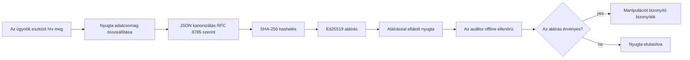
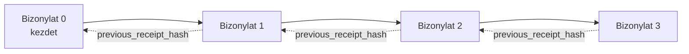

[Nézze meg az oktatóvideót: AI-ügynökök biztonságossá tétele kriptográfiai nyugtákkal](https://youtu.be/PLACEHOLDER_VIDEO_ID)

> _(Az oktatóvideót és a bélyegképet a Microsoft tartalomcsapata fogja hozzáadni az összeolvasztás után, a 14/15. lecke mintájának megfelelően.)_

# AI-ügynökök biztonságossá tétele kriptográfiai nyugtákkal

## Bevezetés

Ez a lecke a következőket fogja lefedni:

- Miért számítanak az audit nyomvonalak az AI-ügynököknél a megfelelőség, hibakeresés és bizalom szempontjából.
- Mi az a kriptográfiai nyugta, és hogyan különbözik az alá nem írt naplóbejegyzéstől.
- Hogyan állítsunk elő aláírt nyugtát egy ügynök eszközhívásához egyszerű Pythonban.
- Hogyan ellenőrizzünk egy nyugtát offline, és hogyan észleljük a manipulációt.
- Hogyan láncoljuk össze a nyugtákat úgy, hogy azok eltávolítása vagy átrendezése megtörje a láncot.
- Mit bizonyítanak a nyugták és mit nem bizonyítanak kifejezetten.

## Tanulási célok

A lecke elvégzése után tudni fogja, hogyan:

- Azonosítsa azokat a hibamódokat, amelyek kriptográfiai eredetiségét indokolják az ügynöki műveleteknek.
- Ed25519 által aláírt nyugtát hozzon létre egy kanonikus JSON adatcsomagon.
- Függetlenül ellenőrizze a nyugtát kizárólag az aláíró nyilvános kulcsával.
- Észlelje a manipulációt úgy, hogy újra lefuttatja az ellenőrzést egy módosított nyugtán.
- Hozzon létre hash-elt láncolt nyugtasorozatot, és magyarázza el, miért fontos a lánc.
- Ismerje fel azt a határt, hogy mit bizonyítanak a nyugták (azonosítás, sértetlenség, sorrendiség) és mit nem (a művelet helyessége, a szabályzat helyessége).

## A probléma: az ügynöke audit nyomvonala

Képzelje el, hogy egy Contoso Travel számára telepített AI ügynök van. Az ügynök elolvassa a vásárlói kéréseket, hív egy járat API-t opciók lekérdezésére, és lefoglalja a helyeket a vásárló nevében. Az elmúlt negyedévben az ügynök 50 000 foglalást dolgozott fel.

Ma érkezik egy auditor. Egy egyszerű kérdést tesz fel: "Mutasd meg, mit csinált az ügynököd."

Átadja a naplófájlokat. Az auditor megnézi őket, majd egy nehezebb kérdést tesz fel: "Honnan tudhatom, hogy ezeket a naplókat nem szerkesztették?"

Ez a naplózás problémája. A mai ügynök telepítések nagy része a következőkre támaszkodik:

- **Alkalmazás naplók**: az ügynök maga írja őket, bárki szerkesztheti, akinek fájlrendszer-hozzáférése van.
- **Felhő naplózási szolgáltatások**: platform szinten manipulációbiztosak, de csak akkor, ha az auditor megbízik a platform üzemeltetőjében.
- **Adatbázis tranzakciós naplók**: jól használhatók adatbázis változásokhoz, de nem tetszőleges eszközhívásokhoz.

Egyik sem válaszolhat az auditor kérdésére anélkül, hogy ne kellene valakiben megbízni (Önben, a felhőszolgáltatóban, az adatbázis szállítójában). Belső használatra ez a bizalom gyakran elfogadható. Szabályozott munkaterhelések esetén (pénzügy, egészségügy, bármilyen az EU AI törvény hatálya alatt álló terület) nem.

A kriptográfiai nyugták ezt oldják meg azáltal, hogy minden egyes ügynöki művelet függetlenül ellenőrizhetővé válik. Az auditor nem kell, hogy Önben bízzon. Csak az Ön nyilvános kulcsára és magára a nyugtára van szüksége.

## Mi az a kriptográfiai nyugta?

A nyugta egy JSON objektum, amely rögzíti, mit tett az ügynök, digitális aláírással ellátva.



Egy minimális nyugta így néz ki:

```json
{
  "type": "agent.tool_call.v1",
  "agent_id": "contoso-travel-bot",
  "tool_name": "lookup_flights",
  "tool_args_hash": "sha256:a3f9c1...",
  "result_hash": "sha256:7b2e1d...",
  "policy_id": "contoso-travel-policy-v3",
  "timestamp": "2026-04-25T14:30:00Z",
  "sequence": 47,
  "previous_receipt_hash": "sha256:9d4e6a...",
  "signature": {
    "alg": "EdDSA",
    "sig": "c5af83...",
    "public_key": "8f3b2c..."
  }
}
```

Három tulajdonság végzi a munkát:

1. **Az aláírás**. A nyugtát az ügynök átjárója írja alá Ed25519 privát kulccsal. Bárki, akinek megvan a hozzá tartozó nyilvános kulcs, offline ellenőrizheti az aláírást. Bármely mező módosítása érvényteleníti az aláírást.

2. **Kanonikus kódolás**. Az aláírás előtt a nyugta a JSON Kanonizációs Sémával (JCS, RFC 8785) kerül sorosításra. Ez biztosítja, hogy két különböző implementáció, amely ugyanazt a logikai nyugtát hozza létre, bájtszerűen azonos kimenetet produkál. Kanonizáció nélkül a különböző JSON sorosítók eltérő aláírásokat eredményeznének ugyanarra a tartalomra.

3. **Hash láncolás**. A `previous_receipt_hash` mező minden nyugtát összekapcsol az előzővel. Egy nyugta eltávolítása vagy sorrendjének megváltoztatása megszakítja az utána következő összes nyugtát. A manipuláció még akkor is láthatóvá válik a lánc szintjén, ha az egyéni aláírásokat megkerülnék.

Ezek a tulajdonságok együtt három garanciát nyújtanak:

- **Azonosítás**: ez a kulcs írta alá ezt a tartalmat.
- **Sértetlenség**: a tartalom nem változott az aláírás óta.
- **Sorrendiség**: ez a nyugta később keletkezett, mint a láncban az a nyugta.

## Nyugta létrehozása Pythonban

Nem szükséges külön könyvtár a nyugta készítéséhez. A kriptográfiai primitívek széles körben elérhetők, és a logika néhány tucatsor Python kód.

Az `code_samples/18-signed-receipts.ipynb` gyakorlati gyakorlatok bemutatják a teljes folyamatot. Az összefoglaló verzió:

```python
import json
import hashlib
import base64
from nacl import signing
from jcs import canonicalize  # RFC 8785 kanonikus JSON

def b64url_nopad(data: bytes) -> str:
    return base64.urlsafe_b64encode(data).decode("ascii").rstrip("=")

def sha256_canonical(obj) -> str:
    """SHA-256 of a Python object's JCS-canonical JSON form."""
    return f"sha256:{hashlib.sha256(canonicalize(obj)).hexdigest()}"

# Aláírókulcs generálása vagy betöltése (éles környezetben kulcstárolóban tárolandó)
signing_key = signing.SigningKey.generate()
verify_key = signing_key.verify_key

# A nyugta adatterhelésének összeállítása (még nincs aláírás)
tool_args = {"origin": "SYD", "destination": "LAX"}
tool_result = [{"flight": "QF11", "price": 1850, "stops": 0}]

payload = {
    "type": "agent.tool_call.v1",
    "agent_id": "contoso-travel-bot",
    "tool_name": "lookup_flights",
    "tool_args_hash": sha256_canonical(tool_args),
    "result_hash": sha256_canonical(tool_result),
    "policy_id": "contoso-travel-policy-v3",
    "timestamp": "2026-04-25T14:30:00Z",
    "sequence": 0,
    "previous_receipt_hash": None,
}

# Kanonizálás, hash-elés, aláírás.
canonical_bytes = canonicalize(payload)
message_hash = hashlib.sha256(canonical_bytes).digest()
signature_bytes = signing_key.sign(message_hash).signature

# Egy strukturált aláírási objektum csatolása.
receipt = {
    **payload,
    "signature": {
        "alg": "EdDSA",
        "sig": b64url_nopad(signature_bytes),
        "public_key": b64url_nopad(bytes(verify_key)),
    },
}
```

Ez az egész aláírási folyamat. A jegyzetfüzet lépésenként bemutatja az egyes részeket.

## Nyugta ellenőrzése és manipuláció észlelése

Az ellenőrzés az ellentétes művelet:

```python
import base64
import hashlib
from nacl import signing
from nacl.exceptions import BadSignatureError
from jcs import canonicalize

def b64url_decode(s: str) -> bytes:
    padding = "=" * ((4 - len(s) % 4) % 4)
    return base64.urlsafe_b64decode(s + padding)

def verify_receipt(receipt: dict) -> bool:
    # Az aláírás egy strukturált objektum: {"alg", "sig", "public_key"}.
    sig_obj = receipt.get("signature")
    if not sig_obj or sig_obj.get("alg") != "EdDSA":
        return False

    # Állítsa vissza a ténylegesen aláírt terhelést (az aláíráson kívül minden mást).
    payload = {k: v for k, v in receipt.items() if k != "signature"}

    canonical_bytes = canonicalize(payload)
    message_hash = hashlib.sha256(canonical_bytes).digest()

    try:
        verify_key = signing.VerifyKey(b64url_decode(sig_obj["public_key"]))
        verify_key.verify(message_hash, b64url_decode(sig_obj["sig"]))
        return True
    except BadSignatureError:
        return False
```

Ez a függvény egy nyugtát vesz be, és `True` értéket ad vissza, ha az aláírás érvényes, különben `False`-t. Nem igényel hálózati hívást, szolgáltatásfüggőséget vagy harmadik félbe vetett bizalmat.

A manipulációészlelés működésének bemutatásához a jegyzetfüzet végigvezeti:

1. Egy érvényes nyugta létrehozását és annak megerősítését, hogy az ellenőrizhető.
2. A `tool_args_hash` mező egy bájtos módosítását.
3. Az ellenőrzés újrafuttatását, amely sikertelen lesz.

Ez a gyakorlati bemutatója annak, hogy a nyugták manipulációbiztosak: bármilyen módosítás, bármilyen kicsi, tönkreteszi az aláírást.

## Nyugták láncolása többlépéses ügynökökhöz

Egyetlen aláírt nyugta egy műveletet véd. A nyugták lánca egy sorrendet véd.



Minden nyugta rögzíti az előző nyugta hash értékét. Egy támadónak, aki a 2. nyugtát csendben el akarja távolítani, vagy:

- módosítania kell a 3. nyugta `previous_receipt_hash` mezőjét (ami megszakítja a 3. nyugta aláírását), VAGY
- új aláírást kell hamisítania a módosított 3. nyugtára (ami az ügynök privát kulcsát igényli).

Ha a privát kulcs hardveres kulcstárban van, és Ön minden nyugtával publikálja a nyilvános kulcsot, egyik támadás sem kivitelezhető észrevétel nélkül.

A jegyzetfüzet bemutatja:

1. Három nyugta láncának felépítését.
2. Annak ellenőrzését, hogy minden nyugta `previous_receipt_hash` mezője megfelel az előző nyugta tényleges hash értékének.
3. Egy középső nyugta manipulálását és a lánc pontosan ott történő megszakadását.

Így hozhat létre audit nyomvonalat, amit a külső auditor ellenőrizhet anélkül, hogy Önben bíznia kellene.

## Mit bizonyítanak a nyugták (és mit nem)

Ez a lecke legfontosabb része. A nyugták erősek, de korlátozottak.

**A nyugták három dolgot bizonyítanak:**

1. **Azonosítás**: egy adott kulcs írt alá egy adott adatcsomagot.
2. **Sértetlenség**: az adatcsomag nem változott az aláírás óta.
3. **Sorrendiség**: ez a nyugta később keletkezett, mint a láncban az az előző nyugta.

**A nyugták NEM bizonyítják:**

1. **Helyesség**: hogy az ügynök művelete volt a helyes művelet. Egy nyugta ugyanúgy aláírható egy helytelen válaszra, mint egy helyesre.
2. **Szabályzat betartását**: hogy az `policy_id`-ben hivatkozott szabályzatot valóban értékelték-e, vagy hogy engedélyezte volna-e ezt a műveletet, ha ellenőrzik. A nyugta azt rögzíti, amit állítottak, nem azt, amit betartattak.
3. **Azonosítás a kulcson túl**: a nyugta azt mondja: "ez a kulcs írta alá ezt a tartalmat." Nem mondja: "egy ember engedélyezte ezt." Egy kulcs személyhez vagy szervezethez rendelése külön identitásinfrastruktúrát igényel (könyvtár, nyilvános kulcs nyilvántartás stb.).
4. **A bemenetek igazságtartalmát**: ha az ügynök manipulált bemenetet kap és annak megfelelően cselekszik, a nyugta hűen rögzíti a műveletet. A nyugták a bemenetellenőrzés után keletkeznek, nem helyettesítik azt.

Ez a határvonal két okból fontos:

- Megmondja, mire jók a nyugták: az ügynöki viselkedés auditálhatóvá és manipulációállóvá tétele, még szervezeti határokon át is.
- Megmondja, milyen további rétegekre van még szüksége: bemenetellenőrzés (6. lecke), szabályzat végrehajtás (röviden bemutatva lent), és identitás infrastruktúra (a lecke hatókörén kívül).

Gyakori hiba az a feltételezés, hogy "vannak nyugtáink" egyenlő "megfelelünk a szabályoknak". Nem az. A nyugták az alapok. A szabályozás az a rendszer, amit ezekre épít.

## Bizonyítás, hogy egy ember jóváhagyta a pontos műveletet

A 3. pont megér egy külön szakaszt: egy műveleti nyugta azt mondja "ez a kulcs írta alá ezt a tartalmat", sosem azt, hogy "egy ember engedélyezte ezt." Kockázatos műveletek esetén (visszatérítések, törlések, átutalások) a szabályozási keretrendszerek egyre inkább megkövetelik éppen ezt a hiányzó állítást, amely előállítható ugyanezekkel a primitívekkel, amiket ebben a leckében már felépített.

A folytatás jegyzetfüzet, a `code_samples/human-authorization-receipts.ipynb` hozzáad egy második nyugtatípust, a `human.approval.v1`-et, ugyanazzal a borítási formával, mint a lecke nyugtái (egy típusos teher, Ed25519 által aláírva kanonikus SHA-256-on keresztül, az aláírás objektum a bájtokon kívül). Egy névvel ellátott jóváhagyó írja alá a **teljes kanonikus műveletet és annak kivonatát** végrehajtás előtt; az ügynök műveleti nyugtája viseli az **ugyanazt a műveleti kivonatot** és egy `parent_approval_ref`-et, az engedélyezés `receipt_hash`-át, ugyanabban a konvencióban, mint a lánc `previous_receipt_hash` mezője. Egy `verify_chain` egyszerre ellenőrzi mindkettőt **különálló rögzített kulcskészletek alatt** (jóváhagyó kulcsok vs. ügynök kulcsok), tehát a kódút közös, de a hatóságok soha nem.

Ez a tulajdonság pontos megfogalmazása: *az ember jóváhagyta ezt a pontos műveletet, és az ügynök pontosan ezt a jóváhagyott műveletet hajtotta végre.* A jegyzetfüzet elutasítási mintái adják ennek a tulajdonságnak a valóságát az állítás helyett:

- a klasszikusok: manipuláció, megtévesztett helyettes, visszajátszás, hamisított kulcsok mindkét oldalon, hibás bemenet;
- **lejárt hatóság**: egy aláírás, ami még mindig ellenőrizhető, mégis elutasítva, mert a szabályzat verzió változott, a jóváhagyó kulcs kikerült a rögzített nyilvántartásból, vagy a jóváhagyás lejárt a végrehajtás előtt;
- **kivonat cseréje**: egy érvényes aláírt műveleti nyugta, amely egy *valódi* jóváhagyásra mutat, ami *más* kanonikus művelethez kötődik.

Minden hiba elutasítást ad eltérő indokkal, így az auditor elolvashatja az elutasítást, és meg tudja különböztetni, hogy a hatóság járt-e le, vagy a végrehajtott művelet változott. A jegyzetfüzet szabálya: egy aláírt jóváhagyás önmagában nem hatóság. Hatóság csak akkor létezik, ha mindkét nyugta ugyanahhoz a kanonikus művelethez kötődik a végrehajtás idején. Az ugyanannak az Internet-Draftnak a társszerző aláírási útvonala (`draft-farley-acta-signed-receipts`), amit ez a lecke követ, ennek a mintának a szabványosított formája.

## Termelési hivatkozások

A lecke Python kódja szándékosan minimális, hogy minden sort el tudjon olvasni és pontosan megértse, mi zajlik. Termelésben két lehetősége van:

1. **Közvetlenül a kriptográfiai primitívekre építkezik.** A fenti 50 sor sok esetben elegendő. A PyNaCl (Ed25519) és a `jcs` csomag (kanonikus JSON) jól karbantartott és auditált könyvtárak.

2. **Használjon termelési nyugta könyvtárat.** Több nyílt forráskódú projekt megvalósítja ugyanazt a mintát további funkciókkal (kulcs forgatás, kötegelt ellenőrzés, JWK Set terjesztés, integráció szabályzat motorokkal):
   - A lecke által használt nyugta formátum egy IETF Internet-Drafton alapul ([`draft-farley-acta-signed-receipts`](https://datatracker.ietf.org/doc/draft-farley-acta-signed-receipts/), 02. revízió), amely jelenleg a szabványosítási folyamatban van, egy megosztott konformancia csomaggal ([agent-governance-testvectors](https://github.com/ScopeBlind/agent-governance-testvectors)), amely független implementációk számára bájtszerűen azonos kanonikus kimenetet garantál.
   - A Microsoft Agent Governance Toolkit nyugtákat fűz össze Cedar-alapú szabályzat döntésekkel; ennek végponttól végpontig történő példáját megtalálja a 33. oktatóanyagban.
   - A `protect-mcp` (npm) és az `@veritasacta/verify` (npm) csomagok Node-alapú megvalósítást nyújtanak a nyugta aláírására és offline ellenőrzésére, céljuk bármely MCP szerver lefedése manipulációbiztos audit nyomvonallal, beleértve egy visszatartott társ-aláírás áramlást, ahol egy szüneteltetett művelet kibocsát egy jóváhagyó nyugtát, amely a művelet kivonathoz kötött (WebAuthn támogatással asztali áramlásban), ugyanaz a jóváhagyás-nyugta minta, mint a fent említett emberi engedélyezés jegyzetfüzetben.
   - A **[nobulex](https://github.com/arian-gogani/nobulex)** Python SDK (`pip install nobulex`) ugyanazt az Ed25519 + JCS aláírási mintát nyújtja Pythonban LangChain és CrewAI integrációval, beleértve kiadott keresztellenőrző tesztvektorokat és megfelelőségi térképezést az [OWASP PR #2210](https://github.com/OWASP/CheatSheetSeries/pull/2210) jóvoltából.

A saját megvalósítás és a könyvtár használat közötti döntés hasonló a saját JWT könyvtár megírása és egy tesztelt használata közötti döntéshez: mindkettő ésszerű; a könyvtár időt spórol és csökkenti az audit felületet; a nulláról történő megvalósítás megérteti Önnel minden primitívet. Ez a lecke a nulláról történő utat tanítja, hogy bármelyik választás alapját megadja.

## Tudásellenőrzés

Tesztelje tudását, mielőtt a gyakorlati feladathoz lépne.

**1. A nyugtát az ügynök privát Ed25519 kulcsával írják alá. Az auditor csak a nyilvános kulccsal rendelkezik. Ellenőrizheti az auditor a nyugtát offline?**

<details>
<summary>Válasz</summary>

Igen. Az Ed25519 ellenőrzéshez csak a nyilvános kulcs és az aláírt bájtok kellenek. Nem szükséges hálózati hívás, szolgáltatásfüggőség. Ez az az tulajdonság, amely hasznossá teszi a nyugtákat levegőzárt, több-szervezeti vagy alacsony bizalommal rendelkező audit környezetben.
</details>

**2. Egy támadó módosítja egy nyugta `policy_id` mezőjét, hogy egy engedékenyebb szabályzatot állítson be. Az aláírás az eredeti adatcsomagra készült. Mi történik az ellenőrzés során?**

<details>
<summary>Válasz</summary>


Az ellenőrzés sikertelen. Az aláírást az eredeti üzenet kanonikus bájtjain számították ki; bármely mező módosítása megváltoztatja a kanonikus bájtokat, ami megváltoztatja a SHA-256 hash-t, ezáltal az aláírás érvénytelenné válik. A támadónak szüksége lenne a privát kulcsra, hogy egy új érvényes aláírást hozzon létre, amellyel nem rendelkezik.
</details>

**3. Miért tartalmaz a bizonylat `tool_args_hash` és `result_hash` mezőket a nyers argumentumok és eredmény helyett?**

<details>
<summary>Válasz</summary>

Két okból. Először is, szükség lehet a bizonylat archiválására vagy továbbítására olyan környezetekben, ahol a nyers tartalom (személyes adatok, üzleti adatok) kiszivárgása problémát jelent. A hashelés megőrzi a bizonylat kicsinységét és a tartalom titkosságát; a revizor ellenőrzi, hogy a hash megegyezik-e a tényleges tartalom külön tárolt példányával. Másodszor, a hash-ek fix méretűek; a hash-eket tartalmazó bizonylat mérete korlátos, függetlenül attól, milyen nagyok voltak a bemenetek és kimenetek.
</details>

**4. A `previous_receipt_hash` mező minden bizonylatot összeköt az elődjével. Ha egy támadó csendben töröl egy bizonylatot a lánc közepéről, mi lesz érvénytelen?**

<details>
<summary>Válasz</summary>

Minden olyan bizonylat, amelyik a törölt után következik. Ezek `previous_receipt_hash` mezői már nem egyeznek a tényleges lánccal (mert az általuk hivatkozott bizonylat már nem létezik, vagy a lánc most egy másik elődjére mutat). A törlés elrejtéséhez a támadónak újra alá kell írnia az összes későbbi bizonylatot, amihez a privát kulcs szükséges.
</details>

**5. Egy bizonylat ellenőrzése sikeres. Ez bizonyítja, hogy az ügynök művelete helyes, megbízható vagy a szabályzatnak megfelelő volt?**

<details>
<summary>Válasz</summary>

Nem. Egy érvényes bizonylat három dolgot bizonyít: hozzárendelést (ez a kulcs írta alá ezt a tartalmat), sértetlenséget (a tartalom nem változott), és sorrendet (ez a bizonylat azután jött, hogy az az előző). Nem bizonyítja, hogy a művelet helyes volt, hogy az `policy_id` által megnevezett szabályzat ténylegesen értékelve lett-e, vagy hogy az ügynök betartotta az összes szabályt. A bizonylatok alapján az ügynök viselkedése auditálható, de nem feltétlenül helyes. Ez a lecke legfontosabb határa.
</details>

## Gyakorlati feladat

Nyisd meg a `code_samples/18-signed-receipts.ipynb` fájlt, és töltsd ki mind a négy részt:

1. **1. rész**: Írd alá az első bizonylatodat és ellenőrizd.
2. **2. rész**: Manipuláld a bizonylatot és figyeld meg az ellenőrzés sikertelenségét.
3. **3. rész**: Építs három bizonylatból álló láncot és ellenőrizd a lánc integritását.
4. **4. rész**: Alkalmazd a mintát egy Microsoft Agent Framework-kel épített ügynökre: csomagold be egy eszközhívás köré a bizonylat aláírását, majd külön ellenőrizd a bizonylatot.

**Extra kihívás 1:** bővítsd ki a bizonylat sémát egy általad választott mezővel (például egy kérésazonosítóval a nyomon követéshez), frissítsd a kanonikus aláíró logikát úgy, hogy tartalmazza, és győződj meg róla, hogy a bizonylat továbbra is sikeresen ellenőrizhető. Ezután módosítsd a mezőt az aláírás után, és ellenőrizd, hogy az ellenőrzés sikertelen lesz. Ez arra késztet, hogy megértsd, hogyan járul hozzá a kanonikus kódolás minden bájtja az aláíráshoz.

**Extra kihívás 2:** kombináld az első két bizonylat SHA-256 hash értékét (a kanonikus bájtjaikat determinisztikus sorrendben fűzd össze), és ágyazd be az eredményül kapott kivonatot egy harmadik bizonylat új mezőjeként az aláírás előtt. Ellenőrizd, hogy mindhárom bizonylat továbbra is sikeresen ellenőrizhető. Ezzel elkészítetted az egyszeri bevonódás bizonyítékot: bárki, aki birtokolja a harmadik bizonylatot, bizonyíthatja, hogy az első kettő létezett az aláírás idején anélkül, hogy felfedné a tartalmukat. Ez a minta használatos a szelektív közzétételű bizonylatoknál is nagy léptékben (Merkle-kötelezettségek, RFC 6962).

## Összegzés

A kriptográfiai bizonylatok audit nyomot biztosítanak az AI ügynökök számára, amely:

- **Függetlenül ellenőrizhető**: bármely fél a nyilvános kulccsal ellenőrizheti, nincs szükség szolgáltatásfüggésre.
- **Manipuláció-érzékeny**: bármilyen módosítás érvényteleníti az aláírást.
- **Hordozható**: a bizonylat egy kis JSON fájl; archiválható, továbbítható és bárhol ellenőrizhető.
- **Szabványokkal összehangolt**: Ed25519-en (RFC 8032), JCS-en (RFC 8785) és SHA-256-on alapul, melyek mind széles körben használt primitívek.

Nem helyettesítik a bemeneti ellenőrzést, szabályzat érvényesítést vagy az azonosítási infrastruktúrát. Ezek az alapjai ezeknek a rétegeknek. Amikor szabályozott munkakörnyezetekbe, több szervezeti munkafolyamatba vagy olyan helyzetbe telepítesz ügynököket, ahol a jövőbeli revizor nem feltétlenül bízik meg benned, a bizonylatok teszik őszinté az audit nyomot.

A legfontosabb tanulság: a bizonylatok bizonyítják, hogy ki mit mondott és mikor. Nem bizonyítják, hogy amit mondtak, az igaz vagy helyes volt. Tartsd szigorúan ezt a különbséget. Ez a határvonal egy őszinte forrásrendszer és egy félrevezető között.

## Üzembe helyezési ellenőrzőlista

Amikor készen állsz arra, hogy az aláírt bizonylatú ügynököket éles környezetbe helyezd:

- [ ] **Mozgasd az aláíró kulcsot a fejlesztői laptopról.** Használj Azure Key Vault-ot, AWS KMS-t vagy hardveres biztonsági modult (HSM-et). Az aláíró privát kulcs soha nem lehet forráskód-tárolóban vagy egyszerű szövegként alkalmazásgépeken.
- [ ] **Tedd közzé az ellenőrző nyilvános kulcsot.** A revizoroknak szükségük van rá offline ellenőrzéshez. A standard minta egy JWK-készlet jól ismert URL-en (RFC 7517), pl. `https://your-org.example.com/.well-known/agent-keys.json`.
- [ ] **Horgonyozd a láncot külsőleg.** Időszakosan írd bele a legújabb láncfej hash-ét egy átláthatósági naplóba (Sigstore Rekor, RFC 3161 időbélyegző szolgáltató vagy második belső rendszer), hogy egy külső fél megerősíthesse: "ez a lánc ekkor létezett."
- [ ] **Tárold a bizonylatokat megváltoztathatatlanul.** Csak hozzáfűzhető blob-tárolás (Azure Storage megváltoztathatatlansági szabályzattal, AWS S3 Object Lock) megakadályozza, hogy egy bennfentes újratörölje a történelmet tárolási szinten.
- [ ] **Határozd meg a megőrzési időszakot.** Sok megfelelőségi szabályzat több éves megőrzést követel. Tervezd meg a bizonylatnövekedést (egy bizonylat kb. 500 bájt; egy naponta 10 ezer hívást végző ügynök akár évente ~1,8 GB-ot termel).
- [ ] **Dokumentáld, mit nem fednek le a bizonylatok.** A bizonylatok bizonyítják a hozzárendelést, sértetlenséget és sorrendet. A működési kézikönyvedben explicit felsorolandó, milyen további kontrollok (bemeneti ellenőrzés, szabályzat érvényesítés, aránykorlátozás, azonosítási infrastruktúra) működnek a bizonylatok mellett az irányítási állásponton belül.

### További kérdésed van az AI ügynökök biztonságáról?

Csatlakozz a [Microsoft Foundry Discord](https://aka.ms/ai-agents/discord) csoporthoz, ahol más tanulókkal találkozhatsz, részt vehetsz nyitott irodai órákon és megválaszolják AI ügynökökkel kapcsolatos kérdéseidet.

## A lecke folytatása

Ez a lecke az egy bizonylatos aláírást és hash láncolt sorozatokat tárgyalja. Ugyanezek az primitívek alkotnak több további fejlett mintát is, amelyekkel találkozhatsz az irányítási állapotod fejlődésével:

- **Szelektív közzététel.** Amikor egy bizonylat mezői függetlenül kötöttek (RFC 6962 stílusú Merkle fa), megmutathatod bizonyos mezőket adott revizoroknak és bizonyíthatod, hogy a többi nem változott anélkül, hogy azokat felfednéd. Hasznos, ha ugyanaz a bizonylat megfelel egy átfogó auditnak (amely a teljességet akarja) és az adatminimalizációs szabályoknak, mint a GDPR (amely azt akarja, hogy a revizor csak a szükségeset lássa).
- **Bizonylatok visszavonása.** Ha egy aláíró kulcs kompromittálódik, szükséged van egy módra, hogy az adott kulccsal aláírt bizonylatokat egy adott időponttól kezdve nem megbízhatóként jelöld meg. Szokásos minták: rövid élettartamú aláíró kulcsok plusz közzétett visszavonási lista, vagy egy átláthatósági napló visszavonási bejegyzésekkel.
- **Kétoldalú / megosztott aláírású bizonylatok.** Néhány megvalósítás a kiszignált üzenetet előzetes végrehajtásra (`authorization_*`) és utólagos eredményre (`result_*`) két részre bontja független aláírásokkal, hasznos, amikor az engedélyezési döntést és a megfigyelt eredményt különböző szereplők vagy időpontok adják. Ez rétegezhető ezen a leckén tanult bizonylatformátumra.
- **Üzenettartalom összetétele.** Egy bizonylat lezárja azt a bájtsorozatot, amit a `result_hash` mezőbe teszel. A valós üzenet gyakran gazdagabb egyetlen eszközhívás eredményénél: az előzetes döntési indoklás (modell előrejelzése, megfontolt lehetőségek, bizonyítékok és teljességük, kockázati állapot, elszámoltathatósági lánc, kapueredmény) mind benne lehet az üzenetben, amit egy bizonylat zár le. Ez minimalizálja a bizonylatformátumot, miközben lehetővé teszi az üzenetsémák területenkénti fejlődését.
- **Több megvalósítás közötti megfelelőség.** Több független megvalósítás ugyanarra a bizonylatformátumra (Python, TypeScript, Rust, Go) keresztellenőriz közös tesztvektorokkal. Ha saját megvalósítást építesz, a közzétett vektorokkal való validálás megerősíti a vezeték kompatibilitást.
- **Poszt-kvantum migráció.** Az Ed25519 ma széles körben használt, de nem ellenálló a kvantumszámítógépes támadásokkal szemben. A bizonylatformátum algoritmus-ügyes: a `signature.alg` mező tartalmazhatja a `ML-DSA-65`-öt (a NIST poszt-kvantum aláírási szabványát), amikor migrálnod kell. Tervezd meg az átmeneti időszakot, amikor a bizonylatok dupla aláírásúak.

## További források

- <a href="https://datatracker.ietf.org/doc/draft-farley-acta-signed-receipts/" target="_blank">IETF Internet-Draft: Géptől-gépig hozzáférés-irányításhoz aláírt döntési bizonylatok</a>
- <a href="https://learn.microsoft.com/azure/ai-studio/responsible-use-of-ai-overview" target="_blank">Felelős AI áttekintése (Azure AI)</a>
- <a href="https://datatracker.ietf.org/doc/html/rfc8032" target="_blank">RFC 8032: Edwards-görbe digitális aláírási algoritmus (EdDSA)</a>
- <a href="https://datatracker.ietf.org/doc/html/rfc8785" target="_blank">RFC 8785: JSON Kanonikalizációs séma (JCS)</a>
- <a href="https://datatracker.ietf.org/doc/html/rfc6962" target="_blank">RFC 6962: Tanúsítvány átláthatóság</a> (Merkle-fa szerkezet szelektív közzétételű bizonylatokhoz)
- <a href="https://github.com/microsoft/agent-governance-toolkit/blob/main/docs/tutorials/33-offline-verifiable-receipts.md" target="_blank">Microsoft Agent Governance Toolkit, 33. útmutató: Offline-ellenőrizhető döntési bizonylatok</a>
- <a href="https://github.com/ScopeBlind/agent-governance-testvectors" target="_blank">Megfelelőségi tesztvektorok több megvalósításhoz</a> a lecke bizonylatformátumához (Apache-2.0)
- <a href="https://pynacl.readthedocs.io/" target="_blank">PyNaCl dokumentáció</a> (Ed25519 Pythonban)

## Előző lecke

[Helyi AI ügynökök létrehozása](../17-creating-local-ai-agents/README.md)

---

<!-- CO-OP TRANSLATOR DISCLAIMER START -->
**Jogi nyilatkozat**:
Ez a dokumentum az AI fordítási szolgáltatás, a [Co-op Translator](https://github.com/Azure/co-op-translator) segítségével készült. Bár az pontosságra törekszünk, kérjük, vegye figyelembe, hogy az automatikus fordítások hibákat vagy pontatlanságokat tartalmazhatnak. Az eredeti dokumentum az anyanyelvén tekintendő hiteles forrásnak. Fontos információk esetén professzionális emberi fordítást javasolunk. Nem vállalunk felelősséget semmilyen félreértésért vagy téves értelmezésért, amely ebből a fordításból ered.
<!-- CO-OP TRANSLATOR DISCLAIMER END -->