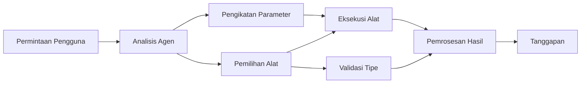

# 🛠️ Penggunaan Alat Lanjutan dengan Azure OpenAI (Responses API) (.NET)

## 📋 Tujuan Pembelajaran

Notebook ini menunjukkan pola integrasi alat kelas perusahaan menggunakan Microsoft Agent Framework di .NET dengan Azure OpenAI (Responses API). Anda akan belajar membangun agen canggih dengan beberapa alat khusus, memanfaatkan tipe kuat C# dan fitur perusahaan .NET.

### Kemampuan Alat Lanjutan yang Akan Anda Kuasai

- 🔧 **Arsitektur Multi-Alat**: Membangun agen dengan berbagai kemampuan khusus
- 🎯 **Eksekusi Alat Aman-Tipe**: Memanfaatkan validasi waktu kompilasi C#
- 📊 **Pola Alat Perusahaan**: Desain alat siap produksi dan penanganan kesalahan
- 🔗 **Komposisi Alat**: Menggabungkan alat untuk alur kerja bisnis yang kompleks

## 🎯 Manfaat Arsitektur Alat .NET

### Fitur Alat Perusahaan

- **Validasi Waktu Kompilasi**: Tipe kuat memastikan parameter alat benar
- **Dependency Injection**: Integrasi kontainer IoC untuk manajemen alat
- **Pola Async/Await**: Eksekusi alat tanpa blokir dengan pengelolaan sumber daya tepat
- **Logging Terstruktur**: Integrasi logging bawaan untuk pemantauan eksekusi alat

### Pola Siap Produksi

- **Penanganan Eksepsi**: Manajemen kesalahan menyeluruh dengan eksepsi bertipe
- **Manajemen Sumber Daya**: Pola dispose yang tepat dan pengelolaan memori
- **Pemantauan Kinerja**: Metode metrik dan penghitung kinerja bawaan
- **Manajemen Konfigurasi**: Konfigurasi aman-tipe dengan validasi

## 🔧 Arsitektur Teknis

### Komponen Alat Inti .NET

- **Microsoft.Extensions.AI**: Lapisan abstraksi alat terpadu
- **Microsoft.Agents.AI**: Orkestrasi alat kelas perusahaan
- **Azure OpenAI (Responses API)**: Klien API berperforma tinggi dengan koneksi pooling

### Pipeline Eksekusi Alat



## 🛠️ Kategori & Pola Alat

### 1. **Alat Pemrosesan Data**

- **Validasi Input**: Tipe kuat dengan anotasi data
- **Operasi Transformasi**: Konversi dan format data aman-tipe
- **Logika Bisnis**: Alat penghitungan dan analisis spesifik domain
- **Format Output**: Generasi respon terstruktur

### 2. **Alat Integrasi**

- **Konektor API**: Integrasi layanan RESTful dengan HttpClient
- **Alat Basis Data**: Integrasi Entity Framework untuk akses data
- **Operasi File**: Operasi sistem file aman dengan validasi
- **Layanan Eksternal**: Pola integrasi layanan pihak ketiga

### 3. **Alat Utilitas**

- **Pemrosesan Teks**: Utilitas manipulasi dan format string
- **Operasi Tanggal/Waktu**: Perhitungan tanggal/waktu berbudaya
- **Alat Matematika**: Perhitungan presisi dan operasi statistik
- **Alat Validasi**: Validasi aturan bisnis dan verifikasi data

Siap membangun agen kelas perusahaan dengan kemampuan alat kuat dan aman-tipe di .NET? Mari arsitek solusi profesional! 🏢⚡

## 🚀 Memulai

### Prasyarat

- [.NET 10 SDK](https://dotnet.microsoft.com/download/dotnet/10.0) atau versi lebih tinggi
- [Langganan Azure](https://azure.microsoft.com/free/) dengan sumber daya Azure OpenAI dan penyebaran model
- [Azure CLI](https://learn.microsoft.com/cli/azure/install-azure-cli) — masuk dengan `az login`

### Variabel Lingkungan yang Diperlukan

```bash
# zsh/bash
export AZURE_OPENAI_ENDPOINT=https://<your-resource>.openai.azure.com
export AZURE_OPENAI_DEPLOYMENT=gpt-4.1-mini
# Kemudian masuk agar AzureCliCredential dapat mengambil token
az login
```

```powershell
# PowerShell
$env:AZURE_OPENAI_ENDPOINT = "https://<your-resource>.openai.azure.com"
$env:AZURE_OPENAI_DEPLOYMENT = "gpt-4.1-mini"
# Kemudian masuk agar AzureCliCredential dapat memperoleh token
az login
```

### Contoh Kode

Untuk menjalankan contoh kode,

```bash
# zsh/bash
chmod +x ./04-dotnet-agent-framework.cs
./04-dotnet-agent-framework.cs
```

Atau menggunakan dotnet CLI:

```bash
dotnet run ./04-dotnet-agent-framework.cs
```

Lihat [`04-dotnet-agent-framework.cs`](../../../../04-tool-use/code_samples/04-dotnet-agent-framework.cs) untuk kode lengkap.

```csharp
#!/usr/bin/dotnet run

#:package Microsoft.Extensions.AI@10.*
#:package Microsoft.Agents.AI.OpenAI@1.*-*
#:package Azure.AI.OpenAI@2.1.0
#:package Azure.Identity@1.13.1

using System.ComponentModel;

using Microsoft.Agents.AI;
using Microsoft.Extensions.AI;

using Azure.AI.OpenAI;
using Azure.Identity;

// Tool Function: Random Destination Generator
// This static method will be available to the agent as a callable tool
// The [Description] attribute helps the AI understand when to use this function
// This demonstrates how to create custom tools for AI agents
[Description("Provides a random vacation destination.")]
static string GetRandomDestination()
{
    // List of popular vacation destinations around the world
    // The agent will randomly select from these options
    var destinations = new List<string>
    {
        "Paris, France",
        "Tokyo, Japan",
        "New York City, USA",
        "Sydney, Australia",
        "Rome, Italy",
        "Barcelona, Spain",
        "Cape Town, South Africa",
        "Rio de Janeiro, Brazil",
        "Bangkok, Thailand",
        "Vancouver, Canada"
    };

    // Generate random index and return selected destination
    // Uses System.Random for simple random selection
    var random = new Random();
    int index = random.Next(destinations.Count);
    return destinations[index];
}

// Azure OpenAI with the Responses API (stable v1 endpoint). Sign in with `az login`.
var azureEndpoint = Environment.GetEnvironmentVariable("AZURE_OPENAI_ENDPOINT")
    ?? throw new InvalidOperationException("AZURE_OPENAI_ENDPOINT is not set.");
var deployment = Environment.GetEnvironmentVariable("AZURE_OPENAI_DEPLOYMENT") ?? "gpt-4.1-mini";

var azureClient = new AzureOpenAIClient(new Uri(azureEndpoint), new AzureCliCredential());

// Define Agent Identity and Comprehensive Instructions
// Agent name for identification and logging purposes
var AGENT_NAME = "TravelAgent";

// Detailed instructions that define the agent's personality, capabilities, and behavior
// This system prompt shapes how the agent responds and interacts with users
var AGENT_INSTRUCTIONS = """
You are a helpful AI Agent that can help plan vacations for customers.

Important: When users specify a destination, always plan for that location. Only suggest random destinations when the user hasn't specified a preference.

When the conversation begins, introduce yourself with this message:
"Hello! I'm your TravelAgent assistant. I can help plan vacations and suggest interesting destinations for you. Here are some things you can ask me:
1. Plan a day trip to a specific location
2. Suggest a random vacation destination
3. Find destinations with specific features (beaches, mountains, historical sites, etc.)
4. Plan an alternative trip if you don't like my first suggestion

What kind of trip would you like me to help you plan today?"

Always prioritize user preferences. If they mention a specific destination like "Bali" or "Paris," focus your planning on that location rather than suggesting alternatives.
""";

// Create AI Agent with Advanced Travel Planning Capabilities
// Get the Responses client for the deployment and create the AI agent
// Configure agent with name, detailed instructions, and available tools
// This demonstrates the .NET agent creation pattern with full configuration
AIAgent agent = azureClient
    .GetChatClient(deployment)
    .AsAIAgent(
        name: AGENT_NAME,
        instructions: AGENT_INSTRUCTIONS,
        tools: [AIFunctionFactory.Create(GetRandomDestination)]
    );

// Create New Conversation Session for Context Management
// Initialize a new conversation session to maintain context across multiple interactions
// Sessions enable the agent to remember previous exchanges and maintain conversational state
// This is essential for multi-turn conversations and contextual understanding
await using var session = await agent.CreateSessionAsync();

// Execute Agent: First Travel Planning Request
// Run the agent with an initial request that will likely trigger the random destination tool
// The agent will analyze the request, use the GetRandomDestination tool, and create an itinerary
// Using the session parameter maintains conversation context for subsequent interactions
await foreach (var update in agent.RunStreamingAsync("Plan me a day trip", session))
{
    await Task.Delay(10);
    Console.Write(update);
}

Console.WriteLine();

// Execute Agent: Follow-up Request with Context Awareness
// Demonstrate contextual conversation by referencing the previous response
// The agent remembers the previous destination suggestion and will provide an alternative
// This showcases the power of conversation sessions and contextual understanding in .NET agents
await foreach (var update in agent.RunStreamingAsync("I don't like that destination. Plan me another vacation.", session))
{
    await Task.Delay(10);
    Console.Write(update);
}
```

---

<!-- CO-OP TRANSLATOR DISCLAIMER START -->
**Penafian**:
Dokumen ini telah diterjemahkan menggunakan layanan terjemahan AI [Co-op Translator](https://github.com/Azure/co-op-translator). Meskipun kami berupaya untuk mencapai akurasi, harap diketahui bahwa terjemahan otomatis mungkin mengandung kesalahan atau ketidakakuratan. Dokumen asli dalam bahasa aslinya harus dianggap sebagai sumber yang sah. Untuk informasi penting, disarankan menggunakan terjemahan profesional oleh manusia. Kami tidak bertanggung jawab atas kesalahpahaman atau penafsiran yang keliru yang timbul dari penggunaan terjemahan ini.
<!-- CO-OP TRANSLATOR DISCLAIMER END -->