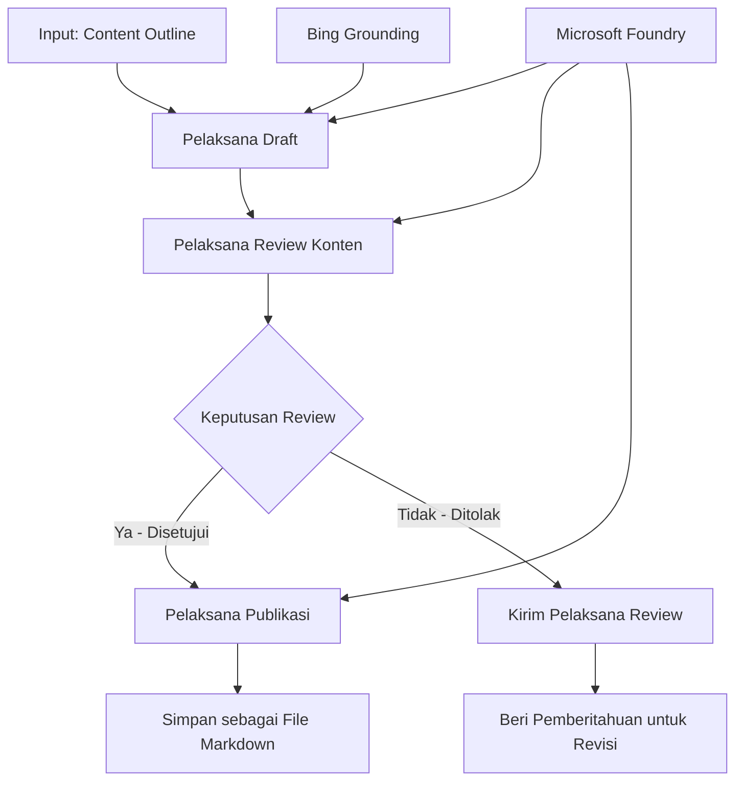

# 🔀 Alur Kerja Agen Kondisional dengan Microsoft Foundry (.NET)

## 📋 Tutorial Alur Kerja Berbasis Keputusan Cerdas

Notebook ini menunjukkan **pola alur kerja kondisional** menggunakan Microsoft Foundry dan Microsoft Agent Framework untuk .NET. Anda akan belajar cara membangun alur kerja canggih berbasis keputusan yang secara cerdas mengarahkan proses berdasarkan analisis AI, aturan bisnis, dan kondisi dinamis untuk otomatisasi kelas perusahaan.

## 🎯 Tujuan Pembelajaran

### 🧠 **Arsitektur Keputusan Cerdas**
- **Implementasi Logika Kondisional**: Bangun pohon keputusan kompleks dengan beberapa titik percabangan
- **Pengarahan Berbasis AI**: Gunakan model Microsoft Foundry untuk membuat keputusan pengarahan cerdas
- **Adaptasi Alur Kerja Dinamis**: Modifikasi perilaku alur kerja berdasarkan analisis dan kondisi runtime
- **Integrasi Aturan Perusahaan**: Sertakan logika bisnis dan persyaratan kepatuhan ke dalam alur kerja

### 🔀 **Pola Kondisional Lanjutan**
- **Pengambilan Keputusan Multi-Kriteria**: Evaluasi berbagai faktor untuk keputusan pengarahan
- **Pemrosesan Berbasis Konteks**: Buat keputusan berdasarkan konteks dan riwayat alur kerja yang terkumpul
- **Modifikasi Alur Kerja Adaptif**: Sesuaikan jalur proses secara dinamis berdasarkan kondisi waktu nyata
- **Integrasi Mesin Aturan**: Terapkan mesin aturan bisnis canggih dalam alur kerja

### 🏢 **Aplikasi Kondisional Perusahaan**
- **Klasifikasi & Pengarahan Dokumen**: Klasifikasikan dan arahkan dokumen secara otomatis ke alur kerja sesuai
- **Triage Layanan Pelanggan**: Pengarahan cerdas pertanyaan pelanggan ke tim penanganan khusus
- **Pemrosesan Kepatuhan & Risiko**: Terapkan proses validasi dan tinjauan yang berbeda berdasarkan penilaian risiko
- **Alur Kerja Jaminan Kualitas**: Arahkan konten melalui proses tinjauan sesuai metrik kualitas

## ⚙️ Prasyarat & Pengaturan

### 📦 **Paket NuGet yang Diperlukan**

Paket lanjutan untuk pemrosesan alur kerja kondisional:

```xml
<!-- Core AI Framework -->
<PackageReference Include="Microsoft.Extensions.AI" Version="9.9.0" />

<!-- Azure AI Agents with Persistent State -->
<PackageReference Include="Azure.AI.Agents.Persistent" Version="1.2.0-beta.5" />

<!-- Azure Identity and Utilities -->
<PackageReference Include="Azure.Identity" Version="1.15.0" />
<PackageReference Include="System.Linq.Async" Version="6.0.3" />
<PackageReference Include="DotNetEnv" Version="3.1.1" />

<!-- Local Workflow Framework References -->
<!-- Microsoft.Agents.Workflows.dll - Advanced workflow orchestration -->
<!-- Microsoft.Agents.AI.AzureAI.dll - Microsoft Foundry integration -->
<!-- Microsoft.Agents.AI.dll - Core agent abstractions -->
```

### 🔑 **Konfigurasi Microsoft Foundry**

**Sumber Daya Azure yang Diperlukan:**
- Workspace Microsoft Foundry dengan model pemrosesan kondisional
- Langganan Azure dengan kuota dan izin komputasi yang sesuai
- Model AI yang sudah dideploy untuk pengambilan keputusan dan analisis konten
- (Opsional) Koneksi Bing Search API untuk kemampuan landasan data

**Konfigurasi Lingkungan (file .env):**
```env
# Microsoft Foundry Configuration
AZURE_AI_PROJECT_ENDPOINT=https://your-project.cognitiveservices.azure.com/
BING_CONNECTION_ID=your-bing-connection-id
```

**Pengaturan Otentikasi:**
```csharp
// Azure CLI or Managed Identity authentication
using Azure.Identity;
var credential = new AzureCliCredential();

// Load environment configuration
DotNetEnv.Env.Load("../../../.env");
```

### 🏗️ **Arsitektur Alur Kerja Kondisional**



**Komponen Kunci:**
- **Draft Executor**: Agen AI yang membuat draf konten awal dari garis besar
- **Content Review Executor**: Agen AI yang menilai kualitas dan kepatuhan draf
- **Conditional Routing**: Logika keputusan yang mengarahkan berdasarkan hasil tinjauan
- **Publish/Review Paths**: Jalur proses terpisah untuk konten yang disetujui vs ditolak
- **State Management**: Memelihara konteks konten dan tinjauan selama alur kerja

## 🎨 **Pola Desain Alur Kerja Kondisional**

### 📋 **Produksi Konten dengan Pintu Kualitas**
```
Outline → Draft Creation → Quality Review → {Approve: Publish | Reject: Revise}
```

### 🎯 **Pemrosesan Dokumen Berbasis Risiko**
```
Document → Risk Assessment → {Low: Standard | High: Enhanced Review}
```

### 🔍 **Pengarahan Cerdas Layanan Pelanggan**
```
Customer Query → Analysis → {Simple: FAQ Bot | Complex: Human Agent}
```

### 💼 **Alur Kerja Berbasis Kepatuhan**
```
Content → Compliance Check → {Pass: Publish | Fail: Legal Review}
```

## 🏢 **Manfaat Kondisional Perusahaan**

### 🎯 **Otomatisasi Cerdas**
- **Pengambilan Keputusan Pintar**: Keputusan pengarahan bertenaga AI berdasarkan analisis konten dan konteks
- **Pemrosesan Adaptif**: Alur kerja yang secara otomatis menyesuaikan berdasarkan kondisi yang berubah
- **Penegakan Aturan Bisnis**: Penerapan otomatis logika dan kebijakan bisnis kompleks
- **Pengarahan Berbasis Konteks**: Keputusan berdasarkan seluruh riwayat alur kerja dan konteks yang terkumpul

### 📈 **Keunggulan Operasional**
- **Alokasi Sumber Daya Teroptimasi**: Arahkan pekerjaan ke spesialis dan proses yang paling sesuai
- **Intervensi Manual Berkurang**: Pengambilan keputusan otomatis meminimalkan kebutuhan pengarahan manusia
- **Waktu Penyelesaian Lebih Cepat**: Pengarahan langsung ke keahlian dan kemampuan pemrosesan yang tepat
- **Penerapan Konsisten**: Penerapan seragam aturan bisnis dan kriteria keputusan

### 🛡️ **Manajemen Risiko & Kepatuhan**
- **Penilaian Risiko Otomatis**: Evaluasi bertenaga AI atas tingkat risiko konten dan situasi
- **Penegakan Kepatuhan**: Pengarahan otomatis melalui proses regulasi yang diperlukan
- **Penerapan Protokol Keamanan**: Langkah keamanan ditingkatkan diterapkan berdasarkan penilaian risiko
- **Pemeliharaan Jejak Audit**: Dokumentasi lengkap keputusan pengarahan dan alasannya

### 📊 **Analitik & Peningkatan Berkelanjutan**
- **Analitik Keputusan**: Melacak efektivitas dan akurasi keputusan pengarahan
- **Pengenalan Pola**: Identifikasi tren dan pola dalam keputusan pengarahan seiring waktu
- **Optimisasi Kinerja**: Peningkatan berkelanjutan dari kriteria keputusan dan efisiensi pengarahan
- **Intelijen Bisnis**: Wawasan ke karakteristik konten dan kebutuhan pemrosesan

### 🔧 **Keunggulan Teknis**
- **Manajemen Status Persisten**: Memelihara status kompleks selama eksekusi alur kerja
- **Arsitektur Skalabel**: Menangani kebutuhan pemrosesan kondisional dengan volume tinggi
- **Kemampuan Integrasi**: Integrasi mulus dengan sistem dan proses bisnis yang sudah ada
- **Pemantauan & Observabilitas**: Pelacakan komprehensif kinerja alur kerja dan keputusan

Mari bangun alur kerja perusahaan yang cerdas dan berbasis keputusan dengan .NET! 🚀

## 💻 Menjalankan Kode

Implementasi lengkap tersedia di `04.dotnet-agent-framework-workflow-aifoundry-condition.cs`. Ini mendemonstrasikan **alur kerja produksi konten dengan pintu kualitas**:

### 🏗️ **Arsitektur Alur Kerja**

```
Content Outline → Draft Creation → Quality Review → Conditional Routing:
                                                      ├─ Approved (>200 words) → Publish
                                                      └─ Rejected (<200 words) → Review Notification
```

**Agen dalam Alur Kerja:**
1. **Evangelist Agent**: Membuat draf tutorial dari garis besar dengan landasan Bing
2. **Content Reviewer Agent**: Menilai kualitas draf (jumlah kata, kelengkapan)
3. **Publisher Agent**: Menyimpan konten yang disetujui sebagai file Markdown berstempel waktu

**Eksekutor Kustom:**
1. **DraftExecutor**: Mengatur pembuatan draf
2. **ContentReviewExecutor**: Melakukan penilaian kualitas
3. **PublishExecutor**: Menangani publikasi konten yang disetujui
4. **SendReviewExecutor**: Mengelola pemberitahuan konten yang ditolak

### 🚀 Menjalankan Contoh

**Prasyarat:**
- Workspace Microsoft Foundry sudah dikonfigurasi
- Otentikasi Azure CLI (`az login`)
- (Opsional) Koneksi Bing Search untuk landasan data

```bash
# Buat skrip dapat dieksekusi (Unix/Linux/macOS)
chmod +x 04.dotnet-agent-framework-workflow-aifoundry-condition.cs

# Jalankan alur kerja bersyarat
./04.dotnet-agent-framework-workflow-aifoundry-condition.cs
```

Atau di Windows:
```powershell
dotnet run 04.dotnet-agent-framework-workflow-aifoundry-condition.cs
```

### 📝 Output yang Diharapkan

Alur kerja akan:
1. **Membuat Agen**: Menginisialisasi tiga agen Microsoft Foundry khusus
2. **Menghasilkan Draf**: Agen Evangelist membuat draf tutorial dari garis besar
3. **Meninjau Konten**: Content Reviewer menilai kualitas draf
4. **Pengarahan Kondisional**:
   - **Jika disetujui (>200 kata)**: Publish executor menyimpan sebagai file Markdown
   - **Jika ditolak (<200 kata)**: Kirim pemberitahuan tinjauan
5. **Menampilkan Hasil**: Menunjukkan hasil akhir alur kerja

### 🔧 Opsi Kustomisasi

**Ubah Kriteria Tinjauan:**
```csharp
const string ContentReviewerInstructions = @"
You are a content reviewer...
1. Check if content is more than 500 words (instead of 200)
2. Verify technical accuracy
3. Ensure proper formatting
...";
```

**Tambahkan Jalur Kondisional Lebih Banyak:**
```csharp
var workflow = new WorkflowBuilder(draftExecutor)
    .AddEdge(draftExecutor, contentReviewerExecutor)
    .AddEdge(contentReviewerExecutor, publishExecutor, condition: GetCondition("Excellent"))
    .AddEdge(contentReviewerExecutor, editExecutor, condition: GetCondition("Good"))
    .AddEdge(contentReviewerExecutor, sendReviewerExecutor, condition: GetCondition("Poor"))
    .Build();
```

**Ubah Persyaratan Konten:**
```csharp
string OUTLINE_Content = @"
# Your Custom Topic
## Section 1
https://your-reference-url
## Section 2
...
";
```

### 🎯 Aplikasi Dunia Nyata

Pola alur kerja kondisional ini ideal untuk:
- **Sistem Manajemen Konten**: Alur kerja editorial otomatis dengan pintu kualitas
- **Pemrosesan Dokumen**: Arahkan dokumen berdasarkan klasifikasi dan kepatuhan
- **Dukungan Pelanggan**: Pengarahan tiket cerdas berdasarkan kompleksitas dan urgensi
- **Tinjauan Hukum**: Arahkan kontrak berdasarkan penilaian risiko dan nilai
- **Proses HR**: Arahkan aplikasi melalui alur penyaringan yang tepat

### 🔍 Memahami Logika Kondisional

**Fungsi Kondisi:**
```csharp
public Func<object?, bool> GetCondition(string expectedResult) =>
    reviewResult => reviewResult is ReviewResult review && review.Result == expectedResult;
```

Fungsi ini membuat predikat yang:
1. Memeriksa apakah hasil adalah tipe `ReviewResult`
2. Membandingkan properti `Result` dengan nilai yang diharapkan
3. Mengembalikan true/false untuk menentukan pengarahan

**Tepi Alur Kerja dengan Kondisi:**
```csharp
.AddEdge(contentReviewerExecutor, publishExecutor, condition: GetCondition("Yes"))
.AddEdge(contentReviewerExecutor, sendReviewerExecutor, condition: GetCondition("No"))
```

### 📊 Fitur Lanjutan

**Validasi Skema JSON:**
Alur kerja menggunakan skema JSON untuk memastikan respons terstruktur:

```csharp
// Define response structure
public class ReviewResult
{
    [JsonPropertyName("review_result")]
    public string Result { get; set; } = string.Empty;
    
    [JsonPropertyName("reason")]
    public string Reason { get; set; } = string.Empty;
    
    [JsonPropertyName("draft_content")]
    public string DraftContent { get; set; } = string.Empty;
}

// Apply to agent
ResponseFormat = ChatResponseFormat.ForJsonSchema(
    AIJsonUtilities.CreateJsonSchema(typeof(ReviewResult)), 
    "ReviewResult", 
    "Review Result From DraftContent"
)
```

**Integrasi Landasan Bing:**
Agen Evangelist menggunakan landasan Bing untuk mengakses informasi waktu nyata:

```csharp
var bingGroundingConfig = new BingGroundingSearchConfiguration(bing_conn_id);
BingGroundingToolDefinition bingGroundingTool = new(
    new BingGroundingSearchToolParameters([bingGroundingConfig])
);
```

Ini memungkinkan agen mengikuti URL dalam garis besar dan mengekstrak informasi terkini.

### 🛡️ Penanganan Kesalahan

Alur kerja termasuk penanganan kesalahan yang kokoh untuk konten ditolak:
- Kegagalan tinjauan memicu jalur alternatif
- Pemberitahuan memberikan alasan penolakan yang jelas
- Konten disimpan untuk revisi

### 🔄 Memperluas Alur Kerja

**Tambahkan Loop Revisi:**
Buat loop umpan balik yang otomatis membuat ulang draf konten:

```csharp
.AddEdge(contentReviewerExecutor, publishExecutor, condition: GetCondition("Yes"))
.AddEdge(contentReviewerExecutor, draftExecutor, condition: GetCondition("No")) // Loop back
```

**Terapkan Tinjauan Multi-Tingkat:**
Tambahkan beberapa tahap tinjauan dengan kriteria berbeda:

```csharp
.AddEdge(draftExecutor, technicalReviewer)
.AddEdge(technicalReviewer, editorialReviewer, condition: GetCondition("TechPass"))
.AddEdge(editorialReviewer, publishExecutor, condition: GetCondition("EditPass"))
```

Pola alur kerja kondisional ini menyediakan fondasi untuk membangun sistem otomatisasi perusahaan yang cerdas dan canggih! 🚀

---

<!-- CO-OP TRANSLATOR DISCLAIMER START -->
**Penafian**:
Dokumen ini telah diterjemahkan menggunakan layanan terjemahan AI [Co-op Translator](https://github.com/Azure/co-op-translator). Meskipun kami berupaya untuk mencapai akurasi, harap diketahui bahwa terjemahan otomatis mungkin mengandung kesalahan atau ketidakakuratan. Dokumen asli dalam bahasa aslinya harus dianggap sebagai sumber yang sah. Untuk informasi penting, disarankan menggunakan terjemahan profesional oleh manusia. Kami tidak bertanggung jawab atas kesalahpahaman atau penafsiran yang keliru yang timbul dari penggunaan terjemahan ini.
<!-- CO-OP TRANSLATOR DISCLAIMER END -->