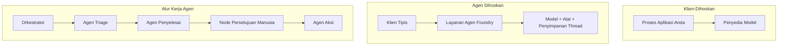
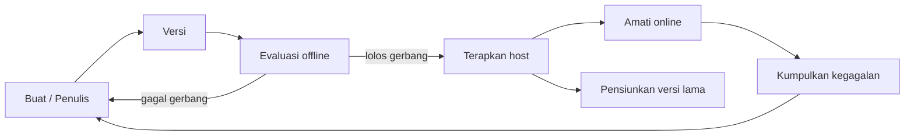
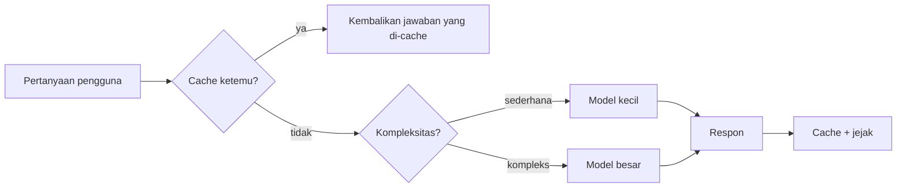
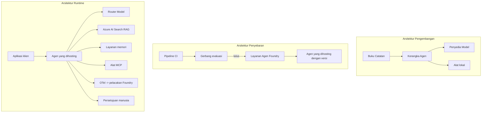

# Menyebarkan Agen Skala Besar dengan Microsoft Foundry


Sampai titik ini dalam kursus Anda telah membangun agen yang berjalan di laptop Anda, di dalam notebook, yang dijalankan dengan `az login` dan beberapa variabel lingkungan. Itu adalah cara yang tepat untuk belajar. Namun itu bukan cara yang tepat untuk menjalankan agen yang ribuan pelanggan andalkan pukul 3 pagi.

Pelajaran ini membahas kesenjangan antara "berjalan di mesin saya" dan "berjalan, secara andal dan terjangkau, di produksi." Kami menutup kesenjangan itu menggunakan **Microsoft Foundry** dan **Microsoft Foundry Agent Service**, serta membangun agen dukungan pelanggan nyata yang memiliki alat, pengambilan, memori, evaluasi, dan pemantauan.

## Pendahuluan

Pelajaran ini akan membahas:

- Perbedaan antara **agen prototipe** dan **agen yang disebarkan**, serta mengapa transisi sebagian besar berkaitan dengan segala sesuatu *di sekitar* model.
- **Pola penyebaran** untuk agen: di-host klien, di-host layanan (Hosted Agents), dan diatur oleh workflow.
- **Siklus hidup agen** di Microsoft Foundry — buat, versi, sebar, evaluasi, amati, pensiunkan.
- **Strategi penskalaan**: routing model, caching, konkurensi, dan desain tanpa status.
- **Observabilitas** dengan OpenTelemetry dan penjejakan Foundry.
- **Optimasi biaya** melalui pemilihan model, routing, dan gerbang evaluasi.
- **Pertimbangan enterprise**: tata kelola, persetujuan manusia, dan menjalankan server MCP dengan aman di produksi.

## Tujuan Pembelajaran

Setelah menyelesaikan pelajaran ini, Anda akan mengetahui cara untuk:

- Memilih pola penyebaran yang tepat untuk beban kerja agen tertentu.
- Menyebarkan agen ke Microsoft Foundry Agent Service sehingga agen tersebut memiliki versi, tata kelola, dan dapat diamati.
- Menginstrumen agen untuk penjejakan dan menghubungkan pipeline evaluasi yang berjalan sebelum setiap rilis.
- Menerapkan routing model dan caching untuk menjaga latensi dan biaya tetap terkendali dalam skala besar.
- Menambahkan gerbang persetujuan manusia untuk tindakan berisiko tinggi dan mengintegrasikan server MCP dengan cara yang aman untuk produksi.

## Prasyarat

Pelajaran ini mengasumsikan Anda telah menyelesaikan pelajaran sebelumnya dan menguasai:

- Membangun agen dengan [Microsoft Agent Framework](../14-microsoft-agent-framework/README.md) (Pelajaran 14).
- [Penggunaan Alat](../04-tool-use/README.md) (Pelajaran 4) dan [Agentic RAG](../05-agentic-rag/README.md) (Pelajaran 5).
- [Memori Agen](../13-agent-memory/README.md) (Pelajaran 13) dan [Protokol Agentic / MCP](../11-agentic-protocols/README.md) (Pelajaran 11).
- [Observabilitas dan Evaluasi](../10-ai-agents-production/README.md) (Pelajaran 10) — pelajaran ini dibangun langsung di atasnya.

Anda juga membutuhkan:

- **Langganan Azure** dan **proyek Microsoft Foundry** dengan setidaknya satu model chat yang telah disebarkan.
- **Azure CLI** yang sudah diautentikasi (`az login`).
- Python 3.12+ dan paket dalam repositori [`requirements.txt`](../../../requirements.txt).

## Dari Prototipe ke Produksi: Apa yang Sebenarnya Berubah

Agen prototipe dan agen produksi berbagi loop inti yang sama — beralasan, memanggil alat, merespons. Yang berubah adalah segala sesuatu yang membungkus loop tersebut. Model mungkin hanya 20% dari agen produksi; sisanya 80% adalah kerangka operasional.

| Perhatian | Prototipe | Produksi |
| --- | --- | --- |
| **Hosting** | Berjalan di notebook Anda | Berjalan sebagai layanan yang dipasang, versi, dan diluncurkan |
| **Identitas** | Token `az login` Anda | Identitas yang dikelola dengan RBAC terbatas |
| **Status** | Dalam memori, hilang saat restart | Dieksternal-kan (penyimpanan thread, layanan memori) |
| **Kegagalan** | Anda melihat traceback | Coba ulang, fallback, dead-letter, notifikasi |
| **Biaya** | "Beberapa sen" | Dilacak per permintaan, diarahkan, di-cache, dianggarkan |
| **Kualitas** | Anda periksa output secara manual | Dievaluasi otomatis sebelum setiap rilis |
| **Kepercayaan** | Anda menyetujui setiap tindakan | Kebijakan + manusia dalam loop untuk tindakan berisiko |

Ingat tabel ini. Setiap bagian di bawah ini terkait dengan salah satu baris tersebut.

## Pola Penyebaran Agen

Ada tiga pola yang akan Anda gunakan, sering kali dalam kombinasi.

### 1. Agen Di-host Klien

Objek agen berada di dalam proses aplikasi *Anda*. Kode Anda memanggil penyedia model secara langsung; loop penalaran berjalan di layanan Anda. Ini adalah apa yang telah dilakukan di pelajaran sebelumnya.

- **Gunakan saat** Anda membutuhkan kontrol penuh atas loop, middleware khusus, atau menyematkan agen di backend yang sudah ada.
- **Kompromi**: Anda menangani penskalaan, status, dan ketahanan sendiri.

### 2. Agen Di-host (Foundry Agent Service)

Agen didaftarkan sebagai *sumber daya* di Microsoft Foundry. Foundry menjalankan loop penalaran, menyimpan thread, menegakkan keamanan konten dan RBAC, serta membuat agen terlihat di portal Foundry. Aplikasi Anda menjadi klien tipis yang membuat thread dan membaca respons.

- **Gunakan saat** Anda menginginkan daya tahan, observabilitas bawaan, tata kelola, dan area operasi yang lebih kecil.
- **Kompromi**: kontrol tingkat rendah yang lebih sedikit sebagai gantinya runtime yang dikelola.

### 3. Workflow Agen

Beberapa agen (dan alat) dikomposisikan menjadi sebuah grafik dengan alur kontrol eksplisit — langkah berurutan, cabang, node persetujuan manusia, dan checkpoint tahan lama yang dapat berhenti dan dilanjutkan. Ini adalah kemampuan **Workflow** Microsoft Agent Framework yang diterapkan pada skala penyebaran.

- **Gunakan saat** satu tugas mencakup beberapa agen khusus atau membutuhkan langkah persetujuan di tengahnya.
- **Kompromi**: lebih banyak bagian yang bergerak; membutuhkan observabilitas tingkat orkestrasi.



## Siklus Hidup Agen di Microsoft Foundry

Menyebarkan agen bukanlah `push` satu kali. Ini adalah loop, dan terlihat mirip dengan siklus rilis perangkat lunak karena memang itu yang terjadi.



Ide kunci, yang diambil dari [Pelajaran 10](../10-ai-agents-production/README.md): **evaluasi offline adalah gerbang, bukan hal yang dianggap sepele.** Versi agen baru tidak dikirim kecuali melewati ambang evaluasi Anda. Observabilitas online kemudian memberi umpan balik kegagalan dunia nyata ke dalam set uji offline Anda. Itulah keseluruhan loop.

## Strategi Penskalaan

Menskala agen berbeda dengan menskala API web tanpa status, karena setiap permintaan bisa memicu beberapa panggilan model dan alat yang mahal. Empat teknik memikul sebagian besar beban.

**Penanganan permintaan tanpa status.** Jangan simpan status per pengguna dalam memori proses Anda. Simpan thread percakapan di penyimpanan thread Foundry atau layanan memori sehingga setiap instance dapat menangani setiap permintaan. Ini memungkinkan Anda skala horizontal — menambah instance, tanpa sesi lengket.

**Routing model.** Tidak semua permintaan membutuhkan model paling canggih (dan paling mahal). Rute permintaan sederhana — klasifikasi niat, jawaban fakta pendek — ke model kecil dan cepat, dan sisakan model besar untuk penalaran kompleks. **Model Router** Foundry dapat melakukannya untuk Anda, atau Anda dapat membuat klasifikator ringan sendiri. Anda akan membangun versi DIY di lab.

**Caching respons.** Banyak pertanyaan dukungan hampir duplikat ("bagaimana saya reset kata sandi?"). Cache jawaban untuk pertanyaan umum dan layani tanpa memanggil model sama sekali. Bahkan tingkat hit cache yang sederhana secara signifikan mengurangi biaya dan latensi.

**Konkurensi dan backpressure.** Penyedia model memiliki batas laju. Batasi konkurensi Anda, gunakan percobaan ulang dengan eksponensial backoff, dan gagal dengan anggun (respons antrean "kami sedang mengerjakannya" lebih baik daripada 500).



## Observabilitas di Produksi

Anda tidak dapat mengoperasikan apa yang tidak bisa Anda lihat. Seperti yang dibahas di Pelajaran 10, Microsoft Agent Framework secara native mengeluarkan **OpenTelemetry** trace — setiap panggilan model, pemanggilan alat, dan langkah orkestrasi menjadi sebuah span. Di produksi Anda mengekspor span tersebut ke Microsoft Foundry (atau backend kompatibel OTel) sehingga Anda dapat:

- Melacak keluhan pelanggan tunggal secara menyeluruh di setiap panggilan model dan alat.
- Memantau latensi p50/p95 dan biaya per permintaan dari waktu ke waktu.
- Memberi peringatan lonjakan tingkat kesalahan dan anomali biaya sebelum pengguna Anda (atau tim keuangan Anda) menyadarinya.

```python
from agent_framework.observability import get_tracer

tracer = get_tracer()

with tracer.start_as_current_span("support_request") as span:
    span.set_attribute("customer.tier", "enterprise")
    span.set_attribute("routed.model", "gpt-5-nano")
    # eksekusi agen dilacak secara otomatis di dalam rentang ini
```

Atribut seperti `customer.tier` dan `routed.model` adalah apa yang mengubah dinding trace menjadi pertanyaan yang dapat dijawab ("apakah pelanggan enterprise terlalu sering diarahkan ke model kecil?").

## Optimasi Biaya

Biaya dalam agen produksi didominasi oleh token. Ada tiga tuas, menurut urutan dampak:

1. **Ukuran model yang tepat.** Model kecil yang melewati gerbang evaluasi Anda hampir selalu lebih murah daripada model besar yang juga lulus. Gunakan evaluasi untuk *membuktikan* model kecil sudah cukup baik daripada menggunakan model terbesar sebagai standar kehati-hatian.
2. **Routing berdasarkan kompleksitas.** Seperti disebutkan sebelumnya — bayar harga model besar hanya untuk permintaan yang membutuhkan penalaran model besar.
3. **Caching secara agresif.** Panggilan model termurah adalah yang tidak pernah Anda lakukan.

Gerbang evaluasi dan kontrol biaya adalah disiplin yang sama dari dua sudut pandang: evaluasi memberi Anda *lantai kualitas*, routing dan caching menjaga Anda sedekat mungkin dengan *biaya* lantai tersebut.

## Pertimbangan Penyebaran Enterprise

**Tata kelola.** Hosted Agents mewarisi RBAC, keamanan konten, dan logging audit Foundry. Beri setiap agen identitas yang dikelola dengan hak istimewa paling sedikit yang diperlukan — akses baca saja ke basis pengetahuan, akses terbatas ke API tiket, tidak lebih.

**Manusia dalam loop.** Beberapa tindakan terlalu penting untuk diotomatisasi langsung — mengeluarkan pengembalian dana, menghapus akun, eskalasi ke tim hukum. Microsoft Agent Framework mendukung alat yang **memerlukan persetujuan**: agen mengusulkan tindakan, eksekusi berhenti sebentar, manusia menyetujui atau menolak, dan workflow dilanjutkan. Anda melihat unsur primitif ini di [Pelajaran 6](../06-building-trustworthy-agents/README.md); di sini Anda menyebarkannya.

**MCP di produksi.** [MCP](../11-agentic-protocols/README.md) memungkinkan agen Anda mengonsumsi alat eksternal melalui antarmuka standar. Di produksi, anggap setiap server MCP sebagai batas yang tidak dipercaya: kunci versi server, jalankan dengan identitas terbatas, validasi output-nya, dan jangan pernah berikan rahasia. Server MCP adalah dependensi, dan dependensi perlu dipatch, diaudit, dan dibatasi laju.



Ketiga diagram itu — pengembangan, penyebaran, runtime — adalah agen yang sama pada tiga tahap hidupnya. Lab berikutnya akan memandu Anda membangunnya.

## Lab Praktik: Agen Dukungan Pelanggan Siap Produksi

Buka [`code_samples/16-python-agent-framework.ipynb`](./code_samples/16-python-agent-framework.ipynb) dan kerjakan secara menyeluruh. Anda akan merakit **agen dukungan pelanggan Contoso** dengan setiap perhatian produksi dihubungkan:

1. **Pemanggilan alat** — mencari status pesanan dan membuka tiket dukungan.
2. **RAG** — menjawab pertanyaan kebijakan dari basis pengetahuan (Azure AI Search, dengan fallback di memori agar notebook berjalan tanpa resource Search).
3. **Memori** — mengingat pelanggan selama percakapan berputar-putar.
4. **Routing model** — klasifikator kompleksitas mengarahkan setiap permintaan ke model kecil atau besar.
5. **Caching respons** — pertanyaan berulang dilayani dari cache.
6. **Persetujuan manusia** — pengembalian dana di atas ambang menunggu tanda tangan manusia.
7. **Pipeline evaluasi** — set uji offline kecil mengukur agen dan bertindak sebagai gerbang rilis.
8. **Observabilitas** — penjejakan OpenTelemetry di setiap permintaan.

### Panduan

Notebook diatur sehingga setiap perhatian produksi adalah bagian mandiri yang dapat dijalankan. Inti dari itu adalah handler permintaan routing-plus-caching:

```python
async def handle_support_request(query: str, customer_id: str) -> str:
    # 1. Layani dari cache saat kami bisa.
    cached = response_cache.get(normalize(query))
    if cached:
        return cached

    # 2. Rute berdasarkan kompleksitas untuk mengontrol biaya.
    model = "gpt-5-nano" if is_simple(query) else "gpt-5-mini"

    # 3. Jalankan agen di dalam jejak span untuk observabilitas.
    with tracer.start_as_current_span("support_request") as span:
        span.set_attribute("routed.model", model)
        span.set_attribute("customer.id", customer_id)
        response = await support_agent.run(query, model=model)

    # 4. Cache dan kembalikan.
    response_cache.set(normalize(query), response.text)
    return response.text
```

Gerbang evaluasi yang menjaga rilis terlihat seperti ini:

```python
async def evaluation_gate(agent, test_cases, threshold: float = 0.8) -> bool:
    passed = 0
    for case in test_cases:
        result = await agent.run(case["input"])
        if score_response(result.text, case["expected"]) >= 0.8:
            passed += 1
    pass_rate = passed / len(test_cases)
    print(f"Evaluation pass rate: {pass_rate:.0%} (gate: {threshold:.0%})")
    return pass_rate >= threshold  # hanya deploy jika gate lolos
```

Baca setiap baris — notebook menjaga unsur primitif dengan sengaja kecil agar tidak ada yang tersembunyi di balik panggilan framework.

## Memvalidasi Agen yang Disebarkan dengan Smoke Test

Gerbang evaluasi di atas berjalan secara *offline* terhadap objek agen Anda. Setelah agen disebarkan sebagai Hosted Agent, Anda memerlukan satu pemeriksaan lagi yang lebih murah: **apakah endpoint yang disebarkan benar-benar merespons?**

Penyebaran yang "berhasil" hanya membuktikan kontrol plane menerima definisi — tidak membuktikan agen benar-benar merespons. Ketergantungan yang hilang, routing model yang buruk, atau koneksi yang kedaluwarsa dapat meninggalkan penyebaran hijau yang tidak mengembalikan apa-apa. **Smoke test** menangkap itu dalam hitungan detik, pada setiap penyebaran, tanpa biaya evaluasi penuh.

Repositori ini menyediakan pipeline smoke-test siap pakai yang dibangun di atas GitHub Action [AI Smoke Test](https://github.com/marketplace/actions/ai-smoke-test):

- **Katalog** — [`tests/lesson-16-smoke-tests.json`](../../../tests/lesson-16-smoke-tests.json) berisi prompt dan asersi untuk agen dukungan Contoso (jawaban kebijakan yang berbasis fakta, pencarian pesanan, tetap fokus topik, dan kontinuitas thread multi-gilir). Katalog untuk agen pelajaran lain ada di sampingnya — lihat [`tests/README.md`](../tests/README.md).
- **Workflow** — [`.github/workflows/smoke-test.yml`](../../../.github/workflows/smoke-test.yml) login dengan Azure OIDC dan POST setiap prompt ke endpoint Responses agen, gagal pada pekerjaan jika ada asersi yang tidak lolos.

```yaml
- name: Smoke-test hosted agent
  uses: JFolberth/ai-smoketest@v1
  with:
    project_endpoint: ${{ inputs.project_endpoint }}
    agent_name: ContosoSupportAgent
    tests_file: tests/lesson-16-smoke-tests.json
```


Jalankan dari tab **Actions** setelah agen Anda diterapkan, dengan menyediakan endpoint proyek Foundry Anda dan nama agen. Identitas federasi membutuhkan peran **Azure AI User** pada lingkup proyek Foundry. Pikirkan lapisan-lapisan ini seperti piramida: tes asap (tersambung dan merespon?) dijalankan pada setiap penerapan, evaluasi offline (cukup baik untuk dikirim?) dijalankan sebelum promosi, dan evaluasi online (bagaimana performanya di lapangan?) dijalankan secara terus-menerus.

## Pemeriksaan Pengetahuan

Uji pemahaman Anda sebelum melanjutkan ke tugas.

**1. Kira-kira seberapa besar bagian "model" dalam agen produksi, dan apa sisanya?**

<details>
<summary>Jawaban</summary>

Model adalah bagian minoritas dari sistem — sering disebut sekitar 20%. Sisanya adalah kerangka operasional: hosting dan versioning, identitas dan RBAC, status yang dieksternalisasi, penanganan kegagalan, pelacakan biaya, evaluasi, dan kontrol human-in-the-loop. Berpindah ke produksi sebagian besar adalah membangun segala sesuatu *di sekitar* loop reasoning.
</details>

**2. Kapan Anda akan memilih Hosted Agent dibandingkan agen yang dihosting oleh klien?**

<details>
<summary>Jawaban</summary>

Ketika Anda menginginkan runtime yang dikelola dengan daya tahan bawaan (thread yang bertahan dan dapat dilanjutkan), observabilitas, keamanan konten, dan RBAC, dan Anda bersedia mengorbankan sebagian kontrol tingkat rendah dari loop reasoning untuk mengurangi area operasional. Agen yang dihosting klien lebih disukai ketika Anda membutuhkan kontrol penuh atas loop atau memasukkan agen ke dalam backend yang sudah ada.
</details>

**3. Mengapa agen yang dapat diskalakan harus tidak memiliki status di memori proses sendiri?**

<details>
<summary>Jawaban</summary>

Agar setiap instance dapat menangani permintaan apa pun, yang memungkinkan penskalaan horizontal tanpa sesi lengket. Status percakapan per pengguna dieksternalisasi ke penyimpanan thread atau layanan memori. Jika status disimpan di memori proses, Anda akan kehilangan status tersebut saat restart dan tidak dapat mendistribusikan beban dengan bebas.
</details>

**4. Masalah apa yang dipecahkan oleh routing model, dan bagaimana hubungannya dengan evaluasi?**

<details>
<summary>Jawaban</summary>

Routing mengirim permintaan sederhana ke model kecil yang murah dan cepat serta menyimpan model besar untuk reasoning yang sebenarnya, mengendalikan latensi dan biaya. Ini berhubungan dengan evaluasi karena evaluasi yang *membuktikan* model kecil cukup baik untuk kelas permintaan tertentu — routing tanpa evaluasi hanyalah tebak-tebakan.
</details>

**5. Apa itu "gerbang evaluasi" dan di mana letaknya dalam siklus hidup?**

<details>
<summary>Jawaban</summary>

Gerbang evaluasi menjalankan serangkaian tes offline pada versi agen baru dan memblokir penerapan kecuali tingkat kelulusan melewati ambang batas. Ia berada di antara "versi" dan "deploy" dalam siklus hidup, menjadikan kualitas sebagai prasyarat untuk rilis, bukan sesuatu yang diperiksa setelah pengiriman.
</details>

**6. Mengapa server MCP harus diperlakukan sebagai batas tidak dipercaya di produksi?**

<details>
<summary>Jawaban</summary>

Karena ini adalah ketergantungan eksternal yang dipanggil oleh agen Anda. Anda harus mengunci versinya, menjalankannya dengan identitas yang dibatasi, memvalidasi outputnya, membatasi rate, dan tidak pernah mengekspos rahasia kepadanya — disiplin yang sama yang Anda gunakan untuk ketergantungan pihak ketiga. Outputnya mengalir ke reasoning agen Anda, jadi kepercayaan yang tidak tervalidasi adalah risiko keamanan.
</details>

**7. Perubahan tunggal mana yang biasanya memiliki dampak terbesar pada biaya agen produksi, dan mengapa?**

<details>
<summary>Jawaban</summary>

Menyesuaikan ukuran model — menggunakan model terkecil yang masih melewati gerbang evaluasi Anda. Biaya didominasi oleh token, dan model yang lebih kecil yang memenuhi standar kualitas hampir selalu lebih murah daripada yang lebih besar. Caching dan routing kemudian mengurangi biaya lebih lanjut, tetapi memilih model dasar yang tepat memiliki efek langsung terbesar.
</details>

**8. Peran apa atribut span seperti `customer.tier` dan `routed.model` dalam observabilitas?**

<details>
<summary>Jawaban</summary>

Mereka mengubah jejak mentah menjadi pertanyaan bisnis yang bisa dijawab. Tanpa atribut Anda hanya memiliki tumpukan spans; dengan atribut Anda dapat bertanya "apakah pelanggan enterprise terlalu sering diarahkan ke model kecil?" atau "model mana yang menangani permintaan paling lambat kita?" Atribut adalah cara memfilter telemetri berdasarkan dimensi yang penting bagi operasi Anda.
</details>

## Tugas

Ambil agen dukungan pelanggan dari lab dan perkuat untuk skenario spesifik: **agen dukungan penagihan langganan untuk perusahaan SaaS.**

Kiriman Anda harus:

1. **Ganti alat** dengan yang relevan untuk penagihan: `get_subscription_status`, `get_invoice`, dan `issue_credit` (kredit di atas $50 memerlukan persetujuan manusia).
2. **Tambahkan tiga dokumen RAG** yang mencakup kebijakan pengembalian dana perusahaan, siklus penagihan, dan kebijakan pembatalan.
3. **Perluas set evaluasi** menjadi paling tidak delapan kasus, termasuk setidaknya dua yang *harus* memicu jalur persetujuan manusia, dan konfirmasikan gerbang evaluasi Anda berhasil atau gagal dengan benar.
4. **Tambahkan satu laporan biaya**: setelah menjalankan sepuluh kueri campuran melalui agen, cetak berapa banyak yang menggunakan model kecil, berapa banyak yang ke model besar, dan berapa banyak yang dilayani dari cache.

Tulislah paragraf singkat (di sel markdown) yang menjelaskan aturan routing model yang Anda pilih dan bagaimana Anda akan memvalidasinya dengan lalu lintas nyata. Tidak ada jawaban tunggal yang benar — Anda akan dinilai berdasarkan apakah kekhawatiran produksi dihubungkan secara koheren.

## Ringkasan

Dalam pelajaran ini Anda memindahkan agen dari prototipe ke produksi dengan Microsoft Foundry:

- Lompatan ke produksi terutama tentang **kerangka operasional** di sekitar model — hosting, identitas, status, penanganan kegagalan, biaya, kualitas, dan kepercayaan.
- Anda mempelajari tiga **pola penerapan** — client-hosted, Hosted Agents, dan Agent Workflows — dan kapan masing-masing sesuai.
- Anda melewati **siklus hidup agen**, di mana evaluasi offline **berfungsi sebagai gerbang rilis** dan observabilitas online mengalirkan kegagalan kembali ke set tes.
- Anda menerapkan **strategi penskalaan** — desain tanpa status, routing model, caching, dan bounded concurrency — dan menghubungkannya dengan **optimasi biaya**.
- Anda menghubungkan **kontrol enterprise**: RBAC, persetujuan human-in-the-loop, dan integrasi MCP yang aman untuk produksi.
- Anda membangun **agen dukungan pelanggan siap produksi** yang menghubungkan semua kekhawatiran ini dalam kode yang dapat dijalankan.

Pelajaran berikutnya mengambil perjalanan sebaliknya: alih-alih meningkatkan agen ke awan, Anda akan membawanya *ke bawah* ke mesin pengembang tunggal dan menjalankannya sepenuhnya secara lokal.

## Sumber Daya Tambahan

- <a href="https://learn.microsoft.com/azure/ai-foundry/what-is-azure-ai-foundry" target="_blank">Dokumentasi Microsoft Foundry</a>
- <a href="https://learn.microsoft.com/azure/ai-foundry/agents/overview" target="_blank">Gambaran Layanan Agen Microsoft Foundry</a>
- <a href="https://aka.ms/ai-agents-beginners/agent-framework" target="_blank">Microsoft Agent Framework</a>
- <a href="https://learn.microsoft.com/azure/ai-foundry/concepts/model-router" target="_blank">Model Router di Microsoft Foundry</a>
- <a href="https://learn.microsoft.com/azure/search/search-what-is-azure-search" target="_blank">Azure AI Search</a>
- <a href="https://opentelemetry.io/" target="_blank">OpenTelemetry</a>
- <a href="https://github.com/marketplace/actions/ai-smoke-test" target="_blank">AI Smoke Test GitHub Action</a>
- <a href="https://modelcontextprotocol.io/" target="_blank">Model Context Protocol (MCP)</a>

## Pelajaran Sebelumnya

[Membangun Agen Penggunaan Komputer (CUA)](../15-browser-use/README.md)

## Pelajaran Berikutnya

[Membuat Agen AI Lokal](../17-creating-local-ai-agents/README.md)

---

<!-- CO-OP TRANSLATOR DISCLAIMER START -->
**Penafian**:
Dokumen ini telah diterjemahkan menggunakan layanan terjemahan AI [Co-op Translator](https://github.com/Azure/co-op-translator). Meskipun kami berupaya untuk mencapai akurasi, harap diketahui bahwa terjemahan otomatis mungkin mengandung kesalahan atau ketidakakuratan. Dokumen asli dalam bahasa aslinya harus dianggap sebagai sumber yang sah. Untuk informasi penting, disarankan menggunakan terjemahan profesional oleh manusia. Kami tidak bertanggung jawab atas kesalahpahaman atau penafsiran yang keliru yang timbul dari penggunaan terjemahan ini.
<!-- CO-OP TRANSLATOR DISCLAIMER END -->