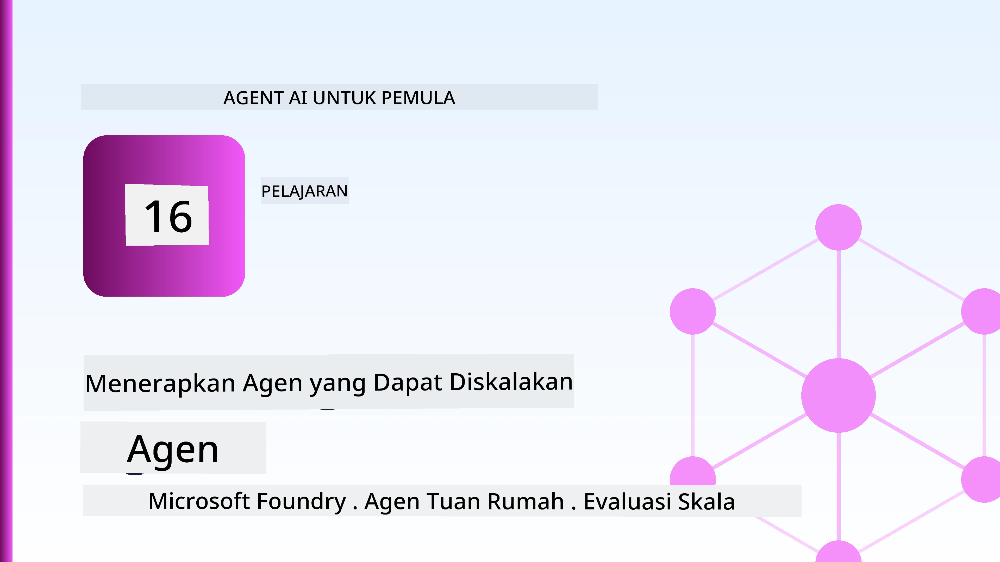
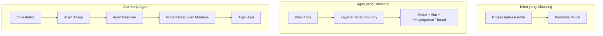
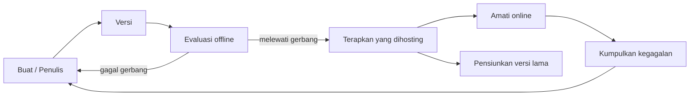
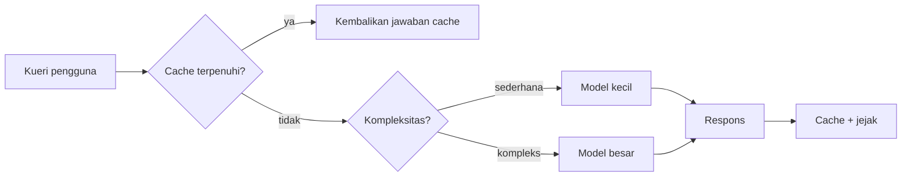
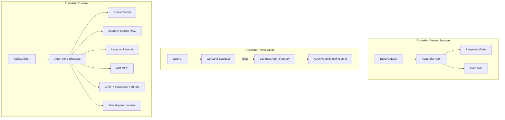

# Men-deploy Agen Skala Besar dengan Microsoft Foundry



Sampai titik ini dalam kursus, Anda telah membangun agen yang berjalan di laptop Anda, di dalam notebook, yang dijalankan dengan `az login` dan beberapa variabel lingkungan. Itu adalah cara yang tepat untuk belajar. Namun, itu bukan cara yang tepat untuk menjalankan agen yang diandalkan oleh ribuan pelanggan pada jam 3 pagi.

Pelajaran ini membahas jurang antara "berfungsi di mesin saya" dan "berfungsi dengan andal dan terjangkau di produksi." Kami menutup jurang itu menggunakan **Microsoft Foundry** dan **Microsoft Foundry Agent Service**, dengan membuat agen dukungan pelanggan nyata yang memiliki alat, pengambilan, memori, evaluasi, dan pemantauan.

## Pendahuluan

Pelajaran ini akan membahas:

- Perbedaan antara **agen prototipe** dan **agen yang dideploy**, serta mengapa transisi itu terutama terkait dengan segala sesuatu *di sekitar* model.
- **Pola deployment** untuk agen: hosted di klien, hosted sebagai layanan (Hosted Agents), dan workflow yang diorkestrasi.
- **Siklus hidup agen** di Microsoft Foundry — membuat, versi, deploy, evaluasi, amati, pensiun.
- **Strategi skala**: routing model, caching, konkurensi, dan desain tanpa status.
- **Observabilitas** dengan OpenTelemetry dan pelacakan Foundry.
- **Optimalisasi biaya** melalui pemilihan model, routing, dan gerbang evaluasi.
- **Pertimbangan enterprise**: tata kelola, persetujuan manusia, dan menjalankan server MCP dengan aman di produksi.

## Tujuan Pembelajaran

Setelah menyelesaikan pelajaran ini, Anda akan tahu cara:

- Memilih pola deployment yang tepat untuk beban kerja agen tertentu.
- Men-deploy agen ke Microsoft Foundry Agent Service sehingga agen itu memiliki versi, dikontrol, dan dapat diamati.
- Menginstrumentasi agen untuk pelacakan dan menghubungkan pipeline evaluasi yang dijalankan sebelum setiap rilis.
- Menerapkan routing model dan caching agar latensi dan biaya tetap terkendali dalam skala besar.
- Menambahkan gerbang persetujuan manusia untuk tindakan berisiko tinggi dan mengintegrasikan server MCP dengan cara yang aman untuk produksi.

## Prasyarat

Pelajaran ini mengasumsikan Anda telah menyelesaikan pelajaran sebelumnya dan merasa nyaman dengan:

- Membangun agen dengan [Microsoft Agent Framework](../14-microsoft-agent-framework/README.md) (Pelajaran 14).
- [Penggunaan Alat](../04-tool-use/README.md) (Pelajaran 4) dan [Agentic RAG](../05-agentic-rag/README.md) (Pelajaran 5).
- [Memori Agen](../13-agent-memory/README.md) (Pelajaran 13) dan [Protokol Agentic / MCP](../11-agentic-protocols/README.md) (Pelajaran 11).
- [Observabilitas dan Evaluasi](../10-ai-agents-production/README.md) (Pelajaran 10) — pelajaran ini dibangun langsung dari sana.

Anda juga akan membutuhkan:

- **Langganan Azure** dan **proyek Microsoft Foundry** dengan setidaknya satu model chat yang telah dideploy.
- **Azure CLI** yang sudah diautentikasi (`az login`).
- Python 3.12+ dan paket-paket dalam repository [`requirements.txt`](../../../requirements.txt).

## Dari Prototipe ke Produksi: Apa yang Sebenarnya Berubah

Agen prototipe dan agen produksi memiliki loop inti yang sama — berpikir, memanggil alat, merespon. Yang berubah adalah semua yang membungkus loop itu. Model mungkin 20% dari agen produksi; 80% lainnya adalah kerangka operasional.

| Perhatian | Prototipe | Produksi |
| --- | --- | --- |
| **Hosting** | Berjalan di notebook Anda | Berjalan sebagai layanan hosted, versi dan diluncurkan secara bertahap |
| **Identitas** | Token `az login` Anda | Identitas terkelola dengan RBAC terjangkau |
| **Status** | Dalam memori, hilang saat restart | Eksternal (penyimpanan thread, layanan memori) |
| **Kegagalan** | Anda melihat traceback | Melakukan retry, fallback, dead-letter, dan pemberitahuan |
| **Biaya** | "Beberapa sen" | Dipantau per permintaan, diarahkan, di-cache, dianggarkan |
| **Kualitas** | Anda periksa keluaran secara manual | Dievaluasi otomatis sebelum setiap rilis |
| **Kepercayaan** | Anda menyetujui setiap aksi | Kebijakan + manusia-dalam-loop untuk aksi berisiko |

Ingat tabel ini. Setiap bagian di bawah memetakan ke salah satu baris ini.

## Pola Deployment Agen

Ada tiga pola yang akan Anda gunakan, sering kali secara kombinasi.

### 1. Agen Hosted di Klien

Objek agen hidup di dalam proses aplikasi *Anda*. Kode Anda memanggil penyedia model langsung; loop reasoning berjalan di layanan Anda. Ini yang sudah dilakukan pada pelajaran sebelumnya.

- **Gunakan ketika** Anda membutuhkan kontrol penuh atas loop, middleware kustom, atau menyematkan agen di backend yang sudah ada.
- **Trade-off**: Anda sendiri yang mengelola skala, status, dan ketahanan.

### 2. Agen Hosted (Foundry Agent Service)

Agen didaftarkan sebagai *resource* di Microsoft Foundry. Foundry meng-hosting loop reasoning, menyimpan thread, menerapkan keamanan konten dan RBAC, dan membuat agen terlihat di portal Foundry. Aplikasi Anda menjadi klien ringan yang membuat thread dan membaca respon.

- **Gunakan ketika** Anda menginginkan daya tahan, observabilitas built-in, tata kelola, dan area operasi yang lebih kecil.
- **Trade-off**: kontrol tingkat rendah berkurang sebagai gantinya runtime yang dikelola.

### 3. Workflow Agen

Banyak agen (dan alat) dirangkai menjadi grafik dengan alur kontrol eksplisit — langkah berurutan, cabang, node persetujuan manusia, dan checkpoint yang tahan lama yang bisa dijeda dan dilanjutkan. Ini adalah kemampuan Microsoft Agent Framework **Workflows** yang diterapkan dalam skala deployment.

- **Gunakan ketika** satu tugas mencakup beberapa agen khusus atau memerlukan langkah persetujuan di tengah.
- **Trade-off**: lebih banyak bagian yang bergerak; perlu observabilitas tingkat orkestrasi.



## Siklus Hidup Agen di Microsoft Foundry

Men-deploy agen bukan satu kali `push`. Itu adalah loop, dan sangat mirip siklus rilis perangkat lunak karena memang itu yang terjadi.



Ide kunci, diambil dari [Pelajaran 10](../10-ai-agents-production/README.md): **evaluasi offline adalah gerbang, bukan pemikiran sesudahnya.** Versi baru agen tidak dirilis jika tidak melewati ambang evaluasi Anda. Observabilitas online kemudian memberikan kegagalan dunia nyata ke set pengujian offline Anda. Ini adalah seluruh loop.

## Strategi Skala

Menskalakan agen berbeda dari menskalakan API web tanpa status, karena setiap permintaan dapat memicu beberapa panggilan model dan alat yang mahal. Empat teknik memikul sebagian besar beban.

**Penanganan permintaan tanpa status.** Jangan menyimpan status per pengguna di memori proses Anda. Simpan thread percakapan di Foundry thread store atau layanan memori sehingga instance mana pun dapat menangani permintaan apa pun. Ini memungkinkan Anda menskalakan secara horizontal — menambah instance, tanpa sesi lengket.

**Routing model.** Tidak setiap permintaan membutuhkan model paling canggih (dan paling mahal) Anda. Rute permintaan sederhana — klasifikasi intent, jawaban fakta singkat — ke model kecil dan cepat, dan reservasi model besar untuk reasoning asli. Foundry **Model Router** dapat melakukan ini untuk Anda, atau Anda bisa membuat klasifikasi ringan sendiri. Anda akan membuat versi DIY di lab.

**Caching respons.** Banyak kueri dukungan hampir duplikat ("bagaimana saya mereset kata sandi?"). Cache jawaban untuk pertanyaan umum dan layani tanpa memanggil model sama sekali. Bahkan tingkat cache yang sederhana secara signifikan mengurangi biaya dan latensi.

**Konkurensi dan tekanan balik.** Penyedia model memiliki batasan laju. Batasi konkurensi Anda, gunakan retry dengan backoff eksponensial, dan gagal secara anggun (respon antrean "kami sedang mengerjakan" mengalahkan 500).



## Observabilitas di Produksi

Anda tidak bisa mengoperasikan apa yang tidak Anda lihat. Seperti yang dibahas di Pelajaran 10, Microsoft Agent Framework mengeluarkan jejak **OpenTelemetry** secara native — setiap panggilan model, pemanggilan alat, dan langkah orkestrasi menjadi span. Di produksi, Anda ekspor span ke Microsoft Foundry (atau backend kompatibel OTel lainnya) sehingga Anda bisa:

- Melacak keluhan pelanggan satu-satu secara menyeluruh di seluruh panggilan model dan alat.
- Memantau latensi p50/p95 dan biaya per permintaan dari waktu ke waktu.
- Memberi peringatan lonjakan tingkat kesalahan dan anomali biaya sebelum pengguna Anda (atau tim keuangan Anda) menyadarinya.

```python
from agent_framework.observability import get_tracer

tracer = get_tracer()

with tracer.start_as_current_span("support_request") as span:
    span.set_attribute("customer.tier", "enterprise")
    span.set_attribute("routed.model", "gpt-4.1-mini")
    # eksekusi agen dilacak secara otomatis di dalam rentang ini
```

Atribut seperti `customer.tier` dan `routed.model` mengubah dinding jejak menjadi pertanyaan yang bisa dijawab ("apakah pelanggan enterprise terlalu sering diarahkan ke model kecil?").

## Optimalisasi Biaya

Biaya pada agen produksi didominasi oleh token. Tiga tuas, berurutan berdasarkan dampaknya:

1. **Ukuran model yang tepat.** Model kecil yang lolos gerbang evaluasi hampir selalu lebih murah daripada model besar yang juga lolos. Gunakan evaluasi untuk *membuktikan* model kecil cukup baik daripada default ke model terbesar sebagai kehati-hatian.
2. **Rute berdasarkan kompleksitas.** Seperti di atas — bayar harga model besar hanya untuk permintaan yang membutuhkan reasoning model besar.
3. **Cache secara agresif.** Panggilan model termurah adalah yang tidak pernah Anda lakukan.

Gerbang evaluasi dan pengendalian biaya adalah disiplin yang sama dilihat dari dua sisi: evaluasi memberi Anda *lantai kualitas*, routing dan caching menjaga Anda sedekat mungkin dengan *biaya* lantai itu.

## Pertimbangan Deployment Enterprise

**Tata kelola.** Hosted Agents mewarisi RBAC, keamanan konten, dan audit logging Foundry. Beri setiap agen identitas terkelola dengan hak minimum yang diperlukan — akses baca saja ke basis pengetahuan, akses terbatas ke API tiket, tidak lebih.

**Manusia dalam loop.** Beberapa tindakan terlalu penting untuk diotomasi sepenuhnya — mengeluarkan pengembalian dana, menghapus akun, eskalasi ke tim hukum. Microsoft Agent Framework mendukung alat **dengan persetujuan diperlukan**: agen mengusulkan aksi, eksekusi dijeda, manusia menyetujui atau menolak, dan workflow dilanjutkan. Anda melihat primitif ini di [Pelajaran 6](../06-building-trustworthy-agents/README.md); sekarang Anda deploy.

**MCP di produksi.** [MCP](../11-agentic-protocols/README.md) memungkinkan agen Anda mengkonsumsi alat eksternal melalui interface standar. Di produksi, perlakukan setiap server MCP sebagai batas tidak dipercaya: pasang versi server, jalankan dengan identitas terjangkau, validasi outputnya, dan jangan pernah membocorkan rahasia kepadanya. Server MCP adalah dependensi, dan dependensi perlu dipatch, diaudit, dan dibatasi laju-nya.



Ketiga diagram itu — pengembangan, deployment, runtime — adalah agen yang sama di tiga tahap hidupnya. Lab berikutnya akan memandu Anda membangunnya.

## Lab Praktik: Agen Dukungan Pelanggan Siap Produksi

Buka [`code_samples/16-python-agent-framework.ipynb`](./code_samples/16-python-agent-framework.ipynb) dan kerjakan dari awal hingga akhir. Anda akan merakit **agen dukungan pelanggan Contoso** dengan setiap perhatian produksi dimasukkan:

1. **Pemanggilan alat** — mencari status pesanan dan membuka tiket dukungan.
2. **RAG** — menjawab pertanyaan kebijakan dari basis pengetahuan (Azure AI Search, dengan fallback dalam memori agar notebook bisa jalan tanpa resource Search).
3. **Memori** — mengingat pelanggan sepanjang percakapan berlangsung.
4. **Routing model** — classifier kompleksitas mengarahkan setiap permintaan ke model kecil atau besar.
5. **Caching respons** — pertanyaan yang diulang disajikan dari cache.
6. **Persetujuan manusia** — pengembalian dana di atas ambang batas dijeda untuk tanda tangan manusia.
7. **Pipeline evaluasi** — set tes offline kecil menilai agen dan bertindak sebagai gerbang rilis.
8. **Observabilitas** — pelacakan OpenTelemetry di sekitar setiap permintaan.

### Penjelasan Langkah-Langkah

Notebook diatur agar setiap perhatian produksi adalah bagian mandiri yang bisa dijalankan sendiri. Intinya adalah penangkap permintaan routing-plus-caching:

```python
async def handle_support_request(query: str, customer_id: str) -> str:
    # 1. Sajikan dari cache ketika kita bisa.
    cached = response_cache.get(normalize(query))
    if cached:
        return cached

    # 2. Rute berdasarkan kompleksitas untuk mengontrol biaya.
    model = "gpt-4.1-mini" if is_simple(query) else "gpt-4.1"

    # 3. Jalankan agen di dalam rentang jejak untuk observabilitas.
    with tracer.start_as_current_span("support_request") as span:
        span.set_attribute("routed.model", model)
        span.set_attribute("customer.id", customer_id)
        response = await support_agent.run(query, model=model)

    # 4. Cache dan kembalikan.
    response_cache.set(normalize(query), response.text)
    return response.text
```

Gerbang evaluasi yang menjaga rilis terlihat seperti ini:

```python
async def evaluation_gate(agent, test_cases, threshold: float = 0.8) -> bool:
    passed = 0
    for case in test_cases:
        result = await agent.run(case["input"])
        if score_response(result.text, case["expected"]) >= 0.8:
            passed += 1
    pass_rate = passed / len(test_cases)
    print(f"Evaluation pass rate: {pass_rate:.0%} (gate: {threshold:.0%})")
    return pass_rate >= threshold  # hanya deploy jika gerbang lolos
```

Baca setiap baris — notebook menjaga primitives secara sengaja kecil agar tidak ada yang tersembunyi di balik panggilan framework.

## Validasi Agen yang Dideploy dengan Smoke Test

Gerbang evaluasi di atas dijalankan *offline* terhadap objek agen Anda. Setelah agen dideploy sebagai Hosted Agent, Anda butuh satu pengecekan lagi, yang lebih murah: **apakah endpoint deployed benar-benar menjawab?**

Deploy "berhasil" hanya membuktikan control plane menerima definisi — tidak membuktikan agen merespon. Dependensi yang hilang, routing model yang salah, atau koneksi yang kadaluwarsa dapat meninggalkan deployment hijau yang tidak mengembalikan apa pun. **Smoke test** menangkap itu dalam hitungan detik, pada setiap deploy, tanpa biaya evaluasi penuh.

Repository ini menyediakan pipeline smoke-test siap pakai yang dibangun di atas [AI Smoke Test](https://github.com/marketplace/actions/ai-smoke-test) GitHub Action:

- **Katalog** — [`tests/lesson-16-smoke-tests.json`](../../../tests/lesson-16-smoke-tests.json) berisi prompt dan asersi untuk agen dukungan Contoso (jawaban kebijakan berlandaskan, pencarian pesanan, tetap pada topik, dan kontinuitas thread multi-putaran). Katalog untuk agen pelajaran lain ada di sampingnya — lihat [`tests/README.md`](../tests/README.md).
- **Workflow** — [`.github/workflows/smoke-test.yml`](../../../.github/workflows/smoke-test.yml) login dengan Azure OIDC dan POST setiap prompt ke endpoint Responses agen, dan gagal jika ada asersi yang tidak terpenuhi.

```yaml
- name: Smoke-test hosted agent
  uses: JFolberth/ai-smoketest@v1
  with:
    project_endpoint: ${{ inputs.project_endpoint }}
    agent_name: ContosoSupportAgent
    tests_file: tests/lesson-16-smoke-tests.json
```


Jalankan dari tab **Actions** setelah agen Anda dideploy, dengan memasukkan endpoint proyek Foundry dan nama agen Anda. Identitas terfederasi memerlukan peran **Azure AI User** pada lingkup proyek Foundry. Pikirkan lapisan-lapisan ini seperti piramida: tes asap (dapat dijangkau dan merespons?) dijalankan pada setiap deploy, evaluasi offline (cukup baik untuk dikirim ke produksi?) dijalankan sebelum promosi, dan evaluasi online (bagaimana performanya di lapangan?) dijalankan secara terus-menerus.

## Pemeriksaan Pengetahuan

Uji pemahaman Anda sebelum melanjutkan ke tugas.

**1. Perkiraan seberapa besar bagian dari agen produksi adalah "model," dan apa sisanya?**

<details>
<summary>Jawaban</summary>

Model adalah bagian kecil dari sistem — sering disebut sekitar 20%. Sisanya adalah rangka operasional: hosting dan pengelolaan versi, identitas dan RBAC, status yang dieksternalisasi, penanganan kegagalan, pelacakan biaya, evaluasi, dan kontrol human-in-the-loop. Perpindahan ke produksi sebagian besar tentang membangun semuanya *di sekitar* loop penalaran.
</details>

**2. Kapan Anda memilih Hosted Agent dibandingkan agen yang dihosting oleh klien?**

<details>
<summary>Jawaban</summary>

Ketika Anda menginginkan runtime yang dikelola dengan daya tahan bawaan (thread yang bertahan dan dapat dilanjutkan), observabilitas, keamanan konten, dan RBAC, serta Anda bersedia mengorbankan sebagian kontrol tingkat rendah atas loop penalaran demi mengurangi area operasional. Hosted oleh klien lebih disukai ketika Anda membutuhkan kontrol penuh atas loop atau menanamkan agen dalam backend yang sudah ada.
</details>

**3. Mengapa agen yang dapat diskalakan harus tidak menyimpan status di memori prosesnya sendiri?**

<details>
<summary>Jawaban</summary>

Agar setiap instance dapat menangani permintaan apa pun, yang memungkinkan skala horizontal tanpa sesi lengket. Status percakapan per pengguna dieksternalisasi ke penyimpanan thread atau layanan memori. Jika status disimpan di memori proses, Anda akan kehilangannya saat restart dan tidak bisa mendistribusikan beban secara bebas.
</details>

**4. Masalah apa yang diselesaikan oleh pengaturan routing model, dan bagaimana kaitannya dengan evaluasi?**

<details>
<summary>Jawaban</summary>

Routing mengirim permintaan sederhana ke model yang kecil, murah, dan cepat serta menyisihkan model besar untuk penalaran sesungguhnya, mengendalikan latensi dan biaya. Ini berhubungan dengan evaluasi karena evaluasi adalah apa yang *membuktikan* bahwa model kecil cukup baik untuk kelas permintaan tertentu — routing tanpa evaluasi adalah menebak.
</details>

**5. Apa itu "evaluation gate" dan di mana letaknya dalam siklus hidup?**

<details>
<summary>Jawaban</summary>

Evaluation gate menjalankan set tes offline terhadap versi agen baru dan menghalangi deploy kecuali tingkat lulus melewati ambang batas. Ini berada antara "versi" dan "deploy" dalam siklus hidup, menjadikan kualitas sebagai prasyarat rilis daripada sesuatu yang diperiksa setelah pengiriman.
</details>

**6. Mengapa server MCP harus dianggap sebagai batas yang tidak terpercaya dalam produksi?**

<details>
<summary>Jawaban</summary>

Karena itu adalah dependensi eksternal yang dipanggil agen Anda. Anda harus menetapkan versinya, menjalankannya dengan identitas terbatas, memvalidasi outputnya, membatasi kecepatannya, dan tidak pernah mengekspos rahasia kepadanya — disiplin yang sama seperti menangani dependensi pihak ketiga. Outputnya mengalir ke dalam penalaran agen Anda, jadi kepercayaan yang tidak tervalidasi adalah risiko keamanan.
</details>

**7. Perubahan tunggal apa yang biasanya memiliki dampak terbesar pada biaya agen produksi, dan mengapa?**

<details>
<summary>Jawaban</summary>

Menyesuaikan ukuran model — menggunakan model terkecil yang masih lulus evaluation gate Anda. Biaya didominasi oleh token, dan model lebih kecil yang memenuhi standar kualitas hampir selalu lebih murah daripada model yang lebih besar. Caching dan routing kemudian mengurangi biaya lebih lanjut, tapi memilih model dasar yang tepat memiliki efek orde pertama terbesar.
</details>

**8. Peran atribut span seperti `customer.tier` dan `routed.model` dalam observabilitas?**

<details>
<summary>Jawaban</summary>

Mereka mengubah jejak mentah menjadi pertanyaan bisnis yang bisa dijawab. Tanpa atribut, Anda hanya memiliki dinding span; dengan atribut tersebut Anda dapat bertanya "apakah pelanggan enterprise terlalu sering dialihkan ke model kecil?" atau "model mana yang menangani permintaan paling lambat kami?" Atribut adalah cara Anda memotong telemetri berdasarkan dimensi yang penting untuk operasi Anda.
</details>

## Tugas

Ambil agen dukungan pelanggan dari lab dan perkuat untuk skenario khusus: **agen dukungan tagihan langganan untuk perusahaan SaaS.**

Pengajuan Anda harus:

1. **Ganti alat** dengan yang relevan untuk penagihan: `get_subscription_status`, `get_invoice`, dan `issue_credit` (kredit di atas $50 memerlukan persetujuan manusia).
2. **Tambahkan tiga dokumen RAG** yang mencakup kebijakan pengembalian perusahaan, siklus penagihan, dan kebijakan pembatalan.
3. **Perluas set evaluasi** menjadi minimal delapan kasus, termasuk minimal dua yang *harus* memicu jalur persetujuan manusia, dan konfirmasi evaluation gate Anda lulus atau gagal dengan benar.
4. **Tambahkan satu laporan biaya**: setelah menjalankan sepuluh kueri campuran melalui agen, cetak berapa banyak yang menuju model kecil, berapa banyak ke model besar, dan berapa banyak yang dilayani dari cache.

Tulis paragraf singkat (di sel markdown) yang menjelaskan aturan routing model yang Anda pilih dan bagaimana Anda akan memvalidasinya dengan lalu lintas nyata. Tidak ada jawaban benar tunggal — Anda akan dinilai berdasarkan apakah kekhawatiran produksi terhubung secara koheren.

## Ringkasan

Dalam pelajaran ini Anda memindahkan agen dari prototipe ke produksi dengan Microsoft Foundry:

- Loncat ke produksi sebagian besar tentang **rangka operasional** di sekitar model — hosting, identitas, status, penanganan kegagalan, biaya, kualitas, dan kepercayaan.
- Anda mempelajari tiga **pola penerapan** — klien-hosted, Hosted Agents, dan Agent Workflows — dan kapan masing-masing cocok.
- Anda mengikuti **siklus hidup agen**, di mana evaluasi offline **bertindak sebagai gerbang rilis** dan observabilitas online mengembalikan kegagalan ke set tes.
- Anda menerapkan **strategi skala** — desain tanpa status, routing model, caching, dan concurrency terbatas — dan menghubungkannya ke **optimasi biaya**.
- Anda memasangkan **kontrol perusahaan**: RBAC, persetujuan human-in-the-loop, dan integrasi MCP yang aman untuk produksi.
- Anda membangun **agen dukungan pelanggan siap produksi** yang mengikat semua kekhawatiran ini ke kode yang dapat dijalankan.

Pelajaran berikutnya melakukan perjalanan sebaliknya: alih-alih memperbesar agen ke cloud, Anda akan membawanya *turun* ke satu mesin pengembang dan menjalankannya sepenuhnya secara lokal.

## Sumber Daya Tambahan

- <a href="https://learn.microsoft.com/azure/ai-foundry/what-is-azure-ai-foundry" target="_blank">Dokumentasi Microsoft Foundry</a>
- <a href="https://learn.microsoft.com/azure/ai-foundry/agents/overview" target="_blank">Ikhtisar Microsoft Foundry Agent Service</a>
- <a href="https://aka.ms/ai-agents-beginners/agent-framework" target="_blank">Microsoft Agent Framework</a>
- <a href="https://learn.microsoft.com/azure/ai-foundry/concepts/model-router" target="_blank">Model Router di Microsoft Foundry</a>
- <a href="https://learn.microsoft.com/azure/search/search-what-is-azure-search" target="_blank">Azure AI Search</a>
- <a href="https://opentelemetry.io/" target="_blank">OpenTelemetry</a>
- <a href="https://github.com/marketplace/actions/ai-smoke-test" target="_blank">AI Smoke Test GitHub Action</a>
- <a href="https://modelcontextprotocol.io/" target="_blank">Model Context Protocol (MCP)</a>

## Pelajaran Sebelumnya

[Membangun Agen Penggunaan Komputer (CUA)](../15-browser-use/README.md)

## Pelajaran Berikutnya

[Membuat Agen AI Lokal](../17-creating-local-ai-agents/README.md)

---

<!-- CO-OP TRANSLATOR DISCLAIMER START -->
**Penafian**:
Dokumen ini telah diterjemahkan menggunakan layanan terjemahan AI [Co-op Translator](https://github.com/Azure/co-op-translator). Meskipun kami berupaya untuk mencapai akurasi, harap diketahui bahwa terjemahan otomatis mungkin mengandung kesalahan atau ketidakakuratan. Dokumen asli dalam bahasa aslinya harus dianggap sebagai sumber yang sah. Untuk informasi penting, disarankan menggunakan terjemahan profesional oleh manusia. Kami tidak bertanggung jawab atas kesalahpahaman atau penafsiran yang keliru yang timbul dari penggunaan terjemahan ini.
<!-- CO-OP TRANSLATOR DISCLAIMER END -->