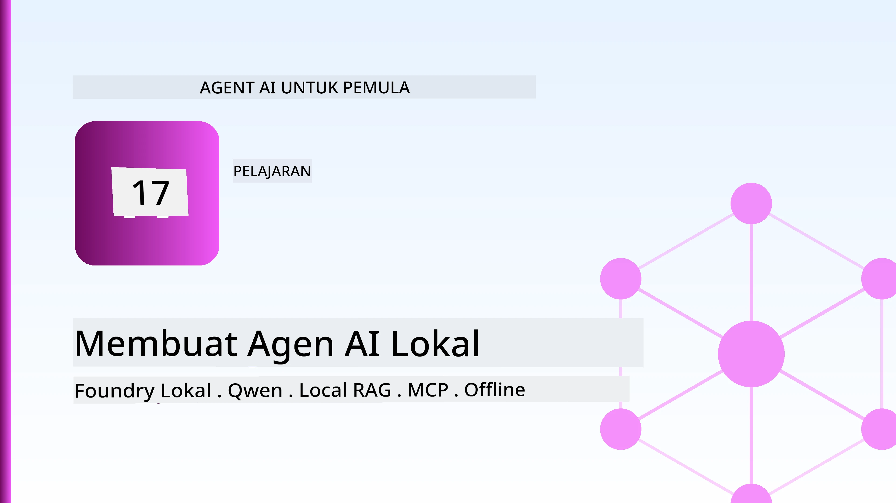
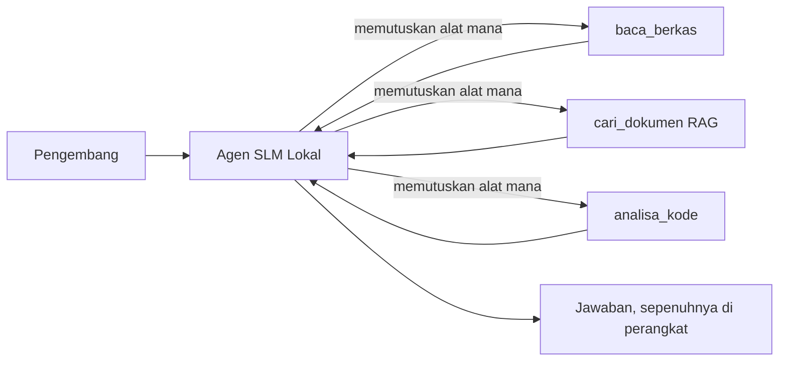
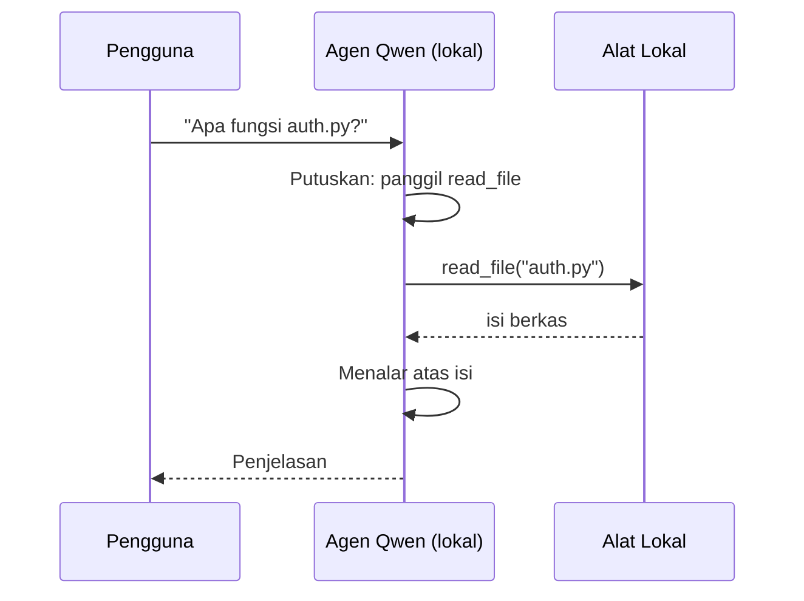
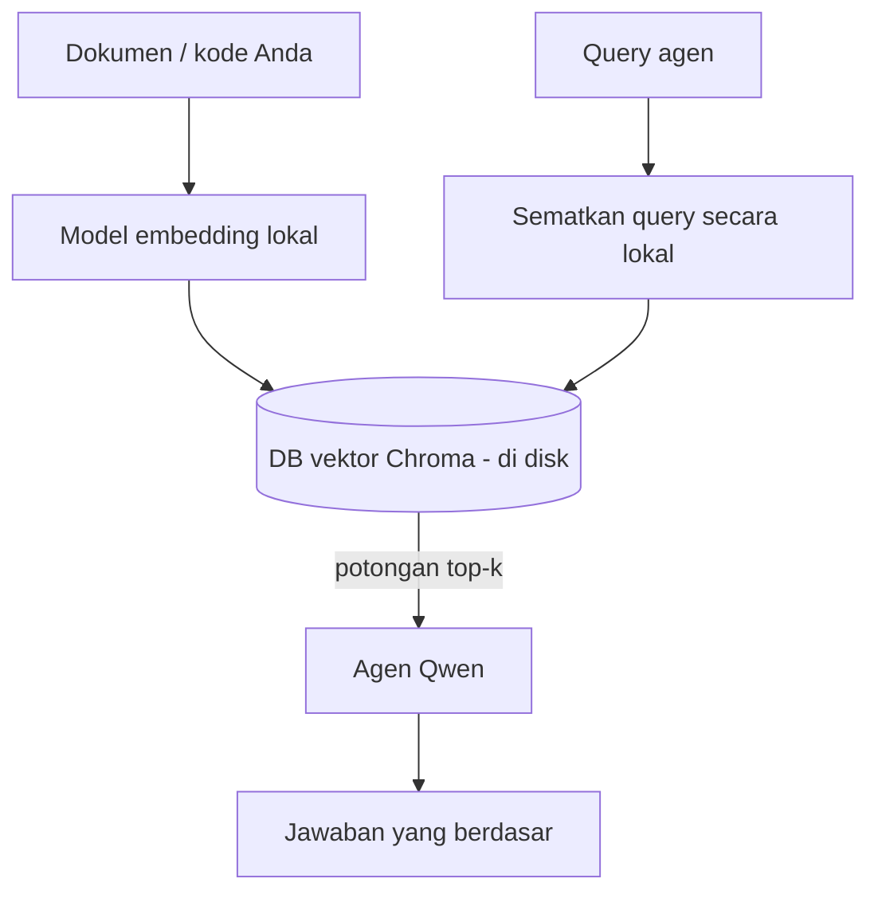
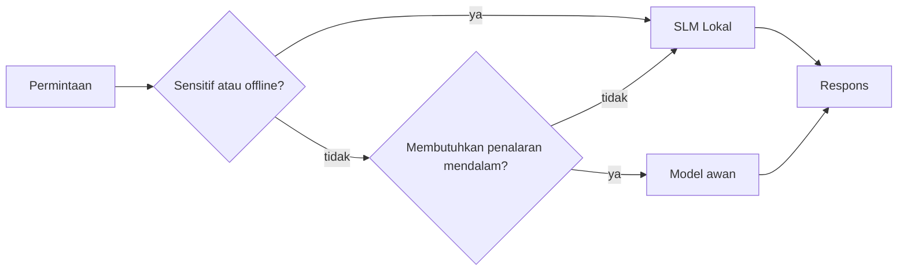

# Membuat Agen AI Lokal Menggunakan Microsoft Foundry Local dan Qwen



Pelajaran sebelumnya memperbesar agen ke *cloud*. Kali ini menurunkannya ke satu mesin saja. Pada akhir pelajaran, Anda akan memiliki asisten teknik yang berfungsi yang mampu bernalar, memanggil alat, membaca file, dan mencari dokumentasi Anda — **tanpa satu pun panggilan inferensi cloud.**

Mengapa Anda menginginkannya? Ada tiga alasan yang sering muncul dalam pekerjaan teknik nyata:

- **Privasi.** Kode dan dokumen tidak pernah meninggalkan mesin. Tidak ada prompt, tidak ada cuplikan, tidak ada data pelanggan yang melewati batas jaringan.
- **Biaya.** Inferensi lokal tidak memiliki biaya per-token. Anda bisa iterasi sepanjang hari dengan harga listrik saja.
- **Offline.** Di pesawat, di fasilitas aman, atau saat pemadaman, agen tetap bekerja.

Kekurangannya adalah Anda menukar model cloud frontier dengan **Small Language Model (SLM)** yang berjalan di CPU, GPU, atau NPU Anda. Pelajaran ini tentang membangun agen yang *baik* dalam batasan itu daripada pura-pura tidak ada batasan.

## Pendahuluan

Pelajaran ini akan membahas:

- **Small Language Models (SLM)** — apa itu, di mana keunggulannya, dan di mana kelemahannya.
- **Microsoft Foundry Local** — runtime yang mengunduh dan melayani model di perangkat melalui **API yang kompatibel dengan OpenAI**.
- **Model pemanggil fungsi Qwen** — SLM yang dapat menghasilkan panggilan alat yang andal, yang membuat agen lokal *bisa* (bukan hanya obrolan lokal).
- **Alat lokal, RAG lokal, dan MCP lokal** — memberikan kemampuan agen tanpa cloud.
- **Pola hibrida** — kapan menyimpan sesuatu secara lokal dan kapan menggunakan cloud.

## Tujuan Pembelajaran

Setelah menyelesaikan pelajaran ini, Anda akan tahu cara:

- Menjelaskan trade-off SLM dan memilih kasus penggunaan agen lokal yang tepat.
- Menyajikan model Qwen secara lokal dengan Foundry Local dan menghubungkannya melalui endpoint yang kompatibel dengan OpenAI.
- Membangun agen pemanggil alat yang berjalan sepenuhnya di workstation Anda.
- Menambahkan RAG lokal atas dokumen Anda menggunakan basis data vektor lokal (Chroma).
- Menghubungkan agen ke server MCP lokal dan mempertimbangkan desain lokal/hibrida cloud.

## Prasyarat

Pelajaran ini mengasumsikan Anda telah menyelesaikan pelajaran sebelumnya dan nyaman dengan:

- [Penggunaan Alat](../04-tool-use/README.md) (Pelajaran 4) dan [Agentic RAG](../05-agentic-rag/README.md) (Pelajaran 5).
- [Protokol Agentic / MCP](../11-agentic-protocols/README.md) (Pelajaran 11).
- [Microsoft Agent Framework](../14-microsoft-agent-framework/README.md) (Pelajaran 14).

Anda juga membutuhkan:

- Workstation pengembang. **8 GB RAM adalah minimum yang realistis**; 16 GB+ nyaman. GPU atau NPU membantu tetapi tidak wajib.
- **Microsoft Foundry Local** terinstal (lihat bagian setup di bawah).
- Python 3.12+ dan paket di repositori [`requirements.txt`](../../../requirements.txt), plus `foundry-local-sdk`, `openai`, dan `chromadb` untuk pelajaran ini.

## Small Language Models: Alat yang Tepat untuk Pekerjaan Lokal

Model cloud frontier mempunyai ratusan miliar parameter dan pusat data di belakangnya. SLM memiliki beberapa miliar parameter dan harus muat di RAM laptop Anda. Perbedaan itu menetapkan ekspektasi yang jelas.

**SLM unggul pada:**

- Tugas terstruktur dan terbatas — klasifikasi, ekstraksi, ringkasan dari dokumen yang dikenal.
- **Pemanggilan alat** — memutuskan fungsi mana yang dipanggil dan dengan argumen apa.
- Iterasi cepat, murah, dan privat pada data Anda sendiri.

**SLM kurang kuat pada:**

- Penalaran multi-langkah terbuka di konteks besar.
- Pengetahuan dunia luas (mereka melihat lebih sedikit dan lebih cepat lupa).

Strategi menang untuk agen lokal adalah: **biarkan SLM mengorkestrasi, dan biarkan alat mengerjakan tugas berat.** Model tidak perlu *mengetahui* kode Anda — hanya perlu tahu kapan memanggil `read_file` dan `search_docs`. Itu langsung memakai kekuatan SLM.



## Microsoft Foundry Local

**Microsoft Foundry Local** adalah runtime ringan yang mengunduh, mengelola, dan melayani model sepenuhnya di mesin Anda. Fitur terpenting bagi kami adalah menyediakan **endpoint HTTP yang kompatibel dengan OpenAI** — artinya SDK OpenAI dan klien OpenAI dari Microsoft Agent Framework dapat bekerja dengannya hanya dengan mengganti `base_url`. Semua yang Anda pelajari tentang membangun agen dapat langsung dipakai; hanya endpoint yang pindah dari cloud ke `localhost`.

Foundry Local juga memilih build model terbaik secara otomatis sesuai perangkat keras Anda — build CPU, CUDA/GPU, atau NPU — jadi Anda tidak perlu optimasi manual per mesin.

### Setup

Instal Foundry Local (lihat [dokumentasi](https://learn.microsoft.com/azure/ai-foundry/foundry-local/) untuk OS Anda), lalu pastikan berjalan:

```bash
# Instal (contoh; ikuti dokumentasi untuk platform Anda)
winget install Microsoft.FoundryLocal      # Windows
# brew install microsoft/foundrylocal/foundrylocal   # macOS

# Unduh dan jalankan model Qwen, kemudian mulai layanan lokal
foundry model run qwen2.5-7b-instruct
foundry service status
```

Setelah layanan berjalan Anda sudah memiliki endpoint lokal yang kompatibel OpenAI (biasanya `http://localhost:PORT/v1`). Notebook menggunakan `foundry-local-sdk` untuk menemukan endpoint otomatis, jadi Anda tidak perlu mengkodekan port secara statis.

## Pemanggilan Fungsi Qwen: Kenapa Penting

Agen hanya agen jika bisa memanggil alat. Banyak SLM bisa ngobrol tapi hasil panggilan alat sering tidak terpercaya dan salah bentuk. Model **Qwen** dilatih khusus untuk pemanggilan fungsi dan menghasilkan struktur panggilan alat yang bagus secara konsisten — ini yang mengubah model chat lokal menjadi agen *lokal*.

Alur kerjanya adalah loop pemanggilan alat standar yang sudah Anda kenal, hanya dijalankan di perangkat:



## RAG Lokal

Pencarian dokumentasi adalah tempat agen lokal berperan. Daripada berharap SLM menghafal dokumen framework Anda, Anda menyematkan dokumen itu ke dalam **basis data vektor lokal** dan membiarkan agen mengambil bagian yang relevan sesuai permintaan.

Kami memakai **Chroma**, penyimpanan vektor yang tertanam dan dijalankan dalam proses tanpa server. Alur lengkapnya lokal: model embedding lokal → vektor lokal → pengambilan lokal → SLM lokal.



Ini pola Agentic RAG yang sama seperti Pelajaran 5 — satu-satunya perubahan adalah setiap komponennya berjalan di mesin Anda.

## Server MCP Lokal

[MCP](../11-agentic-protocols/README.md) adalah transportasi, bukan layanan cloud. Server MCP bisa berjalan sebagai proses lokal di `stdio`, menyediakan alat kepada agen Anda lewat protokol standar. Ini memungkinkan Anda menggunakan ulang ekosistem server MCP yang terus berkembang — akses filesystem, operasi git, query database — sepenuhnya offline.

Sikap keamanan berbeda dari cloud, tapi bukan tidak ada: server MCP lokal berjalan dengan izin pengguna Anda, jadi batasi apa yang bisa diakses (misalnya folder proyek, bukan folder rumah seluruhnya) dan perlakukan keluaran sebagai masukan untuk divalidasi.

## Pola Hybrid Cloud-dan-Lokal

Prioritas lokal tidak berarti hanya lokal. Sistem matang mengarahkan berdasarkan sensitivitas dan kesulitan:

| Situasi | Tempat menjalankan |
| --- | --- |
| Kode/data sensitif, atau offline | **SLM Lokal** |
| Tugas sederhana, terbatas | **SLM Lokal** (murah, cepat) |
| Penalaran multi-langkah sulit pada data non-sensitif | **Model Cloud** |
| Semua tugas saat pemadaman | **SLM Lokal** (degradasi mulus) |

Ini mencerminkan konsep **routing model** dari Pelajaran 16 — kecuali salah satu "model" sekarang adalah mesin Anda sendiri. Desain tangguh kembali ke lokal saat cloud tidak tersedia, sehingga agen menurun kualitasnya daripada gagal total.



## Lab Praktik: Asisten Teknik Lokal

Buka [`code_samples/17-local-agent-foundry-local.ipynb`](./code_samples/17-local-agent-foundry-local.ipynb) dan kerjakan. Anda akan membangun **asisten teknik lokal** yang berjalan sepenuhnya di workstation Anda dan dapat:

1. **Memanggil alat** — lewat pemanggilan fungsi Qwen melalui Foundry Local.
2. **Melakukan operasi file lokal** — daftar dan baca file dalam folder proyek.
3. **Menganalisis kode** — laporkan metrik dasar pada file sumber.
4. **Mencari dokumentasi** — RAG lokal atas folder dokumen dengan Chroma.
5. **Menggunakan MCP** — hubungkan ke server MCP lokal (dengan skip mulus jika tidak dikonfigurasi).

Tidak ada inferensi cloud yang digunakan di titik manapun.

### Panduan Langkah demi Langkah

Asisten terhubung ke Foundry Local melalui endpoint kompatibel OpenAI, jadi kode agen hampir sama dengan pelajaran cloud — hanya klien yang diganti:

```python
from foundry_local import FoundryLocalManager
from openai import OpenAI

# Foundry Local menemukan/mengunduh model dan memberikan kami endpoint lokal.
manager = FoundryLocalManager(\"qwen2.5-7b-instruct\")
client = OpenAI(base_url=manager.endpoint, api_key=manager.api_key)  # api_key adalah placeholder lokal
```

Alat adalah fungsi Python biasa yang dibatasi pada folder proyek:

```python
def read_file(path: str) -> str:
    \"\"\"Read a file, but only inside the sandboxed project directory.\"\"\"
    full = (PROJECT_ROOT / path).resolve()
    if PROJECT_ROOT not in full.parents and full != PROJECT_ROOT:
        return \"Access denied: path is outside the project directory.\"
    return full.read_text(encoding=\"utf-8\")
```

Perhatikan pemeriksaan sandbox — meskipun lokal, alat yang membaca path sewenang-wenang berisiko. Notebook membatasi setiap alat di root proyek tunggal.

## Pemeriksaan Pengetahuan

Uji pemahaman Anda sebelum melanjutkan ke tugas.

**1. Berikan dua alasan konkret menjalankan agen secara lokal daripada di cloud.**

<details>
<summary>Jawaban</summary>

Dua dari: **privasi** (kode dan data tidak pernah keluar mesin), **biaya** (tidak ada tagihan per-token inferensi), dan **kemampuan offline** (bekerja tanpa jaringan — di pesawat, fasilitas aman, atau saat pemadaman). Kendala regulasi/compliance yang melarang pengiriman data keluar perangkat adalah pemicu umum alasan privasi.
</details>

**2. Bagaimana pembagian kerja yang direkomendasikan antara SLM dan alatnya dalam agen lokal, dan mengapa?**

<details>
<summary>Jawaban</summary>

Biarkan SLM **mengorkestrasi** (memutuskan alat mana yang dipanggil dan dengan argumen apa) dan biarkan **alat mengerjakan tugas berat** (membaca file, mengambil dokumen, menghitung hasil). SLM kuat dalam keputusan terbatas seperti pemilihan alat tapi lemah dalam pengetahuan luas dan penalaran multi-langkah panjang, jadi bergantung pada alat memanfaatkan kekuatannya.
</details>

**3. Apa yang memungkinkan penggunaan ulang kode agen cloud dengan Foundry Local?**

<details>
<summary>Jawaban</summary>

Foundry Local menyediakan **endpoint HTTP yang kompatibel dengan OpenAI**. SDK OpenAI dan klien OpenAI Framework Agen bekerja dengan itu hanya dengan mengganti `base_url` (dan menggunakan API key placeholder lokal). Semua kode agen lain tetap sama.
</details>

**4. Mengapa kita khususnya menggunakan model pemanggil fungsi Qwen daripada sembarang SLM?**

<details>
<summary>Jawaban</summary>

Karena agen harus menghasilkan **panggilan alat** yang andal dan bagus bentuknya. Banyak SLM bisa ngobrol tapi mengeluarkan struktur panggilan alat yang salah atau tidak konsisten. Model Qwen dilatih khusus untuk pemanggilan fungsi dan menghasilkan panggilan alat yang konsisten, yang membuat model chat lokal menjadi agen lokal yang berfungsi.
</details>

**5. Dalam pipeline RAG lokal, komponen mana saja yang berjalan di mesin?**

<details>
<summary>Jawaban</summary>

Semuanya: model embedding, basis data vektor (Chroma, di disk), langkah pengambilan, dan SLM. Dokumen disematkan secara lokal, disimpan secara lokal, diambil secara lokal, dan diproses oleh model lokal — tidak ada komponen yang menyentuh cloud.
</details>

**6. Server MCP lokal berjalan di mesin Anda. Apakah itu otomatis aman? Apa tindakan pencegahan yang harus Anda ambil?**

<details>
<summary>Jawaban</summary>

Tidak. Server MCP lokal berjalan dengan izin pengguna Anda, jadi bisa mengakses apa yang Anda bisa akses. Batasi pada yang dibutuhkan (misalnya folder proyek tunggal bukan seluruh folder rumah) dan perlakukan outputnya sebagai masukan untuk divalidasi sebelum dipakai.
</details>

**7. Jelaskan aturan routing hybrid yang masuk akal yang memasukkan model lokal.**

<details>
<summary>Jawaban</summary>

Arahkan permintaan sensitif atau offline ke SLM lokal; tugas sederhana terbatas ke SLM lokal untuk kecepatan dan biaya; penalaran multi-langkah sulit pada data non-sensitif ke model cloud; dan fallback ke SLM lokal jika cloud tidak tersedia agar agen menurun mulus, bukan gagal total. Ini adalah routing model (Pelajaran 16) dengan mesin lokal sebagai salah satu model.
</details>

**8. Berapakah angka RAM minimum realistis untuk menjalankan agen lokal di pelajaran ini, dan apa keuntungan RAM lebih banyak?**

<details>
<summary>Jawaban</summary>

Sekitar **8 GB** adalah minimum realistis; 16 GB+ nyaman. RAM lebih banyak memungkinkan Anda menjalankan model yang lebih besar dan lebih mumpuni serta menyimpan lebih banyak konteks di memori. GPU atau NPU mempercepat inferensi tapi tidak wajib — Foundry Local memilih build CPU saat akselerator tidak tersedia.
</details>

## Tugas

Kembangkan asisten teknik lokal menjadi **peninjau dokumentasi lokal** untuk proyek kecil pilihan Anda (gunakan salah satu folder pelajaran repo ini bila suka).

Kiriman Anda harus:

1. **Mengindeks folder dokumen/kode nyata** ke Chroma (setidaknya lima file).
2. **Menambahkan alat `find_todos`** yang memindai proyek mencari komentar `TODO`/`FIXME` dan mengembalikannya dengan file dan nomor baris — tetap dengan pemeriksaan sandbox sama seperti `read_file`.

3. **Tanyakan tiga pertanyaan kepada agen** yang memaksanya menggabungkan alat: satu pertanyaan RAG murni, satu yang memerlukan membaca file tertentu, dan satu yang memerlukan menemukan TODO.
4. **Ukur waktu**: waktukan masing-masing dari tiga respons tersebut dan catat di sel markdown. Berikan komentar apakah latensi tersebut dapat diterima untuk alur kerja yang Anda tuju.

Kemudian tulis paragraf singkat tentang **apa yang akan Anda pindahkan ke cloud dan apa yang akan Anda simpan secara lokal** untuk peninjau ini, dan mengapa. Anda dinilai apakah komponen lokal terhubung dengan benar dan apakah alasan hibrida Anda masuk akal — bukan pada kualitas model.

## Ringkasan

Dalam pelajaran ini Anda membangun agen yang berjalan sepenuhnya di mesin Anda sendiri:

- **SLMs** menukar keluasan dengan privasi, biaya, dan operasi offline — dan unggul ketika mereka **mengorkestrasi alat** daripada membawa semua pengetahuan sendiri.
- **Foundry Local** melayani model di perangkat di belakang **endpoint yang kompatibel dengan OpenAI**, sehingga kode agen cloud Anda dapat dipindahkan dengan satu baris perubahan.
- **Model pemanggil fungsi Qwen** memungkinkan pemanggilan alat lokal yang dapat diandalkan — dan dengan demikian *agen* lokal — menjadi mungkin.
- **Local RAG** (Chroma) dan **MCP lokal** memberikan kemampuan agen tanpa meninggalkan mesin.
- **Pola hibrida** memungkinkan Anda mengarahkan berdasarkan sensitivitas dan kesulitan, dengan lokal sebagai cadangan yang elegan.

Ini menyelesaikan lengkungan penerapan: Pelajaran 16 memperbesar agen ke Microsoft Foundry, dan pelajaran ini memperkecilnya ke satu workstation. Pelajaran berikutnya membahas menjaga keamanan agen yang diterapkan.

## Sumber Tambahan

- <a href="https://learn.microsoft.com/azure/ai-foundry/foundry-local/" target="_blank">Dokumentasi Microsoft Foundry Local</a>
- <a href="https://learn.microsoft.com/azure/ai-foundry/what-is-azure-ai-foundry" target="_blank">Dokumentasi Microsoft Foundry</a>
- <a href="https://aka.ms/ai-agents-beginners/agent-framework" target="_blank">Microsoft Agent Framework</a>
- <a href="https://qwen.readthedocs.io/en/latest/framework/function_call.html" target="_blank">Dokumentasi pemanggilan fungsi Qwen</a>
- <a href="https://modelcontextprotocol.io/" target="_blank">Model Context Protocol (MCP)</a>
- <a href="https://docs.trychroma.com/" target="_blank">Basis data vektor Chroma</a>

## Pelajaran Sebelumnya

[Menerapkan Agen yang Dapat Diskalakan](../16-deploying-scalable-agents/README.md)

## Pelajaran Berikutnya

[Mengamankan Agen AI](../18-securing-ai-agents/README.md)

---

<!-- CO-OP TRANSLATOR DISCLAIMER START -->
**Penafian**:
Dokumen ini telah diterjemahkan menggunakan layanan terjemahan AI [Co-op Translator](https://github.com/Azure/co-op-translator). Meskipun kami berupaya untuk mencapai akurasi, harap diketahui bahwa terjemahan otomatis mungkin mengandung kesalahan atau ketidakakuratan. Dokumen asli dalam bahasa aslinya harus dianggap sebagai sumber yang sah. Untuk informasi penting, disarankan menggunakan terjemahan profesional oleh manusia. Kami tidak bertanggung jawab atas kesalahpahaman atau penafsiran yang keliru yang timbul dari penggunaan terjemahan ini.
<!-- CO-OP TRANSLATOR DISCLAIMER END -->