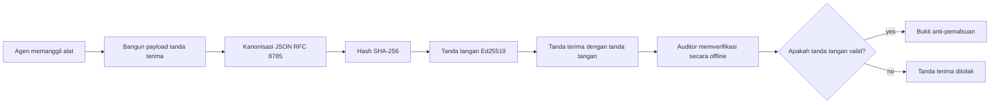
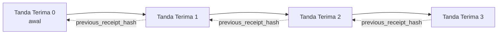

[Tonton video pelajaran: Mengamankan Agen AI dengan Resi Kriptografi](https://youtu.be/PLACEHOLDER_VIDEO_ID)

> _(Video pelajaran dan thumbnail akan ditambahkan oleh tim konten Microsoft setelah penggabungan, sesuai pola pelajaran 14 / 15.)_

# Mengamankan Agen AI dengan Resi Kriptografi

## Pendahuluan

Pelajaran ini akan membahas:

- Mengapa jejak audit untuk agen AI penting untuk kepatuhan, debugging, dan kepercayaan.
- Apa itu resi kriptografi dan bagaimana perbedaannya dengan baris log yang tidak ditandatangani.
- Bagaimana cara menghasilkan resi bertanda tangan untuk panggilan alat agen dalam Python biasa.
- Bagaimana memverifikasi resi secara offline dan mendeteksi manipulasi.
- Bagaimana menghubungkan rantai resi sehingga penghapusan atau pengurutan ulang satu resi merusak rantai tersebut.
- Apa yang dibuktikan oleh resi dan apa yang secara eksplisit tidak dibuktikan.

## Tujuan Pembelajaran

Setelah menyelesaikan pelajaran ini, Anda akan tahu cara:

- Mengidentifikasi mode kegagalan yang memotivasi asal usul kriptografi untuk tindakan agen.
- Menghasilkan resi yang ditandatangani Ed25519 atas payload JSON kanonik.
- Memverifikasi resi secara independen hanya menggunakan kunci publik penandatangan.
- Mendeteksi manipulasi dengan menjalankan ulang verifikasi pada resi yang dimodifikasi.
- Membangun urutan resi berantai hash dan menjelaskan mengapa rantai itu penting.
- Mengenali batas antara apa yang dibuktikan resi (atribusi, integritas, pengurutan) dan apa yang tidak dibuktikan (kebenaran tindakan, ketepatan kebijakan).

## Masalah: Jejak Audit Agen Anda

Bayangkan Anda telah menerapkan agen AI untuk Contoso Travel. Agen tersebut membaca permintaan pelanggan, memanggil API penerbangan untuk mencari opsi, dan memesan kursi atas nama pelanggan. Kuartal lalu, agen memproses 50.000 pemesanan.

Hari ini auditor datang. Mereka mengajukan pertanyaan sederhana: "Tunjukkan apa yang dilakukan agen Anda."

Anda menyerahkan berkas log Anda. Auditor melihatnya dan mengajukan pertanyaan yang lebih sulit: "Bagaimana saya tahu log ini tidak diedit?"

Inilah masalah jejak audit. Sebagian besar penerapan agen saat ini bergantung pada:

- **Log aplikasi**: ditulis oleh agen sendiri, dapat diedit oleh siapa saja yang memiliki akses sistem file.
- **Layanan logging cloud**: tahan manipulasi di tingkat platform tetapi hanya jika auditor mempercayai operator platform.
- **Log transaksi basis data**: cocok untuk perubahan basis data tapi tidak untuk panggilan alat sewenang-wenang.

Tidak satupun dari ini dapat menjawab pertanyaan auditor tanpa mengharuskan auditor mempercayai seseorang (Anda, penyedia cloud Anda, vendor basis data Anda). Untuk penggunaan internal, kepercayaan itu seringkali dapat diterima. Untuk beban kerja yang diatur (keuangan, kesehatan, apa pun yang tunduk pada EU AI Act), tidak demikian.

Resi kriptografi menyelesaikan ini dengan membuat setiap tindakan agen dapat diverifikasi secara independen. Auditor tidak perlu mempercayai Anda. Mereka hanya memerlukan kunci publik Anda dan resi itu sendiri.

## Apa Itu Resi Kriptografi?

Resi adalah objek JSON yang mencatat apa yang dilakukan agen, ditandatangani dengan tanda tangan digital.



Resi minimal terlihat seperti ini:

```json
{
  "type": "agent.tool_call.v1",
  "agent_id": "contoso-travel-bot",
  "tool_name": "lookup_flights",
  "tool_args_hash": "sha256:a3f9c1...",
  "result_hash": "sha256:7b2e1d...",
  "policy_id": "contoso-travel-policy-v3",
  "timestamp": "2026-04-25T14:30:00Z",
  "sequence": 47,
  "previous_receipt_hash": "sha256:9d4e6a...",
  "signature": {
    "alg": "EdDSA",
    "sig": "c5af83...",
    "public_key": "8f3b2c..."
  }
}
```

Tiga properti yang melakukan pekerjaan ini:

1. **Tanda tangan**. Resi ditandatangani oleh gateway agen menggunakan kunci pribadi Ed25519. Siapa pun yang memiliki kunci publik yang sesuai dapat memverifikasi tanda tangan secara offline. Manipulasi pada bidang apa pun membuat tanda tangan menjadi tidak valid.

2. **Pengodean kanonik**. Sebelum penandatanganan, resi diserialisasikan menggunakan Skema Kanonisasi JSON (JCS, RFC 8785). Ini memastikan dua implementasi yang menghasilkan resi logis yang sama menghasilkan keluaran byte-identik. Tanpa kanonisasi, serializer JSON yang berbeda akan menghasilkan tanda tangan yang berbeda untuk konten yang sama.

3. **Pengikatan hash berantai**. Bidang `previous_receipt_hash` menghubungkan setiap resi ke yang sebelumnya. Menghapus atau mengurut ulang resi merusak setiap resi yang datang setelahnya. Manipulasi menjadi terlihat pada tingkat rantai meskipun tanda tangan individual dilewati.

Bersama-sama properti ini memberikan tiga jaminan:

- **Atribusi**: kunci ini menandatangani konten ini.
- **Integritas**: konten tidak berubah sejak penandatanganan.
- **Pengurutan**: resi ini datang setelah resi itu dalam rantai.

## Membuat Resi dalam Python

Anda tidak perlu pustaka khusus untuk membuat resi. Primitif kriptografi tersedia luas dan logikanya hanya beberapa puluh baris Python.

Latihan langsung di `code_samples/18-signed-receipts.ipynb` menjelaskan keseluruhan alur. Versi ringkasnya:

```python
import json
import hashlib
import base64
from nacl import signing
from jcs import canonicalize  # JSON kanonik RFC 8785

def b64url_nopad(data: bytes) -> str:
    return base64.urlsafe_b64encode(data).decode("ascii").rstrip("=")

def sha256_canonical(obj) -> str:
    """SHA-256 of a Python object's JCS-canonical JSON form."""
    return f"sha256:{hashlib.sha256(canonicalize(obj)).hexdigest()}"

# Hasilkan atau muat kunci penandatanganan (di produksi, simpan di brankas kunci)
signing_key = signing.SigningKey.generate()
verify_key = signing_key.verify_key

# Bangun muatan tanda terima (belum ada tanda tangan)
tool_args = {"origin": "SYD", "destination": "LAX"}
tool_result = [{"flight": "QF11", "price": 1850, "stops": 0}]

payload = {
    "type": "agent.tool_call.v1",
    "agent_id": "contoso-travel-bot",
    "tool_name": "lookup_flights",
    "tool_args_hash": sha256_canonical(tool_args),
    "result_hash": sha256_canonical(tool_result),
    "policy_id": "contoso-travel-policy-v3",
    "timestamp": "2026-04-25T14:30:00Z",
    "sequence": 0,
    "previous_receipt_hash": None,
}

# Kanonisasi, hash, tanda tangani.
canonical_bytes = canonicalize(payload)
message_hash = hashlib.sha256(canonical_bytes).digest()
signature_bytes = signing_key.sign(message_hash).signature

# Lampirkan objek tanda tangan terstruktur.
receipt = {
    **payload,
    "signature": {
        "alg": "EdDSA",
        "sig": b64url_nopad(signature_bytes),
        "public_key": b64url_nopad(bytes(verify_key)),
    },
}
```

Itu adalah seluruh jalur penandatanganan. Latihan di notebook menjelaskan setiap langkah.

## Memverifikasi Resi dan Mendeteksi Manipulasi

Verifikasi adalah operasi kebalikan:

```python
import base64
import hashlib
from nacl import signing
from nacl.exceptions import BadSignatureError
from jcs import canonicalize

def b64url_decode(s: str) -> bytes:
    padding = "=" * ((4 - len(s) % 4) % 4)
    return base64.urlsafe_b64decode(s + padding)

def verify_receipt(receipt: dict) -> bool:
    # Tanda tangan adalah objek terstruktur: {"alg", "sig", "public_key"}.
    sig_obj = receipt.get("signature")
    if not sig_obj or sig_obj.get("alg") != "EdDSA":
        return False

    # Rekonstruksi payload yang benar-benar ditandatangani (semua kecuali tanda tangan).
    payload = {k: v for k, v in receipt.items() if k != "signature"}

    canonical_bytes = canonicalize(payload)
    message_hash = hashlib.sha256(canonical_bytes).digest()

    try:
        verify_key = signing.VerifyKey(b64url_decode(sig_obj["public_key"]))
        verify_key.verify(message_hash, b64url_decode(sig_obj["sig"]))
        return True
    except BadSignatureError:
        return False
```

Fungsi ini mengambil resi dan mengembalikan `True` jika tanda tangan valid, `False` jika tidak. Tidak ada panggilan jaringan, tidak ada ketergantungan layanan, tidak perlu mempercayai pihak ketiga.

Untuk melihat deteksi manipulasi secara langsung, notebook menjelaskan:

1. Membuat resi yang valid dan mengonfirmasi bahwa itu diverifikasi.
2. Memodifikasi satu byte pada bidang `tool_args_hash`.
3. Menjalankan ulang verifikasi dan melihat kegagalan.

Ini adalah demonstrasi praktis bahwa resi tahan manipulasi: modifikasi apa pun, sekecil apa pun, merusak tanda tangan.

## Menghubungkan Rantai Resi untuk Agen Multi-Langkah

Satu resi bertanda tangan melindungi satu tindakan. Rantai resi melindungi urutan tindakan.



Setiap resi mencatat hash dari resi sebelumnya. Untuk menghapus resi 2 secara diam-diam, penyerang harus:

- Memodifikasi bidang `previous_receipt_hash` dari resi 3 (merusak tanda tangan resi 3), ATAU
- Memalsukan tanda tangan baru pada resi 3 yang dimodifikasi (memerlukan kunci pribadi agen).

Jika kunci pribadi berada dalam kotak kunci perangkat keras dan Anda mempublikasikan kunci publik dengan setiap resi, kedua serangan tersebut tidak dapat dilakukan tanpa terdeteksi.

Notebook menjelaskan:

1. Membangun rantai tiga resi.
2. Memverifikasi bahwa `previous_receipt_hash` dari setiap resi cocok dengan hash riil dari resi sebelumnya.
3. Memanipulasi sebuah resi di tengah dan melihat rantai putus tepat pada titik itu.

Inilah cara menghasilkan jejak audit yang dapat diverifikasi auditor eksternal tanpa harus mempercayai Anda.

## Apa yang Dibuktikan Resi (dan Apa yang Tidak)

Ini adalah bagian terpenting dari pelajaran ini. Resi sangat kuat tetapi kekuatannya terbatas.

**Resi membuktikan tiga hal:**

1. **Atribusi**: kunci tertentu menandatangani payload tertentu.
2. **Integritas**: payload tidak berubah sejak penandatanganan.
3. **Pengurutan**: resi ini datang setelah resi lain dalam rantai hash.

**Resi TIDAK membuktikan:**

1. **Kebenaran**: bahwa tindakan agen adalah tindakan yang benar. Resi dapat ditandatangani untuk jawaban yang salah sama bersihnya dengan jawaban yang benar.
2. **Kepatuhan kebijakan**: bahwa kebijakan yang dirujuk di `policy_id` benar-benar dievaluasi, atau bahwa kebijakan tersebut akan mengizinkan tindakan ini jika diperiksa. Resi mencatat apa yang diklaim, bukan yang ditegakkan.
3. **Identitas selain kunci**: resi mengatakan "kunci ini menandatangani konten ini." Resi tidak mengatakan "manusia ini mengotorisasi ini." Menghubungkan kunci ke orang atau organisasi memerlukan infrastruktur identitas terpisah (direktori, registri kunci publik, dll.).
4. **Kebenaran input**: jika agen menerima prompt yang dimanipulasi dan bertindak atasnya, resi mencatat tindakan itu dengan tepat. Resi berada di hilir validasi input, bukan pengganti validasi tersebut.

Batas ini penting karena dua alasan:

- Ini memberitahu Anda untuk apa resi berguna: membuat perilaku agen dapat diaudit dan tahan manipulasi, bahkan lintas batas organisasi.
- Ini memberitahu Anda lapisan tambahan apa yang masih Anda butuhkan: validasi input (Pelajaran 6), penegakan kebijakan (dibahas secara singkat di bawah), dan infrastruktur identitas (di luar cakupan pelajaran ini).

Kesalahan umum adalah mengira bahwa "kami memiliki resi" berarti "kami diatur." Tidak demikian. Resi adalah fondasi. Tata kelola adalah sistem yang Anda bangun di atasnya.

## Membuktikan Manusia Menyetujui Tindakan Tepat

Poin 3 di atas layak jadi bagian sendiri: resi tindakan mengatakan "kunci ini menandatangani konten ini," bukan "manusia ini mengotorisasi ini." Untuk tindakan berisiko tinggi (pengembalian dana, penghapusan, transfer kawat), kerangka tata kelola semakin memerlukan pernyataan yang hilang ini, dan itu dapat dibuat dengan primitif yang sudah Anda bangun dalam pelajaran ini.

Notebook lanjutan `code_samples/human-authorization-receipts.ipynb` menambahkan jenis resi kedua, `human.approval.v1`, dalam bentuk amplop yang sama dengan resi pelajaran (payload bertipe yang ditandatangani oleh Ed25519 atas SHA-256 kanoniknya, dengan objek `signature` di luar byte yang ditandatangani). Pengotorisasi bernama menandatangani **tindakan kanonik penuh dan digestnya** sebelum eksekusi; resi tindakan agen membawa **digest tindakan yang sama** dan `parent_approval_ref`, yaitu `receipt_hash` dari persetujuan, konvensi sama seperti `previous_receipt_hash` dalam rantai yang Anda buat di atas. Satu `verify_chain` memeriksa kedua artefak di bawah **registri kunci yang dipin terpisah** (kunci pengotorisasi vs kunci agen), sehingga jalur kode sama tapi pihak berwenang berbeda.

Properti yang diperoleh ini, dengan pernyataan hati-hati: *manusia menyetujui tindakan tepat ini, dan agen menjalankan tindakan yang disetujui persis itu.* Fixture penolakan di notebook membuat properti ini nyata, bukan hanya klaim:

- set klasik: manipulasi, deputy yang bingung, replay, kunci palsu di kedua sisi, input cacat;
- **otoritas usang**: tanda tangan yang masih diverifikasi, tetap ditolak karena versi kebijakan berubah, kunci pengotorisasi diputar keluar dari registri yang dipin, atau persetujuan kedaluwarsa sebelum eksekusi;
- **penggantian digest**: resi tindakan yang ditandatangani valid menunjuk pada persetujuan *nyata* yang mengikat tindakan kanonik *berbeda*.

Setiap kegagalan menolak dengan alasan berbeda, sehingga auditor yang membaca penolakan bisa mengetahui apakah otoritas usang atau tindakan yang dijalankan berubah. Aturan yang diajarkan notebook: tanda tangan persetujuan bukan otoritas dengan sendirinya. Otoritas hanya ada jika kedua resi masih mengikat pada tindakan kanonik yang sama pada waktu eksekusi. Jalur tanda tangan bersama dalam Internet-Draft yang sama yang diikuti pelajaran ini (`draft-farley-acta-signed-receipts`) adalah bentuk standar dari pola ini.

## Referensi Produksi

Kode Python dalam pelajaran ini sengaja minimal agar Anda dapat membaca setiap baris dan memahami persis apa yang terjadi. Dalam produksi, Anda memiliki dua pilihan:

1. **Bangun langsung di atas primitif kriptografi.** 50 baris yang Anda lihat di atas sudah cukup untuk banyak kasus penggunaan. PyNaCl (Ed25519) dan paket `jcs` (JSON kanonik) adalah pustaka yang terawat dan diaudit dengan baik.

2. **Gunakan pustaka resi produksi.** Beberapa proyek sumber terbuka mengimplementasikan pola yang sama dengan fitur tambahan (rotasi kunci, verifikasi batch, distribusi JWK Set, integrasi dengan mesin kebijakan):
   - Format resi yang digunakan dalam pelajaran ini mengikuti IETF Internet-Draft ([`draft-farley-acta-signed-receipts`](https://datatracker.ietf.org/doc/draft-farley-acta-signed-receipts/), revisi 02) yang saat ini dalam proses standar, dengan suite konformansi bersama ([agent-governance-testvectors](https://github.com/ScopeBlind/agent-governance-testvectors)) yang diuji silang oleh implementasi independen untuk output kanonik identik byte.
   - Microsoft Agent Governance Toolkit mengompilasi resi dengan keputusan kebijakan berbasis Cedar; lihat Tutorial 33 di repositori itu untuk contoh lengkap.
   - Paket `protect-mcp` (npm) dan `@veritasacta/verify` (npm) menyediakan implementasi Node dari penandatanganan resi dan verifikasi offline, ditujukan untuk membungkus server MCP apa pun dengan jejak audit tahan manipulasi, termasuk alur tahan untuk tanda tangan bersama di mana tindakan yang dijeda mengeluarkan resi persetujuan yang terkait dengan digest tindakan (didukung WebAuthn dalam alur desktop), pola resi persetujuan yang sama seperti notebook otorisasi manusia di atas.
   - SDK Python **[nobulex](https://github.com/arian-gogani/nobulex)** (`pip install nobulex`) menyediakan pola tanda tangan Ed25519 + JCS yang sama di Python dengan integrasi LangChain dan CrewAI, termasuk vektor pengujian silang yang dipublikasikan dan pemetaan kepatuhan yang disumbangkan melalui [OWASP PR #2210](https://github.com/OWASP/CheatSheetSeries/pull/2210).

Keputusan antara membuat sendiri dan menggunakan pustaka mencerminkan keputusan antara menulis pustaka JWT sendiri dan menggunakan yang sudah diuji: keduanya bisa diterima; pustaka menghemat waktu dan mengurangi permukaan audit; pendekatan dari awal memaksa Anda memahami setiap primitif. Pelajaran ini mengajarkan jalur dari awal agar Anda memiliki dasar untuk pilihan mana pun.

## Uji Pengetahuan

Uji pemahaman Anda sebelum melanjutkan ke latihan praktik.

**1. Resi ditandatangani dengan kunci pribadi Ed25519 agen. Auditor hanya memiliki kunci publik. Apakah auditor dapat memverifikasi resi secara offline?**

<details>
<summary>Jawaban</summary>

Ya. Verifikasi Ed25519 hanya memerlukan kunci publik dan byte yang ditandatangani. Tidak ada panggilan jaringan, tidak ada ketergantungan layanan. Inilah properti yang membuat resi berguna dalam pengaturan audit air-gapped, multi-organisasi, atau rendah kepercayaan.
</details>

**2. Penyerang memodifikasi bidang `policy_id` dari sebuah resi untuk mengklaim bahwa resi itu diatur oleh kebijakan yang lebih permisif. Tanda tangan ada pada payload asli. Apa yang terjadi saat verifikasi?**

<details>
<summary>Jawaban</summary>


Verifikasi gagal. Tanda tangan dihitung dari byte kanonik dari muatan asli; mengubah bidang apa pun mengubah byte kanonik, yang mengubah hash SHA-256, yang membuat tanda tangan tidak valid. Penyerang akan membutuhkan kunci privat untuk menghasilkan tanda tangan valid baru, yang tidak mereka miliki.
</details>

**3. Mengapa tanda terima mencakup `tool_args_hash` dan `result_hash` daripada argumen mentah dan hasil?**

<details>
<summary>Jawaban</summary>

Dua alasan. Pertama, tanda terima mungkin perlu diarsipkan atau dikirimkan di lingkungan di mana bocornya konten mentah (PII, data bisnis) menjadi masalah. Hashing menjaga tanda terima tetap kecil dan konten tetap privat; auditor memverifikasi bahwa hash tersebut cocok dengan salinan terpisah dari konten sebenarnya. Kedua, hash memiliki ukuran tetap; tanda terima dengan hash memiliki ukuran terbatas tanpa tergantung seberapa besar input dan outputnya.
</details>

**4. Bidang `previous_receipt_hash` menghubungkan setiap tanda terima dengan pendahulunya. Jika penyerang diam-diam menghapus satu tanda terima dari tengah rantai, apa yang menjadi tidak valid?**

<details>
<summary>Jawaban</summary>

Setiap tanda terima yang mengikuti tanda terima yang dihapus. Bidang `previous_receipt_hash` mereka tidak lagi cocok dengan rantai sebenarnya (karena tanda terima yang mereka referensikan sudah tidak ada, atau rantai sekarang menunjuk ke pendahulu yang berbeda). Untuk menyembunyikan penghapusan, penyerang harus menandatangani ulang setiap tanda terima berikutnya, yang memerlukan kunci privat.
</details>

**5. Sebuah tanda terima diverifikasi dengan bersih. Apakah itu membuktikan tindakan agen benar, sah, atau sesuai kebijakan?**

<details>
<summary>Jawaban</summary>

Tidak. Tanda terima yang valid membuktikan tiga hal: atribusi (kunci ini menandatangani konten ini), integritas (konten tidak berubah), dan urutan (tanda terima ini datang setelah tanda terima itu). Itu TIDAK membuktikan bahwa tindakan tersebut benar, bahwa kebijakan yang disebut di `policy_id` benar-benar dievaluasi, atau bahwa agen mengikuti setiap aturan. Tanda terima membuat perilaku agen dapat diaudit, bukan pasti benar. Ini adalah batas paling penting dalam pelajaran ini.
</details>

## Latihan Praktik

Buka `code_samples/18-signed-receipts.ipynb` dan selesaikan keempat bagian berikut:

1. **Bagian 1**: Tandatangani tanda terima pertamamu dan verifikasi itu.
2. **Bagian 2**: Rusak tanda terima dan amati verifikasi gagal.
3. **Bagian 3**: Bangun rantai tiga tanda terima dan verifikasi integritas rantai.
4. **Bagian 4**: Terapkan pola ini ke agen yang dibangun dengan Microsoft Agent Framework: bungkus panggilan alat dalam penandatanganan tanda terima, lalu verifikasi tanda terima secara mandiri.

**Tantangan lanjutan 1:** perluas skema tanda terima dengan bidang tambahan yang kamu pilih sendiri (misalnya, ID permintaan untuk pelacakan), perbarui logika penandatanganan kanonik untuk menyertakannya, dan pastikan bahwa tanda terima masih dapat melewati verifikasi. Kemudian ubah bidang itu setelah penandatanganan dan pastikan verifikasi gagal. Ini memaksa kamu untuk memahami bagaimana setiap byte dari encoding kanonik berkontribusi pada tanda tangan.

**Tantangan lanjutan 2:** Gabungkan dua tanda terima kamu dengan SHA-256 (gabungkan byte kanoniknya dalam urutan deterministik) dan masukkan hasil digest sebagai bidang baru pada tanda terima ketiga sebelum menandatanganinya. Verifikasi bahwa ketiga tanda terima masih dapat melewati verifikasi. Kamu baru saja membangun bukti inklusi satu langkah: siapa pun yang memegang tanda terima ketiga dapat membuktikan bahwa dua yang pertama ada pada saat tanda terima ditandatangani, tanpa perlu mengungkapkan isinya. Ini adalah pola yang digunakan tanda terima pengungkapan selektif berskala besar (komitmen Merkle, RFC 6962).

## Kesimpulan

Tanda terima kriptografi memberikan agen AI jejak audit yang:

- **Dapat diverifikasi secara mandiri**: pihak manapun dengan kunci publik dapat memverifikasi, tanpa ketergantungan layanan.
- **Terlihat rusaknya jika dirusak**: setiap modifikasi membuat tanda tangan tidak valid.
- **Portabel**: tanda terima adalah file JSON kecil; dapat diarsipkan, dikirim, dan diverifikasi di mana saja.
- **Sesuai standar**: dibangun dengan Ed25519 (RFC 8032), JCS (RFC 8785), dan SHA-256, semua primitif yang banyak digunakan.

Mereka bukan pengganti validasi input, penegakan kebijakan, atau infrastruktur identitas. Mereka adalah dasar untuk lapisan tersebut. Saat kamu menerapkan agen dalam beban kerja teratur, alur kerja multi-organisasi, atau di mana auditor di masa depan tidak dapat dipercaya begitu saja, tanda terima adalah cara kamu membuat jejak audit jujur.

Hal terpenting yang bisa diambil: tanda terima membuktikan siapa yang mengatakan apa, kapan. Mereka tidak membuktikan bahwa apa yang dikatakan itu benar atau tepat. Pegang perbedaan itu erat-erat. Ini adalah perbedaan antara sistem asal-usul yang jujur dan yang menyesatkan.

## Daftar Periksa Produksi

Saat kamu siap naik tingkat dari pelajaran ini ke menerapkan agen bertanda terima di lingkungan nyata:

- [ ] **Pindahkan kunci penandatanganan dari laptop pengembang.** Gunakan Azure Key Vault, AWS KMS, atau modul keamanan perangkat keras. Kunci privat yang menandatangani tanda terimamu tidak boleh pernah hidup dalam kontrol sumber atau dalam plaintext di mesin aplikasi.
- [ ] **Terbitkan kunci publik verifikasi.** Auditor membutuhkannya untuk melakukan verifikasi offline. Pola standar adalah Set JWK di URL yang dikenal (RFC 7517), misalnya `https://your-org.example.com/.well-known/agent-keys.json`.
- [ ] **Tautkan rantai secara eksternal.** Secara berkala tulis hash kepala rantai terbaru ke log transparansi (Sigstore Rekor, otoritas stempel waktu RFC 3161, atau sistem internal kedua) supaya pihak eksternal dapat mengonfirmasi "rantai ini ada pada saat ini."
- [ ] **Simpan tanda terima secara tidak dapat diubah.** Penyimpanan blob append-only (Azure Storage dengan kebijakan imutabilitas, AWS S3 Object Lock) mencegah orang dalam menulis ulang sejarah di lapisan penyimpanan.
- [ ] **Putuskan retensi.** Banyak rezim kepatuhan memerlukan retensi multi-tahun. Rencanakan pertumbuhan tanda terima (setiap tanda terima ~500 byte; agen yang melakukan 10K panggilan per hari menghasilkan ~1,8 GB per tahun).
- [ ] **Dokumentasikan apa yang tidak dicakup tanda terima.** Tanda terima membuktikan atribusi, integritas, dan urutan. Runbook kamu harus secara eksplisit mencantumkan kontrol tambahan apa (validasi input, penegakan kebijakan, pembatasan laju, infrastruktur identitas) yang berdampingan dengan tanda terima dalam sikap tata kelola.

### Punya Pertanyaan Lebih Lanjut tentang Mengamankan Agen AI?

Bergabunglah dengan [Microsoft Foundry Discord](https://aka.ms/ai-agents/discord) untuk bertemu pelajar lain, menghadiri jam kantor, dan mendapatkan jawaban atas pertanyaan Agen AI kamu.

## Melampaui Pelajaran Ini

Pelajaran ini mencakup penandatanganan tanda terima tunggal dan urutan rantai hash. Primitif yang sama membentuk beberapa pola yang lebih maju yang mungkin kamu temui saat sikap tata kelola kamu berkembang:

- **Pengungkapan selektif.** Saat bidang tanda terima dikomitmenkan secara independen (pohon Merkle gaya RFC 6962), kamu bisa mengungkap bidang tertentu ke auditor tertentu dan membuktikan sisanya tidak berubah tanpa mengeksposnya. Berguna saat tanda terima yang sama harus memenuhi audit komprehensif (yang ingin kelengkapan) dan regulasi minimisasi data seperti GDPR (yang ingin auditor melihat sesedikit mungkin).
- **Pencabutan tanda terima.** Jika kunci penandatanganan dikompromikan, kamu perlu cara untuk menandai semua tanda terima yang ditandatangani oleh kunci tersebut sebagai tidak dipercaya mulai dari waktu tertentu. Pola standar: kunci penandatanganan jangka pendek plus daftar pencabutan yang diterbitkan, atau log transparansi dengan entri pencabutan.
- **Tanda terima bilateral / tanda tangan terpisah.** Beberapa implementasi memisahkan muatan yang ditandatangani menjadi bagian pre-eksekusi (`authorization_*`) dan post-eksekusi (`result_*`) dengan tanda tangan independen, berguna saat keputusan otorisasi dan hasil yang diamati dibuat oleh aktor berbeda atau pada waktu berbeda. Ini bertumpuk secara aditif di atas format tanda terima yang diajarkan dalam pelajaran ini.
- **Komposisi muatan.** Tanda terima menyegel byte apapun yang kamu letakkan di `result_hash`. Muatan dunia nyata seringkali lebih kaya daripada hasil panggilan alat tunggal: pertimbangan sebelum keputusan (prediksi model, opsi yang dipertimbangkan, bukti dan kelengkapannya, postur risiko, rantai akuntabilitas, hasil pengontrol) semuanya dapat ada di dalam muatan, disegel oleh satu tanda terima. Ini menjaga format tanda terima tetap minimal sambil membiarkan skema muatan berubah sesuai domain.
- **Kesesuaian lintas implementasi.** Beberapa implementasi independen dari format tanda terima yang sama (Python, TypeScript, Rust, Go) saling memverifikasi terhadap vektor tes bersama. Jika kamu membuat implementasi sendiri, memvalidasi terhadap vektor yang diterbitkan mengonfirmasi kompatibilitas kabel.
- **Migrasi pasca-kuantum.** Ed25519 banyak digunakan hari ini tapi tidak tahan kuantum. Format tanda terima bersifat algoritma-gesit: bidang `signature.alg` dapat membawa `ML-DSA-65` (standar tanda tangan pasca-kuantum NIST) saat kamu perlu bermigrasi. Rencanakan masa transisi di mana tanda terima ditandatangani ganda.

## Sumber Daya Tambahan

- <a href="https://datatracker.ietf.org/doc/draft-farley-acta-signed-receipts/" target="_blank">IETF Internet-Draft: Tanda Terima Keputusan Bertanda Tangan untuk Kontrol Akses Mesin ke Mesin</a>
- <a href="https://learn.microsoft.com/azure/ai-studio/responsible-use-of-ai-overview" target="_blank">Ikhtisar AI yang Bertanggung Jawab (Azure AI)</a>
- <a href="https://datatracker.ietf.org/doc/html/rfc8032" target="_blank">RFC 8032: Algoritma Tanda Tangan Digital Edwards-Curve (EdDSA)</a>
- <a href="https://datatracker.ietf.org/doc/html/rfc8785" target="_blank">RFC 8785: Skema Kanonisasi JSON (JCS)</a>
- <a href="https://datatracker.ietf.org/doc/html/rfc6962" target="_blank">RFC 6962: Transparansi Sertifikat</a> (konstruksi pohon Merkle yang digunakan oleh tanda terima pengungkapan selektif)
- <a href="https://github.com/microsoft/agent-governance-toolkit/blob/main/docs/tutorials/33-offline-verifiable-receipts.md" target="_blank">Microsoft Agent Governance Toolkit, Tutorial 33: Tanda Terima Keputusan yang Bisa Diverifikasi Offline</a>
- <a href="https://github.com/ScopeBlind/agent-governance-testvectors" target="_blank">Vektor tes kesesuaian lintas implementasi</a> untuk format tanda terima yang digunakan dalam pelajaran ini (Apache-2.0)
- <a href="https://pynacl.readthedocs.io/" target="_blank">Dokumentasi PyNaCl</a> (Ed25519 dalam Python)

## Pelajaran Sebelumnya

[Membuat Agen AI Lokal](../17-creating-local-ai-agents/README.md)

---

<!-- CO-OP TRANSLATOR DISCLAIMER START -->
**Penafian**:
Dokumen ini telah diterjemahkan menggunakan layanan terjemahan AI [Co-op Translator](https://github.com/Azure/co-op-translator). Meskipun kami berupaya untuk mencapai akurasi, harap diketahui bahwa terjemahan otomatis mungkin mengandung kesalahan atau ketidakakuratan. Dokumen asli dalam bahasa aslinya harus dianggap sebagai sumber yang sah. Untuk informasi penting, disarankan menggunakan terjemahan profesional oleh manusia. Kami tidak bertanggung jawab atas kesalahpahaman atau penafsiran yang keliru yang timbul dari penggunaan terjemahan ini.
<!-- CO-OP TRANSLATOR DISCLAIMER END -->