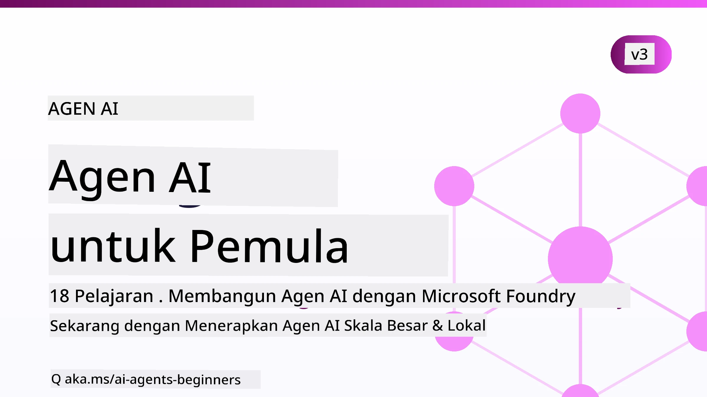

# Agen AI untuk Pemula - Sebuah Kursus



## Sebuah kursus yang mengajarkan segala yang Anda perlu ketahui untuk mulai membangun Agen AI

[](https://github.com/microsoft/ai-agents-for-beginners/blob/master/LICENSE?WT.mc_id=academic-105485-koreyst)
[](https://GitHub.com/microsoft/ai-agents-for-beginners/graphs/contributors/?WT.mc_id=academic-105485-koreyst)
[](https://GitHub.com/microsoft/ai-agents-for-beginners/issues/?WT.mc_id=academic-105485-koreyst)
[](https://GitHub.com/microsoft/ai-agents-for-beginners/pulls/?WT.mc_id=academic-105485-koreyst)
[](http://makeapullrequest.com?WT.mc_id=academic-105485-koreyst)

### 🌐 Dukungan Multi-Bahasa

#### Didukung melalui GitHub Action (Otomatis & Selalu Terbaru)

<!-- CO-OP TRANSLATOR LANGUAGES TABLE START -->
[Arabic](../ar/README.md) | [Bengali](../bn/README.md) | [Bulgarian](../bg/README.md) | [Burmese (Myanmar)](../my/README.md) | [Cina (Sederhana)](../zh-CN/README.md) | [Cina (Tradisional, Hong Kong)](../zh-HK/README.md) | [Cina (Tradisional, Macau)](../zh-MO/README.md) | [Cina (Tradisional, Taiwan)](../zh-TW/README.md) | [Croatian](../hr/README.md) | [Czech](../cs/README.md) | [Denmark](../da/README.md) | [Belanda](../nl/README.md) | [Estonia](../et/README.md) | [Finlandia](../fi/README.md) | [Prancis](../fr/README.md) | [Jerman](../de/README.md) | [Yunani](../el/README.md) | [Ibrani](../he/README.md) | [Hindi](../hi/README.md) | [Hungaria](../hu/README.md) | [Indonesia](./README.md) | [Italia](../it/README.md) | [Jepang](../ja/README.md) | [Kannada](../kn/README.md) | [Khmer](../km/README.md) | [Korea](../ko/README.md) | [Lituania](../lt/README.md) | [Melayu](../ms/README.md) | [Malayalam](../ml/README.md) | [Marathi](../mr/README.md) | [Nepali](../ne/README.md) | [Pidgin Nigeria](../pcm/README.md) | [Norwegia](../no/README.md) | [Persia (Farsi)](../fa/README.md) | [Polandia](../pl/README.md) | [Portugis (Brasil)](../pt-BR/README.md) | [Portugis (Portugal)](../pt-PT/README.md) | [Punjabi (Gurmukhi)](../pa/README.md) | [Rumania](../ro/README.md) | [Rusia](../ru/README.md) | [Serbia (Sirilik)](../sr/README.md) | [Slovakia](../sk/README.md) | [Slovenia](../sl/README.md) | [Spanyol](../es/README.md) | [Swahili](../sw/README.md) | [Swedia](../sv/README.md) | [Tagalog (Filipina)](../tl/README.md) | [Tamil](../ta/README.md) | [Telugu](../te/README.md) | [Thai](../th/README.md) | [Turki](../tr/README.md) | [Ukraina](../uk/README.md) | [Urdu](../ur/README.md) | [Vietnam](../vi/README.md)

> **Lebih Suka Mengkloning Secara Lokal?**
>
> Repositori ini mencakup lebih dari 50 terjemahan bahasa yang secara signifikan meningkatkan ukuran unduhan. Untuk mengkloning tanpa terjemahan, gunakan sparse checkout:
>
> **Bash / macOS / Linux:**
> ```bash
> git clone --filter=blob:none --sparse https://github.com/microsoft/ai-agents-for-beginners.git
> cd ai-agents-for-beginners
> git sparse-checkout set --no-cone '/*' '!translations' '!translated_images'
> ```
>
> **CMD (Windows):**
> ```cmd
> git clone --filter=blob:none --sparse https://github.com/microsoft/ai-agents-for-beginners.git
> cd ai-agents-for-beginners
> git sparse-checkout set --no-cone "/*" "!translations" "!translated_images"
> ```
>
> Ini memberikan Anda semua yang Anda perlukan untuk menyelesaikan kursus dengan unduhan yang jauh lebih cepat.
<!-- CO-OP TRANSLATOR LANGUAGES TABLE END -->

**Jika Anda ingin bahasa terjemahan tambahan didukung, mereka tercantum [di sini](https://github.com/Azure/co-op-translator/blob/main/getting_started/supported-languages.md).**

[](https://GitHub.com/microsoft/ai-agents-for-beginners/watchers/?WT.mc_id=academic-105485-koreyst)
[](https://GitHub.com/microsoft/ai-agents-for-beginners/network/?WT.mc_id=academic-105485-koreyst)
[](https://GitHub.com/microsoft/ai-agents-for-beginners/stargazers/?WT.mc_id=academic-105485-koreyst)

[](https://discord.com/invite/ATgtXmAS5D)


## 🌱 Memulai

Kursus ini memiliki pelajaran yang mencakup dasar-dasar membangun Agen AI. Setiap pelajaran membahas topik tersendiri jadi mulai dari mana saja yang Anda suka!

Ada dukungan multi-bahasa untuk kursus ini. Pergi ke [bahasa yang tersedia di sini](#-multi-language-support). 

Jika ini adalah pertama kalinya Anda membangun dengan model AI Generatif, periksa kursus kami [Generative AI For Beginners](https://aka.ms/genai-beginners), yang mencakup 21 pelajaran tentang membangun dengan GenAI.

Jangan lupa untuk [memberi bintang (🌟) repositori ini](https://docs.github.com/en/get-started/exploring-projects-on-github/saving-repositories-with-stars?WT.mc_id=academic-105485-koreyst) dan [fork repositori ini](https://github.com/microsoft/ai-agents-for-beginners/fork) untuk menjalankan kode.

### Bertemu Pembelajar Lain, Dapatkan Pertanyaan Anda Dijawab

Jika Anda mengalami kesulitan atau memiliki pertanyaan tentang membangun Agen AI, bergabunglah di Saluran Discord khusus kami di [Microsoft Foundry Discord](https://aka.ms/ai-agents/discord).

### Apa yang Anda Butuhkan 

Setiap pelajaran dalam kursus ini menyertakan contoh kode, yang dapat ditemukan di folder code_samples. Anda dapat [fork repositori ini](https://github.com/microsoft/ai-agents-for-beginners/fork) untuk membuat salinan Anda sendiri.  

Contoh kode dalam latihan ini menggunakan Microsoft Agent Framework dengan Microsoft Foundry Agent Service V2:

- [Microsoft Foundry](https://aka.ms/ai-agents-beginners/ai-foundry) - Akun Azure Diperlukan

Kursus ini menggunakan framework dan layanan Agen AI berikut dari Microsoft:

- [Microsoft Agent Framework (MAF)](https://aka.ms/ai-agents-beginners/agent-framework)
- [Microsoft Foundry Agent Service V2](https://aka.ms/ai-agents-beginners/ai-agent-service)

Beberapa contoh kode juga mendukung penyedia alternatif yang kompatibel dengan OpenAI seperti [MiniMax](https://platform.minimaxi.com/), yang menawarkan model konteks besar (hingga 204K token). Lihat [Pengaturan Kursus](./00-course-setup/README.md) untuk detail konfigurasi.

Untuk informasi lebih lanjut tentang menjalankan kode untuk kursus ini, kunjungi [Pengaturan Kursus](./00-course-setup/README.md).

## 🙏 Ingin membantu?

Apakah Anda memiliki saran atau menemukan kesalahan ejaan atau kode? [Buat isu](https://github.com/microsoft/ai-agents-for-beginners/issues?WT.mc_id=academic-105485-koreyst) atau [Buat permintaan tarik](https://github.com/microsoft/ai-agents-for-beginners/pulls?WT.mc_id=academic-105485-koreyst)


## 📂 Setiap pelajaran mencakup

- Pelajaran tertulis yang terletak di README dan video singkat
- Contoh kode Python menggunakan Microsoft Agent Framework dengan Microsoft Foundry
- Tautan ke sumber daya tambahan untuk melanjutkan pembelajaran Anda


## 🗃️ Pelajaran

| **Pelajaran**                                   | **Teks & Kode**                                    | **Video**                                                  | **Pembelajaran Tambahan**                                                                     |
|----------------------------------------------|----------------------------------------------------|------------------------------------------------------------|----------------------------------------------------------------------------------------|
| Pengenalan Agen AI dan Kasus Penggunaan Agen       | [Tautan](./01-intro-to-ai-agents/README.md)          | [Video](https://youtu.be/3zgm60bXmQk?si=z8QygFvYQv-9WtO1)  | [Tautan](https://aka.ms/ai-agents-beginners/collection?WT.mc_id=academic-105485-koreyst) |
| Menjelajahi Framework Agen AI              | [Tautan](./02-explore-agentic-frameworks/README.md)  | [Video](https://youtu.be/ODwF-EZo_O8?si=Vawth4hzVaHv-u0H)  | [Tautan](https://aka.ms/ai-agents-beginners/collection?WT.mc_id=academic-105485-koreyst) |
| Memahami Pola Desain Agen AI     | [Tautan](./03-agentic-design-patterns/README.md)     | [Video](https://youtu.be/m9lM8qqoOEA?si=BIzHwzstTPL8o9GF)  | [Tautan](https://aka.ms/ai-agents-beginners/collection?WT.mc_id=academic-105485-koreyst) |
| Pola Desain Penggunaan Alat                      | [Tautan](./04-tool-use/README.md)                    | [Video](https://youtu.be/vieRiPRx-gI?si=2z6O2Xu2cu_Jz46N)  | [Tautan](https://aka.ms/ai-agents-beginners/collection?WT.mc_id=academic-105485-koreyst) |
| Agentic RAG                                  | [Tautan](./05-agentic-rag/README.md)                 | [Video](https://youtu.be/WcjAARvdL7I?si=gKPWsQpKiIlDH9A3)  | [Tautan](https://aka.ms/ai-agents-beginners/collection?WT.mc_id=academic-105485-koreyst) |
| Membangun Agen AI yang Terpercaya               | [Tautan](./06-building-trustworthy-agents/README.md) | [Video](https://youtu.be/iZKkMEGBCUQ?si=jZjpiMnGFOE9L8OK ) | [Tautan](https://aka.ms/ai-agents-beginners/collection?WT.mc_id=academic-105485-koreyst) |
| Pola Desain Perencanaan                      | [Tautan](./07-planning-design/README.md)             | [Video](https://youtu.be/kPfJ2BrBCMY?si=6SC_iv_E5-mzucnC)  | [Tautan](https://aka.ms/ai-agents-beginners/collection?WT.mc_id=academic-105485-koreyst) |
| Pola Desain Multi-Agen                   | [Tautan](./08-multi-agent/README.md)                 | [Video](https://youtu.be/V6HpE9hZEx0?si=rMgDhEu7wXo2uo6g)  | [Tautan](https://aka.ms/ai-agents-beginners/collection?WT.mc_id=academic-105485-koreyst) |

| Pola Desain Metakognisi                 | [Link](./09-metacognition/README.md)               | [Video](https://youtu.be/His9R6gw6Ec?si=8gck6vvdSNCt6OcF)  | [Link](https://aka.ms/ai-agents-beginners/collection?WT.mc_id=academic-105485-koreyst) |
| Agen AI dalam Produksi                      | [Link](./10-ai-agents-production/README.md)        | [Video](https://youtu.be/l4TP6IyJxmQ?si=31dnhexRo6yLRJDl)  | [Link](https://aka.ms/ai-agents-beginners/collection?WT.mc_id=academic-105485-koreyst) |
| Menggunakan Protokol Agentik (MCP, A2A dan NLWeb) | [Link](./11-agentic-protocols/README.md)           | [Video](https://youtu.be/X-Dh9R3Opn8)                                 | [Link](https://aka.ms/ai-agents-beginners/collection?WT.mc_id=academic-105485-koreyst) |
| Rekayasa Konteks untuk Agen AI            | [Link](./12-context-engineering/README.md)         | [Video](https://youtu.be/F5zqRV7gEag)                                 | [Link](https://aka.ms/ai-agents-beginners/collection?WT.mc_id=academic-105485-koreyst) |
| Mengelola Memori Agen                      | [Link](./13-agent-memory/README.md)     |      [Video](https://youtu.be/QrYbHesIxpw?si=vZkVwKrQ4ieCcIPx)                                                      |                                                                                        |
| Menjelajahi Kerangka Agen Microsoft                         | [Link](./14-microsoft-agent-framework/README.md)                            |                                                            |                                                                                        |
| Membangun Agen Penggunaan Komputer (CUA)           | [Link](./15-browser-use/README.md)     |                                                            | [Link](https://docs.browser-use.com/examples/templates/playwright-integration)         |
| Menyebarkan Agen Skala Besar                    | [Link](./16-deploying-scalable-agents/README.md) |                                                    | [Link](https://learn.microsoft.com/azure/ai-foundry/agents/overview)                   |
| Membuat Agen AI Lokal                     | [Link](./17-creating-local-ai-agents/README.md)  |                                                    | [Link](https://learn.microsoft.com/azure/ai-foundry/foundry-local/)                    |
| Mengamankan Agen AI                           | [Link](./18-securing-ai-agents/README.md)  |                                                            | [Link](https://aka.ms/ai-agents-beginners/collection?WT.mc_id=academic-105485-koreyst) |

## 🎒 Kursus Lainnya

Tim kami menghasilkan kursus lainnya! Lihat:

<!-- CO-OP TRANSLATOR OTHER COURSES START -->
### LangChain
[](https://aka.ms/langchain4j-for-beginners)
[](https://aka.ms/langchainjs-for-beginners?WT.mc_id=m365-94501-dwahlin)
[](https://github.com/microsoft/langchain-for-beginners?WT.mc_id=m365-94501-dwahlin)
---

### Azure / Edge / MCP / Agen
[](https://github.com/microsoft/AZD-for-beginners?WT.mc_id=academic-105485-koreyst)
[](https://github.com/microsoft/edgeai-for-beginners?WT.mc_id=academic-105485-koreyst)
[](https://github.com/microsoft/mcp-for-beginners?WT.mc_id=academic-105485-koreyst)
[](https://github.com/microsoft/ai-agents-for-beginners?WT.mc_id=academic-105485-koreyst)

---
 
### Seri AI Generatif
[](https://github.com/microsoft/generative-ai-for-beginners?WT.mc_id=academic-105485-koreyst)
[-9333EA?style=for-the-badge&labelColor=E5E7EB&color=9333EA)](https://github.com/microsoft/Generative-AI-for-beginners-dotnet?WT.mc_id=academic-105485-koreyst)
[-C084FC?style=for-the-badge&labelColor=E5E7EB&color=C084FC)](https://github.com/microsoft/generative-ai-for-beginners-java?WT.mc_id=academic-105485-koreyst)
[-E879F9?style=for-the-badge&labelColor=E5E7EB&color=E879F9)](https://github.com/microsoft/generative-ai-with-javascript?WT.mc_id=academic-105485-koreyst)

---
 
### Pembelajaran Inti
[](https://aka.ms/ml-beginners?WT.mc_id=academic-105485-koreyst)
[](https://aka.ms/datascience-beginners?WT.mc_id=academic-105485-koreyst)
[](https://aka.ms/ai-beginners?WT.mc_id=academic-105485-koreyst)
[](https://github.com/microsoft/Security-101?WT.mc_id=academic-96948-sayoung)
[](https://aka.ms/webdev-beginners?WT.mc_id=academic-105485-koreyst)
[](https://aka.ms/iot-beginners?WT.mc_id=academic-105485-koreyst)
[](https://github.com/microsoft/xr-development-for-beginners?WT.mc_id=academic-105485-koreyst)

---
 
### Seri Copilot
[](https://aka.ms/GitHubCopilotAI?WT.mc_id=academic-105485-koreyst)
[](https://github.com/microsoft/mastering-github-copilot-for-dotnet-csharp-developers?WT.mc_id=academic-105485-koreyst)
[](https://github.com/microsoft/CopilotAdventures?WT.mc_id=academic-105485-koreyst)
<!-- CO-OP TRANSLATOR OTHER COURSES END -->

## 🌟 Terima Kasih Komunitas

Terima kasih kepada [Shivam Goyal](https://www.linkedin.com/in/shivam2003/) yang telah berkontribusi dengan contoh kode penting yang menunjukkan RAG Agentik.

## Berkontribusi

Proyek ini menerima kontribusi dan saran. Sebagian besar kontribusi mengharuskan Anda setuju dengan
Perjanjian Lisensi Kontributor (CLA) yang menyatakan bahwa Anda memiliki hak, dan memang memberikan kami
hak untuk menggunakan kontribusi Anda. Untuk detail, kunjungi <https://cla.opensource.microsoft.com>.

Ketika Anda mengirim permintaan tarik, bot CLA akan secara otomatis menentukan apakah Anda perlu
menyediakan CLA dan menandai PR dengan tepat (misalnya, pemeriksaan status, komentar). Cukup ikuti instruksi
yang diberikan oleh bot. Anda hanya perlu melakukan ini sekali di semua repositori yang menggunakan CLA kami.

Proyek ini telah mengadopsi [Kode Etik Open Source Microsoft](https://opensource.microsoft.com/codeofconduct/).
Untuk informasi lebih lanjut lihat [FAQ Kode Etik](https://opensource.microsoft.com/codeofconduct/faq/) atau
hubungi [opencode@microsoft.com](mailto:opencode@microsoft.com) untuk pertanyaan atau komentar tambahan.

## Merek Dagang

Proyek ini mungkin mengandung merek dagang atau logo untuk proyek, produk, atau layanan. Penggunaan resmi merek dagang atau logo Microsoft
harus mengikuti dan tunduk pada
[Pedoman Merek & Merek Dagang Microsoft](https://www.microsoft.com/legal/intellectualproperty/trademarks/usage/general).
Penggunaan merek atau logo Microsoft dalam versi modifikasi proyek ini tidak boleh menimbulkan kebingungan atau menyiratkan dukungan Microsoft.
Setiap penggunaan merek dagang atau logo pihak ketiga tunduk pada kebijakan pihak ketiga tersebut.

## Mendapatkan Bantuan


Jika Anda mengalami kesulitan atau memiliki pertanyaan tentang membangun aplikasi AI, bergabunglah di:

[](https://aka.ms/foundry/discord)

Jika Anda memiliki umpan balik produk atau menemukan kesalahan saat membangun kunjungi:

[](https://aka.ms/foundry/forum)

---

<!-- CO-OP TRANSLATOR DISCLAIMER START -->
**Penafian**:
Dokumen ini telah diterjemahkan menggunakan layanan terjemahan AI [Co-op Translator](https://github.com/Azure/co-op-translator). Meskipun kami berupaya untuk mencapai akurasi, harap diketahui bahwa terjemahan otomatis mungkin mengandung kesalahan atau ketidakakuratan. Dokumen asli dalam bahasa aslinya harus dianggap sebagai sumber yang sah. Untuk informasi penting, disarankan menggunakan terjemahan profesional oleh manusia. Kami tidak bertanggung jawab atas kesalahpahaman atau penafsiran yang keliru yang timbul dari penggunaan terjemahan ini.
<!-- CO-OP TRANSLATOR DISCLAIMER END -->