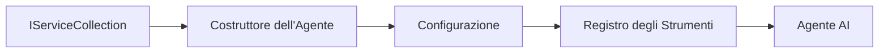

# 🎨 Pattern di Progettazione Agentic con Azure OpenAI (Responses API) (.NET)

## 📋 Obiettivi di Apprendimento

Questo esempio dimostra pattern di progettazione di livello enterprise per costruire agenti intelligenti utilizzando il Microsoft Agent Framework in .NET con integrazione Azure OpenAI (Responses API). Imparerai pattern professionali e approcci architetturali che rendono gli agenti pronti per la produzione, manutenibili e scalabili.

### Pattern di Progettazione Enterprise

- 🏭 **Factory Pattern**: Creazione standardizzata degli agenti con dependency injection
- 🔧 **Builder Pattern**: Configurazione e setup fluente degli agenti
- 🧵 **Pattern Thread-Safe**: Gestione concorrente delle conversazioni
- 📋 **Repository Pattern**: Gestione organizzata di strumenti e capacità

## 🎯 Benefici Architetturali Specifici per .NET

### Caratteristiche Enterprise

- **Tipizzazione Forte**: Validazione a tempo di compilazione e supporto IntelliSense
- **Dependency Injection**: Integrazione del contenitore DI integrato
- **Gestione Configurazione**: Pattern IConfiguration e Options
- **Async/Await**: Supporto di prima classe alla programmazione asincrona

### Pattern Pronti per la Produzione

- **Integrazione Logging**: ILogger e supporto al logging strutturato
- **Health Checks**: Monitoraggio e diagnostica integrati
- **Validazione Configurazione**: Tipizzazione forte con annotazioni dati
- **Gestione Errori**: Gestione strutturata delle eccezioni

## 🔧 Architettura Tecnica

### Componenti Core .NET

- **Microsoft.Extensions.AI**: Astrazioni unificate per i servizi AI
- **Microsoft.Agents.AI**: Framework enterprise per orchestrazione agenti
- **Azure OpenAI (Responses API)**: Pattern client API ad alte prestazioni
- **Sistema di Configurazione**: appsettings.json e integrazione ambiente

### Implementazione Pattern di Progettazione



## 🏗️ Pattern Enterprise Dimostrati

### 1. **Pattern Creazionali**

- **Agent Factory**: Creazione centralizzata degli agenti con configurazione coerente
- **Builder Pattern**: API fluente per configurazioni agenti complesse
- **Singleton Pattern**: Gestione condivisa di risorse e configurazione
- **Dependency Injection**: Accoppiamento debole e testabilità

### 2. **Pattern Comportamentali**

- **Strategy Pattern**: Strategie intercambiabili di esecuzione strumenti
- **Command Pattern**: Operazioni agenti incapsulate con undo/redo
- **Observer Pattern**: Gestione del ciclo di vita agente basata su eventi
- **Template Method**: Flussi di lavoro di esecuzione agenti standardizzati

### 3. **Pattern Strutturali**

- **Adapter Pattern**: Layer di integrazione Azure OpenAI (Responses API)
- **Decorator Pattern**: Potenziamento delle capacità dell'agente
- **Facade Pattern**: Interfacce semplificate per l'interazione con l'agente
- **Proxy Pattern**: Caricamento lazy e caching per le prestazioni

## 📚 Principi di Progettazione .NET

### Principi SOLID

- **Single Responsibility**: Ogni componente ha uno scopo chiaro
- **Open/Closed**: Estensibile senza modifiche
- **Liskov Substitution**: Implementazioni strumenti basate su interfacce
- **Interface Segregation**: Interfacce focalizzate e coese
- **Dependency Inversion**: Dipendenza da astrazioni, non da concrezioni

### Clean Architecture

- **Domain Layer**: Astrazioni core di agenti e strumenti
- **Application Layer**: Orchestrazione agenti e flussi di lavoro
- **Infrastructure Layer**: Integrazione Azure OpenAI (Responses API) e servizi esterni
- **Presentation Layer**: Interazione utente e formattazione delle risposte

## 🔒 Considerazioni Enterprise

### Sicurezza

- **Gestione delle Credenziali**: Gestione sicura delle chiavi API con IConfiguration
- **Validazione Input**: Tipizzazione forte e validazione con annotazioni dati
- **Sanitizzazione Output**: Elaborazione e filtraggio sicuro delle risposte
- **Audit Logging**: Tracciamento completo delle operazioni

### Prestazioni

- **Pattern Async**: Operazioni I/O non bloccanti
- **Connection Pooling**: Gestione efficiente del client HTTP
- **Caching**: Caching delle risposte per migliorare le prestazioni
- **Gestione delle Risorse**: Pattern appropriati di disposal e pulizia

### Scalabilità

- **Thread Safety**: Supporto all'esecuzione concorrente degli agenti
- **Pooling delle Risorse**: Utilizzo efficiente delle risorse
- **Gestione del Carico**: Limitazione della velocità e gestione della pressione
- **Monitoraggio**: Metriche di prestazioni e health checks

## 🚀 Distribuzione in Produzione

- **Gestione Configurazione**: Impostazioni specifiche per ambiente
- **Strategia di Logging**: Logging strutturato con ID di correlazione
- **Gestione Errori**: Gestione globale delle eccezioni con recupero adeguato
- **Monitoraggio**: Application insights e contatori di prestazioni
- **Testing**: Test unitari, test di integrazione e pattern di load testing

Pronto a creare agenti intelligenti di livello enterprise con .NET? Progettiamo qualcosa di solido! 🏢✨

## 🚀 Per Iniziare

### Prerequisiti

- [.NET 10 SDK](https://dotnet.microsoft.com/download/dotnet/10.0) o versione superiore
- Una [sottoscrizione Azure](https://azure.microsoft.com/free/) con una risorsa Azure OpenAI e un deployment modello
- La [CLI Azure](https://learn.microsoft.com/cli/azure/install-azure-cli) — eseguire l'accesso con `az login`

### Variabili d'Ambiente Richieste

```bash
# zsh/bash
export AZURE_OPENAI_ENDPOINT=https://<your-resource>.openai.azure.com
export AZURE_OPENAI_DEPLOYMENT=gpt-5-mini
# Quindi accedi in modo che AzureCliCredential possa ottenere un token
az login
```

```powershell
# PowerShell
$env:AZURE_OPENAI_ENDPOINT = "https://<your-resource>.openai.azure.com"
$env:AZURE_OPENAI_DEPLOYMENT = "gpt-5-mini"
# Quindi accedi in modo che AzureCliCredential possa ottenere un token
az login
```

### Codice di Esempio

Per eseguire l'esempio di codice,

```bash
# zsh/bash
chmod +x ./03-dotnet-agent-framework.cs
./03-dotnet-agent-framework.cs
```

Oppure usando la CLI dotnet:

```bash
dotnet run ./03-dotnet-agent-framework.cs
```

Vedi [`03-dotnet-agent-framework.cs`](../../../../03-agentic-design-patterns/code_samples/03-dotnet-agent-framework.cs) per il codice completo.

```csharp
#!/usr/bin/dotnet run

#:package Microsoft.Extensions.AI@10.*
#:package Microsoft.Agents.AI.OpenAI@1.*-*
#:package Azure.AI.OpenAI@2.1.0
#:package Azure.Identity@1.13.1

using System.ComponentModel;

using Microsoft.Agents.AI;
using Microsoft.Extensions.AI;

using Azure.AI.OpenAI;
using Azure.Identity;

// Tool Function: Random Destination Generator
// This static method will be available to the agent as a callable tool
// The [Description] attribute helps the AI understand when to use this function
// This demonstrates how to create custom tools for AI agents
[Description("Provides a random vacation destination.")]
static string GetRandomDestination()
{
    // List of popular vacation destinations around the world
    // The agent will randomly select from these options
    var destinations = new List<string>
    {
        "Paris, France",
        "Tokyo, Japan",
        "New York City, USA",
        "Sydney, Australia",
        "Rome, Italy",
        "Barcelona, Spain",
        "Cape Town, South Africa",
        "Rio de Janeiro, Brazil",
        "Bangkok, Thailand",
        "Vancouver, Canada"
    };

    // Generate random index and return selected destination
    // Uses System.Random for simple random selection
    var random = new Random();
    int index = random.Next(destinations.Count);
    return destinations[index];
}

// Azure OpenAI with the Responses API (stable v1 endpoint). Sign in with `az login`.
var azureEndpoint = Environment.GetEnvironmentVariable("AZURE_OPENAI_ENDPOINT")
    ?? throw new InvalidOperationException("AZURE_OPENAI_ENDPOINT is not set.");
var deployment = Environment.GetEnvironmentVariable("AZURE_OPENAI_DEPLOYMENT") ?? "gpt-5-mini";

var azureClient = new AzureOpenAIClient(new Uri(azureEndpoint), new AzureCliCredential());

// Define Agent Identity and Comprehensive Instructions
// Agent name for identification and logging purposes
var AGENT_NAME = "TravelAgent";

// Detailed instructions that define the agent's personality, capabilities, and behavior
// This system prompt shapes how the agent responds and interacts with users
var AGENT_INSTRUCTIONS = """
You are a helpful AI Agent that can help plan vacations for customers.

Important: When users specify a destination, always plan for that location. Only suggest random destinations when the user hasn't specified a preference.

When the conversation begins, introduce yourself with this message:
"Hello! I'm your TravelAgent assistant. I can help plan vacations and suggest interesting destinations for you. Here are some things you can ask me:
1. Plan a day trip to a specific location
2. Suggest a random vacation destination
3. Find destinations with specific features (beaches, mountains, historical sites, etc.)
4. Plan an alternative trip if you don't like my first suggestion

What kind of trip would you like me to help you plan today?"

Always prioritize user preferences. If they mention a specific destination like "Bali" or "Paris," focus your planning on that location rather than suggesting alternatives.
""";

// Create AI Agent with Advanced Travel Planning Capabilities
// Get the Responses client for the deployment and create the AI agent
// Configure agent with name, detailed instructions, and available tools
// This demonstrates the .NET agent creation pattern with full configuration
AIAgent agent = azureClient
    .GetChatClient(deployment)
    .AsAIAgent(
        name: AGENT_NAME,
        instructions: AGENT_INSTRUCTIONS,
        tools: [AIFunctionFactory.Create(GetRandomDestination)]
    );

// Create New Conversation Session for Context Management
// Initialize a new conversation session to maintain context across multiple interactions
// Sessions enable the agent to remember previous exchanges and maintain conversational state
// This is essential for multi-turn conversations and contextual understanding
var session = await agent.CreateSessionAsync();

// Execute Agent: First Travel Planning Request
// Run the agent with an initial request that will likely trigger the random destination tool
// The agent will analyze the request, use the GetRandomDestination tool, and create an itinerary
// Using the session parameter maintains conversation context for subsequent interactions
await foreach (var update in agent.RunStreamingAsync("Plan me a day trip", session))
{
    await Task.Delay(10);
    Console.Write(update);
}

Console.WriteLine();

// Execute Agent: Follow-up Request with Context Awareness
// Demonstrate contextual conversation by referencing the previous response
// The agent remembers the previous destination suggestion and will provide an alternative
// This showcases the power of conversation sessions and contextual understanding in .NET agents
await foreach (var update in agent.RunStreamingAsync("I don't like that destination. Plan me another vacation.", session))
{
    await Task.Delay(10);
    Console.Write(update);
}
```

---

<!-- CO-OP TRANSLATOR DISCLAIMER START -->
**Disclaimer**:
Questo documento è stato tradotto utilizzando il servizio di traduzione AI [Co-op Translator](https://github.com/Azure/co-op-translator). Sebbene ci impegniamo per garantire la precisione, si prega di notare che le traduzioni automatizzate possono contenere errori o imprecisioni. Il documento originale nella sua lingua nativa deve essere considerato la fonte autorevole. Per informazioni critiche, si raccomanda una traduzione professionale effettuata da un essere umano. Non siamo responsabili per eventuali malintesi o interpretazioni errate derivanti dall’uso di questa traduzione.
<!-- CO-OP TRANSLATOR DISCLAIMER END -->