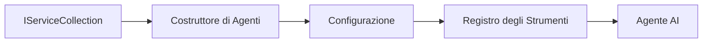

# 🎨 Pattern di Design Agentic con Azure OpenAI (Responses API) (.NET)

## 📋 Obiettivi di Apprendimento

Questo esempio dimostra pattern di design enterprise per la costruzione di agenti intelligenti utilizzando il Microsoft Agent Framework in .NET con integrazione Azure OpenAI (Responses API). Imparerai pattern professionali e approcci architetturali che rendono gli agenti pronti per la produzione, manutenibili e scalabili.

### Pattern di Design Enterprise

- 🏭 **Factory Pattern**: Creazione standardizzata di agenti con dependency injection
- 🔧 **Builder Pattern**: Configurazione e setup fluente dell’agente
- 🧵 **Thread-Safe Patterns**: Gestione concorrente delle conversazioni
- 📋 **Repository Pattern**: Gestione organizzata di strumenti e capacità

## 🎯 Benefici Architetturali specifici per .NET

### Funzionalità Enterprise

- **Strong Typing**: Validazione a compile-time e supporto IntelliSense
- **Dependency Injection**: Integrazione con contenitore DI built-in
- **Configuration Management**: Pattern IConfiguration e Options
- **Async/Await**: Supporto asincrono di prim’ordine

### Pattern Pronti per la Produzione

- **Logging Integration**: Supporto ILogger e logging strutturato
- **Health Checks**: Monitoraggio e diagnostica integrate
- **Configuration Validation**: Typing forte con annotazioni dati
- **Error Handling**: Gestione strutturata delle eccezioni

## 🔧 Architettura Tecnica

### Componenti Core di .NET

- **Microsoft.Extensions.AI**: Astrazioni unificate per servizi AI
- **Microsoft.Agents.AI**: Framework enterprise per orchestrazione agenti
- **Azure OpenAI (Responses API)**: Pattern per client API ad alte prestazioni
- **Configuration System**: appsettings.json e integrazione ambiente

### Implementazione dei Pattern di Design



## 🏗️ Pattern Enterprise Dimostrati

### 1. **Pattern Creazionali**

- **Agent Factory**: Creazione agenti centralizzata con configurazione coerente
- **Builder Pattern**: API fluente per configurazione agenti complessi
- **Singleton Pattern**: Gestione risorse condivise e configurazione
- **Dependency Injection**: Coupling debole e testabilità

### 2. **Pattern Comportamentali**

- **Strategy Pattern**: Strategie intercambiabili per esecuzione strumenti
- **Command Pattern**: Operazioni agenti incapsulate con undo/redo
- **Observer Pattern**: Gestione ciclo vita agenti guidata da eventi
- **Template Method**: Workflow standardizzati di esecuzione agente

### 3. **Pattern Strutturali**

- **Adapter Pattern**: Layer di integrazione Azure OpenAI (Responses API)
- **Decorator Pattern**: Potenziamento capacità agenti
- **Facade Pattern**: Interfacce semplificate per l’interazione agente
- **Proxy Pattern**: Lazy loading e caching per performance

## 📚 Principi di Design .NET

### Principi SOLID

- **Single Responsibility**: Ogni componente ha uno scopo chiaro
- **Open/Closed**: Estendibile senza modifiche
- **Liskov Substitution**: Implementazioni di strumenti basate su interfacce
- **Interface Segregation**: Interfacce focalizzate e coese
- **Dependency Inversion**: Dipendere da astrazioni, non concretezze

### Clean Architecture

- **Domain Layer**: Astrazioni core per agenti e strumenti
- **Application Layer**: Orchestrazione agenti e workflow
- **Infrastructure Layer**: Integrazione Azure OpenAI (Responses API) e servizi esterni
- **Presentation Layer**: Interazione utente e formattazione risposte

## 🔒 Considerazioni Enterprise

### Sicurezza

- **Credential Management**: Gestione sicura chiavi API con IConfiguration
- **Input Validation**: Strong typing e validazione annotazioni dati
- **Output Sanitization**: Elaborazione e filtraggio risposte sicure
- **Audit Logging**: Tracciamento completo delle operazioni

### Performance

- **Async Patterns**: Operazioni I/O non bloccanti
- **Connection Pooling**: Gestione efficiente client HTTP
- **Caching**: Cache delle risposte per migliorare le performance
- **Resource Management**: Pattern corretti di rilascio e pulizia risorse

### Scalabilità

- **Thread Safety**: Supporto a esecuzione concorrente agenti
- **Resource Pooling**: Utilizzo efficiente delle risorse
- **Load Management**: Limitazione rate e gestione backpressure
- **Monitoring**: Metriche di prestazioni e health check

## 🚀 Deployment in Produzione

- **Configuration Management**: Configurazioni specifiche per ambiente
- **Logging Strategy**: Logging strutturato con correlation ID
- **Error Handling**: Gestione globale delle eccezioni con recovery appropriato
- **Monitoring**: Application insights e contatori di performance
- **Testing**: Test unitari, di integrazione e stress test

Pronto a costruire agenti intelligenti enterprise-grade con .NET? Progettiamo qualcosa di robusto! 🏢✨

## 🚀 Per Iniziare

### Prerequisiti

- [.NET 10 SDK](https://dotnet.microsoft.com/download/dotnet/10.0) o superiore
- Un [abbonamento Azure](https://azure.microsoft.com/free/) con una risorsa Azure OpenAI e un deployment modello
- L’[Azure CLI](https://learn.microsoft.com/cli/azure/install-azure-cli) — effettuare il login con `az login`

### Variabili d’Ambiente Richieste

```bash
# zsh/bash
export AZURE_OPENAI_ENDPOINT=https://<your-resource>.openai.azure.com
export AZURE_OPENAI_DEPLOYMENT=gpt-4.1-mini
# Quindi accedi in modo che AzureCliCredential possa ottenere un token
az login
```

```powershell
# PowerShell
$env:AZURE_OPENAI_ENDPOINT = "https://<your-resource>.openai.azure.com"
$env:AZURE_OPENAI_DEPLOYMENT = "gpt-4.1-mini"
# Quindi accedi in modo che AzureCliCredential possa ottenere un token
az login
```

### Codice di esempio

Per eseguire l'esempio di codice,

```bash
# zsh/bash
chmod +x ./03-dotnet-agent-framework.cs
./03-dotnet-agent-framework.cs
```

Oppure usando il CLI dotnet:

```bash
dotnet run ./03-dotnet-agent-framework.cs
```

Vedi [`03-dotnet-agent-framework.cs`](../../../../03-agentic-design-patterns/code_samples/03-dotnet-agent-framework.cs) per il codice completo.

```csharp
#!/usr/bin/dotnet run

#:package Microsoft.Extensions.AI@10.*
#:package Microsoft.Agents.AI.OpenAI@1.*-*
#:package Azure.AI.OpenAI@2.1.0
#:package Azure.Identity@1.13.1

using System.ComponentModel;

using Microsoft.Agents.AI;
using Microsoft.Extensions.AI;

using Azure.AI.OpenAI;
using Azure.Identity;

// Tool Function: Random Destination Generator
// This static method will be available to the agent as a callable tool
// The [Description] attribute helps the AI understand when to use this function
// This demonstrates how to create custom tools for AI agents
[Description("Provides a random vacation destination.")]
static string GetRandomDestination()
{
    // List of popular vacation destinations around the world
    // The agent will randomly select from these options
    var destinations = new List<string>
    {
        "Paris, France",
        "Tokyo, Japan",
        "New York City, USA",
        "Sydney, Australia",
        "Rome, Italy",
        "Barcelona, Spain",
        "Cape Town, South Africa",
        "Rio de Janeiro, Brazil",
        "Bangkok, Thailand",
        "Vancouver, Canada"
    };

    // Generate random index and return selected destination
    // Uses System.Random for simple random selection
    var random = new Random();
    int index = random.Next(destinations.Count);
    return destinations[index];
}

// Azure OpenAI with the Responses API (stable v1 endpoint). Sign in with `az login`.
var azureEndpoint = Environment.GetEnvironmentVariable("AZURE_OPENAI_ENDPOINT")
    ?? throw new InvalidOperationException("AZURE_OPENAI_ENDPOINT is not set.");
var deployment = Environment.GetEnvironmentVariable("AZURE_OPENAI_DEPLOYMENT") ?? "gpt-4.1-mini";

var azureClient = new AzureOpenAIClient(new Uri(azureEndpoint), new AzureCliCredential());

// Define Agent Identity and Comprehensive Instructions
// Agent name for identification and logging purposes
var AGENT_NAME = "TravelAgent";

// Detailed instructions that define the agent's personality, capabilities, and behavior
// This system prompt shapes how the agent responds and interacts with users
var AGENT_INSTRUCTIONS = """
You are a helpful AI Agent that can help plan vacations for customers.

Important: When users specify a destination, always plan for that location. Only suggest random destinations when the user hasn't specified a preference.

When the conversation begins, introduce yourself with this message:
"Hello! I'm your TravelAgent assistant. I can help plan vacations and suggest interesting destinations for you. Here are some things you can ask me:
1. Plan a day trip to a specific location
2. Suggest a random vacation destination
3. Find destinations with specific features (beaches, mountains, historical sites, etc.)
4. Plan an alternative trip if you don't like my first suggestion

What kind of trip would you like me to help you plan today?"

Always prioritize user preferences. If they mention a specific destination like "Bali" or "Paris," focus your planning on that location rather than suggesting alternatives.
""";

// Create AI Agent with Advanced Travel Planning Capabilities
// Get the Responses client for the deployment and create the AI agent
// Configure agent with name, detailed instructions, and available tools
// This demonstrates the .NET agent creation pattern with full configuration
AIAgent agent = azureClient
    .GetChatClient(deployment)
    .AsAIAgent(
        name: AGENT_NAME,
        instructions: AGENT_INSTRUCTIONS,
        tools: [AIFunctionFactory.Create(GetRandomDestination)]
    );

// Create New Conversation Session for Context Management
// Initialize a new conversation session to maintain context across multiple interactions
// Sessions enable the agent to remember previous exchanges and maintain conversational state
// This is essential for multi-turn conversations and contextual understanding
var session = await agent.CreateSessionAsync();

// Execute Agent: First Travel Planning Request
// Run the agent with an initial request that will likely trigger the random destination tool
// The agent will analyze the request, use the GetRandomDestination tool, and create an itinerary
// Using the session parameter maintains conversation context for subsequent interactions
await foreach (var update in agent.RunStreamingAsync("Plan me a day trip", session))
{
    await Task.Delay(10);
    Console.Write(update);
}

Console.WriteLine();

// Execute Agent: Follow-up Request with Context Awareness
// Demonstrate contextual conversation by referencing the previous response
// The agent remembers the previous destination suggestion and will provide an alternative
// This showcases the power of conversation sessions and contextual understanding in .NET agents
await foreach (var update in agent.RunStreamingAsync("I don't like that destination. Plan me another vacation.", session))
{
    await Task.Delay(10);
    Console.Write(update);
}
```

---

<!-- CO-OP TRANSLATOR DISCLAIMER START -->
**Disclaimer**:
Questo documento è stato tradotto utilizzando il servizio di traduzione AI [Co-op Translator](https://github.com/Azure/co-op-translator). Sebbene ci impegniamo per garantire la precisione, si prega di notare che le traduzioni automatizzate possono contenere errori o imprecisioni. Il documento originale nella sua lingua nativa deve essere considerato la fonte autorevole. Per informazioni critiche, si raccomanda una traduzione professionale effettuata da un essere umano. Non siamo responsabili per eventuali malintesi o interpretazioni errate derivanti dall’uso di questa traduzione.
<!-- CO-OP TRANSLATOR DISCLAIMER END -->