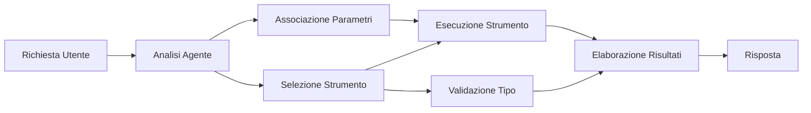

# 🛠️ Uso Avanzato degli Strumenti con Azure OpenAI (Responses API) (.NET)

## 📋 Obiettivi di Apprendimento

Questo notebook dimostra modelli di integrazione di strumenti di livello enterprise utilizzando il Microsoft Agent Framework in .NET con Azure OpenAI (Responses API). Imparerai a costruire agenti sofisticati con molteplici strumenti specializzati, sfruttando il typing forte di C# e le funzionalità enterprise di .NET.

### Capacità Avanzate degli Strumenti che Dominerai

- 🔧 **Architettura Multi-Strumento**: Costruire agenti con molteplici capacità specializzate
- 🎯 **Esecuzione degli Strumenti Tipo-Sicura**: Sfruttare la validazione a tempo di compilazione di C#
- 📊 **Modelli di Strumenti Enterprise**: Progettazione di strumenti pronti per la produzione e gestione degli errori
- 🔗 **Composizione degli Strumenti**: Combinare strumenti per flussi di lavoro aziendali complessi

## 🎯 Vantaggi dell'Architettura degli Strumenti .NET

### Caratteristiche Enterprise degli Strumenti

- **Validazione a Tempo di Compilazione**: Il typing forte assicura la correttezza dei parametri degli strumenti
- **Dependency Injection**: Integrazione del contenitore IoC per la gestione degli strumenti
- **Modelli Async/Await**: Esecuzione non bloccante degli strumenti con gestione appropriata delle risorse
- **Logging Strutturato**: Integrazione del logging incorporata per il monitoraggio dell'esecuzione degli strumenti

### Modelli Pronti per la Produzione

- **Gestione delle Eccezioni**: Gestione completa degli errori con eccezioni tipizzate
- **Gestione delle Risorse**: Modelli corretti di disposal e gestione della memoria
- **Monitoraggio delle Prestazioni**: Metriche incorporate e contatori di prestazioni
- **Gestione della Configurazione**: Configurazione tipo-sicura con validazione

## 🔧 Architettura Tecnica

### Componenti Core degli Strumenti .NET

- **Microsoft.Extensions.AI**: Strato unificato di astrazione degli strumenti
- **Microsoft.Agents.AI**: Orchestrazione degli strumenti di livello enterprise
- **Azure OpenAI (Responses API)**: Client API ad alte prestazioni con connection pooling

### Pipeline di Esecuzione degli Strumenti



## 🛠️ Categorie & Modelli di Strumenti

### 1. **Strumenti di Elaborazione Dati**

- **Validazione Input**: Typing forte con annotazioni sui dati
- **Operazioni di Trasformazione**: Conversione e formattazione dati tipo-sicure
- **Logica di Business**: Strumenti di calcolo e analisi specifici di dominio
- **Formattazione Output**: Generazione di risposte strutturate

### 2. **Strumenti di Integrazione**

- **Connettori API**: Integrazione di servizi RESTful con HttpClient
- **Strumenti Database**: Integrazione Entity Framework per accesso ai dati
- **Operazioni su File**: Operazioni sicure sul file system con validazione
- **Servizi Esterni**: Modelli di integrazione per servizi di terze parti

### 3. **Strumenti Utilità**

- **Elaborazione Testo**: Utilità di manipolazione e formattazione di stringhe
- **Operazioni Data/Ora**: Calcoli data/ora consapevoli della cultura
- **Strumenti Matematici**: Calcoli di precisione e operazioni statistiche
- **Strumenti di Validazione**: Validazione delle regole di business e verifica dati

Pronto a costruire agenti enterprise-grade con potenti capacità tipo-sicure in .NET? Progettiamo soluzioni di livello professionale! 🏢⚡

## 🚀 Iniziamo

### Prerequisiti

- [.NET 10 SDK](https://dotnet.microsoft.com/download/dotnet/10.0) o superiore
- Un [abbonamento Azure](https://azure.microsoft.com/free/) con una risorsa Azure OpenAI e un deployment modello
- La [CLI di Azure](https://learn.microsoft.com/cli/azure/install-azure-cli) — accedi con `az login`

### Variabili d’Ambiente Richieste

```bash
# zsh/bash
export AZURE_OPENAI_ENDPOINT=https://<your-resource>.openai.azure.com
export AZURE_OPENAI_DEPLOYMENT=gpt-5-mini
# Quindi accedi in modo che AzureCliCredential possa ottenere un token
az login
```

```powershell
# PowerShell
$env:AZURE_OPENAI_ENDPOINT = "https://<your-resource>.openai.azure.com"
$env:AZURE_OPENAI_DEPLOYMENT = "gpt-5-mini"
# Quindi accedi in modo che AzureCliCredential possa ottenere un token
az login
```

### Codice di Esempio

Per eseguire l’esempio di codice,

```bash
# zsh/bash
chmod +x ./04-dotnet-agent-framework.cs
./04-dotnet-agent-framework.cs
```

Oppure usando la CLI dotnet:

```bash
dotnet run ./04-dotnet-agent-framework.cs
```

Vedi [`04-dotnet-agent-framework.cs`](../../../../04-tool-use/code_samples/04-dotnet-agent-framework.cs) per il codice completo.

```csharp
#!/usr/bin/dotnet run

#:package Microsoft.Extensions.AI@10.*
#:package Microsoft.Agents.AI.OpenAI@1.*-*
#:package Azure.AI.OpenAI@2.1.0
#:package Azure.Identity@1.13.1

using System.ComponentModel;

using Microsoft.Agents.AI;
using Microsoft.Extensions.AI;

using Azure.AI.OpenAI;
using Azure.Identity;

// Tool Function: Random Destination Generator
// This static method will be available to the agent as a callable tool
// The [Description] attribute helps the AI understand when to use this function
// This demonstrates how to create custom tools for AI agents
[Description("Provides a random vacation destination.")]
static string GetRandomDestination()
{
    // List of popular vacation destinations around the world
    // The agent will randomly select from these options
    var destinations = new List<string>
    {
        "Paris, France",
        "Tokyo, Japan",
        "New York City, USA",
        "Sydney, Australia",
        "Rome, Italy",
        "Barcelona, Spain",
        "Cape Town, South Africa",
        "Rio de Janeiro, Brazil",
        "Bangkok, Thailand",
        "Vancouver, Canada"
    };

    // Generate random index and return selected destination
    // Uses System.Random for simple random selection
    var random = new Random();
    int index = random.Next(destinations.Count);
    return destinations[index];
}

// Azure OpenAI with the Responses API (stable v1 endpoint). Sign in with `az login`.
var azureEndpoint = Environment.GetEnvironmentVariable("AZURE_OPENAI_ENDPOINT")
    ?? throw new InvalidOperationException("AZURE_OPENAI_ENDPOINT is not set.");
var deployment = Environment.GetEnvironmentVariable("AZURE_OPENAI_DEPLOYMENT") ?? "gpt-5-mini";

var azureClient = new AzureOpenAIClient(new Uri(azureEndpoint), new AzureCliCredential());

// Define Agent Identity and Comprehensive Instructions
// Agent name for identification and logging purposes
var AGENT_NAME = "TravelAgent";

// Detailed instructions that define the agent's personality, capabilities, and behavior
// This system prompt shapes how the agent responds and interacts with users
var AGENT_INSTRUCTIONS = """
You are a helpful AI Agent that can help plan vacations for customers.

Important: When users specify a destination, always plan for that location. Only suggest random destinations when the user hasn't specified a preference.

When the conversation begins, introduce yourself with this message:
"Hello! I'm your TravelAgent assistant. I can help plan vacations and suggest interesting destinations for you. Here are some things you can ask me:
1. Plan a day trip to a specific location
2. Suggest a random vacation destination
3. Find destinations with specific features (beaches, mountains, historical sites, etc.)
4. Plan an alternative trip if you don't like my first suggestion

What kind of trip would you like me to help you plan today?"

Always prioritize user preferences. If they mention a specific destination like "Bali" or "Paris," focus your planning on that location rather than suggesting alternatives.
""";

// Create AI Agent with Advanced Travel Planning Capabilities
// Get the Responses client for the deployment and create the AI agent
// Configure agent with name, detailed instructions, and available tools
// This demonstrates the .NET agent creation pattern with full configuration
AIAgent agent = azureClient
    .GetChatClient(deployment)
    .AsAIAgent(
        name: AGENT_NAME,
        instructions: AGENT_INSTRUCTIONS,
        tools: [AIFunctionFactory.Create(GetRandomDestination)]
    );

// Create New Conversation Session for Context Management
// Initialize a new conversation session to maintain context across multiple interactions
// Sessions enable the agent to remember previous exchanges and maintain conversational state
// This is essential for multi-turn conversations and contextual understanding
await using var session = await agent.CreateSessionAsync();

// Execute Agent: First Travel Planning Request
// Run the agent with an initial request that will likely trigger the random destination tool
// The agent will analyze the request, use the GetRandomDestination tool, and create an itinerary
// Using the session parameter maintains conversation context for subsequent interactions
await foreach (var update in agent.RunStreamingAsync("Plan me a day trip", session))
{
    await Task.Delay(10);
    Console.Write(update);
}

Console.WriteLine();

// Execute Agent: Follow-up Request with Context Awareness
// Demonstrate contextual conversation by referencing the previous response
// The agent remembers the previous destination suggestion and will provide an alternative
// This showcases the power of conversation sessions and contextual understanding in .NET agents
await foreach (var update in agent.RunStreamingAsync("I don't like that destination. Plan me another vacation.", session))
{
    await Task.Delay(10);
    Console.Write(update);
}
```

---

<!-- CO-OP TRANSLATOR DISCLAIMER START -->
**Disclaimer**:
Questo documento è stato tradotto utilizzando il servizio di traduzione AI [Co-op Translator](https://github.com/Azure/co-op-translator). Sebbene ci impegniamo per garantire la precisione, si prega di notare che le traduzioni automatizzate possono contenere errori o imprecisioni. Il documento originale nella sua lingua nativa deve essere considerato la fonte autorevole. Per informazioni critiche, si raccomanda una traduzione professionale effettuata da un essere umano. Non siamo responsabili per eventuali malintesi o interpretazioni errate derivanti dall’uso di questa traduzione.
<!-- CO-OP TRANSLATOR DISCLAIMER END -->