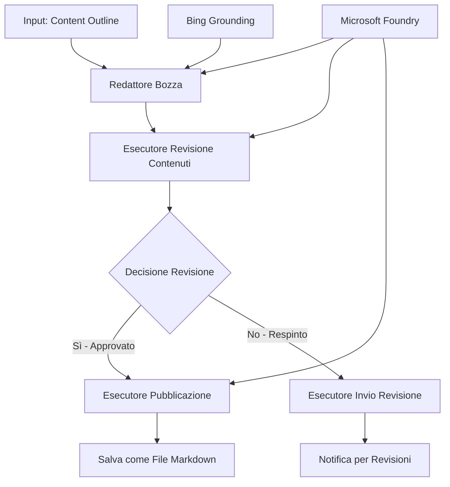

# 🔀 Flussi di Lavoro Condizionali per Agenti con Microsoft Foundry (.NET)

## 📋 Tutorial sul Flusso di Lavoro Intelligente Basato su Decisioni

Questo notebook dimostra **pattern di flusso di lavoro condizionale** utilizzando Microsoft Foundry e il Microsoft Agent Framework per .NET. Imparerai a costruire flussi di lavoro sofisticati, guidati da decisioni che instradano intelligentemente i processi basandosi su analisi AI, regole di business e condizioni dinamiche per un'automazione di livello enterprise.

## 🎯 Obiettivi di Apprendimento

### 🧠 **Architettura di Decisione Intelligente**
- **Implementazione della Logica Condizionale**: Costruire alberi decisionali complessi con molteplici diramazioni
- **Routing Potenziato da AI**: Usare modelli Microsoft Foundry per prendere decisioni di instradamento intelligenti
- **Adattamento Dinamico del Flusso di Lavoro**: Modificare il comportamento del flusso in base ad analisi e condizioni runtime
- **Integrazione di Regole Aziendali**: Incorporare logica di business e requisiti di conformità nei flussi di lavoro

### 🔀 **Pattern Condizionali Avanzati**
- **Decisione Multi-Criterio**: Valutare molteplici fattori per le decisioni di instradamento
- **Elaborazione Consapevole del Contesto**: Prendere decisioni basate sul contesto accumulato e sulla storia del flusso di lavoro
- **Modifica Adattiva del Flusso di Lavoro**: Regolare dinamicamente i percorsi di elaborazione basati su condizioni in tempo reale
- **Integrazione del Motore di Regole**: Implementare motori di regole aziendali sofisticati nei flussi di lavoro

### 🏢 **Applicazioni Condizionali Enterprise**
- **Classificazione & Instradamento Documenti**: Classificare e instradare automaticamente documenti ai flussi di lavoro appropriati
- **Triage del Servizio Clienti**: Instradamento intelligente delle richieste clienti ai team specializzati
- **Elaborazione di Conformità & Rischio**: Applicare processi di verifica e revisione diversi basati sulla valutazione del rischio
- **Flussi di Lavoro per Garanzia di Qualità**: Instradare il contenuto attraverso i processi di revisione appropriati basati su metriche di qualità

## ⚙️ Prerequisiti e Configurazione

### 📦 **Pacchetti NuGet Richiesti**

Pacchetti avanzati per l'elaborazione condizionale del flusso di lavoro:

```xml
<!-- Core AI Framework -->
<PackageReference Include="Microsoft.Extensions.AI" Version="9.9.0" />

<!-- Azure AI Agents with Persistent State -->
<PackageReference Include="Azure.AI.Agents.Persistent" Version="1.2.0-beta.5" />

<!-- Azure Identity and Utilities -->
<PackageReference Include="Azure.Identity" Version="1.15.0" />
<PackageReference Include="System.Linq.Async" Version="6.0.3" />
<PackageReference Include="DotNetEnv" Version="3.1.1" />

<!-- Local Workflow Framework References -->
<!-- Microsoft.Agents.Workflows.dll - Advanced workflow orchestration -->
<!-- Microsoft.Agents.AI.AzureAI.dll - Microsoft Foundry integration -->
<!-- Microsoft.Agents.AI.dll - Core agent abstractions -->
```

### 🔑 **Configurazione Microsoft Foundry**

**Risorse Azure Necessarie:**
- Workspace Microsoft Foundry con modelli per l'elaborazione condizionale
- Sottoscrizione Azure con quote di calcolo e permessi appropriati
- Modelli AI distribuiti per la presa di decisioni e l'analisi dei contenuti
- (Opzionale) Connessione API di Bing Search per capacità di grounding

**Configurazione Ambiente (file .env):**
```env
# Microsoft Foundry Configuration
AZURE_AI_PROJECT_ENDPOINT=https://your-project.cognitiveservices.azure.com/
BING_CONNECTION_ID=your-bing-connection-id
```

**Configurazione Autenticazione:**
```csharp
// Azure CLI or Managed Identity authentication
using Azure.Identity;
var credential = new AzureCliCredential();

// Load environment configuration
DotNetEnv.Env.Load("../../../.env");
```

### 🏗️ **Architettura del Flusso di Lavoro Condizionale**



**Componenti Chiave:**
- **Draft Executor**: Agente AI che crea bozze iniziali da scalette
- **Content Review Executor**: Agente AI che valuta la qualità e la conformità delle bozze
- **Instradamento Condizionale**: Logica decisionale che instrada in base ai risultati della revisione
- **Percorsi di Pubblicazione/Revisione**: Percorsi di elaborazione separati per contenuti approvati o respinti
- **Gestione dello Stato**: Mantiene il contesto del contenuto e della revisione per tutto il flusso di lavoro

## 🎨 **Pattern di Design per Flussi di Lavoro Condizionali**

### 📋 **Produzione di Contenuti con Gate di Qualità**
```
Outline → Draft Creation → Quality Review → {Approve: Publish | Reject: Revise}
```

### 🎯 **Elaborazione Documenti Basata sul Rischio**
```
Document → Risk Assessment → {Low: Standard | High: Enhanced Review}
```

### 🔍 **Instradamento Intelligente del Servizio Clienti**
```
Customer Query → Analysis → {Simple: FAQ Bot | Complex: Human Agent}
```

### 💼 **Flussi di Lavoro Guidati dalla Conformità**
```
Content → Compliance Check → {Pass: Publish | Fail: Legal Review}
```

## 🏢 **Benefici Condizionali Enterprise**

### 🎯 **Automazione Intelligente**
- **Decisioni Intelligenti**: Decisioni di instradamento potenziate da AI basate su analisi del contenuto e del contesto
- **Elaborazione Adattiva**: Flussi di lavoro che si adattano automaticamente a condizioni variabili
- **Applicazione delle Regole di Business**: Applicazione automatica di logiche e politiche aziendali complesse
- **Instradamento Consapevole del Contesto**: Decisioni basate sulla storia completa del flusso di lavoro e contesto accumulato

### 📈 **Eccellenza Operativa**
- **Allocazione Ottimizzata delle Risorse**: Instrada il lavoro agli specialisti e ai processi più appropriati
- **Riduzione delle Interventi Manuali**: Decisioni automatiche riducono la necessità di instradamento umano
- **Tempi di Risoluzione Più Veloci**: Instradamento diretto verso le competenze e capacità di elaborazione adeguate
- **Applicazione Consistente**: Applicazione uniforme di regole e criteri decisionali

### 🛡️ **Gestione del Rischio & Conformità**
- **Valutazione Automatica del Rischio**: Valutazione AI dei livelli di rischio di contenuto e situazione
- **Applicazione della Conformità**: Instradamento automatico attraverso i processi normativi richiesti
- **Applicazione di Protocolli di Sicurezza**: Misure di sicurezza potenziate applicate in base alla valutazione del rischio
- **Mantenimento della Traccia di Audit**: Documentazione completa delle decisioni di instradamento e motivazioni

### 📊 **Analisi & Miglioramento Continuo**
- **Analisi delle Decisioni**: Monitorare efficacia e accuratezza delle decisioni di instradamento
- **Riconoscimento di Pattern**: Identificare tendenze e schemi nelle decisioni di instradamento nel tempo
- **Ottimizzazione delle Prestazioni**: Miglioramento continuo dei criteri decisionali e dell'efficienza dell'instradamento
- **Business Intelligence**: Intuizioni sulle caratteristiche del contenuto e requisiti di elaborazione

### 🔧 **Eccellenza Tecnica**
- **Gestione Persistente dello Stato**: Mantenere stato complesso durante l'esecuzione del flusso di lavoro
- **Architettura Scalabile**: Gestire requisiti di elaborazione condizionale ad alto volume
- **Capacità di Integrazione**: Integrazione fluida con sistemi e processi aziendali esistenti
- **Monitoraggio & Osservabilità**: Tracciamento completo delle prestazioni e decisioni del flusso di lavoro

Costruiamo flussi di lavoro intelligenti e guidati da decisioni enterprise con .NET! 🚀

## 💻 Esecuzione del Codice

L'implementazione completa è disponibile in `04.dotnet-agent-framework-workflow-aifoundry-condition.cs`. Questo dimostra un **flusso di lavoro di produzione contenuti con gate di qualità**:

### 🏗️ **Architettura del Flusso di Lavoro**

```
Content Outline → Draft Creation → Quality Review → Conditional Routing:
                                                      ├─ Approved (>200 words) → Publish
                                                      └─ Rejected (<200 words) → Review Notification
```

**Agenti nel Flusso di Lavoro:**
1. **Agente Evangelista**: Crea bozze del tutorial da scalette con grounding Bing
2. **Agente Revisore Contenuti**: Valuta la qualità della bozza (conteggio parole, completezza)
3. **Agente Editore**: Salva contenuti approvati come file Markdown con timestamp

**Executor Personalizzati:**
1. **DraftExecutor**: Coordina la creazione delle bozze
2. **ContentReviewExecutor**: Esegue la valutazione della qualità
3. **PublishExecutor**: Gestisce la pubblicazione dei contenuti approvati
4. **SendReviewExecutor**: Gestisce le notifiche per contenuti respinti

### 🚀 Esecuzione dell'Esempio

**Prerequisiti:**
- Workspace Microsoft Foundry configurato
- Autenticazione Azure CLI (`az login`)
- (Opzionale) Connessione Bing Search per il grounding

```bash
# Rendi eseguibile lo script (Unix/Linux/macOS)
chmod +x 04.dotnet-agent-framework-workflow-aifoundry-condition.cs

# Esegui il flusso di lavoro condizionale
./04.dotnet-agent-framework-workflow-aifoundry-condition.cs
```

Oppure su Windows:
```powershell
dotnet run 04.dotnet-agent-framework-workflow-aifoundry-condition.cs
```

### 📝 Output Atteso

Il flusso di lavoro farà:
1. **Creare Agenti**: Inizializza tre agenti Microsoft Foundry specializzati
2. **Generare Bozza**: L'agente evangelista crea una bozza del tutorial dalla scaletta
3. **Revisionare Contenuti**: Il revisore valuta la qualità della bozza
4. **Instradamento Condizionale**:
   - **Se approvato (>200 parole)**: l'editore salva come file Markdown
   - **Se respinto (<200 parole)**: invia una notifica di revisione
5. **Mostrare Risultati**: Visualizza il risultato finale del flusso

### 🔧 Opzioni di Personalizzazione

**Modificare i Criteri di Revisione:**
```csharp
const string ContentReviewerInstructions = @"
You are a content reviewer...
1. Check if content is more than 500 words (instead of 200)
2. Verify technical accuracy
3. Ensure proper formatting
...";
```

**Aggiungere Più Percorsi Condizionali:**
```csharp
var workflow = new WorkflowBuilder(draftExecutor)
    .AddEdge(draftExecutor, contentReviewerExecutor)
    .AddEdge(contentReviewerExecutor, publishExecutor, condition: GetCondition("Excellent"))
    .AddEdge(contentReviewerExecutor, editExecutor, condition: GetCondition("Good"))
    .AddEdge(contentReviewerExecutor, sendReviewerExecutor, condition: GetCondition("Poor"))
    .Build();
```

**Cambiare i Requisiti del Contenuto:**
```csharp
string OUTLINE_Content = @"
# Your Custom Topic
## Section 1
https://your-reference-url
## Section 2
...
";
```

### 🎯 Applicazioni nel Mondo Reale

Questo pattern di flusso condizionale è ideale per:
- **Sistemi di Gestione Contenuti**: flussi editoriali automatizzati con gate di qualità
- **Elaborazione Documenti**: instradare documenti basati su classificazione e conformità
- **Supporto Clienti**: instradamento intelligente dei ticket basato su complessità e urgenza
- **Revisione Legale**: instradare contratti basati su valutazione del rischio e valore
- **Processi HR**: instradare candidature attraverso flussi di screening appropriati

### 🔍 Comprendere la Logica Condizionale

**Funzione di Condizione:**
```csharp
public Func<object?, bool> GetCondition(string expectedResult) =>
    reviewResult => reviewResult is ReviewResult review && review.Result == expectedResult;
```

Questa funzione crea un predicato che:
1. Verifica se il risultato è di tipo `ReviewResult`
2. Confronta la proprietà `Result` con il valore atteso
3. Restituisce true/false per determinare l'instradamento

**Archi del Flusso di Lavoro con Condizioni:**
```csharp
.AddEdge(contentReviewerExecutor, publishExecutor, condition: GetCondition("Yes"))
.AddEdge(contentReviewerExecutor, sendReviewerExecutor, condition: GetCondition("No"))
```

### 📊 Funzionalità Avanzate

**Validazione dello Schema JSON:**
Il flusso di lavoro usa schemi JSON per garantire risposte strutturate:

```csharp
// Define response structure
public class ReviewResult
{
    [JsonPropertyName("review_result")]
    public string Result { get; set; } = string.Empty;
    
    [JsonPropertyName("reason")]
    public string Reason { get; set; } = string.Empty;
    
    [JsonPropertyName("draft_content")]
    public string DraftContent { get; set; } = string.Empty;
}

// Apply to agent
ResponseFormat = ChatResponseFormat.ForJsonSchema(
    AIJsonUtilities.CreateJsonSchema(typeof(ReviewResult)), 
    "ReviewResult", 
    "Review Result From DraftContent"
)
```

**Integrazione Grounding Bing:**
L'agente evangelista usa il grounding Bing per accedere a informazioni in tempo reale:

```csharp
var bingGroundingConfig = new BingGroundingSearchConfiguration(bing_conn_id);
BingGroundingToolDefinition bingGroundingTool = new(
    new BingGroundingSearchToolParameters([bingGroundingConfig])
);
```

Questo permette all'agente di seguire URL nella scaletta ed estrarre informazioni aggiornate.

### 🛡️ Gestione degli Errori

Il flusso di lavoro include una robusta gestione degli errori per i contenuti respinti:
- Fallimenti di revisione attivano il percorso alternativo
- Le notifiche forniscono motivazioni chiare del rifiuto
- Il contenuto è preservato per la revisione

### 🔄 Estensione del Flusso di Lavoro

**Aggiungere un Ciclo di Revisione:**
Crea un ciclo di feedback che rifaccia automaticamente i contenuti:

```csharp
.AddEdge(contentReviewerExecutor, publishExecutor, condition: GetCondition("Yes"))
.AddEdge(contentReviewerExecutor, draftExecutor, condition: GetCondition("No")) // Loop back
```

**Implementare una Revisione a Livelli Multipli:**
Aggiungi più fasi di revisione con criteri diversi:

```csharp
.AddEdge(draftExecutor, technicalReviewer)
.AddEdge(technicalReviewer, editorialReviewer, condition: GetCondition("TechPass"))
.AddEdge(editorialReviewer, publishExecutor, condition: GetCondition("EditPass"))
```

Questo pattern di flusso condizionale fornisce la base per costruire sistemi di automazione enterprise sofisticati e intelligenti! 🚀

---

<!-- CO-OP TRANSLATOR DISCLAIMER START -->
**Disclaimer**:
Questo documento è stato tradotto utilizzando il servizio di traduzione AI [Co-op Translator](https://github.com/Azure/co-op-translator). Sebbene ci impegniamo per garantire la precisione, si prega di notare che le traduzioni automatizzate possono contenere errori o imprecisioni. Il documento originale nella sua lingua nativa deve essere considerato la fonte autorevole. Per informazioni critiche, si raccomanda una traduzione professionale effettuata da un essere umano. Non siamo responsabili per eventuali malintesi o interpretazioni errate derivanti dall’uso di questa traduzione.
<!-- CO-OP TRANSLATOR DISCLAIMER END -->