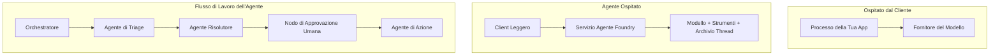
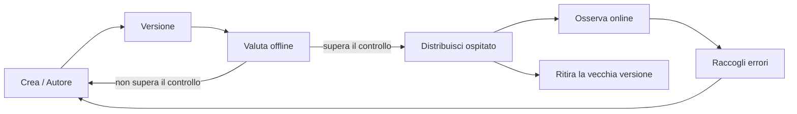
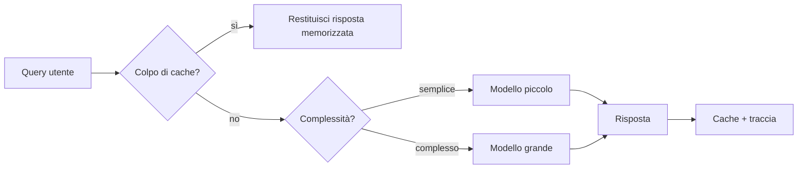
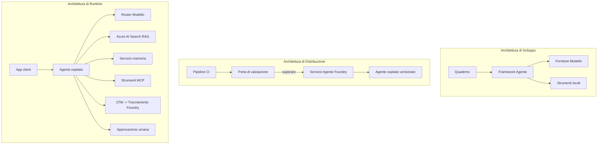

# Distribuire Agenti Scalabili con Microsoft Foundry


Finora nel corso hai creato agenti che funzionano sul tuo laptop, all'interno di un notebook, guidati da `az login` e da alcune variabili d'ambiente. Questo è esattamente il modo giusto per imparare. Non è però il modo giusto per eseguire un agente da cui migliaia di clienti dipendono alle 3 del mattino.

Questa lezione riguarda il divario tra "funziona sulla mia macchina" e "funziona, in modo affidabile e conveniente, in produzione." Colmiamo questo divario usando **Microsoft Foundry** e il **Microsoft Foundry Agent Service**, costruendo un vero agente di supporto clienti che dispone di strumenti, recupero, memoria, valutazione e monitoraggio.

## Introduzione

Questa lezione tratterà:

- La differenza tra un **agente prototipo** e un **agente distribuito**, e perché la transizione riguarda perlopiù tutto ciò che sta *intorno* al modello.
- **Pattern di distribuzione** per agenti: ospitato dal cliente, ospitato come servizio (Agenti Ospitati), e orchestrato da workflow.
- Il **ciclo di vita dell'agente** su Microsoft Foundry — creare, versionare, distribuire, valutare, osservare, ritirare.
- **Strategie di scalabilità**: instradamento del modello, caching, concorrenza, e progettazione senza stato.
- **Osservabilità** con OpenTelemetry e tracciamento Foundry.
- **Ottimizzazione dei costi** attraverso la selezione del modello, l'instradamento e le soglie di valutazione.
- **Considerazioni aziendali**: governance, approvazione umana, ed esecuzione sicura dei server MCP in produzione.

## Obiettivi di Apprendimento

Al termine di questa lezione, saprai come:

- Scegliere il pattern di distribuzione giusto per un determinato carico di lavoro agente.
- Distribuire un agente sul Microsoft Foundry Agent Service in modo che sia versionato, governato e osservabile.
- Strumentare un agente per il tracciamento e collegare una pipeline di valutazione che si esegue prima di ogni rilascio.
- Applicare instradamento del modello e caching per mantenere latenza e costo sotto controllo su scala.
- Aggiungere una soglia di approvazione umana per azioni ad alto rischio e integrare un server MCP in modo sicuro per la produzione.

## Prerequisiti

Questa lezione presume che tu abbia completato le lezioni precedenti e che ti senta a tuo agio con:

- Costruire agenti con il [Microsoft Agent Framework](../14-microsoft-agent-framework/README.md) (Lezione 14).
- [Utilizzo di Strumenti](../04-tool-use/README.md) (Lezione 4) e [Agentic RAG](../05-agentic-rag/README.md) (Lezione 5).
- [Memoria dell'Agente](../13-agent-memory/README.md) (Lezione 13) e [Protocolli Agentic / MCP](../11-agentic-protocols/README.md) (Lezione 11).
- [Osservabilità e Valutazione](../10-ai-agents-production/README.md) (Lezione 10) — questa lezione si basa direttamente su di essa.

Avrai anche bisogno di:

- Un'**abbonamento Azure** e un **progetto Microsoft Foundry** con almeno un modello di chat distribuito.
- L'**Azure CLI** autenticata (`az login`).
- Python 3.12+ e i pacchetti indicati nel file di repository [`requirements.txt`](../../../requirements.txt).

## Da Prototipo a Produzione: Cosa Cambia Davvero

Un agente prototipo e un agente di produzione condividono lo stesso ciclo principale — ragionare, chiamare strumenti, rispondere. Ciò che cambia è tutto ciò che circonda quel ciclo. Il modello rappresenta forse il 20% di un agente in produzione; l'altro 80% è lo scheletro operativo.

| Aspetto | Prototipo | Produzione |
| --- | --- | --- |
| **Hosting** | Funziona nel tuo notebook | Funziona come servizio ospitato, versionato e distribuito |
| **Identità** | Il tuo token `az login` | Identità gestita con RBAC a scoped |
| **Stato** | In memoria, perso al riavvio | Esteriorizzato (thread store, servizio di memoria) |
| **Fallimento** | Vedi il traceback | Ritenta, fallback, dead-letter, allerta |
| **Costo** | "Sono pochi centesimi" | Tracciato per richiesta, instradato, cachato, budgettato |
| **Qualità** | Valuti visivamente l'output | Valutato automaticamente prima di ogni rilascio |
| **Fiducia** | Approvi ogni azione | Policy + intervento umano per azioni rischiose |

Tieni a mente questa tabella. Ogni sezione qui sotto corrisponde a una di queste righe.

## Pattern di Distribuzione degli Agenti

Esistono tre pattern che userai, spesso in combinazione.

### 1. Agenti Ospitati dal Cliente

L'oggetto agente risiede *nel tuo* processo applicativo. Il tuo codice chiama direttamente il provider di modelli; il ciclo di ragionamento gira nel tuo servizio. È ciò che è stato fatto in tutte le lezioni precedenti.

- **Usalo quando** hai bisogno di pieno controllo sul ciclo, middleware personalizzati, o stai incorporando l'agente in un backend esistente.
- **Compromesso**: devi occuparti tu stesso di scalabilità, stato e resilienza.

### 2. Agenti Ospitati (Foundry Agent Service)

L'agente è *registrato come risorsa* in Microsoft Foundry. Foundry ospita il ciclo di ragionamento, memorizza i thread, applica la sicurezza dei contenuti e il RBAC, e rende l'agente visibile nel portale Foundry. La tua app diventa un client leggero che crea thread e legge risposte.

- **Usalo quando** desideri durabilità, osservabilità integrata, governance, e una minore superficie operativa.
- **Compromesso**: minore controllo di basso livello in cambio di un runtime gestito.

### 3. Workflow di Agenti

Più agenti (e strumenti) sono composti in un grafo con flusso di controllo esplicito — passaggi sequenziali, biforcazioni, nodi di approvazione umana, e checkpoint durevoli che possono mettere in pausa e riprendere. Questa è la funzionalità **Workflow** del Microsoft Agent Framework applicata alla scala di distribuzione.

- **Usalo quando** un singolo compito coinvolge diversi agenti specializzati o richiede un passaggio di approvazione in mezzo.
- **Compromesso**: più componenti in movimento; necessita di osservabilità a livello di orchestrazione.



## Ciclo di Vita dell'Agente su Microsoft Foundry

Distribuire un agente non è un `push` fatto una sola volta. È un ciclo, e assomiglia molto a un ciclo di rilascio software perché è proprio quello che è.



L'idea chiave, ripresa da [Lezione 10](../10-ai-agents-production/README.md): **la valutazione offline è una soglia, non un ripensamento.** Una nuova versione dell'agente non viene rilasciata a meno che non superi le tue soglie di valutazione. L'osservabilità online poi alimenta i fallimenti nel mondo reale nel tuo set di test offline. Questo è tutto il ciclo.

## Strategie di Scalabilità

Scalare un agente è diverso da scalare una API web senza stato, perché ogni richiesta può innescare molteplici chiamate costose a modelli e strumenti. Quattro tecniche portano la maggior parte del carico.

**Gestione delle richieste senza stato.** Non mantenere stato per utente nella memoria del processo. Conserva i thread di conversazione nel thread store di Foundry o in un servizio di memoria così qualsiasi istanza può gestire qualsiasi richiesta. Questo permette la scalabilità orizzontale — aggiungere istanze, niente sessioni sticky.

**Instradamento del modello.** Non ogni richiesta ha bisogno del modello più capace (e più costoso). Instrada richieste semplici — classificazione dell'intento, risposte fattuali brevi — verso un modello piccolo e veloce, e riserva il modello più grande per il vero ragionamento. Il **Model Router** di Foundry può fare questo per te, oppure puoi implementare un classificatore leggero da solo. Costruirai la versione fai-da-te nel laboratorio.

**Caching delle risposte.** Molte richieste di supporto sono quasi duplicati ("come resetto la mia password?"). Metti in cache le risposte alle domande comuni e servile senza colpire il modello. Anche un modesto tasso di hit della cache riduce in modo significativo costi e latenza.

**Concorrenza e backpressure.** I provider di modelli hanno limiti di velocità. Limita la tua concorrenza, usa retry con backoff esponenziale, e falla franca (una risposta in coda "ci stiamo lavorando" batte un 500).



## Osservabilità in Produzione

Non puoi gestire ciò che non puoi vedere. Come trattato nella Lezione 10, il Microsoft Agent Framework emette tracciamenti **OpenTelemetry** nativi — ogni chiamata modello, invocazione strumento, e passo dell'orchestrazione diventa uno span. In produzione esporti questi span su Microsoft Foundry (o qualsiasi backend compatibile OTel) così puoi:

- Tracciare una singola lamentela del cliente end-to-end attraverso ogni chiamata modello e strumento.
- Osservare la latenza p50/p95 e il costo per richiesta nel tempo.
- Segnalare picchi di tasso di errore e anomalie di costo prima che gli utenti (o il team finanziario) se ne accorgano.

```python
from agent_framework.observability import get_tracer

tracer = get_tracer()

with tracer.start_as_current_span("support_request") as span:
    span.set_attribute("customer.tier", "enterprise")
    span.set_attribute("routed.model", "gpt-4.1-mini")
    # l'esecuzione dell'agente viene tracciata automaticamente all'interno di questa span
```

Attributi come `customer.tier` e `routed.model` trasformano un muro di tracce in domande a cui si può rispondere ("i clienti enterprise vengono instradati troppo spesso al modello piccolo?").

## Ottimizzazione dei Costi

Il costo negli agenti in produzione è dominato dai token. Tre leve, in ordine di impatto:

1. **Dimensionare correttamente il modello.** Un modello piccolo che supera la tua soglia di valutazione è quasi sempre più economico di uno grande che la supera. Usa la valutazione per *dimostrare* che il modello piccolo è abbastanza buono piuttosto che predefinire il modello più grande per prudenza.
2. **Instradare in base alla complessità.** Come sopra — paga i prezzi del modello grande solo per richieste che richiedono il ragionamento del modello grande.
3. **Fare caching aggressivamente.** La chiamata al modello più economica è quella che non fai mai.

Le soglie di valutazione e il controllo dei costi sono la stessa disciplina vista da due angolazioni: la valutazione ti dice il *pavimento di qualità*, instradamento e caching ti tengono il più vicino possibile al *costo* di quel pavimento.

## Considerazioni Aziendali per la Distribuzione

**Governance.** Gli Agenti Ospitati ereditano il RBAC di Foundry, la sicurezza dei contenuti e il logging di audit. Dai a ogni agente un'identità gestita con il minimo privilegio necessario — accesso in sola lettura al knowledge base, accesso scoped all'API di ticketing, nulla di più.

**Intervento umano nel ciclo.** Alcune azioni sono troppo importanti per essere automatizzate completamente — emettere un rimborso, cancellare un account, scalare a un team legale. Il Microsoft Agent Framework supporta strumenti che richiedono **approvazione**: l'agente propone l'azione, l'esecuzione si mette in pausa, un umano approva o rifiuta, e il workflow riprende. Hai visto questa primitiva nella [Lezione 6](../06-building-trustworthy-agents/README.md); qui la distribuisci.

**MCP in produzione.** [MCP](../11-agentic-protocols/README.md) permette al tuo agente di utilizzare strumenti esterni tramite un'interfaccia standard. In produzione, tratta ogni server MCP come un confine non attendibile: fissa la versione del server, eseguilo con un'identità scoped, convalida i suoi output, e non esporre mai segreti a esso. Un server MCP è una dipendenza, e le dipendenze vengono patchate, auditate, e limitate nel tasso di utilizzo.



Quei tre diagrammi — sviluppo, distribuzione, runtime — rappresentano lo stesso agente in tre fasi della sua vita. Il laboratorio che segue ti guida nella sua costruzione.

## Laboratorio Pratico: Un Agente di Supporto Clienti Pronto per la Produzione

Apri [`code_samples/16-python-agent-framework.ipynb`](./code_samples/16-python-agent-framework.ipynb) e seguilo dall'inizio alla fine. Assemblerai un **agente di supporto clienti Contoso** con ogni preoccupazione di produzione collegata:

1. **Chiamata strumenti** — cerca lo stato degli ordini e apri ticket di supporto.
2. **RAG** — rispondi a domande di policy da una knowledge base (Azure AI Search, con fallback in memoria così il notebook funziona senza risorsa Search).
3. **Memoria** — ricorda il cliente attraverso i turni della conversazione.
4. **Instradamento modello** — un classificatore di complessità instrada ogni richiesta a un modello piccolo o grande.
5. **Caching delle risposte** — domande ripetute sono servite dalla cache.
6. **Approvazione umana** — rimborsi sopra una soglia si mettono in pausa per l'approvazione umana.
7. **Pipeline di valutazione** — un piccolo set di test offline valuta l'agente e funge da soglia di rilascio.
8. **Osservabilità** — tracciamento OpenTelemetry attorno a ogni richiesta.

### Guida passo-passo

Il notebook è organizzato in modo che ogni preoccupazione di produzione sia una sezione autonoma e eseguibile. Il cuore è il gestore di richieste routing-plus-caching:

```python
async def handle_support_request(query: str, customer_id: str) -> str:
    # 1. Servire dalla cache quando possibile.
    cached = response_cache.get(normalize(query))
    if cached:
        return cached

    # 2. Instradare per complessità per controllare i costi.
    model = "gpt-4.1-mini" if is_simple(query) else "gpt-4.1"

    # 3. Eseguire l'agente all'interno di una traccia per l'osservabilità.
    with tracer.start_as_current_span("support_request") as span:
        span.set_attribute("routed.model", model)
        span.set_attribute("customer.id", customer_id)
        response = await support_agent.run(query, model=model)

    # 4. Memorizzare nella cache e restituire.
    response_cache.set(normalize(query), response.text)
    return response.text
```

La soglia di valutazione che protegge un rilascio è così:

```python
async def evaluation_gate(agent, test_cases, threshold: float = 0.8) -> bool:
    passed = 0
    for case in test_cases:
        result = await agent.run(case["input"])
        if score_response(result.text, case["expected"]) >= 0.8:
            passed += 1
    pass_rate = passed / len(test_cases)
    print(f"Evaluation pass rate: {pass_rate:.0%} (gate: {threshold:.0%})")
    return pass_rate >= threshold  # distribuisci solo se il gate passa
```

Leggi ogni riga — il notebook mantiene le primitive volutamente piccole così che nulla resta nascosto dietro una chiamata del framework.

## Validare un Agente Distribuito con Test Smoke

La soglia di valutazione sopra gira *offline* contro il tuo oggetto agente. Una volta che l'agente è distribuito come Agente Ospitato, serve un controllo in più, ancora più economico: **il punto di accesso distribuito sta effettivamente rispondendo?**

Distribuire "con successo" dimostra solo che il piano di controllo ha accettato la definizione — non dimostra che l'agente risponde. Una dipendenza mancante, un cattivo instradamento modello o una connessione scaduta possono lasciare una distribuzione verde che non risponde nulla. Un **test smoke** cattura questo in secondi, ad ogni distribuzione, senza il costo di una valutazione completa.

Questo repository fornisce una pipeline test smoke pronta all'uso costruita sull'azione GitHub [AI Smoke Test](https://github.com/marketplace/actions/ai-smoke-test):

- **Catalogo** — [`tests/lesson-16-smoke-tests.json`](../../../tests/lesson-16-smoke-tests.json) contiene prompt e asserzioni per l'agente di supporto Contoso (risposte di policy fondate, ricerca ordine, rimanere in tema e continuità di thread multi-turno). Cataloghi per agenti di altre lezioni vivono accanto a questo — vedi [`tests/README.md`](../tests/README.md).
- **Workflow** — [`.github/workflows/smoke-test.yml`](../../../.github/workflows/smoke-test.yml) effettua il login con Azure OIDC e invia in POST ogni prompt al punto di accesso Responses dell'agente, fallendo il lavoro per ogni asserzione non rispettata.

```yaml
- name: Smoke-test hosted agent
  uses: JFolberth/ai-smoketest@v1
  with:
    project_endpoint: ${{ inputs.project_endpoint }}
    agent_name: ContosoSupportAgent
    tests_file: tests/lesson-16-smoke-tests.json
```


Eseguilo dalla scheda **Azioni** una volta che il tuo agente è stato distribuito, fornendo l'endpoint del progetto Foundry e il nome dell'agente. L'identità federata necessita del ruolo **Azure AI User** nell'ambito del progetto Foundry. Pensa agli strati come a una piramide: i test smoke (raggiungibile e risponde?) vengono eseguiti ad ogni distribuzione, la valutazione offline (abbastanza buona per essere distribuita?) viene eseguita prima della promozione, e la valutazione online (come si comporta sul campo?) viene eseguita continuamente.

## Verifica della conoscenza

Metti alla prova la tua comprensione prima di passare all’assegnazione.

**1. Più o meno quanto di un agente di produzione è "il modello" e cos’è il resto?**

<details>
<summary>Risposta</summary>

Il modello rappresenta una minoranza del sistema — spesso citato intorno al 20%. Il resto è lo scheletro operativo: hosting e gestione delle versioni, identità e RBAC, stato esternalizzato, gestione degli errori, monitoraggio dei costi, valutazione e controlli con intervento umano. Passare alla produzione significa per lo più costruire tutto *intorno* al ciclo di ragionamento.
</details>

**2. Quando sceglieresti un Hosted Agent rispetto a un agente ospitato dal client?**

<details>
<summary>Risposta</summary>

Quando desideri un runtime gestito con durabilità incorporata (thread che persistono e possono riprendere), osservabilità, sicurezza dei contenuti e RBAC, e sei disposto a rinunciare a un po’ di controllo a basso livello sul ciclo di ragionamento per una superficie operativa minore. Ospitare il client è preferibile quando è necessario il pieno controllo sul ciclo o stai integrando l’agente in un backend esistente.
</details>

**3. Perché un agente scalabile deve essere senza stato nella memoria del suo processo?**

<details>
<summary>Risposta</summary>

Così ogni istanza può gestire qualsiasi richiesta, permettendo la scalabilità orizzontale senza sessioni sticky. Lo stato della conversazione per utente è esternalizzato in un archivio thread o in un servizio di memoria. Se lo stato vivesse nella memoria di processo, lo perderesti al riavvio e non potresti distribuire il carico liberamente.
</details>

**4. Quale problema risolve il model routing, e come si collega alla valutazione?**

<details>
<summary>Risposta</summary>

Il routing invia richieste semplici a un modello piccolo, economico e veloce e riserva il modello grande per il ragionamento genuino, controllando sia la latenza che il costo. Si collega alla valutazione perché la valutazione è ciò che *dimostra* che il modello piccolo è abbastanza buono per una classe di richieste — il routing senza valutazione è una supposizione.
</details>

**5. Che cos’è una "evaluation gate" e dove si colloca nel ciclo di vita?**

<details>
<summary>Risposta</summary>

Una evaluation gate esegue un test set offline su una nuova versione dell’agente e blocca la distribuzione se il tasso di superamento non supera una soglia. Si colloca tra "versione" e "distribuzione" nel ciclo di vita, facendo della qualità una condizione preliminare per il rilascio anziché qualcosa da controllare dopo la spedizione.
</details>

**6. Perché un server MCP deve essere trattato come un confine non attendibile in produzione?**

<details>
<summary>Risposta</summary>

Perché è una dipendenza esterna a cui il tuo agente si collega. Dovresti fissare la sua versione, eseguirlo con un'identità con ambito limitato, validarne gli output, limitarne la frequenza e non esporre mai segreti — la stessa disciplina che si applica a qualsiasi dipendenza di terze parti. I suoi output entrano nel ragionamento del tuo agente, quindi la fiducia non validata è un rischio per la sicurezza.
</details>

**7. Quale singola modifica di solito ha il maggiore impatto sul costo di un agente in produzione, e perché?**

<details>
<summary>Risposta</summary>

Dimensionare correttamente il modello — usare il modello più piccolo che supera ancora la tua evaluation gate. Il costo è dominato dai token, e un modello più piccolo che soddisfa lo standard di qualità è quasi sempre meno costoso di uno più grande. La cache e il routing riducono ulteriormente il costo, ma scegliere il modello base giusto ha l’effetto primario più grande.
</details>

**8. Che ruolo svolgono attributi di span come `customer.tier` e `routed.model` nell’osservabilità?**

<details>
<summary>Risposta</summary>

Trasformano le tracce grezze in domande commerciali cui si può rispondere. Senza attributi hai un muro di span; con essi puoi chiedere “i clienti aziendali vengono indirizzati troppo spesso al modello piccolo?” o “quale modello gestisce le nostre richieste più lente?” Gli attributi permettono di segmentare la telemetria secondo le dimensioni importanti per la tua operazione.
</details>

## Assegnazione

Prendi l’agente di assistenza clienti dal laboratorio e rendilo robusto per un caso specifico: **un agente di supporto alla fatturazione degli abbonamenti per un’azienda SaaS.**

La tua consegna dovrebbe:

1. **Sostituire gli strumenti** con quelli rilevanti per la fatturazione: `get_subscription_status`, `get_invoice`, e `issue_credit` (i crediti sopra i 50 dollari richiedono approvazione umana).
2. **Aggiungere tre documenti RAG** che coprano la politica di rimborso dell’azienda, il ciclo di fatturazione e la politica di cancellazione.
3. **Estendere il set di valutazione** a almeno otto casi, inclusi almeno due che *dovrebbero* attivare il percorso di approvazione umana, e confermare che la tua evaluation gate passi o fallisca correttamente.
4. **Aggiungere un rapporto sui costi**: dopo aver eseguito dieci query miste tramite l’agente, stampa quante sono andate al modello piccolo, quante al modello grande e quante sono state servite dalla cache.

Scrivi un breve paragrafo (in una cella markdown) spiegando quale regola di model-routing hai scelto e come la convalideresti con traffico reale. Non esiste una singola risposta corretta — verrai valutato su come i problemi di produzione sono connessi coerentemente.

## Riepilogo

In questa lezione hai portato un agente dal prototipo alla produzione con Microsoft Foundry:

- Il salto alla produzione riguarda soprattutto lo **scheletro operativo** intorno al modello — hosting, identità, stato, gestione errori, costo, qualità e fiducia.
- Hai imparato i tre **pattern di distribuzione** — client-hosted, Hosted Agents e Agent Workflows — e quando ognuno è adatto.
- Hai seguito il **ciclo di vita dell’agente**, dove la valutazione offline **agisce come un gate di rilascio** e l’osservabilità online alimenta i fallimenti nel set di test.
- Hai applicato **strategie di scaling** — design senza stato, model routing, caching e concorrenza limitata — e le hai collegate all’**ottimizzazione dei costi**.
- Hai integrato **controlli enterprise**: RBAC, approvazione con intervento umano e integrazione MCP sicura in produzione.
- Hai costruito un **agente di supporto clienti pronto per la produzione** che riunisce tutte queste preoccupazioni in codice eseguibile.

La prossima lezione compie il percorso opposto: invece di scalare gli agenti nel cloud, li porterai *giù* su una singola macchina di sviluppo e li farai girare completamente in locale.

## Risorse aggiuntive

- <a href="https://learn.microsoft.com/azure/ai-foundry/what-is-azure-ai-foundry" target="_blank">Documentazione Microsoft Foundry</a>
- <a href="https://learn.microsoft.com/azure/ai-foundry/agents/overview" target="_blank">Panoramica del servizio Agent di Microsoft Foundry</a>
- <a href="https://aka.ms/ai-agents-beginners/agent-framework" target="_blank">Microsoft Agent Framework</a>
- <a href="https://learn.microsoft.com/azure/ai-foundry/concepts/model-router" target="_blank">Model Router in Microsoft Foundry</a>
- <a href="https://learn.microsoft.com/azure/search/search-what-is-azure-search" target="_blank">Azure AI Search</a>
- <a href="https://opentelemetry.io/" target="_blank">OpenTelemetry</a>
- <a href="https://github.com/marketplace/actions/ai-smoke-test" target="_blank">AI Smoke Test GitHub Action</a>
- <a href="https://modelcontextprotocol.io/" target="_blank">Model Context Protocol (MCP)</a>

## Lezione precedente

[Building Computer Use Agents (CUA)](../15-browser-use/README.md)

## Lezione successiva

[Creating Local AI Agents](../17-creating-local-ai-agents/README.md)

---

<!-- CO-OP TRANSLATOR DISCLAIMER START -->
**Disclaimer**:
Questo documento è stato tradotto utilizzando il servizio di traduzione AI [Co-op Translator](https://github.com/Azure/co-op-translator). Sebbene ci impegniamo per garantire la precisione, si prega di notare che le traduzioni automatizzate possono contenere errori o imprecisioni. Il documento originale nella sua lingua nativa deve essere considerato la fonte autorevole. Per informazioni critiche, si raccomanda una traduzione professionale effettuata da un essere umano. Non siamo responsabili per eventuali malintesi o interpretazioni errate derivanti dall’uso di questa traduzione.
<!-- CO-OP TRANSLATOR DISCLAIMER END -->