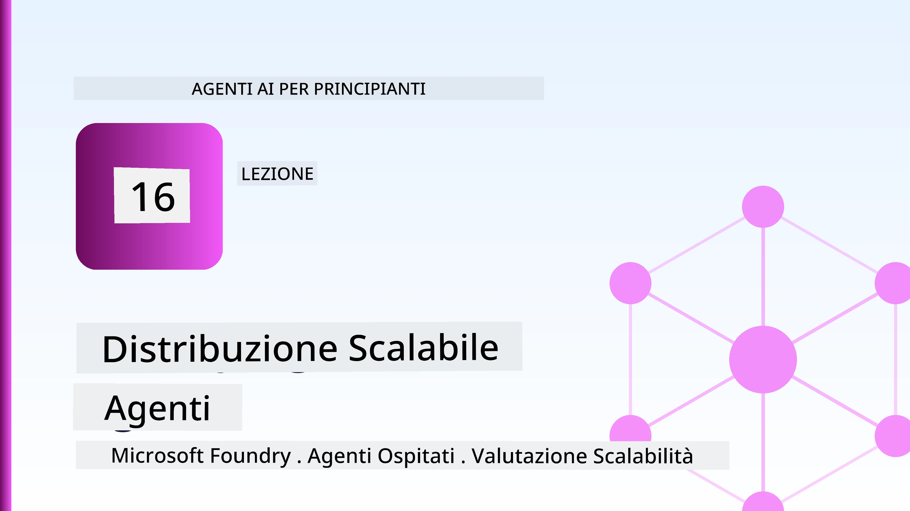
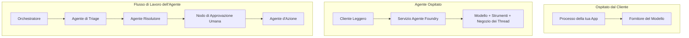
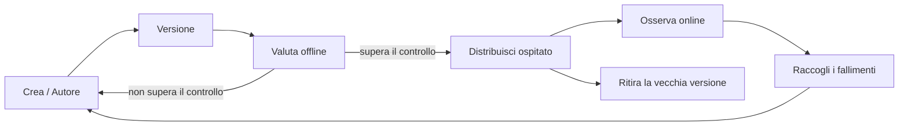
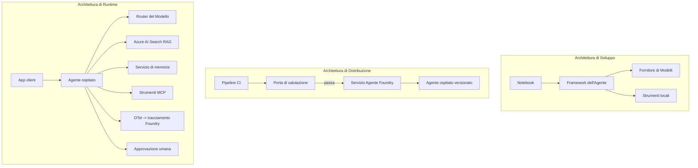

# Distribuire agenti scalabili con Microsoft Foundry



Fino a questo punto del corso, hai creato agenti che girano sul tuo laptop, all'interno di un notebook, guidati da `az login` e da una manciata di variabili d'ambiente. Questo è esattamente il modo giusto per imparare. Non è però il modo giusto per far funzionare un agente da cui migliaia di clienti dipendono alle 3 del mattino.

Questa lezione parla del divario tra "funziona sulla mia macchina" e "funziona, in modo affidabile e conveniente, in produzione." Chiudiamo questo divario usando **Microsoft Foundry** e il **Microsoft Foundry Agent Service**, costruendo un vero agente per il supporto clienti dotato di strumenti, retrieval, memoria, valutazione e monitoraggio.

## Introduzione

Questa lezione coprirà:

- La differenza tra un **agente prototipo** e un **agente distribuito**, e perché la transizione riguarda per lo più tutto ciò che sta *intorno* al modello.
- I **modelli di distribuzione** per agenti: ospitato dal client, ospitato come servizio (Hosted Agents), e orchestrato da workflow.
- Il **ciclo di vita dell'agente** su Microsoft Foundry — creare, versionare, distribuire, valutare, osservare, ritirare.
- Le **strategie di scalabilità**: instradamento del modello, caching, concorrenza e design senza stato.
- **Osservabilità** con OpenTelemetry e tracing di Foundry.
- **Ottimizzazione dei costi** tramite selezione del modello, instradamento e cancelli di valutazione.
- **Considerazioni aziendali**: governance, approvazione umana e gestione sicura dei server MCP in produzione.

## Obiettivi di apprendimento

Dopo aver completato questa lezione, saprai come:

- Scegliere il modello di distribuzione giusto per un dato carico di lavoro agente.
- Distribuire un agente nel Microsoft Foundry Agent Service affinché sia versionato, governato e osservabile.
- Strumentare un agente per il tracing e collegare una pipeline di valutazione che si esegue prima di ogni rilascio.
- Applicare instradamento del modello e caching per mantenere latenza e costi sotto controllo su scala.
- Aggiungere un cancello di approvazione umana per azioni ad alto rischio e integrare un server MCP in modo sicuro per la produzione.

## Prerequisiti

Questa lezione presume che tu abbia completato le lezioni precedenti e che ti senta a tuo agio con:

- Costruire agenti con il [Microsoft Agent Framework](../14-microsoft-agent-framework/README.md) (Lezione 14).
- [Uso degli strumenti](../04-tool-use/README.md) (Lezione 4) e [Agentic RAG](../05-agentic-rag/README.md) (Lezione 5).
- [Memoria dell'agente](../13-agent-memory/README.md) (Lezione 13) e [Protocolli agentici / MCP](../11-agentic-protocols/README.md) (Lezione 11).
- [Osservabilità e valutazione](../10-ai-agents-production/README.md) (Lezione 10) — questa lezione si basa direttamente su di essa.

Avrai anche bisogno di:

- Un **abbonamento Azure** e un **progetto Microsoft Foundry** con almeno un modello chat distribuito.
- La **Azure CLI** autenticata (`az login`).
- Python 3.12+ e i pacchetti nel repository [`requirements.txt`](../../../requirements.txt).

## Da prototipo a produzione: cosa cambia realmente

Un agente prototipo e un agente di produzione condividono lo stesso ciclo principale — ragionare, chiamare strumenti, rispondere. Cambia tutto ciò che racchiude quel ciclo. Il modello rappresenta forse il 20% di un agente di produzione; l'altro 80% è lo scheletro operativo.

| Aspetto | Prototipo | Produzione |
| --- | --- | --- |
| **Hosting** | Gira nel tuo notebook | Gira come servizio ospitato, versionato e distribuito |
| **Identità** | Il tuo token `az login` | Identità gestita con RBAC limitato |
| **Stato** | In memoria, perso al riavvio | Esteriorizzato (thread store, servizio di memoria) |
| **Guasti** | Vedi il traceback | Ritenta, fallback, dead-letter, avvisi |
| **Costo** | "Sono pochi centesimi" | Tracciato per richiesta, instradato, memorizzato in cache, budgettato |
| **Qualità** | Valuti a occhio l'output | Valutato automaticamente prima di ogni rilascio |
| **Fiducia** | Approvi ogni azione | Policy + intervento umano per azioni a rischio |

Tieni a mente questa tabella. Ogni sezione sotto corrisponde a una di queste righe.

## Modelli di distribuzione degli agenti

Esistono tre modelli che userai, spesso in combinazione.

### 1. Agenti ospitati dal client

L'oggetto agente vive all'interno del processo della *tua* applicazione. Il tuo codice chiama direttamente il provider modello; il ciclo di ragionamento gira nel tuo servizio. Questo è quanto fatto in ogni lezione precedente.

- **Usalo quando** hai bisogno di completo controllo sul ciclo, middleware personalizzato, o stai incorporando l'agente in un backend esistente.
- **Compromesso**: ti occupi personalmente di scalabilità, stato e resilienza.

### 2. Agenti ospitati (Foundry Agent Service)

L'agente è *registrato come risorsa* in Microsoft Foundry. Foundry ospita il ciclo di ragionamento, conserva i thread, applica la sicurezza dei contenuti e RBAC, e rende l'agente visibile nel portale Foundry. La tua app diventa un client leggero che crea thread e legge le risposte.

- **Usalo quando** vuoi durabilità, osservabilità integrata, governance e meno superficie operativa.
- **Compromesso**: meno controllo di basso livello in cambio di un runtime gestito.

### 3. Workflow degli agenti

Più agenti (e strumenti) sono composti in un grafo con flusso di controllo esplicito — passi sequenziali, diramazioni, nodi di approvazione umana, e checkpoint duraturi che possono mettere in pausa e riprendere. Questa è la capacità **Workflows** del Microsoft Agent Framework applicata su scala di distribuzione.

- **Usalo quando** un singolo compito coinvolge diversi agenti specializzati o richiede un passaggio di approvazione a metà.
- **Compromesso**: più parti in movimento; necessita di osservabilità a livello di orchestrazione.



## Il ciclo di vita dell'agente su Microsoft Foundry

Distribuire un agente non è un singolo `push`. È un ciclo, che assomiglia molto a un ciclo di rilascio software perché lo è.



L’idea chiave, mutuata dalla [Lezione 10](../10-ai-agents-production/README.md): **la valutazione offline è un cancello, non un ripensamento.** Una nuova versione dell’agente non viene distribuita se non supera le soglie di valutazione. L’osservabilità online poi reimmette i guasti del mondo reale nel set di test offline. Questo è tutto il ciclo.

## Strategie di scalabilità

Scalare un agente è diverso dal scalare un'API web senza stato, perché ogni richiesta può innescare molteplici chiamate costose a modelli e strumenti. Quattro tecniche reggono la maggior parte del carico.

**Gestione senza stato delle richieste.** Non mantenere stato per utente in memoria del processo. Conserva i thread della conversazione nello store Foundry o in un servizio di memoria così che qualsiasi istanza possa gestire qualsiasi richiesta. Questo ti permette di scalare orizzontalmente — aggiungi istanze, niente sessioni sticky.

**Instradamento del modello.** Non ogni richiesta necessita del modello più capace (e più costoso). Instrada richieste semplici — classificazione d'intento, risposte brevi e fattuali — a un modello piccolo e veloce, e riserva il modello grande al vero ragionamento. Il **Model Router** di Foundry può farlo per te, oppure puoi implementare un classificatore leggero da solo. Costruirai la versione fai-da-te nel laboratorio.

**Caching delle risposte.** Molte domande di supporto sono quasi duplicati ("come resettare la password?"). Memorizza in cache le risposte alle domande comuni e servile senza chiamare affatto il modello. Anche un modesto tasso di hit sulla cache riduce significativamente costi e latenza.

**Concorrenza e backpressure.** I provider del modello hanno limiti di velocità. Limita la concorrenza, usa ritenti con backoff esponenziale, e fallisci in modo elegante (una risposta in coda tipo "ci stiamo lavorando" è meglio di un 500).


## Osservabilità in produzione

Non puoi gestire ciò che non vedi. Come descritto nella Lezione 10, il Microsoft Agent Framework emette tracce **OpenTelemetry** in modo nativo — ogni chiamata modello, invocazione di strumento, e passo di orchestrazione diventa uno span. In produzione, esporti quegli span in Microsoft Foundry (o in qualsiasi backend OTel-compatibile) così puoi:

- Tracciare un singolo reclamo cliente end-to-end attraverso ogni chiamata modello e strumento.
- Monitorare latenza e costi p50/p95 per richiesta nel tempo.
- Allertare su picchi di errori e anomalie di costo prima che gli utenti (o il team finanziario) li notino.

```python
from agent_framework.observability import get_tracer

tracer = get_tracer()

with tracer.start_as_current_span("support_request") as span:
    span.set_attribute("customer.tier", "enterprise")
    span.set_attribute("routed.model", "gpt-5-nano")
    # l'esecuzione dell'agente viene tracciata automaticamente all'interno di questo intervallo
```

Attributi come `customer.tier` e `routed.model` trasformano un muro di tracce in domande a cui si può rispondere ("i clienti enterprise vengono instradati troppo spesso al modello piccolo?").

## Ottimizzazione dei costi

I costi degli agenti in produzione sono dominati dai token. Tre leve, in ordine di impatto:

1. **Dimensionare correttamente il modello.** Un modello piccolo che supera il cancello di valutazione è quasi sempre più economico di uno grande che supera anch’esso. Usa la valutazione per *dimostrare* che il modello piccolo è abbastanza buono invece di scegliere di default il modello più grande per precauzione.
2. **Instradare in base alla complessità.** Come sopra — paga il prezzo del modello grande solo per le richieste che richiedono ragionamento modello grande.
3. **Fare caching aggressivo.** La chiamata modello più economica è quella che non fai mai.

I cancelli di valutazione e il controllo dei costi sono la stessa disciplina vista da due angolazioni: la valutazione determina il *pavimento di qualità*, l’instradamento e il caching ti tengono il più vicino possibile al *costo* di quel pavimento.

## Considerazioni per la distribuzione aziendale

**Governance.** Gli Agenti Ospitati ereditano il RBAC di Foundry, la sicurezza dei contenuti e il logging di audit. Dai a ogni agente un’identità gestita con il privilegio minimo necessario — accesso in sola lettura alla base di conoscenza, accesso limitato all’API ticketing, nient’altro.

**Umano nel ciclo.** Alcune azioni sono troppo importanti per essere automatizzate integralmente — emettere un rimborso, eliminare un account, escalation al team legale. Il Microsoft Agent Framework supporta strumenti **che richiedono approvazione**: l’agente propone l’azione, l’esecuzione si mette in pausa, un umano approva o respinge, e il workflow riprende. Hai visto il primitivo nella [Lezione 6](../06-building-trustworthy-agents/README.md); qui lo distribuisci.

**MCP in produzione.** [MCP](../11-agentic-protocols/README.md) ti consente di far consumare strumenti esterni al tuo agente tramite un’interfaccia standard. In produzione, tratta ogni server MCP come un confine non attendibile: fissa la versione del server, eseguilo con un’identità limitata, convalida le sue uscite, e non esporre mai segreti. Un server MCP è una dipendenza, e le dipendenze vanno patchate, revisionate e limitate in velocità.



Questi tre diagrammi — sviluppo, distribuzione, runtime — sono lo stesso agente in tre fasi della sua vita. Il laboratorio seguente ti guida nella sua costruzione.

## Laboratorio pratico: un agente di supporto clienti pronto per la produzione

Apri [`code_samples/16-python-agent-framework.ipynb`](./code_samples/16-python-agent-framework.ipynb) e seguilo dall’inizio alla fine. Assemblerai un **agente di supporto clienti Contoso** con ogni aspetto di produzione integrato:

1. **Chiamata strumenti** — verifica stato ordini e apre ticket di supporto.
2. **RAG** — risponde a domande di policy da una base di conoscenza (Azure AI Search, con fallback in memoria per far girare il notebook senza risorsa Search).
3. **Memoria** — ricorda il cliente tra i turni della conversazione.
4. **Instradamento del modello** — un classificatore di complessità instrada ogni richiesta a modello piccolo o grande.
5. **Caching delle risposte** — le domande ripetute sono servite da cache.
6. **Approvazione umana** — rimborsi sopra una soglia mettono in pausa in attesa di firma umana.
7. **Pipeline di valutazione** — un piccolo set di test offline valuta l’agente e agisce da cancello di rilascio.
8. **Osservabilità** — tracciamento OpenTelemetry attorno a ogni richiesta.

### Guida passo passo

Il notebook è organizzato in modo che ogni aspetto di produzione sia una sezione autonoma eseguibile. Il nucleo è il gestore delle richieste routing-plus-caching:

```python
async def handle_support_request(query: str, customer_id: str) -> str:
    # 1. Servire dalla cache quando possibile.
    cached = response_cache.get(normalize(query))
    if cached:
        return cached

    # 2. Indirizzare in base alla complessità per controllare i costi.
    model = "gpt-5-nano" if is_simple(query) else "gpt-5-mini"

    # 3. Eseguire l'agente all'interno di uno span di tracciamento per l'osservabilità.
    with tracer.start_as_current_span("support_request") as span:
        span.set_attribute("routed.model", model)
        span.set_attribute("customer.id", customer_id)
        response = await support_agent.run(query, model=model)

    # 4. Memorizzare nella cache e restituire.
    response_cache.set(normalize(query), response.text)
    return response.text
```

Il cancello di valutazione che protegge un rilascio è così:

```python
async def evaluation_gate(agent, test_cases, threshold: float = 0.8) -> bool:
    passed = 0
    for case in test_cases:
        result = await agent.run(case["input"])
        if score_response(result.text, case["expected"]) >= 0.8:
            passed += 1
    pass_rate = passed / len(test_cases)
    print(f"Evaluation pass rate: {pass_rate:.0%} (gate: {threshold:.0%})")
    return pass_rate >= threshold  # deploya solo se il cancello passa
```

Leggi ogni riga — il notebook mantiene i primitivi volutamente piccoli così nulla è nascosto dietro una chiamata al framework.

## Validare un agente distribuito con test smoke

Il cancello di valutazione sopra gira *offline* contro il tuo oggetto agente. Una volta che l'agente è distribuito come Hosted Agent, ti serve un controllo in più, ancora più economico: **l’endpoint distribuito risponde davvero?**

Distribuire "con successo" dimostra solo che il piano di controllo ha accettato la definizione — non dimostra che l'agente risponda. Una dipendenza mancante, un cattivo instradamento modello, o una connessione scaduta possono lasciare una distribuzione verde che non restituisce nulla. Un **test smoke** cattura questo problema in pochi secondi, a ogni distribuzione, senza il costo di una valutazione completa.

Questo repository include una pipeline di test smoke pronta all’uso costruita sull’azione GitHub [AI Smoke Test](https://github.com/marketplace/actions/ai-smoke-test):

- **Catalogo** — [`tests/lesson-16-smoke-tests.json`](../../../tests/lesson-16-smoke-tests.json) contiene prompt e asserzioni per l’agente supporto Contoso (risposte basate su policy, una ricerca ordini, mantenimento del topic e continuità multi-turno). I cataloghi per gli agenti delle altre lezioni convivono accanto — vedi [`tests/README.md`](../tests/README.md).
- **Workflow** — [`.github/workflows/smoke-test.yml`](../../../.github/workflows/smoke-test.yml) esegue il login con Azure OIDC e POSTa ogni prompt all'endpoint Responses dell’agente, fallendo il job a ogni asserzione negativa.

```yaml
- name: Smoke-test hosted agent
  uses: JFolberth/ai-smoketest@v1
  with:
    project_endpoint: ${{ inputs.project_endpoint }}
    agent_name: ContosoSupportAgent
    tests_file: tests/lesson-16-smoke-tests.json
```


Eseguilo dalla scheda **Actions** una volta che il tuo agente è distribuito, fornendo il tuo endpoint del progetto Foundry e il nome dell'agente. L'identità federata necessita del ruolo **Azure AI User** nell'ambito del progetto Foundry. Pensa agli strati come a una piramide: i test di fumo (raggiungibile e risponde?) vengono eseguiti a ogni distribuzione, la valutazione offline (abbastanza buona per la distribuzione?) viene eseguita prima della promozione e la valutazione online (come si comporta sul campo?) viene eseguita continuamente.

## Verifica delle conoscenze

Metti alla prova la tua comprensione prima di passare all’esercitazione.

**1. All'incirca, quanto di un agente in produzione è "il modello", e cos’è il resto?**

<details>
<summary>Risposta</summary>

Il modello è una minoranza del sistema — spesso citato come circa il 20%. Il resto è lo scheletro operativo: hosting e versioning, identità e RBAC, stato esternalizzato, gestione dei fallimenti, monitoraggio dei costi, valutazione e controlli human-in-the-loop. Passare alla produzione riguarda principalmente la costruzione di tutto *intorno* al ciclo di ragionamento.
</details>

**2. Quando sceglieresti un Hosted Agent invece di un agente ospitato sul client?**

<details>
<summary>Risposta</summary>

Quando vuoi un runtime gestito con durabilità integrata (thread che persistono e possono riprendere), osservabilità, sicurezza del contenuto e RBAC, e sei disposto a sacrificare un po’ di controllo di basso livello sul ciclo di ragionamento per una superficie operativa ridotta. L’hosting sul client è preferibile quando è necessario il controllo completo sul ciclo o si sta incorporando l’agente in un backend esistente.
</details>

**3. Perché un agente scalabile deve essere senza stato nella propria memoria di processo?**

<details>
<summary>Risposta</summary>

In modo che qualsiasi istanza possa gestire qualsiasi richiesta, cosa che permette la scalabilità orizzontale senza sessioni sticky. Lo stato della conversazione per utente è esternalizzato in un archivio thread o servizio di memoria. Se lo stato risiedesse nella memoria di processo, lo perderesti al riavvio e non potresti distribuire il carico liberamente.
</details>

**4. Quale problema risolve il routing del modello e come si collega alla valutazione?**

<details>
<summary>Risposta</summary>

Il routing invia richieste semplici a un modello piccolo, economico e veloce e riserva il modello grande per il vero ragionamento, controllando sia la latenza che i costi. Si collega alla valutazione perché la valutazione è ciò che *dimostra* che il modello piccolo è abbastanza buono per una classe di richieste — il routing senza valutazione è un’ipotesi.
</details>

**5. Cos’è una "evaluation gate" e dove si colloca nel ciclo di vita?**

<details>
<summary>Risposta</summary>

Una evaluation gate esegue un test offline su un set di test contro una nuova versione dell’agente e blocca la distribuzione a meno che il tasso di successo non superi una soglia. Si colloca tra "versione" e "distribuzione" nel ciclo di vita, facendo della qualità una condizione preliminare al rilascio invece di qualcosa da controllare dopo la spedizione.
</details>

**6. Perché un server MCP deve essere trattato come un confine non attendibile in produzione?**

<details>
<summary>Risposta</summary>

Perché è una dipendenza esterna a cui il tuo agente chiama. Dovresti fissare la sua versione, eseguirlo con un’identità vincolata, convalidare i suoi output, limitarne la frequenza e non esporre mai segreti — la stessa disciplina che applichi a qualsiasi dipendenza di terze parti. I suoi output influenzano il ragionamento del tuo agente, quindi fidarsi senza convalida è un rischio per la sicurezza.
</details>

**7. Quale singolo cambiamento ha di solito il maggiore impatto sul costo dell’agente in produzione, e perché?**

<details>
<summary>Risposta</summary>

Dimensionare correttamente il modello — utilizzare il modello più piccolo che supera ancora la tua evaluation gate. Il costo è dominato dai token, e un modello più piccolo che soddisfa lo standard di qualità è quasi sempre più economico di uno più grande. Caching e routing riducono ulteriormente il costo, ma scegliere il modello base giusto ha il più grande effetto di primo ordine.
</details>

**8. Che ruolo giocano gli attributi di span come `customer.tier` e `routed.model` nell’osservabilità?**

<details>
<summary>Risposta</summary>

Trasformano le tracce grezze in domande di business a cui è possibile rispondere. Senza attributi hai un muro di span; con loro puoi chiedere "i clienti enterprise vengono indirizzati troppo spesso al modello piccolo?" o "quale modello gestisce le nostre richieste più lente?" Gli attributi sono come sezioni di telemetria per le dimensioni che contano per la tua operazione.
</details>

## Esercitazione

Prendi l’agente di supporto clienti dal laboratorio e rendilo resistente per uno scenario specifico: **un agente di supporto per la fatturazione degli abbonamenti per una società SaaS.**

La tua consegna dovrebbe:

1. **Sostituire gli strumenti** con quelli rilevanti per la fatturazione: `get_subscription_status`, `get_invoice` e `issue_credit` (i crediti superiori a 50 $ richiedono approvazione umana).
2. **Aggiungere tre documenti RAG** che coprano la politica di rimborso dell’azienda, il ciclo di fatturazione e la politica di cancellazione.
3. **Estendere il set di valutazione** ad almeno otto casi, inclusi almeno due che *dovrebbero* attivare il percorso di approvazione umana, e confermare che la tua evaluation gate passa o fallisce correttamente.
4. **Aggiungere una relazione sui costi**: dopo aver eseguito dieci query miste tramite l’agente, stampa quante sono state gestite dal modello piccolo, quante dal modello grande e quante sono state servite dalla cache.

Scrivi un breve paragrafo (in una cella markdown) che spieghi quale regola di routing del modello hai scelto e come la valuteresti con traffico reale. Non c’è una risposta giusta unica — verrai valutato sulla coerenza con cui i problemi di produzione sono collegati insieme.

## Sommario

In questa lezione hai portato un agente da prototipo a produzione con Microsoft Foundry:

- Il salto alla produzione riguarda principalmente lo **scheletro operativo** attorno al modello — hosting, identità, stato, gestione degli errori, costi, qualità e fiducia.
- Hai imparato i tre **modelli di distribuzione** — client-hosted, Hosted Agents e Agent Workflows — e quando ciascuno si adatta.
- Hai seguito il **ciclo di vita dell’agente**, dove la valutazione offline **funziona come un cancello di rilascio** e l’osservabilità online alimenta i fallimenti nel set di test.
- Hai applicato **strategie di scalabilità** — progettazione stateless, routing del modello, caching e concorrenza limitata — e le hai collegate all’**ottimizzazione dei costi**.
- Hai collegato **controlli aziendali**: RBAC, approvazione human-in-the-loop e integrazione MCP sicura per la produzione.
- Hai costruito un **agente di supporto clienti pronto per la produzione** che lega tutti questi aspetti insieme in codice eseguibile.

La lezione successiva fa il percorso opposto: invece di scalare gli agenti nel cloud, li porterai *giù* su una singola macchina di sviluppo e li eseguirai interamente in locale.

## Risorse aggiuntive

- <a href="https://learn.microsoft.com/azure/ai-foundry/what-is-azure-ai-foundry" target="_blank">Documentazione Microsoft Foundry</a>
- <a href="https://learn.microsoft.com/azure/ai-foundry/agents/overview" target="_blank">Panoramica Microsoft Foundry Agent Service</a>
- <a href="https://aka.ms/ai-agents-beginners/agent-framework" target="_blank">Microsoft Agent Framework</a>
- <a href="https://learn.microsoft.com/azure/ai-foundry/concepts/model-router" target="_blank">Model Router in Microsoft Foundry</a>
- <a href="https://learn.microsoft.com/azure/search/search-what-is-azure-search" target="_blank">Azure AI Search</a>
- <a href="https://opentelemetry.io/" target="_blank">OpenTelemetry</a>
- <a href="https://github.com/marketplace/actions/ai-smoke-test" target="_blank">AI Smoke Test GitHub Action</a>
- <a href="https://modelcontextprotocol.io/" target="_blank">Model Context Protocol (MCP)</a>

## Lezione precedente

[Costruire agenti per l’uso del computer (CUA)](../15-browser-use/README.md)

## Lezione successiva

[Creare agenti AI locali](../17-creating-local-ai-agents/README.md)

---

<!-- CO-OP TRANSLATOR DISCLAIMER START -->
**Disclaimer**:
Questo documento è stato tradotto utilizzando il servizio di traduzione AI [Co-op Translator](https://github.com/Azure/co-op-translator). Sebbene ci impegniamo per garantire la precisione, si prega di notare che le traduzioni automatizzate possono contenere errori o imprecisioni. Il documento originale nella sua lingua nativa deve essere considerato la fonte autorevole. Per informazioni critiche, si raccomanda una traduzione professionale effettuata da un essere umano. Non siamo responsabili per eventuali malintesi o interpretazioni errate derivanti dall’uso di questa traduzione.
<!-- CO-OP TRANSLATOR DISCLAIMER END -->