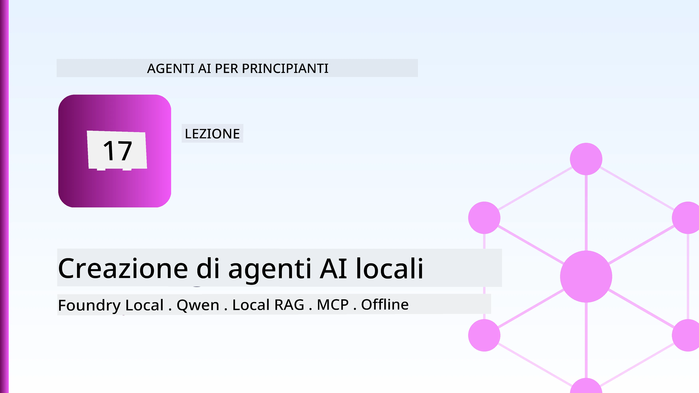
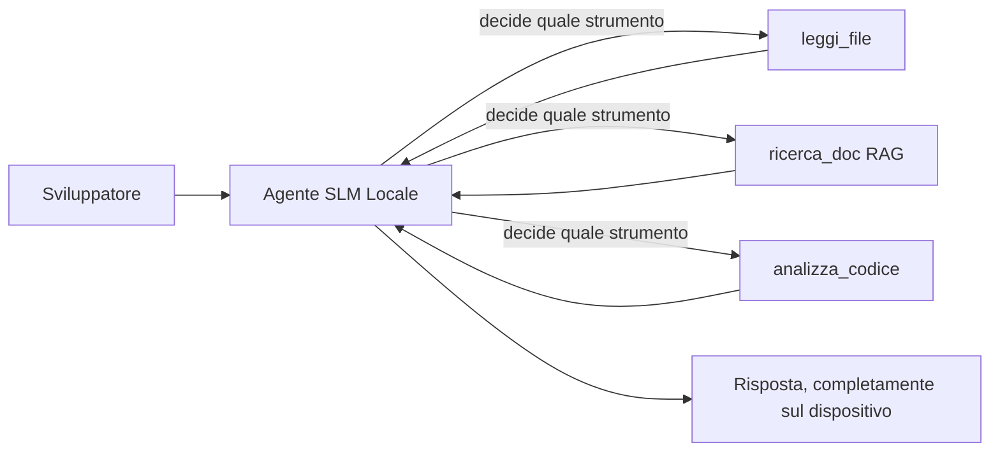
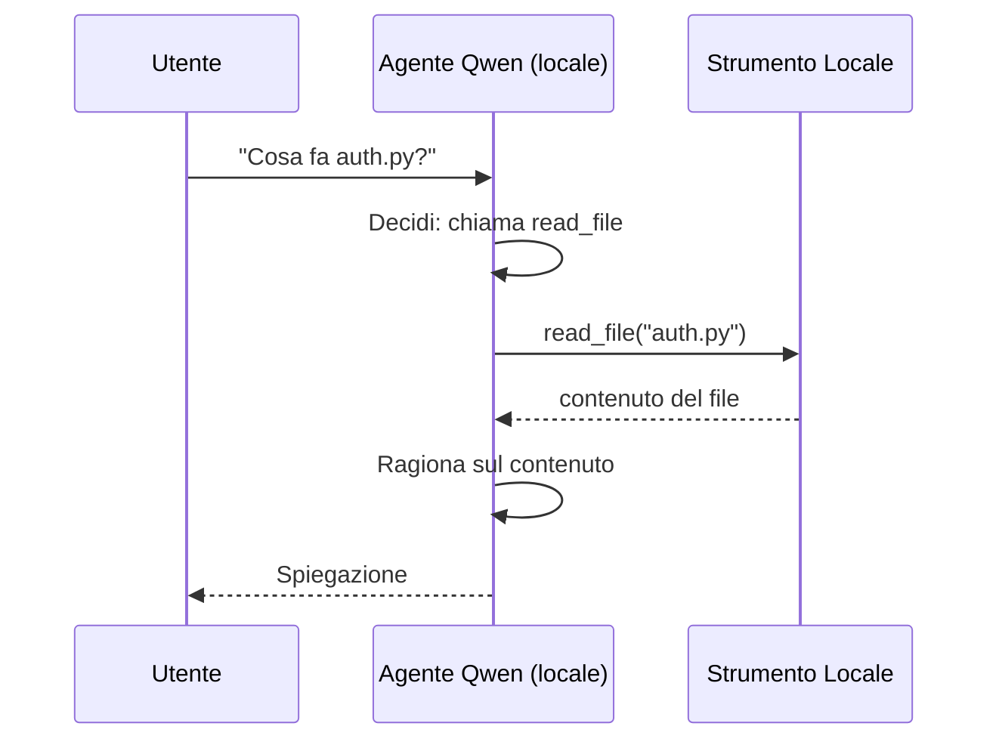
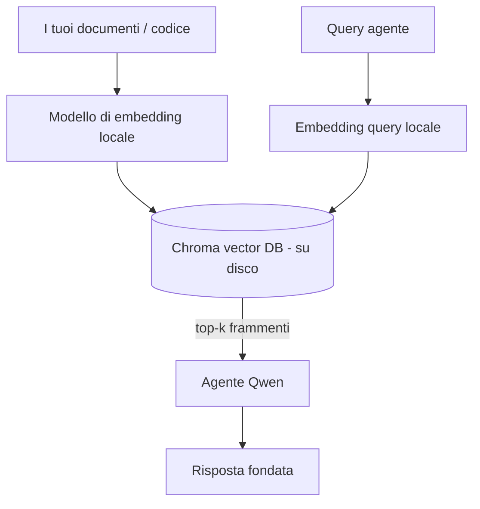
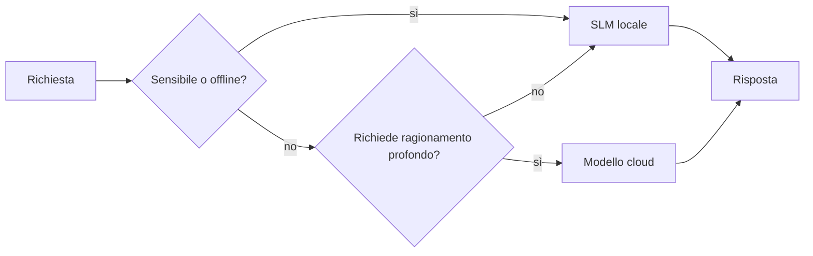

# Creazione di agenti AI locali utilizzando Microsoft Foundry Local e Qwen



La lezione precedente ha scalato gli agenti *verso l'alto* nel cloud. Questa li porta *verso il basso* su un'unica macchina. Alla fine avrai un assistente di ingegneria funzionante che ragiona, chiama strumenti, legge i tuoi file e cerca nella tua documentazione — **senza una singola chiamata di inferenza sul cloud.**

Perché dovresti volere questo? Tre motivi che emergono costantemente nel lavoro ingegneristico reale:

- **Privacy.** Il codice e i documenti non lasciano mai la macchina. Nessun prompt, snippet o dato cliente attraversa il confine della rete.
- **Costo.** L'inferenza locale non ha un costo per token. Puoi iterare tutto il giorno al prezzo dell'elettricità.
- **Offline.** Su un aereo, in una struttura sicura o durante un'interruzione, l'agente funziona ancora.

Il rovescio della medaglia è che stai scambiando un modello di punta nel cloud per un **Small Language Model (SLM)** che gira sulla tua CPU, GPU o NPU. Questa lezione riguarda la costruzione di agenti che sono *bravi* entro quel vincolo piuttosto che fingere che il vincolo non esista.

## Introduzione

Questa lezione tratterà:

- **Modelli di Linguaggio Piccoli (SLM)** — cosa sono, dove brillano e dove non lo fanno.
- **Microsoft Foundry Local** — un runtime che scarica e serve modelli sul dispositivo tramite un'**API compatibile OpenAI**.
- **Modelli Qwen con chiamate a funzione** — SLM che producono affidabilmente chiamate a strumenti, cosa che rende possibili gli agenti locali (non solo chat locali).
- **Strumenti locali, RAG locale e MCP locale** — che danno capacità all'agente senza il cloud.
- **Schemi ibridi** — quando mantenere le cose locali e quando raggiungere il cloud.

## Obiettivi di Apprendimento

Dopo aver completato questa lezione, saprai come:

- Spiegare i compromessi degli SLM e scegliere casi d'uso appropriati per agenti locali.
- Servire un modello Qwen localmente con Foundry Local e collegarti ad esso tramite l'endpoint compatibile OpenAI.
- Costruire un agente che chiama strumenti e gira interamente sulla tua workstation.
- Aggiungere RAG locale sui tuoi documenti usando un database vettoriale locale (Chroma).
- Collegare l'agente a un server MCP locale e ragionare su design ibridi locali/cloud.

## Prerequisiti

Questa lezione assume che tu abbia completato le lezioni precedenti e sia a tuo agio con:

- [Uso degli Strumenti](../04-tool-use/README.md) (Lezione 4) e [Agentic RAG](../05-agentic-rag/README.md) (Lezione 5).
- [Protocolli Agentici / MCP](../11-agentic-protocols/README.md) (Lezione 11).
- Il [Microsoft Agent Framework](../14-microsoft-agent-framework/README.md) (Lezione 14).

Avrai anche bisogno di:

- Una workstation da sviluppatore. **8 GB di RAM sono un minimo realistico**; 16 GB o più è comodo. Una GPU o NPU aiuta ma non è richiesta.
- **Microsoft Foundry Local** installato (vedi la sezione di configurazione sotto).
- Python 3.12+ e i pacchetti nel repository [`requirements.txt`](../../../requirements.txt), più `foundry-local-sdk`, `openai` e `chromadb` per questa lezione.

## Modelli di Linguaggio Piccoli: Lo Strumento Giusto per il Lavoro Locale

Un modello di punta nel cloud ha centinaia di miliardi di parametri e un data center alle spalle. Uno SLM ha pochi miliardi di parametri e deve stare nella RAM del tuo laptop. Questa differenza stabilisce aspettative chiare.

**Gli SLM sono bravi a:**

- Compiti strutturati e limitati — classificazione, estrazione, sintesi di un documento noto.
- **Chiamate a strumenti** — decidere quale funzione chiamare e con quali argomenti.
- Iterazioni rapide, economiche e private sui tuoi dati.

**Gli SLM sono più deboli a:**

- Ragionamenti aperti e multi-hop su grandi contesti.
- Conoscenza ampia del mondo (hanno visto meno e dimenticano di più).

La strategia vincente per gli agenti locali è quindi: **lascia che l'SLM orchestra, e lascia che gli strumenti facciano il lavoro pesante.** Il modello non deve *conoscere* il tuo codice — deve sapere quando chiamare `read_file` e `search_docs`. Questo gioca direttamente sui punti di forza di uno SLM.



## Microsoft Foundry Local

**Microsoft Foundry Local** è un runtime leggero che scarica, gestisce e serve modelli interamente sulla tua macchina. La sua caratteristica più importante per noi è che espone un **endpoint HTTP compatibile OpenAI** — il che significa che l'SDK di OpenAI e il client OpenAI del Microsoft Agent Framework funzionano contro di esso con solo un cambio di `base_url`. Tutto ciò che hai imparato sulla costruzione di agenti si trasferisce direttamente; solo l'endpoint si sposta dal cloud a `localhost`.

Foundry Local sceglie anche automaticamente la migliore build di un modello per il tuo hardware — una build CPU, una build CUDA/GPU o una build NPU — così non devi ottimizzare manualmente per ogni macchina.

### Configurazione

Installa Foundry Local (vedi la [documentazione](https://learn.microsoft.com/azure/ai-foundry/foundry-local/) per il tuo sistema operativo), poi conferma che funziona:

```bash
# Installa (esempio; segui la documentazione per la tua piattaforma)
winget install Microsoft.FoundryLocal      # Windows
# brew install microsoft/foundrylocal/foundrylocal   # macOS

# Scarica ed esegui un modello Qwen, quindi avvia il servizio locale
foundry model run qwen2.5-7b-instruct
foundry service status
```

Una volta che il servizio è in esecuzione hai un endpoint locale compatibile OpenAI (tipicamente `http://localhost:PORT/v1`). Il notebook usa il `foundry-local-sdk` per scoprire automaticamente l'endpoint, così non devi codificare a mano la porta.

## Chiamate a Funzione Qwen: Perché È Importante

Un agente è un agente solo se può chiamare strumenti. Molti SLM possono chattare ma producono chiamate a strumenti inaffidabili o malformate. I modelli **Qwen** sono addestrati per le chiamate a funzione e emettono strutture di chiamata a strumento ben formate in modo coerente — ed è esattamente questo che trasforma un modello di chat locale in un *agente* locale.

Il flusso è il circuito standard di chiamata a strumenti che già conosci, solo che gira sul dispositivo:



## RAG Locale

La ricerca nella documentazione è dove gli agenti locali danno davvero valore. Invece di sperare che l'SLM abbia memorizzato la documentazione del tuo framework, incorpori quei documenti in un **database vettoriale locale** e lasci che l'agente recuperi i pezzi rilevanti su richiesta.

Usiamo **Chroma**, un archivio vettoriale incorporato che gira in-process senza server da gestire. La pipeline è interamente locale: modello di embedding locale → vettori locali → recupero locale → SLM locale.



Questo è lo stesso modello Agentic RAG della Lezione 5 — l'unico cambiamento è che ogni componente gira sulla tua macchina.

## Server MCP Locali

[MCP](../11-agentic-protocols/README.md) è un trasporto, non un servizio cloud. Un server MCP può girare come processo locale su `stdio`, esponendo strumenti al tuo agente tramite il protocollo standard. Questo ti permette di riutilizzare l’ecosistema crescente di server MCP — accesso al filesystem, operazioni git, query di database — interamente offline.

La postura di sicurezza è diversa dal cloud, ma non assente: un server MCP locale gira comunque con i permessi del tuo utente, quindi limita cosa può toccare (una directory di progetto, non tutta la tua home) e tratta i suoi output come input da validare.

## Schemi Ibridi Cloud-e-Locale

“Local-first” non significa solo locale. I sistemi maturi instradano per sensibilità e difficoltà:

| Situazione | Dove gira |
| --- | --- |
| Codice/dati sensibili o offline | **SLM Locale** |
| Compito semplice e delimitato | **SLM Locale** (economico, veloce) |
| Ragionamento multi-hop complesso su dati non sensibili | **Modello Cloud** |
| Tutto, durante un'interruzione | **SLM Locale** (degrado graduale) |

Questo rispecchia l’idea di **model routing** della Lezione 16 — tranne che uno dei “modelli” è ora la tua stessa macchina. Un design robusto torna locale quando il cloud non è disponibile, così l’agente degrada in qualità piuttosto che fallire completamente.



## Laboratorio Pratico: Un Assistente di Ingegneria Locale

Apri [`code_samples/17-local-agent-foundry-local.ipynb`](./code_samples/17-local-agent-foundry-local.ipynb) e lavoraci. Costruirai un **assistente di ingegneria locale** che gira interamente sulla tua workstation e può:

1. **Chiamare strumenti** — tramite le chiamate a funzione Qwen attraverso Foundry Local.
2. **Eseguire operazioni locali sui file** — elencare e leggere file in una directory di progetto.
3. **Analizzare codice** — segnalare metriche base su un file sorgente.
4. **Cercare nella documentazione** — RAG locale su una cartella di documenti con Chroma.
5. **Usare MCP** — collegarsi a un server MCP locale (con salto elegante se nessuno è configurato).

In nessun momento si usa inferenza cloud.

### Spiegazione passo-passo

L’assistente si connette a Foundry Local tramite l’endpoint compatibile OpenAI, quindi il codice agente è quasi identico a quello delle lezioni cloud — cambia solo il client:

```python
from foundry_local import FoundryLocalManager
from openai import OpenAI

# Foundry Local scopre/scarica il modello e ci fornisce un endpoint locale.
manager = FoundryLocalManager(\"qwen2.5-7b-instruct\")
client = OpenAI(base_url=manager.endpoint, api_key=manager.api_key)  # api_key è un segnaposto locale
```

Gli strumenti sono normali funzioni Python limitate a una directory progetto:

```python
def read_file(path: str) -> str:
    \"\"\"Read a file, but only inside the sandboxed project directory.\"\"\"
    full = (PROJECT_ROOT / path).resolve()
    if PROJECT_ROOT not in full.parents and full != PROJECT_ROOT:
        return \"Access denied: path is outside the project directory.\"
    return full.read_text(encoding=\"utf-8\")
```

Nota il controllo sandbox — anche localmente, uno strumento che legge percorsi arbitrari è un rischio. Il notebook mantiene ogni strumento limitato a una radice progetto singola.

## Verifica della Conoscenza

Verifica la tua comprensione prima di passare all’assegnazione.

**1. Dai due motivi concreti per eseguire un agente localmente invece che nel cloud.**

<details>
<summary>Risposta</summary>

Qualsiasi due di: **privacy** (codice e dati non lasciano la macchina), **costo** (nessun costo per token di inferenza), e **capacità offline** (funziona senza rete — su un aereo, in una struttura sicura o durante un’interruzione). Vincoli regolatori/di conformità che vietano l’invio di dati fuori dispositivo sono un motivatore comune per la ragione della privacy.
</details>

**2. Qual è la divisione del lavoro raccomandata tra un SLM e i suoi strumenti in un agente locale, e perché?**

<details>
<summary>Risposta</summary>

Lascia che l’SLM **orchestra** (decida quale strumento chiamare e con quali argomenti) e lascia che gli **strumenti facciano il lavoro pesante** (leggere file, recuperare doc, calcolare risultati). Gli SLM sono forti nelle decisioni delimitate come la selezione degli strumenti, ma più deboli nella conoscenza ampia e nel ragionamento multi-hop lungo, quindi affidarsi agli strumenti sfrutta i loro punti di forza.
</details>

**3. Cosa rende possibile riutilizzare il codice agente cloud con Foundry Local?**

<details>
<summary>Risposta</summary>

Foundry Local espone un **endpoint HTTP compatibile OpenAI**. L’SDK OpenAI e il client OpenAI del Framework Agent lavorano contro di esso cambiando solo il `base_url` (e usando una chiave API segnaposto locale). Tutto il resto del codice agente resta uguale.
</details>

**4. Perché usiamo specificamente un modello Qwen con chiamata a funzione piuttosto che qualsiasi SLM?**

<details>
<summary>Risposta</summary>

Perché un agente deve produrre chiamate a strumenti affidabili e ben formate. Molti SLM possono chattare ma emettono strutture di chiamata a strumenti malformate o incoerenti. I modelli Qwen sono addestrati per la chiamata a funzione e producono chiamate a strumenti coerenti, che è ciò che trasforma un modello di chat locale in un agente locale funzionante.
</details>

**5. Nella pipeline RAG locale, quali componenti girano sulla macchina?**

<details>
<summary>Risposta</summary>

Tutti: il modello di embedding, il database vettoriale (Chroma, su disco), il passo di recupero e l’SLM. I documenti sono incorporati localmente, memorizzati localmente, recuperati localmente e ragionati da un modello locale — nessun componente tocca il cloud.
</details>

**6. Un server MCP locale gira sulla tua macchina. Questo lo rende automaticamente sicuro? Quale precauzione dovresti ancora prendere?**

<details>
<summary>Risposta</summary>

No. Un server MCP locale gira con i permessi del tuo utente, quindi può toccare tutto ciò che puoi. Limitane l’accesso a ciò che serve (per esempio, una singola directory di progetto e non tutta la tua home) e tratta i suoi output come input da validare prima di agire su di essi.
</details>

**7. Descrivi una regola sensata di instradamento ibrido che includa un modello locale.**

<details>
<summary>Risposta</summary>

Instrada richieste sensibili o offline verso l’SLM locale; instrada compiti semplici e limitati verso l’SLM locale per velocità e costo; instrada ragionamenti multi-hop complessi su dati non sensibili verso un modello cloud; e torna all’SLM locale se il cloud non è disponibile così l’agente degrada gradualmente invece di fallire. Questo è il model routing (Lezione 16) con la macchina locale come uno dei modelli.
</details>

**8. Qual è una cifra realistica minima di RAM per eseguire l'agente locale in questa lezione, e cosa ti offre più RAM?**

<details>
<summary>Risposta</summary>

Circa **8 GB** è un minimo realistico; 16 GB o più è confortevole. Più RAM ti permette di eseguire modelli più grandi e capaci e mantenere più contesto in memoria. Una GPU o NPU accelera l’inferenza ma non è richiesta — Foundry Local seleziona una build CPU quando nessun acceleratore è disponibile.
</details>

## Compito

Estendi l'assistente di ingegneria locale in un **revisore di documentazione locale** per un piccolo progetto a tua scelta (usa una delle cartelle di lezione di questo repo se vuoi).

La tua consegna dovrebbe:

1. **Indicizzare una cartella reale di documenti/codice** in Chroma (almeno cinque file).
2. **Aggiungere uno strumento `find_todos`** che scansiona il progetto per commenti `TODO`/`FIXME` e li restituisce con file e numero di riga — mantenendo lo stesso controllo sandbox di `read_file`.

3. **Fai tre domande all'agente** che lo costringano a combinare gli strumenti: una domanda pura RAG, una che richiede la lettura di un file specifico e una che richiede di trovare i TODO.
4. **Misurale**: cronometra ciascuna delle tre risposte e annotale in una cella markdown. Commenta se la latenza è accettabile per il tuo flusso di lavoro previsto.

Poi scrivi un breve paragrafo su **cosa sposteresti nel cloud e cosa manterresti locale** per questo revisore, e perché. Sarai valutato su quanto i componenti locali siano collegati correttamente e su quanto il tuo ragionamento ibrido sia solido — non sulla qualità del modello.

## Riepilogo

In questa lezione hai costruito un agente che gira interamente sulla tua macchina:

- **SLM** scambiano ampiezza con privacy, costo e funzionamento offline — e brillano quando **orchestrano strumenti** piuttosto che contenere tutta la conoscenza da soli.
- **Foundry Local** serve modelli sul dispositivo dietro un **endpoint compatibile OpenAI**, quindi il codice del tuo agente cloud si trasferisce con una modifica di una riga.
- I **modelli Qwen con function-calling** rendono possibile una chiamata affidabile agli strumenti locali — e quindi *agenti* locali.
- **Local RAG** (Chroma) e **local MCP** danno capacità all'agente senza uscire dalla macchina.
- I **pattern ibridi** ti permettono di instradare per sensibilità e difficoltà, con il locale come fall-back elegante.

Questo completa l'arco di deployment: la Lezione 16 ha scalato gli agenti in Microsoft Foundry, e questa lezione li ha scalati su una singola workstation. La prossima lezione si concentra sul mantenere sicuri gli agenti distribuiti.

## Risorse Aggiuntive

- <a href="https://learn.microsoft.com/azure/ai-foundry/foundry-local/" target="_blank">Documentazione Microsoft Foundry Local</a>
- <a href="https://learn.microsoft.com/azure/ai-foundry/what-is-azure-ai-foundry" target="_blank">Documentazione Microsoft Foundry</a>
- <a href="https://aka.ms/ai-agents-beginners/agent-framework" target="_blank">Microsoft Agent Framework</a>
- <a href="https://qwen.readthedocs.io/en/latest/framework/function_call.html" target="_blank">Documentazione Qwen function calling</a>
- <a href="https://modelcontextprotocol.io/" target="_blank">Model Context Protocol (MCP)</a>
- <a href="https://docs.trychroma.com/" target="_blank">Database di vettori Chroma</a>

## Lezione Precedente

[Deploying Scalable Agents](../16-deploying-scalable-agents/README.md)

## Prossima Lezione

[Securing AI Agents](../18-securing-ai-agents/README.md)

---

<!-- CO-OP TRANSLATOR DISCLAIMER START -->
**Disclaimer**:
Questo documento è stato tradotto utilizzando il servizio di traduzione AI [Co-op Translator](https://github.com/Azure/co-op-translator). Sebbene ci impegniamo per garantire la precisione, si prega di notare che le traduzioni automatizzate possono contenere errori o imprecisioni. Il documento originale nella sua lingua nativa deve essere considerato la fonte autorevole. Per informazioni critiche, si raccomanda una traduzione professionale effettuata da un essere umano. Non siamo responsabili per eventuali malintesi o interpretazioni errate derivanti dall’uso di questa traduzione.
<!-- CO-OP TRANSLATOR DISCLAIMER END -->