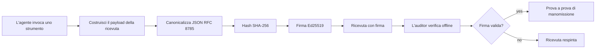
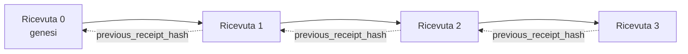

[Guarda il video della lezione: Proteggere gli agenti AI con Ricevute Criptografiche](https://youtu.be/PLACEHOLDER_VIDEO_ID)

> _(Video della lezione e anteprima verranno aggiunti dal team contenuti di Microsoft dopo la fusione, in linea con il modello delle lezioni 14 / 15.)_

# Proteggere gli agenti AI con Ricevute Criptografiche

## Introduzione

Questa lezione coprirà:

- Perché le tracce di controllo per gli agenti AI sono importanti per la conformità, il debugging e la fiducia.
- Che cos’è una ricevuta criptografica e in cosa differisce da una riga di log non firmata.
- Come produrre una ricevuta firmata per una chiamata allo strumento di un agente in Python semplice.
- Come verificare una ricevuta offline e rilevare manomissioni.
- Come concatenare le ricevute in modo che rimuovere o riordinare una le rompa.
- Cosa dimostrano le ricevute e cosa esplicitamente non dimostrano.

## Obiettivi di apprendimento

Dopo aver completato questa lezione, saprai come:

- Identificare le modalità di errore che motivano la provenienza criptografica per le azioni dell’agente.
- Produrre una ricevuta firmata Ed25519 su un payload JSON canonico.
- Verificare una ricevuta indipendentemente usando solo la chiave pubblica del firmatario.
- Rilevare manomissioni rieseguendo la verifica su una ricevuta modificata.
- Costruire una sequenza di ricevute concatenata tramite hash e spiegare perché la catena è importante.
- Riconoscere il confine tra ciò che le ricevute dimostrano (attribuzione, integrità, ordinamento) e ciò che non dimostrano (correttezza dell’azione, validità della politica).

## Il problema: la traccia di controllo del tuo agente

Immagina di aver distribuito un agente AI per Contoso Travel. L’agente legge le richieste dei clienti, chiama un’API di voli per cercare opzioni e prenota posti per conto del cliente. Lo scorso trimestre, l’agente ha elaborato 50.000 prenotazioni.

Oggi arriva un revisore. Fa una domanda semplice: "Mostrami cosa ha fatto il tuo agente."

Gli consegni i file di log. Il revisore li guarda e fa una domanda più difficile: "Come faccio a sapere che questi log non sono stati modificati?"

Questo è il problema della traccia di controllo. La maggior parte delle distribuzioni di agenti oggi si basa su:

- **Log delle applicazioni**: scritti dallo stesso agente, modificabili da chiunque abbia accesso al file system.
- **Servizi di logging cloud**: tamper-evident a livello di piattaforma ma solo se il revisore si fida dell’operatore della piattaforma.
- **Log delle transazioni del database**: adatti per i cambiamenti del database ma non per chiamate arbitrariamente a strumenti.

Nessuno di questi può rispondere alla domanda del revisore senza richiedere che egli si fidi di qualcuno (te, il tuo provider cloud, il tuo fornitore di database). Per uso interno, quella fiducia è spesso accettabile. Per carichi di lavoro regolamentati (finanza, sanità, qualsiasi cosa soggetta all’AI Act dell’UE), non lo è.

Le ricevute criptografiche risolvono questo rendendo ogni azione dell’agente indipendentemente verificabile. Il revisore non deve fidarsi di te. Serve solo la tua chiave pubblica e la ricevuta stessa.

## Che cos’è una Ricevuta Criptografica?

Una ricevuta è un oggetto JSON che registra cosa ha fatto un agente, firmato con una firma digitale.



Una ricevuta minima appare così:

```json
{
  "type": "agent.tool_call.v1",
  "agent_id": "contoso-travel-bot",
  "tool_name": "lookup_flights",
  "tool_args_hash": "sha256:a3f9c1...",
  "result_hash": "sha256:7b2e1d...",
  "policy_id": "contoso-travel-policy-v3",
  "timestamp": "2026-04-25T14:30:00Z",
  "sequence": 47,
  "previous_receipt_hash": "sha256:9d4e6a...",
  "signature": {
    "alg": "EdDSA",
    "sig": "c5af83...",
    "public_key": "8f3b2c..."
  }
}
```

Tre proprietà sono responsabili:

1. **La firma**. La ricevuta è firmata dal gateway dell’agente usando una chiave privata Ed25519. Chiunque abbia la chiave pubblica corrispondente può verificare la firma offline. Manomettere qualsiasi campo invalida la firma.

2. **Codifica canonica**. Prima di firmare, la ricevuta viene serializzata usando lo JSON Canonicalization Scheme (JCS, RFC 8785). Ciò garantisce che due implementazioni che producono la stessa ricevuta logica producano un output byte-identico. Senza la canonicalizzazione, diversi serializzatori JSON produrrebbero firme diverse per lo stesso contenuto.

3. **Concatenazione tramite hash**. Il campo `previous_receipt_hash` collega ogni ricevuta a quella precedente. Rimuovere o riordinare una ricevuta rompe ogni ricevuta successiva. La manomissione diventa visibile a livello di catena anche se vengono superate le singole firme.

Insieme queste proprietà forniscono tre garanzie:

- **Attribuzione**: questa chiave ha firmato questo contenuto.
- **Integrità**: il contenuto non è cambiato dopo la firma.
- **Ordinamento**: questa ricevuta è venuta dopo quella nella catena.

## Produrre una Ricevuta in Python

Non ti serve una libreria speciale per produrre una ricevuta. Le primitive crittografiche sono ampiamente disponibili e la logica è di poche decine di righe di Python.

Gli esercizi pratici in `code_samples/18-signed-receipts.ipynb` mostrano il flusso completo. La versione riassunta:

```python
import json
import hashlib
import base64
from nacl import signing
from jcs import canonicalize  # JSON canonico RFC 8785

def b64url_nopad(data: bytes) -> str:
    return base64.urlsafe_b64encode(data).decode("ascii").rstrip("=")

def sha256_canonical(obj) -> str:
    """SHA-256 of a Python object's JCS-canonical JSON form."""
    return f"sha256:{hashlib.sha256(canonicalize(obj)).hexdigest()}"

# Genera o carica una chiave per la firma (in produzione, memorizzala in un vault di chiavi)
signing_key = signing.SigningKey.generate()
verify_key = signing_key.verify_key

# Costruisci il payload della ricevuta (ancora senza firma)
tool_args = {"origin": "SYD", "destination": "LAX"}
tool_result = [{"flight": "QF11", "price": 1850, "stops": 0}]

payload = {
    "type": "agent.tool_call.v1",
    "agent_id": "contoso-travel-bot",
    "tool_name": "lookup_flights",
    "tool_args_hash": sha256_canonical(tool_args),
    "result_hash": sha256_canonical(tool_result),
    "policy_id": "contoso-travel-policy-v3",
    "timestamp": "2026-04-25T14:30:00Z",
    "sequence": 0,
    "previous_receipt_hash": None,
}

# Canonicalizza, hash, firma.
canonical_bytes = canonicalize(payload)
message_hash = hashlib.sha256(canonical_bytes).digest()
signature_bytes = signing_key.sign(message_hash).signature

# Allegare un oggetto firma strutturato.
receipt = {
    **payload,
    "signature": {
        "alg": "EdDSA",
        "sig": b64url_nopad(signature_bytes),
        "public_key": b64url_nopad(bytes(verify_key)),
    },
}
```

Questa è l’intera pipeline di firma. Gli esercizi nel notebook guidano ogni passaggio.

## Verificare una Ricevuta e Rilevare Manomissioni

La verifica è l’operazione inversa:

```python
import base64
import hashlib
from nacl import signing
from nacl.exceptions import BadSignatureError
from jcs import canonicalize

def b64url_decode(s: str) -> bytes:
    padding = "=" * ((4 - len(s) % 4) % 4)
    return base64.urlsafe_b64decode(s + padding)

def verify_receipt(receipt: dict) -> bool:
    # La firma è un oggetto strutturato: {"alg", "sig", "public_key"}.
    sig_obj = receipt.get("signature")
    if not sig_obj or sig_obj.get("alg") != "EdDSA":
        return False

    # Ricostruisci il payload che è stato effettivamente firmato (tutto tranne la firma).
    payload = {k: v for k, v in receipt.items() if k != "signature"}

    canonical_bytes = canonicalize(payload)
    message_hash = hashlib.sha256(canonical_bytes).digest()

    try:
        verify_key = signing.VerifyKey(b64url_decode(sig_obj["public_key"]))
        verify_key.verify(message_hash, b64url_decode(sig_obj["sig"]))
        return True
    except BadSignatureError:
        return False
```

Questa funzione prende una ricevuta e restituisce `True` se la firma è valida, `False` altrimenti. Nessuna chiamata di rete, nessuna dipendenza da servizi, nessuna fiducia in terze parti richiesta.

Per vedere la rilevazione di manomissioni in azione, il notebook mostra:

1. Produrre una ricevuta valida e confermare la verifica.
2. Modificare un byte del campo `tool_args_hash`.
3. Rieseguire la verifica e osservare il fallimento.

Questa è la dimostrazione pratica che le ricevute sono tamper-evident: qualsiasi modifica, anche minima, rompe la firma.

## Concatenare Ricevute per Agenti a Più Passi

Una singola ricevuta firmata protegge un’azione. Una catena di ricevute protegge una sequenza.



Ogni ricevuta registra l’hash della ricevuta precedente. Per rimuovere silenziosamente la ricevuta 2, un attaccante dovrebbe:

- Modificare il campo `previous_receipt_hash` della ricevuta 3 (rompe la firma della ricevuta 3), O
- Falsificare una nuova firma su una ricevuta 3 modificata (richiede la chiave privata dell’agente).

Se la chiave privata si trova in un hardware key vault e pubblichi la chiave pubblica con ogni ricevuta, nessuno dei due attacchi è fattibile senza essere rilevato.

Il notebook mostra:

1. Costruire una catena di tre ricevute.
2. Verificare che il `previous_receipt_hash` di ogni ricevuta corrisponda all’hash reale della ricevuta precedente.
3. Manomettere una ricevuta in mezzo e vedere la catena interrompersi proprio in quel punto.

Così produci una traccia di controllo che un revisore esterno può verificare senza dover fidarsi di te.

## Cosa dimostrano le Ricevute (e cosa non dimostrano)

Questa è la sezione più importante di questa lezione. Le ricevute sono potenti ma il loro potere è limitato.

**Le ricevute dimostrano tre cose:**

1. **Attribuzione**: una chiave specifica ha firmato un payload specifico.
2. **Integrità**: il payload non è stato modificato dopo la firma.
3. **Ordinamento**: questa ricevuta è venuta dopo quella nella catena di hash.

**Le ricevute NON dimostrano:**

1. **Correttezza**: che l’azione dell’agente fosse la corretta. Una ricevuta può essere firmata per una risposta errata tanto facilmente quanto per una risposta corretta.
2. **Conformità alla politica**: che la politica referenziata in `policy_id` sia stata effettivamente valutata, o che avrebbe permesso questa azione se verificata. La ricevuta registra ciò che è stato dichiarato, non ciò che è stato applicato.
3. **Identità oltre la chiave**: la ricevuta dice "questa chiave ha firmato questo contenuto." Non dice "questo umano ha autorizzato questo." Collegare una chiave a una persona o organizzazione richiede un’infrastruttura di identità separata (una directory, un registro di chiavi pubbliche, ecc.).
4. **Veridicità degli input**: se l’agente riceve un prompt manipolato e agisce su di esso, la ricevuta registra fedelmente l’azione. Le ricevute sono a valle della validazione degli input, non un suo sostituto.

Questo confine è importante per due motivi:

- Ti dice a cosa servono le ricevute: rendere il comportamento dell’agente auditabile e tamper-evident, anche oltre confini organizzativi.
- Ti dice quali altri livelli ti servono ancora: validazione degli input (Lezione 6), applicazione della politica (coperta brevemente sotto), e infrastruttura di identità (fuori dal campo di questa lezione).

Un errore comune è assumere che "abbiamo ricevute" significhi "siamo governati." Non è così. Le ricevute sono una fondazione. La governance è il sistema che costruisci sopra.

## Dimostrare che un Umano ha Approvato l’Azione Esatta

Il punto 3 sopra merita una sezione propria: una ricevuta di azione dice "questa chiave ha firmato questo contenuto", mai "un umano ha autorizzato questo." Per azioni ad alto rischio (rimborsi, cancellazioni, trasferimenti bancari), i framework di governance richiedono sempre più esattamente questa dichiarazione mancante, e si può produrre con le stesse primitive che hai già costruito in questa lezione.

Il notebook successivo `code_samples/human-authorization-receipts.ipynb` aggiunge un secondo tipo di ricevuta, `human.approval.v1`, nella stessa forma di busta delle ricevute della lezione (un payload tipizzato firmato da Ed25519 sulla sua SHA-256 canonica, con l’oggetto `signature` fuori dai byte firmati). Un approvatore nominato firma **l’azione canonica completa e il suo digest** prima dell’esecuzione; la ricevuta dell’azione dell’agente porta lo **stesso digest dell’azione** e un `parent_approval_ref`, l’`receipt_hash` dell’approvazione, la stessa convenzione del `previous_receipt_hash` nella catena che hai costruito sopra. Una singola `verify_chain` passa entrambi gli artefatti sotto **registri di chiavi fissati separati** (chiavi approvatore vs chiavi agente), così il percorso del codice è condiviso ma le autorità mai.

La proprietà acquistata, spiegata con attenzione: *l’umano ha approvato questa esatta azione, e l’agente ha eseguito esattamente quell’azione approvata.* Gli strumenti di rifiuto nel notebook sono ciò che rende reale la proprietà invece che solo affermata:

- il classico insieme: manomissione, confused deputy, replay, chiavi contraffatte da entrambe le parti, input malformati;
- **autorità scaduta**: una firma che verifica ancora, rifiutata comunque perché la versione della politica è cambiata, la chiave dell’approvatore è stata rimossa dal registro fissato, o l’approvazione è scaduta prima dell’esecuzione;
- **sostituzione del digest**: una ricevuta d’azione validamente firmata che punta a un’approvazione *reale* che lega un’azione canonica *diversa*.

Ogni fallimento rifiuta per un motivo distinto, così un revisore che legge un rifiuto può capire se l’autorità è scaduta o se l’azione eseguita è cambiata. La regola che insegna il notebook: un’approvazione firmata non è autorità da sola. L’autorità esiste solo se entrambe le ricevute legano ancora la stessa azione canonica al momento dell’esecuzione. Il percorso di co-firma nell’Internet-Draft seguito da questa lezione (`draft-farley-acta-signed-receipts`) è la forma standardizzata di questo modello.

## Riferimenti per la Produzione

Il codice Python in questa lezione è intenzionalmente minimo così puoi leggere ogni riga e capire esattamente cosa succede. In produzione, hai due opzioni:

1. **Costruire direttamente sulle primitive crittografiche.** Le 50 righe viste sopra sono sufficienti per molti casi d’uso. PyNaCl (Ed25519) e il pacchetto `jcs` (JSON canonico) sono librerie ben mantenute e controllate.

2. **Usare una libreria di ricevute di produzione.** Diversi progetti open-source implementano lo stesso modello con funzionalità aggiuntive (rotazione chiavi, verifica batch, distribuzione Set JWK, integrazione con motori di policy):
   - Il formato di ricevuta usato in questa lezione segue un Internet-Draft IETF ([`draft-farley-acta-signed-receipts`](https://datatracker.ietf.org/doc/draft-farley-acta-signed-receipts/), revisione 02) attualmente nel processo di standardizzazione, con una suite di conformità condivisa ([agent-governance-testvectors](https://github.com/ScopeBlind/agent-governance-testvectors)) che implementazioni indipendenti incrociano per verificare un output canonico byte-identico.
   - Il Microsoft Agent Governance Toolkit compone ricevute con decisioni policy basate su Cedar; vedi il Tutorial 33 in quel repository per un esempio end-to-end.
   - I pacchetti `protect-mcp` (npm) e `@veritasacta/verify` (npm) forniscono un’implementazione Node di firma di ricevute e verifica offline, pensata per incapsulare qualsiasi server MCP con traccia di controllo tamper-evident, incluso un flusso di co-firma tenuto in sospeso in cui un’azione in pausa emette una ricevuta di approvazione legata al digest dell’azione (WebAuthn supportato nel flusso desktop), lo stesso modello di ricevuta di approvazione umano sopra.
   - Il SDK Python **[nobulex](https://github.com/arian-gogani/nobulex)** (`pip install nobulex`) fornisce lo stesso modello di firma Ed25519 + JCS in Python con integrazioni LangChain e CrewAI, inclusi vettori di test pubblicati per la convalida incrociata e una mappatura di conformità contribuita tramite [OWASP PR #2210](https://github.com/OWASP/CheatSheetSeries/pull/2210).

La decisione tra costruire la tua soluzione o usare una libreria rispecchia la scelta tra scrivere la tua libreria JWT e usarne una testata: entrambe sono ragionevoli; la libreria fa risparmiare tempo e riduce la superficie di controllo; il metodo da zero ti obbliga a capire ogni primitiva. Questa lezione insegna il percorso da zero così hai la base per entrambe le scelte.

## Verifica delle conoscenze

Metti alla prova la tua comprensione prima di passare all’esercizio pratico.

**1. Una ricevuta è firmata con la chiave privata Ed25519 dell’agente. Il revisore ha solo la chiave pubblica. Può il revisore verificare la ricevuta offline?**

<details>
<summary>Risposta</summary>

Sì. La verifica Ed25519 richiede solo la chiave pubblica e i byte firmati. Nessuna chiamata di rete, nessuna dipendenza da servizi. Questa è la proprietà che rende le ricevute utili in ambienti air-gapped, multi-organizzazione, o di verifica a bassa fiducia.
</details>

**2. Un attaccante modifica il campo `policy_id` di una ricevuta per affermare che fosse governata da una politica più permissiva. La firma era sul payload originale. Cosa succede durante la verifica?**

<details>
<summary>Risposta</summary>


La verifica fallisce. La firma è stata calcolata sui byte canonici del payload originale; modificare qualsiasi campo cambia i byte canonici, il che cambia l'hash SHA-256, rendendo la firma invalida. L’attaccante avrebbe bisogno della chiave privata per produrre una nuova firma valida, cosa che non possiede.
</details>

**3. Perché la ricevuta include un `tool_args_hash` e un `result_hash` invece degli argomenti grezzi e del risultato?**

<details>
<summary>Risposta</summary>

Due motivi. Primo, la ricevuta potrebbe dover essere archiviata o trasmessa in ambienti in cui la perdita del contenuto grezzo (PII, dati aziendali) è un problema. L’hashing mantiene la ricevuta piccola e il contenuto privato; l’auditor verifica che l’hash corrisponda a una copia memorizzata separatamente del contenuto effettivo. Secondo, gli hash hanno una dimensione fissa; una ricevuta con hash ha una dimensione limitata indipendentemente da quanto grandi fossero input e output.
</details>

**4. Il campo `previous_receipt_hash` collega ogni ricevuta al suo predecessore. Se un attaccante cancella silenziosamente una ricevuta da metà catena, cosa diventa invalido?**

<details>
<summary>Risposta</summary>

Ogni ricevuta che è venuta dopo quella cancellata. I loro campi `previous_receipt_hash` non corrispondono più alla catena effettiva (perché la ricevuta a cui facevano riferimento non esiste più, oppure la catena ora punta a un predecessore diverso). Per nascondere la cancellazione, l’attaccante dovrebbe rifirmare ogni ricevuta successiva, cosa che richiede la chiave privata.
</details>

**5. Una ricevuta verifica correttamente. Ciò dimostra che l’azione dell’agente è stata corretta, valida o conforme alla policy?**

<details>
<summary>Risposta</summary>

No. Una ricevuta valida prova tre cose: attribuzione (questa chiave ha firmato questo contenuto), integrità (il contenuto non è cambiato) e ordine (questa ricevuta è venuta dopo quell’altra). NON prova che l’azione sia stata corretta, che la policy indicata in `policy_id` sia stata realmente valutata, o che l’agente abbia seguito ogni regola. Le ricevute rendono il comportamento dell’agente controllabile, non necessariamente corretto. Questo è il confine più importante nella lezione.
</details>

## Esercizio Pratico

Apri `code_samples/18-signed-receipts.ipynb` e completa tutte e quattro le sezioni:

1. **Sezione 1**: Firma la tua prima ricevuta e verifica la sua validità.
2. **Sezione 2**: Manometti la ricevuta e osserva il fallimento della verifica.
3. **Sezione 3**: Costruisci una catena di tre ricevute e verifica l’integrità della catena.
4. **Sezione 4**: Applica il modello a un agente costruito con Microsoft Agent Framework: incapsula una chiamata a uno strumento nella firma della ricevuta, quindi verifica la ricevuta indipendentemente.

**Sfida avanzata 1:** estendi lo schema della ricevuta con un campo aggiuntivo a tua scelta (ad esempio, un ID di richiesta per il tracciamento), aggiorna la logica di firma canonica per includerlo e conferma che la ricevuta pass inalterata attraverso la verifica. Poi modifica quel campo dopo la firma e conferma che la verifica fallisce. Questo ti costringe a capire come ogni byte della codifica canonica contribuisce alla firma.

**Sfida avanzata 2:** Applica SHA-256 su due delle tue ricevute insieme (concatenando i loro byte canonici in un ordine deterministico) e incorpora il digest risultante come nuovo campo su una terza ricevuta prima di firmarla. Verifica che tutte e tre le ricevute passino ancora la verifica. Hai appena costruito una prova di inclusione a un passo: chiunque abbia la terza ricevuta può dimostrare che le prime due esistevano al momento della firma, senza doverne rivelare il contenuto. Questo è il modello usato dalle ricevute a rivelazione selettiva su larga scala (impegni Merkle, RFC 6962).

## Conclusione

Le ricevute crittografiche danno agli agenti AI una traccia di audit che è:

- **Verificabile indipendentemente**: qualsiasi parte con la chiave pubblica può verificare, senza dipendenza da servizi.
- **Evidente alla manomissione**: qualsiasi modifica invalida la firma.
- **Portatile**: una ricevuta è un piccolo file JSON; può essere archiviata, trasmessa e verificata ovunque.
- **Allineata agli standard**: basata su Ed25519 (RFC 8032), JCS (RFC 8785), e SHA-256, tutti primitivi ampiamente diffusi.

Non sono un sostituto per la validazione degli input, l’applicazione delle policy o l’infrastruttura di identità. Sono una base per questi livelli. Quando distribuisci agenti in ambienti regolamentati, flussi di lavoro multi-organizzazione o in qualsiasi contesto dove un futuro auditor non può essere dato per assunto fidarsi di te, le ricevute sono il modo per rendere la traccia di audit onesta.

Il messaggio più importante: le ricevute dimostrano chi ha detto cosa e quando. Non dimostrano che ciò che è stato detto era vero o corretto. Tieni salda questa distinzione. È la differenza tra un sistema di provenienza onesto e uno fuorviante.

## Checklist per la Produzione

Quando sei pronto a passare da questa lezione al deploy di agenti con firma di ricevute in un ambiente reale:

- [ ] **Sposta la chiave di firma fuori dal laptop dello sviluppatore.** Usa Azure Key Vault, AWS KMS o un modulo hardware di sicurezza. La chiave privata che firma le tue ricevute non deve mai essere nel controllo versione o in chiaro sulle macchine di applicazione.
- [ ] **Pubblica la chiave pubblica per la verifica.** Gli auditor ne hanno bisogno per verificare offline. Il modello standard è un JWK Set a un URL noto (RFC 7517), es., `https://your-org.example.com/.well-known/agent-keys.json`.
- [ ] **Ancorare la catena esternamente.** Periodicamente scrivi l’hash della testa della catena più recente in un log di trasparenza (Sigstore Rekor, autorità timestamp RFC 3161, o un secondo sistema interno) così una parte esterna può confermare "questa catena esisteva a questo tempo."
- [ ] **Conserva le ricevute in modo immutabile.** Lo storage blob append-only (Azure Storage con politiche di immutabilità, AWS S3 Object Lock) previene che un insider riscriva la storia a livello di storage.
- [ ] **Decidi la conservazione.** Molti regimi di compliance richiedono conservazione pluriennale. Pianifica la crescita delle ricevute (ogni ricevuta è ~500 byte; un agente che fa 10K chiamate al giorno produce ~1.8 GB all’anno).
- [ ] **Documenta cosa le ricevute non coprono.** Le ricevute provano attribuzione, integrità e ordine. Il tuo runbook deve elencare esplicitamente quali controlli aggiuntivi (validazione input, applicazione policy, limitazione di frequenza, infrastruttura di identità) sono affiancati alle ricevute nella tua postura di governance.

### Hai altre domande su come mettere in sicurezza gli agenti AI?

Unisciti al [Microsoft Foundry Discord](https://aka.ms/ai-agents/discord) per incontrare altri apprendenti, partecipare alle ore di ufficio e risolvere i tuoi dubbi sugli AI Agents.

## Oltre questa Lezione

Questa lezione tratta la firma di una singola ricevuta e sequenze concatenate tramite hash. Le stesse primitive compongono diversi schemi più avanzati che potresti incontrare man mano che la tua postura di governance matura:

- **Rivelazione selettiva.** Quando i campi di una ricevuta sono impegnati indipendentemente (albero Merkle stile RFC 6962), puoi rivelare specifici campi a specifici auditor e dimostrare che gli altri non sono cambiati senza esporli. Utile quando la stessa ricevuta deve soddisfare sia un audit completo (che desidera completezza) sia regolamenti di minimizzazione dati come GDPR (che vogliono che l’auditor veda il meno possibile).
- **Revoca della ricevuta.** Se una chiave di firma è compromessa, devi un modo per marcare tutte le ricevute firmate da quella chiave come non attendibili da un certo momento in poi. Schemi standard: chiavi di firma a vita breve più lista di revoca pubblicata, o un log di trasparenza con voci di revoca.
- **Ricevute bilaterali / a firma divisa.** Alcune implementazioni dividono il payload firmato in metà pre-esecuzione (`authorization_*`) e metà post-esecuzione (`result_*`) con firme indipendenti, utile quando la decisione di autorizzazione e il risultato osservato sono prodotti da attori diversi o in tempi diversi. Questo si combina in modo additivo al formato di ricevuta insegnato in questa lezione.
- **Composizione del payload.** Una ricevuta sigilla qualunque byte metti in `result_hash`. I payload reali sono spesso più ricchi di un semplice risultato di una chiamata a uno strumento: il ragionamento pre-decisione (predizione modello, opzioni considerate, prove e loro completezza, postura di rischio, catena di responsabilità, esito del gate) può vivere tutto dentro il payload, sigillato da una sola ricevuta. Questo mantiene il formato della ricevuta minimale consentendo agli schemi del payload di evolversi dominio per dominio.
- **Conformità cross-implementazione.** Molte implementazioni indipendenti dello stesso formato di ricevuta (Python, TypeScript, Rust, Go) si verificano reciprocamente su vettori di test condivisi. Se costruisci la tua implementazione, validare con vettori pubblicati conferma la compatibilità wire.
- **Migrazione post-quantistica.** Ed25519 è ampiamente usato oggi ma non è resistente ai quantistici. Il formato di ricevuta è algoritmicamente agile: il campo `signature.alg` può portare `ML-DSA-65` (lo standard NIST per firme post-quantistiche) quando serve migrare. Pianifica un periodo di transizione in cui le ricevute sono firmate in doppio.

## Risorse Aggiuntive

- <a href="https://datatracker.ietf.org/doc/draft-farley-acta-signed-receipts/" target="_blank">IETF Internet-Draft: Ricevute di Decisione Firmate per Controllo Accessi Macchina-a-Macchina</a>
- <a href="https://learn.microsoft.com/azure/ai-studio/responsible-use-of-ai-overview" target="_blank">Panoramica sull’AI Responsabile (Azure AI)</a>
- <a href="https://datatracker.ietf.org/doc/html/rfc8032" target="_blank">RFC 8032: Algoritmo di Firma Digitale su Curve Edwards (EdDSA)</a>
- <a href="https://datatracker.ietf.org/doc/html/rfc8785" target="_blank">RFC 8785: JSON Canonicalization Scheme (JCS)</a>
- <a href="https://datatracker.ietf.org/doc/html/rfc6962" target="_blank">RFC 6962: Trasparenza dei Certificati</a> (costruzione albero Merkle usata da ricevute a rivelazione selettiva)
- <a href="https://github.com/microsoft/agent-governance-toolkit/blob/main/docs/tutorials/33-offline-verifiable-receipts.md" target="_blank">Microsoft Agent Governance Toolkit, Tutorial 33: Ricevute di Decisione Verificabili Offline</a>
- <a href="https://github.com/ScopeBlind/agent-governance-testvectors" target="_blank">Vettori di test per conformità cross-implementazione</a> per il formato di ricevuta usato in questa lezione (Apache-2.0)
- <a href="https://pynacl.readthedocs.io/" target="_blank">Documentazione PyNaCl</a> (Ed25519 in Python)

## Lezione precedente

[Creazione di agenti AI locali](../17-creating-local-ai-agents/README.md)

---

<!-- CO-OP TRANSLATOR DISCLAIMER START -->
**Disclaimer**:
Questo documento è stato tradotto utilizzando il servizio di traduzione AI [Co-op Translator](https://github.com/Azure/co-op-translator). Sebbene ci impegniamo per garantire la precisione, si prega di notare che le traduzioni automatizzate possono contenere errori o imprecisioni. Il documento originale nella sua lingua nativa deve essere considerato la fonte autorevole. Per informazioni critiche, si raccomanda una traduzione professionale effettuata da un essere umano. Non siamo responsabili per eventuali malintesi o interpretazioni errate derivanti dall’uso di questa traduzione.
<!-- CO-OP TRANSLATOR DISCLAIMER END -->