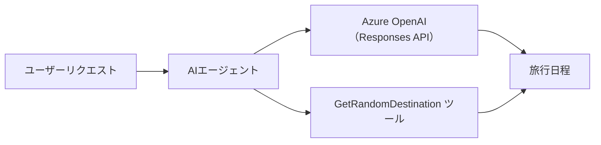

# 🌍 Microsoft Agent Framework (.NET) を使った AI 旅行代理店

## 📋 シナリオ概要

この例では、Microsoft Agent Framework for .NET を使用して、インテリジェントな旅行計画エージェントを構築する方法を示します。エージェントは世界中のランダムな目的地に対して、個別にパーソナライズされた日帰り旅行の旅程を自動生成できます。

### 主な機能:

- 🎲 <strong>ランダムな目的地選択</strong>: カスタムツールを用いて休暇先を選択
- 🗺️ <strong>インテリジェントな旅行計画</strong>: 詳細な日ごとの旅程を作成
- 🔄 <strong>リアルタイムストリーミング</strong>: 即時応答とストリーミング応答の両方に対応
- 🛠️ <strong>カスタムツール統合</strong>: エージェント機能拡張の方法を実演

## 🔧 技術アーキテクチャ

### コア技術

- **Microsoft Agent Framework**: AIエージェント開発のための最新の .NET 実装
- **Azure OpenAI (Responses API)**: Azure OpenAI Responses API を使ったモデル推論
- **Azure Identity**: `AzureCliCredential` (`az login`) による安全なサインイン
- <strong>安全な構成管理</strong>: 環境ごとのエンドポイント管理

### 主要コンポーネント

1. **AIAgent**: 会話のフローを管理するメインエージェントオーケストレーター
2. <strong>カスタムツール</strong>: エージェントが使用する `GetRandomDestination()` 関数
3. **Responses Client**: Azure OpenAI Responses ベースの会話インターフェイス
4. <strong>ストリーミング対応</strong>: リアルタイム応答生成機能

### 統合パターン



## 🚀 はじめに

### 前提条件

- [.NET 10 SDK](https://dotnet.microsoft.com/download/dotnet/10.0) 以上
- Azure OpenAI リソースとモデルデプロイを持つ [Azure サブスクリプション](https://azure.microsoft.com/free/)
- `az login` でサインインできる [Azure CLI](https://learn.microsoft.com/cli/azure/install-azure-cli)

### 必須環境変数

```bash
# zsh/bash
export AZURE_OPENAI_ENDPOINT=https://<your-resource>.openai.azure.com
export AZURE_OPENAI_DEPLOYMENT=gpt-4.1-mini
# その後、AzureCliCredentialがトークンを取得できるようにサインインします
az login
```

```powershell
# PowerShell
$env:AZURE_OPENAI_ENDPOINT = "https://<your-resource>.openai.azure.com"
$env:AZURE_OPENAI_DEPLOYMENT = "gpt-4.1-mini"
# AzureCliCredentialがトークンを取得できるようにサインインします
az login
```

### サンプルコード

このコード例を実行するには、

```bash
# zsh/bash
chmod +x ./01-dotnet-agent-framework.cs
./01-dotnet-agent-framework.cs
```

または dotnet CLI を使って:

```bash
dotnet run ./01-dotnet-agent-framework.cs
```

完全なコードは [`01-dotnet-agent-framework.cs`](../../../../01-intro-to-ai-agents/code_samples/01-dotnet-agent-framework.cs) を参照してください。

```csharp
#!/usr/bin/dotnet run

#:package Microsoft.Extensions.AI@10.4.1
#:package Microsoft.Agents.AI.OpenAI@1.1.0
#:package Azure.AI.OpenAI@2.1.0
#:package Azure.Identity@1.13.1

using System.ComponentModel;

using Microsoft.Agents.AI;
using Microsoft.Extensions.AI;

using Azure.AI.OpenAI;
using Azure.Identity;

// Tool Function: Random Destination Generator
// This static method will be available to the agent as a callable tool
// The [Description] attribute helps the AI understand when to use this function
// This demonstrates how to create custom tools for AI agents
[Description("Provides a random vacation destination.")]
static string GetRandomDestination()
{
    // List of popular vacation destinations around the world
    // The agent will randomly select from these options
    var destinations = new List<string>
    {
        "Paris, France",
        "Tokyo, Japan",
        "New York City, USA",
        "Sydney, Australia",
        "Rome, Italy",
        "Barcelona, Spain",
        "Cape Town, South Africa",
        "Rio de Janeiro, Brazil",
        "Bangkok, Thailand",
        "Vancouver, Canada"
    };

    // Generate random index and return selected destination
    // Uses System.Random for simple random selection
    var random = new Random();
    int index = random.Next(destinations.Count);
    return destinations[index];
}

// Azure OpenAI with the Responses API (stable v1 endpoint). Sign in with `az login`.
var azureEndpoint = Environment.GetEnvironmentVariable("AZURE_OPENAI_ENDPOINT")
    ?? throw new InvalidOperationException("AZURE_OPENAI_ENDPOINT is not set.");
var deployment = Environment.GetEnvironmentVariable("AZURE_OPENAI_DEPLOYMENT") ?? "gpt-4.1-mini";

var azureClient = new AzureOpenAIClient(new Uri(azureEndpoint), new AzureCliCredential());

// Create AI Agent with Travel Planning Capabilities
// Get the Responses client for the specified deployment and create the AI agent
// Configure agent with travel planning instructions and random destination tool
// The agent can now plan trips using the GetRandomDestination function
AIAgent agent = azureClient
    .GetChatClient(deployment)
    .AsAIAgent(
        instructions: "You are a helpful AI Agent that can help plan vacations for customers at random destinations",
        tools: [AIFunctionFactory.Create(GetRandomDestination)]
    );

// Execute Agent: Plan a Day Trip
// Run the agent with streaming enabled for real-time response display
// Shows the agent's thinking and response as it generates the content
// Provides better user experience with immediate feedback
await foreach (var update in agent.RunStreamingAsync("Plan me a day trip"))
{
    await Task.Delay(10);
    Console.Write(update);
}
```

## 🎓 重要ポイントまとめ

1. <strong>エージェントアーキテクチャ</strong>: Microsoft Agent Framework は .NET での AI エージェント構築においてクリーンで型安全なアプローチを提供
2. <strong>ツール統合</strong>: `[Description]` 属性が付与された関数はエージェントで使用可能なツールになる
3. <strong>構成管理</strong>: 環境変数と安全な資格情報管理は .NET のベストプラクティスに従う
4. **Azure OpenAI Responses API**: エージェントは Azure.AI.OpenAI SDK を通じて Azure OpenAI Responses API を利用

## 🔗 追加リソース

- [Microsoft Agent Framework ドキュメント](https://learn.microsoft.com/agent-framework)
- [Microsoft Foundry の Azure OpenAI](https://learn.microsoft.com/azure/ai-services/openai/)
- [Microsoft.Extensions.AI](https://learn.microsoft.com/dotnet/ai/microsoft-extensions-ai)
- [.NET シングルファイルアプリ](https://devblogs.microsoft.com/dotnet/announcing-dotnet-run-app)

---

<!-- CO-OP TRANSLATOR DISCLAIMER START -->
**免責事項**：
本書類は AI 翻訳サービス [Co-op Translator](https://github.com/Azure/co-op-translator) を使用して翻訳されています。正確性を期していますが、自動翻訳には誤りや不正確な部分が含まれる可能性があることをご承知おきください。原文の原語版が正式な情報源とみなされるべきです。重要な情報については、専門の人間による翻訳を推奨します。本翻訳の利用により生じたいかなる誤解や解釈違いについても、当方は責任を負いかねます。
<!-- CO-OP TRANSLATOR DISCLAIMER END -->