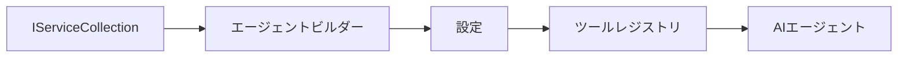

# 🎨 Azure OpenAI (Responses API) を使ったエージェント設計パターン（.NET）

## 📋 学習目標

本例では、Azure OpenAI (Responses API) 統合を使った .NET の Microsoft Agent Framework でインテリジェントエージェントを構築するためのエンタープライズグレードの設計パターンを示します。エージェントを本番環境対応、保守可能、スケーラブルにするための専門的なパターンとアーキテクチャ手法を学びます。

### エンタープライズ設計パターン

- 🏭 <strong>ファクトリーパターン</strong>：依存性注入による標準化されたエージェント作成
- 🔧 <strong>ビルダーパターン</strong>：エージェントの流暢な設定とセットアップ
- 🧵 <strong>スレッドセーフパターン</strong>：並行会話管理
- 📋 <strong>リポジトリパターン</strong>：ツールと機能の整理管理

## 🎯 .NET固有のアーキテクチャ利点

### エンタープライズ機能

- <strong>強い型付け</strong>：コンパイル時検証と IntelliSense サポート
- <strong>依存性注入</strong>：組み込みの DI コンテナ統合
- <strong>設定管理</strong>：IConfiguration と Options パターン
- **Async/Await**：ファーストクラスの非同期プログラミング対応

### 本番対応パターン

- <strong>ログ統合</strong>：ILogger と構造化ログのサポート
- <strong>ヘルスチェック</strong>：組み込みの監視と診断
- <strong>設定検証</strong>：データ注釈を用いた強い型付け
- <strong>エラー処理</strong>：構造化された例外管理

## 🔧 技術アーキテクチャ

### コア .NET コンポーネント

- **Microsoft.Extensions.AI**：統一された AI サービス抽象化
- **Microsoft.Agents.AI**：エンタープライズ向けエージェントオーケストレーションフレームワーク
- **Azure OpenAI (Responses API)**：高性能 API クライアントパターン
- <strong>設定システム</strong>：appsettings.json と環境統合

### 設計パターン実装



## 🏗️ 実証済みエンタープライズパターン

### 1. <strong>生成パターン</strong>

- <strong>エージェントファクトリー</strong>：一貫した設定による集中作成
- <strong>ビルダーパターン</strong>：複雑なエージェント設定のための流暢な API
- <strong>シングルトンパターン</strong>：共有リソースと設定管理
- <strong>依存性注入</strong>：疎結合とテスト容易性

### 2. <strong>振る舞いパターン</strong>

- <strong>ストラテジーパターン</strong>：差し替え可能なツール実行戦略
- <strong>コマンドパターン</strong>：取り消し・やり直し可能なエージェント操作のカプセル化
- <strong>オブザーバーパターン</strong>：イベント駆動のエージェントライフサイクル管理
- <strong>テンプレートメソッド</strong>：標準化されたエージェント実行ワークフロー

### 3. <strong>構造パターン</strong>

- <strong>アダプタパターン</strong>：Azure OpenAI (Responses API) 統合レイヤー
- <strong>デコレータパターン</strong>：エージェント機能強化
- <strong>ファサードパターン</strong>：簡素化されたエージェントインターフェース
- <strong>プロキシパターン</strong>：パフォーマンスのための遅延読み込みとキャッシュ

## 📚 .NET設計原則

### SOLID原則

- <strong>単一責任</strong>：各コンポーネントが明確な目的を持つ
- <strong>開放閉鎖</strong>：修正不要で拡張可能
- <strong>リスコフの置換原則</strong>：インターフェースベースのツール実装
- <strong>インターフェース分離</strong>：焦点を絞った一貫性のあるインターフェース
- <strong>依存関係逆転</strong>：具象ではなく抽象に依存

### クリーンアーキテクチャ

- <strong>ドメイン層</strong>：コアエージェントとツールの抽象化
- <strong>アプリケーション層</strong>：エージェントオーケストレーションとワークフロー
- <strong>インフラ層</strong>：Azure OpenAI (Responses API) 統合と外部サービス
- <strong>プレゼンテーション層</strong>：ユーザーインタラクションと応答フォーマット

## 🔒 エンタープライズ考慮事項

### セキュリティ

- <strong>資格情報管理</strong>：IConfiguration を使った安全な API キー管理
- <strong>入力検証</strong>：強い型付けとデータ注釈検証
- <strong>出力サニタイズ</strong>：安全な応答処理とフィルタリング
- <strong>監査ログ</strong>：包括的な操作記録

### パフォーマンス

- <strong>非同期パターン</strong>：ノンブロッキング I/O 操作
- <strong>接続プーリング</strong>：効率的な HTTP クライアント管理
- <strong>キャッシュ</strong>：パフォーマンス向上のための応答キャッシュ
- <strong>リソース管理</strong>：適切な破棄とクリーンアップパターン

### スケーラビリティ

- <strong>スレッド安全</strong>：並行エージェント実行のサポート
- <strong>リソースプーリング</strong>：効率的な資源利用
- <strong>負荷管理</strong>：レート制限とバックプレッシャー処理
- <strong>監視</strong>：パフォーマンス指標とヘルスチェック

## 🚀 本番展開

- <strong>設定管理</strong>：環境別設定
- <strong>ログ戦略</strong>：相関 ID を用いた構造化ログ
- <strong>エラー処理</strong>：グローバル例外処理と適切なリカバリ
- <strong>監視</strong>：Application Insights とパフォーマンスカウンター
- <strong>テスト</strong>：ユニットテスト、統合テスト、負荷テストパターン

.NET でエンタープライズグレードのインテリジェントエージェントを構築する準備はできましたか？堅牢なアーキテクチャを設計しましょう！🏢✨

## 🚀 はじめに

### 前提条件

- [.NET 10 SDK](https://dotnet.microsoft.com/download/dotnet/10.0) 以上
- Azure OpenAI リソースとモデル展開を持つ [Azure サブスクリプション](https://azure.microsoft.com/free/)
- サインイン済みの [Azure CLI](https://learn.microsoft.com/cli/azure/install-azure-cli) — `az login` でログイン

### 必須環境変数

```bash
# zsh/bash
export AZURE_OPENAI_ENDPOINT=https://<your-resource>.openai.azure.com
export AZURE_OPENAI_DEPLOYMENT=gpt-5-mini
# それからサインインして、AzureCliCredentialがトークンを取得できるようにします
az login
```

```powershell
# PowerShell
$env:AZURE_OPENAI_ENDPOINT = "https://<your-resource>.openai.azure.com"
$env:AZURE_OPENAI_DEPLOYMENT = "gpt-5-mini"
# 次にサインインして、AzureCliCredentialがトークンを取得できるようにします
az login
```

### サンプルコード

コード例を実行するには、

```bash
# zsh/bash
chmod +x ./03-dotnet-agent-framework.cs
./03-dotnet-agent-framework.cs
```

または dotnet CLI を使って：

```bash
dotnet run ./03-dotnet-agent-framework.cs
```

完全なコードは [`03-dotnet-agent-framework.cs`](../../../../03-agentic-design-patterns/code_samples/03-dotnet-agent-framework.cs) を参照してください。

```csharp
#!/usr/bin/dotnet run

#:package Microsoft.Extensions.AI@10.*
#:package Microsoft.Agents.AI.OpenAI@1.*-*
#:package Azure.AI.OpenAI@2.1.0
#:package Azure.Identity@1.13.1

using System.ComponentModel;

using Microsoft.Agents.AI;
using Microsoft.Extensions.AI;

using Azure.AI.OpenAI;
using Azure.Identity;

// Tool Function: Random Destination Generator
// This static method will be available to the agent as a callable tool
// The [Description] attribute helps the AI understand when to use this function
// This demonstrates how to create custom tools for AI agents
[Description("Provides a random vacation destination.")]
static string GetRandomDestination()
{
    // List of popular vacation destinations around the world
    // The agent will randomly select from these options
    var destinations = new List<string>
    {
        "Paris, France",
        "Tokyo, Japan",
        "New York City, USA",
        "Sydney, Australia",
        "Rome, Italy",
        "Barcelona, Spain",
        "Cape Town, South Africa",
        "Rio de Janeiro, Brazil",
        "Bangkok, Thailand",
        "Vancouver, Canada"
    };

    // Generate random index and return selected destination
    // Uses System.Random for simple random selection
    var random = new Random();
    int index = random.Next(destinations.Count);
    return destinations[index];
}

// Azure OpenAI with the Responses API (stable v1 endpoint). Sign in with `az login`.
var azureEndpoint = Environment.GetEnvironmentVariable("AZURE_OPENAI_ENDPOINT")
    ?? throw new InvalidOperationException("AZURE_OPENAI_ENDPOINT is not set.");
var deployment = Environment.GetEnvironmentVariable("AZURE_OPENAI_DEPLOYMENT") ?? "gpt-5-mini";

var azureClient = new AzureOpenAIClient(new Uri(azureEndpoint), new AzureCliCredential());

// Define Agent Identity and Comprehensive Instructions
// Agent name for identification and logging purposes
var AGENT_NAME = "TravelAgent";

// Detailed instructions that define the agent's personality, capabilities, and behavior
// This system prompt shapes how the agent responds and interacts with users
var AGENT_INSTRUCTIONS = """
You are a helpful AI Agent that can help plan vacations for customers.

Important: When users specify a destination, always plan for that location. Only suggest random destinations when the user hasn't specified a preference.

When the conversation begins, introduce yourself with this message:
"Hello! I'm your TravelAgent assistant. I can help plan vacations and suggest interesting destinations for you. Here are some things you can ask me:
1. Plan a day trip to a specific location
2. Suggest a random vacation destination
3. Find destinations with specific features (beaches, mountains, historical sites, etc.)
4. Plan an alternative trip if you don't like my first suggestion

What kind of trip would you like me to help you plan today?"

Always prioritize user preferences. If they mention a specific destination like "Bali" or "Paris," focus your planning on that location rather than suggesting alternatives.
""";

// Create AI Agent with Advanced Travel Planning Capabilities
// Get the Responses client for the deployment and create the AI agent
// Configure agent with name, detailed instructions, and available tools
// This demonstrates the .NET agent creation pattern with full configuration
AIAgent agent = azureClient
    .GetChatClient(deployment)
    .AsAIAgent(
        name: AGENT_NAME,
        instructions: AGENT_INSTRUCTIONS,
        tools: [AIFunctionFactory.Create(GetRandomDestination)]
    );

// Create New Conversation Session for Context Management
// Initialize a new conversation session to maintain context across multiple interactions
// Sessions enable the agent to remember previous exchanges and maintain conversational state
// This is essential for multi-turn conversations and contextual understanding
var session = await agent.CreateSessionAsync();

// Execute Agent: First Travel Planning Request
// Run the agent with an initial request that will likely trigger the random destination tool
// The agent will analyze the request, use the GetRandomDestination tool, and create an itinerary
// Using the session parameter maintains conversation context for subsequent interactions
await foreach (var update in agent.RunStreamingAsync("Plan me a day trip", session))
{
    await Task.Delay(10);
    Console.Write(update);
}

Console.WriteLine();

// Execute Agent: Follow-up Request with Context Awareness
// Demonstrate contextual conversation by referencing the previous response
// The agent remembers the previous destination suggestion and will provide an alternative
// This showcases the power of conversation sessions and contextual understanding in .NET agents
await foreach (var update in agent.RunStreamingAsync("I don't like that destination. Plan me another vacation.", session))
{
    await Task.Delay(10);
    Console.Write(update);
}
```

---

<!-- CO-OP TRANSLATOR DISCLAIMER START -->
**免責事項**：
本書類は AI 翻訳サービス [Co-op Translator](https://github.com/Azure/co-op-translator) を使用して翻訳されています。正確性を期していますが、自動翻訳には誤りや不正確な部分が含まれる可能性があることをご承知おきください。原文の原語版が正式な情報源とみなされるべきです。重要な情報については、専門の人間による翻訳を推奨します。本翻訳の利用により生じたいかなる誤解や解釈違いについても、当方は責任を負いかねます。
<!-- CO-OP TRANSLATOR DISCLAIMER END -->