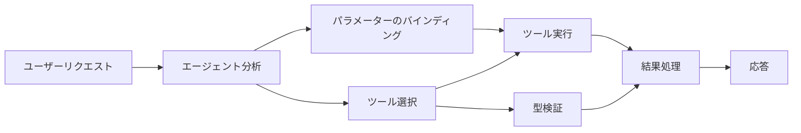

# 🛠️ Azure OpenAI（Responses API）を用いた高度なツール活用（.NET）

## 📋 学習目標

このノートブックは、.NETのMicrosoft Agent Frameworkを用いてAzure OpenAI（Responses API）と連携したエンタープライズレベルのツール統合パターンを紹介します。複数の専門的なツールを組み合わせた高度なエージェントの構築方法を、C#の強い型付けや.NETのエンタープライズ機能を活用しながら学びます。

### マスターする高度なツール機能

- 🔧 <strong>マルチツールアーキテクチャ</strong>：複数の専門機能を持つエージェントの構築
- 🎯 <strong>型安全なツール実行</strong>：C#のコンパイル時検証の活用
- 📊 <strong>エンタープライズ向けツールパターン</strong>：本番対応のツール設計とエラーハンドリング
- 🔗 <strong>ツールの合成</strong>：複雑な業務ワークフローのためのツールの組み合わせ

## 🎯 .NETツールアーキテクチャの利点

### エンタープライズ向けツール機能

- <strong>コンパイル時検証</strong>：強い型付けがツールパラメーターの正確性を保証
- <strong>依存性注入</strong>：IoCコンテナによるツール管理の統合
- <strong>非同期処理パターン</strong>：リソース管理に配慮した非同期ツール実行
- <strong>構造化ログ</strong>：ツール実行の監視のための組み込みログ統合

### 本番対応パターン

- <strong>例外処理</strong>：型付き例外による包括的なエラー管理
- <strong>リソース管理</strong>：適切な破棄パターンとメモリ管理
- <strong>パフォーマンス監視</strong>：内蔵のメトリクスおよびパフォーマンスカウンター
- <strong>構成管理</strong>：検証付きの型安全な設定管理

## 🔧 技術アーキテクチャ

### コアの.NETツールコンポーネント

- **Microsoft.Extensions.AI**：統合ツール抽象レイヤー
- **Microsoft.Agents.AI**：エンタープライズ向けツールオーケストレーション
- **Azure OpenAI (Responses API)**：接続プーリング対応の高性能APIクライアント

### ツール実行パイプライン



## 🛠️ ツールカテゴリとパターン

### 1. <strong>データ処理ツール</strong>

- <strong>入力検証</strong>：データ注釈を活用した強い型付け
- <strong>変換操作</strong>：型安全なデータ変換とフォーマット
- <strong>ビジネスロジック</strong>：ドメイン固有の計算や分析ツール
- <strong>出力フォーマット</strong>：構造化されたレスポンス生成

### 2. <strong>統合ツール</strong>

- **APIコネクター**：HttpClientを用いたRESTfulサービス連携
- <strong>データベースツール</strong>：Entity Frameworkによるデータアクセス統合
- <strong>ファイル操作</strong>：検証付きの安全なファイルシステム操作
- <strong>外部サービス</strong>：サードパーティサービス連携パターン

### 3. <strong>ユーティリティツール</strong>

- <strong>テキスト処理</strong>：文字列操作とフォーマットユーティリティ
- <strong>日時操作</strong>：カルチャー対応の日時計算
- <strong>数学的ツール</strong>：精密計算および統計演算
- <strong>検証ツール</strong>：ビジネスルール検証とデータ検証

強力で型安全なツール機能を備えたエンタープライズ級エージェントを.NETで構築する準備はできましたか？プロフェッショナルグレードのソリューション設計に取りかかりましょう！🏢⚡

## 🚀 はじめに

### 前提条件

- [.NET 10 SDK](https://dotnet.microsoft.com/download/dotnet/10.0) 以上
- Azure OpenAIリソースとモデル展開を持つ [Azureサブスクリプション](https://azure.microsoft.com/free/)
- `az login` でサインインする [Azure CLI](https://learn.microsoft.com/cli/azure/install-azure-cli)

### 必須環境変数

```bash
# zsh/bash
export AZURE_OPENAI_ENDPOINT=https://<your-resource>.openai.azure.com
export AZURE_OPENAI_DEPLOYMENT=gpt-5-mini
# AzureCliCredentialがトークンを取得できるようにサインインしてください
az login
```

```powershell
# PowerShell
$env:AZURE_OPENAI_ENDPOINT = "https://<your-resource>.openai.azure.com"
$env:AZURE_OPENAI_DEPLOYMENT = "gpt-5-mini"
# それからサインインして、AzureCliCredential がトークンを取得できるようにします
az login
```

### サンプルコード

コード例の実行方法：

```bash
# zsh/bash
chmod +x ./04-dotnet-agent-framework.cs
./04-dotnet-agent-framework.cs
```

またはdotnet CLIを使用して：

```bash
dotnet run ./04-dotnet-agent-framework.cs
```

完全なコードは [`04-dotnet-agent-framework.cs`](../../../../04-tool-use/code_samples/04-dotnet-agent-framework.cs) を参照してください。

```csharp
#!/usr/bin/dotnet run

#:package Microsoft.Extensions.AI@10.*
#:package Microsoft.Agents.AI.OpenAI@1.*-*
#:package Azure.AI.OpenAI@2.1.0
#:package Azure.Identity@1.13.1

using System.ComponentModel;

using Microsoft.Agents.AI;
using Microsoft.Extensions.AI;

using Azure.AI.OpenAI;
using Azure.Identity;

// Tool Function: Random Destination Generator
// This static method will be available to the agent as a callable tool
// The [Description] attribute helps the AI understand when to use this function
// This demonstrates how to create custom tools for AI agents
[Description("Provides a random vacation destination.")]
static string GetRandomDestination()
{
    // List of popular vacation destinations around the world
    // The agent will randomly select from these options
    var destinations = new List<string>
    {
        "Paris, France",
        "Tokyo, Japan",
        "New York City, USA",
        "Sydney, Australia",
        "Rome, Italy",
        "Barcelona, Spain",
        "Cape Town, South Africa",
        "Rio de Janeiro, Brazil",
        "Bangkok, Thailand",
        "Vancouver, Canada"
    };

    // Generate random index and return selected destination
    // Uses System.Random for simple random selection
    var random = new Random();
    int index = random.Next(destinations.Count);
    return destinations[index];
}

// Azure OpenAI with the Responses API (stable v1 endpoint). Sign in with `az login`.
var azureEndpoint = Environment.GetEnvironmentVariable("AZURE_OPENAI_ENDPOINT")
    ?? throw new InvalidOperationException("AZURE_OPENAI_ENDPOINT is not set.");
var deployment = Environment.GetEnvironmentVariable("AZURE_OPENAI_DEPLOYMENT") ?? "gpt-5-mini";

var azureClient = new AzureOpenAIClient(new Uri(azureEndpoint), new AzureCliCredential());

// Define Agent Identity and Comprehensive Instructions
// Agent name for identification and logging purposes
var AGENT_NAME = "TravelAgent";

// Detailed instructions that define the agent's personality, capabilities, and behavior
// This system prompt shapes how the agent responds and interacts with users
var AGENT_INSTRUCTIONS = """
You are a helpful AI Agent that can help plan vacations for customers.

Important: When users specify a destination, always plan for that location. Only suggest random destinations when the user hasn't specified a preference.

When the conversation begins, introduce yourself with this message:
"Hello! I'm your TravelAgent assistant. I can help plan vacations and suggest interesting destinations for you. Here are some things you can ask me:
1. Plan a day trip to a specific location
2. Suggest a random vacation destination
3. Find destinations with specific features (beaches, mountains, historical sites, etc.)
4. Plan an alternative trip if you don't like my first suggestion

What kind of trip would you like me to help you plan today?"

Always prioritize user preferences. If they mention a specific destination like "Bali" or "Paris," focus your planning on that location rather than suggesting alternatives.
""";

// Create AI Agent with Advanced Travel Planning Capabilities
// Get the Responses client for the deployment and create the AI agent
// Configure agent with name, detailed instructions, and available tools
// This demonstrates the .NET agent creation pattern with full configuration
AIAgent agent = azureClient
    .GetChatClient(deployment)
    .AsAIAgent(
        name: AGENT_NAME,
        instructions: AGENT_INSTRUCTIONS,
        tools: [AIFunctionFactory.Create(GetRandomDestination)]
    );

// Create New Conversation Session for Context Management
// Initialize a new conversation session to maintain context across multiple interactions
// Sessions enable the agent to remember previous exchanges and maintain conversational state
// This is essential for multi-turn conversations and contextual understanding
await using var session = await agent.CreateSessionAsync();

// Execute Agent: First Travel Planning Request
// Run the agent with an initial request that will likely trigger the random destination tool
// The agent will analyze the request, use the GetRandomDestination tool, and create an itinerary
// Using the session parameter maintains conversation context for subsequent interactions
await foreach (var update in agent.RunStreamingAsync("Plan me a day trip", session))
{
    await Task.Delay(10);
    Console.Write(update);
}

Console.WriteLine();

// Execute Agent: Follow-up Request with Context Awareness
// Demonstrate contextual conversation by referencing the previous response
// The agent remembers the previous destination suggestion and will provide an alternative
// This showcases the power of conversation sessions and contextual understanding in .NET agents
await foreach (var update in agent.RunStreamingAsync("I don't like that destination. Plan me another vacation.", session))
{
    await Task.Delay(10);
    Console.Write(update);
}
```

---

<!-- CO-OP TRANSLATOR DISCLAIMER START -->
**免責事項**：
本書類は AI 翻訳サービス [Co-op Translator](https://github.com/Azure/co-op-translator) を使用して翻訳されています。正確性を期していますが、自動翻訳には誤りや不正確な部分が含まれる可能性があることをご承知おきください。原文の原語版が正式な情報源とみなされるべきです。重要な情報については、専門の人間による翻訳を推奨します。本翻訳の利用により生じたいかなる誤解や解釈違いについても、当方は責任を負いかねます。
<!-- CO-OP TRANSLATOR DISCLAIMER END -->