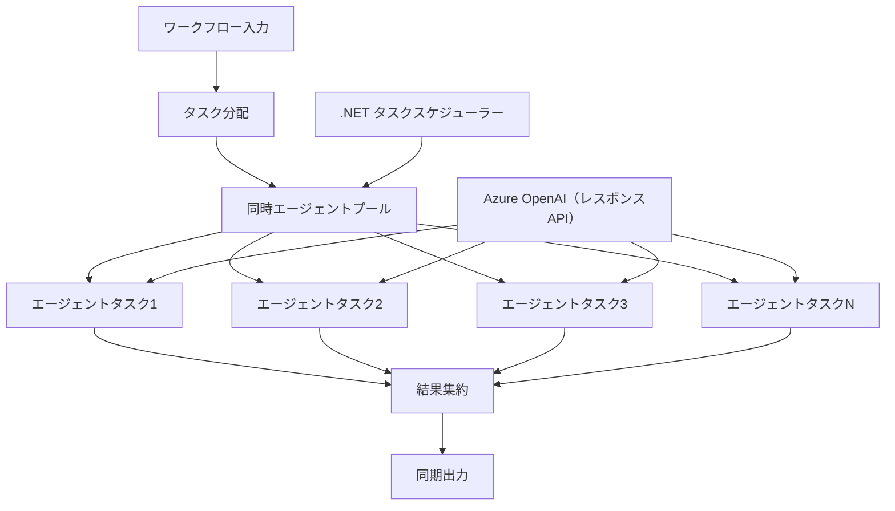

# ⚡ Azure OpenAI（Responses API）を使った同時エージェントワークフロー（.NET）

## 📋 高性能並列処理チュートリアル

このノートブックでは、.NET用Microsoft Agent FrameworkとAzure OpenAI（Responses API）を用いた<strong>同時ワークフローパターン</strong>を紹介します。複数のAIエージェントを同時に実行しつつ調整とデータ整合性を保ちながら、スループットを最大化する高性能な並列処理ワークフローの構築方法を学びます。

## 🎯 学習目標

### 🚀 <strong>同時処理の基礎</strong>
- <strong>並列エージェント実行</strong>: 最大性能のために複数のAIエージェントを同時実行
- **Async/Awaitパターン**: .NETの非同期プログラミングモデルを活用した効率的な並行処理
- **Azure OpenAI（Responses API）**: 複数の同時呼び出しを調整
- <strong>リソース管理</strong>: 同時運用中のAIモデルリソースを効率的に管理

### 🏗️ <strong>高度な並行アーキテクチャ</strong>
- <strong>タスクベースの並列処理</strong>: .NET Task Parallel Libraryを用いた最適な同時実行
- <strong>同期パターン</strong>: 同時実行エージェントの調整と競合状態の回避
- <strong>負荷分散</strong>: 利用可能な並行処理能力に効率的に作業を割り当て
- <strong>フォールトトレランス</strong>: 個々のエージェント障害をワークフロー全体の停止なく処理

### 🏢 <strong>エンタープライズ向け同時処理アプリケーション</strong>
- <strong>大量ドキュメント処理</strong>: 複数のドキュメントを同時に処理
- <strong>リアルタイムコンテンツ分析</strong>: 同時に入ってくるデータストリームの分析
- <strong>バッチ処理最適化</strong>: 大規模データ処理のスループット最大化
- <strong>マルチモーダル分析</strong>: 異なるコンテンツタイプ・フォーマットの並列処理

## ⚙️ 前提条件とセットアップ

### 📦 **必要なNuGetパッケージ**

高性能同時ワークフローに必須のパッケージ：

```xml
<!-- Core AI Framework with Async Support -->
<PackageReference Include="Microsoft.Extensions.AI" Version="9.9.0" />

<!-- Azure OpenAI (Responses API) -->
<PackageReference Include="Azure.AI.OpenAI" Version="2.1.0" />

<!-- Azure Identity and Async LINQ for Advanced Operations -->
<PackageReference Include="Azure.Identity" Version="1.15.0" />
<PackageReference Include="System.Linq.Async" Version="6.0.3" />

<!-- Local Agent Framework References -->
<!-- Microsoft.Agents.AI.dll - Core agent abstractions with async support -->
<!-- Microsoft.Agents.AI.OpenAI.dll - Azure OpenAI (Responses API) integration with concurrency -->
```

### 🔑 **Azure OpenAI設定**

**環境設定（.envファイル）:**
```env
AZURE_OPENAI_ENDPOINT=https://<your-resource>.openai.azure.com
AZURE_OPENAI_DEPLOYMENT=gpt-5-mini
```

**同時処理時の考慮事項：**
```csharp
// Configure for concurrent operations
var clientOptions = new AzureOpenAIClientOptions()
{
    // Configure network timeout for concurrent requests
    NetworkTimeout = TimeSpan.FromMinutes(5)
};
```

### 🏗️ <strong>同時ワークフローアーキテクチャ</strong>



**主要コンポーネント:**
- **Task Parallel Library**: .NET組み込みの同時操作サポート
- <strong>エージェントプール</strong>: 並列処理用の複数エージェントインスタンス
- <strong>結果集約</strong>: 同時エージェントの結果を調整・統合
- <strong>同期ポイント</strong>: 同時操作間のデータ一貫性を保証

## 🎨 <strong>同時ワークフローデザインパターン</strong>

### 🔍 **並列調査＆分析**
```
Research Topic → Concurrent Research Agents → Result Synthesis → Final Report
```

### 📊 <strong>複数ソースのデータ処理</strong>
```
Data Sources → Parallel Processing Agents → Data Integration → Unified Output
```

### 🎭 <strong>コンテンツ生成パイプライン</strong>
```
Content Requirements → Concurrent Content Generators → Quality Review → Final Content
```

### 🔄 **Fan-Out/Fan-In処理**
```
Single Input → Multiple Concurrent Processors → Result Aggregation → Single Output
```

## 🏢 <strong>エンタープライズ性能向上効果</strong>

### ⚡ **スループット＆スケーラビリティ**
- <strong>線形性能スケーリング</strong>: 同時エージェント数を増やしてスループット向上
- <strong>リソース活用率</strong>: 利用可能AIモデル容量の最大効率利用
- <strong>処理時間短縮</strong>: 並列実行による大幅な時間短縮
- <strong>弾力的スケーリング</strong>: ワークロードに応じたエージェント数の動的調整

### 🛡️ **信頼性＆回復力**
- <strong>障害隔離</strong>: 個別のエージェント障害が他の並行操作に影響を与えない
- <strong>段階的劣化</strong>: エージェント容量減少でもシステム動作継続
- <strong>エラー回復</strong>: 失敗した並行操作の自動リトライ機構
- <strong>負荷分散</strong>: 利用可能エージェントへの均等な作業配分

### 📊 <strong>パフォーマンス監視</strong>
- <strong>同時実行メトリクス</strong>: 並列操作全体の性能追跡
- <strong>リソース使用状況分析</strong>: CPU、メモリ、ネットワークのモニタリング
- <strong>スループット解析</strong>: 並行処理による効率向上の測定
- <strong>ボトルネック検出</strong>: 性能制約の特定と解消

### 🔧 **開発＆運用**
- **Asyncプログラミングモデル**: .NETの成熟したasync/awaitパターン活用
- <strong>タスク調整</strong>: 組み込みのタスク管理と調整機能
- <strong>例外処理</strong>: 同時操作の包括的なエラーハンドリング
- <strong>デバッグ支援</strong>: Visual Studioによる同時ワークフローのデバッグツール

.NETで高性能同時AIワークフローを構築しましょう！🚀

## 💻 コードの実行

完全実装は`03.dotnet-agent-framework-workflow-ghmodel-concurrent.cs`にあります。このファイルは旅行計画の<strong>Fan-Out/Fan-In同時ワークフロー</strong>を示します：

### 🏗️ <strong>ワークフローアーキテクチャ</strong>

```
User Request → ConcurrentStartExecutor → [Researcher Agent || Planner Agent] → ConcurrentAggregationExecutor → Final Output
```

**主要コンポーネント:**

1. **ConcurrentStartExecutor**：ユーザーリクエストを全エージェントに同時にブロードキャスト
2. **Researcher Agent**：目的地や観光スポットを同時に分析
3. **Planner Agent**：詳細な旅行計画を同時に作成
4. **ConcurrentAggregationExecutor**：両エージェントの結果を収集・統合

### 🎯 **Fan-Out/Fan-Inパターン**

このワークフローは古典的な<strong>Fan-Out/Fan-In</strong>パターンを示します：
- **Fan-Out**：１つの入力メッセージを複数エージェントに同時に送信
- <strong>同時処理</strong>：複数エージェントが同じタスクを並行して処理
- **Fan-In**：全エージェントの結果を集約し単一の出力に統合

### 🚀 実行例

```bash
# スクリプトを実行可能にする（Unix/Linux/macOS）
chmod +x 03.dotnet-agent-framework-workflow-ghmodel-concurrent.cs

# 並列ワークフローを実行する
./03.dotnet-agent-framework-workflow-ghmodel-concurrent.cs
```

Windowsの場合：
```powershell
dotnet run 03.dotnet-agent-framework-workflow-ghmodel-concurrent.cs
```

### 📝 期待される出力

ワークフローは以下を行います：
1. <strong>リクエストのブロードキャスト</strong>：「12月にシアトルへの旅行を計画する」を両エージェントへ送信
2. <strong>同時処理</strong>：両エージェントが同時に動作
    - Researcherが観光地や詳細を特定
    - Plannerが旅程と手配を作成
3. <strong>集約</strong>：両回答を統合して包括的な出力を生成
4. <strong>結果表示</strong>：統合された旅行計画をすべての情報とともに表示

### 🔧 カスタマイズオプション

**同時エージェントを追加する：**
```csharp
// Create additional specialized agents
AIAgent budgetAgent = azureClient.GetOpenAIResponseClient(deployment).CreateAIAgent(
    name: "Budget-Agent", instructions: "Calculate travel costs...");

// Add to fan-out
var workflow = new WorkflowBuilder(startExecutor)
    .AddFanOutEdge(startExecutor, targets: [researcherAgent, plannerAgent, budgetAgent])
    .AddFanInEdge(aggregationExecutor, sources: [researcherAgent, plannerAgent, budgetAgent])
    .WithOutputFrom(aggregationExecutor)
    .Build();

// Update aggregation count
if (this._messages.Count == 3) { ... }
```

**エージェントの指示を変更する：**
```csharp
const string ResearcherAgentInstructions = "Your custom instructions for research...";
const string PlanAgentInstructions = "Your custom instructions for planning...";
```

**タスクを変更する：**
```csharp
StreamingRun run = await InProcessExecution.StreamAsync(
    workflow, 
    "Plan a European vacation for 2 weeks in summer"
);
```

### 🎯 実世界での適用例

この同時パターンが最適なケース：
- <strong>コンテンツ作成</strong>：複数の執筆者が異なるセクションを同時に作成
- <strong>コードレビュー</strong>：複数レビュアーが異なる視点からコード分析
- <strong>市場調査</strong>：異なる市場セグメントを並行分析
- <strong>ドキュメント処理</strong>：並行抽出、分析、検証
- <strong>多視点分析</strong>：同じ入力に対して多様な視点を取得

### 🔍 カスタムエグゼキュータ理解

**ConcurrentStartExecutor:**
- `IMessageHandler<string>`を実装し文字列入力を受け取る
- 接続された全エージェントにメッセージをブロードキャスト
- `TurnToken`を送信して同時処理を開始

**ConcurrentAggregationExecutor:**
- `IMessageHandler<ChatMessage>`を実装しエージェント応答を受信
- スレッドセーフな方法でメッセージを収集
- 期待されるすべての応答が揃ったら集約
- `context.YieldOutputAsync()`で最終出力を生成

### ⚡ パフォーマンスメリット

**同時処理 vs 順次処理:**
- 順次処理: Agent1 (30秒) → Agent2 (30秒) = **合計60秒**
- 同時処理: Agent1 (30秒) || Agent2 (30秒) = **合計30秒**

<strong>スループット向上</strong>: 同時実行エージェント数Nに対し最大N倍高速（ワークロードとリソース依存）

### 🛡️ エラーハンドリング

ワークフローは個別エージェントの障害を上手く扱います：
- １つのエージェントが失敗しても他は処理を継続
- 集約器はタイムアウトロジックを実装可能
- 必要に応じ部分結果を返却可能

### 📊 高度な機能

**動的なエージェント数:**
集約ロジックを変更し可変エージェント数をサポート：

```csharp
private int _expectedAgentCount;
private readonly List<ChatMessage> _messages = [];

public async ValueTask HandleAsync(ChatMessage message, IWorkflowContext context)
{
    this._messages.Add(message);
    if (this._messages.Count == _expectedAgentCount)
    {
        // Process aggregation
    }
}
```

この同時ワークフローパターンは高性能でスケーラブルなAIエージェントシステム構築に不可欠です！

---

<!-- CO-OP TRANSLATOR DISCLAIMER START -->
**免責事項**：
本書類は AI 翻訳サービス [Co-op Translator](https://github.com/Azure/co-op-translator) を使用して翻訳されています。正確性を期していますが、自動翻訳には誤りや不正確な部分が含まれる可能性があることをご承知おきください。原文の原語版が正式な情報源とみなされるべきです。重要な情報については、専門の人間による翻訳を推奨します。本翻訳の利用により生じたいかなる誤解や解釈違いについても、当方は責任を負いかねます。
<!-- CO-OP TRANSLATOR DISCLAIMER END -->