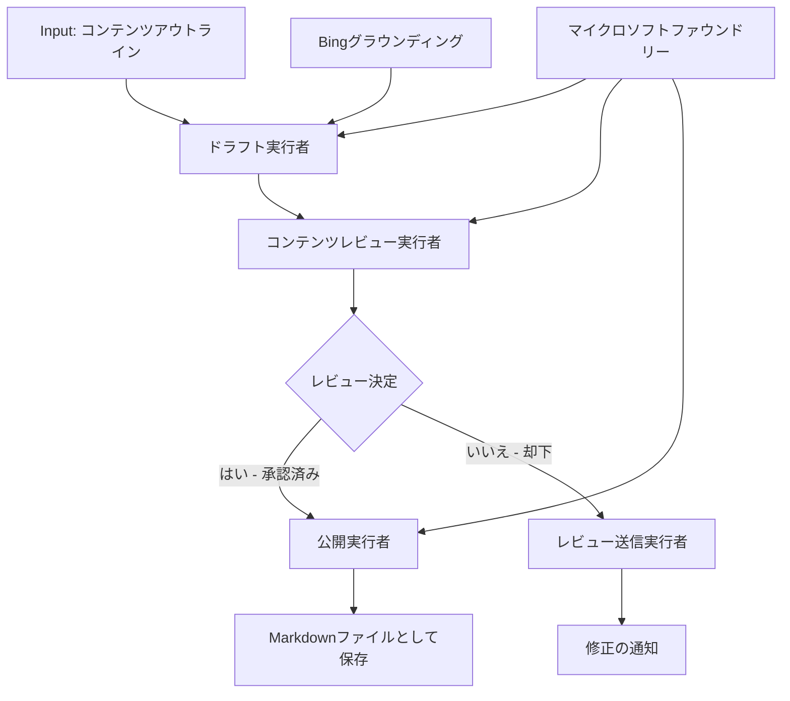

# 🔀 Microsoft Foundry (.NET) を用いた条件付きエージェントワークフロー

## 📋 インテリジェントな意思決定ベースのワークフローチュートリアル

このノートブックは Microsoft Foundry と Microsoft Agent Framework for .NET を使用した <strong>条件付きワークフローパターン</strong> を実演します。AI分析、ビジネスルール、動的条件に基づいてインテリジェントに処理をルーティングする、高度で意思決定駆動のワークフローを構築する方法を学べます。

## 🎯 学習目標

### 🧠 <strong>インテリジェントな意思決定アーキテクチャ</strong>
- <strong>条件付きロジックの実装</strong>: 複数の分岐点を持つ複雑な意思決定ツリーの構築
- **AI駆動のルーティング**: Microsoft Foundry モデルを使用したインテリジェントなルーティング判断
- <strong>動的ワークフロー適応</strong>: 実行時分析と条件に基づいたワークフロー動作の変更
- <strong>企業ルール統合</strong>: ワークフローにビジネスロジックとコンプライアンス要件を組み込む

### 🔀 <strong>高度な条件付きパターン</strong>
- <strong>多基準意思決定</strong>: ルーティング判断のために複数要因を評価
- <strong>コンテキスト対応処理</strong>: 蓄積されたワークフローコンテキストと履歴に基づく意思決定
- <strong>適応型ワークフロー変更</strong>: リアルタイム条件に基づく処理経路の動的調整
- <strong>ルールエンジン統合</strong>: 複雑なビジネスルールエンジンをワークフロー内に実装

### 🏢 <strong>企業向け条件付きアプリケーション</strong>
- <strong>ドキュメント分類とルーティング</strong>: 文書を自動で分類し適切なワークフローにルーティング
- <strong>カスタマーサービス振り分け</strong>: 顧客問い合わせを専門チームにインテリジェントにルーティング
- <strong>コンプライアンスとリスク処理</strong>: リスク評価に基づく異なる検証およびレビュー処理の適用
- <strong>品質保証ワークフロー</strong>: 品質指標に基づき内容を適切なレビュー処理にルート

## ⚙️ 前提条件とセットアップ

### 📦 **必要な NuGet パッケージ**

条件付きワークフロー処理のための高度なパッケージ:

```xml
<!-- Core AI Framework -->
<PackageReference Include="Microsoft.Extensions.AI" Version="9.9.0" />

<!-- Azure AI Agents with Persistent State -->
<PackageReference Include="Azure.AI.Agents.Persistent" Version="1.2.0-beta.5" />

<!-- Azure Identity and Utilities -->
<PackageReference Include="Azure.Identity" Version="1.15.0" />
<PackageReference Include="System.Linq.Async" Version="6.0.3" />
<PackageReference Include="DotNetEnv" Version="3.1.1" />

<!-- Local Workflow Framework References -->
<!-- Microsoft.Agents.Workflows.dll - Advanced workflow orchestration -->
<!-- Microsoft.Agents.AI.AzureAI.dll - Microsoft Foundry integration -->
<!-- Microsoft.Agents.AI.dll - Core agent abstractions -->
```

### 🔑 **Microsoft Foundry 設定**

**必要な Azure リソース:**
- 条件処理モデルを備えた Microsoft Foundry ワークスペース
- 適切なコンピュートクォータと権限を持つ Azure サブスクリプション
- 意思決定とコンテンツ分析用にデプロイされた AI モデル
- （任意）基盤機能のための Bing Search API 接続

**環境設定ファイル (.env):**
```env
# Microsoft Foundry Configuration
AZURE_AI_PROJECT_ENDPOINT=https://your-project.cognitiveservices.azure.com/
BING_CONNECTION_ID=your-bing-connection-id
```

**認証設定:**
```csharp
// Azure CLI or Managed Identity authentication
using Azure.Identity;
var credential = new AzureCliCredential();

// Load environment configuration
DotNetEnv.Env.Load("../../../.env");
```

### 🏗️ <strong>条件付きワークフローアーキテクチャ</strong>



**主な構成要素:**
- **Draft Executor**: アウトラインから初期ドラフトを作成する AI エージェント
- **Content Review Executor**: ドラフトの品質とコンプライアンスを評価する AI エージェント
- **Conditional Routing**: レビュー結果に基づいたルーティングの意思決定ロジック
- **Publish/Review Paths**: 承認済みと拒否されたコンテンツの処理経路を分ける
- **State Management**: ワークフロー全体でコンテンツとレビューコンテキストを維持

## 🎨 <strong>条件付きワークフローデザインパターン</strong>

### 📋 <strong>品質ゲートを備えたコンテンツ制作</strong>
```
Outline → Draft Creation → Quality Review → {Approve: Publish | Reject: Revise}
```

### 🎯 <strong>リスクベースのドキュメント処理</strong>
```
Document → Risk Assessment → {Low: Standard | High: Enhanced Review}
```

### 🔍 <strong>インテリジェントなカスタマーサービスルーティング</strong>
```
Customer Query → Analysis → {Simple: FAQ Bot | Complex: Human Agent}
```

### 💼 <strong>コンプライアンス駆動ワークフロー</strong>
```
Content → Compliance Check → {Pass: Publish | Fail: Legal Review}
```

## 🏢 <strong>企業向け条件付きメリット</strong>

### 🎯 <strong>インテリジェントオートメーション</strong>
- <strong>スマートな意思決定</strong>: コンテンツ分析と文脈に基づいた AI 駆動のルーティング判断
- <strong>適応型処理</strong>: 変化する条件に自動的に適応するワークフロー
- <strong>ビジネスルールの適用</strong>: 複雑なビジネスロジックとポリシーの自動適用
- <strong>コンテキスト対応ルーティング</strong>: ワークフロー履歴と蓄積されたコンテキストに基づく判断

### 📈 <strong>業務効率の向上</strong>
- <strong>最適化されたリソース配分</strong>: 最も適切な専門家やプロセスへの作業のルーティング
- <strong>人的介入の削減</strong>: 自動意思決定による人手によるルーティングの最小化
- <strong>迅速な問題解決</strong>: 適切な専門知識と処理能力への直接ルーティング
- <strong>一貫した適用</strong>: ビジネスルールと判断基準の均一適用

### 🛡️ <strong>リスク管理とコンプライアンス</strong>
- <strong>自動リスク評価</strong>: コンテンツと状況のリスクレベルを AI で評価
- <strong>コンプライアンスの適用</strong>: 必須の規制プロセスを自動ルーティング
- <strong>セキュリティプロトコル適用</strong>: リスク評価に基づく強化されたセキュリティ対策
- <strong>監査トレイルの維持</strong>: ルーティング決定と理由の完全な記録

### 📊 <strong>分析と継続的改善</strong>
- <strong>意思決定分析</strong>: ルーティング判断の効果と正確性を追跡
- <strong>パターン認識</strong>: 時間経過におけるルーティング判断の傾向とパターンを特定
- <strong>パフォーマンス最適化</strong>: 判断基準とルーティング効率の継続的改善
- <strong>ビジネスインテリジェンス</strong>: コンテンツ特性と処理要件の洞察

### 🔧 <strong>技術的卓越性</strong>
- <strong>永続的状態管理</strong>: ワークフロー実行全体で複雑な状態を維持
- <strong>スケーラブルなアーキテクチャ</strong>: 大量の条件処理要求に対応
- <strong>統合能力</strong>: 既存のビジネスシステムやプロセスとのシームレスな統合
- <strong>監視と可観測性</strong>: ワークフローのパフォーマンスと判断の包括的追跡

.NET でインテリジェントな意思決定駆動の企業ワークフローを構築しましょう！🚀

## 💻 コードの実行

完全な実装は `04.dotnet-agent-framework-workflow-aifoundry-condition.cs` にあります。これは <strong>品質ゲートを備えたコンテンツ制作ワークフロー</strong> を示しています:

### 🏗️ <strong>ワークフローアーキテクチャ</strong>

```
Content Outline → Draft Creation → Quality Review → Conditional Routing:
                                                      ├─ Approved (>200 words) → Publish
                                                      └─ Rejected (<200 words) → Review Notification
```

**ワークフロー内のエージェント:**
1. **Evangelist Agent**: Bing グラウンディングを用いてアウトラインからチュートリアルドラフトを作成
2. **Content Reviewer Agent**: ドラフトの品質（単語数、完成度）を評価
3. **Publisher Agent**: 承認されたコンテンツをタイムスタンプ付き Markdown ファイルとして保存

**カスタムエグゼキューター:**
1. **DraftExecutor**: ドラフト作成をオーケストレーション
2. **ContentReviewExecutor**: 品質評価を実施
3. **PublishExecutor**: 承認されたコンテンツの公開を担当
4. **SendReviewExecutor**: 拒否されたコンテンツの通知を管理

### 🚀 実例の実行

**前提条件:**
- Microsoft Foundry ワークスペース設定済み
- Azure CLI 認証 (`az login`)
- （任意）グラウンディング用 Bing Search 接続

```bash
# スクリプトを実行可能にする（Unix/Linux/macOS）
chmod +x 04.dotnet-agent-framework-workflow-aifoundry-condition.cs

# 条件付きワークフローを実行する
./04.dotnet-agent-framework-workflow-aifoundry-condition.cs
```

Windows なら:
```powershell
dotnet run 04.dotnet-agent-framework-workflow-aifoundry-condition.cs
```

### 📝 期待される出力

ワークフローは以下を行います:
1. <strong>エージェントの作成</strong>: 3つの専門 Microsoft Foundry エージェントを初期化
2. <strong>ドラフト生成</strong>: Evangelist エージェントがアウトラインからチュートリアルドラフトを作成
3. <strong>コンテンツレビュー</strong>: Content Reviewer がドラフト品質を評価
4. <strong>条件付きルーティング</strong>:
   - **承認（200単語以上）時**: Publish Executor が Markdown ファイルとして保存
   - **拒否（200単語未満）時**: レビュー通知を送信
5. <strong>結果表示</strong>: 最終ワークフロー結果を表示

### 🔧 カスタマイズオプション

**レビュー基準の変更:**
```csharp
const string ContentReviewerInstructions = @"
You are a content reviewer...
1. Check if content is more than 500 words (instead of 200)
2. Verify technical accuracy
3. Ensure proper formatting
...";
```

**条件経路の追加:**
```csharp
var workflow = new WorkflowBuilder(draftExecutor)
    .AddEdge(draftExecutor, contentReviewerExecutor)
    .AddEdge(contentReviewerExecutor, publishExecutor, condition: GetCondition("Excellent"))
    .AddEdge(contentReviewerExecutor, editExecutor, condition: GetCondition("Good"))
    .AddEdge(contentReviewerExecutor, sendReviewerExecutor, condition: GetCondition("Poor"))
    .Build();
```

**コンテンツ要件の変更:**
```csharp
string OUTLINE_Content = @"
# Your Custom Topic
## Section 1
https://your-reference-url
## Section 2
...
";
```

### 🎯 実世界の活用例

この条件付きワークフローパターンは以下に最適です:
- <strong>コンテンツ管理システム</strong>: 品質ゲート付きの自動編集ワークフロー
- <strong>ドキュメント処理</strong>: 分類とコンプライアンスに基づく文書ルーティング
- <strong>カスタマーサポート</strong>: 複雑さと緊急度に基づくインテリジェントチケットルーティング
- <strong>法務レビュー</strong>: リスク評価と価値に基づく契約ルーティング
- <strong>人事プロセス</strong>: 適切な選考ワークフローへの応募者ルーティング

### 🔍 条件付きロジックの理解

**条件関数:**
```csharp
public Func<object?, bool> GetCondition(string expectedResult) =>
    reviewResult => reviewResult is ReviewResult review && review.Result == expectedResult;
```

この関数は述語を生成します:
1. 結果が `ReviewResult` 型かを確認
2. `Result` プロパティを期待値と比較
3. ルーティングを決定するために真偽値を返す

**条件付きのワークフローエッジ:**
```csharp
.AddEdge(contentReviewerExecutor, publishExecutor, condition: GetCondition("Yes"))
.AddEdge(contentReviewerExecutor, sendReviewerExecutor, condition: GetCondition("No"))
```

### 📊 高度な機能

**JSON スキーマ検証:**
ワークフローは構造化された応答を保証するため JSON スキーマを使用:

```csharp
// Define response structure
public class ReviewResult
{
    [JsonPropertyName("review_result")]
    public string Result { get; set; } = string.Empty;
    
    [JsonPropertyName("reason")]
    public string Reason { get; set; } = string.Empty;
    
    [JsonPropertyName("draft_content")]
    public string DraftContent { get; set; } = string.Empty;
}

// Apply to agent
ResponseFormat = ChatResponseFormat.ForJsonSchema(
    AIJsonUtilities.CreateJsonSchema(typeof(ReviewResult)), 
    "ReviewResult", 
    "Review Result From DraftContent"
)
```

**Bing グラウンディング統合:**
Evangelist エージェントはリアルタイム情報アクセスのため Bing グラウンディングを使用:

```csharp
var bingGroundingConfig = new BingGroundingSearchConfiguration(bing_conn_id);
BingGroundingToolDefinition bingGroundingTool = new(
    new BingGroundingSearchToolParameters([bingGroundingConfig])
);
```

これによりエージェントはアウトラインの URL をたどり最新情報を抽出可能。

### 🛡️ エラー処理

ワークフローは拒否されたコンテンツに対し堅牢なエラー処理を含む:
- レビューフェイル時には代替経路へ
- 通知に拒否理由を明確に提供
- コンテンツは改訂のため保持

### 🔄 ワークフローの拡張

**改訂ループの追加:**
コンテンツを自動で再作成するフィードバックループを作成:

```csharp
.AddEdge(contentReviewerExecutor, publishExecutor, condition: GetCondition("Yes"))
.AddEdge(contentReviewerExecutor, draftExecutor, condition: GetCondition("No")) // Loop back
```

**多段階レビューの実装:**
異なる基準を持つ複数のレビュー段階を追加:

```csharp
.AddEdge(draftExecutor, technicalReviewer)
.AddEdge(technicalReviewer, editorialReviewer, condition: GetCondition("TechPass"))
.AddEdge(editorialReviewer, publishExecutor, condition: GetCondition("EditPass"))
```

この条件付きワークフローパターンは高度でインテリジェントな企業向け自動化システム構築の基盤を提供します！🚀

---

<!-- CO-OP TRANSLATOR DISCLAIMER START -->
**免責事項**：
本書類は AI 翻訳サービス [Co-op Translator](https://github.com/Azure/co-op-translator) を使用して翻訳されています。正確性を期していますが、自動翻訳には誤りや不正確な部分が含まれる可能性があることをご承知おきください。原文の原語版が正式な情報源とみなされるべきです。重要な情報については、専門の人間による翻訳を推奨します。本翻訳の利用により生じたいかなる誤解や解釈違いについても、当方は責任を負いかねます。
<!-- CO-OP TRANSLATOR DISCLAIMER END -->