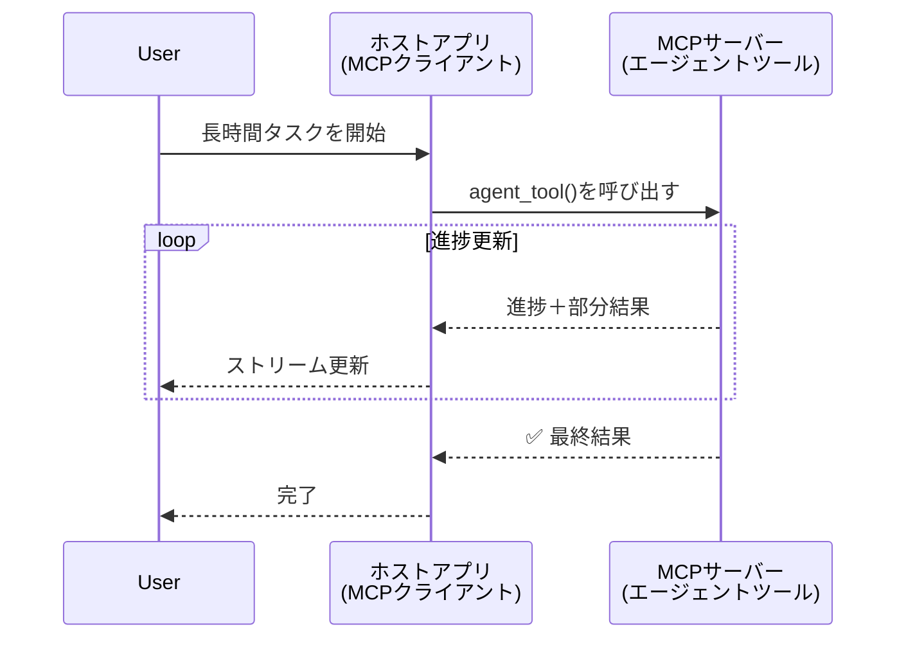
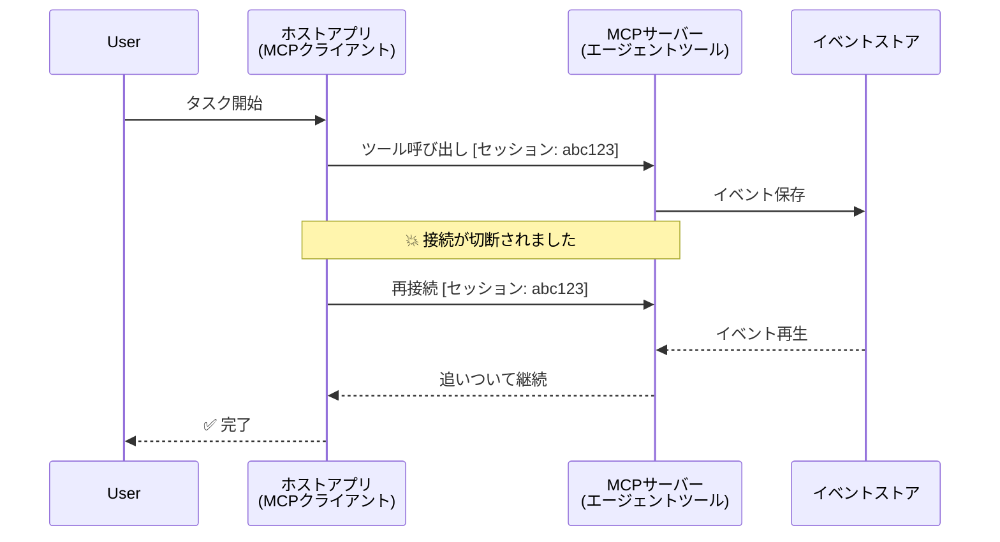
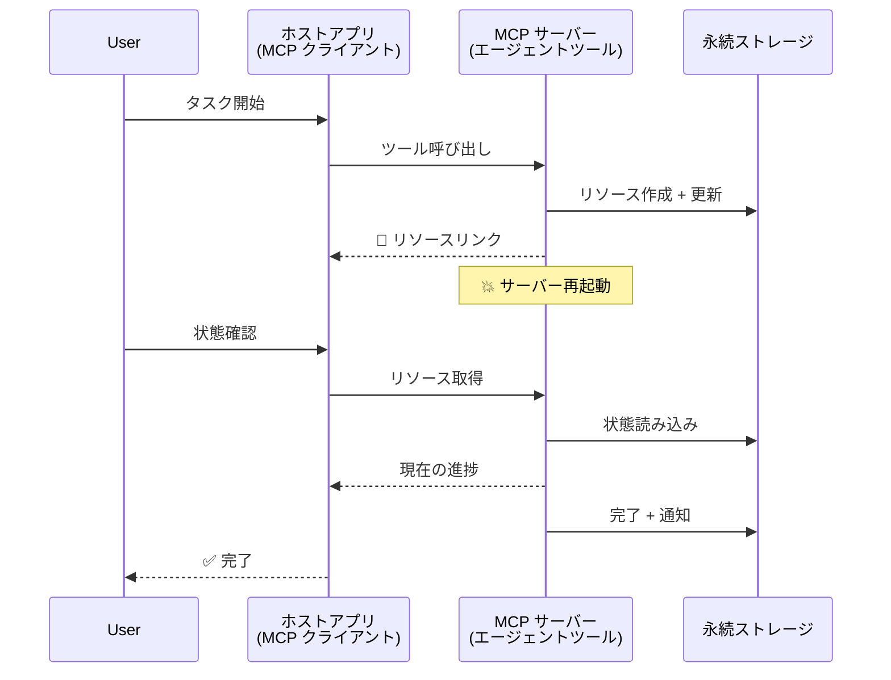
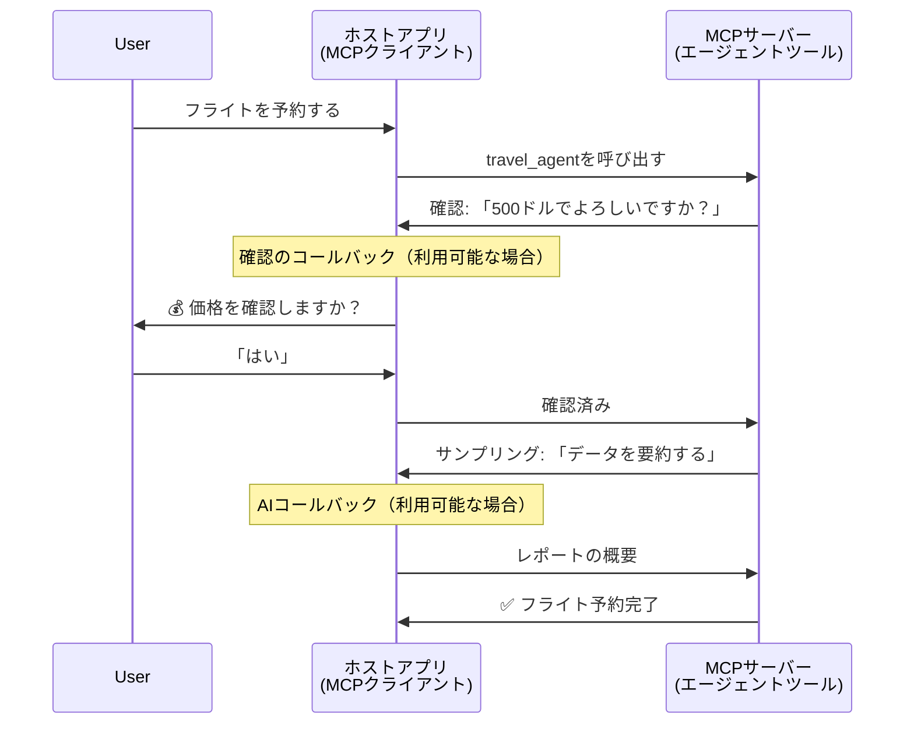
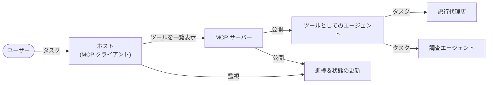

# MCPを使ったエージェント間通信システムの構築

> 要約 - MCPでAgent2Agent通信を構築できますか？はい、可能です！

MCPは「LLMにコンテキストを提供する」という元の目的を大きく超えて進化しました。最近の改良点には、[再開可能なストリーム](https://modelcontextprotocol.io/docs/concepts/transports#resumability-and-redelivery)、[エリシテーション](https://modelcontextprotocol.io/specification/2025-06-18/client/elicitation)、[サンプリング](https://modelcontextprotocol.io/specification/2025-06-18/client/sampling)、および通知（[進捗](https://modelcontextprotocol.io/specification/2025-06-18/basic/utilities/progress)と[リソース](https://modelcontextprotocol.io/specification/2025-06-18/schema#resourceupdatednotification)）が含まれており、複雑なエージェント間通信システムを構築するための強力な基盤を提供しています。

## エージェント／ツールに関する誤解

エージェント的な振る舞い（長時間の実行、実行中に追加の入力が必要になることがある等）を持つツールを探求する開発者が増える中で、MCPは初期のツール例が単純なリクエスト・レスポンスパターンに偏っていたために不適切だという誤解が広まりました。

この認識は時代遅れです。MCP仕様はここ数か月で大幅に拡張され、長時間実行するエージェント的振る舞いを実現するためのギャップを埋めています：

- **ストリーミング & 部分結果**：実行中のリアルタイム進捗更新
- <strong>再開可能性</strong>：クライアントの再接続と中断後の継続が可能
- <strong>耐久性</strong>：結果はサーバ再起動後も保持（リソースリンク経由など）
- <strong>マルチターン</strong>：エリシテーションやサンプリングを使った実行中の対話的入力

これらの機能を組み合わせることで複雑なエージェント的およびマルチエージェントアプリケーションの構築が可能であり、すべてMCPプロトコル上で展開されます。

参照として、本稿ではエージェントをMCPサーバー上に存在する「ツール」と呼びます。これは、MCPクライアントを実装し、MCPサーバーとのセッションを確立してエージェントを呼び出せるホストアプリケーションが存在することを意味します。

## MCPツールが「エージェント的」であるとは？

実装に入る前に、長時間稼働するエージェントをサポートするために必要なインフラ機能を整理しましょう。

> 我々はエージェントを、複数回のやり取りやリアルタイムフィードバックに基づく調整を必要とする複雑なタスクを、長期間にわたって自律的に実行できる実体と定義します。

### 1. ストリーミング & 部分結果

従来のリクエスト・レスポンスパターンは長時間タスクには不適切です。エージェントは以下を提供する必要があります：

- 実行中のリアルタイム進捗更新
- 中間結果

**MCP対応**：リソース更新通知により部分結果をストリーム可能ですが、JSON-RPCの1対1のリクエスト/レスポンスモデルとの競合を避けるために注意深い設計が必要です。

| 機能                       | 利用例                                                                                                                                                                      | MCP対応                                                                                  |
| -------------------------- | --------------------------------------------------------------------------------------------------------------------------------------------------------------------------- | ---------------------------------------------------------------------------------------- |
| リアルタイム進捗更新       | ユーザーはコードベース移行タスクを依頼。エージェントは進捗をストリーミング：「10% - 依存関係分析中... 25% - TypeScriptファイル変換中... 50% - インポート更新中...」 | ✅ 進捗通知                                                                                |
| 部分結果                   | 「本を生成する」タスクで部分結果を逐次通知、例：1) ストーリーアーク概要、2) 章一覧、3) 章ごとの完成。ホストは途中で検査・キャンセル・リダイレクト可。                     | ✅ 通知を「拡張」して部分結果を含めることが可能（PR 383, 776に提案あり）                    |

<div align="center" style="font-style: italic; font-size: 0.95em; margin-bottom: 0.5em;">
<strong>図1：</strong> この図はMCPエージェントが長時間タスク中にホストアプリにリアルタイムの進捗更新と部分結果をストリームし、ユーザーがリアルタイムで実行状況を監視できる様子を示しています。
</div>



### 2. 再開可能性

エージェントはネットワーク障害に対応しなければなりません：

- （クライアント）切断後の再接続
- 中断した地点からの継続（メッセージの再配信）

**MCP対応**：MCPのStreamableHTTPトランスポートは、セッションIDや最後のイベントIDでのセッション再開とメッセージ再配信をサポートしています。重要なのは、サーバーがクライアント再接続時のイベント再生を可能にするイベントストアを実装する必要がある点です。  
コミュニティ提案（PR #975）ではトランスポート非依存の再開可能なストリームの可能性が探られています。

| 機能         | 利用例                                                                                                                                                | MCP対応                                                                |
| ------------ | ----------------------------------------------------------------------------------------------------------------------------------------------------- | ---------------------------------------------------------------------- |
| 再開可能性   | クライアントが長時間タスク中に切断。再接続時に未受信のイベントを再生し、中断地点からシームレスに継続。                                               | ✅ StreamableHTTPトランスポート（セッションID、イベント再生、イベントストア） |

<div align="center" style="font-style: italic; font-size: 0.95em; margin-bottom: 0.5em;">
<strong>図2：</strong> この図はMCPのStreamableHTTPトランスポートとイベントストアがどのようにシームレスなセッション再開を可能にし、クライアントが切断後に再接続して未受信イベントを再生し、進捗を失うことなくタスクを続けられるかを示しています。
</div>



### 3. 耐久性

長時間実行するエージェントは永続的な状態管理が必要です：

- サーバ再起動後も結果が保持される
- 状態はアウトオブバンドで取得可能
- セッションをまたいだ進捗追跡

**MCP対応**：MCPはツール呼び出しのためのリソースリンク返却型をサポートしています。一般的なパターンとしては、ツールがリソースを作成し、即座にリソースリンクを返します。ツールはバックグラウンドで処理を継続し、リソースを更新します。クライアントはこのリソースの状態をポーリングして部分結果や完全な結果を取得（サーバ提供内容に依存）したり、更新通知のサブスクライブが可能です。

ただし、リソースのポーリングや更新サブスクライブはスケールするとリソース消費につながるため課題があります。コミュニティではサーバがクライアント／ホストアプリに更新を通知できるWebhookやトリガーの導入を検討する提案（#992含む）があります。

| 機能       | 利用例                                                                                                                                    | MCP対応                                                        |
| ---------- | ----------------------------------------------------------------------------------------------------------------------------------------- | -------------------------------------------------------------- |
| 耐久性     | データ移行タスク中にサーバ障害発生。結果や進捗は再起動後も保持され、クライアントは状態を確認して永続リソースから処理を継続可能。         | ✅ 永続ストレージと状態通知を備えたリソースリンク              |

一般的なパターンとしては、ツールがリソースを作成し、即座にリソースリンクを返します。ツールはバックグラウンドでタスクを処理し、進捗更新や部分結果を含むリソース通知を発行、必要に応じてリソース内容を更新します。

<div align="center" style="font-style: italic; font-size: 0.95em; margin-bottom: 0.5em;">
<strong>図3：</strong> この図はMCPエージェントが永続リソースと状態通知を利用してサーバ再起動時も長時間タスクを継続できる様子を示しており、クライアントは進捗を確認し失敗後も結果を取得できます。
</div>



### 4. マルチターンインタラクション

エージェントは実行中に追加の入力が必要となることがあります：

- 人間による確認や承認
- 複雑な判断に対するAI支援
- 動的なパラメーター調整

**MCP対応**：サンプリング（AI入力向け）とエリシテーション（人間入力向け）で完全にサポートされています。

| 機能                     | 利用例                                                                                                                                        | MCP対応                                               |
| ----------------------- | --------------------------------------------------------------------------------------------------------------------------------------------- | ----------------------------------------------------- |
| マルチターンインタラクション | 旅行予約エージェントがユーザーに価格確認を要求し、その後AIに旅行データの要約を依頼して予約処理を完了するシナリオ。                     | ✅ 人間入力にエリシテーション、AI入力にサンプリングを利用  |

<div align="center" style="font-style: italic; font-size: 0.95em; margin-bottom: 0.5em;">
<strong>図4：</strong> この図はMCPエージェントが実行中に人間の入力を対話的に引き出したり、AI支援を要求したりできる様子を示し、確認や動的判断といった複雑なマルチターンワークフローを支援します。
</div>



## MCPで長時間エージェントを実装する - コード概要

本記事の一環として、MCP Python SDKを使用し、StreamableHTTPトランスポートによるセッション再開とメッセージ再配信機能を備えた長時間エージェントの完全実装を含む[コードリポジトリ](https://github.com/victordibia/ai-tutorials/tree/main/MCP%20Agents)を提供します。実装はMCPの機能が複雑なエージェント的振る舞いの構成に活用できることを示しています。

特に、2つの主要なエージェントツールを備えたサーバを実装しています：

- <strong>旅行代理エージェント</strong> - エリシテーションによる価格確認を伴う旅行予約サービスをシミュレート
- <strong>調査エージェント</strong> - サンプリングによるAI支援要約付き調査タスクを実行

両エージェントはリアルタイム進捗更新、インタラクティブ確認、完全なセッション再開機能をデモしています。

### 主要な実装の概念

以下のセクションでは、それぞれの機能についてサーバ側のエージェント実装とクライアント側のホスト処理を示します：

#### ストリーミング & 進捗更新 - タスク状態のリアルタイム表示

ストリーミングにより、エージェントは長時間タスク中にリアルタイムの進捗更新を提供し、ユーザーに状態と中間結果を通知します。

**サーバ実装（エージェントが進捗通知を送信）：**

```python
# server/server.py から - 進行状況を送信する旅行代理店
for i, step in enumerate(steps):
    await ctx.session.send_progress_notification(
        progress_token=ctx.request_id,
        progress=i * 25,
        total=100,
        message=step,
        related_request_id=str(ctx.request_id)
    )
    await anyio.sleep(2)  # 作業をシミュレートする

# 代替案: 詳細なステップごとの更新のためのログメッセージ
await ctx.session.send_log_message(
    level="info",
    data=f"Processing step {current_step}/{steps} ({progress_percent}%)",
    logger="long_running_agent",
    related_request_id=ctx.request_id,
)
```

**クライアント実装（ホストが進捗更新を受信）：**

```python
# client/client.py から - クライアントがリアルタイム通知を処理
async def message_handler(message) -> None:
    if isinstance(message, types.ServerNotification):
        if isinstance(message.root, types.LoggingMessageNotification):
            console.print(f"📡 [dim]{message.root.params.data}[/dim]")
        elif isinstance(message.root, types.ProgressNotification):
            progress = message.root.params
            console.print(f"🔄 [yellow]{progress.message} ({progress.progress}/{progress.total})[/yellow]")

# セッション作成時にメッセージハンドラを登録する
async with ClientSession(
    read_stream, write_stream,
    message_handler=message_handler
) as session:
```

#### エリシテーション - ユーザー入力の要求

エリシテーションはエージェントが実行途中でユーザー入力を要求できる機能です。これは長時間タスク中の確認や承認などに不可欠です。

**サーバ実装（エージェントが確認を要求）：**

```python
# サーバー/server.py から - 旅行代理店による価格確認のリクエスト
elicit_result = await ctx.session.elicit(
    message=f"Please confirm the estimated price of $1200 for your trip to {destination}",
    requestedSchema=PriceConfirmationSchema.model_json_schema(),
    related_request_id=ctx.request_id,
)

if elicit_result and elicit_result.action == "accept":
    # 予約を続ける
    logger.info(f"User confirmed price: {elicit_result.content}")
elif elicit_result and elicit_result.action == "decline":
    # 予約をキャンセルする
    booking_cancelled = True
```

**クライアント実装（ホストがエリシテーションコールバックを提供）：**

```python
# client/client.py から - エリシテーション要求を処理するクライアント
async def elicitation_callback(context, params):
    console.print(f"💬 Server is asking for confirmation:")
    console.print(f"   {params.message}")

    response = console.input("Do you accept? (y/n): ").strip().lower()

    if response in ['y', 'yes']:
        return types.ElicitResult(
            action="accept",
            content={"confirm": True, "notes": "Confirmed by user"}
        )
    else:
        return types.ElicitResult(
            action="decline",
            content={"confirm": False, "notes": "Declined by user"}
        )

# セッション作成時にコールバックを登録する
async with ClientSession(
    read_stream, write_stream,
    elicitation_callback=elicitation_callback
) as session:
```

#### サンプリング - AI支援の要求

サンプリングはエージェントが実行中に複雑な判断やコンテンツ生成のためLLMの支援を求めることを可能にし、人間とAIのハイブリッドワークフローを実現します。

**サーバ実装（エージェントがAI支援を要求）：**

```python
# サーバー/server.py から - 研究エージェントがAIの要約をリクエストしています
sampling_result = await ctx.session.create_message(
    messages=[
        SamplingMessage(
            role="user",
            content=TextContent(type="text", text=f"Please summarize the key findings for research on: {topic}")
        )
    ],
    max_tokens=100,
    related_request_id=ctx.request_id,
)

if sampling_result and sampling_result.content:
    if sampling_result.content.type == "text":
        sampling_summary = sampling_result.content.text
        logger.info(f"Received sampling summary: {sampling_summary}")
```

**クライアント実装（ホストがサンプリングコールバックを提供）：**

```python
# client/client.py から - クライアントのサンプリングリクエスト処理
async def sampling_callback(context, params):
    message_text = params.messages[0].content.text if params.messages else 'No message'
    console.print(f"🧠 Server requested sampling: {message_text}")

    # 実際のアプリケーションでは、これはLLM APIを呼び出すことができます
    # デモ目的で、モックレスポンスを提供します
    mock_response = "Based on current research, MCP has evolved significantly..."

    return types.CreateMessageResult(
        role="assistant",
        content=types.TextContent(type="text", text=mock_response),
        model="interactive-client",
        stopReason="endTurn"
    )

# セッション作成時にコールバックを登録します
async with ClientSession(
    read_stream, write_stream,
    sampling_callback=sampling_callback,
    elicitation_callback=elicitation_callback
) as session:
```

#### 再開可能性 - 切断をまたいだセッション継続

再開可能性は長時間エージェントタスクがクライアントの切断に耐え、再接続時にシームレスに継続されることを保証します。イベントストアと再開トークンで実装されています。

**イベントストア実装（サーバがセッション状態を保持）：**

```python
# server/event_store.py から - シンプルなメモリ内イベントストア
class SimpleEventStore(EventStore):
    def __init__(self):
        self._events: list[tuple[StreamId, EventId, JSONRPCMessage]] = []
        self._event_id_counter = 0

    async def store_event(self, stream_id: StreamId, message: JSONRPCMessage) -> EventId:
        """Store an event and return its ID."""
        self._event_id_counter += 1
        event_id = str(self._event_id_counter)
        self._events.append((stream_id, event_id, message))
        return event_id

    async def replay_events_after(self, last_event_id: EventId, send_callback: EventCallback) -> StreamId | None:
        """Replay events after the specified ID for resumption."""
        # 最後に知られているイベント以降のイベントを見つけて再生する
        for _, event_id, message in self._events[start_index:]:
            await send_callback(EventMessage(message, event_id))

# server/server.py から - イベントストアをセッションマネージャに渡す
def create_server_app(event_store: Optional[EventStore] = None) -> Starlette:
    server = ResumableServer()

    # 再開用にイベントストア付きのセッションマネージャを作成する
    session_manager = StreamableHTTPSessionManager(
        app=server,
        event_store=event_store,  # イベントストアはセッションの再開を可能にする
        json_response=False,
        security_settings=security_settings,
    )

    return Starlette(routes=[Mount("/mcp", app=session_manager.handle_request)])

# 使用法: イベントストアで初期化する
event_store = SimpleEventStore()
app = create_server_app(event_store)
```

**再開トークンを使ったクライアントメタデータ（クライアントが保存状態で再接続）：**

```python
# クライアント/client.py から - メタデータを使用したクライアント再開
if existing_tokens and existing_tokens.get("resumption_token"):
    # 既存の再開トークンを使用して中断したところから続行する
    metadata = ClientMessageMetadata(
        resumption_token=existing_tokens["resumption_token"],
    )
else:
    # 受信時に再開トークンを保存するコールバックを作成する
    def enhanced_callback(token: str):
        protocol_version = getattr(session, 'protocol_version', None)
        token_manager.save_tokens(session_id, token, protocol_version, command, args)

    metadata = ClientMessageMetadata(
        on_resumption_token_update=enhanced_callback,
    )

# 再開メタデータを付けてリクエストを送信する
result = await session.send_request(
    types.ClientRequest(
        types.CallToolRequest(
            method="tools/call",
            params=types.CallToolRequestParams(name=command, arguments=args)
        )
    ),
    types.CallToolResult,
    metadata=metadata,
)
```

ホストアプリケーションはセッションIDと再開トークンをローカルに保持し、進捗や状態を失わずに既存のセッションに再接続できます。

### コード構成

<div align="center" style="font-style: italic; font-size: 0.95em; margin-bottom: 0.5em;">
<strong>図5：</strong> MCPベースのエージェントシステムアーキテクチャ
</div>



**主要ファイル：**

- **`server/server.py`** - エリシテーション、サンプリング、進捗更新を示す旅行＆調査エージェントを備えた再開可能なMCPサーバー
- **`client/client.py`** - 再開機能、コールバックハンドラ、トークン管理を備えたインタラクティブホストアプリケーション
- **`server/event_store.py`** - セッション再開とメッセージ再配信を可能にするイベントストア実装

## MCPでのマルチエージェント通信への拡張

上記の実装はホストアプリの知能と範囲を拡張することでマルチエージェントシステムに拡張可能です：

- <strong>インテリジェントなタスク分解</strong>：ホストが複雑なユーザー要求を分析し、専門エージェント向けにサブタスクに分割
- <strong>マルチサーバ調整</strong>：多様なエージェント機能を提供する複数のMCPサーバと接続を維持
- <strong>タスク状態管理</strong>：複数同時エージェントタスクの進捗を追跡し、依存関係や順序を管理
- **レジリエンス＆リトライ**：障害を管理し、再試行ロジックを実装、エージェントが利用できない場合にタスクを再ルーティング
- <strong>結果統合</strong>：複数エージェントの出力を統合して一貫した最終結果を生成

ホストは単純なクライアントから、分散エージェント機能を調整する知的オーケストレーターへと進化し、MCPプロトコルの基盤を共用し続けます。

## 結論

MCPの強化された機能 - リソース通知、エリシテーション／サンプリング、再開可能なストリーム、永続リソース - は複雑なエージェント間インタラクションを可能にしながらプロトコルの単純さを維持します。

## 始めるには

自分のagent2agentシステムを構築したいですか？以下の手順に従ってください：

### 1. デモを実行

```bash
# 再開のためにイベントストアを使用してサーバーを起動します
python -m server.server --port 8006

# 別のターミナルでインタラクティブクライアントを実行します
python -m client.client --url http://127.0.0.1:8006/mcp
```

**インタラクティブモードで利用可能なコマンド：**

- `travel_agent` - エリシテーションによる価格確認付き旅行予約
- `research_agent` - サンプリングによるAI支援要約付き調査
- `list` - 利用可能なツールを表示
- `clean-tokens` - 再開トークンをクリア
- `help` - 詳細なコマンドヘルプを表示
- `quit` - クライアントを終了

### 2. 再開機能をテスト

- 長時間エージェントを開始（例： `travel_agent`）
- 実行中にクライアントを中断（Ctrl+C）
- クライアントを再起動すると中断箇所から自動的に再開

### 3. 探索と拡張

- <strong>例を探る</strong>: この[mcp-agents](https://github.com/victordibia/ai-tutorials/tree/main/MCP%20Agents)をチェック
- <strong>コミュニティに参加</strong>: GitHubのMCPディスカッションに参加
- <strong>実験</strong>: シンプルな長時間タスクから始めて、ストリーミング、再開可能性、マルチエージェント調整を徐々に追加

これにより、MCPがツールベースのシンプルさを保ちつつインテリジェントなエージェント的振る舞いを可能にする様子が示されます。

全体として、MCPプロトコル仕様は急速に進化しています。読者は最新情報のために公式ドキュメントサイトhttps://modelcontextprotocol.io/introductionを参照することを推奨します。

---

<!-- CO-OP TRANSLATOR DISCLAIMER START -->
**免責事項**：
本書類は AI 翻訳サービス [Co-op Translator](https://github.com/Azure/co-op-translator) を使用して翻訳されています。正確性を期していますが、自動翻訳には誤りや不正確な部分が含まれる可能性があることをご承知おきください。原文の原語版が正式な情報源とみなされるべきです。重要な情報については、専門の人間による翻訳を推奨します。本翻訳の利用により生じたいかなる誤解や解釈違いについても、当方は責任を負いかねます。
<!-- CO-OP TRANSLATOR DISCLAIMER END -->