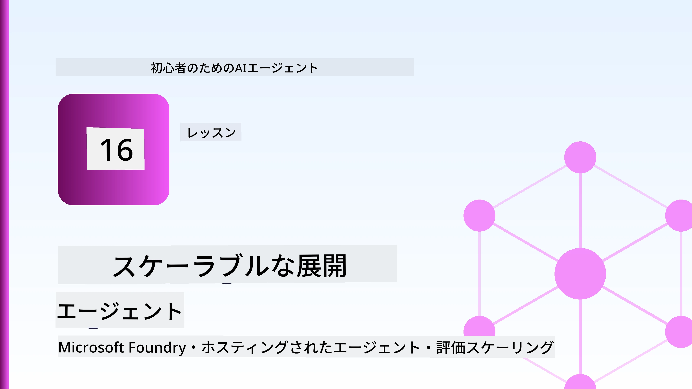
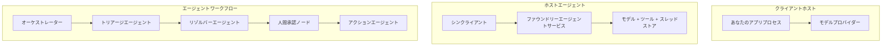
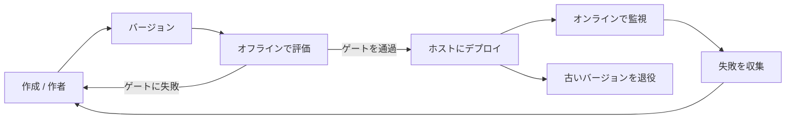
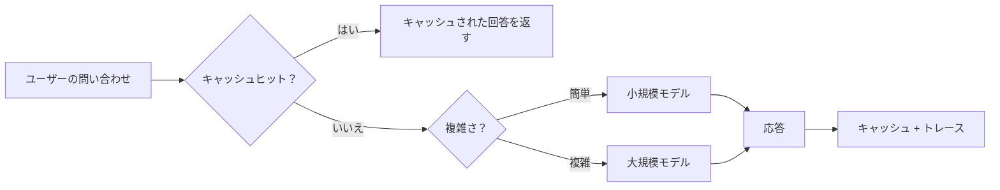
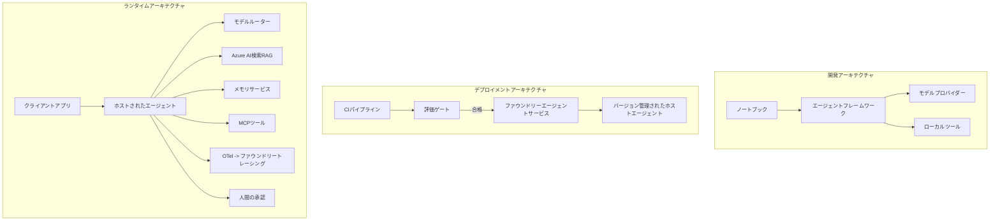

# Microsoft Foundryでスケーラブルなエージェントをデプロイする



このコースのここまでで、ラップトップ上やノートブック内で実行される、`az login` といくつかの環境変数で制御されるエージェントを構築しました。それは学習するにはまさに正しい方法です。しかし、数千人の顧客が3時に依存するエージェントを運用するには適切な方法ではありません。

このレッスンは、「自分のマシンでは動く」から「本番で信頼性高く、経済的に動く」までのギャップについてです。そのギャップを埋めるために、**Microsoft Foundry** と **Microsoft Foundry Agent Service** を使い、ツール、リトリーバル、メモリ、評価、監視を備えた実際のカスタマーサポートエージェントを構築します。

## はじめに

このレッスンで扱う内容は以下の通りです：

- <strong>プロトタイプエージェント</strong>と<strong>デプロイされたエージェント</strong>の違い、そして移行が主にモデルの<em>周囲</em>すべてに関わる理由。
- エージェントの<strong>デプロイパターン</strong>：クライアントホスト型、サービスホスト型（Hosted Agents）、ワークフローオーケストレーション型。
- **Microsoft Foundry上のエージェントライフサイクル** — 作成、バージョン管理、デプロイ、評価、観察、廃止。
- <strong>スケーリング戦略</strong>：モデルルーティング、キャッシング、同時実行、ステートレス設計。
- OpenTelemetryとFoundryトレーシングによる<strong>可観測性</strong>。
- モデル選択、ルーティング、評価ゲートによる<strong>コスト最適化</strong>。
- <strong>企業向け考慮事項</strong>：ガバナンス、ヒューマン・イン・ザ・ループ、MCPサーバの安全な本番運用。

## 学習目標

このレッスンを終えると、以下ができるようになります：

- エージェントのワークロードに対して適切なデプロイパターンを選択する。
- Microsoft Foundry Agent Serviceにエージェントをデプロイし、バージョン管理、ガバナンス、可観測性を確保する。
- トレーシング用の計測を行い、リリース前に毎回実行される評価パイプラインを接続する。
- モデルルーティングとキャッシングを適用して、大規模スケール時も遅延とコストを管理する。
- ハイリスクアクションに対する人間の承認ゲートを導入し、MCPサーバを本番環境で安全に統合する。

## 前提条件

このレッスンは、以前のレッスンを完了し以下に習熟していることを前提としています：

- [Microsoft Agent Framework](../14-microsoft-agent-framework/README.md)でのエージェント構築（レッスン14）。
- [ツール利用](../04-tool-use/README.md)（レッスン4）と[Agentic RAG](../05-agentic-rag/README.md)（レッスン5）。
- [Agent Memory](../13-agent-memory/README.md)（レッスン13）および[Agentic Protocols / MCP](../11-agentic-protocols/README.md)（レッスン11）。
- [可観測性と評価](../10-ai-agents-production/README.md)（レッスン10）— このレッスンはここに直接基づいています。

また以下が必要です：

- 1つ以上のチャットモデルをデプロイ済みの<strong>Azureサブスクリプション</strong>および<strong>Microsoft Foundryプロジェクト</strong>。
- 認証済みの<strong>Azure CLI</strong> (`az login`)。
- Python 3.12+ とリポジトリにあるパッケージ [`requirements.txt`](../../../requirements.txt)。

## プロトタイプから本番へ：何が実際に変わるか

プロトタイプエージェントと本番エージェントは同じコアループを共有します — 推論、ツール呼び出し、応答。しかし変更されるのはそのループを取り囲むすべてです。モデルは本番エージェントの約20％であり、残りの80％が運用の骨格です。

| 関心事 | プロトタイプ | 本番 |
| --- | --- | --- |
| <strong>ホスティング</strong> | ノートブック内で実行 | ホストされたサービスとして実行、バージョン管理とロールアウトあり |
| <strong>アイデンティティ</strong> | あなたの `az login` トークン | スコープ付きRBACのマネージドアイデンティティ |
| <strong>状態管理</strong> | メモリ内で再起動で失われる | 外部化（スレッドストア、メモリサービス） |
| <strong>障害対応</strong> | トレースバック表示 | リトライ、フォールバック、デッドレター、アラート |
| <strong>コスト</strong> | 「数セント」 | リクエストごとに追跡、ルーティング、キャッシュ、予算管理 |
| <strong>品質</strong> | 出力を目視確認 | リリース前に自動評価 |
| <strong>信頼性</strong> | すべてのアクションを承認 | ポリシー＋リスクのある操作はヒューマン・イン・ザ・ループ |

この表を心に留めておいてください。以下の各セクションはこれらの行のいずれかに対応しています。

## エージェントのデプロイパターン

よく使うパターンが3つあります。多くの場合組み合わせて使います。

### 1. クライアントホスト型エージェント

エージェントオブジェクトは<em>あなたの</em>アプリケーションプロセス内にあります。コードがモデルプロバイダーを直接呼び出し、推論ループはあなたのサービスで動きます。これまでのレッスンはすべてこの形態でした。

- <strong>対象</strong>：ループの完全な制御やカスタムミドルウェアが必要、既存のバックエンドに埋め込む場合。
- <strong>トレードオフ</strong>：スケーリング、状態管理、回復性も自分で担う必要がある。

### 2. ホスト型エージェント（Foundry Agent Service）

エージェントはMicrosoft Foundry内で<em>リソースとして登録</em>されます。Foundryが推論ループをホストし、スレッドを保存し、コンテンツセーフティとRBACを施行し、Foundryポータルにエージェントを表示します。あなたのアプリはスレッドを作成し応答を読むだけの薄いクライアントになります。

- <strong>対象</strong>：耐久性、組み込みの可観測性、ガバナンス、運用範囲を減らしたい場合。
- <strong>トレードオフ</strong>：低レベルの制御が減り、その代わりにマネージドなランタイムを得る。

### 3. エージェントワークフロー

複数のエージェント（とツール）が明示的な制御フローを持つグラフとして合成されます — 順次ステップ、分岐、ヒューマン承認ノード、そして一時停止や再開が可能な耐久チェックポイント。これはMicrosoft Agent Frameworkの<strong>Workflows</strong>機能をデプロイ規模で使う形です。

- <strong>対象</strong>：単一タスクが複数の専門エージェントにまたがる場合、途中に承認ステップが必要な場合。
- <strong>トレードオフ</strong>：構成部品が増え、オーケストレーションレベルの可観測性が必要。



## Microsoft Foundryでのエージェントライフサイクル

エージェントのデプロイは一回限りの`push`ではありません。ループであり、ソフトウェアのリリースサイクルに非常に似ています。



[レッスン10](../10-ai-agents-production/README.md)からの主要な考え方：**オフライン評価は単なる後付けではなくゲートである。** 新しいエージェントのバージョンは評価基準をクリアしなければリリースされません。オンラインの可観測性は実際の障害をあなたのオフラインテストセットにフィードバックします。それが全体のループです。

## スケーリング戦略

エージェントのスケールはステートレスなWeb APIとは異なります。なぜなら1つのリクエストが複数の高コストなモデルとツール呼び出しを引き起こす可能性があるからです。4つの技術がその多くの負荷を処理します。

**ステートレスのリクエスト処理。** プロセスメモリにユーザーごとの状態を保持しないでください。会話スレッドはFoundryのスレッドストアかメモリサービスに永続化し、どのインスタンスでも任意のリクエストを処理可能にします。これが水平スケーリングを可能にします — インスタンスを追加し、スティッキーセッションは不要。

**モデルルーティング。** すべてのリクエストが最も高機能で高価なモデルを必要とするわけではありません。単純な意図分類や短い事実回答は小型で高速なモデルへ振り分け、真の推論には大型モデルを使います。Foundryの<strong>Model Router</strong>がこれを提供しますし、自分で軽量な分類器を実装しても構いません。ラボでDIY版を作ります。

**応答キャッシュ。** 多くのサポート問い合わせはほぼ重複しています（「パスワードのリセット方法は？」）。よくある質問の答えをキャッシュし、モデルを呼ばずに返します。適度なキャッシュヒット率でもコストと遅延は大幅に減らせます。

**同時実行とバックプレッシャー。** モデルプロバイダーにはレート制限があります。並行数を制限し、指数的バックオフ付きリトライを使い、優雅に失敗させてください（キューイングされた「対応中」の応答は500より優れています）。



## 本番環境での可観測性

見えないものは運用できません。レッスン10で扱った通り、Microsoft Agent Frameworkは<strong>OpenTelemetry</strong>トレースをネイティブに出力します — すべてのモデル呼び出し、ツール起動、オーケストレーションステップがスパンになります。本番ではこれをMicrosoft Foundry（またはOTel互換バックエンド）にエクスポートして：

- 1件の顧客クレームをすべてのモデルとツール呼び出しを通じてエンドツーエンドでトレース。
- 時間経過でのリクエストごとのp50/p95遅延とコストを監視。
- ユーザー（や財務チーム）が気付く前にエラー率の急増やコスト異常でアラート。

```python
from agent_framework.observability import get_tracer

tracer = get_tracer()

with tracer.start_as_current_span("support_request") as span:
    span.set_attribute("customer.tier", "enterprise")
    span.set_attribute("routed.model", "gpt-4.1-mini")
    # このスパン内でエージェントの実行が自動的にトレースされます
```

`customer.tier` や `routed.model` のような属性が、トレースの壁を答えられる質問（「企業顧客は小型モデルに過度にルーティングされていないか？」）に変えます。

## コスト最適化

本番エージェントのコストはトークンが支配的です。影響順に3つのレバー：

1. **モデルの適正サイズ。** 評価ゲートを通る小型モデルは、ほぼ常に同じく通る大型モデルより安価です。評価で小型モデルが十分であることを証明し、最大サイズをデフォルトにしないでください。
2. **複雑度によるルーティング。** 上記の通り、真に大型推論が必要なリクエストのみに大型モデルのコストを払う。
3. **積極的なキャッシュ。** 最も安いモデル呼び出しは呼ばないことです。

評価ゲートとコスト制御は、評価が<em>品質の最低ライン</em>を示し、ルーティングとキャッシュが可能な限りそのラインの<em>コスト</em>に近づけるという、2つの角度から見る同じ規律です。

## 企業向けデプロイの考慮事項

**ガバナンス。** Hosted AgentsはFoundryのRBAC、コンテンツ安全性、監査ログを継承します。各エージェントに必要最低限の権限のマネージドアイデンティティを割り当ててください — 知識ベースは読み取り専用、チケットAPIにはスコープ付きアクセス、それ以上はなし。

**ヒューマン・イン・ザ・ループ。** 返金、アカウント削除、法務チームへのエスカレーションなど、極めて重要な操作は完全に自動化できません。Microsoft Agent Frameworkは<strong>承認必須</strong>ツールをサポートします：エージェントはアクションを提案し、実行は一時停止、人間が承認または拒否し、ワークフローが再開されます。[レッスン6](../06-building-trustworthy-agents/README.md)で原始的な形を見ましたが、ここでデプロイします。

**本番でのMCP。** [MCP](../11-agentic-protocols/README.md)はエージェントが標準インターフェース経由で外部ツールを利用可能にします。本番ではすべてのMCPサーバを信用できない境界とみなしてください：サーババージョンを固定し、スコープ付きアイデンティティで動かし、出力を検証し、秘密情報は決して渡しません。MCPサーバは依存関係であり、依存関係はパッチ適用、監査、レート制限されます。



これら3つの図—開発、デプロイ、実行時—はエージェントの3つのライフステージを示しています。続くラボで構築を案内します。

## ハンズオンラボ：本番対応カスタマーサポートエージェント

[`code_samples/16-python-agent-framework.ipynb`](./code_samples/16-python-agent-framework.ipynb)を開き、最初から最後まで取り組んでください。すべての本番懸念が組み込まれた<strong>Contosoカスタマーサポートエージェント</strong>を組み立てます：

1. <strong>ツール呼び出し</strong> — 注文状況の検索とサポートチケットの作成。
2. **RAG** — 知識ベースから方針質問に回答（Azure AI Search、メモリ内フォールバック付きでSearchリソースなしでもノートブック動作）。
3. <strong>メモリ</strong> — 会話のターンをまたいで顧客情報を記憶。
4. <strong>モデルルーティング</strong> — 複雑度分類器が各リクエストを小型または大型モデルに振り分け。
5. <strong>応答キャッシュ</strong> — 繰り返し質問はキャッシュから返答。
6. <strong>人間の承認</strong> — 一定額以上の返金は承認待ちで一時停止。
7. <strong>評価パイプライン</strong> — 小規模なオフラインテストセットでエージェントを評価しリリースゲートに。
8. <strong>可観測性</strong> — すべてのリクエストにOpenTelemetryトレース。

### 手順説明

ノートブックは各本番関心事が自己完結かつ実行可能なセクションとなるよう整理されています。その中心はルーティング＋キャッシュされたリクエストハンドラーです：

```python
async def handle_support_request(query: str, customer_id: str) -> str:
    # 1. 可能な場合はキャッシュから提供します。
    cached = response_cache.get(normalize(query))
    if cached:
        return cached

    # 2. コストを管理するために複雑さでルーティングします。
    model = "gpt-4.1-mini" if is_simple(query) else "gpt-4.1"

    # 3. 可観測性のためにトレーススパン内でエージェントを実行します。
    with tracer.start_as_current_span("support_request") as span:
        span.set_attribute("routed.model", model)
        span.set_attribute("customer.id", customer_id)
        response = await support_agent.run(query, model=model)

    # 4. キャッシュして返します。
    response_cache.set(normalize(query), response.text)
    return response.text
```

リリースを守る評価ゲートはこのようになっています：

```python
async def evaluation_gate(agent, test_cases, threshold: float = 0.8) -> bool:
    passed = 0
    for case in test_cases:
        result = await agent.run(case["input"])
        if score_response(result.text, case["expected"]) >= 0.8:
            passed += 1
    pass_rate = passed / len(test_cases)
    print(f"Evaluation pass rate: {pass_rate:.0%} (gate: {threshold:.0%})")
    return pass_rate >= threshold  # ゲートが通った場合のみデプロイする
```

すべての行を読んでください—ノートブックは原始コードを小さく保ち、フレームワーク呼び出しの背後に何も隠していません。

## デプロイ済みエージェントのスモークテストによる検証

先の評価ゲートはオフラインでエージェントオブジェクトに対して実行されます。Hosted Agentとしてデプロイしたら、さらにもう一つ、より安価なチェックが必要です：**デプロイ済みのエンドポイントは実際に応答しているか？**

「成功的な」デプロイは定義がコントロールプレーンに受け入れられたことを意味するだけで、エージェントの応答を証明するものではありません。依存関係の欠落、誤ったモデルルーティング、期限切れ接続などで応答しない緑状態のデプロイが存在しえます。<strong>スモークテスト</strong>は数秒でそれを捕捉し、全デプロイで実施し、完全な評価のコストをかけずに済ませます。

このリポジトリは、[AI Smoke Test](https://github.com/marketplace/actions/ai-smoke-test) GitHub Actionベースのすぐ使えるスモークテストパイプラインを搭載しています：

- <strong>カタログ</strong> — [`tests/lesson-16-smoke-tests.json`](../../../tests/lesson-16-smoke-tests.json) はContosoサポートエージェント用のプロンプトとアサーション（根拠ある方針回答、注文検索、話題維持、マルチターンスレッドの連続性）を含みます。他レッスンのエージェント用カタログも隣接しており、[`tests/README.md`](../tests/README.md)を参照してください。
- <strong>ワークフロー</strong> — [`.github/workflows/smoke-test.yml`](../../../.github/workflows/smoke-test.yml) はAzure OIDCでログインし、各プロンプトをエージェントのResponsesエンドポイントにPOSTし、いずれかのアサーションが失敗した場合ジョブを失敗させます。

```yaml
- name: Smoke-test hosted agent
  uses: JFolberth/ai-smoketest@v1
  with:
    project_endpoint: ${{ inputs.project_endpoint }}
    agent_name: ContosoSupportAgent
    tests_file: tests/lesson-16-smoke-tests.json
```


エージェントがデプロイされたら、**Actions** タブから実行し、Foundry プロジェクトのエンドポイントとエージェント名を入力してください。フェデレーテッドアイデンティティには、Foundry プロジェクトスコープでの **Azure AI User** ロールが必要です。レイヤーはピラミッドのようなもので、スモークテスト（到達可能で応答しているか？）はデプロイのたびに実行され、オフライン評価（出荷に十分か？）は昇格前に実行され、オンライン評価（実際の環境での状況は？）は継続的に行われます。

## 知識チェック

課題に進む前に理解をテストします。

**1. 大まかに見て、プロダクションエージェントの「モデル」の割合はどのくらいで、残りは何ですか？**

<details>
<summary>回答</summary>

モデルはシステムの少数派で、しばしば約20％とされています。残りは運用の骨格で、ホスティングとバージョニング、アイデンティティとRBAC、外部化された状態、障害対応、コスト追跡、評価、人間による介在制御です。プロダクションへの移行は主に推論ループの<em>周囲</em>に全てを構築することに関わっています。
</details>

**2. クライアントホストのエージェントよりホストされたエージェントを選ぶのはどんな場合ですか？**

<details>
<summary>回答</summary>

内蔵の耐久性（持続して再開可能なスレッド）、可観測性、コンテンツ安全性、RBAC を備えたマネージドランタイムを望み、推論ループの低レベル制御を多少犠牲にしても運用面を減らしたい場合です。クライアントホストは、ループの完全制御が必要な場合や既存のバックエンドにエージェントを組み込みたい場合に適しています。
</details>

**3. なぜスケーラブルなエージェントは自身のプロセスメモリ内でステートレスでなければならないのですか？**

<details>
<summary>回答</summary>

任意のインスタンスが任意のリクエストを処理できるようにするためで、これがスティッキーセッションなしの水平スケーリングを可能にします。ユーザーごとの会話状態はスレッドストアやメモリサービスに外部化されます。状態がプロセスメモリにあれば再起動で失われ、負荷を自由に分散できなくなります。
</details>

**4. モデルルーティングはどんな問題を解決し、評価とどう関係していますか？**

<details>
<summary>回答</summary>

単純なリクエストは小さく安価で高速なモデルに送り、本格的な推論は大きなモデルに回すことで、レイテンシとコストを制御します。評価は、小さなモデルが特定のリクエストに十分であると<em>証明</em>するものなので、評価なしのルーティングは推測に過ぎません。
</details>

**5. 「評価ゲート」とは何で、ライフサイクルのどこに位置しますか？**

<details>
<summary>回答</summary>

評価ゲートは新しいエージェントバージョンに対してオフラインのテストセットを実行し、合格率が閾値を超えなければデプロイをブロックします。これはライフサイクルの「バージョン」と「デプロイ」の間にあり、品質をリリースの前提条件とするものです。リリース後に確認する形ではありません。
</details>

**6. なぜMCPサーバーはプロダクションで信頼できない境界として扱うべきですか？**

<details>
<summary>回答</summary>

MCPサーバーはエージェントが呼び出す外部依存です。バージョン固定、スコープ付きアイデンティティで動かす、出力検証、レート制限、秘密情報の非公開など、サードパーティ依存と同じ管理をすべきです。その出力がエージェントの推論に流れ込むため、検証されていない信頼はセキュリティリスクとなります。
</details>

**7. プロダクションエージェントのコストに通常最も大きな影響を与える単一の変更は何で、なぜですか？**

<details>
<summary>回答</summary>

モデルの適正サイズ化、すなわち評価ゲートを通過する最小のモデルを使うことです。コストはトークンが主で、品質基準を満たす小さいモデルはほぼ常に大きいモデルより安価です。キャッシュとルーティングもコスト削減に寄与しますが、基礎モデルの選択が最大の一次効果を持ちます。
</details>

**8. `customer.tier` や `routed.model` などのスパン属性は可観測性でどんな役割を果たしますか？**

<details>
<summary>回答</summary>

生のトレースを答えを得られるビジネス質問に変換します。属性なしではスパンの壁があるだけですが、属性付きなら「企業顧客は小さいモデルに送りすぎていないか？」「どのモデルが最も遅いリクエストを処理しているか？」と問いかけられます。属性は運用に重要な次元でテレメトリを切り分ける方法です。
</details>

## 課題

ラボのカスタマーサポートエージェントを特定のシナリオ向けに強化してください：**SaaS企業のサブスクリプション課金サポートエージェント。**

提出内容は以下を含みます：

1. 課金関連のツールに<strong>置き換える</strong>：`get_subscription_status`、`get_invoice`、`issue_credit`（$50超のクレジットは人間の承認が必要）。
2. 会社の返金ポリシー、課金サイクル、解約ポリシーをカバーする<strong>3つのRAGドキュメント</strong>を追加する。
3. 少なくとも8件のケースを含む<strong>評価セットを拡張</strong>し、少なくとも2件は人間承認経路をトリガーすべきものとし、評価ゲートが正しく合格・不合格を判断することを確認する。
4. 混合クエリ10件を通して実行した後、どれだけ小さいモデルに送ったか、大きいモデルに送ったか、キャッシュから応答したかを示す<strong>コストレポートを1件追加</strong>する。

どのモデルルーティングルールを選び、実際のトラフィックでどのように検証するかを説明する短い段落を（markdownセルに）書いてください。正解は1つではなく、プロダクション上の懸念が一貫して組み合わされているかどうかで評価されます。

## まとめ

このレッスンでは Microsoft Foundry を使ってエージェントをプロトタイプからプロダクションに移行しました：

- プロダクションへのジャンプは主にモデルの<strong>周囲の運用の骨格</strong>（ホスティング、アイデンティティ、状態、障害対応、コスト、品質、信頼）に関わること。
- 3つの<strong>デプロイパターン</strong>（クライアントホスト、ホスト型エージェント、エージェントワークフロー）とそれぞれの適用場面を学んだこと。
- <strong>エージェントライフサイクル</strong>を通り抜け、オフラインの<strong>評価がリリースゲートとして機能</strong>し、オンラインの可観測性が障害をテストセットにフィードバックすること。
- <strong>スケーリング戦略</strong>（ステートレス設計、モデルルーティング、キャッシュ、境界付き同時実行）を適用し、<strong>コスト最適化</strong>に結びつけたこと。
- <strong>企業向け制御</strong>：RBAC、人間の介入承認、プロダクションセーフな MCP 統合を組み込んだこと。
- これらすべての懸念を結びつけて動作するコードで<strong>プロダクション対応のカスタマーサポートエージェント</strong>を構築したこと。

次のレッスンでは逆の旅をたどります：クラウドへスケールアウトするのではなく、単一の開発者マシンに<em>ダウンスケール</em>して完全にローカルで実行します。

## 追加リソース

- <a href="https://learn.microsoft.com/azure/ai-foundry/what-is-azure-ai-foundry" target="_blank">Microsoft Foundry ドキュメント</a>
- <a href="https://learn.microsoft.com/azure/ai-foundry/agents/overview" target="_blank">Microsoft Foundry Agent Service 概要</a>
- <a href="https://aka.ms/ai-agents-beginners/agent-framework" target="_blank">Microsoft Agent Framework</a>
- <a href="https://learn.microsoft.com/azure/ai-foundry/concepts/model-router" target="_blank">Microsoft Foundry のモデルルーター</a>
- <a href="https://learn.microsoft.com/azure/search/search-what-is-azure-search" target="_blank">Azure AI サーチ</a>
- <a href="https://opentelemetry.io/" target="_blank">OpenTelemetry</a>
- <a href="https://github.com/marketplace/actions/ai-smoke-test" target="_blank">AI Smoke Test GitHub Action</a>
- <a href="https://modelcontextprotocol.io/" target="_blank">Model Context Protocol (MCP)</a>

## 前のレッスン

[コンピューター使用エージェント（CUA）の構築](../15-browser-use/README.md)

## 次のレッスン

[ローカルAIエージェントの作成](../17-creating-local-ai-agents/README.md)

---

<!-- CO-OP TRANSLATOR DISCLAIMER START -->
**免責事項**：
本書類は AI 翻訳サービス [Co-op Translator](https://github.com/Azure/co-op-translator) を使用して翻訳されています。正確性を期していますが、自動翻訳には誤りや不正確な部分が含まれる可能性があることをご承知おきください。原文の原語版が正式な情報源とみなされるべきです。重要な情報については、専門の人間による翻訳を推奨します。本翻訳の利用により生じたいかなる誤解や解釈違いについても、当方は責任を負いかねます。
<!-- CO-OP TRANSLATOR DISCLAIMER END -->