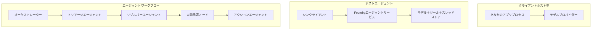
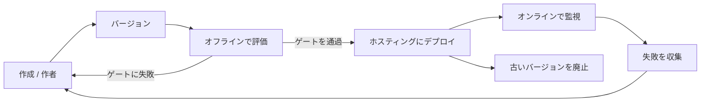
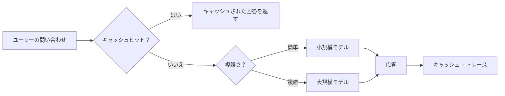
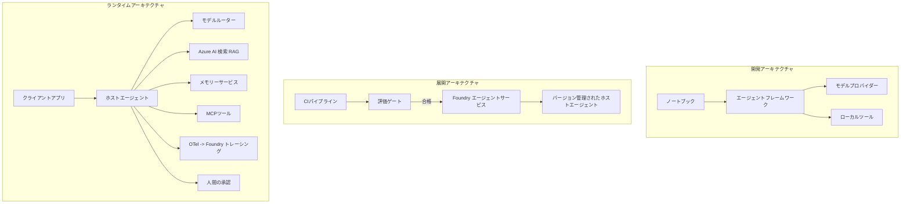

# Microsoft Foundryでスケーラブルなエージェントをデプロイする


このコースのここまでで、`az login`といくつかの環境変数により駆動される、ラップトップ上やノートブック内で動作するエージェントを構築してきました。それは学習にはまさに正しい方法です。しかし、何千もの顧客が午前3時に依存するエージェントを実行するための正しい方法ではありません。

このレッスンは、「自分のマシンでは動く」ことと「本番環境で安定的かつ手頃に動作する」ことのギャップについてです。このギャップを<strong>Microsoft Foundry</strong>と<strong>Microsoft Foundry Agent Service</strong>を使って埋め、ツール、検索、メモリ、評価、モニタリングを備えた実際のカスタマーサポートエージェントを構築することで実現します。

## はじめに

このレッスンでは以下を扱います：

- <strong>プロトタイプエージェント</strong>と<strong>デプロイされたエージェント</strong>の違い、および移行がモデルの周囲のすべてに関わる理由。
- エージェントの<strong>デプロイメントパターン</strong>：クライアントホスト、サービスホスト（Hosted Agents）、ワークフローオーケストレーション。
- Microsoft Foundryの<strong>エージェントライフサイクル</strong> — 作成、バージョン管理、デプロイ、評価、監視、廃止。
- <strong>スケーリング戦略</strong>：モデルルーティング、キャッシュ、同時実行、ステートレス設計。
- OpenTelemetryとFoundryトレーシングを用いた<strong>可観測性</strong>。
- モデル選択、ルーティング、評価ゲートによる<strong>コスト最適化</strong>。
- <strong>エンタープライズ向け配慮事項</strong>：ガバナンス、人間による承認、本番環境でのMCPサーバーの安全な運用。

## 学習目標

このレッスンを終えると、以下ができるようになります：

- エージェントのワークロードに適したデプロイメントパターンを選択する。
- エージェントをMicrosoft Foundry Agent Serviceにデプロイし、バージョン管理、ガバナンス、可観測性を実現する。
- トレース用の計測を施し、リリース前に毎回実行される評価パイプラインを組み込む。
- モデルルーティングとキャッシュを適用し、スケール時のレイテンシーとコストを制御する。
- 高リスクアクションのための人間による承認ゲートを追加し、生産的に安全な方法でMCPサーバーを統合する。

## 前提条件

このレッスンは、以下に精通していることを前提とします：

- [Microsoft Agent Framework](../14-microsoft-agent-framework/README.md) を使ったエージェント構築（レッスン14）。
- [ツールの利用](../04-tool-use/README.md)（レッスン4）および[Agentic RAG](../05-agentic-rag/README.md)（レッスン5）。
- [エージェントメモリ](../13-agent-memory/README.md)（レッスン13）および[Agentic Protocols / MCP](../11-agentic-protocols/README.md)（レッスン11）。
- [可観測性と評価](../10-ai-agents-production/README.md)（レッスン10） — 本レッスンはこれに直接基づいています。

また、以下も必要です：

- <strong>Azureサブスクリプション</strong>と、少なくとも1つのチャットモデルをデプロイした<strong>Microsoft Foundryプロジェクト</strong>。
- <strong>Azure CLI</strong>で認証済み（`az login`）。
- Python 3.12以上およびリポジトリ内の [`requirements.txt`](../../../requirements.txt) に記載されたパッケージ。

## プロトタイプから本番へ：実際に何が変わるのか

プロトタイプエージェントと本番エージェントは、同じコアループ — 推論、ツール呼び出し、応答 — を共有します。変わるのはそのループの周りにあるすべてです。モデルは本番エージェントの20％程度で、残りの80％は運用の骨格です。

| 関心事 | プロトタイプ | 本番 |
| --- | --- | --- |
| <strong>ホスティング</strong> | ノートブック内で動作 | ホストされたサービスとして動作、バージョン管理とローリングアウト有り |
| <strong>アイデンティティ</strong> | あなたの`az login`トークン | スコープ付きRBACを持つマネージドアイデンティティ |
| <strong>状態</strong> | メモリ上、一旦再起動すると消える | 外部化（スレッドストア、メモリサービス） |
| <strong>失敗時</strong> | トレースバックを確認可能 | リトライ、フォールバック、デッドレター、アラート |
| <strong>コスト</strong> | 「数セント程度」 | リクエスト単位で追跡、ルーティング、キャッシュ、予算管理 |
| <strong>品質</strong> | 出力を目視確認 | 毎リリース前に自動評価 |
| <strong>信頼</strong> | あなたがすべてのアクションを承認 | ポリシーとリスクのあるアクションに対する人間の確認 |

この表を心に留めておいてください。以下の各セクションはこれらの行のいずれかに対応しています。

## エージェントのデプロイメントパターン

よく使われる3つのパターンがあり、組み合わせて使うことも多いです。

### 1. クライアントホスト型エージェント

エージェントオブジェクトは<em>あなたの</em>アプリケーションプロセス内にあります。コードがモデルプロバイダーを直接呼び出し、推論ループはあなたのサービス内で動作します。これがこれまでのすべてのレッスンで行ってきた方法です。

- <strong>使いどき</strong>：ループ全体の完全な制御が必要な場合や、カスタムミドルウェアがある場合、既存のバックエンドにエージェントを組み込みたいとき。
- <strong>トレードオフ</strong>：スケーリング、状態管理、耐障害性を自分で所有する必要があります。

### 2. ホスト型エージェント（Foundry Agent Service）

エージェントはMicrosoft Foundryの<em>リソースとして登録</em>されます。Foundryが推論ループをホストし、スレッドを保存し、コンテンツの安全性とRBACを適用し、エージェントをFoundryポータルで可視化します。あなたのアプリはスレッドを作成し応答を読む薄いクライアントになります。

- <strong>使いどき</strong>：耐久性、組み込みの可観測性、ガバナンス、および運用負荷の軽減が必要な場合。
- <strong>トレードオフ</strong>：低レベルの制御権を手放す代わりにマネージドランタイムを手に入れる。

### 3. エージェントワークフロー

複数のエージェント（およびツール）が明示的な制御フローを持つグラフに構成されます — 順次ステップ、分岐、人間承認ノード、および一時停止・再開可能な耐久チェックポイント。これはMicrosoft Agent Frameworkの<strong>Workflows</strong>機能をデプロイメント規模に適用したものです。

- <strong>使いどき</strong>：単一のタスクが複数の専門的エージェントにまたがる場合や途中に承認ステップが必要な場合。
- <strong>トレードオフ</strong>：可動部分が増え、オーケストレーションレベルの可観測性が必要になる。



## Microsoft Foundryにおけるエージェントライフサイクル

エージェントをデプロイすることは一度きりの`push`ではありません。ループであり、まさにソフトウェアのリリースサイクルととても似ています。



[レッスン10](../10-ai-agents-production/README.md)から引き継がれた重要な考え方：**オフライン評価は後回しではなくゲートである。** 新しいエージェントバージョンは評価基準をクリアしない限りリリースされません。オンラインの可観測性がリアルな障害をオフラインのテストセットにフィードバックします。これがループの全体像です。

## スケーリング戦略

エージェントのスケールはステートレスなWeb APIのスケールとは異なります。なぜなら、各リクエストが複数の高コストなモデルやツール呼び出しを引き起こす可能性があるためです。主な4つの技法があります。

**ステートレスなリクエスト処理。** プロセスメモリにユーザーごとの状態を持たないようにします。会話のスレッドはFoundryのスレッドストアやメモリサービスに永続化し、どのインスタンスでも任意のリクエストを処理できるようにします。これにより水平スケールが可能になります — インスタンスを追加し、スティッキーセッションは不要です。

**モデルルーティング。** すべてのリクエストで最も高性能かつ高価なモデルが必要とは限りません。シンプルなリクエスト（意図分類、短い事実回答など）を小型で高速なモデルに振り向け、本格的な推論には大型モデルを予約します。Foundryの<strong>Model Router</strong>がこれを行うか、軽量な分類器を自作できます。ラボでDIY版を作ります。

**応答キャッシュ。** 多くのサポート問い合わせはほぼ重複しています（「パスワードをリセットするには？」など）。共通質問の答えをキャッシュし、モデルを呼び出さずに提供します。適度なキャッシュヒット率でもコストとレイテンシーを大幅に削減可能です。

**同時実行とバックプレッシャー。** モデルプロバイダーにはレート制限があります。同時実行数を制限し、指数関数的バックオフを伴うリトライを使い、500エラーよりは「対応中」応答などで優雅に失敗します。



## 本番環境での可観測性

見えないものは運用できません。レッスン10で扱ったように、Microsoft Agent Frameworkは<strong>OpenTelemetry</strong>トレースをネイティブに出力します — すべてのモデル呼び出し、ツール呼び出し、オーケストレーションステップがスパンになります。本番環境ではこれらのスパンをMicrosoft Foundry（または任意のOTel互換バックエンド）にエクスポートし、以下を実現します：

- 単一の顧客クレームをすべてのモデル・ツール呼び出しに渡って追跡する。
- 時間経過とともにリクエストごとのp50/p95レイテンシーとコストを監視する。
- ユーザーや財務チームが気づく前にエラー率の急増やコスト異常でアラートを出す。

```python
from agent_framework.observability import get_tracer

tracer = get_tracer()

with tracer.start_as_current_span("support_request") as span:
    span.set_attribute("customer.tier", "enterprise")
    span.set_attribute("routed.model", "gpt-5-nano")
    # このスパン内でエージェントの実行が自動的にトレースされます
```

`customer.tier`や`routed.model`といった属性が、単なるトレースの塊を「企業顧客が小型モデルに過剰にルーティングされていないか？」のような答えを導く問いに変えます。

## コスト最適化

本番エージェントのコストはトークンに支配されます。影響の大きい順に三つのレバー：

1. **モデルの適正サイズ。** 評価ゲートを通過する小型モデルは、同様に通過する大型モデルよりほぼ常に安価です。最大モデルを無用に使うのではなく、小型モデルが十分良いことを評価で証明しましょう。
2. **複雑度によるルーティング。** 先述の通り、大型モデルの価格は大型推論をするリクエストのみに支払います。
3. **積極的なキャッシュ。** 最も安いモデル呼び出しは、一度も呼び出さないことです。

評価ゲートとコスト管理は二つの視点から見た同じ disciplina です：評価は<em>品質の最低ライン</em>を示し、ルーティングとキャッシュはその<em>コスト</em>を最低限に抑えます。

## エンタープライズ向けデプロイメント配慮事項

**ガバナンス。** Hosted AgentsはFoundryのRBAC、コンテンツ安全性、監査ログを受け継ぎます。各エージェントには必要最小限の権限を持つマネージドアイデンティティを付与します — ナレッジベースへの読み取り専用アクセス、チケットAPIへのスコープ付きアクセス、それ以上はなし。

**人間による介入。** 一部のアクションは完全自動化には重大すぎます — 返金発行、アカウント削除、法務チームへのエスカレーションなど。Microsoft Agent Frameworkは<strong>承認必須</strong>のツールをサポートします：エージェントがアクションを提案し、実行を一時停止、人間が承認または拒否し、ワークフローを再開。このプリミティブを[レッスン6](../06-building-trustworthy-agents/README.md)で見ましたが、ここでデプロイします。

**本番環境でのMCP。** [MCP](../11-agentic-protocols/README.md)は標準インターフェイスを通じて外部ツールを消費可能にします。本番ではすべてのMCPサーバーを信用されない境界として扱い、サーバーバージョンを固定し、スコープ付きアイデンティティで実行し、出力を検証し、秘密情報を渡さないようにします。MCPサーバーは依存関係であり、依存関係はパッチ適用、監査、レート制限されます。



これら3つの図 — 開発、デプロイメント、ランタイム — は同一エージェントの3段階の姿です。続くラボで構築を体験します。

## 実践ラボ：本番対応カスタマーサポートエージェント

[`code_samples/16-python-agent-framework.ipynb`](./code_samples/16-python-agent-framework.ipynb) を開き、最初から最後まで実行してください。すべての本番上の懸念が組み込まれた<strong>Contosoカスタマーサポートエージェント</strong>を組み立てます：

1. <strong>ツール呼び出し</strong> — 注文状況の確認とサポートチケットの発行。
2. **RAG** — ナレッジベース（Azure AI Searchを使用、メモリ内フォールバックも含むのでノートブック単独でも実行可能）からのポリシー質問への回答。
3. <strong>メモリ</strong> — 会話のターン間で顧客を記憶。
4. <strong>モデルルーティング</strong> — 複雑度分類器がリクエストを小型モデルまたは大型モデルへ振り分け。
5. <strong>応答キャッシュ</strong> — 繰り返される質問はキャッシュから提供。
6. <strong>人間承認</strong> — 閾値を超える返金は人間の承認で一時停止。
7. <strong>評価パイプライン</strong> — 小規模なオフラインテストセットがエージェントを評価し、リリースゲートとして機能。
8. <strong>可観測性</strong> — すべてのリクエストに対してOpenTelemetryトレース。

### 説明

ノートブックは各本番懸念が自己完結した実行可能なセクションになるように整理されています。中心はルーティングとキャッシュを組み合わせたリクエストハンドラーです：

```python
async def handle_support_request(query: str, customer_id: str) -> str:
    # 1. 可能な場合はキャッシュから提供します。
    cached = response_cache.get(normalize(query))
    if cached:
        return cached

    # 2. コストを制御するために複雑さでルーティングします。
    model = "gpt-5-nano" if is_simple(query) else "gpt-5-mini"

    # 3. 可観測性のためにトレーススパン内でエージェントを実行します。
    with tracer.start_as_current_span("support_request") as span:
        span.set_attribute("routed.model", model)
        span.set_attribute("customer.id", customer_id)
        response = await support_agent.run(query, model=model)

    # 4. キャッシュして返します。
    response_cache.set(normalize(query), response.text)
    return response.text
```

リリースを守る評価ゲートは以下のようになります：

```python
async def evaluation_gate(agent, test_cases, threshold: float = 0.8) -> bool:
    passed = 0
    for case in test_cases:
        result = await agent.run(case["input"])
        if score_response(result.text, case["expected"]) >= 0.8:
            passed += 1
    pass_rate = passed / len(test_cases)
    print(f"Evaluation pass rate: {pass_rate:.0%} (gate: {threshold:.0%})")
    return pass_rate >= threshold  # ゲートを通過した場合のみデプロイする
```

各行を読みましょう — ノートブックはプリミティブを意図的に小さくし、フレームワーク呼び出しの背後に隠れないようにしています。

## デプロイ済みエージェントのスモークテストによる検証

上記の評価ゲートはエージェントオブジェクトに対して<em>オフライン</em>で実行されます。エージェントがHosted Agentとしてデプロイされたら、さらにもう一つ、さらに安価なチェックが必要です：**デプロイされたエンドポイントが実際に応答しているか？**

「正常に」デプロイされたことは、定義がコントロールプレーンに受け入れられただけを証明します — エージェントが応答していることは証明しません。依存関係欠如、誤ったモデルルーティング、切れた接続により、何も返さないグリーンデプロイメントになることがあります。<strong>スモークテスト</strong>は数秒でそれを見抜き、すべてのデプロイで実行可能で、完全な評価より低コストです。

このリポジトリは[AI Smoke Test](https://github.com/marketplace/actions/ai-smoke-test) GitHub Actionを利用した使い勝手の良いスモークテストパイプラインを提供しています：

- <strong>カタログ</strong> — [`tests/lesson-16-smoke-tests.json`](../../../tests/lesson-16-smoke-tests.json) はContosoサポートエージェント用のプロンプトとアサーションを含みます（原則に基づくポリシー回答、注文検索、話題維持、複数ターンスレッドの継続性）。他のレッスンのカタログも並存しています — 詳細は[`tests/README.md`](../tests/README.md)をご覧ください。
- <strong>ワークフロー</strong> — [`.github/workflows/smoke-test.yml`](../../../.github/workflows/smoke-test.yml) はAzure OIDCでログインし、すべてのプロンプトをエージェントのResponsesエンドポイントにPOSTし、アサーション失敗時はジョブを失敗させます。

```yaml
- name: Smoke-test hosted agent
  uses: JFolberth/ai-smoketest@v1
  with:
    project_endpoint: ${{ inputs.project_endpoint }}
    agent_name: ContosoSupportAgent
    tests_file: tests/lesson-16-smoke-tests.json
```


エージェントがデプロイされたら、**Actions** タブから実行し、Foundry プロジェクトのエンドポイントとエージェント名を指定します。フェデレーテッドアイデンティティには Foundry プロジェクトスコープでの **Azure AI User** ロールが必要です。これらのレイヤーはピラミッドのように考えてください：スモークテスト（到達可能かつ応答中？）はすべてのデプロイで実行され、オフライン評価（出荷に十分か？）は昇格前に実行され、オンライン評価（実際の環境での状況は？）は継続的に実行されます。

## 知識確認

課題に進む前に理解度をテストしましょう。

**1. プロダクションエージェントのうち、「モデル」はおおよそどの程度の割合で、残りは何ですか？**

<details>
<summary>回答</summary>

モデルはシステムの少数派で、一般的に約20%と言われています。残りは運用の骨格であり、ホスティングとバージョニング、アイデンティティとRBAC、外部化された状態、障害対応、コスト追跡、評価、そしてヒューマンインザループの制御です。プロダクションへの移行は主に推論ループの<em>周囲</em>にあるすべてを構築することです。
</details>

**2. クライアントホスト型エージェントよりも Hosted Agent を選ぶのはどんな場合ですか？**

<details>
<summary>回答</summary>

内蔵の耐久性（スレッドが持続し再開可能）、可観測性、コンテンツ安全性、RBAC を持つ管理されたランタイムが欲しく、推論ループの低レベル制御をある程度犠牲にしてでも運用面を減らしたい場合に適しています。完全なループ制御が必要な場合や既存バックエンドにエージェントを組み込む場合はクライアントホスト型が好ましいです。
</details>

**3. なぜスケーラブルなエージェントは自身のプロセスメモリにステートレスである必要がありますか？**

<details>
<summary>回答</summary>

どのインスタンスでも任意のリクエストを処理できるようにするためであり、これによりスティッキーセッションなしで水平スケーリングが可能になります。ユーザーごとの会話状態はスレッドストアやメモリサービスに外部化されます。状態がプロセスメモリ内にあった場合、再起動時に失われロード分散もできなくなります。
</details>

**4. モデルルーティングはどんな問題を解決し、評価とどう関連していますか？**

<details>
<summary>回答</summary>

ルーティングは単純なリクエストを小さく安価で高速なモデルに送信し、本格的な推論には大きなモデルを予約します。これによりレイテンシとコストの両方を制御します。評価は、小さいモデルがあるカテゴリーのリクエストに十分かを<em>証明</em>するもので、評価なしのルーティングは推測に過ぎません。
</details>

**5. 「評価ゲート」とは何で、ライフサイクルのどこに位置しますか？**

<details>
<summary>回答</summary>

評価ゲートは新しいエージェントバージョンに対してオフラインのテストセットを実行し、合格率が閾値をクリアしなければデプロイをブロックします。ライフサイクルの「バージョン」と「デプロイ」の間に位置し、品質を出荷後にチェックするのではなくリリースの前提条件にします。
</details>

**6. なぜ MCP サーバーはプロダクションで信頼できない境界として扱うべきですか？**

<details>
<summary>回答</summary>

それはエージェントが呼び出す外部依存だからです。バージョンを固定し、スコープ付きアイデンティティで実行し、出力を検証し、レート制限し、秘密情報を絶対に渡してはいけません—すべて他のサードパーティ依存に適用するのと同じ規律です。その出力はエージェントの推論に流れ込むため、未検証の信頼はセキュリティリスクになります。
</details>

**7. プロダクションエージェントのコストに通常最も大きな影響を与える単一の変更は何で、なぜですか？**

<details>
<summary>回答</summary>

適切なモデルサイズの選択—評価ゲートを通過する最小のモデルを使用することです。コストはトークンに支配されており、品質基準を満たす小さいモデルのほうが大きいモデルよりほぼ常に安価です。キャッシュやルーティングもコストをさらに減らしますが、最初の大きな効果は基本モデルの選択にあります。
</details>

**8. `customer.tier` や `routed.model` といったスパン属性は可観測性でどんな役割を果たしますか？**

<details>
<summary>回答</summary>

これらは生のトレースを答え可能なビジネス上の質問に変えます。属性がなければ膨大なスパンの壁ですが、あれば「エンタープライズ顧客は小さいモデルに送りすぎていないか？」「どのモデルが最も遅いリクエストを処理しているか？」などを問えます。属性は運用に重要な次元でテレメトリをスライスする方法です。
</details>

## 課題

ラボのカスタマーサポートエージェントを取り、ある特定のシナリオで強化してください：**SaaS 会社のサブスクリプション請求サポートエージェント。**

提出には次を含めてください：

1. <strong>ツールを請求関連のものに置き換える</strong>：`get_subscription_status`、`get_invoice`、`issue_credit` （$50 以上のクレジットは人の承認が必要）。
2. **3つの RAG ドキュメントを追加**：会社の返金ポリシー、請求サイクル、キャンセルポリシーに関して。
3. <strong>評価セットを少なくとも8ケースに拡張</strong>し、そのうち最低2つは人の承認経路を<em>必ず</em>トリガーすること、評価ゲートが正しく合格または不合格を判定することを確認。
4. **1つのコストレポートを追加**：混合クエリを10回エージェントに通した後、小さいモデルに行った回数、大きいモデルに行った回数、キャッシュからサービスされた回数を表示。

どのモデルルーティングルールを選び、それを実際のトラフィックでどう検証するかを説明する短いパラグラフ（マークダウンセル）を書いてください。正解は一つとは限らず、プロダクション上の懸念が一貫して組み合わされているかどうかが評価されます。

## まとめ

このレッスンでは、Microsoft Foundry を使いエージェントをプロトタイプからプロダクションに移行しました：

- プロダクションへのジャンプは主に、モデルの周囲にある <strong>運用の骨格</strong> （ホスティング、アイデンティティ、状態、障害対応、コスト、品質、信頼）です。
- 3つの <strong>デプロイパターン</strong> — クライアントホスト型、Hosted Agent、Agent Workflows — とそれぞれの適用シーンを学びました。
- <strong>エージェントライフサイクル</strong> を辿り、オフラインの <strong>評価がリリースゲートとして機能</strong>し、オンライン可観測性が障害をテストセットにフィードバックすることを理解しました。
- <strong>スケーリング戦略</strong> — ステートレス設計、モデルルーティング、キャッシュ、有限同時実行 — とこれらが<strong>コスト最適化</strong>にどう繋がるかを適用しました。
- <strong>エンタープライズ向け制御</strong> を構築：RBAC、ヒューマンインザループ承認、プロダクション安全な MCP 統合。
- これらすべての懸念をコードで結びつけた<strong>プロダクション対応カスタマーサポートエージェント</strong>を構築しました。

次のレッスンでは逆の旅をします：クラウドでエージェントをスケールアップする代わりに、単一の開発者マシン上で完全にローカルに実行します。

## 追加リソース

- <a href="https://learn.microsoft.com/azure/ai-foundry/what-is-azure-ai-foundry" target="_blank">Microsoft Foundry ドキュメント</a>
- <a href="https://learn.microsoft.com/azure/ai-foundry/agents/overview" target="_blank">Microsoft Foundry Agent Service 概要</a>
- <a href="https://aka.ms/ai-agents-beginners/agent-framework" target="_blank">Microsoft Agent Framework</a>
- <a href="https://learn.microsoft.com/azure/ai-foundry/concepts/model-router" target="_blank">Microsoft Foundry のモデルルーター</a>
- <a href="https://learn.microsoft.com/azure/search/search-what-is-azure-search" target="_blank">Azure AI Search</a>
- <a href="https://opentelemetry.io/" target="_blank">OpenTelemetry</a>
- <a href="https://github.com/marketplace/actions/ai-smoke-test" target="_blank">AI Smoke Test GitHub Action</a>
- <a href="https://modelcontextprotocol.io/" target="_blank">Model Context Protocol (MCP)</a>

## 前のレッスン

[Building Computer Use Agents (CUA)](../15-browser-use/README.md)

## 次のレッスン

[Creating Local AI Agents](../17-creating-local-ai-agents/README.md)

---

<!-- CO-OP TRANSLATOR DISCLAIMER START -->
**免責事項**：
本書類は AI 翻訳サービス [Co-op Translator](https://github.com/Azure/co-op-translator) を使用して翻訳されています。正確性を期していますが、自動翻訳には誤りや不正確な部分が含まれる可能性があることをご承知おきください。原文の原語版が正式な情報源とみなされるべきです。重要な情報については、専門の人間による翻訳を推奨します。本翻訳の利用により生じたいかなる誤解や解釈違いについても、当方は責任を負いかねます。
<!-- CO-OP TRANSLATOR DISCLAIMER END -->