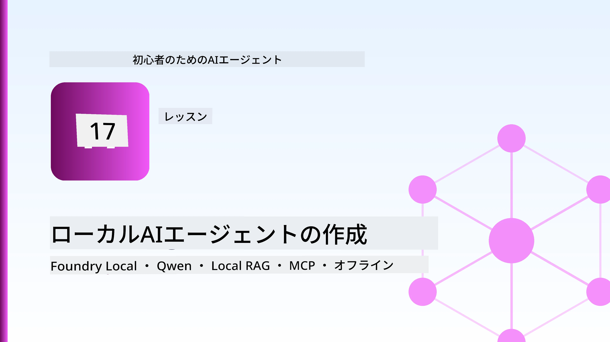
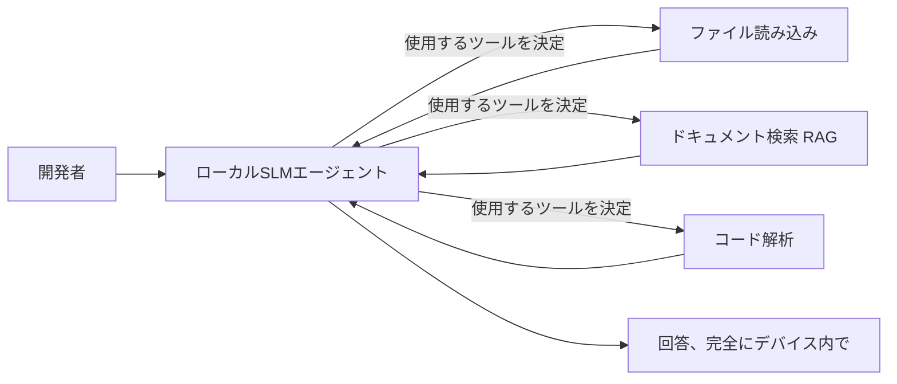
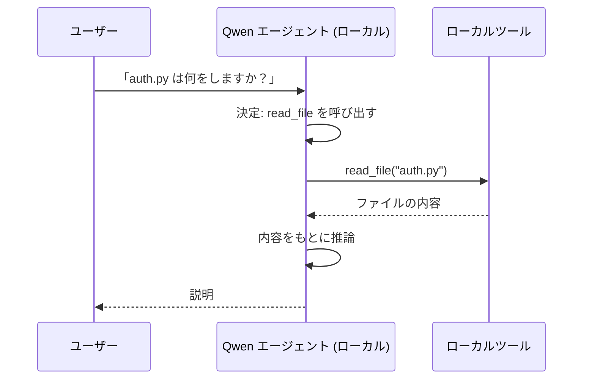
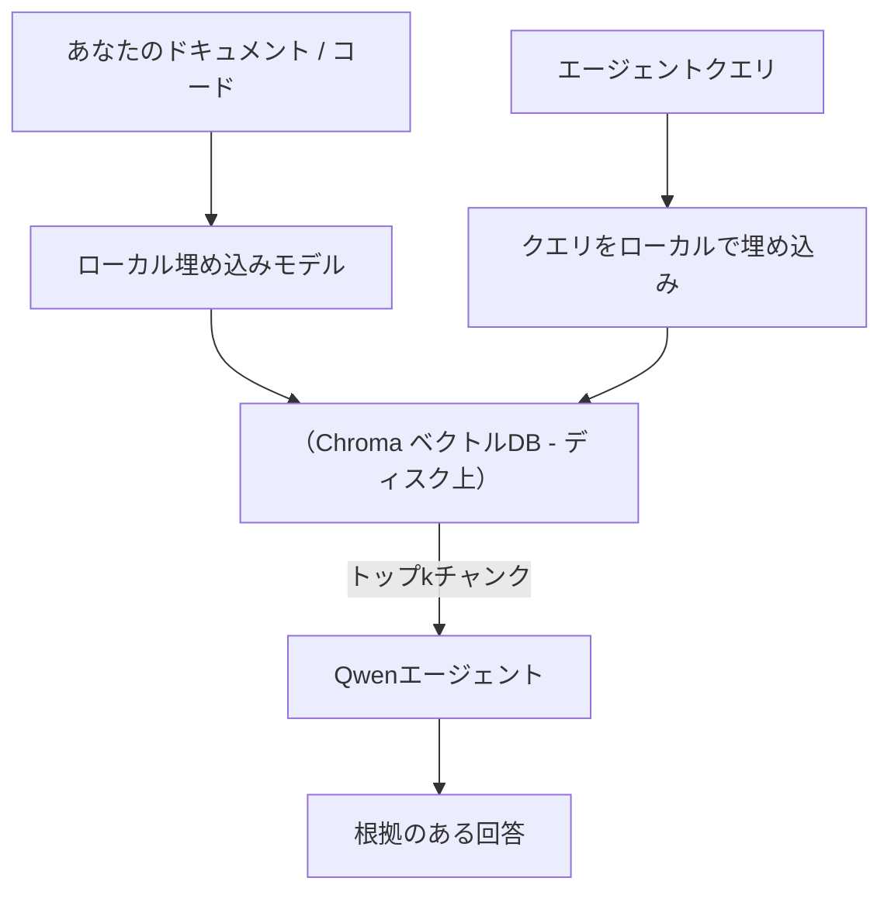
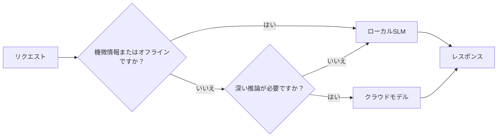

# Microsoft Foundry Local と Qwen を使ったローカルAIエージェントの作成



前回のレッスンではエージェントをクラウドに <em>スケールアップ</em> しました。今回はそれを単一マシンに <em>ダウン</em> します。最後まで進めると、推論依頼を一切クラウドに送らずに推論を行う、推論し、ツールを呼び、ファイルを読み込み、ドキュメントを検索できる動作するエンジニアリングアシスタントが完成します。

なぜそれをしたいのでしょう？実際のエンジニアリング作業で常に出てくる3つの理由があります：

- **プライバシー。** コードやドキュメントはマシンから一切出ません。プロンプトもスニペットも顧客データもネットワーク境界を越えません。
- **コスト。** ローカル推論にはトークン単位の課金がありません。電気代だけで一日中反復できます。
- **オフライン。** 飛行機内、セキュアな施設内、停電時でもエージェントが動作します。

トレードオフは、最先端のクラウドモデルと引き換えに、CPU、GPU、またはNPU上で動作する **小型言語モデル（SLM）** を選ぶことです。このレッスンは、制約があることを前提にその中で <em>良い</em> エージェントを作ることを扱います。

## はじめに

このレッスンでは以下を扱います：

- **小型言語モデル（SLM）** — それが何か、得意な領域と苦手な領域。
- **Microsoft Foundry Local** — デバイス上でモデルをダウンロード・管理・提供するランタイムで、**OpenAI互換API** に対応。
- **Qwen 関数呼び出しモデル** — ツール呼び出しを確実に生成するSLMで、ローカル<em>エージェント</em>（単なるローカルチャットではなく）を可能にする。
- **ローカルツール、ローカルRAG、ローカルMCP** — クラウドなしでエージェントに機能を持たせる。
- <strong>ハイブリッドパターン</strong> — いつローカルに留め、いつクラウドを利用するか。

## 学習目標

このレッスンを終えると、以下ができるようになります：

- SLMのトレードオフを説明し、適切なローカルエージェントのユースケースを選ぶ。
- Foundry LocalでQwenモデルをローカルサーブし、OpenAI互換エンドポイントを通じて接続する。
- ワークステーション上で完全に動作するツール呼び出しエージェントを作る。
- ローカルベクターデータベース（Chroma）を使い、自分のドキュメントに対するローカルRAGを追加する。
- エージェントをローカルMCPサーバーに接続し、ローカル/クラウドのハイブリッド設計を考察する。

## 前提条件

このレッスンでは以下のレッスンを終え、以下に慣れていることが前提です：

- [ツールの使い方](../04-tool-use/README.md)（レッスン4）および[エージェンティックRAG](../05-agentic-rag/README.md)（レッスン5）。
- [エージェンティックプロトコル / MCP](../11-agentic-protocols/README.md)（レッスン11）。
- [Microsoft Agent Framework](../14-microsoft-agent-framework/README.md)（レッスン14）。

以下の環境も必要です：

- 開発者用ワークステーション。<strong>現実的な最低メモリは8GB</strong>で、16GB以上あると快適です。GPUまたはNPUがあると便利ですが必須ではありません。
- **Microsoft Foundry Local** をインストール（セットアップセクション参照）。
- Python 3.12+ とリポジトリの [`requirements.txt`](../../../requirements.txt)、および本レッスン用に `foundry-local-sdk`, `openai`, `chromadb`。

## 小型言語モデル：ローカル作業に適したツール

最先端のクラウドモデルは数千億パラメーターを持ち、データセンターに依存します。SLMは数十億パラメーターで、ノートパソコンのRAMに収まるサイズです。この差が期待値を決めます。

**SLMの得意なこと：**

- 構造化された、範囲が限定されたタスク — 分類、抽出、既知文書の要約。
- <strong>ツール呼び出し</strong> — どの関数をどういう引数で呼ぶかの決定。
- 自分のデータで高速・安価・プライベートに繰り返し処理。

**SLMが苦手なこと：**

- オープンエンドで長距離推論を含む複数段階の推論。
- 広範囲な世界知識（見た量が少なく、忘れやすい）。

ローカルエージェントの勝ち筋は：<strong>SLMにはオーケストレーションを任せ、ツールに重い処理をさせる</strong>ことです。モデルはコードベースそのものを「知る」必要はなく、いつ `read_file` や `search_docs` を呼ぶかを知ればよい。これはSLMの強みを直接活かします。



## Microsoft Foundry Local

**Microsoft Foundry Local** は完全にマシン上でモデルをダウンロード、管理、提供する軽量ランタイムです。重要な特徴は **OpenAI互換HTTPエンドポイント** を公開していることで、OpenAI SDKとMicrosoft Agent FrameworkのOpenAIクライアントが `base_url` のみ変更すれば動くことです。エージェント構築の知識は全てそのままで、クラウドから `localhost` にエンドポイントが変わるだけです。

Foundry Localはハードウェアに合わせて最適なモデルビルド（CPU, CUDA/GPU, NPU）を自動で選ぶので、マシンごとの最適化を手動で行う必要がありません。

### セットアップ

Foundry Localをインストール（OSごとの[ドキュメント](https://learn.microsoft.com/azure/ai-foundry/foundry-local/)参照）し、動作確認してください：

```bash
# インストール（例：プラットフォームのドキュメントに従ってください）
winget install Microsoft.FoundryLocal      # Windows
# brew install microsoft/foundrylocal/foundrylocal   # macOS

# Qwenモデルをダウンロードして実行し、その後ローカルサービスを起動してください
foundry model run qwen2.5-7b-instruct
foundry service status
```

サービスが起動すると通常 `http://localhost:PORT/v1` のローカルOpenAI互換エンドポイントがあります。ノートブックは `foundry-local-sdk` でエンドポイントを自動検出するためポートをハードコードしなくて済みます。

## Qwen 関数呼び出し：なぜ重要なのか

エージェントはツールを呼び出せて初めてエージェントです。多くのSLMはチャットはできても不正確や不完全なツール呼び出しを出します。**Qwen** モデルは関数呼び出し用に訓練されており、常に正確なツールコール構造を生成します。これがローカルチャットモデルをローカル <em>エージェント</em> に変えるのです。

フローは既知の標準的なツール呼び出しループで、デバイス上で動作するだけです：



## ローカルRAG

ドキュメント検索はローカルエージェントの生命線です。SLMがフレームワークのドキュメントを丸暗記していることを期待する代わりに、それらを <strong>ローカルベクターデータベース</strong> に埋め込み、必要に応じてエージェントが関連部分を取得できるようにします。

使用するのは **Chroma** というベクターストアで、プロセス内で稼働しサーバーは不要です。パイプラインは完全にローカル：ローカル埋め込みモデル → ローカルベクター → ローカル検索 → ローカルSLMです。



これはレッスン5のAgentic RAGパターンと同じで、実行されるすべてのコンポーネントがマシン上で動く点が異なります。

## ローカルMCPサーバー

[MCP](../11-agentic-protocols/README.md) はクラウドサービスではなくトランスポートです。MCPサーバーは `stdio` でローカルプロセスとして動作し、標準プロトコル経由でエージェントにツールを提供します。これにより、ファイルシステムアクセス、git操作、データベースクエリなど、増加中のMCPサーバーエコシステムを完全オフラインで再利用できます。

セキュリティ体制はクラウドと異なっても存在します：ローカルMCPサーバーはユーザー権限で動作するため、アクセス範囲を限定（プロジェクトディレクトリだけなど）し、その出力は入力として検証して扱う必要があります。

## ハイブリッド クラウド＆ローカルパターン

ローカルファーストはローカルオンリーではありません。成熟したシステムは感度や難易度に応じて経路を切り替えます：

| 状況 | 実行場所 |
| --- | --- |
| 機微なコード／データ、またはオフライン時 | **ローカルSLM** |
| 単純で範囲が限定されたタスク | **ローカルSLM**（安価かつ高速） |
| 非機密データに対する困難な多段推論 | <strong>クラウドモデル</strong> |
| 停電時の全ての処理 | **ローカルSLM**（段階的低下） |

これはレッスン16の <strong>モデルルーティング</strong> のアイデアに似ていますが、"モデル" の一つが自身のマシンとなっています。堅牢な設計はクラウドが使えない場合にローカルにフォールバックし、エージェントは完全停止せず質を落として動作します。



## ハンズオンラボ：ローカルエンジニアリングアシスタント

[`code_samples/17-local-agent-foundry-local.ipynb`](./code_samples/17-local-agent-foundry-local.ipynb) を開いて進めてください。完全にワークステーション上で動作する <strong>ローカルエンジニアリングアシスタント</strong> を構築します。できることは：

1. <strong>ツール呼び出し</strong> — Foundry Local経由でQwen関数呼び出し。
2. <strong>ローカルファイル操作</strong> — プロジェクトディレクトリのファイル一覧取得および読み込み。
3. <strong>コード分析</strong> — ソースファイルの基本的なメトリクス報告。
4. <strong>ドキュメント検索</strong> — Chromaを使ったドックスフォルダーに対するローカルRAG。
5. **MCP使用** — ローカルMCPサーバーに接続し、未設定ならスキップ。

クラウド推論は一切使いません。

### 詳細解説

エージェントはOpenAI互換エンドポイントを通じてFoundry Localに接続するため、エージェントコードはクラウドレッスンとほぼ同じで、クライアントだけが変わります：

```python
from foundry_local import FoundryLocalManager
from openai import OpenAI

# Foundry Localはモデルを検出してダウンロードし、ローカルのエンドポイントを提供します。
manager = FoundryLocalManager(\"qwen2.5-7b-instruct\")
client = OpenAI(base_url=manager.endpoint, api_key=manager.api_key)  # api_keyはローカルのプレースホルダーです。
```

ツールはプロジェクトディレクトリに限定した通常のPython関数です：

```python
def read_file(path: str) -> str:
    \"\"\"Read a file, but only inside the sandboxed project directory.\"\"\"
    full = (PROJECT_ROOT / path).resolve()
    if PROJECT_ROOT not in full.parents and full != PROJECT_ROOT:
        return \"Access denied: path is outside the project directory.\"
    return full.read_text(encoding=\"utf-8\")
```

サンドボックスチェックに注目—ローカルでも任意パスを読むツールはリスクです。ノートブックはすべてのツールを単一プロジェクトルートにスコープしています。

## 知識確認

課題に進む前に理解度を確認しましょう。

**1. エージェントをクラウドでなくローカルで動かす具体的な理由を2つ挙げてください。**

<details>
<summary>回答</summary>

以下のうちどれか2つ：<strong>プライバシー</strong>（コードやデータはマシンから出ない）、<strong>コスト</strong>（トークン単位の課金なし）、<strong>オフライン対応</strong>（ネットワーク不通でも動く—飛行機内、セキュア施設、停電時など）。規制やコンプライアンスでデータをデバイス外に送れない場合もプライバシー理由になります。
</details>

**2. ローカルエージェントのSLMとツールの役割分担はどうなっていて、なぜですか？**

<details>
<summary>回答</summary>

SLMは<strong>オーケストレーション</strong>（どのツールをどう呼ぶかを決定）を行い、<strong>ツールは重い処理を担当</strong>（ファイルの読み込み、ドキュメント検索、計算結果生成など）。SLMはツール選択のような限定的な意思決定は得意ですが、広範な知識や長い多段推論は苦手なため、この役割分担が強みを活かします。
</details>

**3. Foundry Localでクラウド用のエージェントコードを再利用できる理由は何ですか？**

<details>
<summary>回答</summary>

Foundry Localは<strong>OpenAI互換のHTTPエンドポイント</strong>を公開しています。OpenAI SDKやエージェントフレームワークのOpenAIクライアントは `base_url` を変更し（ローカル用のダミーAPIキー使用）、他は同じコードが動きます。
</details>

**4. なぜ特にQwen関数呼び出しモデルを使うのでしょう？**

<details>
<summary>回答</summary>

エージェントは正確で整形された <strong>ツール呼び出し</strong> を生成する必要があります。多くのSLMはチャットはできますが不正確なツール呼び出しを出します。Qwenモデルは関数呼び出し用に訓練され、一貫したツールコールを生成し、それこそがローカルチャットモデルを動作するローカルエージェントに変えます。
</details>

**5. ローカルRAGパイプラインでマシン上で動くコンポーネントは？**

<details>
<summary>回答</summary>

全て：埋め込みモデル、ベクターデータベース（Chroma・ディスク上）、検索ステップ、SLM。ドキュメントはローカルで埋め込み、ローカルで格納、ローカルで取得し、ローカルモデルで推論。クラウドは一切使いません。
</details>

**6. ローカルMCPサーバーはマシン上で動いています。それで安全と言えますか？何に注意すべき？**

<details>
<summary>回答</summary>

いいえ。ローカルMCPサーバーはあなたのユーザー権限で動作しているので、あなたがアクセスできるものにはアクセス可能です。必要な範囲だけ（例えばプロジェクトディレクトリだけ）に限定し、そのアウトプットを入力として検証してから扱うことが必要です。
</details>

**7. ローカルモデルを含む合理的なハイブリッドルーティング規則を説明してください。**

<details>
<summary>回答</summary>

機微あるいはオフライン要求はローカルSLMへ。単純で限定的なタスクは高速・コスト面でローカルSLMへ。非機密データの困難な多段推論はクラウドモデルへ。クラウドが使えなければローカルSLMにフォールバックし、エージェントは完全停止ではなく質の低下で耐えられる。これはレッスン16のモデルルーティングにおいてローカルマシンをモデルの1つに加えたものです。
</details>

**8. 本レッスンのローカルエージェント実行における現実的な最低RAM容量は？また多いと何が得られるか？**

<details>
<summary>回答</summary>

現実的な最低は約 **8GB**。16GB以上なら快適です。多ければより大きく高性能なモデルが動かせ、より多くのコンテキストをメモリに保持可能です。GPUやNPUは推論速度の向上に寄与しますが必須ではありません — Foundry Localはアクセラレータ未検出時はCPUビルドを選びます。
</details>

## 課題

ローカルエンジニアリングアシスタントを拡張して、選択した小さなプロジェクトの <strong>ローカルドキュメントレビュアー</strong> を作成してください（希望があればこのリポジトリのレッスンフォルダを利用可）。

提出内容は以下を満たしてください：

1. 実際のドキュメント／コードフォルダーをChromaにインデックス（最低5ファイル）。
2. プロジェクトの `TODO`/`FIXME` コメントを走査し、ファイル名と行番号付きで抽出する `find_todos` ツールを追加（`read_file` と同様のサンドボックスチェックを維持）。

3. **エージェントに3つの質問をしてください**。これらはツールを組み合わせることを強制する質問です：1つは純粋なRAGの質問、1つは特定のファイルを読む必要がある質問、そして1つはTODOを見つける必要がある質問です。
4. <strong>計測します</strong>：3つの回答それぞれの時間を計測し、markdownセルに記録してください。遅延が意図したワークフローに許容できるかどうかコメントしてください。

そして、このレビュアーに対して<strong>クラウドに移すものとローカルに残すもの</strong>について短い段落を書き、その理由も述べてください。評価されるのは、ローカルコンポーネントが正しく連結されているかどうかと、ハイブリッド推論が適切かどうかです — モデルの質ではありません。

## 要約

このレッスンでは、完全に自身のマシン上で動作するエージェントを構築しました：

- **SLMs** は知識の広がりを犠牲にしてプライバシー、コスト、オフライン操作を得ており、すべての知識を持つのではなく<strong>ツールをオーケストレーション</strong>する際に輝きます。
- **Foundry Local** は、<strong>OpenAI互換のエンドポイント</strong>の背後でオンデバイスでモデルを提供し、クラウドエージェントコードが1行の変更で転送可能になります。
- <strong>Qwenの関数呼び出しモデル</strong>により、信頼できるローカルツール呼び出しが可能になり、したがってローカル<em>エージェント</em>も可能にします。
- **ローカルRAG**（Chroma）と<strong>ローカルMCP</strong>は、マシンを離れることなくエージェントに能力を与えます。
- <strong>ハイブリッドパターン</strong>は、感度と難易度によってルーティングを可能にし、ローカルが優雅なフォールバックとなります。

これで展開の弧が完結します：レッスン16はエージェントをMicrosoft Foundryにスケールアップし、このレッスンでは単一のワークステーションへスケールダウンしました。次のレッスンでは展開済みエージェントのセキュリティを扱います。

## 追加リソース

- <a href="https://learn.microsoft.com/azure/ai-foundry/foundry-local/" target="_blank">Microsoft Foundry Local ドキュメント</a>
- <a href="https://learn.microsoft.com/azure/ai-foundry/what-is-azure-ai-foundry" target="_blank">Microsoft Foundry ドキュメント</a>
- <a href="https://aka.ms/ai-agents-beginners/agent-framework" target="_blank">Microsoft Agent Framework</a>
- <a href="https://qwen.readthedocs.io/en/latest/framework/function_call.html" target="_blank">Qwen 関数呼び出しドキュメント</a>
- <a href="https://modelcontextprotocol.io/" target="_blank">Model Context Protocol (MCP)</a>
- <a href="https://docs.trychroma.com/" target="_blank">Chroma ベクターデータベース</a>

## 前のレッスン

[Deploying Scalable Agents](../16-deploying-scalable-agents/README.md)

## 次のレッスン

[Securing AI Agents](../18-securing-ai-agents/README.md)

---

<!-- CO-OP TRANSLATOR DISCLAIMER START -->
**免責事項**：
本書類は AI 翻訳サービス [Co-op Translator](https://github.com/Azure/co-op-translator) を使用して翻訳されています。正確性を期していますが、自動翻訳には誤りや不正確な部分が含まれる可能性があることをご承知おきください。原文の原語版が正式な情報源とみなされるべきです。重要な情報については、専門の人間による翻訳を推奨します。本翻訳の利用により生じたいかなる誤解や解釈違いについても、当方は責任を負いかねます。
<!-- CO-OP TRANSLATOR DISCLAIMER END -->