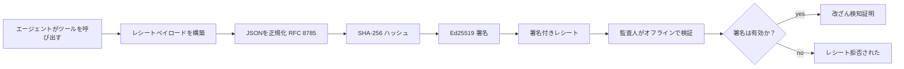
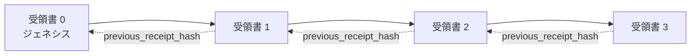

[レッスンビデオを見る：暗号化されたレシートでAIエージェントを保護する](https://youtu.be/PLACEHOLDER_VIDEO_ID)

> _(マイクロソフトのコンテンツチームがマージ後にレッスン14／15のパターンに合わせてレッスン動画とサムネイルを追加予定です)_

# 暗号化されたレシートでAIエージェントを保護する

## はじめに

このレッスンで扱う内容：

- AIエージェントの監査証跡がコンプライアンス、デバッグ、信頼において重要な理由。
- 暗号化レシートとは何か、署名されていないログラインとどう違うか。
- エージェントのツール呼び出しの署名付きレシートをプレーンなPythonで作成する方法。
- オフラインでレシートを検証し改ざんを検知する方法。
- レシートを連鎖させて、どれかを削除・並び替えするとチェーンが壊れる仕組み。
- レシートが証明するものと明示的に証明しないもの。

## 学習目標

このレッスンを終えると、以下を理解できるようになります：

- エージェントの行動に対する暗号的な由来の失敗モードを識別すること。
- 正準JSONペイロードに対してEd25519署名付きレシートを作成すること。
- 署名者の公開鍵のみを使ってレシートを独立して検証すること。
- 変更されたレシートに対して検証を再実行し改ざんを検出すること。
- レシートのハッシュ連鎖シーケンスを構築し、その連鎖の重要性を説明すること。
- レシートが証明するもの（帰属、完全性、順序）と証明しないもの（行動の正確性、ポリシーの妥当性）との境界を認識すること。

## 問題：あなたのエージェントの監査証跡

Contoso TravelのAIエージェントを展開したと想像してください。エージェントは顧客のリクエストを読み、フライトAPIを呼び出してオプションを検索し、顧客に代わって座席を予約します。前四半期にエージェントは50,000件の予約を処理しました。

今日、監査人が来ました。彼らは単純な質問をします：「あなたのエージェントが何をしたのか見せてください。」

あなたはログファイルを渡します。監査人はそれを見て、より難しい質問をします：「これらのログが改ざんされていないことをどうやって知れますか？」

これが監査証跡問題です。今日のほとんどのエージェント展開では以下に依存しています：

- <strong>アプリケーションログ</strong>：エージェント自身が書き込み、ファイルシステムアクセスがある誰でも編集可能。
- <strong>クラウドロギングサービス</strong>：プラットフォームレベルでは改ざん検出可能だが、監査人がプラットフォーム運営者を信頼する場合のみ。
- <strong>データベーストランザクションログ</strong>：データベースの変更には適しているが、任意のツール呼び出しには適していない。

これらのどれも、監査人が誰かを信頼することなしに監査人の質問に答えることはできません（あなた、クラウドプロバイダー、データベースベンダー）。内部利用ではその信頼は時に許容されますが、規制されたワークロード（金融、医療、EU AI法の対象など）では許されません。

暗号化レシートは、各エージェントの行動を独立して検証可能にすることでこれを解決します。監査人はあなたを信頼する必要はありません。あなたの公開鍵とレシート自体だけがあれば十分です。

## 暗号化されたレシートとは？

レシートは、エージェントが行ったことを記録し、デジタル署名されたJSONオブジェクトです。



最小限のレシートは以下のようになります：

```json
{
  "type": "agent.tool_call.v1",
  "agent_id": "contoso-travel-bot",
  "tool_name": "lookup_flights",
  "tool_args_hash": "sha256:a3f9c1...",
  "result_hash": "sha256:7b2e1d...",
  "policy_id": "contoso-travel-policy-v3",
  "timestamp": "2026-04-25T14:30:00Z",
  "sequence": 47,
  "previous_receipt_hash": "sha256:9d4e6a...",
  "signature": {
    "alg": "EdDSA",
    "sig": "c5af83...",
    "public_key": "8f3b2c..."
  }
}
```

3つの性質が機能しています：

1. <strong>署名</strong>。レシートはエージェントのゲートウェイによってEd25519の秘密鍵で署名されます。対応する公開鍵を持つ者なら誰でも署名をオフラインで検証可能です。どのフィールドも改ざんされると署名は無効になります。

2. <strong>正準エンコード</strong>。署名前にレシートはJSON Canonicalization Scheme (JCS, RFC 8785) を使ってシリアル化されます。これにより、同一の意味内容を持つ2つの実装がバイト単位で同じ出力を生成します。正準化がなければ、異なるJSONシリアライザが同じ内容に異なる署名を生じさせます。

3. <strong>ハッシュ連鎖</strong>。`previous_receipt_hash` フィールドが各レシートを前のレシートにリンクします。レシートを削除または並び替えると、その後に続くすべてのレシートが壊れます。個々の署名が回避されてもチェーンレベルで改ざんが可視化されます。

これらの性質は3つの保証を提供します：

- <strong>帰属</strong>：この鍵がこの内容に署名した。
- <strong>完全性</strong>：署名後に内容が変更されていない。
- <strong>順序</strong>：このレシートはチェーン内のあのレシートの後に来ている。

## Pythonでレシートを作成する

レシート作成には特別なライブラリは不要です。暗号原始関数は広く利用可能で、ロジックは数十行のPythonコードです。

`code_samples/18-signed-receipts.ipynb` のハンズオン演習でフルフローを詳しく解説しています。要約版：

```python
import json
import hashlib
import base64
from nacl import signing
from jcs import canonicalize  # RFC 8785 標準の JSON

def b64url_nopad(data: bytes) -> str:
    return base64.urlsafe_b64encode(data).decode("ascii").rstrip("=")

def sha256_canonical(obj) -> str:
    """SHA-256 of a Python object's JCS-canonical JSON form."""
    return f"sha256:{hashlib.sha256(canonicalize(obj)).hexdigest()}"

# 署名キーを生成またはロードする（本番環境ではキー保管庫に保存）
signing_key = signing.SigningKey.generate()
verify_key = signing_key.verify_key

# レシートのペイロードを作成（まだ署名なし）
tool_args = {"origin": "SYD", "destination": "LAX"}
tool_result = [{"flight": "QF11", "price": 1850, "stops": 0}]

payload = {
    "type": "agent.tool_call.v1",
    "agent_id": "contoso-travel-bot",
    "tool_name": "lookup_flights",
    "tool_args_hash": sha256_canonical(tool_args),
    "result_hash": sha256_canonical(tool_result),
    "policy_id": "contoso-travel-policy-v3",
    "timestamp": "2026-04-25T14:30:00Z",
    "sequence": 0,
    "previous_receipt_hash": None,
}

# 標準化し、ハッシュ化し、署名する。
canonical_bytes = canonicalize(payload)
message_hash = hashlib.sha256(canonical_bytes).digest()
signature_bytes = signing_key.sign(message_hash).signature

# 構造化された署名オブジェクトを添付する。
receipt = {
    **payload,
    "signature": {
        "alg": "EdDSA",
        "sig": b64url_nopad(signature_bytes),
        "public_key": b64url_nopad(bytes(verify_key)),
    },
}
```

これが署名パイプライン全体です。ノートブックの演習は各ステップを順に説明します。

## レシートを検証し改ざんを検出する

検証は逆演算です：

```python
import base64
import hashlib
from nacl import signing
from nacl.exceptions import BadSignatureError
from jcs import canonicalize

def b64url_decode(s: str) -> bytes:
    padding = "=" * ((4 - len(s) % 4) % 4)
    return base64.urlsafe_b64decode(s + padding)

def verify_receipt(receipt: dict) -> bool:
    # 署名は構造化されたオブジェクトです: {"alg", "sig", "public_key"}。
    sig_obj = receipt.get("signature")
    if not sig_obj or sig_obj.get("alg") != "EdDSA":
        return False

    # 実際に署名されたペイロード（署名を除くすべて）を再構築します。
    payload = {k: v for k, v in receipt.items() if k != "signature"}

    canonical_bytes = canonicalize(payload)
    message_hash = hashlib.sha256(canonical_bytes).digest()

    try:
        verify_key = signing.VerifyKey(b64url_decode(sig_obj["public_key"]))
        verify_key.verify(message_hash, b64url_decode(sig_obj["sig"]))
        return True
    except BadSignatureError:
        return False
```

この関数はレシートを受け取り、署名が有効なら `True`、そうでなければ `False` を返します。ネットワーク呼び出し不要、サービス依存なし、第三者の信頼も不要です。

改ざん検知の実例についてはノートブックで：

1. 有効なレシートを作成し検証が成功すること確認。
2. `tool_args_hash` フィールドの1バイトを変更。
3. 検証を再実行し失敗を確認。

これがレシートが改ざん検知可能である実用的な証明です。どんなに小さな変更でも署名を壊します。

## 複数ステップのエージェント向けレシートの連鎖

1つの署名済みレシートは1つのアクションを保護します。レシートのチェーンがシーケンスを保護します。



それぞれのレシートは前のレシートのハッシュを記録します。レシート2を密かに削除するには攻撃者は：

- レシート3の `previous_receipt_hash` フィールドを変更する（レシート3の署名破損）、または
- 修正したレシート3に新たに署名を偽造する（エージェントの秘密鍵が必要）。

秘密鍵がハードウェアキーボルト内にあり、公開鍵を各レシートに公開していれば、どちらの攻撃も検出なしには不可能です。

ノートブックでは以下を説明します：

1. 3つのレシートのチェーンを構築。
2. 各レシートの `previous_receipt_hash` が前のレシートの実際のハッシュと合致することを検証。
3. 中間のレシートを改ざんし、その箇所でチェーンが壊れることを確認。

こうして外部監査人があなたを信頼しなくても検証可能な監査証跡を作ります。

## レシートが証明すること（証明しないこと）

このセクションはレッスンの中で最も重要です。レシートは強力ですが、その力には限界があります。

**レシートが証明する3つのこと：**

1. <strong>帰属</strong>：特定の鍵が特定のペイロードに署名した。
2. <strong>完全性</strong>：署名後ペイロードが変更されていない。
3. <strong>順序</strong>：このレシートはそのレシートの後にチェーン内にある。

**レシートが証明しないこと：**

1. <strong>正確性</strong>：エージェントの行動が正しい行動だったこと。誤った回答に対してもきれいに署名可能です。
2. <strong>ポリシー遵守</strong>：`policy_id` のポリシーが実際に評価されたか、その行動を許可したか。レシートは主張を記録し、強制は記録しません。
3. <strong>鍵以外の身元</strong>：レシートは「この鍵がこの内容に署名した」と言いますが、「この人間が承認した」とは言いません。鍵から人または組織を結びつけるには別途身元インフラ（ディレクトリ、公開鍵レジストリなど）が必要です。
4. <strong>入力の真偽</strong>：エージェントが操作されたプロンプトを受けて行動しても、レシートはその行動を正確に記録します。レシートは入力検証の下流にあり、代わりにはなりません。

この境界が重要な理由は2つあります：

- レシートが何に役立つかを示します：組織の境界を越えても、エージェントの行動を監査可能かつ改ざん検出可能にします。
- 追加で必要な層を示します：入力検証（レッスン6）、ポリシー強制（以下で少し触れます）、身元インフラ（このレッスンの範囲外）。

よくある誤解は、「レシートがあれば統治されている」ということですが、そうではありません。レシートは基盤です。統治はその上に構築するシステムです。

## 人間が正確な行動を承認したことを証明する

上記項目3は独立したセクションに値します：行動レシートは「この鍵がこの内容に署名した」と言い、「人間が承認した」とは言いません。高リスク行動（返金、削除、銀行送金など）には、統治フレームワークは欠けているその宣言をますます要求しています。これはこのレッスンで既に構築したプリミティブで生成可能です。

後続のノートブック `code_samples/human-authorization-receipts.ipynb` は、レッスンのレシートと同じエンベロープ形状（Ed25519でその正準SHA-256に署名された型付けペイロード、署名オブジェクトは署名バイトの外）で第二のレシート種類 `human.approval.v1` を追加します。命名された承認者が実行前に<strong>完全な正準行動とそのダイジェスト</strong>に署名し、エージェントの行動レシートは<strong>同じ行動ダイジェスト</strong>と `parent_approval_ref`（承認の `receipt_hash`）を持ちます。これは上で作った `previous_receipt_hash` と同じ慣習です。一つの `verify_chain` は<strong>異なる固定鍵レジストリ</strong>（承認者鍵とエージェント鍵）で両アーティファクトを検証し、コードパスは共通ですが権限は別です。

ここで得られる性質は慎重に述べると：<em>人間はこの正確な行動を承認し、エージェントはまさにその承認された行動を実行した</em>ということです。ノートブックの拒否フィクスチャはこの性質を主張ではなく実態にしています：

- 古典的な一式：改ざん、混同代表、リプレイ、両側の鍵偽造、異常入力；
- <strong>権限陳腐化</strong>：署名はまだ検証可能でも、ポリシー版が変わった、承認者鍵が固定レジストリから外された、承認が実行前に期限切れになったために拒否；
- <strong>ダイジェスト置換</strong>：有効署名の行動レシートが<em>別の</em>正準行動に結びつく<em>実際の</em>承認を指す。

各失敗は明確な理由で拒否されるため、監査人は権限が陳腐化したのか実行行動が変わったのか判断できます。ノートブックが教えるルール：「署名された承認は単独で権限ではない。両方のレシートが実行時に同じ正準行動に結びつく場合にのみ権限は存在する」。このレッスンが従う同じInternet-Draft (`draft-farley-acta-signed-receipts`) にある共同署名パスがこのパターンの標準トラック形状です。

## 本番用の参考資料

このレッスンのPythonコードはあえて最小限にしているので全行読んで正確に何が起きているか理解できます。本番環境では2つの選択肢があります：

1. <strong>暗号プリミティブの直接利用</strong>。上記の50行は多くのユースケースに十分です。PyNaCl (Ed25519) と `jcs` パッケージ（正準JSON）は信頼性が高く監査済みのライブラリです。

2. <strong>本番用レシートライブラリの利用</strong>。いくつかのオープンソースプロジェクトが同じパターンを追加機能付きで実装しています（鍵ローテーション、一括検証、JWK Set配布、ポリシーエンジンと連携など）：
   - 本レッスンで使うレシート形式はIETF Internet-Draft（[`draft-farley-acta-signed-receipts`](https://datatracker.ietf.org/doc/draft-farley-acta-signed-receipts/)、リビジョン02）に従っており、共同適合性スイート（[agent-governance-testvectors](https://github.com/ScopeBlind/agent-governance-testvectors)）を使って独立実装がバイト単位同一の正準出力を検証しています。
   - Microsoft Agent Governance ToolkitはCedarベースのポリシー決定とレシートを組み合わせています；リポジトリのチュートリアル33でエンドツーエンド例を参照。
   - `protect-mcp` (npm) と `@veritasacta/verify` (npm) パッケージはNodeベースのレシート署名・オフライン検証を提供し、署名保留フロー含む改ざん検出監査証跡をあらゆるMCPサーバにラップすることを想定（デスクトップフローのWebAuthn対応承認レシートパターンと同じヒューマン承認パターン）。
   - **[nobulex](https://github.com/arian-gogani/nobulex)** Python SDK (`pip install nobulex`) は同じEd25519 + JCS署名パターンをLangChainおよびCrewAI統合で提供。公開の相互検証テストベクトルと[OWASP PR #2210](https://github.com/OWASP/CheatSheetSeries/pull/2210) による準拠マッピングを提供。

自前実装とライブラリ利用の選択は、自前JWTライブラリを書くか信頼されたものを使うかの選択に似ています：どちらも合理的で、ライブラリは時間を節約し監査表面を減らし、自作は各プリミティブの理解を深めます。このレッスンはその両方の基盤を作るため自作ルートを教えます。

## 知識チェック

演習に進む前に理解度を確認しましょう。

**1. レシートはエージェントの秘密Ed25519鍵で署名されています。監査人は公開鍵だけを持ちます。監査人はオフラインでレシートを検証できますか？**

<details>
<summary>答え</summary>

はい。Ed25519検証は署名バイトと公開鍵だけがあれば十分で、ネットワーク呼び出しもサービス依存もありません。これはレシートをエアギャップや複数組織、低信頼の監査環境で有用にする性質です。
</details>

**2. 攻撃者がレシートの `policy_id` フィールドを、より寛容なポリシーのものに書き換えました。署名は元のペイロードに対して付与されています。検証時に何が起きますか？**

<details>
<summary>答え</summary>


検証は失敗します。署名は元のペイロードの正規化されたバイトに対して計算されており、どのフィールドを変更しても正規化されたバイトが変わり、それによりSHA-256ハッシュが変わって署名が無効になります。攻撃者は新しい有効な署名を作成するために秘密鍵が必要ですが、持っていません。
</details>

**3. なぜレシートには生の引数と結果ではなく `tool_args_hash` と `result_hash` が含まれているのですか？**

<details>
<summary>回答</summary>

2つの理由があります。まず、レシートは生の内容（PIIやビジネスデータ）が漏れることが問題となる環境でアーカイブまたは伝送される可能性があります。ハッシュ化によりレシートは小さくなり内容は非公開のまま保たれます。監査人は別に保管された実際の内容のコピーとハッシュが一致することを検証します。次に、ハッシュは固定サイズです。レシートにハッシュがあることで、入力や出力がどんなに大きくてもサイズが一定に制限されます。
</details>

**4. `previous_receipt_hash` フィールドは各レシートをその前のレシートと連結します。攻撃者がチェーンの途中のレシートをこっそり削除した場合、何が無効になりますか？**

<details>
<summary>回答</summary>

削除されたレシート以降の全てのレシートです。これらの `previous_receipt_hash` フィールドは実際のチェーンと一致しなくなります（参照していたレシートが存在しないか、現在チェーンが異なる前任者を指しているため）。削除を隠すには、攻撃者は後続のすべてのレシートに再署名する必要があり、それには秘密鍵が必要です。
</details>

**5. レシートが正常に検証された場合、それはエージェントの行動が正しい、健全、またはポリシーに適合していることを証明しますか？**

<details>
<summary>回答</summary>

いいえ。有効なレシートは3つのことを証明します：帰属（この鍵がこの内容に署名した）、完全性（内容が変更されていない）、順序（このレシートはあのレシートの後にある）。しかし、それが行動が正しいこと、`policy_id` で示されたポリシーが実際に評価されたこと、エージェントがすべてのルールに従ったことを証明するわけではありません。レシートはエージェントの振る舞いを監査可能にするものであり、必ずしも正当性を保証するものではありません。これはこのレッスンで最も重要な境界線です。
</details>

## 練習問題

`code_samples/18-signed-receipts.ipynb` を開き、以下の4つのセクションを完了してください：

1. **セクション1**：最初のレシートに署名して検証する。
2. **セクション2**：レシートを改ざんして検証が失敗する様子を観察する。
3. **セクション3**：3つのレシートのチェーンを作成し、チェーンの整合性を検証する。
4. **セクション4**：Microsoft Agent Frameworkで構築したエージェントにパターンを適用する：ツール呼び出しをレシート署名でラップし、その後レシートを独立して検証する。

**ストレッチチャレンジ1:** 任意のフィールド（例：トレース用のリクエストID）を追加してレシートスキーマを拡張し、正規署名ロジックを更新し、レシートが検証に問題なく通ることを確認してください。その後、署名後にフィールドを変更して、検証が失敗することを確認してください。これにより、正規のエンコードの各バイトが署名にどのように寄与するか理解が深まります。

**ストレッチチャレンジ2:** 2つのレシートの正規化バイトを決定論的な順序で連結してSHA-256ハッシュを取り、そのダイジェストを3つ目のレシートの新しいフィールドとして埋め込み、署名してください。3つのレシートすべてが検証に問題なく通ることを確認します。これにより、一歩入り込んだ包含証明が構築されます：3つ目のレシートを持つ者は、最初の2つがその署名時点で存在していたことを内容を開示せずに証明できます。これはセレクティブ・ディスクロージャレシートが大規模に使用するパターンです（Merkleコミットメント、RFC 6962）。

## 結論

暗号化レシートはAIエージェントに以下の監査証跡を提供します：

- <strong>独立して検証可能</strong>：公開鍵を持つどの当事者でも検証可能で、サービス依存はありません。
- <strong>改ざん検知可能</strong>：いかなる変更も署名を無効にします。
- <strong>携帯可能</strong>：レシートは小さいJSONファイルであり、どこでもアーカイブ、伝送、検証可能です。
- <strong>標準準拠</strong>：Ed25519 (RFC 8032)、JCS (RFC 8785)、SHA-256という広く採用されたプリミティブに基づいています。

それらは入力検証やポリシー適用、身元基盤の代替ではありません。これらの層の基盤となるものです。規制されたワークロード、多機関のワークフロー、将来の監査人があなたを信用しない可能性がある環境にエージェントを展開する場合、監査証跡を誠実に保つ手段としてレシートが必要です。

最も重要な要点：レシートは「誰が何を言ったか」を証明しますが、「言われたことが真実または正しいこと」を証明しません。この区別を強く意識してください。これは誠実な出自システムと誤解を招くものの違いです。

## 本番環境向けチェックリスト

このレッスンから卒業し、レシート署名済みエージェントを実運用に展開する準備ができたら：

- [ ] **署名用秘密鍵を開発者のラップトップから移動する。** Azure Key Vault、AWS KMS、またはハードウェアセキュリティモジュールを使用してください。署名用秘密鍵はソース管理やアプリケーションマシン上の平文として決して存在してはいけません。
- [ ] **検証用公開鍵を公開する。** 監査人がオフラインで検証できるようにします。標準パターンはよく知られたURLに置かれたJWKセットです（RFC 7517）、例： `https://your-org.example.com/.well-known/agent-keys.json`。
- [ ] **チェーンの外部アンカーを行う。** 定期的に最新のチェーン先頭ハッシュを透明性ログ（Sigstore Rekor、RFC 3161 タイムスタンプ認証局、または別の内部システム）に書き込み、外部の第三者が「このチェーンはこの時点で存在した」と確認できるようにします。
- [ ] **レシートを不変に保存する。** 追記専用のBlobストレージ（Azure Storageの不変ポリシー、AWS S3オブジェクトロック）により内部関係者がストレージ層で履歴を書き換えることを防ぎます。
- [ ] **保存期間を決める。** 多くのコンプライアンス要件は数年の保存を要求します。レシートの増加計画を立ててください（1レシートあたり約500バイト、1日1万回の呼び出しで年間約1.8GB発生します）。
- [ ] **レシートがカバーしない内容を文書化する。** レシートは帰属、完全性、順序を証明します。運用手順書には、入力検証、ポリシー適用、レート制限、身元基盤などの追加の管理手段がレシートと共に機能することを明記してください。

### AIエージェントのセキュリティについてもっと質問がありますか？

[Microsoft Foundry Discord](https://aka.ms/ai-agents/discord) に参加して、他の学習者と会い、オフィスアワーに参加し、AIエージェントに関する質問に答えを得てください。

## このレッスンの先へ

このレッスンは単一レシート署名とハッシュチェーンのシーケンスをカバーしています。同じプリミティブを組み合わせて、ガバナンス体制が成熟すると遭遇するかもしれないいくつかの高度なパターンが作られます：

- **選択的開示。** レシートのフィールドが独立してコミットされている場合（RFC 6962スタイルのMerkleツリー）、特定のフィールドだけを特定の監査人に公開し、残りが変更されていないことを証明できます。包括的監査（完全性を求める）とGDPRなどのデータ最小化規制（監査人に必要以上は見せたくない）を同時に満たす必要がある場合に有用です。
- **レシート撤回。** 署名鍵が漏洩した場合、その鍵で署名された全てのレシートをある時点以降信用できないとマークする方法が必要です。標準的なパターンは短命の署名鍵と公開された撤回リスト、もしくは撤回エントリー付き透明性ログです。
- **両者署名／分割署名レシート。** 署名されたペイロードを実行前の `authorization_*` と実行後の `result_*` の2つに分けて独立した署名とし、認証決定と実際の結果が別の実行者によってまたは別の時間に生成される場合に有用です。このレッスンのレシート形式の上に加算可能に合成されます。
- **ペイロード構成。** レシートは `result_hash` に入れたバイトを封印します。実際のペイロードは単一のツール呼び出し結果より豊富なことが多く、事前の意思決定根拠（予測、検討した選択肢、証拠およびその完全性、リスク姿勢、アカウンタビリティチェーン、ゲート結果）を含めて単一のレシートで封印可能です。レシート形式は最小限に保ちつつペイロードスキーマをドメインごとに進化させることができます。
- **実装間の互換性。** 同じレシート形式の複数の独立した実装（Python、TypeScript、Rust、Go）が共有テストベクターに対して相互検証します。自身で実装を作成する際は、公表されたベクターで検証することでワイヤ互換性を確認できます。
- **量子耐性移行。** Ed25519は現在広く使われていますが量子耐性はありません。レシート形式はアルゴリズム可変で、署名の `signature.alg` フィールドに移行時に必要な場合は NISTのポスト量子署名標準 `ML-DSA-65` を指定できます。移行期間はレシートを二重署名する計画が必要です。

## 追加リソース

- <a href="https://datatracker.ietf.org/doc/draft-farley-acta-signed-receipts/" target="_blank">IETF インターネットドラフト：機械間アクセス制御のための署名付意思決定レシート</a>
- <a href="https://learn.microsoft.com/azure/ai-studio/responsible-use-of-ai-overview" target="_blank">責任あるAIの概要（Azure AI）</a>
- <a href="https://datatracker.ietf.org/doc/html/rfc8032" target="_blank">RFC 8032: Edwards-Curve デジタル署名アルゴリズム (EdDSA)</a>
- <a href="https://datatracker.ietf.org/doc/html/rfc8785" target="_blank">RFC 8785: JSON 正規化スキーム (JCS)</a>
- <a href="https://datatracker.ietf.org/doc/html/rfc6962" target="_blank">RFC 6962: 証明書透明性</a>（セレクティブ開示レシートで使われるMerkleツリー構築）
- <a href="https://github.com/microsoft/agent-governance-toolkit/blob/main/docs/tutorials/33-offline-verifiable-receipts.md" target="_blank">Microsoft Agent Governance Toolkit チュートリアル33: オフライン検証可能な意思決定レシート</a>
- <a href="https://github.com/ScopeBlind/agent-governance-testvectors" target="_blank">本レッスンで使われるレシート形式の実装間適合検証用テストベクター</a>（Apache-2.0）
- <a href="https://pynacl.readthedocs.io/" target="_blank">PyNaCl ドキュメント</a>（PythonのEd25519）

## 前回のレッスン

[ローカルAIエージェントの作成](../17-creating-local-ai-agents/README.md)

---

<!-- CO-OP TRANSLATOR DISCLAIMER START -->
**免責事項**：
本書類は AI 翻訳サービス [Co-op Translator](https://github.com/Azure/co-op-translator) を使用して翻訳されています。正確性を期していますが、自動翻訳には誤りや不正確な部分が含まれる可能性があることをご承知おきください。原文の原語版が正式な情報源とみなされるべきです。重要な情報については、専門の人間による翻訳を推奨します。本翻訳の利用により生じたいかなる誤解や解釈違いについても、当方は責任を負いかねます。
<!-- CO-OP TRANSLATOR DISCLAIMER END -->