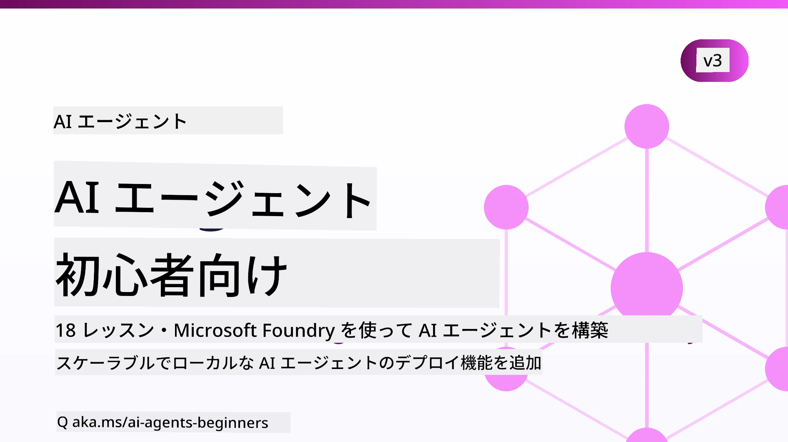

# 初心者のためのAIエージェント - コース



## AIエージェント構築を始めるために必要なすべてを教えるコース

[](https://github.com/microsoft/ai-agents-for-beginners/blob/master/LICENSE?WT.mc_id=academic-105485-koreyst)
[](https://GitHub.com/microsoft/ai-agents-for-beginners/graphs/contributors/?WT.mc_id=academic-105485-koreyst)
[](https://GitHub.com/microsoft/ai-agents-for-beginners/issues/?WT.mc_id=academic-105485-koreyst)
[](https://GitHub.com/microsoft/ai-agents-for-beginners/pulls/?WT.mc_id=academic-105485-koreyst)
[](http://makeapullrequest.com?WT.mc_id=academic-105485-koreyst)

### 🌐 多言語対応

#### GitHub Actionによるサポート（自動化および常に最新）

<!-- CO-OP TRANSLATOR LANGUAGES TABLE START -->
[アラビア語](../ar/README.md) | [ベンガル語](../bn/README.md) | [ブルガリア語](../bg/README.md) | [ビルマ語（ミャンマー）](../my/README.md) | [中国語（簡体字）](../zh-CN/README.md) | [中国語（繁体字、香港）](../zh-HK/README.md) | [中国語（繁体字、マカオ）](../zh-MO/README.md) | [中国語（繁体字、台湾）](../zh-TW/README.md) | [クロアチア語](../hr/README.md) | [チェコ語](../cs/README.md) | [デンマーク語](../da/README.md) | [オランダ語](../nl/README.md) | [エストニア語](../et/README.md) | [フィンランド語](../fi/README.md) | [フランス語](../fr/README.md) | [ドイツ語](../de/README.md) | [ギリシャ語](../el/README.md) | [ヘブライ語](../he/README.md) | [ヒンディー語](../hi/README.md) | [ハンガリー語](../hu/README.md) | [インドネシア語](../id/README.md) | [イタリア語](../it/README.md) | [日本語](./README.md) | [カンナダ語](../kn/README.md) | [クメール語](../km/README.md) | [韓国語](../ko/README.md) | [リトアニア語](../lt/README.md) | [マレー語](../ms/README.md) | [マラヤーラム語](../ml/README.md) | [マラーティー語](../mr/README.md) | [ネパール語](../ne/README.md) | [ナイジェリア・ピジン語](../pcm/README.md) | [ノルウェー語](../no/README.md) | [ペルシャ語（ファルシ）](../fa/README.md) | [ポーランド語](../pl/README.md) | [ポルトガル語（ブラジル）](../pt-BR/README.md) | [ポルトガル語（ポルトガル）](../pt-PT/README.md) | [パンジャブ語（グルムキー）](../pa/README.md) | [ルーマニア語](../ro/README.md) | [ロシア語](../ru/README.md) | [セルビア語（キリル文字）](../sr/README.md) | [スロバキア語](../sk/README.md) | [スロベニア語](../sl/README.md) | [スペイン語](../es/README.md) | [スワヒリ語](../sw/README.md) | [スウェーデン語](../sv/README.md) | [タガログ語（フィリピン）](../tl/README.md) | [タミル語](../ta/README.md) | [テルグ語](../te/README.md) | [タイ語](../th/README.md) | [トルコ語](../tr/README.md) | [ウクライナ語](../uk/README.md) | [ウルドゥー語](../ur/README.md) | [ベトナム語](../vi/README.md)

> **ローカルでクローンしたいですか？**
>
> このリポジトリには50以上の言語翻訳が含まれており、ダウンロードサイズが大きくなります。翻訳なしでクローンするには、スパースチェックアウトを使用してください：
>
> **Bash / macOS / Linux:**
> ```bash
> git clone --filter=blob:none --sparse https://github.com/microsoft/ai-agents-for-beginners.git
> cd ai-agents-for-beginners
> git sparse-checkout set --no-cone '/*' '!translations' '!translated_images'
> ```
>
> **CMD (Windows):**
> ```cmd
> git clone --filter=blob:none --sparse https://github.com/microsoft/ai-agents-for-beginners.git
> cd ai-agents-for-beginners
> git sparse-checkout set --no-cone "/*" "!translations" "!translated_images"
> ```
>
> これにより、ダウンロードがずっと速くなり、コース完了に必要なすべてを取得できます。
<!-- CO-OP TRANSLATOR LANGUAGES TABLE END -->

**追加の翻訳言語をサポートしたい場合は、[こちら](https://github.com/Azure/co-op-translator/blob/main/getting_started/supported-languages.md)に一覧があります。**

[](https://GitHub.com/microsoft/ai-agents-for-beginners/watchers/?WT.mc_id=academic-105485-koreyst)
[](https://GitHub.com/microsoft/ai-agents-for-beginners/network/?WT.mc_id=academic-105485-koreyst)
[](https://GitHub.com/microsoft/ai-agents-for-beginners/stargazers/?WT.mc_id=academic-105485-koreyst)

[](https://discord.com/invite/ATgtXmAS5D)


## 🌱 はじめに

このコースにはAIエージェント構築の基本をカバーするレッスンがあります。各レッスンは独立したトピックなので、好きなところから始めてください！

このコースは多言語対応です。利用可能な言語は[こちら](#-multi-language-support)をご覧ください。 

もしジェネレーティブAIモデルでの構築が初めてなら、21のレッスンが含まれる[初心者向けジェネレーティブAI](https://aka.ms/genai-beginners)コースをチェックしてください。

コードを実行するには、このリポジトリを[スター (🌟) する](https://docs.github.com/en/get-started/exploring-projects-on-github/saving-repositories-with-stars?WT.mc_id=academic-105485-koreyst)と[フォークする](https://github.com/microsoft/ai-agents-for-beginners/fork)ことを忘れないでください。

### 他の学習者と交流し、質問に答えてもらう

AIエージェントの構築で困ったり質問があれば、[Microsoft Foundry Discord](https://aka.ms/ai-agents/discord)内の専用Discordチャンネルに参加してください。

### 必要なもの 

このコースの各レッスンにはコード例が含まれており、code_samplesフォルダーにあります。このリポジトリを[フォーク](https://github.com/microsoft/ai-agents-for-beginners/fork)して自分のコピーを作成できます。  

これらの演習のコード例はMicrosoft Agent FrameworkとMicrosoft Foundry Agent Service V2を使用しています：

- [Microsoft Foundry](https://aka.ms/ai-agents-beginners/ai-foundry) - Azureアカウントが必要

このコースではMicrosoftの以下のAIエージェントフレームワークとサービスを使用します：

- [Microsoft Agent Framework (MAF)](https://aka.ms/ai-agents-beginners/agent-framework)
- [Microsoft Foundry Agent Service V2](https://aka.ms/ai-agents-beginners/ai-agent-service)

一部のコード例は、204Kトークンまで対応可能な大規模コンテキストモデルを提供する[MiniMax](https://platform.minimaxi.com/)のようなOpenAI互換プロバイダーもサポートしています。設定の詳細は[Course Setup](./00-course-setup/README.md)をご覧ください。

コースのコード実行情報は[Course Setup](./00-course-setup/README.md)を参照してください。

## 🙏 ご協力いただけますか？

ご提案やスペルやコードの誤りを見つけた場合は、[Issueを立てる](https://github.com/microsoft/ai-agents-for-beginners/issues?WT.mc_id=academic-105485-koreyst)か[プルリクエストを作成](https://github.com/microsoft/ai-agents-for-beginners/pulls?WT.mc_id=academic-105485-koreyst)してください。


## 📂 各レッスンには

- READMEに書かれたレッスンと短いビデオ
- Microsoft Agent FrameworkとMicrosoft Foundryを使ったPythonコード例
- 学習を続けるための追加リソースへのリンク


## 🗃️ レッスン一覧

| <strong>レッスン</strong>                                  | **テキスト＆コード**                                | <strong>ビデオ</strong>                                                  | <strong>追加学習</strong>                                                                           |
|----------------------------------------------|----------------------------------------------------|------------------------------------------------------------|----------------------------------------------------------------------------------------|
| AIエージェントの紹介とユースケース           | [リンク](./01-intro-to-ai-agents/README.md)         | [ビデオ](https://youtu.be/3zgm60bXmQk?si=z8QygFvYQv-9WtO1) | [リンク](https://aka.ms/ai-agents-beginners/collection?WT.mc_id=academic-105485-koreyst) |
| AIエージェントフレームワークの探究           | [リンク](./02-explore-agentic-frameworks/README.md) | [ビデオ](https://youtu.be/ODwF-EZo_O8?si=Vawth4hzVaHv-u0H) | [リンク](https://aka.ms/ai-agents-beginners/collection?WT.mc_id=academic-105485-koreyst) |
| AIエージェント設計パターンの理解              | [リンク](./03-agentic-design-patterns/README.md)    | [ビデオ](https://youtu.be/m9lM8qqoOEA?si=BIzHwzstTPL8o9GF)  | [リンク](https://aka.ms/ai-agents-beginners/collection?WT.mc_id=academic-105485-koreyst) |
| ツール使用設計パターン                         | [リンク](./04-tool-use/README.md)                   | [ビデオ](https://youtu.be/vieRiPRx-gI?si=2z6O2Xu2cu_Jz46N)  | [リンク](https://aka.ms/ai-agents-beginners/collection?WT.mc_id=academic-105485-koreyst) |
| エージェント型RAG                             | [リンク](./05-agentic-rag/README.md)                | [ビデオ](https://youtu.be/WcjAARvdL7I?si=gKPWsQpKiIlDH9A3)  | [リンク](https://aka.ms/ai-agents-beginners/collection?WT.mc_id=academic-105485-koreyst) |
| 信頼できるAIエージェントの構築                  | [リンク](./06-building-trustworthy-agents/README.md) | [ビデオ](https://youtu.be/iZKkMEGBCUQ?si=jZjpiMnGFOE9L8OK)  | [リンク](https://aka.ms/ai-agents-beginners/collection?WT.mc_id=academic-105485-koreyst) |
| 計画設計パターン                               | [リンク](./07-planning-design/README.md)            | [ビデオ](https://youtu.be/kPfJ2BrBCMY?si=6SC_iv_E5-mzucnC)  | [リンク](https://aka.ms/ai-agents-beginners/collection?WT.mc_id=academic-105485-koreyst) |
| マルチエージェント設計パターン                 | [リンク](./08-multi-agent/README.md)                 | [ビデオ](https://youtu.be/V6HpE9hZEx0?si=rMgDhEu7wXo2uo6g)  | [リンク](https://aka.ms/ai-agents-beginners/collection?WT.mc_id=academic-105485-koreyst) |

| メタ認知デザインパターン                 | [Link](./09-metacognition/README.md)               | [Video](https://youtu.be/His9R6gw6Ec?si=8gck6vvdSNCt6OcF)  | [Link](https://aka.ms/ai-agents-beginners/collection?WT.mc_id=academic-105485-koreyst) |
| 本番環境におけるAIエージェント                      | [Link](./10-ai-agents-production/README.md)        | [Video](https://youtu.be/l4TP6IyJxmQ?si=31dnhexRo6yLRJDl)  | [Link](https://aka.ms/ai-agents-beginners/collection?WT.mc_id=academic-105485-koreyst) |
| エージェンシックプロトコルの使用（MCP、A2A、NLWeb） | [Link](./11-agentic-protocols/README.md)           | [Video](https://youtu.be/X-Dh9R3Opn8)                                 | [Link](https://aka.ms/ai-agents-beginners/collection?WT.mc_id=academic-105485-koreyst) |
| AIエージェントのコンテキストエンジニアリング            | [Link](./12-context-engineering/README.md)         | [Video](https://youtu.be/F5zqRV7gEag)                                 | [Link](https://aka.ms/ai-agents-beginners/collection?WT.mc_id=academic-105485-koreyst) |
| エージェンシックメモリの管理                      | [Link](./13-agent-memory/README.md)     |      [Video](https://youtu.be/QrYbHesIxpw?si=vZkVwKrQ4ieCcIPx)                                                      |                                                                                        |
| Microsoft Agent Frameworkの探索                         | [Link](./14-microsoft-agent-framework/README.md)                            |                                                            |                                                                                        |
| コンピュータ使用エージェントの構築（CUA）           | [Link](./15-browser-use/README.md)     |                                                            | [Link](https://docs.browser-use.com/examples/templates/playwright-integration)         |
| スケーラブルなエージェントの展開                    | [Link](./16-deploying-scalable-agents/README.md) |                                                    | [Link](https://learn.microsoft.com/azure/ai-foundry/agents/overview)                   |
| ローカルAIエージェントの作成                     | [Link](./17-creating-local-ai-agents/README.md)  |                                                    | [Link](https://learn.microsoft.com/azure/ai-foundry/foundry-local/)                    |
| AIエージェントのセキュリティ強化                           | [Link](./18-securing-ai-agents/README.md)  |                                                            | [Link](https://aka.ms/ai-agents-beginners/collection?WT.mc_id=academic-105485-koreyst) |

## 🎒 その他のコース

私たちのチームは他にもコースを制作しています！ぜひご覧ください：

<!-- CO-OP TRANSLATOR OTHER COURSES START -->
### LangChain
[](https://aka.ms/langchain4j-for-beginners)
[](https://aka.ms/langchainjs-for-beginners?WT.mc_id=m365-94501-dwahlin)
[](https://github.com/microsoft/langchain-for-beginners?WT.mc_id=m365-94501-dwahlin)
---

### Azure / Edge / MCP / エージェント
[](https://github.com/microsoft/AZD-for-beginners?WT.mc_id=academic-105485-koreyst)
[](https://github.com/microsoft/edgeai-for-beginners?WT.mc_id=academic-105485-koreyst)
[](https://github.com/microsoft/mcp-for-beginners?WT.mc_id=academic-105485-koreyst)
[](https://github.com/microsoft/ai-agents-for-beginners?WT.mc_id=academic-105485-koreyst)

---
 
### 生成AIシリーズ
[](https://github.com/microsoft/generative-ai-for-beginners?WT.mc_id=academic-105485-koreyst)
[-9333EA?style=for-the-badge&labelColor=E5E7EB&color=9333EA)](https://github.com/microsoft/Generative-AI-for-beginners-dotnet?WT.mc_id=academic-105485-koreyst)
[-C084FC?style=for-the-badge&labelColor=E5E7EB&color=C084FC)](https://github.com/microsoft/generative-ai-for-beginners-java?WT.mc_id=academic-105485-koreyst)
[-E879F9?style=for-the-badge&labelColor=E5E7EB&color=E879F9)](https://github.com/microsoft/generative-ai-with-javascript?WT.mc_id=academic-105485-koreyst)

---
 
### コアラーニング
[](https://aka.ms/ml-beginners?WT.mc_id=academic-105485-koreyst)
[](https://aka.ms/datascience-beginners?WT.mc_id=academic-105485-koreyst)
[](https://aka.ms/ai-beginners?WT.mc_id=academic-105485-koreyst)
[](https://github.com/microsoft/Security-101?WT.mc_id=academic-96948-sayoung)
[](https://aka.ms/webdev-beginners?WT.mc_id=academic-105485-koreyst)
[](https://aka.ms/iot-beginners?WT.mc_id=academic-105485-koreyst)
[](https://github.com/microsoft/xr-development-for-beginners?WT.mc_id=academic-105485-koreyst)

---
 
### コパイロットシリーズ
[](https://aka.ms/GitHubCopilotAI?WT.mc_id=academic-105485-koreyst)
[](https://github.com/microsoft/mastering-github-copilot-for-dotnet-csharp-developers?WT.mc_id=academic-105485-koreyst)
[](https://github.com/microsoft/CopilotAdventures?WT.mc_id=academic-105485-koreyst)
<!-- CO-OP TRANSLATOR OTHER COURSES END -->

## 🌟 コミュニティへの感謝

エージェンシックRAGを示す重要なコードサンプルを提供してくださった[Shivam Goyal](https://www.linkedin.com/in/shivam2003/)に感謝します。 

## 貢献について

このプロジェクトは貢献や提案を歓迎します。ほとんどの貢献には、あなたが権利を有し、実際に私たちに
あなたの貢献の利用権を許諾することを宣言する
Contributor License Agreement（CLA）への同意が必要です。詳細は <https://cla.opensource.microsoft.com> をご覧ください。

プルリクエストを提出すると、自動でCLAボットが
CLAの提出が必要かどうかを判断し、PRに適切なステータスやコメントを付与します。ボットの指示に従ってください。
全てのリポジトリで一度だけ行えば十分です。

このプロジェクトは [Microsoft Open Source Code of Conduct](https://opensource.microsoft.com/codeofconduct/) を採用しています。
詳細は[行動規範FAQ](https://opensource.microsoft.com/codeofconduct/faq/)をご覧いただくか、
ご質問やコメントがあれば [opencode@microsoft.com](mailto:opencode@microsoft.com) までご連絡ください。

## 商標について

このプロジェクトには、プロジェクト、製品、またはサービスの商標やロゴが含まれる場合があります。Microsoftの商標
やロゴの許可された使用は、[Microsoftの商標およびブランドガイドライン](https://www.microsoft.com/legal/intellectualproperty/trademarks/usage/general)に従う必要があります。
プロジェクトの修正バージョンでMicrosoftの商標やロゴを使用する場合は、混乱を招いたりMicrosoftの支援を示唆しないようにしてください。

サードパーティの商標やロゴの使用は、そのサードパーティのポリシーに従っています。

## ヘルプを得るには


AIアプリの構築で行き詰まった場合や質問がある場合は、以下に参加してください：

[](https://aka.ms/foundry/discord)

製品に関するフィードバックや構築時のエラーについては、下記をご利用ください：

[](https://aka.ms/foundry/forum)

---

<!-- CO-OP TRANSLATOR DISCLAIMER START -->
**免責事項**：
本書類は AI 翻訳サービス [Co-op Translator](https://github.com/Azure/co-op-translator) を使用して翻訳されています。正確性を期していますが、自動翻訳には誤りや不正確な部分が含まれる可能性があることをご承知おきください。原文の原語版が正式な情報源とみなされるべきです。重要な情報については、専門の人間による翻訳を推奨します。本翻訳の利用により生じたいかなる誤解や解釈違いについても、当方は責任を負いかねます。
<!-- CO-OP TRANSLATOR DISCLAIMER END -->