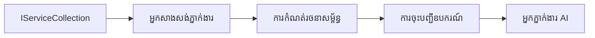

# 🎨 រចនាប័ទ្ម Agentic ជាមួយ Azure OpenAI (Responses API) (.NET)

## 📋 គោលបំណងរៀន

អ្នកនឹងឃើញឧទាហរណ៍នេះបង្ហាញពីរចនាប័ទ្មថ្នាក់សហគ្រាសសម្រាប់ការសាងសង់ភ្នាក់ងារឆ្លាតវៃដោយប្រើ Microsoft Agent Framework ក្នុង .NET ជាមួយការរួមបញ្ចូល Azure OpenAI (Responses API)។ អ្នកនឹងរៀនពីរចនាប័ទ្មវិជ្ជាជីវៈ និងទ្រឹស្តីស្ថាបត្យកម្មដែលធ្វើឲ្យភ្នាក់ងាររួមបញ្ចូលក្នុងផលិតកម្ម ភាពងាយស្រួលថែរក្សា និងអាចពង្រីកបាន។

### រចនាប័ទ្មសហគ្រាស

- 🏭 **Factory Pattern**: ការបង្កើតភ្នាក់ងារតាមស្តង់ដារជាមួយការបញ្ចូលអាស្រ័យ
- 🔧 **Builder Pattern**: ការកំណត់កំណែកភ្នាក់ងារជារលូន និងការតំឡើង
- 🧵 **Thread-Safe Patterns**: ការគ្រប់គ្រងការសន្ទនាប្រកបដោយការប្រកួតប្រជែង
- 📋 **Repository Pattern**: ការរៀបចំគ្រប់គ្រងឧបករណ៍ និងសមត្ថភាព

## 🎯 បម្រែបម្រួលស្ថាបត្យកម្មជាក់លាក់សម្រាប់ .NET

### លក្ខណៈពិសេសសហគ្រាស

- **Typing ខ្លាំង**: ការផ្ទៀងផ្ទាត់នៅពេលកំចាត់កូដ និងការគាំទ្រ IntelliSense
- **Dependency Injection**: ការរួមបញ្ចូលធុង DI ដែលមានស្រាប់
- **Configuration Management**: លំនាំ IConfiguration និង Options
- **Async/Await**: ការគាំទ្រ​កម្មវិធីមិនស្តុកស្តម្ភជាន់ដំបូង

### រចនាប័ទ្មរួចក្រោយសម្រាប់ផលិតកម្ម

- **Logging Integration**: ILogger និងការកត់ត្រាច្បាប់រៀបរយ
- **Health Checks**: ការត្រួតពិនិត្យ និងវាយតម្លៃក្នុងសំណុំសំណួរ
- **Configuration Validation**: Typing ខ្លាំងជាមួយអត្ថបទអាគុយម៉ង់
- **Error Handling**: ការគ្រប់គ្រងករណីករណីខុស

## 🔧 ស្ថាបត្យកម្មបច្ចេកទេស

### ធាតុគ្រឹះ .NET

- **Microsoft.Extensions.AI**: សេវាសង្គម AI សម្រួលរួម
- **Microsoft.Agents.AI**: ស៊ុមផ្នែកសហគ្រាសសម្រាប់ភ្នាក់ងារ
- **Azure OpenAI (Responses API)**: រចនាប័ទ្មអតិភាពកម្រិតខ្ពស់សម្រាប់ API client
- **ប្រព័ន្ធកំណត់រចនាសម្ព័ន្ធ**: appsettings.json និងការរួមបញ្ចូលនៅបរិវេណ

### ការអនុវត្តរចនាប័ទ្ម



## 🏗️ រចនាប័ទ្មសហគ្រាសដែលបានបង្ហាញ

### 1. **រចនាប័ទ្មបង្កើត**

- **Agent Factory**: ការបង្កើតភ្នាក់ងារកណ្តាលជាមួយការកំណត់រចនាសម្ព័ន្ធបន្តបន្ទាប់
- **Builder Pattern**: API រលូនសម្រាប់ការកំណត់រចនាសម្ព័ន្ធភ្នាក់ងារដោយស្មុគស្មាញ
- **Singleton Pattern**: ការគ្រប់គ្រងធនធានរួម និងរចនាសម្ព័ន្ធ
- **Dependency Injection**: ការចាក់សោផលិតកម្ម និងសមត្ថភាពសាកល្បង

### 2. **រចនាប័ទ្មអាកប្បកិរិយា**

- **Strategy Pattern**: យុទ្ធសាស្ត្របង្កើតឧបករណ៍អាចប្ដូរ
- **Command Pattern**: ប្រតិបត្តិការភ្នាក់ងារដែលបានបញ្ចូលជាសំណុំនឹង undo/redo
- **Observer Pattern**: ការគ្រប់គ្រងរយៈពេលជីវិតភ្នាក់ងារតាមព្រឹត្តិការណ៍
- **Template Method**: សេចក្តីរៀបចំកំណត់ដែលបានស្តង់ដារ

### 3. **រចនាប័ទ្មរចនាសម្ព័ន្ធ**

- **Adapter Pattern**: ស្រទាប់រួមបញ្ចូល Azure OpenAI (Responses API)
- **Decorator Pattern**: ការកែលម្អសមត្ថភាពភ្នាក់ងារ
- **Facade Pattern**: រូបមន្តចូលរួមងាយស្រួលសម្រាប់ភ្នាក់ងារ
- **Proxy Pattern**: ការធ្វើបញ្ចូលយឺត និងការបង្កង់ cache សម្រាប់បង្កើនការអនុវត្ត

## 📚 គោលការណ៍រចនា .NET

### គោលការណ៍ SOLID

- **Single Responsibility**: ធាតុទាំងអស់មានគោលបំណងច្បាស់លាស់មួយ
- **Open/Closed**: អាចពង្រីកបានដោយគ្មានការកែប្រែ
- **Liskov Substitution**: ការអនុវត្តឧបករណ៍បែបផ្ទាំងបញ្ជាក់
- **Interface Segregation**: ផ្ទាំងបញ្ជាក់ផ្តោត និងសម្រួល
- **Dependency Inversion**: អាស្រ័យលើរូបមន្តមិនមែនសំរាប់រាល់តែមួយ

### ស្ថាបត្យកម្មស្អាត

- **Domain Layer**: រូបមន្តភ្នាក់ងារព្រមទាំងឧបករណ៍មូលដ្ឋាន
- **Application Layer**: ការរៀបចំភ្នាក់ងារនិងសេចក្តីរៀបចំធ្វើការ
- **Infrastructure Layer**: រួមបញ្ចូល Azure OpenAI (Responses API) និងសេវាកម្មខាងក្រៅ
- **Presentation Layer**: ការប្រើប្រាស់របៀបប្រើផ្ទាល់ នឹងបដិសេធន៍ចំលើយ

## 🔒 ការពិចារណាសហគ្រាស

### សុវត្តភាព

- **Credential Management**: ការគ្រប់គ្រងកូនសោ API មិនឲ្យចេញក្រៅដៃជាមួយ IConfiguration
- **Input Validation**: Typing ខ្លាំង និងការត្រួតពិនិត្យអត្ថបទអាគុយម៉ង់
- **Output Sanitization**: ការបញ្ជ្រាបដាក់សុវត្តិភាពនៃចំលើយ និងការត្រួតបរិដ្ឋាន
- **Audit Logging**: ការតាមដានប្រតិបត្តិការយ៉ាងទូលំទូលាយ

### សមត្ថភាព

- **Async Patterns**: ប្រតិបត្តិការ I/O មិនរាំងខ្ទបទេ
- **Connection Pooling**: ការគ្រប់គ្រង HTTP client ដោយមានប្រសិទ្ធភាព
- **Caching**: ការចងក្រងចំលើយសម្រាប់កែលំអសមត្ថភាព
- **Resource Management**: ការបោះបង់ និងសម្អាតធនធានត្រឹមត្រូវ

### ការអាចពង្រីកបាន

- **Thread Safety**: ការគាំទ្រការប្រតិបត្តិភ្នាក់ងារជាប្រកួតប្រជែង
- **Resource Pooling**: ការប្រើប្រាស់ធនធានមានប្រសិទ្ធភាព
- **Load Management**: ការបង្កប់អត្រានិងការគ្រប់គ្រងសំពាធក្រោយ
- **Monitoring**: គន្លងវិស័យសមត្ថភាព និងការត្រួតពិនិត្យសុខភាព

## 🚀 ការបញ្ចេញផលិតផល

- **Configuration Management**: ការកំណត់បរិវេណឯកសារ
- **Logging Strategy**: ការកត់ត្រាបែបរៀបរយជាមួយអត្តសញ្ញាណបង្កប់
- **Error Handling**: ការគ្រប់គ្រងករណីករណីជាសកលជាមួយកម្ចាត់បានត្រឹមត្រូវ
- **Monitoring**: ការតាមដានកម្មវិធី និងករណីប្រសិទ្ធភាព
- **Testing**: ការប្រឡងឯកតា ការសម្លាញ់រួម និងរចនាប័ទ្មសាកល្បងសំពាធ

តើអ្នករួចរាល់ក្នុងការសង់ភ្នាក់ងារឆ្លាតវៃថ្នាក់សហគ្រាសជាមួយ .NET ចង់បង្កើតអ្វីមួយរឹងមាំ? 🏢✨

## 🚀 ការចាប់ផ្តើម

### គោលដៅមុន

- [.NET 10 SDK](https://dotnet.microsoft.com/download/dotnet/10.0) ឬខ្ពស់ជាងនេះ
- បណ្ដាញ [Azure subscription](https://azure.microsoft.com/free/) មានធនធាន Azure OpenAI និងការចែកចាយម៉ូដែល
- [Azure CLI](https://learn.microsoft.com/cli/azure/install-azure-cli) — ចូលប្រើប្រាស់ជាមួយ `az login`

### មូលដ្ឋានបរិវេណត្រូវការ

```bash
# zsh/bash
export AZURE_OPENAI_ENDPOINT=https://<your-resource>.openai.azure.com
export AZURE_OPENAI_DEPLOYMENT=gpt-5-mini
# បន្ទាប់មកចូលគណនី ដើម្បីឲ្យ AzureCliCredential អាចទទួលបានស្លាកសម្គាល់(token)បាន
az login
```

```powershell
# PowerShell
$env:AZURE_OPENAI_ENDPOINT = "https://<your-resource>.openai.azure.com"
$env:AZURE_OPENAI_DEPLOYMENT = "gpt-5-mini"
# បន្ទាប់មកបញ្ចូលឈ្មោះអ្នកប្រើដើម្បីឲ្យ AzureCliCredential អាចទទួលបានស្លាកសុវត្ថិភាពបាន
az login
```

### ឧទាហរណ៍កូដ

ដើម្បីរត់ឧទាហរណ៍កូដ,

```bash
# zsh/bash
chmod +x ./03-dotnet-agent-framework.cs
./03-dotnet-agent-framework.cs
```

ឬប្រើ dotnet CLI:

```bash
dotnet run ./03-dotnet-agent-framework.cs
```

សូមមើល [`03-dotnet-agent-framework.cs`](../../../../03-agentic-design-patterns/code_samples/03-dotnet-agent-framework.cs) សម្រាប់កូដពេញលេញ។

```csharp
#!/usr/bin/dotnet run

#:package Microsoft.Extensions.AI@10.*
#:package Microsoft.Agents.AI.OpenAI@1.*-*
#:package Azure.AI.OpenAI@2.1.0
#:package Azure.Identity@1.13.1

using System.ComponentModel;

using Microsoft.Agents.AI;
using Microsoft.Extensions.AI;

using Azure.AI.OpenAI;
using Azure.Identity;

// Tool Function: Random Destination Generator
// This static method will be available to the agent as a callable tool
// The [Description] attribute helps the AI understand when to use this function
// This demonstrates how to create custom tools for AI agents
[Description("Provides a random vacation destination.")]
static string GetRandomDestination()
{
    // List of popular vacation destinations around the world
    // The agent will randomly select from these options
    var destinations = new List<string>
    {
        "Paris, France",
        "Tokyo, Japan",
        "New York City, USA",
        "Sydney, Australia",
        "Rome, Italy",
        "Barcelona, Spain",
        "Cape Town, South Africa",
        "Rio de Janeiro, Brazil",
        "Bangkok, Thailand",
        "Vancouver, Canada"
    };

    // Generate random index and return selected destination
    // Uses System.Random for simple random selection
    var random = new Random();
    int index = random.Next(destinations.Count);
    return destinations[index];
}

// Azure OpenAI with the Responses API (stable v1 endpoint). Sign in with `az login`.
var azureEndpoint = Environment.GetEnvironmentVariable("AZURE_OPENAI_ENDPOINT")
    ?? throw new InvalidOperationException("AZURE_OPENAI_ENDPOINT is not set.");
var deployment = Environment.GetEnvironmentVariable("AZURE_OPENAI_DEPLOYMENT") ?? "gpt-5-mini";

var azureClient = new AzureOpenAIClient(new Uri(azureEndpoint), new AzureCliCredential());

// Define Agent Identity and Comprehensive Instructions
// Agent name for identification and logging purposes
var AGENT_NAME = "TravelAgent";

// Detailed instructions that define the agent's personality, capabilities, and behavior
// This system prompt shapes how the agent responds and interacts with users
var AGENT_INSTRUCTIONS = """
You are a helpful AI Agent that can help plan vacations for customers.

Important: When users specify a destination, always plan for that location. Only suggest random destinations when the user hasn't specified a preference.

When the conversation begins, introduce yourself with this message:
"Hello! I'm your TravelAgent assistant. I can help plan vacations and suggest interesting destinations for you. Here are some things you can ask me:
1. Plan a day trip to a specific location
2. Suggest a random vacation destination
3. Find destinations with specific features (beaches, mountains, historical sites, etc.)
4. Plan an alternative trip if you don't like my first suggestion

What kind of trip would you like me to help you plan today?"

Always prioritize user preferences. If they mention a specific destination like "Bali" or "Paris," focus your planning on that location rather than suggesting alternatives.
""";

// Create AI Agent with Advanced Travel Planning Capabilities
// Get the Responses client for the deployment and create the AI agent
// Configure agent with name, detailed instructions, and available tools
// This demonstrates the .NET agent creation pattern with full configuration
AIAgent agent = azureClient
    .GetChatClient(deployment)
    .AsAIAgent(
        name: AGENT_NAME,
        instructions: AGENT_INSTRUCTIONS,
        tools: [AIFunctionFactory.Create(GetRandomDestination)]
    );

// Create New Conversation Session for Context Management
// Initialize a new conversation session to maintain context across multiple interactions
// Sessions enable the agent to remember previous exchanges and maintain conversational state
// This is essential for multi-turn conversations and contextual understanding
var session = await agent.CreateSessionAsync();

// Execute Agent: First Travel Planning Request
// Run the agent with an initial request that will likely trigger the random destination tool
// The agent will analyze the request, use the GetRandomDestination tool, and create an itinerary
// Using the session parameter maintains conversation context for subsequent interactions
await foreach (var update in agent.RunStreamingAsync("Plan me a day trip", session))
{
    await Task.Delay(10);
    Console.Write(update);
}

Console.WriteLine();

// Execute Agent: Follow-up Request with Context Awareness
// Demonstrate contextual conversation by referencing the previous response
// The agent remembers the previous destination suggestion and will provide an alternative
// This showcases the power of conversation sessions and contextual understanding in .NET agents
await foreach (var update in agent.RunStreamingAsync("I don't like that destination. Plan me another vacation.", session))
{
    await Task.Delay(10);
    Console.Write(update);
}
```

---

<!-- CO-OP TRANSLATOR DISCLAIMER START -->
**ការបដិសេធ**:
ឯកសារនេះត្រូវបានបម្លែងភាសា ដោយប្រើសេវាបម្លែងភាសា AI [Co-op Translator](https://github.com/Azure/co-op-translator)។ ទោះយើងខ្ញុំមានក្តីប្រាថ្នាឱ្យបានច្បាស់លាស់ តែសូមយល់ដឹងថាការបម្លែងដោយស្វ័យប្រវត្តិក៏អាចមានកំហុសឬភាពមិនត្រឹមត្រូវ។ ឯកសារដើមជាភាសាទីតាំងគួរត្រូវបានគេប្រើជាប្រភពច្បាស់លាស់។ សម្រាប់ព័ត៌មានសំខាន់ៗ សូមណែនាំឱ្យប្រើប្រាស់ការប្រែដោយមនុស្សជំនាញ។ យើងខ្ញុំមិនទទួលខុសត្រូវចំពោះការយល់ច្រឡំ ឬការបកស្រាយខុសបន្ទាប់ពីការប្រើប្រាស់ការបម្លែងនេះនោះទេ។
<!-- CO-OP TRANSLATOR DISCLAIMER END -->