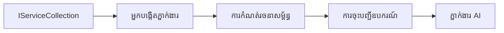

# 🎨 លំនាំរចនាសម្ព័ន្ធ Agentic ជាមួយ Azure OpenAI (Responses API) (.NET)

## 📋 គោលបំណងរៀន

ឧទាហរណ៍នេះបង្ហាញពីលំនាំរចនាសម្ព័ន្ធថ្នាក់សហគ្រាសសម្រាប់កសាងភ្នាក់ងារបញ្ញាជំនាញដោយប្រើ Microsoft Agent Framework ក្នុង .NET ជាមួយការរួមបញ្ចូល Azure OpenAI (Responses API)។ អ្នកនិងរៀនលំនាំវិជ្ជាជីវៈ និងវិធីសាស្រ្តរចនាសម្ព័ន្ធដែលធ្វើឱ្យភ្នាក់ងារចាំបាច់សម្រាប់កម្មវិធីផលិតកម្ម អាចថែរក្សា និងបំពាក់វាសម្រាប់បន្ថែមទំហំបាន។

### លំនាំរចនាសម្ព័ន្ធសហគ្រាស

- 🏭 **លំនាំរោងចក្រ**: ការបង្កើតភ្នាក់ងារតាមរយៈក្ដារចាក់ទ្រង់ទ្រាយ (dependency injection)
- 🔧 **លំនាំអ្នកសាងសង់**: ការកំណត់រចនាសម្ព័ន្ធភ្នាក់ងារយ៉ាងរលូន
- 🧵 **លំនាំ Thread-Safe**: ការគ្រប់គ្រងការសន្ទនាប្រចាំ
- 📋 **លំនាំ Repository**: ការរៀបចំគ្រប់គ្រងឧបករណ៍ និងសមត្ថភាព

## 🎯 អត្ថប្រយោជន៍ស្ថាបត្យកម្មជាក់លាក់ .NET

### លក្ខណៈសហគ្រាស

- **ការតំណត់ប្រភេទមឺនៗ**: ការផ្ទៀងផ្ទាត់នៅពេលបំលែងកូដ និងការគាំទ្រ IntelliSense
- **កញ្ចប់ក្ដារចាក់**: ការរួមបញ្ចូល DI ដើម្បីគ្រប់គ្រង​គ្រឿងផ្សំ​ទាំងក្នុង
- **ការគ្រប់គ្រងរចនាសម្ព័ន្ធ**: IConfiguration និងលំនាំ Options
- **Async/Await**: ការគាំទ្រកម្មវិធីអាសន្នថ្នាក់ដំបូង

### លំនាំត្រៀមផលិតកម្ម

- **ការរួមបញ្ចូលកំណត់ហេតុ**: ILogger និងកំណត់ហេតុមានរចនាសម្ព័ន្ធ
- **ការត្រួតពិនិត្យសុខភាព**: ការត្រួតពិនិត្យ និងវាស់វែងក្នុងស្ថាបត្យកម្ម
- **ការផ្ទៀងផ្ទាត់រចនាសម្ព័ន្ធ**: ការតំណត់ប្រភេទខ្លាំងជាមួយអត្តសញ្ញាណទិន្នន័យ
- **ការគ្រប់គ្រងកំហុស**: ការគ្រប់គ្រងស្ថិតិចល័តនៃកំហុសមានរចនាសម្ព័ន្ធ

## 🔧 ស្ថាបត្យកម្មបច្ចេកទេស

### ធាតុ .NET តម្រង់ខ្សែមូលដ្ឋាន

- **Microsoft.Extensions.AI**: ការតំណាងសេវា AI សរុប
- **Microsoft.Agents.AI**: សំណុំស្តើងហ្គ្រាំភ្នាក់ងារថ្នាក់សហគ្រាស
- **Azure OpenAI (Responses API)**: លំនាំអតិថិជន API ប្រសិទ្ធភាពខ្ពស់
- **ប្រព័ន្ធរចនាសម្ព័ន្ធ**: appsettings.json និងការរួមបញ្ចូលបរិយាកាស

### ការអនុវត្តលំនាំរចនាសម្ព័ន្ធ



## 🏗️ លំនាំសហគ្រាសបង្ហាញ

### 1. **លំនាំ​បង្កើត**

- **រោងចក្រ​ភ្នាក់ងារ**: ការបង្កើតភ្នាក់ងារមជ្ឈិមសម្រាប់ការកំណត់រចនាសម្ព័ន្ធស៊ីជម្រៅ
- **លំនាំអ្នកសាងសង់**: API រលូនសម្រាប់ការកំណត់រចនាសម្ព័ន្ធភ្នាក់ងារពិបាក
- **លំនាំ Singleton**: ការចែករំលែកធនធាន និងការគ្រប់គ្រងរចនាសម្ព័ន្ធ
- **កញ្ចប់ក្ដារចាក់**: ការតភ្ជាប់ទាន់ពេល និងសាកល្បងបានងាយ

### 2. **លំនាំអាកប្បកិរិយា**

- **លំនាំយុទ្ធសាស្ត្រ**: យុទ្ធសាស្ត្រប្រតិបត្តិការឧបករណ៍អាចប្ដូរបាន
- **លំនាំពាក្យបញ្ជា**: ប្រតិបត្តិការភ្នាក់ងារដែលកញ្ចប់ជាមួយការលុប/ធ្វើម្តងទៀត
- **លំនាំអ្នកតាមដាន**: ការគ្រប់គ្រងជីវិតភ្នាក់ងាររូបភាពហេតុការណ៍
- **វិធីសាស្ត្រអក្សរគំរូ**: វិធីសាស្ត្របញ្ចូលបែបស្តង់ដារ

### 3. **លំនាំសំណុំនិងរចនាសម្ព័ន្ធ**

- **លំនាំអ្នកបំលាស់**: ស្រទាប់រួមបញ្ចូល Azure OpenAI (Responses API)
- **លំនាំអ្នកតាំងពង្រីក**: ការកែលម្អសមត្ថភាពភ្នាក់ងារ
- **លំនាំផ្ទាំងមុខ**: វិចិត្រសាស្ត្របែបងាយស្រួលអន្តរកម្មភ្នាក់ងារ
- **លំនាំភ្នាក់ងារផ្ទាល់**: ការផ្ទុកយឺត និងបង្គន់សម្រាប់ប្រសិទ្ធភាព

## 📚 គោលនយោបាយរចនាសម្ព័ន្ធ .NET

### គោលការណ៍ SOLID

- **ការទទួលខុសត្រូវតែមួយ**: មនុស្សណាពីរដោយមានបំណងច្បាស់លាស់
- **បើក/បិទ**: អាចបន្ថែមបន្ថែមដោយមិនប៉ះពាល់
- **ការប្តូរជំនួស Liskov**: ការអនុវត្តឧបករណ៍ដោយផ្អែកលើចំណុចប្រទាក់
- **ការបំបែកចំណុចប្រទាក់**: ចំណុចប្រទាក់មានមុខងារតូចតាចរ
- **ការបត់បែនកញ្ចប់**: រំពឹងលើការតំណាងមិនមែនវិវរណៈ

### ស្ថាបត្យកម្មស្អាត

- **ស្រទាប់ Domain**: អាចប្រើបានគ្រប់គ្រងភ្នាក់ងារ និងឧបករណ៍
- **ស្រទាប់កម្មវិធី**: ការត្រួតត្រាការប្រតិបត្តិភ្នាក់ងារ និងដំណើរការ
- **ស្រទាប់ហេដ្ឋារចនាសម្ព័ន្ធ**: ការរួមបញ្ចូល Azure OpenAI (Responses API) និងសេវាកម្មខាងក្រៅ
- **ស្រទាប់បង្ហាញ**: អន្តរកម្មអ្នកប្រើ និងការរៀបរួមចំលើយ

## 🔒 ការពិចារណាសហគ្រាស

### សុវត្ថិភាព

- **ការគ្រប់គ្រងគណនី**: ការដោះសោ API key សុវត្ថិភាពជាមួយ IConfiguration
- **ការផ្ទៀងផ្ទាត់បញ្ចូល**: ការតំណត់ប្រភេទខ្លាំង និងការផ្ទៀងផ្ទាត់ពត៌មាន
- **ការសំអាតចេញ**: ការប្រតិបត្ដិចំលើយដោយសុវត្ថិភាព និងការត្រង់
- **កំណត់ហេតុតាម Audit**: ការតាមដានប្រតិបត្តិការ​យ៉ាងទូលំទូលាយ

### ប្រសិទ្ធភាព

- **លំនាំ​អាសន្ន**: ប្រតិបត្តិការមិនរាំងខ្សែ I/O
- **ការគ្រប់គ្រងហាងភាគហ៊ុន**: ការគ្រប់គ្រងអតិថិជន HTTP ប្រសិទ្ធិភាព
- **ការផ្ទុកបន្តិច**: ការផ្ទុកចំលើយសម្រាប់ការកែលម្អប្រសិទ្ធភាព
- **ការគ្រប់គ្រងធនធាន**: លំនាំលុបចោល និងសម្អាតត្រឹមត្រូវ

### ការពង្រីក

- **សុវត្ថិភាព Thread**: ការគាំទ្រការប្រតិបត្តិភ្នាក់ងារ​តាមរយៈជួរដំណើរ
- **ការគ្រប់គ្រងហាងធនធាន**: ការប្រើប្រាស់ធនធានមានប្រសិទ្ធិភាព
- **ការគ្រប់គ្រងទម្រង់បន្ទុក**: ការកំណត់​សីតុណ្ហភាព និងការគ្រប់គ្រងព្យួរខ្សែ
- **ការត្រួតពិនិត្យ**: គណៈវិមានប្រសិទ្ធភាព និងការត្រួតពិនិត្យសុខភាព

## 🚀 ដាក់ប្រើផលិតកម្ម

- **ការគ្រប់គ្រងរចនាសម្ព័ន្ធ**: ការកំណត់បរិយាកាសជាក់លាក់
- **យុទ្ធសាស្តុកំណត់ហេតុ**: កំណត់ហេតុមានរចនាសម្ព័ន្ធជាមួយអត្តសញ្ញាណទាក់ទង
- **ការគ្រប់គ្រងកំហុស**: ការគ្រប់គ្រងករណីបញ្ហាជាសកលជាមួយការជួសជុលត្រឹមត្រូវ
- **ការត្រួតពិនិត្យ**: ការប្រកាសកម្មវិធី និងគណៈវិមានប្រសិទ្ធភាព
- **ការប្រឡង**: តេស្តឯកតា, តេស្តរួមបញ្ចូល, និងលំនាំតេស្តទម្រង់បន្ទុក

រៀបចំដើម្បីកសាងភ្នាក់ងារបញ្ញាជំនាញថ្នាក់សហគ្រាសជាមួយ .NET ទេ? ចូររចនាស្ថាបត្យកម្មខ្លាំងមួយ! 🏢✨

## 🚀 ចាប់ផ្តើម

### លក្ខខណ្ឌ​ជាមុន

- [.NET 10 SDK](https://dotnet.microsoft.com/download/dotnet/10.0) ឬខ្ពស់ជាងនេះ
- ការជាវសេវា [Azure](https://azure.microsoft.com/free/) មានធនធាន Azure OpenAI និងការចេញផ្សាយម៉ូដែល
- កម្មវិធី [Azure CLI](https://learn.microsoft.com/cli/azure/install-azure-cli) — ចុះឈ្មោះជាមួយ `az login`

### អថេរបរិយាកាសដែលតម្រូវការ

```bash
# zsh/bash
export AZURE_OPENAI_ENDPOINT=https://<your-resource>.openai.azure.com
export AZURE_OPENAI_DEPLOYMENT=gpt-4.1-mini
# បន្ទាប់មកចូលប្រើ ដូច្នេះ AzureCliCredential អាចទទួលបានសញ្ញាសារដ្ឋធម្មនុញ្ញបាន
az login
```

```powershell
# PowerShell
$env:AZURE_OPENAI_ENDPOINT = "https://<your-resource>.openai.azure.com"
$env:AZURE_OPENAI_DEPLOYMENT = "gpt-4.1-mini"
# បន្ទាប់មកចុះឈ្មោះដើម្បីឱ្យ AzureCliCredential អាចទទួលបានស្លាកសញ្ញា(token)
az login
```

### កូដឧទាហរណ៍

ដើម្បីដំណើរការឧទាហរណ៍កូដ,

```bash
# zsh/bash
chmod +x ./03-dotnet-agent-framework.cs
./03-dotnet-agent-framework.cs
```

ឬប្រើ dotnet CLI:

```bash
dotnet run ./03-dotnet-agent-framework.cs
```

មើល[`03-dotnet-agent-framework.cs`](../../../../03-agentic-design-patterns/code_samples/03-dotnet-agent-framework.cs) សម្រាប់កូដពេញលេញ។

```csharp
#!/usr/bin/dotnet run

#:package Microsoft.Extensions.AI@10.*
#:package Microsoft.Agents.AI.OpenAI@1.*-*
#:package Azure.AI.OpenAI@2.1.0
#:package Azure.Identity@1.13.1

using System.ComponentModel;

using Microsoft.Agents.AI;
using Microsoft.Extensions.AI;

using Azure.AI.OpenAI;
using Azure.Identity;

// Tool Function: Random Destination Generator
// This static method will be available to the agent as a callable tool
// The [Description] attribute helps the AI understand when to use this function
// This demonstrates how to create custom tools for AI agents
[Description("Provides a random vacation destination.")]
static string GetRandomDestination()
{
    // List of popular vacation destinations around the world
    // The agent will randomly select from these options
    var destinations = new List<string>
    {
        "Paris, France",
        "Tokyo, Japan",
        "New York City, USA",
        "Sydney, Australia",
        "Rome, Italy",
        "Barcelona, Spain",
        "Cape Town, South Africa",
        "Rio de Janeiro, Brazil",
        "Bangkok, Thailand",
        "Vancouver, Canada"
    };

    // Generate random index and return selected destination
    // Uses System.Random for simple random selection
    var random = new Random();
    int index = random.Next(destinations.Count);
    return destinations[index];
}

// Azure OpenAI with the Responses API (stable v1 endpoint). Sign in with `az login`.
var azureEndpoint = Environment.GetEnvironmentVariable("AZURE_OPENAI_ENDPOINT")
    ?? throw new InvalidOperationException("AZURE_OPENAI_ENDPOINT is not set.");
var deployment = Environment.GetEnvironmentVariable("AZURE_OPENAI_DEPLOYMENT") ?? "gpt-4.1-mini";

var azureClient = new AzureOpenAIClient(new Uri(azureEndpoint), new AzureCliCredential());

// Define Agent Identity and Comprehensive Instructions
// Agent name for identification and logging purposes
var AGENT_NAME = "TravelAgent";

// Detailed instructions that define the agent's personality, capabilities, and behavior
// This system prompt shapes how the agent responds and interacts with users
var AGENT_INSTRUCTIONS = """
You are a helpful AI Agent that can help plan vacations for customers.

Important: When users specify a destination, always plan for that location. Only suggest random destinations when the user hasn't specified a preference.

When the conversation begins, introduce yourself with this message:
"Hello! I'm your TravelAgent assistant. I can help plan vacations and suggest interesting destinations for you. Here are some things you can ask me:
1. Plan a day trip to a specific location
2. Suggest a random vacation destination
3. Find destinations with specific features (beaches, mountains, historical sites, etc.)
4. Plan an alternative trip if you don't like my first suggestion

What kind of trip would you like me to help you plan today?"

Always prioritize user preferences. If they mention a specific destination like "Bali" or "Paris," focus your planning on that location rather than suggesting alternatives.
""";

// Create AI Agent with Advanced Travel Planning Capabilities
// Get the Responses client for the deployment and create the AI agent
// Configure agent with name, detailed instructions, and available tools
// This demonstrates the .NET agent creation pattern with full configuration
AIAgent agent = azureClient
    .GetChatClient(deployment)
    .AsAIAgent(
        name: AGENT_NAME,
        instructions: AGENT_INSTRUCTIONS,
        tools: [AIFunctionFactory.Create(GetRandomDestination)]
    );

// Create New Conversation Session for Context Management
// Initialize a new conversation session to maintain context across multiple interactions
// Sessions enable the agent to remember previous exchanges and maintain conversational state
// This is essential for multi-turn conversations and contextual understanding
var session = await agent.CreateSessionAsync();

// Execute Agent: First Travel Planning Request
// Run the agent with an initial request that will likely trigger the random destination tool
// The agent will analyze the request, use the GetRandomDestination tool, and create an itinerary
// Using the session parameter maintains conversation context for subsequent interactions
await foreach (var update in agent.RunStreamingAsync("Plan me a day trip", session))
{
    await Task.Delay(10);
    Console.Write(update);
}

Console.WriteLine();

// Execute Agent: Follow-up Request with Context Awareness
// Demonstrate contextual conversation by referencing the previous response
// The agent remembers the previous destination suggestion and will provide an alternative
// This showcases the power of conversation sessions and contextual understanding in .NET agents
await foreach (var update in agent.RunStreamingAsync("I don't like that destination. Plan me another vacation.", session))
{
    await Task.Delay(10);
    Console.Write(update);
}
```

---

<!-- CO-OP TRANSLATOR DISCLAIMER START -->
**ការបដិសេធ**:
ឯកសារនេះត្រូវបានបម្លែងភាសា ដោយប្រើសេវាបម្លែងភាសា AI [Co-op Translator](https://github.com/Azure/co-op-translator)។ ទោះយើងខ្ញុំមានក្តីប្រាថ្នាឱ្យបានច្បាស់លាស់ តែសូមយល់ដឹងថាការបម្លែងដោយស្វ័យប្រវត្តិក៏អាចមានកំហុសឬភាពមិនត្រឹមត្រូវ។ ឯកសារដើមជាភាសាទីតាំងគួរត្រូវបានគេប្រើជាប្រភពច្បាស់លាស់។ សម្រាប់ព័ត៌មានសំខាន់ៗ សូមណែនាំឱ្យប្រើប្រាស់ការប្រែដោយមនុស្សជំនាញ។ យើងខ្ញុំមិនទទួលខុសត្រូវចំពោះការយល់ច្រឡំ ឬការបកស្រាយខុសបន្ទាប់ពីការប្រើប្រាស់ការបម្លែងនេះនោះទេ។
<!-- CO-OP TRANSLATOR DISCLAIMER END -->