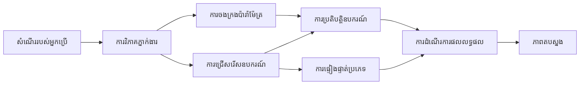

# 🛠️ ការប្រើប្រាស់ឧបករណ៍ជំនាញជាមួយ Azure OpenAI (Responses API) (.NET)

## 📋 គោលបំណងការសិក្សា

សៀវភៅកំណត់ចំណាំនេះបង្ហាញពីលំនាំការបញ្ចូលឧបករណ៍កម្រិតសហគ្រាសប្រើប្រាស់ Microsoft Agent Framework ក្នុង .NET ជាមួយ Azure OpenAI (Responses API)។ អ្នកនឹងរៀនកសាងភ្នាក់ងារដែលមានជំនាញខ្ពស់ជាមួយឧបករណ៍ជាច្រើនដែលមានជំនាញជាក់លាក់ ដោយប្រើប្រាស់ការបញ្ជាក់ប្រភេទខ្លាំងរបស់ C# និងមុខងាររបស់ .NET សម្រាប់សហគ្រាស។

### សមត្ថភាពឧបករណ៍ជំនាញដែលអ្នកនឹងច掌握

- 🔧 **រចនាសម្ព័ន្ធឧបករណ៍ច្រើន**: ការសាងសង់ភ្នាក់ងារជាមួយសមត្ថភាពជាច្រើនជាក់លាក់
- 🎯 **ការប្រតិបត្តិឧបករណ៍មានប្រភេទសុវត្ថិភាព**: ប្រើប្រាស់ការផ្ទៀងផ្ទាត់ពេលបម្លែងរបស់ C#
- 📊 **លំនាំឧបករណ៍សហគ្រាស**: ការរចនាឧបករណ៍សម្រាប់ផលិតកម្ម និងការគ្រប់គ្រងកំហុស
- 🔗 **ការរួមបញ្ចូលឧបករណ៍**: ការរួមបញ្ចូលឧបករណ៍សម្រាប់ដំណើរការអាជីវកម្មស្មុគស្មាញ

## 🎯 អត្ថប្រយោជន៍រចនាសម្ព័ន្ធឧបករណ៍ .NET

### មុខងារឧបករណ៍សហគ្រាស

- **ការផ្ទៀងផ្ទាត់ពេលបម្លែង**: ការបញ្ជាក់ប្រភេទខ្លាំងធានាថាតម្លៃប៉ារ៉ាមែត្រដែលត្រឹមត្រូវ
- **ការចាក់បញ្ចូលការពឹងផ្អែក**: ការរួមបញ្ចូលកុងតឺន័រ IoC សម្រាប់ការគ្រប់គ្រងឧបករណ៍
- **លំនាំ Async/Await**: ការប្រតិបត្តិឧបករណ៍ដែលមិនរាំងខ្សែ ដោយគ្រប់គ្រងធនធានបានល្អ
- **កំណត់ហេតុរចនាសម្ព័ន្ធ**: ការរួមបញ្ចូលកំណត់ហេតុក្នុងសម្រាប់តាមដានការប្រតិបត្តិឧបករណ៍

### លំនាំសម្រាប់ផលិតកម្ម

- **ការគ្រប់គ្រងករណីកំហុស**: ការគ្រប់គ្រងកំហុសពេញលេញជាមួយករណីកំហុសដែលបានបញ្ជាក់ប្រភេទ
- **ការគ្រប់គ្រងធនធាន**: លំនាំលុបចោលត្រឹមត្រូវ និងការគ្រប់គ្រងអង្គចងចាំ
- **ការតាមដានសមត្ថភាព**: គន្លងព័ត៌មាននិងម៉ែត្រសមត្ថភាពកាន់តែប្រសើរ
- **ការគ្រប់គ្រងការកំណត់តម្លៃ**: ការកំណត់តម្លៃដែលមានប្រភេទសុវត្ថិភាពជាមួយការផ្ទៀងផ្ទាត់

## 🔧 រចនាសម្ព័ន្ធបច្ចេកទេស

### កម្រិតគ្រឹះឧបករណ៍ .NET

- **Microsoft.Extensions.AI**: ស្រទាប់បង្ហាញឧបករណ៍រួម
- **Microsoft.Agents.AI**: ការគ្រប់គ្រងឧបករណ៍កម្រិតសហគ្រាស
- **Azure OpenAI (Responses API)**: អតិថិជន API ដល់ល្បឿនខ្ពស់ជាមួយការបង្ហូរតភ្ជាប់

### ផ្លូវបញ្ជា​ប្រតិបត្តិឧបករណ៍



## 🛠️ ប្រភេទឧបករណ៍ និងលំនាំ

### 1. **ឧបករណ៍ដំណើរការទិន្នន័យ**

- **ការផ្ទៀងផ្ទាត់បញ្ចូល**: ការបញ្ជាក់ប្រភេទខ្លាំងជាមួយបញ្ជាក់ទិន្នន័យ
- **ប្រតិបត្តិការបម្លែង**: ការបម្លែងទិន្នន័យដែលមានប្រភេទសុវត្ថិភាព និងការបង្ហាញទ្រង់ទ្រាយ
- **តេឡុកិចអាជីវកម្ម**: ឧបករណ៍គណនានិងវិភាគជាក់លាក់ប្រចាំដែន
- **ការបង្ហាញទ្រង់ទ្រាយចេញ**: ការបង្កើតចម្លើយដែលមានរចនាសម្ព័ន្ធ

### 2. **ឧបករណ៍បញ្ចូល**

- **អ្នកភ្ជាប់ API**: ការរួមបញ្ចូលសេវា RESTful ជាមួយ HttpClient
- **ឧបករណ៍មូលដ្ឋានទិន្នន័យ**: ការរួមបញ្ចូល Entity Framework សម្រាប់ការចូលដំណើរការ​ទិន្នន័យ
- **ប្រតិបត្តិការ​ឯកសារ**: ប្រតិបត្តិការរបៀបទ្រព្យសម្បត្តិឯកសារជាមួយការផ្ទៀងផ្ទាត់
- **សេវាកម្មខាងក្រៅ**: លំនាំការរួមបញ្ចូលសេវាកម្មភាគីទីបី

### 3. **ឧបករណ៍ជំនួយ**

- **ដំណើរការអត្ថបទ**: ការគ្រប់គ្រងអក្សរនិងការបង្ហាញទ្រង់ទ្រាយ
- **ប្រតិបត្តិការថ្ងៃខែ/ម៉ោង**: ការគណនាលើថ្ងៃខែ/ម៉ោងដោយទែតិបរិស្ថានវប្បធម៌
- **ឧបករណ៍គណិតវិទ្យា**: ការគណនាត្រឹមត្រូវ និងប្រតិបត្តិការស្ថិតិ
- **ឧបករណ៍ផ្ទៀងផ្ទាត់**: ការផ្ទៀងផ្ទាត់និតិរដ្ឋអាជីវកម្ម និងការពិនិត្យទិន្នន័យ

ត្រៀមខ្លួនសម្រាប់កសាងភ្នាក់ងារកម្រិតសហគ្រាសជាមួយសម្ថភាពឧបករណ៍មានប្រភេទសុវត្ថិភាពខ្លាំងក្នុង .NET? មករចនាដំណោះស្រាយកម្រិតវិជ្ជាជីវៈ! 🏢⚡

## 🚀 ការចាប់ផ្តើម

### លក្ខខណ្ឌមុន

- [.NET 10 SDK](https://dotnet.microsoft.com/download/dotnet/10.0) ឬខ្ពស់ជាងនេះ
- មាន [ការជាវ Azure](https://azure.microsoft.com/free/) ជាមួយធនធាន Azure OpenAI និងការផ្ទុកម៉ូឌែល
- កម្មវិធី [Azure CLI](https://learn.microsoft.com/cli/azure/install-azure-cli) — ចូលរួមជាមួយ `az login`

### ជំពូកបរិស្ថានត្រូវការ

```bash
# zsh/bash
export AZURE_OPENAI_ENDPOINT=https://<your-resource>.openai.azure.com
export AZURE_OPENAI_DEPLOYMENT=gpt-5-mini
# បន្ទាប់មកចុះឈ្មោះចូលដើម្បីឲ្យ AzureCliCredential អាចទទួលបានសញ្ញាប័ត្រ(token)
az login
```

```powershell
# PowerShell
$env:AZURE_OPENAI_ENDPOINT = "https://<your-resource>.openai.azure.com"
$env:AZURE_OPENAI_DEPLOYMENT = "gpt-5-mini"
# បន្ទាប់មកចុះឈ្មោះដើម្បីឲ្យ AzureCliCredential អាចទទួលបានសញ្ញាប័ត្រ។
az login
```

### កូដគំរូ

ដើម្បីរត់គំរូកូដ,

```bash
# zsh/bash
chmod +x ./04-dotnet-agent-framework.cs
./04-dotnet-agent-framework.cs
```

រឺប្រើ CLI dotnet:

```bash
dotnet run ./04-dotnet-agent-framework.cs
```

មើល [`04-dotnet-agent-framework.cs`](../../../../04-tool-use/code_samples/04-dotnet-agent-framework.cs) សម្រាប់កូដពេញលេញ។

```csharp
#!/usr/bin/dotnet run

#:package Microsoft.Extensions.AI@10.*
#:package Microsoft.Agents.AI.OpenAI@1.*-*
#:package Azure.AI.OpenAI@2.1.0
#:package Azure.Identity@1.13.1

using System.ComponentModel;

using Microsoft.Agents.AI;
using Microsoft.Extensions.AI;

using Azure.AI.OpenAI;
using Azure.Identity;

// Tool Function: Random Destination Generator
// This static method will be available to the agent as a callable tool
// The [Description] attribute helps the AI understand when to use this function
// This demonstrates how to create custom tools for AI agents
[Description("Provides a random vacation destination.")]
static string GetRandomDestination()
{
    // List of popular vacation destinations around the world
    // The agent will randomly select from these options
    var destinations = new List<string>
    {
        "Paris, France",
        "Tokyo, Japan",
        "New York City, USA",
        "Sydney, Australia",
        "Rome, Italy",
        "Barcelona, Spain",
        "Cape Town, South Africa",
        "Rio de Janeiro, Brazil",
        "Bangkok, Thailand",
        "Vancouver, Canada"
    };

    // Generate random index and return selected destination
    // Uses System.Random for simple random selection
    var random = new Random();
    int index = random.Next(destinations.Count);
    return destinations[index];
}

// Azure OpenAI with the Responses API (stable v1 endpoint). Sign in with `az login`.
var azureEndpoint = Environment.GetEnvironmentVariable("AZURE_OPENAI_ENDPOINT")
    ?? throw new InvalidOperationException("AZURE_OPENAI_ENDPOINT is not set.");
var deployment = Environment.GetEnvironmentVariable("AZURE_OPENAI_DEPLOYMENT") ?? "gpt-5-mini";

var azureClient = new AzureOpenAIClient(new Uri(azureEndpoint), new AzureCliCredential());

// Define Agent Identity and Comprehensive Instructions
// Agent name for identification and logging purposes
var AGENT_NAME = "TravelAgent";

// Detailed instructions that define the agent's personality, capabilities, and behavior
// This system prompt shapes how the agent responds and interacts with users
var AGENT_INSTRUCTIONS = """
You are a helpful AI Agent that can help plan vacations for customers.

Important: When users specify a destination, always plan for that location. Only suggest random destinations when the user hasn't specified a preference.

When the conversation begins, introduce yourself with this message:
"Hello! I'm your TravelAgent assistant. I can help plan vacations and suggest interesting destinations for you. Here are some things you can ask me:
1. Plan a day trip to a specific location
2. Suggest a random vacation destination
3. Find destinations with specific features (beaches, mountains, historical sites, etc.)
4. Plan an alternative trip if you don't like my first suggestion

What kind of trip would you like me to help you plan today?"

Always prioritize user preferences. If they mention a specific destination like "Bali" or "Paris," focus your planning on that location rather than suggesting alternatives.
""";

// Create AI Agent with Advanced Travel Planning Capabilities
// Get the Responses client for the deployment and create the AI agent
// Configure agent with name, detailed instructions, and available tools
// This demonstrates the .NET agent creation pattern with full configuration
AIAgent agent = azureClient
    .GetChatClient(deployment)
    .AsAIAgent(
        name: AGENT_NAME,
        instructions: AGENT_INSTRUCTIONS,
        tools: [AIFunctionFactory.Create(GetRandomDestination)]
    );

// Create New Conversation Session for Context Management
// Initialize a new conversation session to maintain context across multiple interactions
// Sessions enable the agent to remember previous exchanges and maintain conversational state
// This is essential for multi-turn conversations and contextual understanding
await using var session = await agent.CreateSessionAsync();

// Execute Agent: First Travel Planning Request
// Run the agent with an initial request that will likely trigger the random destination tool
// The agent will analyze the request, use the GetRandomDestination tool, and create an itinerary
// Using the session parameter maintains conversation context for subsequent interactions
await foreach (var update in agent.RunStreamingAsync("Plan me a day trip", session))
{
    await Task.Delay(10);
    Console.Write(update);
}

Console.WriteLine();

// Execute Agent: Follow-up Request with Context Awareness
// Demonstrate contextual conversation by referencing the previous response
// The agent remembers the previous destination suggestion and will provide an alternative
// This showcases the power of conversation sessions and contextual understanding in .NET agents
await foreach (var update in agent.RunStreamingAsync("I don't like that destination. Plan me another vacation.", session))
{
    await Task.Delay(10);
    Console.Write(update);
}
```

---

<!-- CO-OP TRANSLATOR DISCLAIMER START -->
**ការបដិសេធ**:
ឯកសារនេះត្រូវបានបម្លែងភាសា ដោយប្រើសេវាបម្លែងភាសា AI [Co-op Translator](https://github.com/Azure/co-op-translator)។ ទោះយើងខ្ញុំមានក្តីប្រាថ្នាឱ្យបានច្បាស់លាស់ តែសូមយល់ដឹងថាការបម្លែងដោយស្វ័យប្រវត្តិក៏អាចមានកំហុសឬភាពមិនត្រឹមត្រូវ។ ឯកសារដើមជាភាសាទីតាំងគួរត្រូវបានគេប្រើជាប្រភពច្បាស់លាស់។ សម្រាប់ព័ត៌មានសំខាន់ៗ សូមណែនាំឱ្យប្រើប្រាស់ការប្រែដោយមនុស្សជំនាញ។ យើងខ្ញុំមិនទទួលខុសត្រូវចំពោះការយល់ច្រឡំ ឬការបកស្រាយខុសបន្ទាប់ពីការប្រើប្រាស់ការបម្លែងនេះនោះទេ។
<!-- CO-OP TRANSLATOR DISCLAIMER END -->