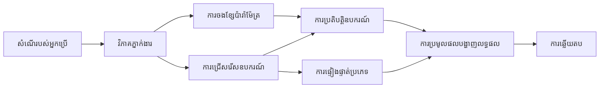

# 🛠️ ការប្រើប្រាស់ឧបករណ៍កម្រិតខ្ពស់ជាមួយ Azure OpenAI (Responses API) (.NET)

## 📋 គោលបំណងសិក្សា

សៀវភៅកំណត់ត្រានេះបង្ហាញរចនាប័ទ្មបញ្ចូលឧបករណ៍ថ្នាក់សហគ្រាសដោយប្រើ Microsoft Agent Framework នៅក្នុង .NET ជាមួយ Azure OpenAI (Responses API)។ អ្នកនឹងបានរៀនបង្កើតភ្នាក់ងារដែលស្មុគស្មាញជាមួយឧបករណ៍ជាច្រើនដែលមានជំនាញពិសេស អនុវត្តការប្រើ typing កំណត់រឹងនៃ C# និងលក្ខណៈពិសេសសហគ្រាសរបស់ .NET។

### សមត្ថភាពឧបករណ៍កម្រិតខ្ពស់ដែលអ្នកនឹងចេះធ្វើ

- 🔧 **រចនាសម្ព័ន្ធឧបករណ៍ជាច្រើន**៖ ការកសាងភ្នាក់ងារជាមួយសមត្ថភាពជំនាញពិសេសជាច្រើន
- 🎯 **ការប្រតិបត្តិឧបករណ៍ដោយប្រើការពិនិត្យប្រភេទសុវត្ថិភាព**៖ អភិវឌ្ឍការត្រួតពិនិត្យមុនចែកចាយរបស់ C#
- 📊 **គំរូឧបករណ៍សហគ្រាស**៖ ការរចនាឧបករណ៍ដែលរួចរាល់សម្រាប់ផលិតផល និងការគ្រប់គ្រងកំហុស
- 🔗 **ការរួមបញ្ចូលឧបករណ៍**៖ ការចងកបូបឧបករណ៍សម្រាប់ប្រតិបត្តិការ​ការងារជំនួញស្មុគស្មាញ

## 🎯 អត្ថប្រយោជន៍រចនាសម្ព័ន្ធឧបករណ៍ .NET

### លក្ខណៈពិសេសឧបករណ៍សហគ្រាស

- **ការត្រួតពិនិត្យមុនចែកចាយ**៖ ការប្រើ typing រឹងបញ្ចាក់ភាពត្រឹមត្រូវនៃប៉ារ៉ាម៉ែត្រ​ឧបករណ៍
- **ការបញ្ចូលអាស្រ័យការ**៖ ការរួមបញ្ចូល IoC container សម្រាប់ការគ្រប់គ្រងឧបករណ៍
- **រៀបចំជាទ្រង់ទ្រាយ Async/Await**៖ ការប្រតិបត្តិឧបករណ៍ដោយមិនរាំងខ្ទប់ជាមួយការគ្រប់គ្រងធនធានត្រឹមត្រូវ
- **កំណត់ហេតុដែលមានរចនាសម្ព័ន្ធ**៖ ការរួមបញ្ចូល logging សម្រាប់ការត្រួតពិនិត្យការប្រតិបត្តិឧបករណ៍

### គំរូដែលរួចរាល់សម្រាប់ផលិតផល

- **ការគ្រប់គ្រងករណីកំហុស**៖ ការគ្រប់គ្រងកំហុសយ៉ាងទូលំទូលាយជាមួយ exception ប្រភេទ
- **ការគ្រប់គ្រងធនធាន**៖ គំរូការចេញចោលត្រឹមត្រូវនិងគ្រប់គ្រងអង្គចងចាំ
- **ការត្រួតពិនិត្យប្រសិទ្ធភាព**៖ វិចិត្រសាស្ត្រនិងគន្ទនាវិចិត្រប្រសិទ្ធភាពដែលបានបង្កប់ក្នុង
- **ការគ្រប់គ្រងកំណត់រចនាសម្ព័ន្ធ**៖ កំណត់រចនាសម្ព័ន្ធដែលមាន typing សុវត្ថិភាពជាមួយការត្រួតពិនិត្យ

## 🔧 រចនាសម្ព័ន្ធបច្ចេកទេស

### គ្រឿងផ្សំនៃឧបករណ៍ស្នូល .NET

- **Microsoft.Extensions.AI**៖ ស្រទាប់ abstraction ហត្ថកម្មឧបករណ៍សមាសភាពតែមួយ
- **Microsoft.Agents.AI**៖ ការប្រតិបត្តិឧបករណ៍ថ្នាក់សហគ្រាស
- **Azure OpenAI (Responses API)**៖ អតិថិជន API មានប្រសិទ្ធភាពខ្ពស់ជាមួយការបំបែកការតភ្ជាប់

### សំណុំបែបបទបញ្ជារប្រតិបត្តិឧបករណ៍



## 🛠️ ប្រភេទឧបករណ៍ និងគំរូ

### 1. **ឧបករណ៍ដំណើរការទិន្នន័យ**

- **ការត្រួតពិនិត្យបញ្ចូល**៖ Typing រឹងជាមួយ annotation ទិន្នន័យ
- **ប្រតិបត្តិការបម្លែង**៖ ការបម្លែងទិន្នន័យដោយបច្ចេកវិទ្យាជាប្រភេទសុវត្ថិភាព និងការ​រៀបចំទ្រង់ទ្រាយ
- **តុល្យភាពអាជីវកម្ម**៖ ឧបករណ៍គណនា និងវិភាគចំនុចពិសេស
- **ការ​រៀបចំទ្រង់ទ្រាយចេញ**៖ ការបង្កើតការឆ្លើយតបដែលមានរចនាសម្ព័ន្ធ

### 2. **ឧបករណ៍រួមបញ្ចូល**

- **កុងណិកទ័រ API**៖ ការបញ្ជូលសេវាកម្ម RESTful ជាមួយ HttpClient
- **ឧបករណ៍ថតទិន្នន័យ**៖ ការរួមបញ្ចូល Entity Framework សម្រាប់ចូលដំណើរការទិន្នន័យ
- **ប្រតិបត្តិការឯកសារ**៖ ប្រតិបត្តិការប្រព័ន្ធឯកសារដោយមានការត្រួតពិនិត្យសុវត្ថិភាព
- **សេវាកម្មខាងក្រៅ**៖ គំរូការរួមបញ្ចូលសេវាកម្មភាគីទីបី

### 3. **ឧបករណ៍ប្រើប្រាស់**

- **ដំណើរការអត្ថបទ**៖ ការបដិសេធខ្សែអក្សរនិងឧបករណ៍រៀបចំទ្រង់ទ្រាយ
- **ប្រតិបត្តិការប្រចាំថ្ងៃ/ម៉ោង**៖ គណនា​កាលបរិច្ឆេទ/ម៉ោងដែលមានការយល់ដឹងពីវប្បធម៌
- **ឧបករណ៍គណិតវិទ្យា**៖ ការគណនាត្រឹមត្រូវ និងប្រតិបត្តិការអង្គការស្ថិតិ
- **ឧបករណ៍ត្រួតពិនិត្យ**៖ ការត្រួតពិនិត្យច្បាប់អាជីវកម្ម និងការពិនិត្យទិន្នន័យ

ត្រៀមខ្លួនសម្រាប់បង្កើតភ្នាក់ងារថ្នាក់សហគ្រាសជាមួយសមត្ថភាពឧបករណ៍មាន typing សុវត្ថិភាពខ្លាំងនៅក្នុង .NET? មករៀបចំដំណោះស្រាយថ្នាក់វិជ្ជាជីវៈ! 🏢⚡

## 🚀 ចាប់ផ្តើម

### លក្ខខណ្ឌមុន

- [.NET 10 SDK](https://dotnet.microsoft.com/download/dotnet/10.0) ឬខ្ពស់ជាងនេះ
- មាន [ការជាវ Azure](https://azure.microsoft.com/free/) ជាមួយធនធាន Azure OpenAI និងការដំឡើងម៉ូឌែល
- [Azure CLI](https://learn.microsoft.com/cli/azure/install-azure-cli) — ចូលដោយ `az login`

### អថេរបរិស្ថានទាមទារ

```bash
# zsh/bash
export AZURE_OPENAI_ENDPOINT=https://<your-resource>.openai.azure.com
export AZURE_OPENAI_DEPLOYMENT=gpt-4.1-mini
# បន្ទាប់មកចុះឈ្មោះចូល ដោយដើម្បីអោយ AzureCliCredential ទទួលបានសញ្ញាប័ត្រ<Token>
az login
```

```powershell
# PowerShell
$env:AZURE_OPENAI_ENDPOINT = "https://<your-resource>.openai.azure.com"
$env:AZURE_OPENAI_DEPLOYMENT = "gpt-4.1-mini"
# បន្ទាប់មកចូលដើម្បីឲ្យ AzureCliCredential អាចទទួលបានសញ្ញាប័ត្រtoken
az login
```

### កូដគំរូ

ដើម្បីរត់កូដគំរូ,

```bash
# zsh/bash
chmod +x ./04-dotnet-agent-framework.cs
./04-dotnet-agent-framework.cs
```

ឬប្រើ dotnet CLI:

```bash
dotnet run ./04-dotnet-agent-framework.cs
```

មើល [`04-dotnet-agent-framework.cs`](../../../../04-tool-use/code_samples/04-dotnet-agent-framework.cs) សម្រាប់កូដពេញ

```csharp
#!/usr/bin/dotnet run

#:package Microsoft.Extensions.AI@10.*
#:package Microsoft.Agents.AI.OpenAI@1.*-*
#:package Azure.AI.OpenAI@2.1.0
#:package Azure.Identity@1.13.1

using System.ComponentModel;

using Microsoft.Agents.AI;
using Microsoft.Extensions.AI;

using Azure.AI.OpenAI;
using Azure.Identity;

// Tool Function: Random Destination Generator
// This static method will be available to the agent as a callable tool
// The [Description] attribute helps the AI understand when to use this function
// This demonstrates how to create custom tools for AI agents
[Description("Provides a random vacation destination.")]
static string GetRandomDestination()
{
    // List of popular vacation destinations around the world
    // The agent will randomly select from these options
    var destinations = new List<string>
    {
        "Paris, France",
        "Tokyo, Japan",
        "New York City, USA",
        "Sydney, Australia",
        "Rome, Italy",
        "Barcelona, Spain",
        "Cape Town, South Africa",
        "Rio de Janeiro, Brazil",
        "Bangkok, Thailand",
        "Vancouver, Canada"
    };

    // Generate random index and return selected destination
    // Uses System.Random for simple random selection
    var random = new Random();
    int index = random.Next(destinations.Count);
    return destinations[index];
}

// Azure OpenAI with the Responses API (stable v1 endpoint). Sign in with `az login`.
var azureEndpoint = Environment.GetEnvironmentVariable("AZURE_OPENAI_ENDPOINT")
    ?? throw new InvalidOperationException("AZURE_OPENAI_ENDPOINT is not set.");
var deployment = Environment.GetEnvironmentVariable("AZURE_OPENAI_DEPLOYMENT") ?? "gpt-4.1-mini";

var azureClient = new AzureOpenAIClient(new Uri(azureEndpoint), new AzureCliCredential());

// Define Agent Identity and Comprehensive Instructions
// Agent name for identification and logging purposes
var AGENT_NAME = "TravelAgent";

// Detailed instructions that define the agent's personality, capabilities, and behavior
// This system prompt shapes how the agent responds and interacts with users
var AGENT_INSTRUCTIONS = """
You are a helpful AI Agent that can help plan vacations for customers.

Important: When users specify a destination, always plan for that location. Only suggest random destinations when the user hasn't specified a preference.

When the conversation begins, introduce yourself with this message:
"Hello! I'm your TravelAgent assistant. I can help plan vacations and suggest interesting destinations for you. Here are some things you can ask me:
1. Plan a day trip to a specific location
2. Suggest a random vacation destination
3. Find destinations with specific features (beaches, mountains, historical sites, etc.)
4. Plan an alternative trip if you don't like my first suggestion

What kind of trip would you like me to help you plan today?"

Always prioritize user preferences. If they mention a specific destination like "Bali" or "Paris," focus your planning on that location rather than suggesting alternatives.
""";

// Create AI Agent with Advanced Travel Planning Capabilities
// Get the Responses client for the deployment and create the AI agent
// Configure agent with name, detailed instructions, and available tools
// This demonstrates the .NET agent creation pattern with full configuration
AIAgent agent = azureClient
    .GetChatClient(deployment)
    .AsAIAgent(
        name: AGENT_NAME,
        instructions: AGENT_INSTRUCTIONS,
        tools: [AIFunctionFactory.Create(GetRandomDestination)]
    );

// Create New Conversation Session for Context Management
// Initialize a new conversation session to maintain context across multiple interactions
// Sessions enable the agent to remember previous exchanges and maintain conversational state
// This is essential for multi-turn conversations and contextual understanding
await using var session = await agent.CreateSessionAsync();

// Execute Agent: First Travel Planning Request
// Run the agent with an initial request that will likely trigger the random destination tool
// The agent will analyze the request, use the GetRandomDestination tool, and create an itinerary
// Using the session parameter maintains conversation context for subsequent interactions
await foreach (var update in agent.RunStreamingAsync("Plan me a day trip", session))
{
    await Task.Delay(10);
    Console.Write(update);
}

Console.WriteLine();

// Execute Agent: Follow-up Request with Context Awareness
// Demonstrate contextual conversation by referencing the previous response
// The agent remembers the previous destination suggestion and will provide an alternative
// This showcases the power of conversation sessions and contextual understanding in .NET agents
await foreach (var update in agent.RunStreamingAsync("I don't like that destination. Plan me another vacation.", session))
{
    await Task.Delay(10);
    Console.Write(update);
}
```

---

<!-- CO-OP TRANSLATOR DISCLAIMER START -->
**ការបដិសេធ**:
ឯកសារនេះត្រូវបានបម្លែងភាសា ដោយប្រើសេវាបម្លែងភាសា AI [Co-op Translator](https://github.com/Azure/co-op-translator)។ ទោះយើងខ្ញុំមានក្តីប្រាថ្នាឱ្យបានច្បាស់លាស់ តែសូមយល់ដឹងថាការបម្លែងដោយស្វ័យប្រវត្តិក៏អាចមានកំហុសឬភាពមិនត្រឹមត្រូវ។ ឯកសារដើមជាភាសាទីតាំងគួរត្រូវបានគេប្រើជាប្រភពច្បាស់លាស់។ សម្រាប់ព័ត៌មានសំខាន់ៗ សូមណែនាំឱ្យប្រើប្រាស់ការប្រែដោយមនុស្សជំនាញ។ យើងខ្ញុំមិនទទួលខុសត្រូវចំពោះការយល់ច្រឡំ ឬការបកស្រាយខុសបន្ទាប់ពីការប្រើប្រាស់ការបម្លែងនេះនោះទេ។
<!-- CO-OP TRANSLATOR DISCLAIMER END -->