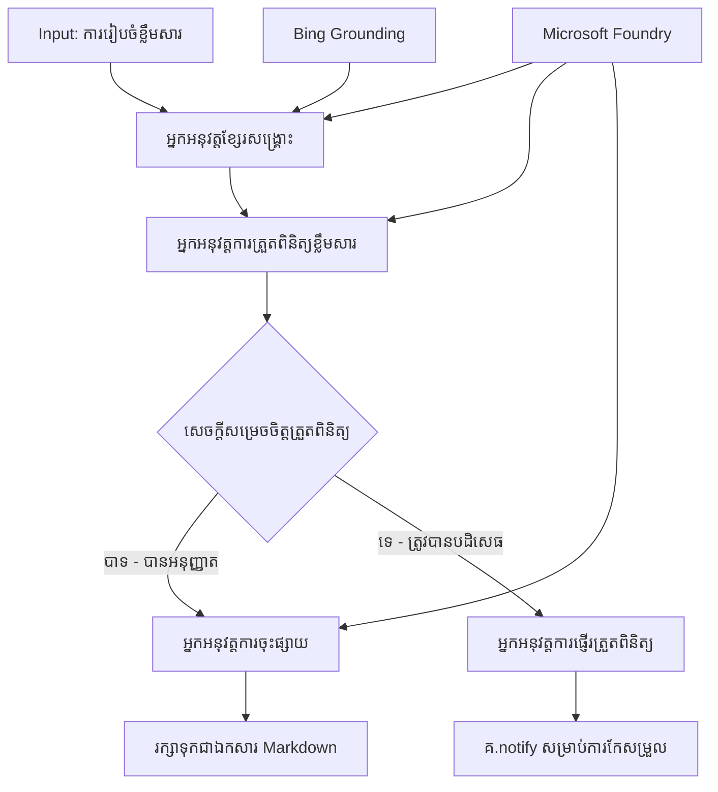

# 🔀 ដំណើរការប្រតិបត្តិការជាមួយភ្នាក់ងារជាមួយ Microsoft Foundry (.NET)

## 📋 មេរៀនផ្ទាល់ខ្លួនលើដំណើរការសម្រេចចិត្តយ៉ាងឆ្លាតវៃ

សៀវភៅកំណត់ត្រានេះបង្ហាញពី **លំនាំដំណើរការជាមួយលក្ខខណ្ឌ** ដោយប្រើ Microsoft Foundry និង Microsoft Agent Framework សម្រាប់ .NET។ អ្នកនឹងរៀនពីរបៀបបង្កើតដំណើរការដែលមានកំណត់ដោយសំឡេងសម្រេចចិត្តបច្ចេកវិទ្យាដែលផ្លូវការចាកចេញដោយយុទ្ធសាស្រ្ត AI ការវិភាគ ច្បាប់អាជីវកម្ម និងលក្ខណៈប្រែប្រួលសម្រាប់អូតូម៉ាស្យុងកម្រិតសហគ្រាស។

## 🎯 គោលដៅការសិក្សា

### 🧠 **រចនាសម្ព័ន្ធសម្រេចចិត្តយ៉ាងឆ្លាតវៃ**
- **ការអនុវត្តតួបណ្ដើរ​តាមលក្ខខណ្ឌ**៖ បង្កើតដើមឈើសម្រេចចិត្តស្មុគស្មាញជាមួយចំណុចបង្ហាញច្រើន
- **ការផ្គត់ផ្គង់ផ្លូវដោយបច្ចេកវិទ្យា AI**៖ ប្រើម៉ូដែល Microsoft Foundry ដើម្បីធ្វើការសម្រេចចិត្តផ្លូវការឆ្លាតវៃ
- **ការកែសម្រួលដំណើរការដោយបម្លែង**៖ ប្ដូរប្រព្រឹត្តិការណ៍ដំណើរការផ្អែកលើការវិភាគហើយលក្ខខណ្ឌដំណើរការ​ពេល​រត់
- **ការរួមបញ្ចូលច្បាប់សហគ្រាស**៖ បញ្ចូលលក្ខខណ្ឌអាជីវកម្ម និងការបញ្ជាក់ តាមតំរូវការចូលក្នុងដំណើរការ

### 🔀 **លំនាំលក្ខខណ្ឌកម្រិតខ្ពស់**
- **សម្រេចចិត្តអ្នកភាគហ៊ុនច្រើន**៖ ប៉ាន់ប្រមាណកត្តាជាច្រើនសម្រាប់សម្រេចផ្លូវ
- **កំណត់ភាគហ៊ុនប្រតិបត្តិបរិបទ**៖ សម្រេចចិត្តផ្អែកលើបរិបទនិងប្រវត្តិដំណើរការ
- **ការកែប្រែដំណើរការតាមបម្លែង**៖ តម្រូវផ្លូវដំណើរការដោយបញ្ជាតាមលក្ខខណ្ឌពេលវេលាពិត
- **ការរួមបញ្ចូលម៉ាស៊ីនច្បាប់**៖ អនុវត្តម៉ាស៊ីនច្បាប់អាជីវកម្មស្មុគស្មាញនៅក្នុងដំណើរការ

### 🏢 **កម្មវិធីលក្ខខណ្ឌសហគ្រាស**
- **ការតម្រៀបឯកសារនិងផ្លូវការផ្ញើ**៖ ដាក់ចំណាត់ថ្នាក់ឯកសារដោយស្វ័យប្រវត្តិ និងផ្ញើឯកសារទៅដំណើរការដែលសមរម្យ
- **ជំនួយសេវាកម្មអតិថិជន**៖ ផ្លូវការចុះទៅក្រុមអ្នកដំណោះស្រាយពិសេស
- **ការត្រួតពិនិត្យតាមការអនុម័តនិងហានិភ័យ**៖ អនុវត្តការត្រួតពិនិត្យផ្សេងៗ ដោយផ្អែកលើការវាយតម្លៃហានិភ័យ
- **ដំណើរការធានាគុណភាព**៖ ផ្លូវការជាមធ្យោបាយត្រួតពិនិត្យគុណភាពផ្តល់ដោយផ្អែកលើគោលការណ៍គុណភាព

## ⚙️ ការតម្រូវ និងការរៀបចំ

### 📦 **កញ្ចប់ NuGet តម្រូវការ**

កញ្ចប់កម្រិតខ្ពស់សម្រាប់ដំណើរការលក្ខខណ្ឌ:

```xml
<!-- Core AI Framework -->
<PackageReference Include="Microsoft.Extensions.AI" Version="9.9.0" />

<!-- Azure AI Agents with Persistent State -->
<PackageReference Include="Azure.AI.Agents.Persistent" Version="1.2.0-beta.5" />

<!-- Azure Identity and Utilities -->
<PackageReference Include="Azure.Identity" Version="1.15.0" />
<PackageReference Include="System.Linq.Async" Version="6.0.3" />
<PackageReference Include="DotNetEnv" Version="3.1.1" />

<!-- Local Workflow Framework References -->
<!-- Microsoft.Agents.Workflows.dll - Advanced workflow orchestration -->
<!-- Microsoft.Agents.AI.AzureAI.dll - Microsoft Foundry integration -->
<!-- Microsoft.Agents.AI.dll - Core agent abstractions -->
```

### 🔑 **ការកំណត់ Microsoft Foundry**

**ធនធាន Azure តម្រូវការ៖**
- ស្ថានីយកម្ម Microsoft Foundry ជាមួយម៉ូដែលដំណើរការលក្ខខណ្ឌ
- ការជាវ Azure ជាមួយគណនីកំណត់សិទ្ធិ និងកម្រិតគណនា
- ម៉ូដែល AI 已ប្រើសម្រាប់ការសម្រេចចិត្តនិងការវិភាគមាតិកា
- (ជាជម្រើស) ការតភ្ជាប់ Bing Search API សម្រាប់ការកំណត់ផែនដី

**ការកំណត់បរិបទ (.env ឯកសារ):**
```env
# Microsoft Foundry Configuration
AZURE_AI_PROJECT_ENDPOINT=https://your-project.cognitiveservices.azure.com/
BING_CONNECTION_ID=your-bing-connection-id
```

**ការកំណត់អត្តសញ្ញាណ:**
```csharp
// Azure CLI or Managed Identity authentication
using Azure.Identity;
var credential = new AzureCliCredential();

// Load environment configuration
DotNetEnv.Env.Load("../../../.env");
```

### 🏗️ **រចនាសម្ព័ន្ធដំណើរការលក្ខខណ្ឌ**



**គ្រឿងផ្សំសំខាន់ៗ៖**
- **Draft Executor**: ភ្នាក់ងារផលិតគំនូរសេចក្តីព្រាងពីសេចក្តីរៀបចំ
- **Content Review Executor**: ភ្នាក់ងារវាយតម្លៃគុណភាពសេចក្តីព្រាង និងការអនុវត្តភាសី
- **Conditional Routing**: តុល្យថ្លៃសម្រេចចិត្តផ្លូវជាតំណភ្ជាប់លទ្ធផលពិនិត្យ
- **Publish/Review Paths**: ផ្លូវដំណើរការផ្សេងៗសម្រាប់មាតិកាដែលបានអនុម័តនិងបដិសេធ
- **State Management**: ខ្ចីបរិបទពិនិត្យនិងមាតិកាទាំងមូលក្នុងដំណើរការ

## 🎨 **លំនាំរចនាដំណើរការលក្ខខណ្ឌ**

### 📋 **ផលិតមាតិកាជាមួយទ្វារគុណភាព**
```
Outline → Draft Creation → Quality Review → {Approve: Publish | Reject: Revise}
```

### 🎯 **ដំណើរការឯកសារតាមហានិភ័យ**
```
Document → Risk Assessment → {Low: Standard | High: Enhanced Review}
```

### 🔍 **ផ្លូវការជំនួយអតិថិជនយ៉ាងឆ្លាតវៃ**
```
Customer Query → Analysis → {Simple: FAQ Bot | Complex: Human Agent}
```

### 💼 **ដំណើរការដាក់ចេញដោយការអនុវត្តតាមច្បាប់**
```
Content → Compliance Check → {Pass: Publish | Fail: Legal Review}
```

## 🏢 **អត្ថប្រយោជន៍លក្ខខណ្ឌសហគ្រាស**

### 🎯 **អូតូម៉ាស្យុងយ៉ាងឆ្លាតវៃ**
- **សម្រេចចិត្តយ៉ាងច្បាស់លាស់**: ផ្លូវការដោយ AI នៅលើការវិភាគមាតិកានិងបរិបទ
- **ការប្តូរប្រព្រឹត្តការណ៍តាមបម្លែង**: ដំណើរការដែលប្ដូរទៅតាមលក្ខខណ្ឌប្រែប្រួល
- **អនុវត្តច្បាប់អាជីវកម្ម**: អនុវត្តអត្តន័យច្បាប់ស្មុគស្មាញនិងគោលនយោបាយដោយស្វ័យប្រវត្តិ
- **ការផ្លូវការដោយបរិបទ**: សម្រេចចិត្តដោយផ្អែកលើប្រវត្តិដំណើរការជាមូលដ្ឋាននិងបរិបទបូកបន្ថែម

### 📈 **លើកកំពស់ប្រតិបត្តិការ**
- **ការចែកចាយធនធានបានបញ្ចេញល្អ**: ផ្លូវការការងារទៅអ្នកជំនាញនិងដំណើរការដែលសមរម្យបំផុត
- **កាត់បន្ថយការជ្រៀតចូលដោយមនុស្ស**: ការសម្រេចចិត្តដោយស្វ័យប្រវត្តិកាត់បន្ថយការទាមទារជំនួយមនុស្ស
- **ពេលវេលាការដោះស្រាយរហ័ស**: ផ្លូវការចូលទៅអ្នកជំនាញនិងសមត្ថភាពដំណើរការថ្មីច្បាស់លាស់
- **ការអនុវត្តខ្ពស់ជានិរន្តរភាព**: អនុវត្តច្បាប់អាជីវកម្មនិងកម្រិតសម្រេចចិត្តយ៉ាងសមស្រប

### 🛡️ **ការគ្រប់គ្រងហានិភ័យ និងបំពេញតាមវិន័យ**
- **ការវាយតម្លៃហានិភ័យដោយអយ្យាថ្មី**: ការវាយតម្លៃមាតិកានិងគ្រោះថ្នាក់ដោយ AI
- **ការអនុវត្តតាមវិន័យ**: ផ្លូវការស្វ័យប្រវត្តិសម្រាប់ដំណើរការតាមតម្រូវការនៃវិន័យ
- **ការអនុវត្តវិធានសន្តិសុខ**: មធ្យោបាយសន្តិសុខបន្ថែមឡើងវិញនៅលើការវាយតម្លៃហានិភ័យ
- **ការរក្សាទុកវិញ្ញាបនបត្រតាមការ**: ឯកសារពេញលេញពីការសម្រេចចិត្តផ្លូវការនិងហេតុផល

### 📊 **វិភាគ និងការកែលម្អបន្ត**
- **វិភាគការសម្រេចចិត្ត**: តាមដានប្រសិទ្ធភាពនិងភាពត្រឹមត្រូវនៃការសម្រេចផ្លូវ
- **ការទទួលស្គាល់លំនាំ**: សម្គាល់និន្នាការ និងលំនាំនៅក្នុងការសម្រេចផ្លូវជាយូរមកហើយ
- **ការបង្កើនប្រសិទ្ធភាព**: កែលម្អចាប់តាំងពីការសម្រេចចិត្តនិងប្រសិទ្ធភាពផ្លូវការ
- **ទិន្នន័យអាជីវកម្ម**: ទស្សនៈលើគុណលក្ខណ៍មាតិកានិងតម្រូវការដំណើរការ

### 🔧 **លើកកម្ពស់បច្ចេកទេស**
- **ការគ្រប់គ្រងស្ថានភាពបន្តៗ**: រក្សាប្រវត្តិស្ថានភាពស្មុគស្មាញអំឡុងការអនុវត្តដំណើរការ
- **រចនាសម្ព័ន្ធដែលអាចពង្រីក**: ការដោះស្រាយតម្រូវការដំណើរការលក្ខខណ្ឌបរិមាណខ្ពស់
- **សមាសភាពរួមបញ្ចូល**: ភ្ជាប់ទៅប្រព័ន្ធនិងដំណើរការអាជីវកម្មដែលមានស្រេច
- **ការតាមដាន និងមើលស្តង់ដា**: តាមដានសមត្ថភាពនិងការសម្រេចចិត្តដំណើរការ

អ្នកចាប់ផ្តើមបង្កើតដំណើរការសហគ្រាសឆ្លាតវៃដោយសម្រេចចិត្តជាមួយ .NET! 🚀

## 💻 ការរត់កូដ

ការអនុវត្តពេញលេញ មានក្នុង `04.dotnet-agent-framework-workflow-aifoundry-condition.cs`។ នេះបង្ហាញពី **ដំណើរការផលិតមាតិកាជាមួយទ្វារគុណភាព**៖

### 🏗️ **រចនាសម្ព័ន្ធដំណើរការ**

```
Content Outline → Draft Creation → Quality Review → Conditional Routing:
                                                      ├─ Approved (>200 words) → Publish
                                                      └─ Rejected (<200 words) → Review Notification
```

**ភ្នាក់ងារនៅក្នុងដំណើរការ:**
1. **Evangelist Agent**: បង្កើតសេចក្តីព្រាងមេរៀនពីសេចក្តីរៀបចំជាមួយ Bing grounding
2. **Content Reviewer Agent**: វាយតម្លៃគុណភាពសេចក្តីព្រាង (ចំនួនពាក្យ, ភាពពេញលេញ)
3. **Publisher Agent**: រក្សាទុកមាតិកាដែលបានអនុម័តជាឯកសារ Markdown មានម៉ោងពេល

**អ្នកអនុវត្តផ្ទាល់ខ្លួន:**
1. **DraftExecutor**: គ្រប់គ្រងការបង្កើតសេចក្តីព្រាង
2. **ContentReviewExecutor**: អនុវត្តការវាយតម្លៃគុណភាព
3. **PublishExecutor**: គ្រប់គ្រងការផ្សព្វផ្សាយមាតិកាដែលបានអនុម័ត
4. **SendReviewExecutor**: គ្រប់គ្រងការបញ្ជូនការជូនដំណឹងពីឯកសារដែលត្រូវបដិសេធ

### 🚀 ការរត់ឧទាហរណ៍

**លក្ខខណ្ឌជាមុន:**
- ការកំណត់ស្ថានីយ Microsoft Foundry
- ការផ្ទៀងផ្ទាត់ CLI Azure (`az login`)
- (ជាជម្រើស) ការតភ្ជាប់ Bing Search សម្រាប់ការកំណត់ផែនដី

```bash
# ធ្វើឱ្យស្គ្រីបអាចអនុវត្តបាន (Unix/Linux/macOS)
chmod +x 04.dotnet-agent-framework-workflow-aifoundry-condition.cs

# ប្រតិបត្តិចរន្តការងារដែលមានលក្ខខ័ណ្ឌ
./04.dotnet-agent-framework-workflow-aifoundry-condition.cs
```

ឬនៅលើ Windows:
```powershell
dotnet run 04.dotnet-agent-framework-workflow-aifoundry-condition.cs
```

### 📝 លទ្ធផលដែលរំពឹងទុក

ដំណើរការនឹង:
1. **បង្កើតភ្នាក់ងារ**: ចាប់ផ្តើមភ្នាក់ងារពិសេស Microsoft Foundry ចំនួនបី
2. **បង្កើតសេចក្តីព្រាង**: ភ្នាក់ងារ Evangelist បង្កើតសេចក្តីព្រាងមេរៀនពីសេចក្តីរៀបចំ
3. **ពិនិត្យមាតិកា**: ផ្ញើរ Content Reviewer វាយតម្លៃគុណភាពសេចក្តីព្រាង
4. **ផ្លូវការតាមលក្ខខណ្ឌ**:
   - **បើអនុម័ត (>200 ពាក្យ)**: Publish Executor រក្សាទុកជាឯកសារ Markdown
   - **បើបដិសេធ (<200 ពាក្យ)**: ផ្ញើការជូនដំណឹងពិនិត្យឡើងវិញ
5. **បង្ហាញលទ្ធផល**: បង្ហាញលទ្ធផលចុងក្រោយនៃដំណើរការ

### 🔧 ជម្រើសកែសម្រួល

**កែប្រែលក្ខខណ្ឌពិនិត្យ:**
```csharp
const string ContentReviewerInstructions = @"
You are a content reviewer...
1. Check if content is more than 500 words (instead of 200)
2. Verify technical accuracy
3. Ensure proper formatting
...";
```

**បន្ថែមផ្លូវលក្ខខណ្ឌបន្ថែម:**
```csharp
var workflow = new WorkflowBuilder(draftExecutor)
    .AddEdge(draftExecutor, contentReviewerExecutor)
    .AddEdge(contentReviewerExecutor, publishExecutor, condition: GetCondition("Excellent"))
    .AddEdge(contentReviewerExecutor, editExecutor, condition: GetCondition("Good"))
    .AddEdge(contentReviewerExecutor, sendReviewerExecutor, condition: GetCondition("Poor"))
    .Build();
```

**ផ្លាស់ប្ដូរតម្រូវការមាតិកា:**
```csharp
string OUTLINE_Content = @"
# Your Custom Topic
## Section 1
https://your-reference-url
## Section 2
...
";
```

### 🎯 កម្មវិធីពិភពលោកពិត

លំនាំដំណើរការលក្ខខណ្ឌនេះសមរម្យសម្រាប់:
- **ប្រព័ន្ធគ្រប់គ្រងមាតិកា**: ដំណើរការ​ផ្ទាល់​ខ្លួន​តាម​ស្វ័យប្រវត្តិ​ដោយទ្វារគុណភាព
- **ដំណើរការឯកសារ**: ផ្លូវការដោយផ្អែកលើចំណាត់ថ្នាក់និងការអនុវត្តតាមវិន័យ
- **ជំនួយអតិថិជន**: ផ្លូវការចូលទៅតាមសំបុត្រដោយផ្អែកលើភាពស្មុគស្មាញ និងប្រញាប់
- **ការត្រួតពិនិត្យផ្នែកច្បាប់**: ផ្លូវការចូលទៅតាមកិច្ចសន្យាតាមការវាយតម្លៃហានិភ័យនិងតម្លៃ
- **ដំណើរការពិភាក្សាមនុស្សធម៌**: ផ្លូវការចូលដំណើរការលោកម្មើសមស្រប

### 🔍 ការយល់ដឹងពីតុល្យភាពលក្ខខណ្ឌ

**មុខងារលក្ខខណ្ឌ:**
```csharp
public Func<object?, bool> GetCondition(string expectedResult) =>
    reviewResult => reviewResult is ReviewResult review && review.Result == expectedResult;
```

មុខងារនេះបង្កើតពាក្យថាកំណត់៖
1. ពិនិត្យមើលថាលទ្ធផលមានប្រភេទ `ReviewResult`
2. ផ្ទៀងផ្ទាត់គុណ `Result` ជាមួយតម្លៃដែលរំពឹងទុក
3. ផ្ដល់តម្លៃពិត/មិនពិតសម្រាប់កំណត់ផ្លូវ

**ដែនដំណើរការជាមួយលក្ខខណ្ឌ:**
```csharp
.AddEdge(contentReviewerExecutor, publishExecutor, condition: GetCondition("Yes"))
.AddEdge(contentReviewerExecutor, sendReviewerExecutor, condition: GetCondition("No"))
```

### 📊 លក្ខណៈចម្រុះកម្រិតខ្ពស់

**ការត្រួតពិនិត្យស៊ីមា JSON:**
ដំណើរការប្រើស៊ីមា JSON ដើម្បីធានាពីចម្លើយមានរចនាសម្ព័ន្ធ

```csharp
// Define response structure
public class ReviewResult
{
    [JsonPropertyName("review_result")]
    public string Result { get; set; } = string.Empty;
    
    [JsonPropertyName("reason")]
    public string Reason { get; set; } = string.Empty;
    
    [JsonPropertyName("draft_content")]
    public string DraftContent { get; set; } = string.Empty;
}

// Apply to agent
ResponseFormat = ChatResponseFormat.ForJsonSchema(
    AIJsonUtilities.CreateJsonSchema(typeof(ReviewResult)), 
    "ReviewResult", 
    "Review Result From DraftContent"
)
```

**ការរួមបញ្ចូលការកំណត់ផែនដី Bing:**
ភ្នាក់ងារ Evangelist ប្រើការកំណត់ផែនដី Bing ដើម្បីចូលប្រើព័ត៌មានពេលវេលាពិត

```csharp
var bingGroundingConfig = new BingGroundingSearchConfiguration(bing_conn_id);
BingGroundingToolDefinition bingGroundingTool = new(
    new BingGroundingSearchToolParameters([bingGroundingConfig])
);
```

នេះអនុញ្ញាតឲ្យភ្នាក់ងារតាមដាន URL ក្នុងសេចក្តីរៀបចំនិងទាញយកព័ត៌មានបច្ចុប្បន្ន។

### 🛡️ ការដោះស្រាយកំហុស

ដំណើរការរួមបញ្ចូលការដោះស្រាយកំហុសរឹងមាំសម្រាប់មាតិកាដែលត្រូវបានបដិសេធ:
- ការបដិសេធពិនិត្យបណ្តាលអោយផ្លូវផ្សេង
- ការជូនដំណឹងផ្តល់មូលហេតុបដិសេធច្បាស់
- មាតិកាត្រូវបានរក្សាទុកសម្រាប់ការកែសម្រួល

### 🔄 ការពង្រីកដំណើរការ

**បន្ថែម លោបូសង្រ្គោះ:**
បង្កើតរង្វង់ឆ្លងមកវិញសម្រាប់ព្រាងមាតិកាដោយស្វ័យប្រវត្តិ:

```csharp
.AddEdge(contentReviewerExecutor, publishExecutor, condition: GetCondition("Yes"))
.AddEdge(contentReviewerExecutor, draftExecutor, condition: GetCondition("No")) // Loop back
```

**អនុវត្តការវិភាគមេរៀនច្រើនជាន់:**
បន្ថែមជាន់ពិនិត្យជាច្រើនជាមួយលក្ខខណ្ឌផ្សេងៗ:

```csharp
.AddEdge(draftExecutor, technicalReviewer)
.AddEdge(technicalReviewer, editorialReviewer, condition: GetCondition("TechPass"))
.AddEdge(editorialReviewer, publishExecutor, condition: GetCondition("EditPass"))
```

លំនាំដំណើរការលក្ខខណ្ឌនេះផ្តល់មូលដ្ឋានសម្រាប់បង្កើតប្រព័ន្ធអូតូម៉ាស្យុងសហគ្រាសស្មុគស្មាញឆ្លាតវៃ! 🚀

---

<!-- CO-OP TRANSLATOR DISCLAIMER START -->
**ការបដិសេធ**:
ឯកសារនេះត្រូវបានបម្លែងភាសា ដោយប្រើសេវាបម្លែងភាសា AI [Co-op Translator](https://github.com/Azure/co-op-translator)។ ទោះយើងខ្ញុំមានក្តីប្រាថ្នាឱ្យបានច្បាស់លាស់ តែសូមយល់ដឹងថាការបម្លែងដោយស្វ័យប្រវត្តិក៏អាចមានកំហុសឬភាពមិនត្រឹមត្រូវ។ ឯកសារដើមជាភាសាទីតាំងគួរត្រូវបានគេប្រើជាប្រភពច្បាស់លាស់។ សម្រាប់ព័ត៌មានសំខាន់ៗ សូមណែនាំឱ្យប្រើប្រាស់ការប្រែដោយមនុស្សជំនាញ។ យើងខ្ញុំមិនទទួលខុសត្រូវចំពោះការយល់ច្រឡំ ឬការបកស្រាយខុសបន្ទាប់ពីការប្រើប្រាស់ការបម្លែងនេះនោះទេ។
<!-- CO-OP TRANSLATOR DISCLAIMER END -->